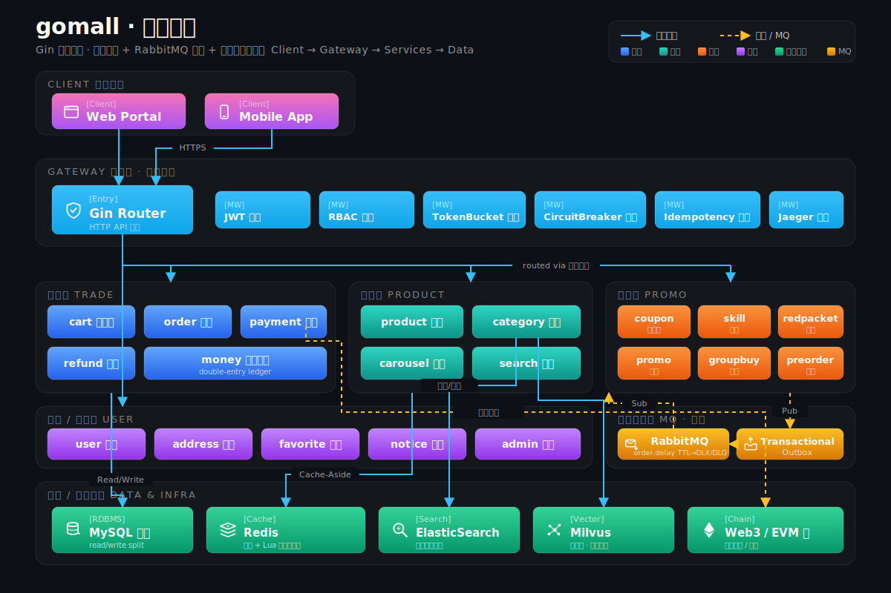
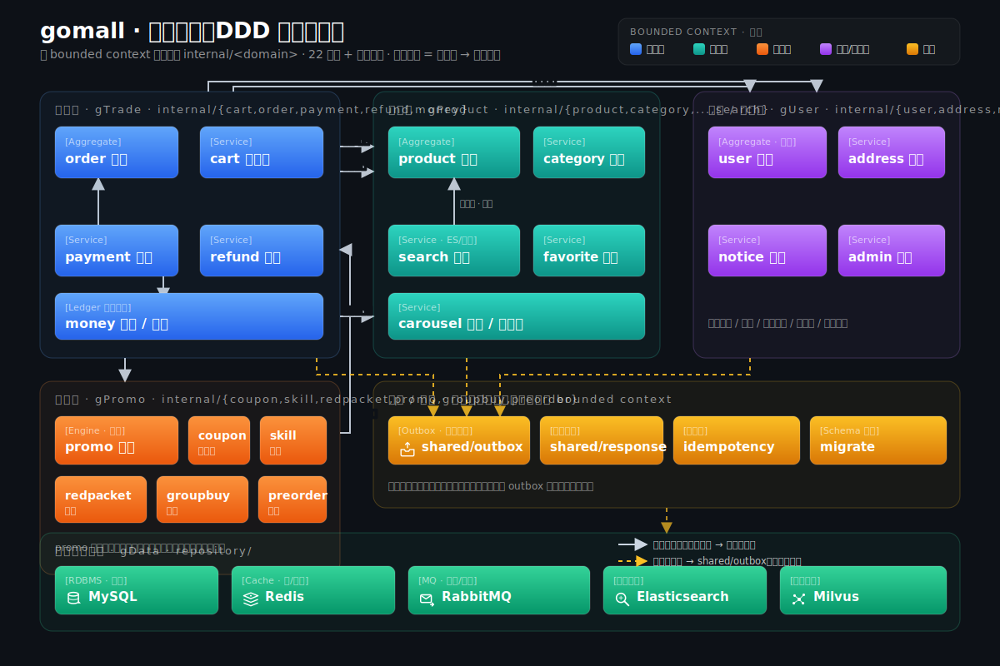
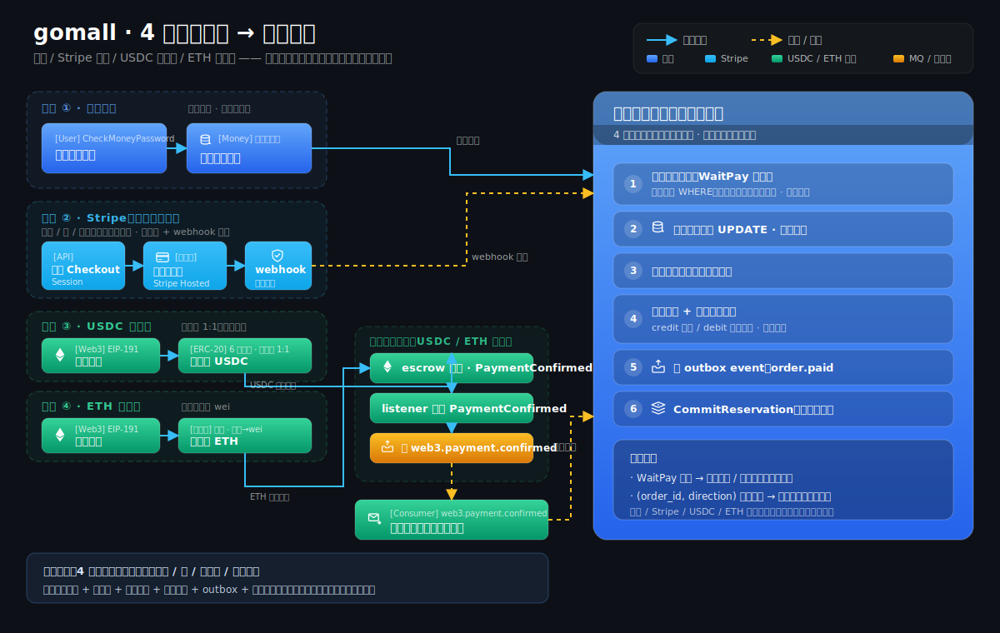
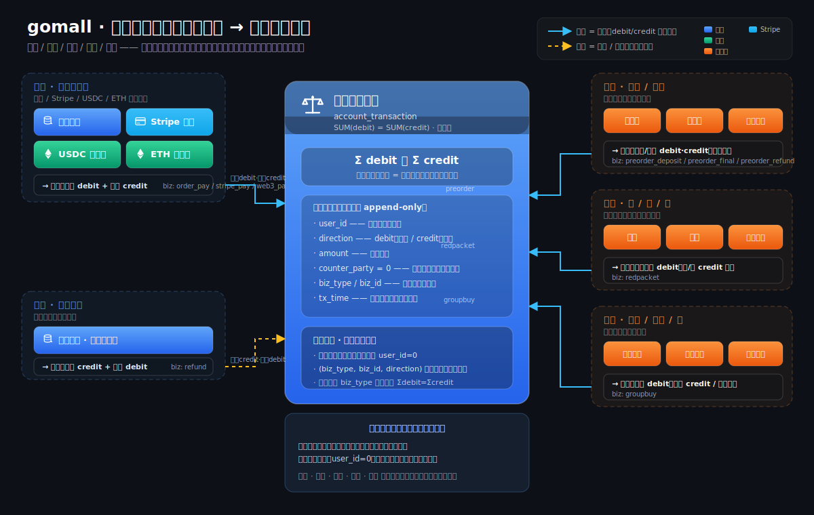
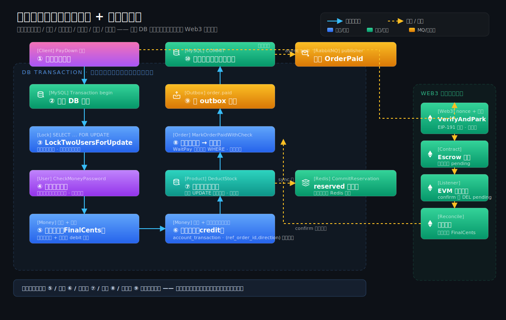
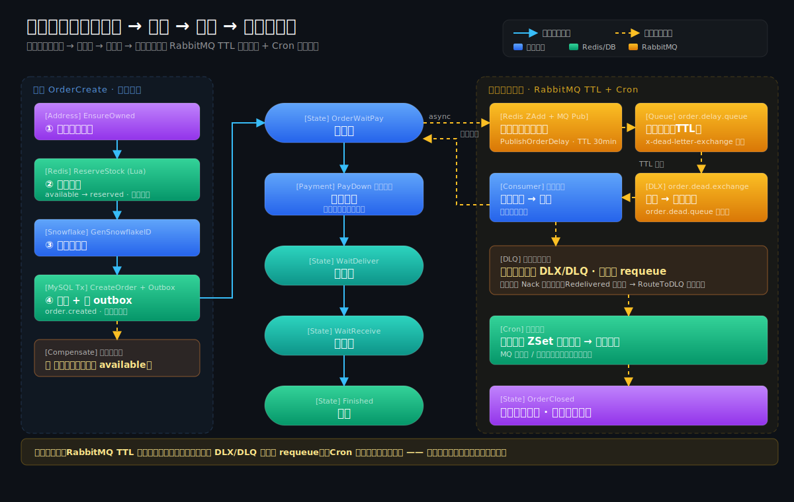
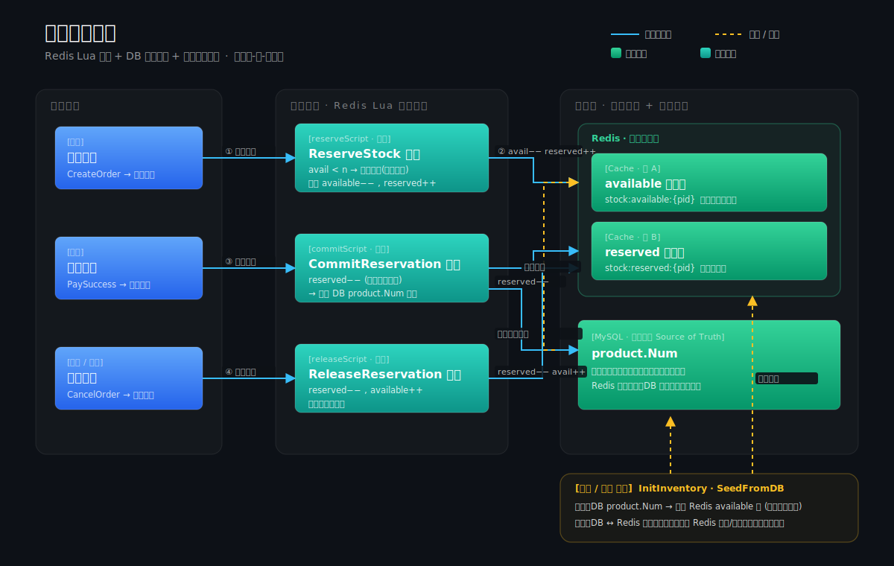
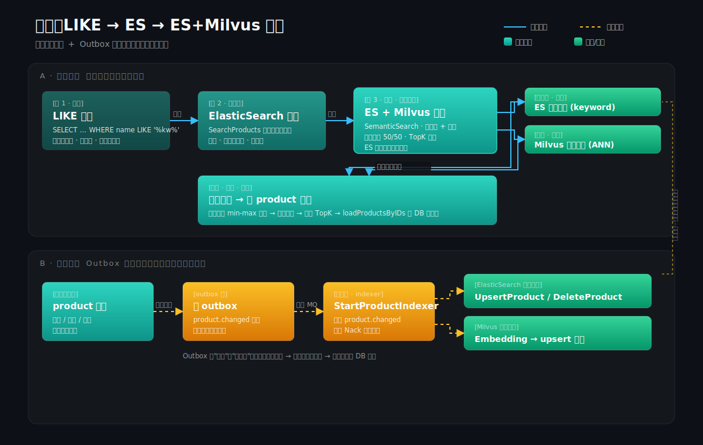

# gomall

用 Go + Gin 写的电商后端，从浏览、下单、支付、履约，到优惠券、Web3 支付、向量检索都有。

每个模块配了压测报告（`stressTest/REPORT.md`）、一套 Beamer slides（`docs/slides/`，12 份）和一篇博客（`docs/blog/`），把当初为什么这么设计也写下来了。

---

## 项目定位

不是 toy demo。重点是把真实电商里那些"该怎么选"的地方讲清楚。

一笔订单从下单到收货要过二十多个技术环节，每环都得回答四件事：业务要什么、系统怎么做、出错怎么兜底、客服怎么跟用户说。代码加上 12 份 slides、11 篇博客，把这些连同压测数字和待办一块写了下来。

适合工作一到三年的后端拿来练手，也适合准备答辩、面试，或者面试官拿来看候选人的系统设计深度。

---

## 业务全景

| 角色 | 关心的事 | gomall 提供 |
|------|---------|------------|
| **C 端用户** | 搜得到 / 买得了 / 不超卖 / 钱安全 / 出错有交代 | ES + Milvus 搜索 / 库存预扣 / 抢红包 / AES 金额加密 / 70001-70002 业务码 |
| **商家** | 我卖了多少 / 哪个 SKU 缺货 / 钱什么时候到 | BossID 数据基础 ✓ / merchant 自助 API（路线图）/ 库存告警事件 ✓ |
| **运营 / 平台** | 大促能不能扛 / 黑产怎么挡 / GMV 受影响多少 | TokenBucket + SlidingWindow + CircuitBreaker / 双 11 异步下单削峰 |
| **客服** | 用户怒投诉时能不能给个交代 | 完整业务码表 + 客服话术（70001 限流 / 70002 熔断 / 50001 缺货 / RP-EMPTY 红包抢完）|
| **SRE / 法务** | 99.95% 可用、合规、链路追溯 | Jaeger 链路追踪 / Skywalking / 静默降级 / Web3 链上对账 |

12 份业务侧 deck 就是按这个全景拆开讲的（见下表）。

---

## 系统架构

### 整体架构

客户端 → Gin Router + 中间件链（JWT / RBAC / 限流 / 熔断 / 幂等 / Jaeger）→ 按域分组的服务层 → MySQL / Redis / ES / Milvus / Web3，事件经 Outbox 旁路异步散给 RabbitMQ。核心链路同步落库收钱，搜索 / 统计 / 履约走异步，主线不被下游拖慢。



### 领域地图（DDD 垂直切片）

22 个业务域按 bounded context 分组，每个域一个 `internal/<域>/` 包五件套内聚；`shared/outbox`、`money` 台账等横切下沉，基础设施作底座。跨域写一律经属主领域的服务方法落库，`product` 与 `search` 的环已斩为单向。



### 关键域流程图

**4 条支付通道 → 统一结算** —— 内建钱包（平台内部记账）、Stripe（第三方法币 PSP，Checkout + webhook）、USDC（稳定币 ERC-20，与法币 1:1）、ETH（原生币，需喂价换算 wei）四条通道殊途同归，最终都汇到同一套结算逻辑：标记已付（WaitPay 守卫）+ 扣库存 + 商品归属转移 + 卖家入账 + 复式记账（卖家 credit / 平台清算账户 debit）+ 写 Outbox `order.paid` + CommitReservation；幂等靠 WaitPay + `(order_id, direction)` 唯一索引。



**资金全景：所有动钱路径 → 复式记账台账** —— 不止支付入账，退款、预售（定金/尾款/退款）、红包（发/抢/退）、拼团（加入/成团/散团）等每一处余额变动都在同事务内追加一条不可变流水，对手方记平台清算账户（`user_id=0`），`SUM(debit)=SUM(credit)` 借贷守恒、可对账可审计；幂等靠 `(ref_order_id, direction, biz_type)` 唯一索引。



**支付结算细节（资金台账 + 折后实付）** —— 钱包路径：锁双方 → 校验支付密码 → 买家扣款 / 卖家入账并各写一条复式记账流水 → 扣库存 → 改单 → 写 Outbox，同一事务原子；Web3 路径走 Escrow + EVM 链上对账。



**订单生命周期** —— 下单（库存预扣 + snowflake + Outbox）→ 支付 → 履约状态机 → 关单，RabbitMQ TTL 延迟关单 + Cron 双保险，失败消息按投递次数进 DLQ。



**库存两桶防超卖** —— `available` / `reserved` 两桶，Redis Lua 原子预扣加速、MySQL 为最终真相，下单预扣 / 支付提交 / 关单归还，启动从 DB 重建 + 定时对账。



**搜索：LIKE → ES → ES + Milvus 混合 + Outbox 增量索引** —— 倒排召回 + 向量近邻召回融合排序；商品变更经 Outbox 异步同步到 ES / Milvus，保证索引与库一致。



> 图为原生 SVG，源文件在 `docs/`；同主题的 TikZ 版架构图见概览 deck `docs/slides/00-overview`。

---

## 典型用户旅程

一个完整电商订单要经历的 12 个业务节点，每个节点 gomall 都有对应实现 / 路线图：

```
注册登录(deck 01) → 浏览商品(deck 02) → 搜索发现(deck 03) → 加购选地址(deck 04)
   → 下单锁库存(deck 04+07) → 支付(deck 05 法币 / deck 06 Web3)
   → 商家发货(deck 09) → 用户收货 / 7天自动确认(deck 09)
   → 评价 / 申请售后(deck 09 路线图) → 退款(deck 09)
```

并行业务：

- 营销活动（优惠券 / 秒杀 / 抢红包）—— deck 08
- 流量治理（限流 / 熔断 / 削峰）—— deck 10
- 最终一致性（Outbox / Saga）—— deck 11
- 商家后台 + 可观测—— deck 12

---

## 业务承诺（SLO）

| 业务等级 | 例子 | 可用率 | p99 延迟 |
|---------|------|--------|---------|
| P0 核心交易 | 下单 / 支付 | **99.95%**（年宕 4h22min） | < 500ms |
| P1 核心读 | 商品详情 / 订单列表 | 99.9% | < 200ms |
| P2 营销秒杀 | 抢券 / 秒杀 / 抢红包 | 99% | < 200ms |
| P3 信息类 | 轮播 / 分类 | 99% | < 1s |

实测对照：基线 `/ping` 64K RPS / p95 3.5ms，全链路 `/orders/list` 58K RPS / p95 5ms，留 5-10× 余量给 GC / 网络抖动。

宁可下游慢、不能上游 429：P0 接口（下单 / 支付）**不挂限流**，靠缓存 + 异步削峰扛峰值。

---

## 业务边界（不做什么）

也得把没做的说清楚，免得看的人当成完整生产系统：

- **不真接第三方支付**：法币支付走 outbox 事件，下游对接由 wallet 服务消费（路线图）
- **不真上链**：Web3 合约源码 + Go binding 完整，但默认不连 RPC（env 控制）
- **没有 merchant role**：商家自助 API（发货 / 看板 / 提现）路线图阶段
- **没有物流单 / 售后工单 / 评价表**：订单状态机推到 7 态，但物流商对接 / 退货寄回 / 评价审核三件独立表是路线图
- **不做前端**：纯后端 API，用 curl / Postman 自己调
- **MVP 阶段聚焦交易闭环**：履约链路有 7 态但物流回流 / 售后 SOP 留待 wallet & merchant 落地后做

未做清单完整版：`docs/architecture/feature-matrix.md`。

---

## 技术难点与亮点

挑几个硬的讲：难在哪、怎么解的、压出来多少、为什么这么取舍。

### 1 · 幂等 Lua 三态机：755K 次请求 = 1 笔订单

**难**：`GET → check → SET` 两步在高并发下必有竞态（两个请求同时 GET 都拿到"未处理"）。
**解**：用 Lua 把"状态判断 + 写入响应"做成单条原子操作，三态 `init → processing → done`：
- 首次：`init` → 抢到锁开干，写中间结果
- 处理中：返回 `60002`，让客户端等
- 已完成：直接 replay 上一次响应体（responseRecorder 拦截过的）

实测：50 VU × 15s 持续打 `/orders/create` 同 Idempotency-Key → 累计 **755,033 次请求 → DB 实际 1 笔订单**。
`middleware/idempotency.go` + `repository/cache/idempotency.go`，详见 `docs/blog/01-idempotency.md`。

### 2 · 两桶库存 + Saga 回滚：500 抢 100 零超发

**难**：抢券抢库存最容易超卖；Redis 扣成功但 DB 落库失败会导致库存"凭空消失"。
**解**：
- Redis 两桶 `available` / `reserved`，下单时 Lua 原子 `available -= n; reserved += n`
- 支付时 Lua `reserved -= n`；取消时 Lua `reserved → available`
- DB 事务失败 → defer 调 release Lua 把扣的退回

实测：1000 goroutine 抢 100 张券 → **成功数恰好 100**；Redis Lua max 136ms vs DB `SELECT FOR UPDATE` max 453ms。
`repository/cache/inventory.go` 4 个 Lua 脚本 + `internal/order/cancel.go` Saga 回滚。

### 3 · Outbox + 协同 Saga：解双写问题

**难**：业务写 DB + 发 MQ 通知下游，两步不可能同时成功（DB 成功 / MQ 失败 = 下游漏消息；反之 = DB 没改但下游已动）。
**解**：Transactional Outbox 模式
- 业务 tx 内同时写主表 + outbox 行（保证原子）
- 单独 publisher 进程轮询 outbox → 发 MQ → mark sent / dead
- 状态机 `pending → sent → dead`，至少一次语义，下游必须幂等

`internal/shared/outbox/publisher.go` + `internal/shared/outbox/repo.go`。事故案例：fix/init-log-order-before-rmq —— InitLog 必须在 RMQ 之前否则启动 panic。

### 4 · RMQ TTL + Cron 双保险关单：单一不可靠

**难**：30 分钟未付款自动关单，单靠 RMQ 延迟队列 → 进程重启 / 消息丢 = 漏关；单靠 Cron 5min 跑 → 实时性差。
**解**：双保险
- 下单时发 RMQ TTL 延迟消息（精确到秒）
- Cron 每 5min 兜底扫超时 UnPaid
- 共用 `CancelUnpaidOrder` 入口，通过条件 UPDATE 兜底幂等（至少 4 个调用方：RMQ / Cron / 客服 / 用户）

`internal/order/cancel.go` + `internal/order/task.go` + `initialize/cron.go`。

### 5 · 抢红包二倍均值法：拆包公平 + 总额精确

**难**：N 个红包总额固定，每份必须 ≥ 0.01、随机有惊喜、最后一份不能超额。
**解**：二倍均值法 —— 第 i 份从 `[1, 2*avg-1]` 随机，avg = `remain / (count-i)`，最后一份兜底剩余
- 拆包是创建红包时一次性算好的 `[]int64` 数组 → RPUSH 进 Redis LIST
- 抢红包 Lua：`HEXISTS 防重领 + LPOP 拿一份 + HSET 记账`，全原子

`SplitRedPacket` + `claimScript` 在 `repository/cache/redpacket.go`。

### 6 · SlidingWindow ZSet：比 fixed window 准

**难**：fixed window 限流在窗口边界有 2× 突发（59 秒 + 0 秒并发）。
**解**：Redis ZSet score = 时间戳，Lua 一次性 `ZREMRANGEBYSCORE 清过期 + ZCARD 数当前 + ZADD 加新` → 精确滑动窗口
- 秒杀场景 `Scope:seckill, Limit:3, Window:1s, ByUser:true`
- 30VU × 15s 实测：通过 46 次（期望 45）、限流 781,624 次，**误差 2.2%**

`middleware/ratelimit.go::SlidingWindow` + `repository/cache/ratelimit.go` Lua。

### 7 · EVM 链上监听：reorg 幂等 + 断线 catch-up

**难**：以太坊链 reorg 会撤回已发出的事件，监听器重启会漏掉断线期间的事件。
**解**：
- `last_block` 持久化到 Redis，重启时 `FilterLogs(last+1, head)` 先 catch-up，再 `SubscribeFilterLogs` 实时跟
- 事件级幂等：`web3:event:{txhash}:{logindex}` SetNX TTL 72h，重复事件直接跳过
- 写 outbox `web3.payment.confirmed`，下游接现有最终一致体系
- 静默降级：`WEB3_RPC_URL` 未设 → listener 不启动，订单仍可跑

`service/web3/listener.go::StartPaymentListener`。

### 8 · ES + Milvus Hybrid 检索：召回率 vs 准确率

**难**：ES 关键词搜不到"苹果手机" → "iPhone 13"，纯向量搜可能召回不准。
**解**：
- query → embedding → Milvus 拿 top-K 语义匹配（HNSW M=16 efConstruction=200 efSearch=64，768 dim）
- 同时 ES 关键词搜 top-K
- 两边 min-max normalize 后 50/50 加权融合
- env `EMBEDDING_API_URL` 切换模型；未设走 SHA-256 stub 让链路跑通

`service/search/semantic.go` + `repository/milvus/product_vector.go`。

### 9 · 异步下单削峰：双 11 0 点不转圈

**难**：双 11 0 点 100k QPS 涌 `/orders/create`，同步链路 DB 顶不住 → 用户看到 5 秒转圈 → 放弃下单 → GMV 损失。
**解**：保留同步 `/orders/create` 兼容老客户端；新增异步路径
- `POST /orders/enqueue`：reserve 库存 + 写 RMQ + 立即返回 ticket（<10ms）
- `internal/order/consumer.go`：消费 MQ 慢慢落 DB（沿用同事务 + outbox）
- `GET /orders/status?ticket=`：前端轮询，0.5s × 6 次后切换"长等待"文案
- 失败 → consumer 调 release 释放 reserved（Saga）

`internal/order/async.go` + `internal/order/consumer.go` + `repository/rabbitmq/order_async.go`。

### 10 · 订单 7 态机：兼容存量 + 业务对齐

**难**：原系统只有 3 态（WaitPay/Paid/Cancelled），且 consts 里两套常量数值重叠（`Cancelled=3` = `OrderTypeShipping=3` 撞值不同义，是 bug）。
**解**：升到业界标配 7 态：`WaitPay → WaitShip → WaitReceive → Completed | Closed | Refunding | Refunded`
- 数值兼容：1/2/3 保留原义（存量数据零迁移），4-7 新增
- 旧名 `UnPaid/Paid/Cancelled` 标 Deprecated 别名保留
- 状态机校验 `CanTransition(from, to)` + DAO 条件 UPDATE 双兜底幂等
- 7 天 Cron 自动确认收货
- 单测 17 例覆盖所有合法 / 非法转换

`consts/order.go` + `internal/order/state.go` + `internal/order/shipping.go` + `internal/refund/service.go`。

### 11 · 静默降级哲学：外部依赖不可用主流程不挂

**难**：RMQ / ES / Web3 / Milvus 任一挂掉就 panic 起不来 = 单点之耻。
**解**：`cmd/main.go::tryInitX` 套路
```go
func tryInitES(ctx context.Context) {
    defer func() {
        if r := recover(); r != nil {
            util.LogrusObj.Warnf("ES 初始化失败，搜索退化到 DB 路径: %v", r)
        }
    }()
    es.InitEs()
    initialize.InitSearch(ctx)
}
```
所有外部依赖独立 try* 函数 + recover，env 未设直接静默不启动，**主链路（下单 / 支付 / 列表 / 详情）永远在线**。

---

## 技术覆盖

### 高并发与一致性

| 能力 | 关键代码 |
|------|---------|
| 幂等中间件（Idempotency-Key + Redis Lua 状态机） | `middleware/idempotency.go` · `repository/cache/idempotency.go` |
| 防超发（Redis Lua 两桶库存 available / reserved） | `repository/cache/inventory.go` · `service/inventory/syncer.go` |
| Cache Aside + 延迟双删 + SETNX 回源锁 | `repository/cache/product.go` |
| Transactional Outbox + 协同式 Saga | `internal/shared/outbox/publisher.go` · `internal/shared/outbox/repo.go` · `internal/order/cancel.go` |
| RMQ TTL 延迟队列 + Cron 双保险关单 | `repository/rabbitmq/order_delay.go` · `internal/order/task.go` · `initialize/cron.go` |
| 异步下单（削峰填谷 enqueue → consumer → ticket polling） | `internal/order/async.go` · `internal/order/consumer.go` |
| HTTP cache（ETag + Cache-Control + 304） | `middleware/httpcache.go` |
| 雪花算法订单号 | `pkg/utils/snowflake/` |
| 订单状态机 7 态（WaitPay → WaitShip → WaitReceive → Completed / Closed / Refunding / Refunded） | `consts/order.go` · `internal/order/state.go` · `internal/order/shipping.go` · `internal/refund/service.go` |

### 流量治理

| 能力 | 关键代码 |
|------|---------|
| 令牌桶（全局 IP 维度 100 RPS / 200 burst） | `middleware/ratelimit.go::TokenBucket` |
| 滑动窗口（用户维度 Redis ZSet Lua 实现） | `middleware/ratelimit.go::SlidingWindow` · `repository/cache/ratelimit.go` |
| 三态熔断器（Closed / Open / HalfOpen） | `middleware/circuitbreaker.go` |

### 鉴权

| 能力 | 关键代码 |
|------|---------|
| JWT 双 token（access 24h + refresh 10d 静默续期） | `middleware/jwt.go` · `pkg/utils/jwt/` |
| RBAC + 30s sync.Map 内存缓存 + 显式失效 | `middleware/rbac.go` |
| admin bootstrap（首位管理员冷启动） | `internal/admin/service.go` |
| AES 金额加密 + 支付密码 | `internal/payment/service.go` · `pkg/utils/encryption/` |

### 搜索 / AI

| 能力 | 关键代码 |
|------|---------|
| ES 关键词检索 + outbox 增量索引 consumer | `service/search/service.go` · `service/search/indexer.go` · `repository/es/` |
| Milvus 向量库 + HNSW 索引（768 dim） | `repository/milvus/product_vector.go` |
| 语义搜索 hybrid（ES + Milvus 50/50 加权 + min-max normalize） | `service/search/semantic.go` · `service/search/embedding.go` |

### Web3 支付

| 能力 | 关键代码 |
|------|---------|
| Escrow 智能合约（Solidity ≥ 0.8.20） | `contracts/Escrow.sol` |
| EIP-191 personal_sign 验签 + nonce 防重放 | `pkg/web3/signature/verify.go` · `repository/cache/web3.go` |
| EVM PaymentConfirmed event 链上监听（catch-up + last_block 持久化 + reorg 幂等） | `service/web3/listener.go` |
| 钱包签名支付 API + 链下 → 链上对账 | `internal/payment/service_crypto.go` · `internal/payment/handler_crypto.go` |

### 营销活动

| 能力 | 关键代码 |
|------|---------|
| 优惠券（Lua 限领 + 防重复） | `repository/cache/coupon.go` · `internal/coupon/service.go` |
| 秒杀（独立 skill_product + SlidingWindow 3/s/用户） | `internal/skill/service.go` |
| 抢红包（二倍均值法 Lua + Saga 入账 + Cron 过期回收） | `repository/cache/redpacket.go` · `internal/redpacket/service.go` |

### 可观测性

| 能力 | 关键代码 |
|------|---------|
| Jaeger 链路追踪 | `middleware/track.go` · `pkg/utils/track/` |
| Skywalking-go agent | `Makefile` · `cmd/main.go` |
| 结构化日志（logrus） | `pkg/utils/log/` |

### 静默降级

启动期 RMQ / ES / Web3 / Milvus 任一不可用，主流程不阻塞（参 `cmd/main.go::tryInitX`）。

---

## 业务侧 Deck（12 份，按业务域拆）

| # | 主题 | 文件 |
|---|------|------|
| 01 | 用户与鉴权 | `docs/slides/01-user-auth.{tex,pdf}` |
| 02 | 商品展示 | `docs/slides/02-product-display.{tex,pdf}` |
| 03 | 商品搜索 | `docs/slides/03-product-search.{tex,pdf}` |
| 04 | 购物车 → 下单 | `docs/slides/04-cart-to-order.{tex,pdf}` |
| 05 | 支付（法币） | `docs/slides/05-payment.{tex,pdf}` |
| 06 | Web3 支付 | `docs/slides/06-payment-web3.{tex,pdf}` |
| 07 | 库存与防超发 | `docs/slides/07-inventory.{tex,pdf}` |
| 08 | 营销活动 | `docs/slides/08-marketing.{tex,pdf}` |
| 09 | 订单生命周期（7 态） | `docs/slides/09-order-lifecycle.{tex,pdf}` |
| 10 | 流量治理 | `docs/slides/10-traffic-governance.{tex,pdf}` |
| 11 | Outbox 与一致性 | `docs/slides/11-consistency.{tex,pdf}` |
| 12 | 商家后台 + 可观测性 | `docs/slides/12-merchant-ops.{tex,pdf}` |

每份 deck 约 40-50 页、≥ 6 TikZ、≥ 18 处 `file:line` 真实代码引用、≥ 5 段关键代码 + 逐行讲解、≥ 2 处来自 `stressTest/REPORT.md` 的实测数字。

体例：业务 70% / 代码 30%，**业务困局 → 流程 → 关键代码 → 业务码 / 客服话术 / 各角色视角 → 路线图**。

编译：

```bash
cd docs/slides
./build.sh             # 全量
./build.sh 03          # 只编 deck 03
./build.sh --master    # 合订本 master.pdf
```

配套博客（11 篇）：`docs/blog/01-*.md` ~ `11-*.md`。
特性现状路线图：`docs/architecture/feature-matrix.md`。

---

## 真实压测数据（`stressTest/REPORT.md`）

| 链路 | RPS | p95 | 备注 |
|------|----:|----:|------|
| `/ping` 基线 | 64,254 | 3.51ms | 裸 gin 链路上限 |
| `/product/show`（无缓存 + PK 查询）| 62,226 | 3.01ms | 接近裸 ping |
| `/orders/list`（游标分页 + 缓存）| 58,406 | 5.00ms | PR #38 7000× 提升 |
| `/orders/create`（幂等 50 VU × 15s）| 50,319 | 2.33ms | **755,033 次请求 → 1 笔订单** |
| `/coupon/claim` Redis Lua | 51,362 | 3.52ms | 500 抢 100 张零超发 |
| `/coupon/claim` DB FOR UPDATE | 50,142 | 3.65ms | max 453ms（vs Lua max 136ms）|
| `/skill_product/skill` + SlidingWindow | 52,082 | 1.24ms | 30VU 通过 46 / 限流 781,624 / 误差 2.2% |
| `/orders/old/list`（旧深分页 反例）| 8.3 | 15.95s | OFFSET 1999999 必扫全表 |
| `/product/list`（COUNT 全表 反例） | 24.5 | 2.50s | 956K 行 product 表 |

数据规模：order 表 ~6M 行 / 653 MB，product 表 ~956K 行 / 364 MB。

---

## 运行

### 手动

```bash
cd ./cmd && go run main.go
```

或二进制：

```bash
go mod tidy
cd ./cmd && go build -o ../main && ./main
```

手动方式不带 Skywalking。要带 Skywalking 看 `Makefile`。

### Makefile

```bash
make tools          # 编 Skywalking Agent 二进制
make                # 编二进制并自动运行
make build          # 仅编二进制
make env-up         # 拉起依赖（MySQL / Redis / RMQ / ES）
make env-down       # 关依赖
make docker-up      # 容器化拉起项目
make docker-down    # 关容器
```

第一次跑：

```bash
# 1. 调 Makefile 顶部的 ARCH / OS
make env-up tools build
./main
```

### 静默降级 env vars

| env | 不设的话 |
|-----|---------|
| 自动接 RMQ | 跳过 outbox publisher + 关单延迟队列，Cron 仍跑 |
| 自动接 ES | 商品搜索退化到 DB 路径 |
| `WEB3_RPC_URL` / `WEB3_ESCROW_ADDR` | Web3 listener 不启动 |
| `MILVUS_ADDR` | Milvus 不连，语义检索关闭，ES 关键词仍可用 |
| `EMBEDDING_API_URL` | embedding 走 SHA-256 stub（接口可跑） |

---

## 项目结构

按领域垂直切片（DDD 分包）：每个业务域一个 `internal/<域>/` 包，handler / service / repo / model / dto 五件套同包内聚；基础设施与横切关注点保持独立目录。迁移细节见 `docs/architecture/DDD_MIGRATION.md`。

```
gomall
├── cmd                 # main 入口 + 启动顺序
├── config              # 配置加载
├── consts              # 全局常量（订单状态机 / 业务码 等）
├── contracts           # Solidity 合约（Web3 Escrow）
├── docs
│   ├── architecture    # feature matrix / DDD 迁移手册 / 路线图
│   ├── blog            # 11 篇博客长文
│   ├── slides          # 12 份 Beamer Deck（v2 expanded, 580+ 页）
│   └── slides-pipeline # 历史需求 / 方案 / 验收文档
├── initialize          # cron / inventory / outbox / search / web3 启动
├── internal            # 领域代码（每域一包：handler / service / repo / model / dto）
│   ├── address · admin · carousel · cart · category · coupon · favorite
│   ├── groupbuy · idempotency · money · notice · order · payment · preorder
│   ├── product · promo · redpacket · refund · skill · user
│   ├── shared
│   │   ├── response    # 统一错误响应
│   │   └── outbox      # 事务发件箱（model / repo / publisher）
│   └── migrate         # AutoMigrate 组合包，聚合全部领域 model
├── middleware          # cors / jwt / rbac / track / idempotency / ratelimit / circuitbreaker / httpcache
├── pkg
│   ├── e               # 业务错误码
│   ├── utils           # ctl / email / encryption / jwt / log / snowflake / track / upload
│   └── web3            # Web3 escrow / signature 工具
├── proto               # gRPC proto
├── repository
│   ├── cache           # Redis（coupon / idempotency / inventory / product / ratelimit / redpacket / web3 / key）
│   ├── db
│   │   └── dao         # DB 基座（连接 / InitMySQL；领域 repo / model 在 internal/<域>/）
│   ├── es              # ElasticSearch
│   ├── milvus          # Milvus 向量库
│   └── rabbitmq        # RMQ（domain / order_async / order_delay）
├── routes              # 路由 + 中间件链
├── service             # 横切服务子包（events / grpc / inventory / search / web3）
├── static              # 静态资源
├── stressTest          # k6 压测脚本 + REPORT.md
└── types               # 公共信封（BasePage / DataListResp）
```

---

## 配置

`config/locales/config.yaml`（拷贝 `config.yaml.example` 改）。

```yaml
system:
  domain: mall
  env: "dev"
  HttpPort: ":5001"
  Host: "localhost"
  UploadModel: "local"        # 或 oss

mysql:
  default:
    dialect: "mysql"
    dbHost: "127.0.0.1"
    dbPort: "3306"
    dbName: "mall_db"
    userName: "mall"
    password: "123456"

redis:
  redisHost: 127.0.0.1
  redisPort: 6379
  redisPassword: 123456

es:
  EsHost: 127.0.0.1
  EsPort: 9200

rabbitMq:
  rabbitMQHost: localhost
  rabbitMQPort: 5672

encryptSecret:
  jwtSecret: "FanOne666Secret"
  emailSecret: "EmailSecret"
  phoneSecret: "PhoneSecret"
```

完整字段看 `config/locales/config.yaml.example`。

---

## 主要依赖

| 名称 | 版本 |
|------|------|
| golang | 1.25.0 |
| gin | v1.9.0 |
| gorm | v1.25.0 |
| mysql driver | v1.5.0 |
| redis | v9.0.4 |
| dbresolver | v1.4.1 |
| jwt-go | v3.2.0 |
| crypto | v0.48.0 |
| logrus | v1.9.3 |
| go-ethereum | v1.17.3 |
| milvus-sdk-go | v2.4.2 |
| rabbitmq/amqp091-go | v1.8.1 |
| elastic/go-elasticsearch | v0.0.0 |
| Skywalking-go | v0.0.0-20230511 |
