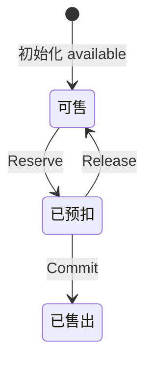
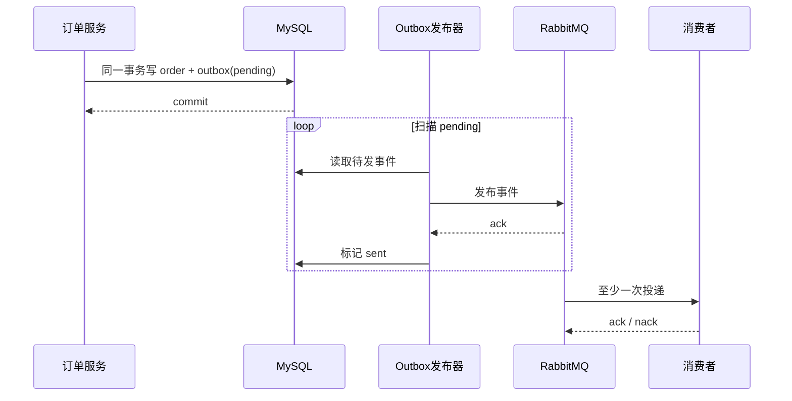
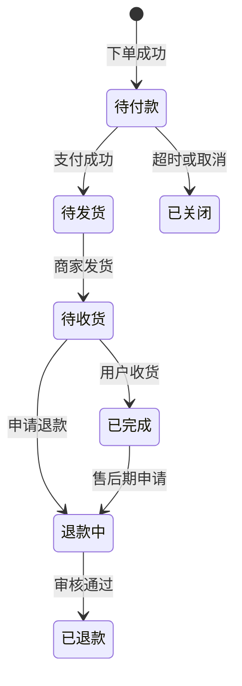

# 业务全景（下）：可靠交易与异步架构

> 上一讲走完了浏览、下单和支付的同步路径。这一讲专门处理事务边界之外的麻烦：库存预扣如何释放，消息如何不丢，洪峰如何排队，以及卡住的订单怎样被看见。

## 本讲目标

讲完后，学生应当能够：

- 用 `available / reserved` 两桶模型解释预扣、提交与释放；
- 说明 Outbox 解决的是哪道失败窗口，以及为什么消费者仍要幂等；
- 比较同步下单与 ticket 异步下单的交互差异；
- 用订单状态、Outbox、ticket、库存快照和 trace 定位卡单。

## 时间表（约 48 分钟，最多 58 分钟）

| 时间 | 内容 | 检查问题 |
|---|---|---|
| 0–5 分钟 | 回接黄金路径与故障窗口 | 数据库事务结束后还有哪些副作用？ |
| 5–17 分钟 | 两桶库存与补偿 | Lua 原子性为什么不等于跨系统一致？ |
| 17–28 分钟 | Outbox 与至少一次投递 | 订单提交后进程崩溃，消息怎样找回来？ |
| 28–38 分钟 | 幂等、降级与 ticket 削峰 | 洪峰下为何先返回查询凭证？ |
| 38–45 分钟 | 状态机与可观测性 | 客服如何解释一笔卡住的订单？ |
| 45–48 分钟 | 故障演练与课程收束 | 补偿也失败时，谁来发现？ |
| 48–58 分钟 | 提问与机动 | 不增加新组件 |

讲解边界：本讲建立跨域全景，不展开库存对账实现细节、支付通道协议和 MQ 运维参数。

---

## 一、事务结束，不代表业务结束（0–5 分钟）

上一讲留下的问题是：订单事务提交后，搜索索引、消息、库存状态和通知怎么办？先把失败窗口摆在桌上：

| 已完成 | 下一步 | 中间崩溃会怎样 |
|---|---|---|
| Redis 已预扣库存 | MySQL 写订单 | 货被占了，却没有订单 |
| MySQL 已写订单 | RabbitMQ 发事件 | 订单存在，异步消费者永远不知道 |
| 支付事务已提交 | Redis 提交预占 | 钱和订单对了，库存桶仍卡在 reserved |
| MQ 已投递 | 消费者写结果 | 消息重投，业务可能执行两次 |

可靠架构不是消灭所有失败，而是给每个窗口安排可重试、可补偿、可观测的出口。

## 二、两桶库存：先占住，再决定去向（5–17 分钟）

Redis 为商品维护 `available` 和 `reserved`：

- 下单：`available -= qty`，`reserved += qty`；
- 支付成功：`reserved -= qty`，不再退回；
- 取消或超时：`reserved -= qty`，`available += qty`。



`repository/cache/inventory.go` 中的 Lua 把 Redis 内两个 key 的移动做成原子操作：

```lua
local avail = redis.call('GET', KEYS[1])
if avail == false then return -2 end
if tonumber(avail) < tonumber(ARGV[1]) then return -1 end
redis.call('DECRBY', KEYS[1], ARGV[1])
redis.call('INCRBY', KEYS[2], ARGV[1])
return 1
```

这段脚本只保证一次 Redis 执行中不会出现“available 减了，reserved 没加”。它管不到 MySQL 事务。订单写入失败时，服务会调用释放预扣；如果释放也失败，就必须靠告警、超时清理与库存对账发现偏差。

课堂追问：为什么不在下单时直接把库存永久减掉？因为待付款订单可能取消或超时，两桶模型把“有人正在占用”和“已经卖出”分开了。

## 三、Outbox 把消息意图放进数据库事务（17–28 分钟）

如果代码先提交订单、再调用 RabbitMQ，进程可能恰好死在两步之间。Outbox 的做法是把订单和待发事件写在同一个数据库事务中；后台发布器反复扫描 `pending`，收到 MQ 确认后再标记 `sent`。



Outbox 关闭了“数据库提交成功但消息意图没有落盘”的窗口，却没有保证只投递一次。发布器可能在 MQ 已收消息、数据库尚未标记 `sent` 时崩溃；恢复后会再次发布。因此消费者仍需用业务键或事件 ID 做幂等。

观察 Outbox 不能只数 pending 条数。少量消息卡一小时比一千条刚写入更危险，应同时看最老 pending 年龄、发布失败次数和重试速率。

## 四、洪峰下先排队：ticket 是业务协议（28–38 分钟）

同步下单让用户等待订单创建完成；峰值流量下，`OrderEnqueue` 走另一种交互：校验地址归属、预扣库存、写入一小时有效的 pending ticket，再发布异步任务。客户端拿到的是查询凭证，不是订单号。


写 ticket、序列化或发布失败时，当前代码都会尝试释放预扣库存。消费者仍要权威反查商品和用户数据，不能因为任务来自内部队列就相信过期价格。

ticket 改变的不只是性能：TTL、`pending / ok / failed` 状态、失败原因、客户端轮询间隔都成为接口协议。若 ticket 过期但消费者稍后成功落单，用户会看到什么？这类边界需要产品规则和对账共同处理。

### 幂等与降级怎么分工

| 故障 | 当前思路 | 不能伪造的结果 |
|---|---|---|
| 商品缓存失效 | 回源 MySQL | 商品事实 |
| ES 不可用 | 普通搜索回 DB 弱检索 | 不能影响交易计价 |
| Milvus | 当前生产装配未接读写链 | 不能讲成现役降级路径 |
| MQ 暂时不可用 | Outbox 保留 pending | 已提交订单的事件不能凭空消失 |
| MySQL 不可用 | 快速失败并告警 | 不能返回下单成功 |
| 重复下单请求 | 幂等键复用结果或挡回 | 不能重复建单、扣款 |

降级先区分核心事实和可重建旁路。把系统错误伪装成成功或空结果，只会把故障推迟到对账时才暴露。

## 五、状态机与可观测性要一起看（38–45 分钟）

订单状态机限制合法推进，避免已退款订单又回到待付款：



定位卡单时，需要两类证据：trace 解释一次请求慢在哪或错在哪；业务状态解释一笔交易现在走到哪。排查顺序可以按订单号展开：

1. MySQL 中订单、明细、账本与当前状态；
2. Outbox 是否 pending、已发或反复失败；
3. ticket 是 pending、ok 还是 failed；
4. Redis 的 available / reserved 与数据库库存是否相符；
5. 对应 trace 中 DB、Redis、MQ span 的错误与耗时。

日志若只有“MQ publish failed”而没有订单号或事件 ID，客服仍然无法把技术故障对应到用户问题。

## 六、课堂故障演练（45–48 分钟）

给学生一个场景：`reserved` 已增加，订单事务失败，释放预扣又遇到 Redis 超时。请他们写出四件事：用户应收到什么；哪条数据不能伪造；后台靠什么发现；恢复后怎样补偿。

最后回答上一讲的问题：Outbox 让异步工作“有据可查并能重发”，库存对账与状态机让跨系统偏差“能被识别并修复”。这仍不是强一致魔法，而是一套明确的失败处理协议。

## 课后小练习

用一张表记录某个订单的 MySQL 状态、Outbox 状态、ticket 状态、库存两桶和 traceId，写出“正常、卡住、补偿中”三种快照。不要只列日志关键词。
