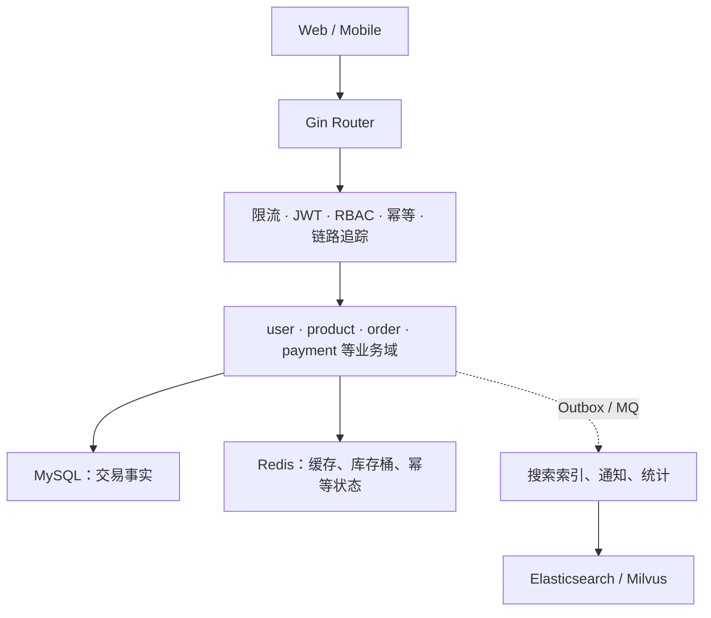
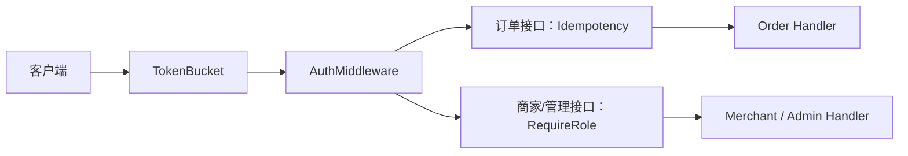
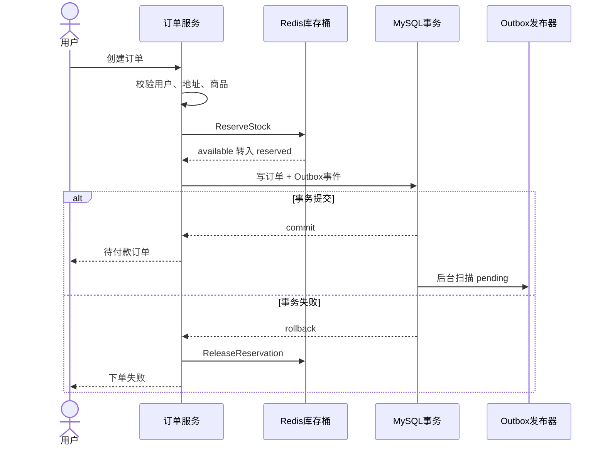
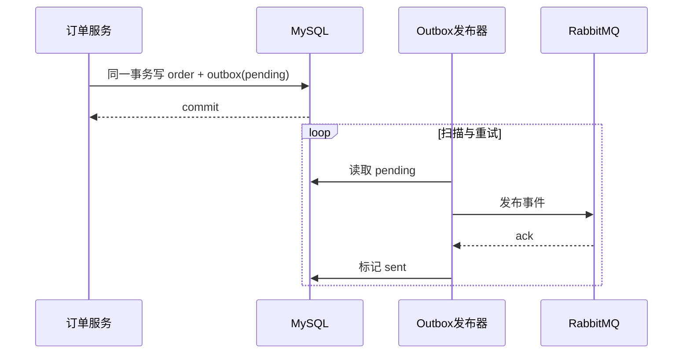
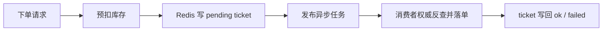
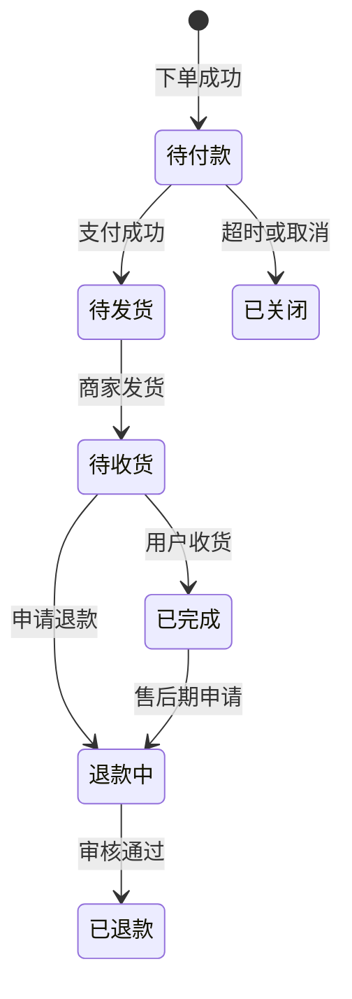

# 业务全景与端到端主线

> 这一讲只做一件事：沿着一笔订单，把 gomall 的业务边界、同步交易链路和异步旁路连起来。后续课程再逐段拆开。

## 本讲安排（60 分钟）

| 时间 | 内容 | 学生要带走的问题 |
|---|---|---|
| 0–6 分钟 | 业务角色与购物主线 | 系统究竟在替谁承担风险？ |
| 6–15 分钟 | 分层架构与中间件 | 一个请求先经过哪些门？ |
| 15–27 分钟 | 浏览、下单、支付 | 哪些动作必须同步完成？ |
| 27–39 分钟 | 库存与 Outbox | 怎么避免超卖和“订单有了、消息没了”？ |
| 39–48 分钟 | 幂等、降级与削峰 | 重试和洪峰来时，主链路怎样活下来？ |
| 48–55 分钟 | 订单状态机与可观测性 | 客服如何解释一笔卡住的订单？ |
| 55–60 分钟 | 演示与回顾 | 用一次下单把各层重新串起来 |

讲解边界：本讲不展开缓存四种故障、搜索排序算法、支付通道差异和营销规则；这些内容留到对应章节。

---

## 一、先看业务：一笔订单背后站着谁（0–6 分钟）

gomall 是一个用 Go 和 Gin 实现的教学电商后端。功能很多，但判断架构好坏不能数接口，而要问：用户付了钱以后，订单、库存和账目能否对得上？

一笔订单牵动五类人：

- 用户只想顺利找到商品、下单并收到货；重复点击不能多扣钱。
- 商家关心库存是否准确，已付款订单是否能可靠地进入履约。
- 运营会加优惠、秒杀等规则，但活动故障不该拖垮正常交易。
- 客服需要一条能解释的订单状态线，而不是去四个系统拼日志。
- SRE 关心峰值、依赖故障和恢复手段。


这条主线有一个很实用的判断标准：越靠近钱和库存，越需要同步校验、事务和幂等；搜索、通知等旁路可以晚一点，但不能反过来卡住支付。

## 二、一个请求怎样穿过系统（6–15 分钟）

### 2.1 分层不是文件夹游戏



MySQL 保存交易事实；Redis 承担可以重建的高速状态；ES 和 Milvus服务检索。异步消费者晚几秒通常不会造成资损，但订单和账目晚写或漏写就不行。

### 2.2 中间件顺序就是安全边界

仓库里没有一条路由同时经过 RBAC 和幂等。两类写接口在鉴权后分开：订单创建需要幂等，商家和管理员接口需要角色校验。



学生容易把“认证”和“授权”混在一起。JWT 回答“你是谁”，RBAC 回答“你能做什么”；订单归属必须取鉴权上下文里的 `user_id`，不能相信请求体自报的身份。

## 三、黄金路径：看商品、下单、支付（15–27 分钟）

### 3.1 看商品：旁路缓存可以丢

商品详情用 Cache Aside：先读 Redis，未命中再查 MySQL，然后回填。缓存若丢失，系统还能从权威数据恢复；这说明缓存是加速层，不是事实来源。

### 3.2 下单：先占货，再落交易事实

下单需要验证地址归属和商品信息，并预扣库存。同步下单会在事务里写订单及 Outbox 事件；异步下单则先写 ticket、投 MQ，再由消费者落单。两条路径的共同点是：客户端传来的单价和卖家信息都不能进入计费链路，服务端必须从商品表权威反查。



### 3.3 支付：钱、状态和账必须一起判断

下单时的库存只是 `reserved`，订单仍处于待付款。支付成功才推进订单、写账并提交库存预占。讲代码时要不断追问失败点：余额不足怎么办？重复回调怎么办？DB 提交成功后 Redis 提交预占失败，又靠什么巡检修复？

这里先建立边界，不展开具体支付通道。记住一句即可：涉及余额、账本和订单状态的写入要放在明确的事务边界内；事务外副作用必须能重试、对账或补偿。

## 四、两块硬骨头：库存与 Outbox（27–39 分钟）

### 4.1 两桶库存为什么比直接减库存更适合峰值流量

Redis 中每个商品有 `available` 和 `reserved` 两个桶。下单把数量从前者挪到后者；支付成功减少 `reserved`；取消或超时则退回 `available`。三个动作分别由 Lua 脚本原子执行。

```lua
-- repository/cache/inventory.go 中 reserveScript 的核心逻辑
local avail = redis.call('GET', KEYS[1])
if avail == false then return -2 end
if tonumber(avail) < tonumber(ARGV[1]) then return -1 end
redis.call('DECRBY', KEYS[1], ARGV[1])
redis.call('INCRBY', KEYS[2], ARGV[1])
return 1
```

Lua 解决的是 Redis 内两个 key 的原子移动，不会自动保证 Redis 与 MySQL 强一致。因此系统还需要超时释放和库存对账；别把“原子脚本”讲成“一劳永逸”。

### 4.2 Outbox 解决哪一道裂缝

先写订单、再发 MQ，有一个进程崩溃窗口：订单已经提交，消息却没发。Outbox 把订单和待发事件写进同一个数据库事务，后台发布器不断扫描 `pending`；MQ 确认后再标记已发送。



这条链路通常提供至少一次投递，所以消费者还要幂等。Outbox 解决“数据库提交与发消息之间的裂缝”，并不承诺消息只出现一次。

## 五、重试、降级与洪峰（39–48 分钟）

### 5.1 幂等保护的是业务结果

弱网重试、用户连点和客户端超时重发，本质上都可能让同一个意图到达多次。`Idempotency-Key` 对应的 Redis 状态从 `init` 进入 `processing`，成功后保存为 `done`；重复请求要么被挡回，要么复用已经完成的结果。

幂等键不能由服务端为每次请求随机生成，否则每次都不同。它也不能无限复用，否则两次真实购买会被误判成一次。

### 5.2 降级先分清核心与旁路

| 故障 | 可以怎么退 | 不能牺牲什么 |
|---|---|---|
| 商品缓存失效 | 回源 MySQL | 数据正确性 |
| ES / Milvus 不可用 | 退回较弱的检索路径 | 浏览和交易入口 |
| 优惠计算失败 | 按业务约定降为无优惠或明确拒绝 | 不能多扣、多发预算 |
| MQ 暂时不可用 | Outbox 保留 pending，稍后重试 | 已提交订单对应的事件不能丢 |
| MySQL 不可用 | 快速失败并告警 | 不能伪造“下单成功” |

### 5.3 削峰为何要给用户一个 ticket

`OrderEnqueue` 当前会校验地址归属、预扣库存、写一小时有效的 ticket，再投递异步任务。写 ticket、序列化或发布失败时都会尝试释放预扣库存。客户端轮询 ticket，看到 `pending / ok / failed`。



削峰改变了交互：用户拿到的不是订单号，而是一张查询凭证。因此 ticket 的 TTL、失败原因、补偿以及客户端轮询频率都是业务协议的一部分。

## 六、状态机与可观测性（48–55 分钟）

订单状态不是随便改的字符串。每次推进都要校验合法边，避免“已退款又跳回待付款”。状态机给客服一个共同语言，也让消费者能安全处理重复或乱序事件。



定位卡单时，不要从某一条错误日志猜。请求侧用 traceId 串起 HTTP、DB、Redis 和 MQ span；业务侧则用订单号、Outbox 状态、ticket 状态与库存快照交叉确认。链路追踪解释“慢在哪”，业务状态解释“现在走到哪”。

## 七、课堂演示与收束（55–60 分钟）

只做一个演示，避免环境启动占满课程时间。

1. 用同一个 `Idempotency-Key` 连续发送两次下单请求。
2. 对比两次响应，并查询数据库中实际订单数。
3. 打开代码，从路由中间件一路追到订单服务、库存预扣和 Outbox 写入。

若本地 RabbitMQ 或 Redis 未启动，改为代码走读：指出每个失败分支怎样释放库存、怎样返回 ticket 失败状态。不要现场排环境。

最后让学生回答两个问题：

- 为什么 Outbox 之后消费者仍然必须幂等？
- 如果 Redis 的 `reserved` 已增加，但订单事务失败，哪段代码负责补偿，补偿再次失败又该如何发现？

## 课后延伸

- 在 `internal/order/async.go` 画出 ticket 的完整状态机，并补一条“消费者崩溃后恢复”的测试。
- 阅读商品、搜索、支付和中间件章节，分别找出一个可降级依赖与一个不可降级依赖。
- 用订单号写一份卡单排查清单，至少包含 MySQL、Redis、Outbox 和 MQ 四个证据来源。
