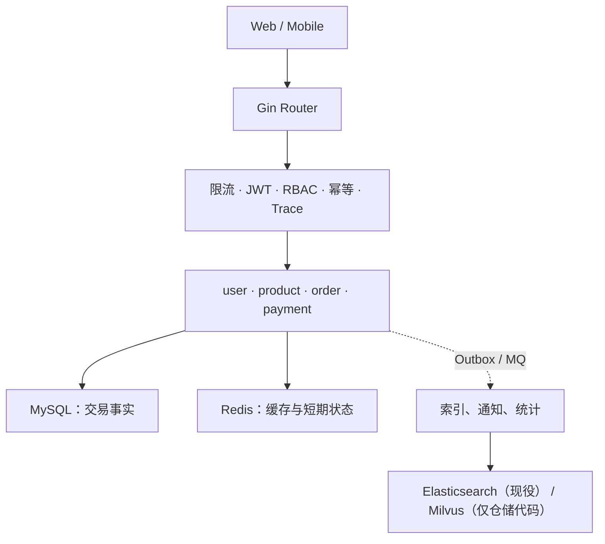
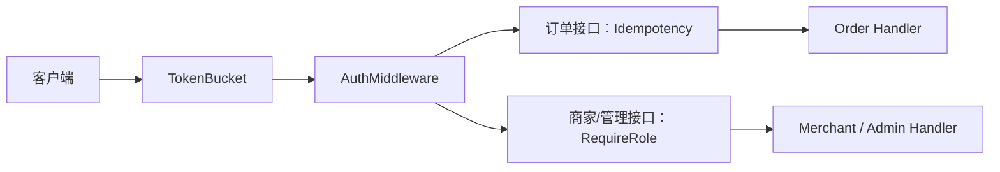
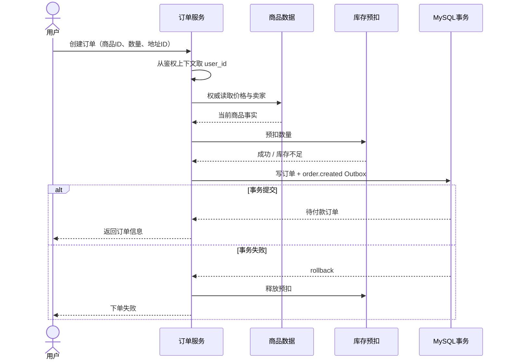

# 业务全景（上）：角色、分层与黄金交易路径

> 先别急着数接口。这一讲沿着“看商品、下单、支付”走一遍，弄清 gomall 替谁守住钱、货和身份边界。库存可靠性与异步架构留到下一讲。

## 本讲目标

讲完后，学生应当能够：

- 说清用户、商家、运营、客服和 SRE 关注的风险为何不同；
- 从 Gin 路由追到业务服务，再判断 MySQL、Redis 与检索系统各自保存什么；
- 沿黄金交易路径指出哪些数据必须由服务端权威读取；
- 解释认证、授权、幂等为什么不能互相替代。

---

## 一、一笔订单背后站着谁

用户看到的是按钮，系统处理的却是多方约束。一笔订单至少牵动五类角色：

| 角色 | 最怕什么 | 系统给出的保护 |
|---|---|---|
| 用户 | 重复点击导致重复扣款 | 幂等键、订单状态检查 |
| 商家 | 超卖，付款订单无法履约 | 预扣库存、库存对账 |
| 运营 | 活动故障拖垮正常交易 | 限流、降级、规则隔离 |
| 客服 | 只能去多个系统拼日志 | 订单状态、业务编号、链路信息 |
| SRE | 峰值压垮依赖，恢复后又重复消费 | 削峰、重试、告警与补偿 |

判断架构边界有个简便办法：越靠近钱和库存，越不能拿“最终大概一致”搪塞。搜索结果晚几秒更新通常还能接受；订单已经扣款却没有账目，性质完全不同。

## 二、一个请求怎样穿过系统

### 2.1 分层解决的是责任，不是目录美观

课堂上从一个路由往下追，不需要背目录：

1. Router 决定请求进入哪个业务域，并串起中间件。
2. Handler 负责解析输入与返回 HTTP 响应，不应该偷偷决定价格。
3. Service 组织交易规则，例如地址归属、商品反查和状态推进。
4. Repository 封装 MySQL、Redis、ES、Milvus 与 MQ；有仓储代码不代表生产链已经装配。

MySQL 保存订单、商品、余额等权威事实。Redis 中的商品缓存丢了可以回源；幂等状态和库存桶虽然也在 Redis，却需要明确 TTL、补偿与对账。ES 是当前检索副本；Milvus 只有仓储代码，尚未接入生产读写链。无论副本是否接通，下单都不能信它给出的价格。

### 2.2 中间件顺序会改变安全语义

仓库里没有一条路由同时经过 RBAC 和幂等。订单创建在认证后检查幂等；商家、管理员接口则在认证后检查角色。JWT 回答“你是谁”，RBAC 回答“你能做什么”，幂等回答“这个业务意图是否已经处理过”。

## 三、黄金交易路径

### 3.1 浏览：缓存能丢，事实不能编

商品详情采用 Cache Aside：先读 Redis，未命中再查 MySQL，随后回填。Redis 故障时可以牺牲速度回源，但不能拿旧缓存直接参与订单计价。

让学生先回答：既然搜索结果已经带价格，为什么下单还要查商品表？答案不是“防前端传错”这么简单；检索索引也可能延迟，任何进入计费链路的价格都要由交易侧重新确认。

### 3.2 下单：客户端提交购买意图，服务端补齐事实

客户端只表达“我要买什么、买多少、送到哪个地址”。当前是单商品订单模型，没有独立订单明细表；命中促销时，促销应用也随订单事务写入。用户 ID 来自鉴权上下文，价格、卖家和商品状态则从服务端数据读取。

### 3.3 支付：先检查状态，再动钱和账

下单后的库存只是 `reserved`，订单仍为待付款。支付需要同时面对余额不足、重复请求、通道重复回调、事务失败与库存提交失败。具体实现放到支付章节，这里先划边界：

- 余额、账本、订单状态应进入清楚的数据库事务；
- 事务外的库存提交、通知等副作用必须能重试、补偿或对账；
- 状态推进要检查当前状态，不能让重复回调重复记账。

## 四、认证、授权和幂等各守一道门

弱网重试、用户连点和客户端超时重发，都可能让同一个购买意图到达多次。`Idempotency-Key` 对应的状态从 `init` 进入 `processing`，成功后保存为 `done`；但它解决不了越权，也不验证订单归属。

| 问题 | 负责机制 | 典型错误 |
|---|---|---|
| 请求者是谁？ | JWT 认证 | 相信请求体中的 user_id |
| 请求者能否操作此资源？ | RBAC 与资源归属检查 | 只要登录就能改别人的商品 |
| 同一购买意图是否已执行？ | 幂等状态 | 服务端为每次重试生成新键 |
| 当前状态能否继续推进？ | 订单状态机 | 已关闭订单再次支付 |

幂等键不能无限复用，否则两次真实购买会被误判为一次；也不能每次随机生成，否则重试永远是新请求。

## 五、课堂走读与下一讲入口

只做一次代码走读：从订单路由开始，指出认证、幂等、Handler、Service、库存预扣和数据库写入的边界。环境没启动就不现场排依赖。

离开本讲前，让学生回答：

1. 商品缓存不可用时可以回源，为什么 MySQL 不可用时不能伪造“下单成功”？
2. 订单事务提交了，搜索索引、通知和统计还没执行，怎样确保这些工作最终不会丢？

第二个问题正是[业务全景（下）：可靠交易与异步架构](./00-overview-architecture.md)的入口。下一讲会继续追踪库存、Outbox、削峰、状态机与可观测性。

## 课后小练习

任选一个写接口，画出“身份从哪里来、权威数据在哪里、事务在哪里结束”。只画现有实现，不补想象中的组件。
