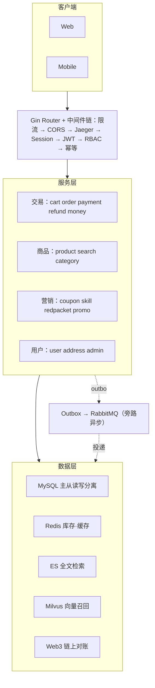
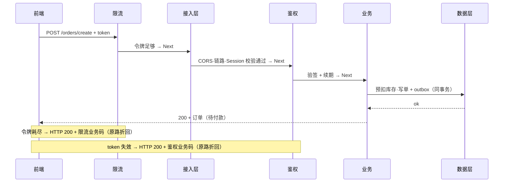
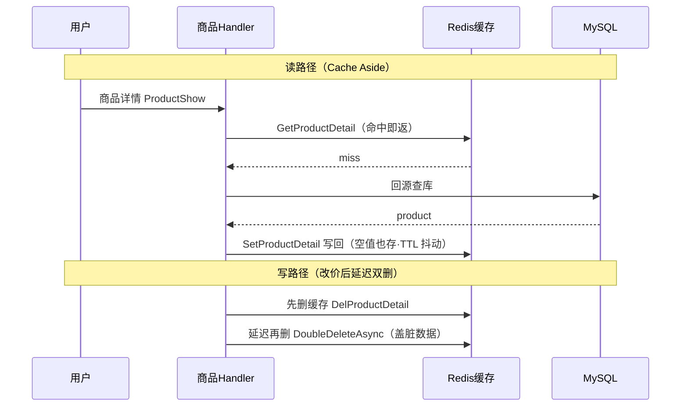
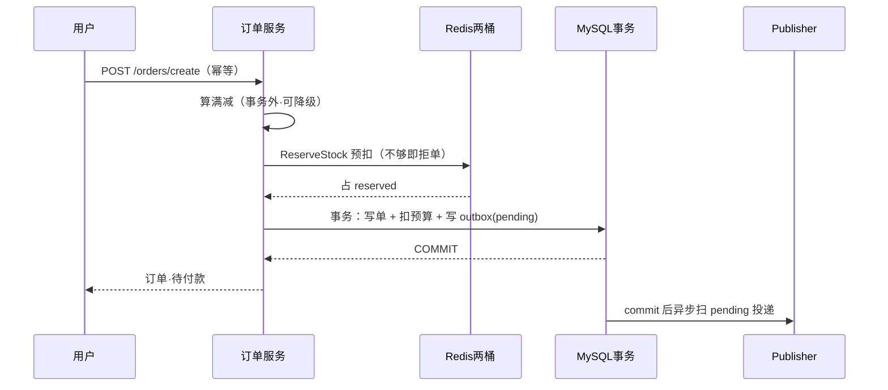
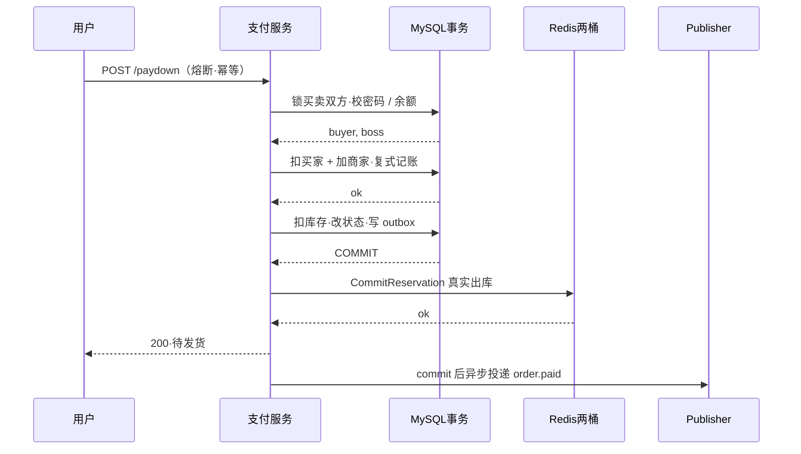
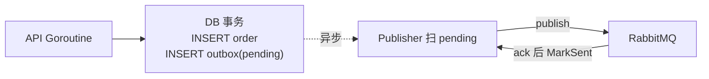
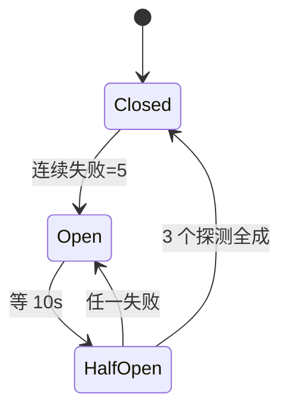
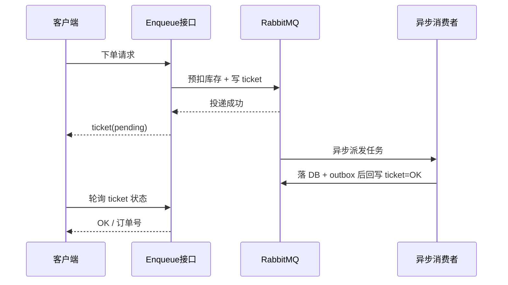
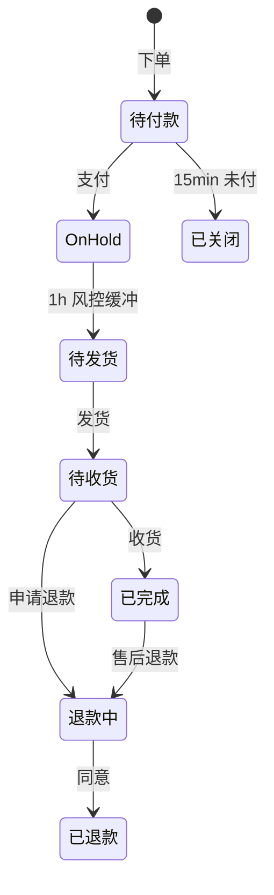

# 业务全景与端到端主线

> gomall · 一次购物：从进门到收货怎么跑通、卡在哪
>
> 这份讲义不逐个罗列功能，讲的是**一笔订单穿过的每一跳背后的工程取舍**——哪一段碰钱碰库存必须稳如磐石、哪一段是边缘能力随时可弃，以及只盯着 happy path 时看不见的那些"坑"到底藏在哪。

## 目录

- [一、业务全景：gomall 在做什么](#一业务全景gomall-在做什么)
- [二、系统架构：分层拓扑与领域地图](#二系统架构分层拓扑与领域地图)
- [三、端到端主线：一次成功购物的黄金路径](#三端到端主线一次成功购物的黄金路径)
- [四、贯穿全局的硬骨头](#四贯穿全局的硬骨头)
- [五、订单状态机：把 7 跳串成一条可查的线](#五订单状态机把-7-跳串成一条可查的线)

---

## 一、业务全景：gomall 在做什么

### gomall 是什么：一个讲清"为什么这么选"的电商后端

> **用 Go + Gin 写的电商后端，把一笔订单从「浏览 → 搜索 → 下单 → 支付 → 履约」的全链路跑通；再叠上优惠券 / 秒杀 / 红包 / 拼团 / 预售、Web3 支付、ES+Milvus 向量检索。**

这个项目要解决的不是"能不能跑"，而是"该怎么选"。它盯住真实电商里每一个工程决策点——超卖、一致性、限流、降级——把当初为什么这么权衡也一并写下来。三条主线贯穿始终：

- **按业务域垂直切片**：20 个业务域用 DDD 拆开，每个域 `internal/<域>/` 五件套内聚；跨域的写经由属主服务落库，不让边界糊掉。
- **多支付通道殊途同归**：钱包 / Stripe / USDC / ETH 四条支付通道，最终统一汇到**复式记账台账**，借贷守恒、随时可对账。
- **每个域都留下取舍记录**：配一份压测报告 + 一套 Beamer deck + 一篇博客，把当初的选择写清楚。

技术栈按"一条请求穿过的层次"看：**接入层**是 Gin + 中间件链（限流 / JWT / RBAC / 熔断 / 幂等 / Jaeger）；**存储层**是 MySQL 主从 · Redis · Elasticsearch · Milvus；**异步**走 RabbitMQ + Outbox 旁路投递；**链上**是 Web3 Escrow + EVM 对账；**可观测**是 Jaeger 链路 + SkyWalking。

完整源码与文档：[github.com/RedInn7/gomall](https://github.com/RedInn7/gomall)。

### 先认人：一笔订单背后站着 5 个角色

同一套代码，五个利益相关者各自盯着不同的东西。把技术词翻译成每个角色的诉求，才知道每一段设计是在为谁兜底：

- **C 端用户**：进门 → 逛 → 下单 → 收货，只关心**快、对、不丢**。
- **商家（Boss）**：订单是"我能不能发货"的唯一源头；货卖出去，钱要到账。
- **运营**：办活动拉量——优惠券 / 满减 / 秒杀 / 拼团 / 预售，预算不能被脚本刷穿。
- **客服**：用户来问"我的钱去哪了 / 货到哪了"，得有一条能查、且自洽的状态线。
- **SRE**：大促洪峰别把库存卖超、别把数据库打挂，挂了要能降级。

> **这份概览把一次购物从「进门到收货」串成一条线：先看全局怎么连，再逐段看每一跳背后的技术取舍，以及"出事会卡在哪"。**

### 业务全景图：一次购物穿过的 8 个环节


这条主线之下还压着一层**贯穿全局的横切关注点**：库存防超卖、Outbox 一致性、流量治理、优雅降级。它们不属于某一跳，而是每一跳都得考虑——后面第四节专门啃这几块硬骨头。

### 哪里会出事：把"坑"标在主线上

只盯 happy path 时，下面这些点全看不见；但它们恰恰是最贵的地方——越靠近"下单—支付"，翻车代价越高。

| 这一跳 | 容易翻车的点（学生常以为没事） | 后果 | 本 deck 怎么填 |
|---|---|---|---|
| 逛 / 详情 | 热点缓存集体失效、回源时击穿 / 穿透 / 雪崩 | DB 打挂 | Cache Aside + 空值缓存 |
| 优惠 / 秒杀 | 券被脚本超领、预算被刷穿、库存卖超 | 营销亏钱 | 两桶库存 Lua + 预算降级 |
| 下单 | (1) 超卖 (2) 双写丢消息 (3) 重试重复下单 | 钱货两失 | 防超卖 + Outbox（保证 DB 与发消息原子）+ 幂等 |
| 支付 | 第三方重复回调、扣了钱没货、台账对不平 | 直接资损 | 同事务收钱 + 复式记账 |
| 履约 / 售后 | 并发改乱订单状态、同一笔退款退两次 | 状态错乱 | 状态机 `CanTransition` |
| 大促全局 | 零点洪峰打满连接池、下游挂了拖死自己 | 整站雪崩 | 限流 + 熔断 + 削峰 |

> **凡是碰钱、碰库存的地方都会翻车。** 事务 / 原子性 / 资源都堆在"下单—支付"这段；边缘能力（搜索 / 优惠 / 通知）一律可降级，绝不反过来阻断 happy path。支付离钱最近，只要出问题就是资损、就是事故。

### 业务承诺：我们对外兜什么底（SLO）

> **一个交易系统的可信度，不在功能多，而在敢把哪几条线写进合同——出事要赔的那种。** gomall 把承诺分成 P0~P3 四档，资源向核心交易倾斜。

| 等级 | 典型场景 | 可用率 | p99 延迟 |
|---|---|---|---|
| **P0 核心交易** | 下单 / 支付 | **99.999%** | < 500ms |
| P1 核心读 | 商品详情 / 订单列表 | 99.9% | < 200ms |
| P2 营销秒杀 | 抢券 / 秒杀 / 红包 | 99.9% | < 200ms |
| P3 信息类 | 轮播 / 分类 | 99.5% | < 1s |

这四档背后是四条具体的承诺：

- **钱货不丢**：支付与库存、流水落进同一事务，崩了整笔回滚，绝不"扣了钱没货"。
- **happy path 不被周边阻断**：优惠 / 搜索 / 通知挂了，下单支付照走。
- **不能上游 429**：P0 靠缓存 + 削峰扛峰值，宁可下游慢，也不在入口把用户挡回去。
- **阶梯是故意压出来的**：每加 1 个 9 成本翻番；限流返业务码**不算宕机**，所以 P2 也能承诺 99.9%。

---

## 二、系统架构：分层拓扑与领域地图

### gomall 整体架构：一条请求从客户端落到数据层



核心链路**同步落库收钱**；事件经 Outbox **旁路异步**散给搜索 / 统计 / 履约。这样主线不被下游拖慢：搜索索引晚更新几百毫秒无所谓，但订单和钱必须当场落定。

### 中间件洋葱模型：下单请求逐层穿过鉴权打到后端

> **中间件是「洋葱模型」：逐层 `c.Next()` 进内层、再原路返回出；任一层 `Abort` 就在那层折回，到不了业务。**



真实顺序是 **限流(IP) → CORS → Jaeger → Session → JWT**；admin 再叠 `RequireRole`、下单末端挂 `Idempotency`。为什么限流在最外层？因为匿名洪水要在**最便宜的地方**被拒——还没解析、还没查库就挡掉。而按**用户**维度的秒杀滑窗限流必须在鉴权**之后**：得先知道"是谁"才能按人限。

### 中间件链：顺序即设计

> **顺序不是随手排的——每一环只在前一环放行后才有意义，错一步就是漏洞或浪费。** 下面按 `router.go` 真实注册顺序逐环讲。


- **限流·IP** `TokenBucket(100,200)`：放**最外层**——匿名洪水在最便宜处被拒，不浪费后面的解析；被拒 HTTP 200 + 限流业务码。
- **JWT 鉴权** `AuthMiddleware()`：解 token 拿到 `user_id`，确认"你是谁"。
- **RBAC** `RequireRole("admin")`：在登录之上叠角色校验，只护 admin 组——**必须先认证再鉴权**。
- **熔断**：支付等对下游的调用加熔断，连错 5 次立刻熔断，不让一个垂死的依赖拖垮其它业务。
- **幂等** `Idempotency()`：**放最后**——确认要执行业务时才用 Redis 锁去重，避免给被拒请求白占幂等键；任何写 DB 的操作都要过它。

### 数据层选型与边界：一个 MySQL 为什么不够

> **把全部活儿压给一个 MySQL，要么慢死、要么挂掉。** 正解按"访问形态"分流：和钱有关的强一致归 MySQL，高并发与检索归旁路（Redis、ES），旁路挂了能退回 DB。

| 存储 | 扛什么 | 挂了怎么办 |
|---|---|---|
| MySQL 主从 | 交易事务、权威读 | 核心依赖，不可降级 |
| Redis | 库存预扣 / 热点缓存 / 限流 | 缓存未命中回源 DB |
| Elasticsearch | 商品全文检索 | **退回 DB `LIKE` 查询** |
| Milvus | 语义向量召回 | 退回纯 ES 关键词召回 |

这张表的关键在最后一列：每个旁路都有一条**降级退路**回到 DB，唯独 MySQL 自己没有退路——所以它只放"碰钱"的强一致活儿，其余能外移的都外移。

---

## 三、端到端主线：一次成功购物的黄金路径

### 黄金路径：7 跳，每一跳都可能掉链子

一次成功购物是这样跑完的：

1. **登录**——拿到 JWT，后续每个请求带着它过鉴权中间件。
2. **看商品**——详情走 Cache Aside，热点不打穿 DB。
3. **加购 / 选地址**——没地址下不了单，默认地址兜底。
4. **下单**——算优惠 → 预扣库存 → 一个事务落「订单 + 事件」。
5. **支付**——扣余额 + 改状态 + 真正消库存，同事务发"已支付"事件。
6. **发货 / 收货**——状态机推进，每一步只允许合法迁移（订单状态机后面细讲）。
7. **结清**——订单 Completed；中途不付钱则 15 分钟自动关单，一般用 CRON 脚本去 DB 里关。

> **这条线横跨 user / product / cart / promo / order / inventory / payment 七个包，任何一跳的失败都不能让用户"钱货两失"——这是整套设计的第一性原则。**

### 看商品：Cache Aside 读路径 + 更新时延迟双删



读路径先读缓存、缺了才回源再写回；写路径不写缓存、只删缓存，而且**删两次**——第二刀是为了盖掉"读者在写库那一瞬间回填的旧值"。这块的四态防护（击穿 / 穿透 / 雪崩 / 惊群）在 deck 02 商品展示里完整展开。

### 端到端时序：下单这一跳的内部（先预扣、再事务、后通知）

> **三段式：事务外算满减 / 预扣库存（可降级，去 Redis 扣减）→ 一个事务写「单 + 扣预算 + outbox」（保证 ACID 一致）→ 事务后异步投 MQ；第二阶段失败则 `ReleaseReservation` 释放 Redis 里的预扣库存。**



### 支付这一跳：钱和库存在这里才真正落定

下单时库存只是 **reserved（预占）**，钱一分没动——订单停在 `WaitPay`。真正的钱货落定发生在支付成功那一刻，且全部塞进**一个事务**：


事务里一口气做四件事：扣用户余额 → 加商家余额 → 改状态到 `WaitShip` → 写 `order.paid` 事件。事务提交后再同步 `CommitReservation`，把 reserved 真正消掉，库存数字才最终减少。

### 端到端时序：支付这一跳的内部（钱·库存·状态·事件 一个事务落定）



下单只**预占**库存、不动钱；支付才在**一个事务**里把「扣买家 + 加商家 + 复式记账 + 扣库存 + 改状态 + 写 `order.paid`」一并落定，全成才 COMMIT，任一守卫失败整笔回滚——绝不"扣了钱没货"。

---

## 四、贯穿全局的硬骨头

这一节讲那些不属于某一跳、却每一跳都要考虑的横切关注点：**超卖 · 一致 · 限流 · 降级 · 可观测**。

### 硬骨头 1：库存防超卖——为什么不用 `UPDATE WHERE stock>0`

直觉做法 `UPDATE ... SET stock=stock-1 WHERE stock>0` 在高并发下会出两个问题：行锁排队 + 尾延迟爆炸，而下单链路最怕在事务里等锁。gomall 的做法是把库存搬到 Redis，用**两个桶**：`available`（可卖）/ `reserved`（已占）；预扣 / 提交 / 释放都用**单个 Lua 脚本原子完成**，一次 RTT，天然不超卖。

```lua
-- reserveScript：available 与 reserved 两个 key 原子流转
-- KEYS[1]=available 桶  KEYS[2]=reserved 桶  ARGV[1]=n
local avail = redis.call('GET', KEYS[1])
if avail == false then return -2 end           -- 库存未初始化
if tonumber(avail) < tonumber(ARGV[1]) then
    return -1                                  -- 不够，拒单
end
redis.call('DECRBY', KEYS[1], ARGV[1])         -- available -= n
redis.call('INCRBY', KEYS[2], ARGV[1])         -- reserved  += n
return 1
```

### 硬骨头 2：Outbox——解决"订单存了但消息丢了"

**双写问题**：先 `INSERT order` 再 `publish MQ`，两个动作不在一个事务里。进程若在中间崩掉，就成了"订单有了、下游（搜索 / 统计 / 履约）永远收不到通知"。



> **订单与事件「同生共死」写进一个事务；投递交给独立 publisher 重试。至少一次投递 + 下游幂等消费 = 事件不丢。**

### 硬骨头 3：优雅降级——核心稳如磐石，边缘随时可弃

| 能力 | 挂了会怎样 | gomall 的选择 |
|---|---|---|
| 满减计算 | 算不出折扣 | 降级为**无折扣**，照样下单 |
| 满减预算 | 预算抢光 | 事务内**改写为无折扣**，不报错 |
| RabbitMQ | 延迟关单不可用 | DB Cron 定时扫描**兜底关单** |
| ES / Milvus | 搜索退化 | 退回 **DB LIKE** 路径 |

> **判断标准只有一句：它是不是"用户付钱拿货"的必经环节？** 是 → 进事务、保原子；不是 → 失败降级，绝不阻断 happy path。

### 幂等中间件：755K 次重放只成一单

> **业务痛点：用户手抖狂点"提交订单"、客户端超时自动重试、弱网下 App 补发请求——同一笔下单不能变成三笔。**

请求态用 Redis Hash 存成一台小状态机：`init`（已发券、未执行）→ `processing`（首单执行中，后到一律挡回）→ `done`（已完成，缓存响应直接回放）。一段 Lua 单次 RTT 原子完成"读态 + 抢锁"。压测实证：同 `Idempotency-Key`、50 VU、15s 累计 **755,033** 次请求 → DB 中**恰好 1 笔订单**；50K RPS、p95 2.33ms。

```lua
-- acquire：init 到 processing 原子推进
local v = redis.call('HGET', KEYS[1], 'state')
if v == false then return {0, ''} end
if v == 'done' then return {2,
    redis.call('HGET', KEYS[1], 'result')} end
if v == 'processing' then return {3, ''} end
-- init: 抢到执行权
redis.call('HSET', KEYS[1], 'state', 'processing')
redis.call('EXPIRE', KEYS[1], tonumber(ARGV[1]))
return {1, ''}
```

### 限流挡爬虫 + 熔断护下游

> **两道闸门：令牌桶在入口按 IP 限速，挡住脚本刷接口；熔断器在出口监控下游，下游连续报错就快速失败，不让请求堆在垂死的依赖上拖垮自己。**

**令牌桶限流（每 IP）**：全局 `TokenBucket(100, 200)`——每 IP 每秒补 100 个令牌、桶容量 200（允许突发）；取不到令牌直接 `Abort` 返回"请求过于频繁"。后台 janitor 周期回收 10 分钟无访问的 IP 条目，map 有界，防海量 IP 撑爆内存（面试考过这个题）。

**熔断器三态**：



### 削峰：下单先拿 ticket，洪峰摊到 MQ

> **业务背景：大促零点瞬时洪峰，若每个请求都同步写库，DB 连接池秒满。** 改成"先预扣库存 + 投 MQ 拿 ticket 秒回"，后台慢慢消费落单，把尖峰摊平成平稳的消费速率。



> **ticket = 雪花 ID 存 Redis 带 TTL；写 ticket / marshal / publish 三个失败点任一出错都先 `ReleaseReservation` 退回预扣库存，绝不让库存空占。**

### 可观测性：一次下单串成一条 trace

> **下单跨了网关、订单、库存、MQ、DB 多个环节。出问题时光看单机日志拼不出全貌**——链路追踪给每次请求发一个 traceId，沿调用一路透传，把散落的 span 串成一条完整时间线。

链路怎么串起来：gomall **两套并存**——`cmd/main.go` 匿名引入 `skywalking-go` agent（进程级旁路自动埋点、无业务侵入），加上 `track.go` 里 `Jaeger()` 中间件（OpenTracing）。真正的**跨服务透传走 `Jaeger()`**：读请求头 `uber-trace-id` 续上父 span，缺失或解析失败则降级开本地 span，绝不吞掉整条请求；span 放进 context 往下传，DB / Redis / MQ 调用挂成子 span。

关键指标看板盯三个数：

| 指标 | 用途 |
|---|---|
| QPS | 吞吐 / 容量水位 |
| p95 延迟 | 尾延迟，体感真相 |
| 错误率 | 非 2xx 占比 |

注意口径：业务态（限流 / 熔断 / 幂等命中）HTTP 仍返 200，单独用 status 码区分，避免污染错误率口径。

> **有了 trace，"这一单为什么慢"能精确定位到是 DB 全表 count、还是 MQ 投递抖动；有了三件套指标，限流阈值和熔断参数才有据可调。**

---

## 五、订单状态机：把 7 跳串成一条可查的线

### 订单不是一个布尔值，是一台状态机



> **每一次状态变更都走 `CanTransition` 校验，非法迁移直接报错**——"已完成"的订单不可能跳回"待付款"，客服查到的状态永远自洽。

两个容易踩错的点：

- **真正的终态只有「已关闭 / 已退款」**；「已完成」**不是**终态——售后期内仍有「已完成 → 退款中」这条边（7 天无理由 / 质量问题）。
- 虚线的 `OnHold`（支付后风控 / 冷静缓冲）是**设计示意**：当前实现是「待付款」支付成功直接 →「待发货」，还没有这段缓冲。

### 这套架构的一句话总结

> **核心链路（扣库存 + 落单 + 收钱）必须稳如磐石，周边能力（优惠 / 通知 / 搜索 / 关单）全部可降级。**

顺序即设计，落到三条铁律：

- **能在事务外做的绝不进事务**——满减、库存预扣。
- **进了事务就保证原子**——订单 + 优惠预算 + outbox 事件。
- **事务外的副作用必须能补偿**——库存释放、延迟关单。
