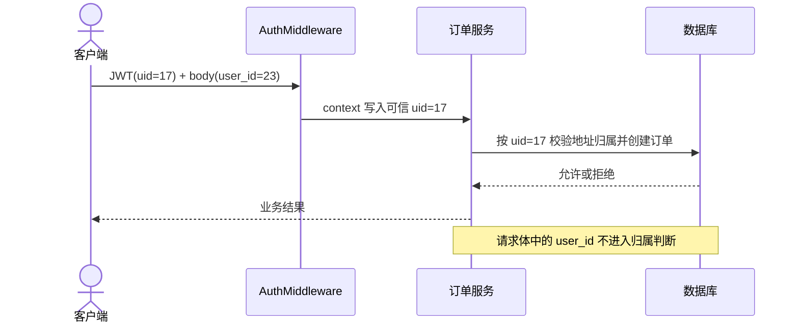
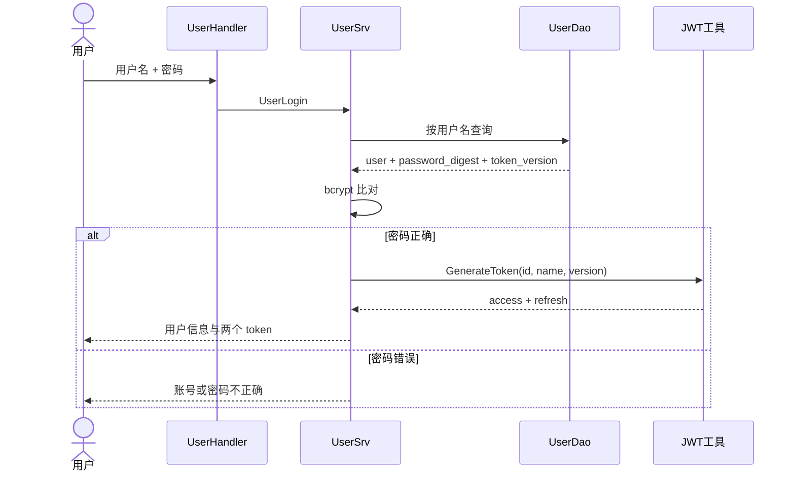
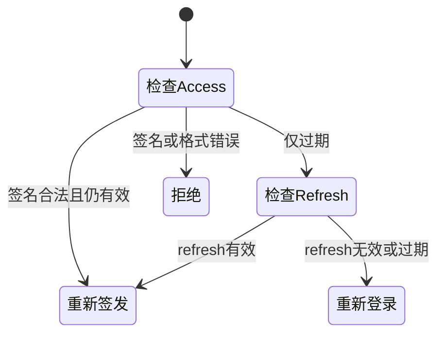
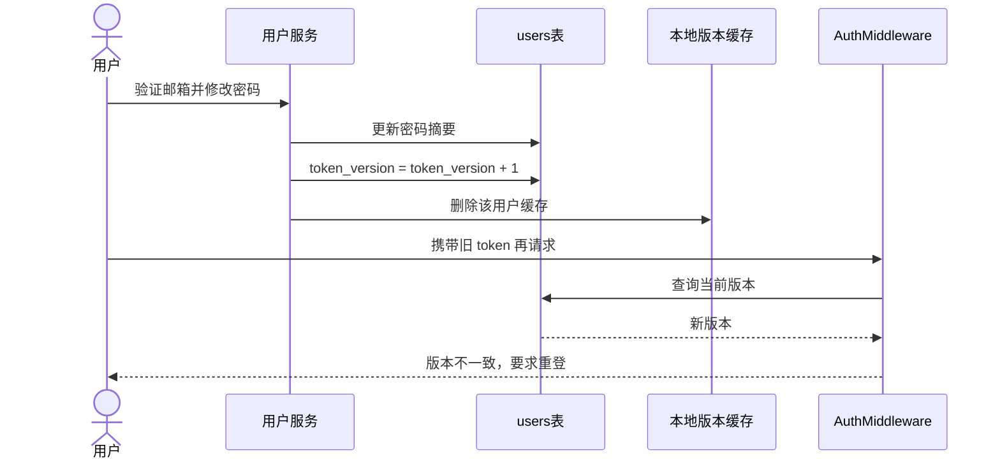

# 用户与鉴权的业务边界

目录

- [一、越权为什么比“登录失败”更危险](#一越权为什么比登录失败更危险)
- [二、注册、登录与双 token](#二注册登录与双-token)
- [三、JWT 中间件与会话撤销](#三jwt-中间件与会话撤销)
- [四、RBAC 与 admin bootstrap](#四rbac-与-admin-bootstrap)
- [五、演示、复盘与课后延伸](#五演示复盘与课后延伸)

## 本讲安排（60 分钟）

| 时间 | 内容 | 讲完要能回答 |
|---|---|---|
| 0–7 分钟 | 身份、角色与资源归属 | “已登录”为什么仍可能越权？ |
| 7–17 分钟 | 密码保存与注册登录 | 数据库为什么不能存明文密码？ |
| 17–29 分钟 | access / refresh token | token 过期后如何续期？ |
| 29–41 分钟 | AuthMiddleware 与 token_version | 改密码后怎样让旧 token 失效？ |
| 41–51 分钟 | RBAC、角色缓存与 bootstrap | admin 从哪里来，降权多久生效？ |
| 51–57 分钟 | 两个代码演示 | 亲眼看到鉴权通过与撤销 |
| 57–60 分钟 | 边界复盘 | 哪些机制已经落地，哪些仍是路线图？ |

本讲不展开 OAuth、验证码服务、多设备独立踢出和审计系统实现；这些内容放在课后延伸里。

---

## 一、越权为什么比“登录失败”更危险

用户鉴权不是 JWT 语法课。真正的问题有三层：

1. **身份**：请求来自哪个用户？
2. **角色**：这个用户是普通用户、商家还是管理员？
3. **资源归属**：即使角色允许，他能否操作这一笔订单、这个地址或这件商品？

假设下单请求同时带着 JWT 中的 `user_id=17` 和请求体中的 `user_id=23`。服务端若相信请求体，就允许 17 号用户替 23 号用户下单，甚至读取或修改对方资源。这类问题叫 IDOR，根因不是 token 失效，而是业务层信错了身份来源。



gomall 的路由可以看成四层墙：

| 层级 | 谁可以进 | 典型操作 |
|---|---|---|
| public | 未登录用户 | 注册、登录、浏览商品 |
| authed | 任意已登录用户 | 地址、购物车、下单、用户资料 |
| merchant | `merchant` 或 `admin` | 商家侧商品与履约操作 |
| admin | 仅 `admin` | 用户管理、角色变更、搜索回填 |

注意：角色墙解决“哪类人能进”，资源归属校验解决“能动哪一条数据”。两者缺一不可。

## 二、注册、登录与双 token

### 2.1 密码只存摘要

`internal/user/model.go` 中，登录密码和支付密码都使用 bcrypt，cost 为 12。bcrypt 每次自动带盐，同一密码通常得到不同摘要；验证时用 `CompareHashAndPassword`，业务代码不需要解密密码。

```go
const PassWordCost = 12

func (u *User) SetPassword(password string) error {
    digest, err := bcrypt.GenerateFromPassword(
        []byte(password), PassWordCost,
    )
    if err != nil {
        return err
    }
    u.PasswordDigest = string(digest)
    return nil
}

func (u *User) CheckPassword(password string) bool {
    return bcrypt.CompareHashAndPassword(
        []byte(u.PasswordDigest), []byte(password),
    ) == nil
}
```

为什么不用普通 SHA-256？因为它太快，攻击者拿到摘要后也能高速离线猜测。bcrypt 故意把每次尝试变贵，而且 cost 可以随硬件升级调整。cost=12 是否适合生产环境，必须在目标机器上测登录延迟和 CPU，再决定容量；讲义不拿未经当前环境验证的毫秒数作承诺。

### 2.2 注册和登录分别信什么

注册流程会检查用户名是否已存在，构造用户模型，分别设置登录密码摘要和支付密码摘要，然后用服务端密钥加密初始余额。这里有一个重要分界：密码用于验证身份，余额密文用于保护数据，二者不能共用用户输入的支付密码作为加密密钥。

登录流程按用户名查用户，比较 bcrypt 摘要，成功后把当前 `TokenVersion` 写进 access token，并返回 access / refresh 两个 token。



当前常量是 access token 24 小时、refresh token 10 天。数字不是越长越好：access 越长，被盗后的可用窗口越大；refresh 越短，用户越容易被迫重新登录。产品和安全要共同决定。

### 2.3 续期状态机

`ParseRefreshToken` 先解析 access token。如果 access 仍有效，代码会直接重新签发两个 token；若 access 仅仅是过期，再严格校验 refresh token，refresh 有效才续签。签名错误等非过期异常不会被放过。



续签时 `TokenVersion` 原样透传。它不是重新验证密码，不能把已被撤销的旧会话“洗白”。

## 三、JWT 中间件与会话撤销

### 3.1 AuthMiddleware 的真实执行顺序

```go
func AuthMiddleware() gin.HandlerFunc {
    return func(c *gin.Context) {
        access := c.GetHeader("access_token")
        refresh := c.GetHeader("refresh_token")
        newAccess, newRefresh, err := util.ParseRefreshToken(access, refresh)
        if err != nil {
            c.Abort()
            return
        }

        claims, err := util.ParseToken(newAccess)
        if err != nil {
            c.Abort()
            return
        }
        current, err := currentTokenVersion(c.Request.Context(), claims.ID)
        if err != nil || claims.TokenVersion != current {
            c.Abort()
            return
        }

        SetToken(c, newAccess, newRefresh)
        c.Request = c.Request.WithContext(
            ctl.NewContext(c.Request.Context(), &ctl.UserInfo{Id: claims.ID}),
        )
        c.Next()
    }
}
```

讲这段代码时分清四个失败点：缺 access token、token 解析或续期失败、新 access token 解析失败、版本号不一致。全部失败都 `Abort`，业务 Handler 不会执行。

当前接口习惯用 HTTP 200 携带业务错误码，客户端不能只看 HTTP 状态；这是项目现状，不是通用推荐。监控也要按业务码统计鉴权失败，否则错误率会被低估。

### 3.2 为什么纯 JWT 还需要 `token_version`

纯 JWT 不查服务端会话，读取快、便于横向扩容，但已经签发的 token 不容易主动撤销。gomall 在 `users` 表保存版本号，签发时写入 Claims；中间件每次比较 token 版本与当前版本。改密码后执行原子 `+1`，旧 token 即使完成续签，也仍带旧版本。



版本查询使用 60 秒进程内缓存，并在改密码后主动删除。这里不能宣称“绝对零延迟”：若一次“读库后写缓存”恰好跨过版本自增与删缓存，旧值可能再次写回，理论上最多保留一个 TTL。多实例部署还需要 Redis 或 pub/sub 广播失效，当前 `sync.Map` 只管本进程。

版本号适合“让这个用户全部设备下线”。若只想踢掉一台手机，需要给 token 加会话 ID，再维护按会话粒度的撤销记录；当前代码没有完成这条路径。

## 四、RBAC 与 admin bootstrap

### 4.1 RBAC 为什么还要查服务端

角色会变化。若把角色永久写进 JWT，降权要等 token 过期；gomall 让 `RequireRole` 根据可信 `user_id` 查当前角色，并缓存 30 秒。角色变更后 `InvalidateRoleCache` 主动删除本进程缓存。

```go
func RequireRole(allowed ...string) gin.HandlerFunc {
    allowSet := make(map[string]struct{}, len(allowed))
    for _, role := range allowed {
        allowSet[role] = struct{}{}
    }
    return func(c *gin.Context) {
        u, err := ctl.GetUserInfo(c.Request.Context())
        if err != nil {
            c.Abort()
            return
        }
        role, err := lookupRole(c.Request.Context(), u.Id)
        if err != nil {
            c.Abort()
            return
        }
        if _, ok := allowSet[role]; !ok {
            c.Abort()
            return
        }
        c.Next()
    }
}
```

未注入角色查询函数时，代码选择 fail-closed，也就是拒绝，而不是默认放行。30 秒缓存换来少查数据库；代价与 token 版本缓存相似，多实例之间没有共享失效通知。

### 4.2 第一个 admin 从哪里来

如果所有管理接口都要求 admin，空数据库里没人能创建第一个 admin。`POST admin/bootstrap` 挂在已登录路由上：系统中没有 admin 时，当前用户可以把自己提升为 admin；一旦存在 admin，接口立即拒绝。

```go
func (s *AdminSrv) BootstrapPromoteSelf(ctx context.Context) error {
    u, err := ctl.GetUserInfo(ctx)
    if err != nil {
        return err
    }
    count, err := user.NewUserDao(ctx).CountByRole(user.RoleAdmin)
    if err != nil {
        return err
    }
    if count > 0 {
        return errors.New("系统已存在 admin，禁止使用 bootstrap 接口")
    }
    return s.PromoteUser(ctx, u.Id, user.RoleAdmin)
}
```

这段实现有并发窗口：两个请求可能同时看到 `count=0`。生产方案应在数据库事务里加锁、使用唯一约束或一次性部署凭据。课堂上要把它讲成当前实现的已知边界，而不是完备的初始化协议。

## 五、演示、复盘与课后延伸

### 演示一：认证与授权不是一回事（约 3 分钟）

1. 不带 token 请求 authed 路由，确认 Handler 没有执行。
2. 用普通用户 token 请求 admin 路由，观察 RBAC 拒绝。
3. 用 admin token 请求同一路由，确认放行。

### 演示二：修改密码撤销旧 token（约 3 分钟）

1. 登录并保存旧 access token。
2. 完成邮箱验证与改密码，让 `token_version` 自增。
3. 再用旧 token 请求用户资料接口，观察版本不一致。

如果邮件环境没配好，就直接在测试或数据库事务中触发 `BumpTokenVersion`，重点验证中间件行为，不要把录制时间耗在 SMTP 配置上。

### 三句话收束

- 身份来自已验证 token，资源归属来自服务端查询；请求体自报的用户 ID 不可信。
- access / refresh 解决体验与有效期的取舍，`token_version` 解决按用户撤销旧会话。
- RBAC 只解决角色权限，商家商品、用户地址和订单仍要逐条校验归属。

## 课后延伸

- 给 bootstrap 增加并发安全约束，并写两个用户同时请求的测试。
- 设计 `session_id + token_version` 组合，使客服既能全端下线，也能只踢一台设备。
- 为登录接口补账号与 IP 两个维度的失败限频。验证码和冻结在本讲只作为设计题，不视为当前已落地能力。
