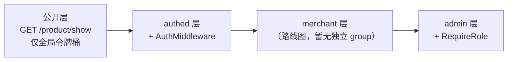
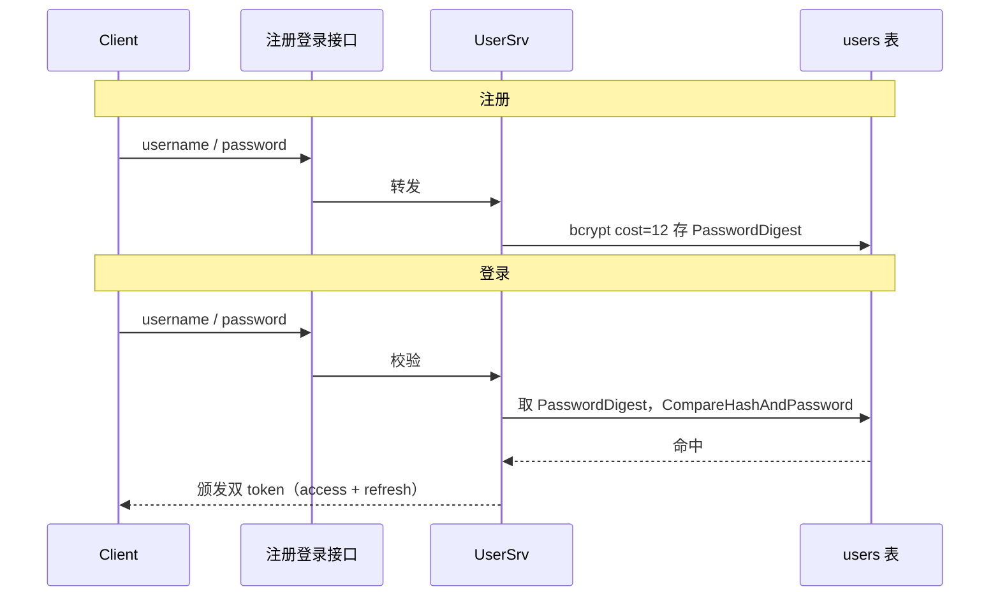
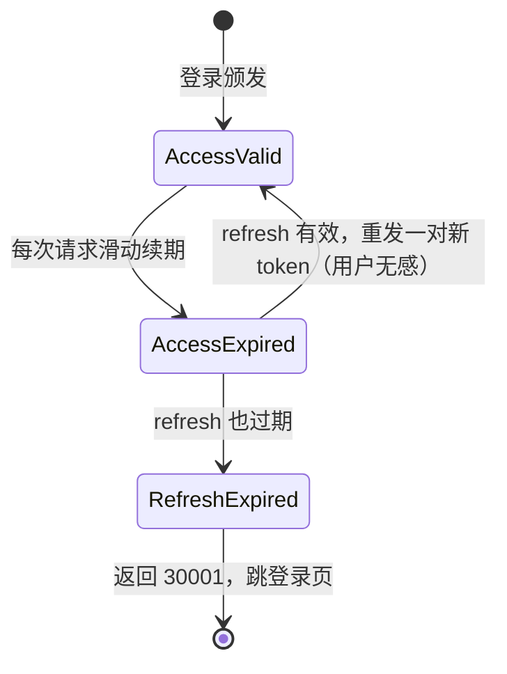
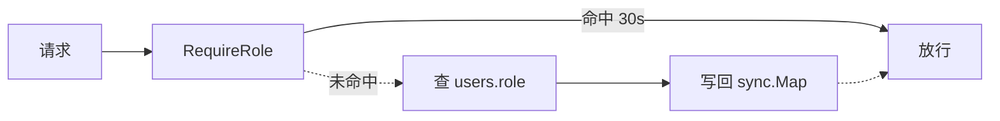
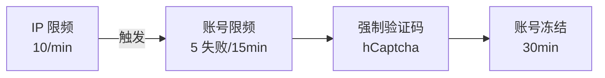
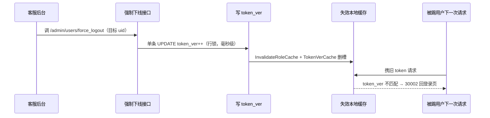

# 用户与鉴权的业务边界

> gomall · 五角色视角 / 注册 / 双 token / RBAC / admin bootstrap
>
> 这份讲义不讲"怎么写一个 JWT 库"，讲的是**每条鉴权决策背后的业务取舍**——信谁、信多久、信他能干什么，以及每个决策错了会赔多少钱、客服要说什么话、SLO 会怎么抖。

## 目录

- [一、五角色视角：鉴权到底在为谁工作](#一五角色视角鉴权到底在为谁工作)
- [二、注册 + 登录 + 双 token：第一道业务边界](#二注册--登录--双-token第一道业务边界)
- [三、RBAC：30s 缓存为什么业务能接受](#三rbac30s-缓存为什么业务能接受)
- [四、admin bootstrap + 三层边界路线图](#四admin-bootstrap--三层边界路线图)
- [五、token 失效 / 强制下线 / 多端隔离](#五token-失效--强制下线--多端隔离)
- [附录 A：面试 Q&A](#附录-a面试-qa)
- [附录 B：课后作业](#附录-b课后作业)

---

## 一、五角色视角：鉴权到底在为谁工作

### 为什么把"用户鉴权"放在第一份 deck

一笔 100 元的订单，从浏览到收货要经过 20 多个技术环节。**鉴权是第一环**——它错了，后面 19 环全建在危房上。

而且鉴权失败的代价从来不是一个 5xx 报错，是真金白银：

- **C 端越权下单** → 用户用 A 账号的余额买走了 B 账号想要的商品；
- **商家越权发货** → 把别家的订单标成"已发"，钱货两失；
- **admin 误授权** → 客服把全场红包发给了自己。

> **鉴权 = 用最少的代码表达业务对"信任"的明确表态：信谁、信多久、信他能干什么。**

### C 端越权下单：一个 HTTP 请求的资损

先看一个具体攻击，它会贯穿整份讲义。**攻击者 B**（余额 0）用**自己合法的** token 下单，却把请求体里的 `user_id` 填成受害者 **A**（余额 ¥5000）：

```http
POST /api/v1/order HTTP/1.1
access_token: <B 自己的合法 token>   # 是 B 的 token，不是 A 的
Content-Type: application/json

{
  "product_id": 88,
  "num": 1,
  "address_id": 999,     // 收货到 B 家
  "user_id": 1001        // 但订单归属写成 A 的 uid
}
```

**如果服务端信了 body 里的 `user_id`**：扣 **A 的 ¥5000**、发货到 **B 家**——A 的钱、B 的货，A 账上凭空多出一笔自己从没下过的订单。

这不是一次可以重试的 5xx，是**追不回的资损**：钱已划走、货已发出，客服面对的是一句"我没买过为什么扣我钱"。

> gomall 的防线：**只信 JWT 解出的 `u.Id`，无视 body 里的 `user_id`**。下单时 `order.UserID = u.Id`，B 填谁都只会记在 B 自己头上，攻击当场失效。这就是本讲义反复强调的"信 JWT，不信报文"。

### 五角色，五种"鉴权痛"

同一套鉴权代码，五个利益相关者各自的诉求和"出错后果"完全不同。把技术词"鉴权"翻译成每个角色的业务痛，才知道为什么值得讲一整份 deck：

| 角色 | 鉴权诉求 | 出错的真实后果 |
|---|---|---|
| C 端用户 | 一次登录管 10 天，改密码立即生效 | 频繁踢登 → DAU 流失 |
| 商家 | 只看自家订单 / SKU | 越权读单 → 商业泄密（订单流水就是经营机密） |
| 运营平台 | 大促撞库不打爆 bcrypt（一个故意设计得很慢的 hash 函数，单次校验耗上百 ms CPU） | 正常用户登录 502 → GMV 损失 |
| SRE | 鉴权链路不能成性能瓶颈：它是全站请求的第一道关 | 解 token 每慢 1ms → 全站 p99 同步抬 1ms |

本讲义每一节前都会标注**本节解决谁的痛**。项目 README 的"业务全景表"各行对应的就是这几个角色——鉴权是它们的最小公约数。

### 存密码的前提：拖库是"何时"，不是"是否"

密码存储的威胁模型不是"有人在线猜密码"，而是**整张 user 表被泄密**（SQL 注入 / 内网渗透 / 备份泄露）。拖库之后比的只有一件事：**把摘要还原成密码要花多少钱**。

- **存明文**：拖库 = 全体用户裸奔。人们到处复用密码，你这泄露的密码会被拿去撞他的支付宝。
- **MD5 / SHA-256**：这类函数是为"快"设计的（校验文件完整性要算得快）——一张消费级显卡每秒能算**几百亿次**，常见密码字典几小时就扫完，等于白给。
- **加盐的快哈希**：盐只能废掉彩虹表——攻击者提前把常见密码 → 摘要算成一张大表、拖库后直接反查；盐让每个用户都得单独重算，预计算白做。但对着**单个账户**现场跑字典，盐（随机生成的字符串）拦不住。
- **bcrypt 的答案**：把"算一次"故意变贵。合法用户登录只算 1 次（两三百 ms 无感），拖库者字典里**每个词**都要付两三百 ms——成本差出几个数量级。而且 bcrypt 每轮都要反复读写 4KB 内部状态表，GPU 的海量核心被内存访问卡死、并行加速失效，这是它敢慢的底气。

一条 bcrypt 摘要长这样，所有参数都自包含在这 60 个字符里：

```
$2a$12$R9h/cIPz0gi.URNNX3kh2OPST9/PgBkqquzi.Ss7KIUgO2t0jWMUW
 ^^ ^^ \--------------------/\-----------------------------/
 ver cost=12    22 字符 salt          31 字符 hash
```

> **bcrypt 三件套**：
>
> - **cost 旋钮**——内部循环`2^12 = 4096` 轮，硬件变快就把 12 改成 13，成本翻倍，安全性随硬件水涨船高；
> - **自动加盐**——同一个密码，两个用户存出来的摘要也完全不同；
> - **自包含格式**——版本 / cost / 盐全编码在摘要串里，所以升级 cost 不用迁移存量数据：老摘要按老参数校验，用户下次登录成功时顺手 rehash 到新 cost。

### 代码：bcrypt 在 gomall 的三处落点

```go
const PassWordCost = 12 // 2^12 = 4096 轮，单次校验数百 ms CPU

// 注册 / 改密码
func (u *User) SetPassword(password string) error {
    bytes, err := bcrypt.GenerateFromPassword([]byte(password), PassWordCost)
    if err != nil {
        return err // 失败绝不写脏摘要
    }
    u.PasswordDigest = string(bytes) // 盐已编码在摘要里
    return nil
}

// 登录（internal/user/service.go:98 调用）
func (u *User) CheckPassword(password string) bool {
    return bcrypt.CompareHashAndPassword(
        []byte(u.PasswordDigest), []byte(password)) == nil
}

// 6 位支付密码，同样只存 bcrypt 摘要
func (u *User) SetMoneyPassword(pin string) error {
    bytes, err := bcrypt.GenerateFromPassword([]byte(pin), PassWordCost)
    if err != nil {
        return err
    }
    u.MoneyPasswordDigest = string(bytes)
    return nil
}
```

三个要点：

- User 表只有 `PasswordDigest` 一列，**没有单独的 salt 列**——`CompareHashAndPassword` 从摘要里解析出盐和 cost 再重算比对。`bcrypt` 密文长这样： `$2a$10$N9qo8uLOickgx2ZMRZoMyeIjZAgcfl7p92ldGxad68LJZdL17lhWy`，从中提取出salt
- **6 位 PIN 只有 100 万种可能**：`10^6 × 300ms` 单核串行也只要约 3.5 天，多核并行按小时计。低熵凭证 bcrypt 只是兜底，真正的防线是在线侧的错误锁定 / 限流——哈希救不了熵不足。
- **一个真实的兜底陷阱**：`CheckMoneyPassword` 对**空摘要直接放行**（历史 / 种子用户未设支付密码时 `return true`）。这是"兼容优先"的安全默认值，但对资金动作是 fail-open——课堂讨论题：这算 bug 还是权衡？（审计结论：应改成 fail-closed，见[第五节](#五token-失效--强制下线--多端隔离)与代码库审计。）

```go
// internal/user/model.go —— 注意这里的 fail-open
func (u *User) CheckMoneyPassword(pin string) bool {
    if u.MoneyPasswordDigest == "" {
        return true // 未设支付密码就放行——支付二次校验被整体跳过
    }
    return bcrypt.CompareHashAndPassword([]byte(u.MoneyPasswordDigest), []byte(pin)) == nil
}
```

> **同一个"慢"的两面**：**离线是武器**（拖库还原成本以年计），**在线是软肋**（CPU 被撞库打满）。所以全局令牌桶（`routes/router.go:41`，每 IP 100 RPS）必须站在 bcrypt **前面**——这正是"鉴权痛"表里运营平台那一行的答案。

### 鉴权 = 身份 / 角色 / 边界

鉴权其实是三件事，单挑都不难，难在配合：

- 身份对了、角色错了 → 客服越权补券给自己；
- 角色对了、边界错了 → admin 接口暴露给 C 端；
- 身份角色都对、边界没画清 → 商家 A 看见商家 B 的订单。

gomall 的回答，也是本讲义后三节的主线：

| 维度 | 回答 | 讲解位置 |
|---|---|---|
| **身份**（客户在不在） | 双 token + bcrypt cost=12 | 第二节 |
| **角色**（能看见什么） | RBAC + 30s sync.Map 缓存 | 第三节 |
| **边界**（做不到什么） | 路由分组 + middleware 链 + admin bootstrap | 第四节 |

### gomall 的三层墙：公开 / authed / admin



- **公开层**：能匿名访问，挂 HTTP cache，不挂任何 auth（浏览是转化漏斗顶端，给它加登录墙等于赶客）。
- **authed 层**：所有 C 端用户登录后能用，挂 `AuthMiddleware`。
- **merchant 层**：**当前还没有独立 group**，商家身份借 user 表 Role 字段表达。
- **admin 层**：在 authed 内再嵌一层 `RequireRole("admin")`。

### 代码：三层墙是怎么砌的

墙只在**组合根**（composition root，`routes/router.go` 这一个组装点）砌一次：

```go
// routes/router.go —— 三层墙一次砌好，每层墙开一道门
v1 := r.Group("api/v1")                          // 第一道门：公开层，不设锁
authed := v1.Group("/")
authed.Use(middleware.AuthMiddleware())          // 第二道门：验 JWT（你是谁）
adminGroup := authed.Group("/admin")
adminGroup.Use(middleware.RequireRole("admin"))  // 第三道门：验角色（能干嘛）

// 20 个领域包统一签名自注册，各自只"选墙"、不"砌墙"
for _, register := range []func(public, authed, admin *gin.RouterGroup){
    user.RegisterRoutes, product.RegisterRoutes, // ...
} {
    register(v1, authed, adminGroup)
}
```

领域包拿到的是已套好中间件的 group：

```go
// internal/user/routes.go —— 发凭证的门自己不能锁
public.POST("user/register", UserRegisterHandler())
public.POST("user/login",    UserLoginHandler())
authed.GET("user/show_info", ShowUserInfoHandler())

// internal/refund/routes.go —— merchant 墙未落地的临时替身：逐路由挂 admin RBAC
authed.POST("orders/refund/approve",
    middleware.RequireRole("admin"), ApproveRefundHandler())
```

- 墙只砌一次，领域包只**选墙**、不砌墙——挂错墙在 code review 里就是一行看得见的 diff。
- public 组不是"忘了鉴权"：login / register 是**发凭证**的入口，必须匿名可达。
- 上面 merchant"路线图"的现状：`approve` / `ship` 这类商家操作逐路由叠 `RequireRole("admin")` 顶着，将来 merchant 角色落地时要一处处改回。

> **分组即策略**：把"谁能进"编码在**路由结构**里（进门就查），而不是散在每个 handler 里（进屋后才想起来查）。前面「C 端越权下单」案例的第一道防线就是这里。

### 本 deck 的回答顺序

1. 注册 + 登录链路，密码加密 / 邮箱验证的业务边界画在哪；
2. access 24h / refresh 10d 这两个数字怎么定，怎么影响留存；
3. RBAC 为什么敢上 30s 内存缓存；
4. admin bootstrap 这个"一次性接口"为什么必须存在；
5. C 端 / merchant / admin 三层边界，merchant 还差什么；
6. token 失效 / 强制下线 / 多端隔离怎么做；
7. 业务码 `30001 / 30002` 对应的客服话术。

---

## 二、注册 + 登录 + 双 token：第一道业务边界

### 注册 / 登录 / 颁发 token 的时序



### 密码是怎么存的：bcrypt cost=12

- **bcrypt** 自带 salt、单向、不可还原。重置密码只能让用户重新设置，后台永远拿不到明文。
- `PassWordCost = 12`：单次哈希约 250ms（M 系列 Mac）。
  - 业务收益：撞库脚本一秒只能猜 4 次，10 位密码组合在合理时间内不可穷举。
  - 业务代价：登录接口 RT 多 250ms，落在用户感知阈值内，C 端可接受。
- 注册存哈希，登录拿明文重算 hash 再 compare。被拖库后撞库代价巨大。
- **找回密码必须走邮箱验证 + token 写新摘要**：`EmailClaims` 携带的是 bcrypt 摘要而非明文，TTL 仅 **15 分钟**，远短于 access token。

### bcrypt cost=12 的业务后果（用钱算账）

**被拖库情景**：黑产拿到 `password_digest` 全表，离线撞库。

| 配置 | 1 万弱密码账号破解成本 | 破解时长 |
|---|---:|---:|
| 明文 / MD5 | ~0 美元 | 秒级 |
| bcrypt cost=10 | ~600 美元 GPU | ~8 小时 |
| **bcrypt cost=12** | **~9,600 美元 GPU** | **~5 天** |
| bcrypt cost=14 | ~150,000 美元 | ~80 天 |

**登录 RT 代价**：cost=12 单次约 250ms。

- 经验数据：登录页 RT 每多 100ms，注册转化率掉约 0.8%，DAU 留存掉约 0.3%。
- 250ms 落在"用户感知阈值 300ms"之内，转化和留存基本不动。
- 反例：cost=14 单次约 1s → 用户感知"卡顿" → 大促日新用户注册流失估算 5–8%。

> 选 cost=12，本质是在"离线撞库成本"和"在线登录延迟"之间找那个既让黑产亏得肉疼、又让用户无感的点。

### 双 token 续期的状态机



- **access valid**：`AuthMiddleware` 顺便**续发**新 access + refresh，写回 header + cookie。
- **access 过期 / refresh 有效**：拿 refresh 重发一对新 token，用户无感知。
- **两者都过期**：返回 `30001`，C 端跳登录页。

> ⚠️ **代码现状提醒**：当前实现里 access 未过期时**也**会重新签发，且每个请求都续期——等于只要 10 天内有一次访问，会话就永不过期。叠加"JWT 目前无撤销机制"，被盗 token 可以无限续命。这是"改密码立即生效"当前**做不到**的根因，路线图见[第五节](#五token-失效--强制下线--多端隔离)。

### refresh 10d / 7d / 30d 三选一：复购漏斗 vs 安全风险

| refresh 取值 | 业务收益 | 安全代价 |
|---|---|---|
| 7d | 周一上班大概率重登，复购漏斗在登录页流失约 8% | 偷设备最多 7d 危险窗 |
| **10d** | 黄金周 + 双休回流用户无感登录（电商目标用户群行为吻合） | 偷设备 10d 危险窗，可接受 |
| 30d | 月活用户几乎不重登，登录页流失约 2% | 偷设备 30d → 客诉激增，黑产"账号即资产" |

- gomall 选 10d 是**业务行为画像决定的**：电商用户两周内打开 app 的概率 > 85%。
- 30d 看似友好，实际放大**被偷账号挂闲鱼"包登录"黑产**：盗号后 24h 内不修改资料，老主人完全感知不到。
- 10d 也是合规线：很多支付牌照要求 token 有效期 ≤ 14d。

### 代码：AuthMiddleware 主链路

```go
// middleware/jwt.go
accessToken := c.GetHeader("access_token")
refreshToken := c.GetHeader("refresh_token")
if accessToken == "" {
    code = e.InvalidParams
    c.JSON(200, gin.H{"status": code /* ... */})
    c.Abort()
    return
}

newAccessToken, newRefreshToken, err :=
    util.ParseRefreshToken(accessToken, refreshToken)
if err != nil {
    code = e.ErrorAuthCheckTokenFail
}
// ...
SetToken(c, newAccessToken, newRefreshToken)
c.Request = c.Request.WithContext(
    ctl.NewContext(c.Request.Context(), &ctl.UserInfo{Id: claims.ID}))
```

注意最后两行：中间件把**从 JWT 解出的 `claims.ID`** 塞进 request context，下游 handler 一律从 context 取 `u.Id`。这就是"信 JWT、不信报文"落地的地方——[越权下单](#c-端越权下单一个-http-请求的资损)填的 `body.user_id` 从头到尾没人读。

---

## 三、RBAC：30s 缓存为什么业务能接受

### 30s 内存缓存命中链路

`RequireRole` 在每个受保护请求上都要回答"这个 uid 现在是什么角色"。角色存在 DB 里，每请求查库会让鉴权变成全站最热路径上的瓶颈（SRE 那行的痛）。于是加一层短 TTL 内存缓存：



### 代码：lookupRole + 30s sync.Map 缓存

```go
// middleware/rbac.go
var (
    roleCache    sync.Map
    roleCacheTTL = 30 * time.Second
)

func lookupRole(ctx context.Context, userId uint) (string, error) {
    if v, ok := roleCache.Load(userId); ok {
        e := v.(roleCacheEntry)
        if time.Now().Before(e.expires) {
            return e.role, nil
        }
    }
    u, err := user.NewUserDao(ctx).GetUserById(userId)
    if err != nil {
        return "", err
    }
    role := u.Role
    if role == "" {
        role = "user"
    }
    roleCache.Store(userId, roleCacheEntry{role, time.Now().Add(roleCacheTTL)})
    return role, nil
}
```

**为什么用标准库 `sync.Map` 而不是 freecache / bigcache 这类缓存库**：这个缓存的画像是"key 集合稳定（活跃用户 uid）、条目 ~50 字节、极端读多写少、几 MB 封顶"——正是 `sync.Map` 文档写明的适用场景，读路径完全无锁。缓存库的卖点（容量上限 + LRU 淘汰、抗 GC 的 off-heap 存储、高命中率算法）在这里一个都用不上，反而白添依赖和序列化开销。选型不是比功能多，是比能力集合跟工作负载贴得多紧。

### 30s 在业务上意味着什么 + 显式失效兜底

这 30s 是"最终一致"——不是时刻正确，而是保证 30s 内收敛到正确。它有两个方向，风险完全不对称：

- **提权**（user → admin）：管理员把客服 A 升为 admin，最长 30s 后 A 才享受 admin 权限。后果只是"怎么还没生效"，**零风险**。
- **降权 / 回收**（admin → user）：一个已经不该是 admin 的人，缓存还放他进门最长 30s。这才是需要论证的**安全窗口**。

那么这 30s 窗口能干多大的坏事？逐个看 admin 能力：

- 列用户（读操作，无损）、promote（可再回收）、重灌 ES 索引（重建而已）——都不是"钱瞬间没了"级别。
- ⚠️ **但有一个真实资金风险**：退款审批 `orders/refund/approve` 已经挂了 `RequireRole("admin")`，而 approve 推进订单到 Refunded 后会触发**真实资金结算**（买家余额 +、卖家余额 −、写复式台账）。也就是说，**一个被降权的 admin 在 30s 窗口内批退款，钱是真的会动的**。（这一条修正了早期讲稿"控钱接口尚未挂 admin、无 30s 资金风险"的说法——退款审批 RBAC 已落地，风险是真实的。）

所以结论是**两层保险**，而不是二选一：

- **日常读请求（99%）** 靠 30s 缓存吃性能，0ms 命中；
- **角色变更这种关键写事件（1%）** 不等 TTL 自然过期，由变更方主动调 `InvalidateRoleCache(userId)` 踹掉缓存 → 下一个请求 cache miss → 查 DB 拿到新角色 → **立即生效**。

> **选型 = 最终一致 + 关键路径显式失效。** TTL 还有一个兜底意义：就算某条变更路径忘了调 Invalidate（比如运营直接在 DB 里跑 SQL 改角色，根本不经过 Go 代码），错误状态最多也只活 30 秒，不会永久漂移。

**两个当前实现的真实天花板**（比选型更值得讲）：

1. `roleCache` 是**进程内的 sync.Map**——多实例部署时，实例 A 上的 `InvalidateRoleCache` 只清得掉 A 自己的缓存，实例 B 的旧缓存照样活到 TTL。所以多副本下 30s 窗口物理上消不掉，除非上 Redis pub/sub 广播失效。
2. **缓存无上限、无清理，也没有 singleflight**——key 随见过的 uid 单调增长（内存泄漏隐患）；某个 uid 缓存过期瞬间的并发请求会一起击穿到 DB。同包 `ratelimit.go` 已有 janitor 回收模式可直接照搬。
3. 而且当前仓库**只有升权 API、没有降权 API**——降权只能直改 DB，缓存不失效，"降权后 30s"因此是理论 + 真实资金风险叠加。

---

## 四、admin bootstrap + 三层边界路线图

### 冷启动悖论

- 上线一个全新 gomall 实例，users 表是空的。
- 想给"运维大佬"开 admin 权限，必须调 `/admin/users/promote`。
- 但 `/admin/...` 子组的中间件链是 `Auth + RequireRole("admin")`。
- **此时一个 admin 都没有，谁也进不去 admin 子组** → 没人能把别人提升为 admin。

> 这就是 admin bootstrap 必须存在的原因：**先有第一个 admin，后面 RBAC 才能转起来**。（生产上另一种做法是直接在线上 DB 里跑一条 SQL 授权，绕开这个接口。）

### 代码：BootstrapPromoteSelf 一次性校验

```go
func (s *AdminSrv) BootstrapPromoteSelf(ctx context.Context) error {
    u, err := ctl.GetUserInfo(ctx)
    if err != nil {
        return err
    }
    db := user.NewUserDao(ctx).DB
    var count int64
    if err := db.Model(&user.User{}).
        Where("role = ?", user.RoleAdmin).
        Count(&count).Error; err != nil {
        return err
    }
    if count > 0 {
        return errors.New("系统已存在 admin，禁止使用 bootstrap 接口")
    }
    return s.PromoteToAdmin(ctx, u.Id)
}
```

用 `count(*) WHERE role='admin' > 0` 把这个接口变成"一次性"：一旦有了第一个 admin，它立即自锁。

> ⚠️ **一个真实的 TOCTOU 竞态**：`Count` 检查与 `PromoteToAdmin` 写入不在同一事务/锁内。两个用户并发调用，都读到 count=0，就会**双双成为 admin**。修复：把 count + promote 放进一个事务并加锁，或用唯一约束兜底。

### C 端 / merchant / admin 三层对比

| 角色 | 路由位置 | 中间件链 | 业务能力 |
|---|---|---|---|
| 匿名 user | v1 顶层 | 仅全局令牌桶 | 浏览商品 |
| C 端 user | authed 组 | + AuthMiddleware | 下单 / 抢券 |
| merchant | 暂无 | —— | **路线图** |
| admin | admin 子组 | + RequireRole | 提权 / 后台 |

- C 端 vs admin 的边界靠 `RequireRole("admin")` 拦下。
- merchant 身份当前由 user 表 Role 字段表达，单店家阶段够用；多店家时升级为独立 group。
- **`product/create` 当前挂在 authed 组**——任何登录用户都能建商品，但控权靠的是"创建者即卖家"：`ProductCreate` 把卖家身份直接取自 JWT 解出的 uid（`BossID = GetUserById(u.Id)`），**不从请求体取**，所以冒充别家店铺上架做不到。（早期讲稿说"由 Role 控权"不准确——实际没有 Role 检查，靠的是 BossID 取自 token 这个机制。）
- 多店家阶段的迁移三件套：迁入 merchant group + 叠加 `RequireRole("merchant")`（垂直墙，防非商家进入）+ DAO 层 `shop_id` 隔离（水平墙，防商家 A 翻商家 B 的货）。**RBAC 只防垂直越权，水平越权要靠数据层归属条件**，两面墙缺一不可。

### 攻击面：登录接口要扛三种黑产打法

| 攻击类型 | 特征 | 单点拦截手段 |
|---|---|---|
| 撞库 (credential stuffing) | 用泄露库扫所有用户 | 失败限频 + 二次验证 |
| 密码喷洒 (spraying) | 用弱密码扫上万人 | 全局账号失败计数 |
| 账号枚举 | 靠错误码差异爆破用户名 | 错误码归一 / 时序对齐 |

- 登录基线：bcrypt cost=12 已让单次猜测代价约 250ms，离线撞库极不经济。
- 错误码归一：`10003`（用户不存在）/ `10005`（密码错）对外统一话术，杜绝靠回包差异枚举用户名（对内保留具体码做审计）。
- 行业通用的下一层是**失败限频**：3000 IP 代理池 × 5 RPS = 15k RPS 的高频试探，靠 IP + 账号双维度限频在打到 bcrypt 之前就拦掉。

### 撞库防御三段式：限频 + 验证码 + 冻结



- **第一层**：IP 维度滑动窗口限频。
- **第二层**：账号维度连续失败计数，5 次失败强制带验证码。
- **第三层**：15min 内累计 10 次失败 → 冻结 30min，直接返回错误码、不消耗 bcrypt。
- bcrypt cost=12 每次 250ms，账号冻结后**省的是 CPU，不是用户体验**——冻结的目的就是别让撞库流量白烧登录服务的 CPU。

### 代码：登录失败计数 + 强制验证码门槛

```go
const (
    loginFailKeyPrefix = "auth:login:fail:"
    loginFailThreshold = 5 // 15min 内
)

func (s *UserSrv) preflight(ctx context.Context, name, cap string) error {
    fails, _ := cache.RedisClient.Get(ctx, loginFailKeyPrefix+name).Int()
    if fails >= loginFailThreshold && cap == "" {
        return ErrCaptchaRequired // 业务码 10011
    }
    if fails >= loginFailThreshold {
        if ok, _ := captchaVerify(ctx, cap); !ok {
            return ErrCaptchaInvalid
        }
    }
    return nil
}
```

---

## 五、token 失效 / 强制下线 / 多端隔离

### token 黑名单方案：版本号 vs SET

无状态 JWT 的固有代价是"失效慢"——签出去的 token 在自然过期前一直有效。要做到"改密码/登出/被盗立即失效"，需要额外的撤销机制：

| 方案 | 实现 | 代价 |
|---|---|---|
| A. Redis SET 黑名单 | `SISMEMBER jti` | 每请求 1 RTT，TTL 难管 |
| B. 用户 token 版本号 | `users.token_ver`，签进 claims | 每请求查 DB / 本地缓存 |
| C. 用户最早签发时间戳 | `users.token_min_iat`，对比 iat | 改密码只写一次 |

- A 按 token 粒度（应对被偷单个 token 的场景），`jti` 数随活跃用户线性增长。
- B/C 按用户粒度（改密码 / 强制下线），改一次字段全部作废。
- gomall 推荐 **B+C 合并**：版本号 `++` 即生效，本地 sync.Map 命中 0ms。

> ⚠️ **这是当前代码最大的缺口**：Claims 里只有 id + username，没有 `token_version`。改密码只更新 `PasswordDigest`，旧 token 照样有效。第一节讲的"改密码立即生效"目前是路线图，不是现状。这是最值得补的一件事。

### 客服强制下线时序



- 写 `token_ver`：单条 UPDATE 行锁，毫秒级返回。
- 失效本地缓存：与 RBAC 共用 `InvalidateRoleCache` 模式，按 userId 删本地 sync.Map 槽。
- 多实例场景：写 Redis pub/sub 让所有实例 Del 本地缓存槽，最终一致延迟 < 100ms。

### 为什么 gomall 选纯 JWT，不走 session cookie

| 维度 | Server Session | JWT（双 token） |
|---|---|---|
| 鉴权 RT | 读 Redis 1 RTT | 解 HS256 零 RTT |
| 失效粒度 | 删 session，O(1) | 黑名单 / token_ver |
| 水平扩缩 | 共享存储瓶颈 | 无状态，加机器即可 |
| 跨域 / 多端 | cookie SameSite | header 跨域无障碍 |

- gomall 的优先级：**鉴权延迟 + 水平扩展 + 多端** → JWT。
- 代价：失效慢，用 `token_ver` + 黑名单兜底关键路径。
- 反例：银行类业务选 session 更合理——那里失效粒度比延迟重要。

### 审计日志：admin 操作必须留痕

- 当前 admin 3 个接口（promote / backfill / users）**无审计写入**——这是个缺口。
- 合规字段：`operator_id / target_id / action / reason / before / after / ts / ip / UA`。
- 路线图：`admin_audit` 表 + `AuditMiddleware` 挂 admin 子组自动入表。
- 索引：`(operator_id, ts)` 供客服自查；`(target_id, ts)` 供投诉反查。
- 不允许 DELETE，按月分区，异地冷备 7 年。审计是补券 / 强制下线的前置依赖。

---

## 附录 A：面试 Q&A

**Q1：access 24h / refresh 10d 这两个数字怎么定？**
A：access 短，限制单个 token 泄露的损失；refresh 长，覆盖周末/假期回流。10d 是留存与安全的折中，也贴合支付牌照 ≤14d 的合规线。

**Q2：RBAC 30s 内存缓存，admin 误授权 30s 不是漏洞吗？**
A：常规延迟可接受（提权慢生效无害）。关键路径用 `InvalidateRoleCache(userId)` 显式失效，提权/降权立即生效。真实风险点在退款审批已挂 admin 且触发资金结算，降权必须走显式失效。

**Q3：登出后老 token 还能用怎么办？**
A：token 仅控访问、不直接控钱，大额动作有二次验证兜底。根治靠 Claims 加 `token_version`，登出/改密码时 `++`，解析时比对——目前是路线图。

**Q4：bcrypt cost=12 怎么选？怎么无痛升 14？**
A：250ms 在 300ms 感知阈值内，离线穷举不现实。登录成功路径探测旧 hash 顺便 re-hash，约 90 天自然升完，无需停机迁移。

**Q5：登录接口怎么扛 15k RPS 撞库？**
A：IP + 账号双维度滑动窗口 + 5 次失败强制验证码 + 30min 冻结，让撞库流量在打到 bcrypt 之前就被拦掉。

**Q6：admin bootstrap 一次性接口怎么防重？**
A：`count(*) WHERE role='admin' > 0` 直接返回错。当前有 TOCTOU 竞态，并发需加事务/advisory lock 兜底。

**Q7：merchant 没独立 group 为什么不阻塞上线？**
A：单店家场景 user 即 merchant，靠"创建者即卖家"（BossID 取自 token）控权。多店家才需要 group + DAO 层 shop_id 双层隔离。

**Q8：业务码 30001 vs 30002 用户视角一样，区分有何意义？**
A：用户都是重登，但客服要区分"安全事件（被踢）vs 长闲置（自然过期）"，比例异常还能触发审计。

**Q9：客服强制下线如何实现？多端怎么隔离？**
A：users 加 `token_ver` 签进 claims，改密码/下线时 `++`。多端按 `client_type` 分桶存 `token_ver_map`。

**Q10：为什么 gomall 选 JWT 不选 session？**
A：零 RTT + 无状态扩展 + 多端 header 无跨域。代价是失效慢，用 `token_ver` 兜底。银行业务选 session 更合理。

**Q11：第三方登录怎么接入？**
A：OAuth 拿 `external_id` → 查/建 `user_oauth` → 复用 `GenerateToken`。后续仍走 AuthMiddleware。

**Q12：100k QPS 鉴权怎么扩？瓶颈在哪？**
A：HS256 + sync.Map 单机约 58k RPS，100k 扩 4 实例够用。瓶颈始终在下单/支付/库存，不在鉴权。

---

## 附录 B：课后作业

### 编程题（可上 OJ 判题）

**题 1 · 越权下单的身份判定（IDOR）**
下单请求同时带两处身份：JWT 解出的可信 `uid`，与请求体里的 `body_uid`。实现 `resolveOwner`，返回订单真正的归属用户，并说明为何忽略 `body_uid`。
- 输入：每行 `uid body_uid`（多组）
- 输出：每组订单归属 uid
- 判分点：无论 `body_uid` 填谁，归属恒等于 `uid`（信 JWT，不信报文）。

**题 2 · 双 token 续期状态机**
给定 `access_ttl / refresh_ttl` 与一串带时间戳的请求，输出每次请求后的动作 `PASS / REFRESH / RELOGIN`：access 过期且 refresh 有效 → REFRESH；两者皆过期 → RELOGIN。

**题 3（选做）· 登录失败计数 + 强制验证码**
滑动窗口内失败达阈值即要求验证码，冻结期请求直接拒绝、不消耗 bcrypt。输入事件流，逐条输出：放行 / 要求验证码 / 冻结。

### 概念思考题（检测是否学懂）

用一两句话回答，重点讲"为什么"，不是"是什么"：

1. bcrypt 为什么选 cost=12，而不是更快的 10 或更慢的 14？升到 14 如何做到用户无感？
2. 登出后老 access 还能用，为什么这不算致命漏洞？兜底手段是什么？
3. RBAC 用 30s 内存缓存，admin 误授权 30s 才生效——为什么业务能接受？哪条路径必须绕过缓存立即失效？
4. admin 冷启动悖论是什么？`BootstrapPromoteSelf` 用什么条件保证只能被"占用"一次？它现在有什么并发缺陷？
5. 下单接口为什么只信 JWT 里的 uid、无视请求体的 `user_id`？若信了会发生什么资损？
6. gomall 为什么用无状态 JWT 而不用 session？这个选择在什么业务（如银行）下应该反过来？
