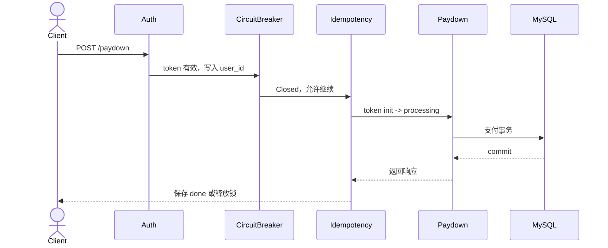
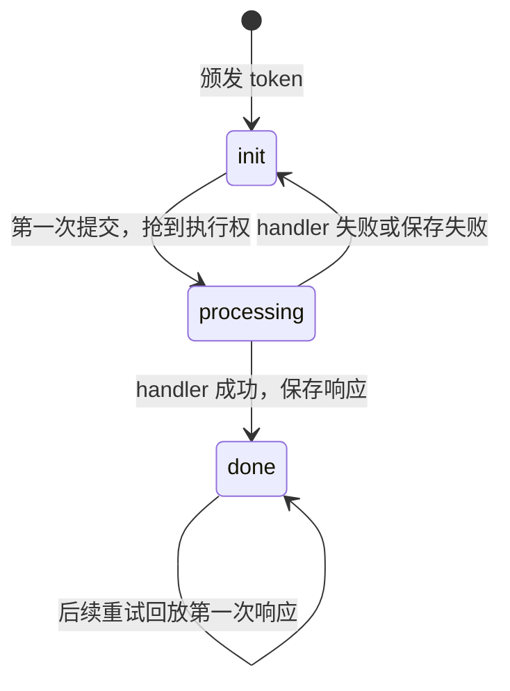
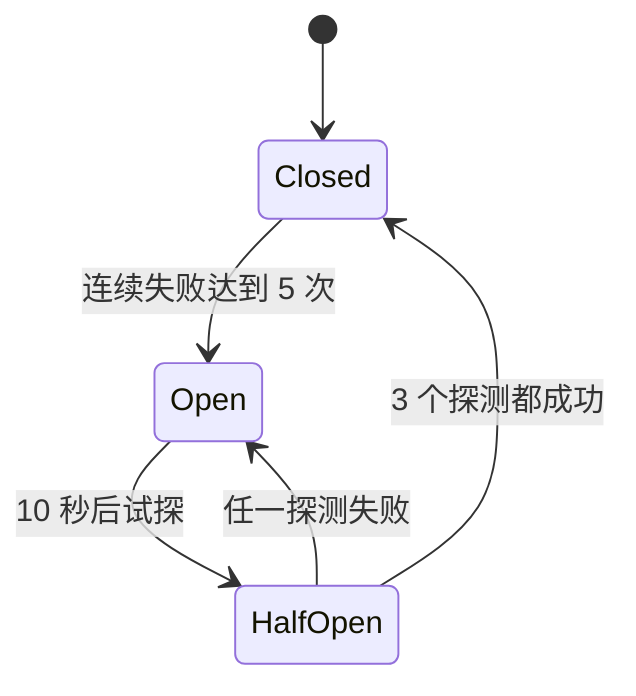

# 第二讲·支付（下）：重复请求为什么不能变成重复扣款

> gomall · 幂等 / 熔断 / 重试 / 半成功 / 对账
>
> 重复请求不可避免。支付系统要保证的是：同一次支付意图无论到达多少次，都不能产生第二次资金副作用；系统已经连续故障时，要快速失败；事务提交后的半成功状态，要靠回放、重试和对账收敛。

## 录制时间预算

这集建议控制在 **40 分钟以内**：

| 段落 | 时间 | 讲什么 |
|---|---:|---|
| 一、重复请求为什么一定会出现 | 5 min | 从响应丢失的现场切入 |
| 二、入口护栏各自挡什么 | 7 min | 限流、鉴权、熔断、幂等的顺序 |
| 三、同一次支付只能执行一次 | 11 min | Redis 状态机 + 数据库兜底 |
| 四、系统故障时快速失败 | 7 min | Closed/Open/HalfOpen 和错误分类 |
| 五、半成功之后怎样收敛 | 6 min | 回放、重试、对账 |
| 六、课堂故障演练 | 4 min | 验证 commit 成功、响应丢失后的行为 |

附录不进正片。代码走读只停在路由顺序、幂等状态机和熔断失败判断三处，其余实现作为课后复查材料。

## 目录

- [一、用户只点了一次，为什么服务端会收到两次](#一用户只点了一次为什么服务端会收到两次)
- [二、`/paydown` 入口到底排了哪些中间件](#二paydown-入口到底排了哪些中间件)
- [三、幂等：同一张票不要重复扣钱](#三幂等同一张票不要重复扣钱)
- [四、熔断：坏了就先别继续打](#四熔断坏了就先别继续打)
- [五、半成功之后靠什么收敛](#五半成功之后靠什么收敛)
- [六、课堂故障演练](#六课堂故障演练)
- [附录 A：面试 Q&A](#附录-a面试-qa)
- [附录 B：课后作业](#附录-b课后作业)

---

## 一、用户只点了一次，为什么服务端会收到两次

**网络只能保证请求被尝试发送，不能替客户端证明服务端有没有提交事务。重复请求因此一定会出现。**

先看一个支付系统每天都会遇到的现场：

```text
T0：用户点支付
T1：后端扣款、写流水、订单改待发货
T2：数据库 commit 成功
T3：响应在网络里丢了，前端没收到
T4：前端自动重试，或者用户又点了一次
```

用户视角很简单：页面刚才转圈失败了，我再点一次。

后端视角很危险：第一次可能已经成功了，第二次不能再扣钱。

支付幂等处理的是一个具体问题：

> 客户端不知道第一次请求到底死在路上，还是已经成功提交。

这类问题不能靠“前端禁用按钮”解决。按钮禁用挡不住网络重试、App 重放、代理超时、用户刷新，也挡不住恶意脚本。

支付入口至少要分清三种问题：

| 问题 | 典型现场 | 用什么挡 |
|---|---|---|
| 操作太频繁 | 某个 IP 或用户疯狂点 | 限流 |
| 下游已经坏了 | 支付网关 30 秒超时 | 熔断 |
| 同一笔交易被重试 | 响应丢失后再次提交 | 幂等 |

这三件事长得像，实际上保护对象完全不同。把它们混起来，支付链路就会又难用又不安全。

---

## 二、`/paydown` 入口到底排了哪些中间件

**入口护栏保护的对象不同：限流管频率，鉴权管身份，熔断管故障扩散，幂等管重复执行。顺序会改变支付行为。**

路由里能看到 `/paydown` 的单路由护栏：

```go
authed.POST("paydown",
    middleware.CircuitBreaker(middleware.CircuitBreakerOption{
        FailureThreshold: 5,
        OpenTimeout:      10 * time.Second,
        HalfOpenMaxReq:   3,
    }),
    middleware.Idempotency(),
    OrderPaymentHandler(),
)
```

加上外层路由组，真实顺序可以简化成：

```text
Client
  → 全局 TokenBucket
  → AuthMiddleware
  → CircuitBreaker
  → Idempotency
  → OrderPaymentHandler
  → PaymentSrv.PayDown
```

这里要注意，熔断在幂等外面。

这意味着熔断器 Open 时，请求会先被熔断拒绝，还没机会走到幂等回放。好处是故障期间少访问 Redis、少碰业务层；代价是某些已经完成的请求，本来可以直接回放，也会被挡在熔断外面。

这是一个设计取舍。如果要让“已完成支付的重试”在故障期间继续回放，可以把幂等放到熔断外面；代价是所有请求都会先访问 Redis，失败统计口径也要随之调整。

支付系统里，顺序不是排版问题，是业务行为。



---

## 三、幂等：同一张票不要重复扣钱

**Redis 幂等负责减少重复执行，数据库状态和唯一约束负责保证重复执行也扣不了第二次钱。**

### 幂等 key 是支付意图的票根

客户端支付前先拿一个 `Idempotency-Key`，支付时带上它：

```http
POST /api/v1/paydown
Idempotency-Key: abc-001
```

这不是登录凭证。登录凭证回答“你是谁”；幂等 key 回答“这是不是同一次支付意图”。

如果用户因为网络问题提交了三次，但三次都带同一个 key，后端应该只让第一次进入支付事务。后两次要么告诉他“正在处理”，要么回放第一次结果。

### Redis 状态机：init、processing、done

课堂上可以把幂等状态机讲成三格：



对应到用户体验：

| 状态 | 用户看到什么 |
|---|---|
| token 不存在/过期 | 请重新发起支付 |
| `processing` | 这笔支付正在处理中 |
| `done` | 返回第一次支付结果，带 `X-Idempotent-Replay: true` |

这层挡的是“入口重复执行”。它让同一次支付不要反复跑进 `PayDown`。

### 但钱不能只靠 Redis 保护

幂等中间件再好，也不能成为支付唯一防线。

因为这些情况都可能发生：

- Redis 抖了一下，保存 `done` 失败；
- handler 已经 commit，但响应还没缓存；
- key 过期后用户又拿了新 key；
- 程序 bug 把某些失败响应也当成功缓存。

所以 `PayDown` 里面还要靠数据库兜底：

```text
order.Type 必须是 WaitPay
MarkOrderPaidWithCheck 必须影响 1 行
account_transaction 有唯一索引
```

这几层的关系要讲清楚：

```text
Redis 幂等：减少重复进入业务
订单状态：防止订单重复推进
流水唯一索引：防止资金重复入账
```

支付安全不是某个中间件“包治百病”，是每一层都知道自己可能失效。

### 当前错误出口留下的缺口

gomall 的支付 handler 把业务错误放在 HTTP 200 响应体里，也没有写入 `c.Errors`。因此当前幂等中间件会把这类失败保存成 `done`。

比如第一次支付密码输错：

```text
handler 返回“支付密码错误”
HTTP 状态仍是 200
幂等中间件以为成功，保存 done
用户用同一个 key 改正密码再试
系统只回放“支付密码错误”
```

这不会导致重复扣款，但体验很别扭，也说明响应语义不干净。

上线前要统一错误出口：

- 业务失败用合适的 4xx；
- 系统失败用 5xx；
- 或者 handler 明确告诉幂等中间件“这次业务成功/失败”。

不要让中间件猜 JSON 里的业务码。那会把中间件和响应格式绑死。

---

## 四、熔断：坏了就先别继续打

**熔断的目标口径应该只包含系统故障。当前实现还没有可靠地区分业务拒绝和系统失败。**

熔断器不是限流器。它平时不关心你来了多少请求，它关心的是：

> 下游是不是已经连续失败了？

状态机很简单：



`/paydown` 配置的是：

```text
连续失败 5 次 -> Open
Open 10 秒
HalfOpen 最多放 3 个探测请求
```

为什么支付要熔断？

当前余额支付主要走本地数据库，熔断像是给未来支付网关预留的位置。等接入 Stripe、支付宝、微信时，`/paydown` 背后就可能有外部 RPC：

```text
gomall -> 支付网关 -> 银行/卡组织
```

如果支付网关已经 30 秒超时，而 gomall 还继续把请求打过去，请求会逐渐耗尽本机资源：

- goroutine 堆住；
- 连接池占满；
- 用户请求排队；
- 最后 gomall 自己也挂。

熔断的意义是承认这条路暂时坏了，先快速失败，把系统资源留给还健康的链路。

### 业务失败和系统失败不能混

熔断统计最容易写错的是失败口径。

| 失败 | 例子 | 该不该熔断 |
|---|---|---|
| 用户输入错 | 支付密码错误、余额不足 | 不该 |
| 业务状态拒绝 | 订单已取消、订单已支付 | 不该 |
| 系统故障 | DB 超时、支付网关 5xx、RPC deadline | 该 |

如果把“支付密码错误”也算进熔断，高峰期一批用户输错密码就能把支付接口熔断。反过来，如果支付网关超时被包装成 HTTP 200 业务失败，熔断器会以为一切正常。

当前 `CircuitBreaker` 的判断只有这一行：

```go
failed := len(c.Errors) > 0 ||
    c.Writer.Status() >= http.StatusInternalServerError
```

但 gomall 的统一错误响应目前经常仍是 HTTP 200，handler 也不一定调用 `c.Error(err)`。因此余额不足不会误触发熔断，DB 超时等系统错误也可能被记成成功。按当前代码，熔断器很可能一直停在 Closed。

修复方向是统一错误出口：业务拒绝返回明确的 4xx，系统故障返回 5xx 或写入 `c.Errors`。熔断器随后只把 5xx、panic、RPC deadline 等系统故障计为失败。

---

## 五、半成功之后靠什么收敛

**先判断资金事务有没有提交。提交前可以回滚，提交后只能回放、重试、补偿或对账。**

支付链路最难处理的是“服务端可能已经成功，但客户端不知道”。

按边界看，会清楚很多：

| 失败位置 | 例子 | 能不能回滚 |
|---|---|---|
| 事务前 | token 过期、鉴权失败 | 没进业务，不需要回滚 |
| 事务内 | 余额不足、流水唯一冲突、库存扣减失败 | MySQL 整体回滚 |
| commit 后 | Redis 核销失败 | 不能回滚支付，只能修 Redis |
| commit 后 | outbox 发布失败 | 不能回滚支付，publisher 重试 |
| 响应阶段 | commit 成功但响应丢失 | 用户重试，靠幂等/数据库守卫收敛 |

处理故障前先用这张表判断事务边界。

很多工程事故来自一句话没想清楚：

> 这个失败发生时，资金事实已经提交了吗？

如果已经提交，就不要再写“回滚支付”这种伪动作。应该做的是对账、补偿、重试、人工介入。

### 对账至少查三件事

1. **流水是否成对**：同订单 debit 和 credit 金额是否相等；
2. **订单和流水是否一致**：已支付订单是否有 `order_pay` 流水；
3. **库存视图是否一致**：MySQL 已售事实和 Redis 桶是否对得上。

简化版流水对账 SQL：

```sql
SELECT ref_order_id,
       SUM(CASE WHEN direction='debit' THEN amount_cents ELSE 0 END) AS debit,
       SUM(CASE WHEN direction='credit' THEN amount_cents ELSE 0 END) AS credit
FROM account_transaction
WHERE biz_type='order_pay'
GROUP BY ref_order_id
HAVING debit <> credit;
```

这条 SQL 不是完整资金系统，但它能让学生看到：流水不是日志，它是能被查询、比对、追责的业务证据。

---

## 六、课堂故障演练

把故障点分开注入，不把两种结果混成一次实验。

实验 A 只断开客户端连接，服务端进程继续运行：

1. 让事务正常 commit，再让客户端收不到响应；
2. 确认买家余额只减少一次，卖家余额只增加一次；
3. 等中间件把结果保存为 `done`，再用相同 key 请求，观察结果回放。

实验 B 在事务 commit 后、幂等结果写入 Redis 前终止服务进程：

1. 重启服务后立刻用相同 key 请求，观察 `processing`；
2. 说明这个状态会等约 5 分钟 TTL 到期，不会立即回放；
3. 重新颁发一个有效 key 再提交，确认订单状态或流水唯一索引会挡住第二次副作用。

演练结束时，让学生回答：客户端断线和服务端崩溃为什么得到不同的幂等状态？换成新 key 后，数据库靠什么守住资金？

---

## 附录 A：面试 Q&A

### Q1：幂等和锁有什么区别？

幂等处理同一次业务意图的重复提交；锁处理并发事务对同一份数据的读改写。支付里两者都要有：幂等挡重试，行锁挡余额并发覆盖。

### Q2：为什么幂等记录丢失后，支付仍然不该重复扣款？

当前实现遇到 Redis 调用错误会直接拒绝请求。更值得检查的是：旧记录过期或用户换了一个有效 key 后，重复请求仍可能进入 handler。订单状态和流水唯一索引必须继续挡住重复扣款。

### Q3：为什么熔断不能替代限流？

限流看频率，熔断看失败。请求很多但都成功，不该熔断；请求不多但支付网关连续超时，就该熔断。

### Q4：业务失败要不要计入熔断？

一般不要。余额不足、密码错误、订单状态不对，都是可预期业务拒绝，不代表系统坏了。DB 超时、网关 5xx、RPC deadline 才是熔断信号。

### Q5：同一个 key 的失败响应应该缓存吗？

要看失败能不能被用户修正。支付密码错误这种失败最好不要缓存成最终结果；支付成功应该缓存；不可重试的失败可以视业务决定。

### Q6：commit 成功但响应丢了怎么办？

客户端会重试。若幂等结果已保存，直接回放；若没保存，重复请求会再次进入业务，但订单状态和流水唯一约束应该挡住重复副作用。

---

## 附录 B：课后作业

1. 调换 `CircuitBreaker` 和 `Idempotency` 的顺序，写出 Open 状态下已完成支付能否回放。
2. 设计一个“只缓存支付成功响应”的幂等提交条件，不要靠解析 JSON 字符串。
3. 写 SQL 找出已支付订单但缺少 `order_pay` 流水的记录。
4. 模拟“DB commit 成功、Redis 保存 done 失败、HTTP 响应丢失”，说明第二次请求会被哪几层挡住。
5. 写一段客服话术：支付网关故障时，可以承诺什么，不能承诺什么。
