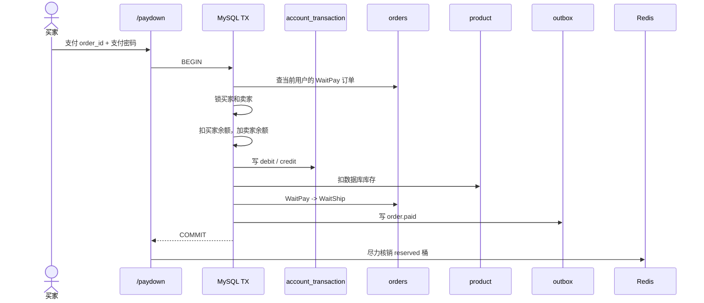

# 02 支付（上）：一笔钱怎样安全地从买家转给卖家

> gomall · `/paydown` / 余额支付 / 双账户行锁 / 复式流水 / 订单结算
>
> 支付安全最终靠数据库里的业务事实：订单决定金额，事务保证钱和账一起变化，状态机与唯一索引挡住重复副作用。Redis 和中间件能减少重复请求，但不能成为钱的最后防线。

## 目录

- [一、支付链路的四个判断](#一支付链路的四个判断)
- [二、先看一次“钱扣了，订单没变”](#二先看一次钱扣了订单没变)
- [三、`/paydown` 第一段：订单说了算](#三paydown-第一段订单说了算)
- [四、两个人的钱，必须按同一个顺序锁](#四两个人的钱必须按同一个顺序锁)
- [五、流水不是日志，是以后吵架时的证据](#五流水不是日志是以后吵架时的证据)
- [六、钱动完之后，订单还没结束](#六钱动完之后订单还没结束)
- [七、事务提交后，Redis 只能补课](#七事务提交后redis-只能补课)
- [附录 A：面试 Q&A](#附录-a面试-qa)
- [附录 B：课后作业](#附录-b课后作业)

---

## 一、支付链路的四个判断

这一讲沿四个判断展开：

1. **订单决定支付事实。** 客户端只表达“我要支付这张订单”，金额、卖家、商品和数量都从订单读取。第三节讲这件事。
2. **钱、账和订单在一个事务里结算。** 买家扣款、卖家入账、两条流水、库存和订单状态要么一起成功，要么一起回滚。第四到第六节展开这条事务。
3. **数据库负责挡住第二次副作用。** 状态条件更新和流水唯一索引是并发场景下的最后防线，分散在第三、第五和第六节的代码里。
4. **事务外的失败另行收敛。** Outbox 在事务内记录通知意图，Redis 库存视图在提交后核销；失败时走重试或对账。第六、七节说明边界。

### 90 秒回顾：支付接到的订单是什么

支付从一张 `WaitPay` 订单开始。订单里已经固定了买家、卖家、商品、数量和优惠后的应付金额，库存也已经完成预留。本讲把这些结果当作输入，不展开购物车和下单过程；第九讲再解释订单怎样生成、库存怎样预留。

支付成功后，订单进入 `WaitShip`。这一讲只追中间这一步：哪些数据必须一起变化，重复请求进来时由谁挡住。

用户鉴权那一讲里，我们一直在问“信谁、信多久、信他能干什么”。到支付这里，问题更尖锐：

> 钱要离开账户了，系统到底信什么？

浏览页挂了，用户刷新；购物车丢了，用户骂一句重新加；支付链路出事，客服电话会直接打爆。因为用户脑子里只有一句话：

> 我钱是不是没了？

支付和普通业务接口的差别在这里：它要把几类业务承诺绑在一起。

- 买家的钱只扣一次；
- 卖家的钱只入一次；
- 订单只从待支付推进一次；
- 库存只确认售出一次；
- 后面真出争议时，系统能查出每一分钱怎么来的。

同一个 `/paydown`，五个角色看到的是五种风险：

| 角色 | 他怕什么 | 代码里对应哪条线 |
|---|---|---|
| C 端用户 | “我只点了一次，为什么扣两次？” | 幂等 + 订单状态守卫 + 流水唯一约束 |
| 商家 | “订单付了，钱为什么没到我余额？” | 买家 debit 和卖家 credit 同事务 |
| 客服 | “用户说钱没了，我查什么？” | `account_transaction` 记录变更后余额 |
| 运营 | “GMV 到底按哪个金额算？” | `orderPayableCents` 统一实付口径 |
| SRE | “支付网关坏了会不会拖死主站？” | 熔断放到下集讲 |

这集先讲站内余额支付。它没有外部银行卡网关，但金额权威、行锁、事务、流水、状态机和 outbox 都已经出现了。

---

## 二、先看一次“钱扣了，订单没变”

**这类事故通常源于事务边界不完整：本该一起提交的业务事实被拆开了。**

先别急着看代码。想一个客服现场。

小林买一件二手相机，订单金额 1000 元。他点“支付”，页面转圈 20 秒，然后提示失败。小林刷新账户余额，发现少了 1000；再看订单，还是“待支付”。

这时客服要回答三个问题：

1. 钱有没有真的扣？
2. 如果扣了，进了谁的账户？
3. 为什么订单没变成待发货？

如果系统只改了 `users.money`，客服几乎没法答。他只能看到“现在余额是多少”，看不到“为什么变成这个余额”。如果系统写了订单状态但没写流水，财务也没法对账。更糟的是，如果买家扣款成功、卖家没入账，这笔钱就悬在系统里了。

所以支付主事务不是一行“余额减掉 amount”。它至少要同时完成这些事：

```text
买家余额减少
卖家余额增加
买家 debit 流水
卖家 credit 流水
数据库库存扣减
订单 WaitPay -> WaitShip
商品归属转移
outbox 写 order.paid
```

其中任何一步失败，前面的都不能留下。

`/paydown` 的边界是**把这组业务事实放进同一个 MySQL 事务里提交**。



图里最容易被忽略的是最后一行：Redis 在事务外，因此不能按 MySQL 事务的一部分处理。

---

## 三、`/paydown` 第一段：订单说了算

**支付接口只接收支付意图；扣多少钱、付给谁，由服务端订单决定。**

### 请求体越少，支付越安全

余额支付请求只需要两个字段：

```go
type PaymentDownReq struct {
    OrderId uint   `json:"order_id"`
    Key     string `json:"key"`
}
```

没有 `money`，没有 `boss_id`，没有 `product_id`，也没有 `num`。

字段少是支付接口的安全边界。客户端没有定价权，也没有指定收款人的权力。否则攻击者可以这样改包：

```http
POST /api/v1/paydown
Content-Type: application/json

{
  "order_id": 9527,
  "money": 1,
  "boss_id": 10086,
  "key": "123456"
}
```

如果服务端信了 `money=1`，1000 元订单就被 1 分钱买走；如果信了 `boss_id=10086`，货款甚至能打到错误账户。

gomall 的做法很硬：支付金额、商品、卖家、数量，全都从订单表反查。

### 先确认这张订单属于当前用户

`PayDown` 先从 context 拿鉴权中间件写进去的用户：

```go
u, err := ctl.GetUserInfo(ctx)
if err != nil {
    return nil, err
}
```

然后在事务里按 `order_id + user_id` 取订单：

```go
order, err := orderpkg.NewOrderDaoByDB(tx).GetOrderById(req.OrderId, uId)
if err != nil {
    return err
}
```

这和 user auth 那一讲里的“信 JWT，不信 body.user_id”是同一个原则。用户可以猜别人的订单 ID，但不能替别人支付、读取或推进那张订单。

### 状态必须还是 `WaitPay`

```go
if order.Type != consts.OrderWaitPay {
    return errors.New("订单状态非未支付，无法重复支付")
}
```

这行代码负责快速拒绝明显不合法的状态，但它不是并发场景下的原子兜底。

入口幂等能挡住同一个 token 的重试；但用户完全可能换一个 token、换一个浏览器、甚至等 Redis key 过期后再打一次。并发事务也可能同时读到 `WaitPay`。这里的预检查用于尽早返回，最终还要靠后面的条件更新和流水唯一索引：

```text
只有 WaitPay 能支付
已经 WaitShip / Cancelled / Finished 的订单，一律不能再支付
```

这里不能为了“兼容”写成“已支付就直接返回成功”。那样客服会很难判断第二次请求到底有没有新副作用。

### 实付金额不能散落在三个渠道里

```go
func orderPayableCents(o *order.Order) int64 {
    if o.PromoRuleID != 0 {
        return o.FinalCents
    }
    return o.Money * int64(o.Num)
}
```

这段代码要讲慢一点。它不只是一个 helper。

为什么判断促销命中用 `PromoRuleID != 0`，而不是 `FinalCents > 0`？

因为全额优惠是合法的：

```text
原价 100 元
优惠 100 元
FinalCents = 0
```

如果写成 `FinalCents > 0`，全额优惠订单会被误判成没促销，系统回退到原价扣款。用户拿到 100 元券，支付时却仍被扣 100 元，系统会直接产生资损。

金额口径必须收口到一个函数，余额、Stripe、Web3 都调用它。否则今天余额通道按折后价，明天 Web3 通道按原价，客服看到的是同一张订单不同渠道扣款不一致。

---

## 四、两个人的钱，必须按同一个顺序锁

**余额支付是一笔转账。两个账户必须在同一事务里按固定顺序加锁。**

### 余额支付不是扣一个账户

站内余额支付其实是转账：

```text
买家 -1000
卖家 +1000
```

两个账户必须在同一个事务里改。否则就会出现“买家扣了，卖家没加”这种系统自己都解释不清的状态。

更麻烦的是并发。

假设买家余额 1000，同时发起两笔支付：

```text
事务 A 读到 1000，准备扣 700
事务 B 读到 1000，准备扣 600
事务 A 写回 300
事务 B 写回 400
```

最后余额 400，但两笔订单都可能成功。系统凭空亏了 700 或 600，取决于哪个写回被覆盖。

所以余额读改写必须用行锁：

```go
func (d *UserDao) GetUserByIdForUpdate(uId uint) (user *User, err error) {
    err = d.DB.Clauses(clause.Locking{Strength: "UPDATE"}).
        Model(&User{}).Where("id=?", uId).
        First(&user).Error
    return
}
```

`FOR UPDATE` 的意思很朴素：这行余额我正在改，别人先等着。

### 只会加锁还不够，还要按固定顺序加锁

支付要同时锁买家和卖家。这里有一个很容易在面试里讲清楚的死锁现场：

```text
订单 1：A 买 B 的商品，事务 1 先锁 A，再锁 B
订单 2：B 买 A 的商品，事务 2 先锁 B，再锁 A
```

并发起来就是：

```text
事务 1：拿到 A，等 B
事务 2：拿到 B，等 A
```

两个事务互相等，死锁。

gomall 的解法是：不管业务上谁是买家、谁是卖家，数据库层永远按用户 ID 升序锁。

```go
func (d *UserDao) LockTwoUsersForUpdate(idA, idB uint) (a, b *User, err error) {
    if idA == idB {
        only, e := d.GetUserByIdForUpdate(idA)
        if e != nil {
            return nil, nil, e
        }
        return only, only, nil
    }

    first, second := idA, idB
    if idB < idA {
        first, second = idB, idA
    }

    u1, e := d.GetUserByIdForUpdate(first)
    if e != nil {
        return nil, nil, e
    }
    u2, e := d.GetUserByIdForUpdate(second)
    if e != nil {
        return nil, nil, e
    }
    if first == idA {
        return u1, u2, nil
    }
    return u2, u1, nil
}
```

固定锁序消除了这两个账户被反向获取时形成的锁环；事务仍要保留数据库死锁重试，因为系统里还可能存在其他锁组合。

### 支付密码不是装饰

```go
buyer, boss, err := userDao.LockTwoUsersForUpdate(uId, bossID)
if err != nil {
    return err
}
if !buyer.CheckMoneyPassword(req.Key) {
    return user.ErrMoneyKeyIncorrect
}
```

支付密码只做二次授权：登录态被盗，不等于可以直接花钱。它保存为 bcrypt 摘要，由 `CheckMoneyPassword` 校验。

余额解密走的是另一套机制：`DecryptMoney` 使用服务端密钥，不读取买家的支付密码。两者刻意分开，避免弱支付密码同时成为余额密文的解密密钥。

6 位支付密码熵很低，不能作为唯一安全措施。线上还需要错误次数锁定、风控、设备校验和异常支付拦截。bcrypt 保护摘要存储，但拦不住弱口令被在线尝试。

### 买家扣款和卖家入账

买家侧：

```go
userMoney, err := buyer.DecryptMoney()
if err != nil {
    return err
}
if userMoney-payable < 0 {
    return errors.New("金额不足")
}

buyerBalanceAfter := userMoney - payable
buyer.Money = strconv.FormatInt(buyerBalanceAfter, 10)
buyer.Money, err = buyer.EncryptMoney()
if err != nil {
    return err
}
if err = userDao.UpdateUserById(uId, buyer); err != nil {
    return err
}
```

卖家侧是对称的：

```go
bossMoney, err := boss.DecryptMoney()
if err != nil {
    return err
}
bossBalanceAfter := bossMoney + payable
boss.Money = strconv.FormatInt(bossBalanceAfter, 10)
boss.Money, err = boss.EncryptMoney()
if err != nil {
    return err
}
if err = userDao.UpdateUserById(bossID, boss); err != nil {
    return err
}
```

这里所有错误都直接 `return err`。外层是 MySQL transaction，所以任何一步失败，买家扣款、卖家入账都会一起回滚。

---

## 五、流水不是日志，是以后吵架时的证据

**余额只表示现在还有多少钱，流水才能解释钱为什么变成这样。**

### 只存余额，客服没法查案

`users.money` 只能告诉你“现在有多少钱”。它不能告诉你：

- 哪个订单扣了这笔钱；
- 扣款前后余额是多少；
- 卖家有没有对应入账；
- 退款时应该回滚哪一笔。

所以支付必须写流水。流水不是普通日志，不是“方便排查”。它是资金系统里的证据。

gomall 的流水表叫 `account_transaction`：

```go
type AccountTransaction struct {
    UserID            uint
    Direction         string
    AmountCents       int64
    RefOrderID        uint
    BalanceAfterCents int64
    BizType           string
}
```

一笔余额支付写两条：

```go
ledgerDao := money.NewLedgerDaoByDB(tx)
if err = ledgerDao.AppendTransaction(
    uId, order.ID, money.DirectionDebit,
    payable, buyerBalanceAfter, money.BizTypeOrderPay,
); err != nil {
    return err
}

if err = ledgerDao.AppendTransaction(
    bossID, order.ID, money.DirectionCredit,
    payable, bossBalanceAfter, money.BizTypeOrderPay,
); err != nil {
    return err
}
```

这里要盯住 `NewLedgerDaoByDB(tx)`：流水继续使用支付事务里的同一个 `tx`。这保证：

```text
余额改了，流水一定在；
流水写失败，余额改动也回滚。
```

### debit 和 credit 是一对

课堂里不用讲太多会计。记住一个最小模型就够了：

```text
买家 debit  = 钱从买家账户出去
卖家 credit = 钱进卖家账户
同一订单下 debit 金额应该等于 credit 金额
```

如果客服查订单 9527，应该能看到：

| ref_order_id | user_id | direction | amount_cents | biz_type |
|---:|---:|---|---:|---|
| 9527 | 买家 | debit | 100000 | order_pay |
| 9527 | 卖家 | credit | 100000 | order_pay |

这时用户问“钱去哪了”，客服至少可以沿着订单查到：买家余额扣了多少、卖家余额加了多少、扣完后余额是多少。

### 唯一索引是资金侧的最后保险

流水模型上有唯一索引：

```go
Direction  string `gorm:"uniqueIndex:uniq_acct_tx_order_dir,priority:2"`
RefOrderID uint   `gorm:"uniqueIndex:uniq_acct_tx_order_dir,priority:1"`
BizType    string `gorm:"uniqueIndex:uniq_acct_tx_order_dir,priority:3"`
```

组合起来是：

```text
(ref_order_id, direction, biz_type)
```

它挡住两类事故：

- 同一订单重复写 `debit`：买家不会被重复扣；
- 同一订单重复写 `credit`：卖家不会被重复入账。

为什么要带 `biz_type`？因为同一订单未来可能还有退款、预售定金、预售尾款。支付和退款不能共用同一个唯一空间，否则退款流水会和支付流水互相撞。

入口幂等是第一道门，订单状态是第二道门，流水唯一索引是资金侧的最后一道门。支付系统不要只押宝在其中一层。

---

## 六、钱动完之后，订单还没结束

**资金来源可以不同，支付成功后的订单事实必须统一。**

### 三条支付渠道共用同一个结算尾段

余额支付扣买家余额；Stripe 走外部卡支付；Web3 走链上事件。资金来源不同，但支付成功后，订单要做的事一样：

- 扣数据库库存；
- 订单从 `WaitPay` 变成 `WaitShip`；
- 二手交易模型下，把商品归属转给买家；
- 写 `order.paid` outbox 事件。

所以 gomall 把这段收口到 `finishOrderSettlementTx`：

```go
func finishOrderSettlementTx(tx *gorm.DB, o *order.Order) error {
    productID := o.ProductID
    num := o.Num
    buyerID := o.UserID

    prod, err := product.NewProductDaoByDB(tx).GetProductById(productID)
    if err != nil {
        return err
    }

    ok, err := product.NewProductDaoWithDB(tx).DeductStock(productID, num)
    if err != nil {
        return err
    }
    if !ok {
        return errors.New("存在超卖问题")
    }

    paidOK, err := order.NewOrderDaoByDB(tx).
        MarkOrderPaidWithCheck(o.ID, buyerID)
    if err != nil {
        return err
    }
    if !paidOK {
        return errors.New("订单状态已变更，无法重复支付")
    }

    buyer, err := user.NewUserDaoByDB(tx).GetUserById(buyerID)
    if err != nil {
        return err
    }
    productUser := product.Product{
        Name: prod.Name, Num: num, OnSale: false,
        BossID: buyerID, BossName: buyer.UserName,
        // 其余展示字段继续从 prod 复制
    }
    if err := product.NewProductDaoByDB(tx).
        CreateProduct(&productUser); err != nil {
        return err
    }

    return outbox.NewOutboxDaoByDB(tx).Insert(
        "order", "OrderPaid", "order.paid", o.ID,
        events.OrderPaid{OrderID: o.ID, OrderNum: o.OrderNum,
            UserID: buyerID, ProductID: productID, Num: num},
    )
}
```

这段公共函数的意义是防止“渠道漂移”。如果每个支付渠道各写一套结算逻辑，迟早会出现：

```text
余额支付扣库存
Stripe 忘了扣库存
Web3 忘了写 outbox
```

抽公共尾段，就是让新增支付渠道只能改资金入口，不能随意改订单事实。

### 订单状态推进要写进 WHERE

```go
func (d *OrderDao) MarkOrderPaidWithCheck(orderID, userID uint) (bool, error) {
    res := d.DB.Model(&Order{}).
        Where("id=? AND user_id=? AND type=?",
            orderID, userID, consts.OrderWaitPay).
        Update("type", consts.OrderWaitShip)
    if res.Error != nil {
        return false, res.Error
    }
    return res.RowsAffected > 0, nil
}
```

注意这里不是：

```text
先查订单状态
if WaitPay 再 update
```

而是把 `type=WaitPay` 塞进 `UPDATE` 的 `WHERE`。

并发支付时，只有第一个事务能影响 1 行。后面的事务即使进来了，也会因为 `RowsAffected=0` 被回滚。这是数据库层的状态机。

### outbox 不能放在事务外随手发

支付成功后要通知下游：发货、通知、搜索索引、运营统计，都可能依赖 `order.paid`。

不能在支付事务里直接调所有下游。下游慢了，支付就慢；下游挂了，支付就挂。

也不能先 commit 订单，再随手发 MQ。因为进程可能刚好在 commit 后、发 MQ 前崩掉，订单已付但没有事件。

所以 outbox 必须和订单状态同事务写：

```text
订单变成 WaitShip
order.paid outbox 记录存在
```

publisher 可以随后发布，失败时继续重试。

### 商品归属转移是 gomall 的业务模型

`finishOrderSettlementTx` 里还有一步：给买家创建一份 `OnSale=false` 的商品副本。

这不是所有电商都该这么做。gomall 更像二手交易/转售模型，支付后要表达“这件商品现在归买家了”。标准商城可能只需要订单明细，不一定复制商品行。

讲课时要把这个说清楚：这是业务建模选择，不是行业通用模板。

---

## 七、事务提交后，Redis 只能补课

**MySQL 提交后，资金和订单已经成为事实；Redis 核销失败只能补偿，不能倒推支付回滚。**

支付事务成功后，最后跑：

```go
commitReservationBestEffort(ctx, paidProductID, paidNum)
```

实现只做核销并记录失败：

```go
func commitReservationBestEffort(ctx context.Context, productID uint, num int) {
    if productID == 0 || num <= 0 {
        return
    }
    if err := cache.CommitReservation(ctx, productID, int64(num)); err != nil {
        log.LogrusObj.Errorf(
            "commit reservation failed product=%d num=%d err=%v",
            productID, num, err,
        )
    }
}
```

失败只记日志，不回滚支付。

原因是 MySQL 已经提交了：

- 买家余额已扣；
- 卖家余额已加；
- 流水已写；
- 数据库库存已扣；
- 订单已进入待发货；
- outbox 已有 `order.paid`。

Redis 的 `reserved` 桶只是库存快速视图。它错了，要修 Redis；不能因为 Redis 没核销成功，就把一笔已经提交的资金事务强行撤销。

跨存储一致性最怕装作强一致。这里正确的说法是：

| 系统 | 角色 | 失败后怎么处理 |
|---|---|---|
| MySQL | 资金和订单事实 | 事务内失败就回滚 |
| Redis | 快速库存视图 | 失败后对账、重建、补偿 |
| Outbox publisher | 发布待发送事件 | 重试，耗尽后标记 `dead` |
| RabbitMQ consumer | 消费下游事件 | 重投或进入 DLQ |

代码必须承认这些存储之间没有共同事务，再按各自的角色设计补偿和对账。

---

## 附录 A：面试 Q&A

### Q1：为什么支付金额不能由前端传？

前端只能提交支付意图，不能提交扣款事实。金额、卖家、商品和数量必须从订单读取。否则用户可以改包少付，或者把货款打到错误账户。

### Q2：为什么买家和卖家要在同一个事务里改？

因为支付是转账，不是单点更新。买家扣款成功、卖家入账失败，会制造系统自己解释不清的悬挂资金。站内余额模型里，双方余额和两条流水必须同事务提交。

### Q3：为什么锁两个人要按 ID 升序？

A 买 B、B 买 A 并发时，如果都按“买家→卖家”锁，会形成锁环。按用户 ID 升序锁，可以消除这组账户锁的反向获取死锁。

### Q4：流水和日志有什么区别？

日志是排查材料，可能被采样、清理或格式变化；流水是业务证据，要能长期对账。支付争议里，客服和财务需要的是订单关联、方向、金额、变更后余额，不是一行散落在日志系统里的文本。

### Q5：有幂等中间件了，为什么还要流水唯一索引？

Redis 幂等可能失效、过期或保存失败。钱的最终防线必须在数据库里。订单状态守卫挡重复推进，流水唯一索引挡重复 debit/credit。

### Q6：Redis 核销失败为什么不能回滚支付？

因为 MySQL 事务已经提交，资金和订单已经成为事实。Redis 是缓存视图，应该修缓存，不应该撤销已提交的资金事实。

### Q7：为什么 outbox 要和订单状态同事务？

订单已付但没有事件，下游永远不知道；事件发出但订单没提交，下游处理的是假事实。outbox 和订单状态同事务，保证“订单事实”和“待发布事件”一起存在。

---

## 附录 B：课后作业

1. 画出 A 买 B、B 买 A 并发支付时的死锁图，再用“按 ID 升序锁”改掉。
2. 写一条 SQL，检查同一订单的 `debit` 和 `credit` 金额是否相等。
3. 思考零元订单：`FinalCents=0` 时是否还要写流水？如果写，金额应该是多少？
4. 设计一笔退款流水：买家和卖家的 direction 分别是什么？`biz_type` 为什么不能继续用 `order_pay`？
5. 模拟 `commitReservationBestEffort` 失败，写一个库存对账任务：怎样从 MySQL 订单反推 Redis 桶应该是什么状态？
