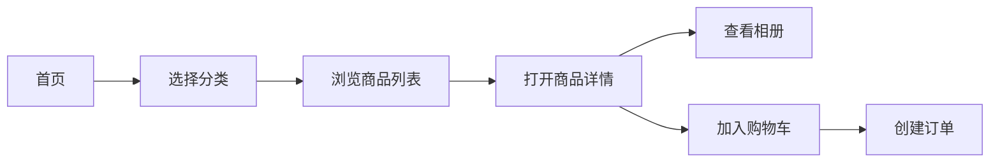
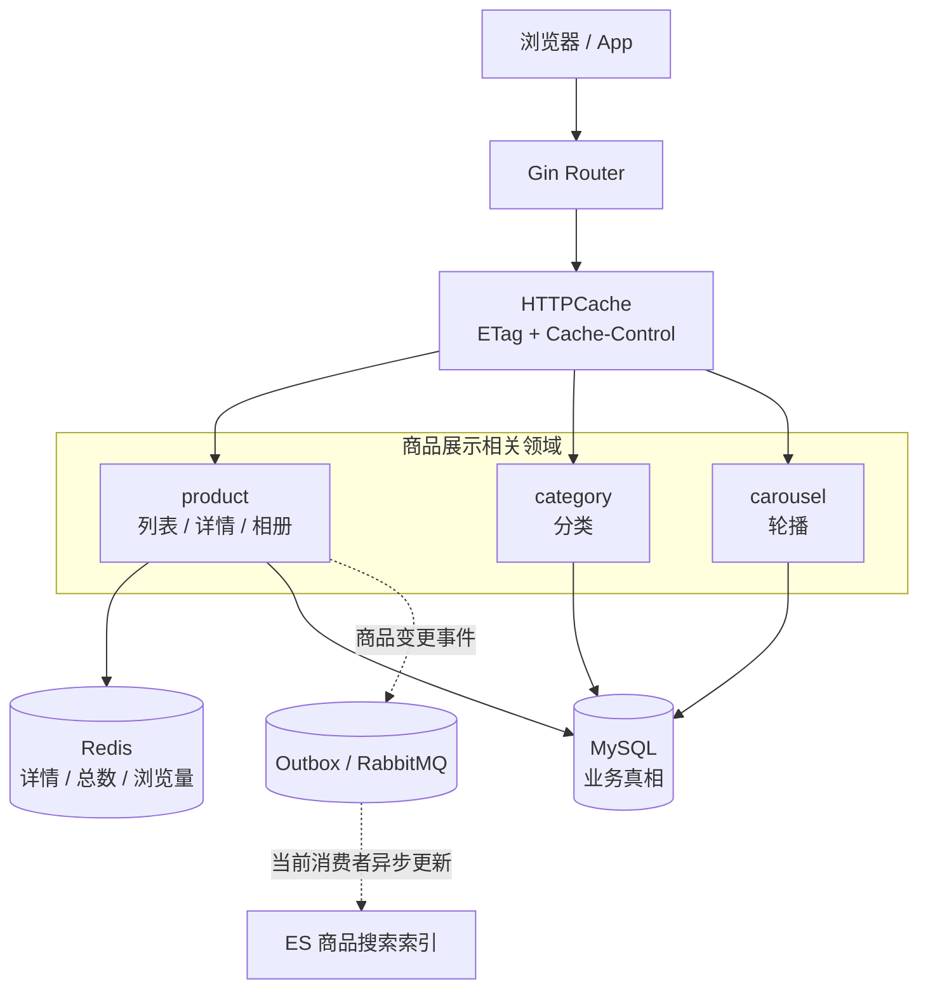
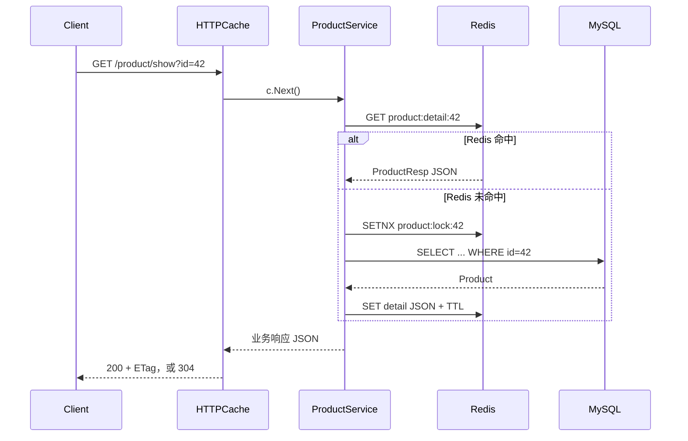
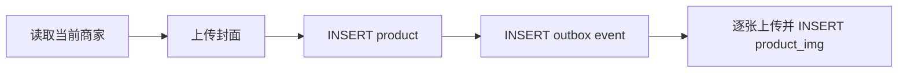
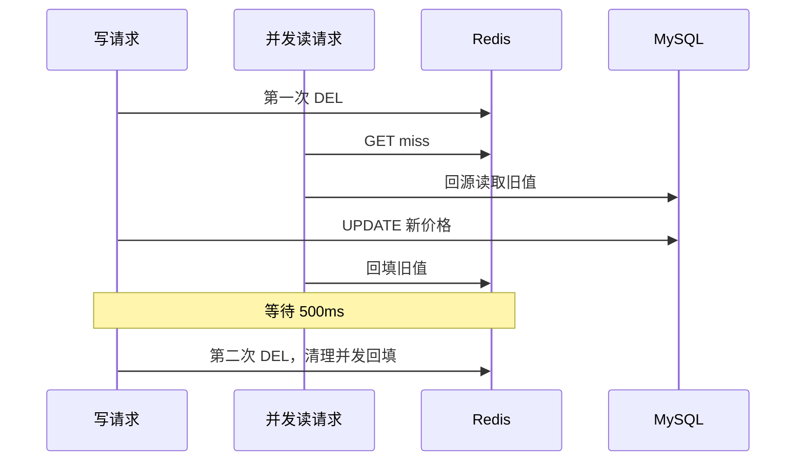

# 商品展示：一件商品怎样正确、快速地出现在用户面前

商品展示看起来像电商系统里最简单的一章：查数据库，返回 JSON，前端画卡片。

真到线上就不是这么回事了。首页要同时拿轮播、分类和商品列表；详情页还要拼封面、相册、卖家信息、价格、库存和浏览量。商家刚改完价格，旧缓存可能还在；大促把一个热商品推到首页后，几千个请求可能同时发现缓存失效。更麻烦的是，页面即使看起来正常，也不代表前端真的接上了后端。

这一章不把商品展示讲成一组缓存名词。我们沿着同一件商品走完四条路：它怎样进入数据库，怎样出现在列表，怎样打开详情，以及商家修改它以后，缓存和搜索索引怎样跟上。

## 这节课学完要能回答什么

学生需要说清楚下面五件事：

1. 商品首页不是一个接口，它由轮播、分类、列表、详情和相册共同组成。
2. `route → handler → service → repo` 每一层分别替业务守什么边界。
3. HTTP cache 和 Redis cache 不在同一层，也没有覆盖相同的接口。
4. Cache Aside、空值缓存、SETNX、singleflight 和延迟双删各自处理哪一种失败。
5. 当前代码在哪些地方已经可用，哪些地方仍会展示下架商品、缓存错误响应或留下不完整数据。

> 录制提示：开场先展示商城页面，不要先解释 Redis。问学生一句：“你现在看到的商品，真的是后端返回的吗？”随后打开浏览器 Network，再进入第一节。

### 录制前准备

为了让视频里的现象可复现，开始录制前先确认：MySQL 和 Redis 已启动；数据库里至少有一个在售商品和一个下架商品；Redis 使用项目配置的 DB 4；Gin 运行在 debug 模式，能看到 SQL 或请求日志。屏幕上建议保留浏览器 Network、应用日志和一个命令行窗口，后面的冷缓存、304 与 COUNT 实验都要在三处交叉验证。

视频可以按下面的节奏展开，不必一次讲完所有缓存名词：

| 段落 | 先问学生 | 现场证据 |
|---|---|---|
| 页面是否接通 | 页面有商品，后端一定成功了吗？ | Network 中的错误路径与 seed 数据 |
| 列表请求 | 一页商品为什么要查数据库两次？ | `LIMIT/OFFSET` 与 `COUNT(*)` |
| 详情请求 | Redis miss 时谁有资格回源？ | detail key、lock key、SQL 日志 |
| 商家改价 | 为什么更新 DB 后不直接 SET cache？ | 两次 DEL 与 500ms 窗口 |
| 代码评审 | 页面快了，业务就一定正确吗？ | 下架可见、HTTP 200 错误缓存、库存旧值 |

## 一、先从一个“看起来没问题”的页面开始

当前仓库带有一套 React 店面。页面打开后有商品、有搜索，也能加入购物袋，看起来后端已经接通了。

但 `web/src/App.tsx` 请求的是：

```ts
fetch('/api/v1/products', { signal: ctrl.signal })
```

后端真实路由却是：

```text
GET /api/v1/product/list
```

非 2xx 响应不会让 `fetch` 自动抛错。代码先用 `r.ok` 把 404 转成 `null`，随后发现没有可用数组，于是保留本地 `PRODUCTS`；只有网络错误或 1.5 秒超时中止才会进入 `.catch`：

```ts
.then((r) => (r.ok ? r.json() : null))
.then((body) => {
    const raw = body?.data?.item ?? body?.data ?? []
    if (!Array.isArray(raw) || !raw.length) return
    // 有真实数据时才替换 seed
})
.catch(() => { /* 网络错误 / Abort：保留 seed 典藏 */ })
```

于是出现一个很适合课堂演示的现象：Network 里能看到错误的 `/api/v1/products` 请求，页面也好好的，可正确的 `/product/list` handler 一次都没调用。

这不是前端小失误，而是一条工程经验：**界面有数据，不等于链路有数据。** 录制视频时可以先让学生猜，再打开 Network 面板验证。

### 商品展示在交易旅程中的位置



商品展示位于成交之前。它允许一定时间的旧数据，但不能把这种容忍带进下单链路：页面可以短暂显示旧库存，创建订单时必须重新从权威数据源取得价格、卖家和库存条件。

先记住这条边界，后面的缓存设计都会围绕它展开。

## 二、一个商品页面，其实由五条读链组成

所有公开 API 都挂在 `/api/v1` 下。商品展示相关路由如下：

| 页面信息 | 真实 API | 登录要求 | 当前 HTTP cache | Redis 数据缓存 |
|---|---|---|---:|---|
| 商品列表 | `GET /api/v1/product/list` | 无 | 30s | 只缓存 `total`，不缓存列表行 |
| 商品详情 | `GET /api/v1/product/show?id=42` | 无 | 60s | 详情对象缓存 10min + 抖动 |
| 商品相册 | `GET /api/v1/product/imgs/list?id=42` | 无 | 无 | 无 |
| 分类列表 | `GET /api/v1/category/list` | 无 | 300s | 无 |
| 首页轮播 | `GET /api/v1/carousels` | 无 | 300s | 无 |

这张表先纠正一个常见误解：不是所有读接口都有 Redis cache。分类和轮播在 HTTP 强缓存过期后仍会查询 MySQL；相册甚至没有挂 HTTP cache。

### 当前运行架构



这里要区分两类数据：

- MySQL 中的 `product`、`product_img`、`category` 和 `carousel` 是业务记录。
- Redis 和 ES 都是为了读取速度构建的副本。副本可以晚一点，但不能反过来决定订单扣多少钱。仓库已经有 Milvus 相关适配代码，但商品变更消费者当前只更新 ES，向量索引的生产写入链仍是演进项。

> 检查题：为什么商品详情能接受 60 秒 HTTP cache，而 `/orders/create` 不能照抄？

## 三、先读模型，再读代码

`internal/product/model.go` 中的 `Product` 并非只有名称和价格：

```go
type Product struct {
    dbmodel.Model
    Name          string `gorm:"size:255;index"`
    CategoryID    uint   `gorm:"not null"`
    Title         string
    Info          string `gorm:"size:1000"`
    ImgPath       string
    Price         string
    DiscountPrice string
    OnSale        bool `gorm:"default:false"`
    Num           int
    BossID        uint
    BossName      string
    BossAvatar    string
}
```

可以把字段分成四组来讲：

| 业务问题 | 字段 | 页面用途 |
|---|---|---|
| 卖的是什么 | `Name`、`Title`、`Info`、`CategoryID` | 标题、描述、分类筛选 |
| 卖多少钱 | `Price`、`DiscountPrice` | 划线价与成交提示 |
| 还能不能卖 | `OnSale`、`Num` | 上下架与库存提示 |
| 谁在卖 | `BossID`、`BossName`、`BossAvatar` | 商家归属与卖家展示 |

### 为什么还要 DTO

数据库模型不应直接成为 HTTP 响应。`ProductResp` 做了两件事：

1. 把 `CreatedAt` 转成 Unix 时间，不暴露 GORM 基座结构。
2. 本地上传模式下，给商品图和头像补完整访问地址。

```go
pResp := &ProductResp{
    ID: p.ID, Name: p.Name, CategoryID: p.CategoryID,
    Price: p.Price, DiscountPrice: p.DiscountPrice,
    Num: p.Num, OnSale: p.OnSale,
    BossID: p.BossID, BossName: p.BossName,
    View: p.View(),
}
```

DTO 还是一个防扩散边界。以后数据库加成本价、审核备注或内部风控字段时，只要不放进 `ProductResp`，公开接口就不会顺手泄露它们。

### 封面和相册不是同一张表

`Product.ImgPath` 保存封面图，`ProductImg` 保存相册记录：

```go
type ProductImg struct {
    dbmodel.Model
    ProductID uint `gorm:"not null"`
    ImgPath   string
}
```

列表只需要封面，没必要为每个商品联表加载全部图片；打开详情以后，前端再调用 `product/imgs/list`。这叫按页面需求拆读模型，不是为了“表多一点”。

当前相册接口没有 HTTP cache，也没有限制图片数量。它能工作，但如果一个商品被上传几百张图，响应会线性变大。这是留给学生的第一个代码评审点。

## 四、商品列表：一页数据为什么要走两次查询

先看一条真实请求：

```bash
curl 'http://localhost:5002/api/v1/product/list?page_num=1&page_size=12&category_id=2'
```

### 4.1 Handler 只做 HTTP 适配

```go
func ListProductsHandler() gin.HandlerFunc {
    return func(ctx *gin.Context) {
        req, ok := response.Bind[ProductListReq](ctx)
        if !ok { return }
        if req.PageSize == 0 {
            req.PageSize = consts.BaseProductPageSize
        }
        resp, err := GetProductSrv().ProductList(ctx.Request.Context(), req)
        if err != nil { response.Fail(ctx, err); return }
        response.OK(ctx, resp)
    }
}
```

这一层不写 SQL，也不决定缓存。它只负责把 query string 变成 DTO、补默认分页值，再把结果写回 HTTP。

> 讲师提问：如果把分页默认值放进 repo，会发生什么？答案不是“不能运行”，而是 repo 开始知道 HTTP 请求的默认行为，复用边界会变差。

### 4.2 Service 组织页面需要的数据

```go
condition := make(map[string]interface{})
if req.CategoryID != 0 {
    condition["category_id"] = req.CategoryID
}

products, err := productDao.ListProductByCondition(condition, req.BasePage)
total, err := cache.ProductCountCached(ctx, req.CategoryID, func() (int64, error) {
    return productDao.CountProductByCondition(condition)
})
```

列表响应包含当前页 `item`，也包含所有匹配商品的 `total`。因此后端要完成两类工作：

- `OFFSET + LIMIT` 取当前页。
- `COUNT(*)` 计算总数，结果缓存 60 秒。

### 4.3 Repo 把分页翻译成 SQL

```go
func (d *ProductDao) ListProductByCondition(
    condition map[string]interface{}, page types.BasePage,
) ([]*Product, error) {
    page.Normalize()
    var products []*Product
    err := d.DB.Where(condition).
        Offset((page.PageNum - 1) * page.PageSize).
        Limit(page.PageSize).
        Find(&products).Error
    return products, err
}
```

代码短，但有两个值得暂停的问题。

第一，没有 `ORDER BY`。数据库通常会返回看似稳定的顺序，可 SQL 并不承诺；商品插入或执行计划变化后，同一个商品可能从第一页漂到第二页。

第二，公开列表没有加 `on_sale = true`。商家下架的商品仍可能被匿名用户看到；详情查询也只按 ID 取记录，知道链接的人仍能直接打开。系统需要先明确产品规则：下架是“只退出列表但链接仍可见”，还是“匿名用户完全不可见”。缓存不是这里最先要解决的问题，业务可见性才是。

### 4.4 详情列表里藏着 Redis N+1

组装每个 `ProductResp` 时都会调用一次 `p.View()`：

```go
func (product *Product) View() uint64 {
    countStr, _ := cache.RedisClient.
        Get(cache.RedisContext, cache.ProductViewKey(product.ID)).Result()
    count, _ := strconv.ParseUint(countStr, 10, 64)
    return count
}
```

一页 15 个商品，就会再串行执行 15 次 Redis GET。MySQL 的 N+1 很常见，Redis N+1 同样会累积网络往返。更微妙的是，`AddView()` 目前没有调用方，所以这个浏览量很可能不会增长。

适合课堂讨论的修法有两种：用 pipeline 批量取 `view:*`，或者把浏览量从列表中拿掉，只在详情异步计数。要先问产品是否真的需要在每张卡片上展示浏览量。

## 五、商品详情：同一个请求有两层缓存

详情路由挂了 60 秒 HTTP cache：

```go
public.GET(
    "product/show",
    middleware.HTTPCache(60*time.Second),
    ShowProductHandler(),
)
```

service 内部还有一层 Redis 对象缓存。完整顺序如下：



注意顺序：`HTTPCache` 会先执行完整 handler，再根据响应体计算 ETag。客户端带 `If-None-Match` 时，当前实现依然可能访问 Redis，甚至在冷缓存时访问 MySQL。

所以当前 304 的直接收益是少发响应 body，不是省掉服务端查询。只有浏览器在 `max-age` 新鲜期内直接复用本地响应时，请求才不会到达 Gin；如果以后部署并正确配置 CDN，边缘缓存也能挡住源站流量。

### 5.1 先处理命中和不存在

```go
if err := cache.GetProductDetail(ctx, req.ID, cached); err == nil {
    return cached, nil
} else if err == cache.ErrProductNotFound {
    return nil, gorm.ErrRecordNotFound
}
```

正常 JSON 表示商品存在。特殊值 `\x00null` 表示近期已经确认过该商品不存在，后续请求不再查 DB。

空值只缓存 60 秒，而正常详情缓存 10 分钟并加最多 90 秒的随机抖动。空值 TTL 短，是因为这个 ID 后续可能真的被创建；详情 TTL 长，是为了减少热点商品回源。

### 5.2 SETNX 只是在收敛回源，不是绝对只查一次

```go
locked, _ := cache.TryProductLock(ctx, req.ID)
if !locked {
    time.Sleep(50 * time.Millisecond)
    if err := cache.GetProductDetail(ctx, req.ID, cached); err == nil {
        return cached, nil
    }
} else {
    defer cache.UnlockProduct(ctx, req.ID)
}
```

抢到 Redis 锁的实例负责回源。没抢到的请求等待 50ms 后只重读一次；如果此时仍未命中，它不会一直等，而会继续走后面的 DB 兜底。

因此更准确的说法是：Redis 锁尽量减少多实例同时回源，不能承诺整个集群永远只有一次查询。固定锁值为 `"1"`，解锁直接 `DEL`，也没有“比较持有者 token 再删除”的保护；锁过期后，旧请求理论上可能删掉新请求拿到的锁。

### 5.3 singleflight 只管当前进程

```go
loaded, err := cache.LoadProductOnce(req.ID, func() (interface{}, error) {
    return s.loadProductFromDB(ctx, req.ID)
})
```

同一个 Go 进程里，多个 goroutine 对相同 ID 的回源会共享一次结果。多实例部署时，每个实例都有自己的 `singleflight.Group`，所以仍要配合 Redis 锁。

一句话区分：SETNX 处理跨实例竞争，singleflight 合并单实例内的相同工作。

### 5.4 缓存的 ProductResp 也会变旧

详情缓存里不仅有标题和价格，还有 `Num` 与 `View`。当前支付扣库存、库存回滚并不会删除 `product:detail:{id}`；点击量也没有接入 `AddView()`。

这意味着页面上的库存和浏览量是展示值，不能拿来做交易判断。订单和支付链仍要检查数据库条件与库存预占结果。

> 检查题：如果页面显示“库存 3”，两位用户同时下单，哪一层负责保证不会卖出 4 件？答案在订单与库存章节，不在商品详情缓存。

## 六、商家上架：封面、相册、权限和半成品

商品写接口全部挂在 `merchant` 路由组，先经过登录与角色检查：

```go
merchant.POST("product/create", CreateProductHandler())
merchant.POST("product/update", UpdateProductHandler())
merchant.POST("product/delete", DeleteProductHandler())
```

### 6.1 创建商品的真实顺序

`ProductCreate` 会完成这些动作：

1. 从 context 取得当前用户，读取卖家信息。
2. 要求至少上传一张图，第一张作为封面。
3. 上传封面，插入 `product` 行。
4. 写 `product.changed` 事件。
5. 逐张上传图片并插入 `product_img`。



顺序能跑通，却不是一个原子事务。商品行写成功后，如果第三张图片上传失败，数据库里会留下商品和部分相册；Outbox 插入也没有与商品创建共享同一个事务。

这里不要急着给学生“标准答案”。先问业务：图片少一张时商品是否可以继续上架？

- 如果允许，应该把相册状态和补传流程设计清楚。
- 如果不允许，需要把数据库写放进事务，并为已经上传的对象存储文件安排补偿删除。

文件系统或对象存储不能直接加入 MySQL 事务，这正是 Saga/补偿思想比“加个 transaction”更贴近现实的地方。

### 6.2 更新商品为什么要检查两层权限

路由层的 merchant 角色只说明“这个人是商家”，不能说明“这件商品属于他”。DAO 还要把 `boss_id` 写进 WHERE：

```go
res := d.DB.Model(&Product{}).
    Where("id=? AND boss_id=?", pId, uId).
    Updates(map[string]interface{}{
        "name": product.Name, "category_id": product.CategoryID,
        "price": product.Price, "discount_price": product.DiscountPrice,
        "num": product.Num, "on_sale": product.OnSale,
    })
```

这是两面不同的墙：

- RBAC 防普通买家调用商家接口。
- `boss_id` 条件防商家修改别人的商品。

使用 map 更新也有业务原因。GORM 用 struct 执行 `Updates` 时会跳过零值；`on_sale=false` 和 `num=0` 恰好都是必须写入的有效状态。

## 七、改价以后为什么删缓存，而不是写缓存

商家把价格从 199 改成 169。直觉做法是更新 DB 后再 `SET` 新缓存，但并发写入的完成顺序可能不同，最终把旧值留在缓存中。

当前实现采用延迟双删：

```go
_ = cache.DelProductDetail(ctx, req.ID)
affected, err := NewProductDao(ctx).UpdateProduct(req.ID, u.Id, product)
if err != nil { return nil, err }
if affected == 0 { return nil, errors.New("商品不存在或无权修改") }

cache.DoubleDeleteAsync(req.ID, 0) // 默认 500ms 后再删
emitProductChanged(ctx, req.ID, "update")
```

### 第二次删除在清理什么



双删缩短 Redis 中旧值存活的时间，但它不是强一致承诺：

- 第一次删除的错误被忽略。
- 第二次删除可能因 Redis 故障或在飞任务超过 1024 而放弃。
- 浏览器仍可能在 60 秒 `max-age` 内使用旧响应。
- `product.changed` 事件写失败只会记录日志，搜索索引可能继续保留旧值。

因此不能把“500ms 后再删”说成“改价 500ms 内所有用户必然看到新价”。当前代码能做的是尽力收敛 Redis 旧值；端到端可见时间还取决于 HTTP cache、客户端是否刷新，以及事件链是否成功。

### 商品总数缓存也有一致窗口

列表的 `total` 使用 60 秒 TTL，没有在创建、删除或换分类时主动失效。再叠加列表的 30 秒 HTTP cache，用户短时间看到旧总数是当前设计的一部分。

如果产品只展示“还有更多”，可以取消精确 total；如果必须展示准确数量，就要补主动失效或专门的统计读模型。

## 八、HTTP cache：强缓存和 304 不是一回事

`middleware.HTTPCache` 给公开 GET/HEAD 响应添加：

```http
Cache-Control: public, max-age=60
ETag: W/"..."
```

### 8.1 强缓存命中

在 `max-age` 新鲜期内，浏览器可以直接复用本地响应，不向 Gin 发请求。此时应用、Redis 和 MySQL 都没有工作。

### 8.2 条件请求命中

缓存过期后，浏览器可能带 `If-None-Match` 请求源站。当前中间件的执行顺序是：

```go
c.Writer = buf
c.Next()                       // handler 已经完整执行
etag := weakETag(buf.body.Bytes())
if c.GetHeader("If-None-Match") == etag {
    original.WriteHeader(http.StatusNotModified)
    return
}
```

返回 304 省下了 JSON body，但 handler、Redis/DB 查询与序列化已经发生。这种实现简单，适合教学项目；如果目标是让条件请求也减少源站计算，就要把版本号提前到资源元数据、反向代理或 CDN 层判断。

### 8.3 当前代码会缓存业务失败

`HTTPCache` 只跳过 HTTP 状态不是 200 的响应，可项目统一错误出口仍写 HTTP 200：

```go
func Fail(ctx *gin.Context, err error) {
    ctx.JSON(http.StatusOK, ErrorResponse(ctx, err))
}
```

这会产生一个反直觉结果：商品不存在、参数错误甚至瞬时数据库错误，也可能获得 `public, max-age=60`。

修复方向可以选一个：

- 错误使用真实 4xx/5xx，业务码仍放在 body。
- `HTTPCache` 识别统一响应中的业务 `status`，只缓存成功响应。
- handler 在失败时设置一个明确的“禁止缓存”标记。

这段很适合视频里的代码评审。学生会发现“只缓存 200”本身没错，错的是两个模块对 200 的理解不同。

### 8.4 当前没有 CDN 证据

响应头写了 `public`，意味着共享缓存可以存，但仓库没有部署 CDN 的配置与命中日志。讲课时应把 CDN 作为可演进架构，不要把它说成当前实测链路。

## 九、四类缓存事故，用 key 范围来区分

别先背名词。先问两个问题：出事的是一个 key 还是很多 key？请求查的是存在数据还是不存在数据？

| 故障 | 触发方式 | 当前防护 | 防护边界 |
|---|---|---|---|
| 击穿 | 单个热门详情 key 失效 | Redis SETNX | 50ms 后仍 miss 会继续回源 |
| 穿透 | 反复查询不存在的 ID | `\x00null` 空值缓存 | 空值 60s 后过期 |
| 雪崩 | 一批详情 key 同时过期 | TTL 增加 `[0,90s)` 抖动 | 只能打散，不能替代容量保护 |
| 惊群 | 同实例 goroutine 同时回源 | singleflight | 只作用于当前进程 |

### 事故卡片

请先暂停视频判断：

> 运营把商品 42 推到首页。缓存刚好过期，三个应用实例各收到 500 个请求。实例内查询已经被合并，但 MySQL 仍同时看到三次查询。这是什么问题，为什么 singleflight 没有把三次变成一次？

答案：singleflight 只在进程内合并；跨实例要依靠 Redis 锁。当前 Redis 锁仍是尽力收敛，50ms 后未命中会放行 DB，所以结果也未必严格等于一次。

## 十、列表性能：先分清旧压测和当前代码

`stressTest/REPORT.md` 记录了 2026-05-15 的一轮本地测试：

| 场景 | RPS | p95 | 当时口径 |
|---|---:|---:|---|
| `/ping` | 64,254 | 3.51ms | Gin/中间件基线 |
| `/product/show` | 62,226 | 3.01ms | 报告标注“无缓存，DB 主键查询” |
| `/product/list` | 24.5 | 2.50s | 约 956K 商品，每请求执行 COUNT |

这些数字能说明旧版本的 `COUNT(*)` 是明显瓶颈，却不能直接证明当前缓存后的性能。当前代码已经给 count 加了 60 秒 Redis cache 和进程内 singleflight，但尚未重新跑同口径对照。

### 为什么 COUNT 会慢

```go
err = d.DB.Model(&Product{}).
    Where(condition).
    Count(&total).Error
```

InnoDB 需要扫描满足条件的索引记录。`category_id` 当前模型上没有索引声明，分类统计尤其值得用 `EXPLAIN` 检查。

### COUNT 缓存解决了什么，又没解决什么

平稳期，大部分翻页请求会复用 `product:count:*`。但 Redis key 到期时，singleflight 只在各自实例内合并，多个实例仍可能各做一次 COUNT。

列表还保留 OFFSET 分页：

```sql
SELECT * FROM product LIMIT 20 OFFSET 200000;
```

页码越深，数据库跳过的记录越多。如果前端允许无限滚动，可以改成稳定排序后的游标分页：

```sql
SELECT *
FROM product
WHERE on_sale = 1 AND id < ?
ORDER BY id DESC
LIMIT 20;
```

不要一上来就说“游标永远更好”。后台运营需要跳到任意页时，页码仍有价值；C 端瀑布流更适合 cursor。业务交互决定分页协议。

## 十一、分类、轮播和相册为什么不能被详情缓存掩盖

### 分类

`CategoryList` 每次 handler 执行都会 `Find` 全表，再转换 DTO。当前依靠 300 秒 HTTP 强缓存减少浏览器请求，但没有 Redis 数据缓存，也没有排序字段。

如果运营要求固定展示顺序，应给分类增加 `sort_order` 并显式 `ORDER BY`，不能依赖主键或数据库“碰巧”返回的顺序。

### 轮播

轮播 DAO 只投影页面需要的列：

```go
d.DB.Model(&Carousel{}).
    Select("id, img_path, product_id, UNIX_TIMESTAMP(created_at) AS created_at").
    Find(&r)
```

这是好习惯，但轮播同样没有显式排序。本地上传模式下，它也没有像商品图片那样统一拼接 host，数据库中的 `img_path` 必须自己满足前端访问要求。

### 相册

相册按 `product_id` 查询，不挂 HTTP cache。它是公开、高复用、低变更的 GET，很适合让学生评审：是否应添加短期缓存？加之前先确认图片更新频率、删除策略和单商品图片上限。

## 十二、把当前缺口变成课堂代码评审

不要把教学项目讲成“每处都设计好了”。下面的问题都来自当前代码，很适合边录边问。

| 现象 | 根因 | 学生应提出的方向 |
|---|---|---|
| 页面有商品，但后端没请求 | 前端路径写成 `/api/v1/products`，失败后使用 mock | 修正 API 契约，并在开发环境暴露错误 |
| 下架商品仍能被公开浏览 | 列表和详情都没有 `on_sale=true` | 先确定下架语义，再同时约束 list/show |
| 翻页偶尔重复或漏商品 | 没有稳定 `ORDER BY` | 固定排序；深页按场景改 cursor |
| 一页商品带来多次 Redis GET | 每个商品单独读取 View | pipeline/MGET，或取消列表浏览量 |
| 新商品短时间仍显示不存在 | 创建时未清理已有空值标记 | create 后删除详情 key/null marker |
| DB 库存变了，详情仍显示旧 Num | 扣减和回滚没删详情缓存 | 分离交易库存与展示库存，补事件或失效 |
| 错误响应被浏览器缓存 | 业务失败仍是 HTTP 200 | 统一 HTTP 语义或显式禁止缓存 |
| 商品写成功，搜索一直是旧值 | Outbox 与商品写不在同一事务 | 同事务写事件，失败可重试/对账 |
| 上传中途失败留下半成品 | 商品、图片、文件不在一个原子流程 | 状态机 + 事务 + 文件补偿 |

> 录制提示：这一节不要直接念答案。每行停五秒，让学生先说“用户会看到什么”，再展开根因。

## 十三、录屏演示脚本

下面的演示围绕同一个商品 ID 展开。命令中的 `42` 换成数据库里存在的 ID。

> 本仓库本地配置使用 Redis DB 4，所以命令带 `-n 4`。如果你修改过 `redisDbName`，这里也要跟着改。

### 实验 A：确认前端是否真的接上后端

1. 打开 `/app/` 和浏览器 Network。
2. 过滤 `products`，观察请求路径和状态。
3. 对照 `internal/product/routes.go` 找真实路径。
4. 手工请求 `/api/v1/product/list`，比较响应结构。

验收标准：学生能解释页面为何在后端失败时仍显示静态商品。

### 实验 B：详情冷缓存与热缓存

```bash
redis-cli -n 4 DEL product:detail:42
curl -i 'http://localhost:5002/api/v1/product/show?id=42'
redis-cli -n 4 TTL product:detail:42
curl -i 'http://localhost:5002/api/v1/product/show?id=42'
```

观察第一次回源与第二次命中，并记录 TTL 是否落在 10 分钟到 11.5 分钟之间。不要只比响应时间；更应观察 MySQL 查询次数是否下降。

### 实验 C：强缓存和 304 分开看

先保存第一次响应中的 ETag：

```bash
curl -i 'http://localhost:5002/api/v1/product/show?id=42'
curl -i \
  -H 'If-None-Match: W/"替换为实际值"' \
  'http://localhost:5002/api/v1/product/show?id=42'
```

第二次可能得到 304，但仍应通过日志或 Redis MONITOR 验证 handler 是否执行。浏览器在 `max-age` 内不发请求，是另一条路径。

### 实验 D：穿透与空值标记

```bash
redis-cli -n 4 DEL product:detail:99999999
curl -i 'http://localhost:5002/api/v1/product/show?id=99999999'
redis-cli -n 4 --raw GET product:detail:99999999
redis-cli -n 4 TTL product:detail:99999999
```

接着观察错误响应是否带 `Cache-Control: public`。这个实验同时暴露空值缓存的作用和 HTTP 200 错误语义的问题。

### 实验 E：COUNT 冷热对照

```bash
redis-cli -n 4 DEL product:count:all
curl 'http://localhost:5002/api/v1/product/list?page_num=1&page_size=20'
curl 'http://localhost:5002/api/v1/product/list?page_num=2&page_size=20'
redis-cli -n 4 TTL product:count:all
```

配合 MySQL 慢查询日志或 GORM SQL 日志，验证第二次翻页是否复用 total。然后用 `EXPLAIN` 检查列表 SQL 与 COUNT SQL。

## 十四、分级练习

### 基础：画出一次详情请求

补全五个分支：正常命中、空值命中、缓存 miss、DB not found、DB 成功后回填。

验收：每条分支都能说明客户端得到什么、Redis 写了什么、MySQL是否被访问。

### 进阶：修公开商品可见性与分页

要求：

- 先明确下架语义，并让列表与详情遵循同一条规则。
- 增加稳定排序。
- 保留现有分类过滤。
- 写出对应的 SQL，实际创建匹配过滤与排序的索引，再用 `EXPLAIN` 验证。

验收：固定数据快照下连续翻三页无重复；下架商品的列表和详情行为符合约定；`EXPLAIN` 显示查询使用预期索引。再追加一道讨论：如果翻页期间允许插入/删除，OFFSET 仍可能重复或漏项，此时怎样换成 cursor？

### 进阶：修 HTTP 错误缓存

任选一种方案，让商品不存在和 DB 故障不再获得 public 强缓存，同时保留业务码。

验收：成功详情有 `Cache-Control` 和 ETag；not found、参数错误、服务错误均不可被共享缓存保存。

### 挑战：让商品创建可恢复

设计商品、封面、相册和 Outbox 的状态流。必须回答：对象存储上传成功而 DB 回滚时怎样清理；事件写失败怎样补发；用户什么时候能看到半成品。

验收：方案含明确状态、重试入口、幂等键和人工处理路径，不能只写“失败就回滚”。

### 综合：录一段十分钟代码评审

选取“前端假接通”“下架商品公开可见”或“库存缓存陈旧”其中一个问题，按下面顺序讲：

1. 用户看到的现象。
2. 请求经过的代码。
3. 真正的业务风险。
4. 最小修法及其边界。

## 十五、收束：商品展示要守住两条线

第一条是读路径。页面要快，但每一层缓存都要说清楚命中条件、失效条件和失败后的去向。SETNX 与 singleflight 不是护身符，HTTP 304 也不会自动替你省掉源站计算。

第二条是一致性边界。展示数据可以短暂变旧，交易数据必须重新校验；商家写入成功以后，详情缓存、列表总数、搜索索引和相册也要有可恢复的更新路径。

用一句话概括本章：**商品展示不是把一行数据库记录吐给前端，而是把多个数据源拼成一个可信的页面，并让它在缓存、并发和失败下仍然说得通。**

## 附录：面试与复习 Q&A

### Q1：HTTP cache 和 Redis cache 有什么区别？

HTTP cache 面向客户端或共享代理，依赖 `Cache-Control`、ETag 等协议；Redis cache 位于服务端，保存对象副本，减少数据库查询。当前详情两层都有，分类和轮播只有 HTTP cache。

### Q2：为什么 304 仍可能访问数据库？

因为当前中间件在 `c.Next()` 之后才取得响应体并计算 ETag。条件请求只能在 handler 完成后判断内容有没有变化。

### Q3：为什么 SETNX 和 singleflight 要同时存在？

SETNX 让不同应用实例争用同一把 Redis 锁；singleflight 合并当前 Go 进程内相同 key 的工作。两者作用域不同。

### Q4：延迟双删能保证强一致吗？

不能。它处理并发读把旧值写回缓存的窗口，但删除可能失败，HTTP 强缓存也不会被 Redis DEL 主动清理。它是最终一致策略中的一环。

### Q5：为什么列表和详情都不能作为下单价格依据？

它们允许缓存，价格和库存可能过时。创建订单必须从权威商品记录重新取得价格、卖家，并走库存预占或数据库条件更新。

### Q6：当前 Product List 最先应该修什么？

先补 `on_sale=true` 和稳定排序，再讨论 cursor、索引和缓存。业务正确性排在性能优化前面。

### Q7：为什么商品图片要拆表？

列表只要一张封面，详情才需要相册。拆表可以避免列表联表或聚合全部图片，也允许独立增加、删除和排序相册项。

### Q8：怎样证明 count cache 有收益？

不能只引用旧报告。应在相同数据、并发和机器条件下，对比每请求 COUNT、冷 count cache、热 count cache，并记录 SQL 次数、p95/p99 和 DB CPU。
