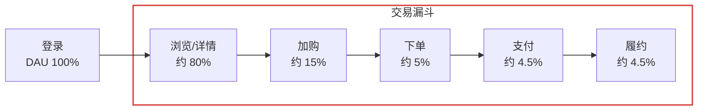
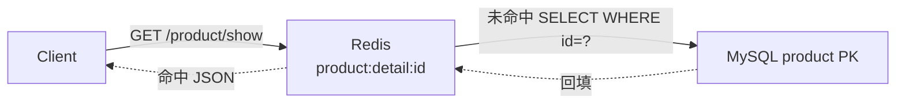
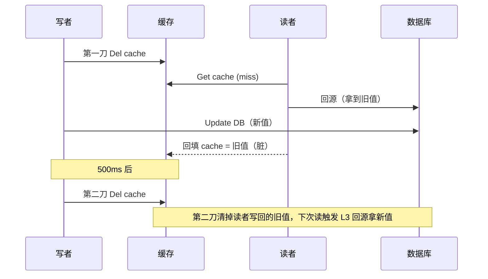
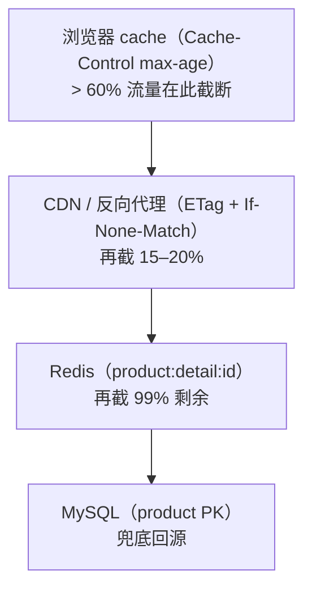
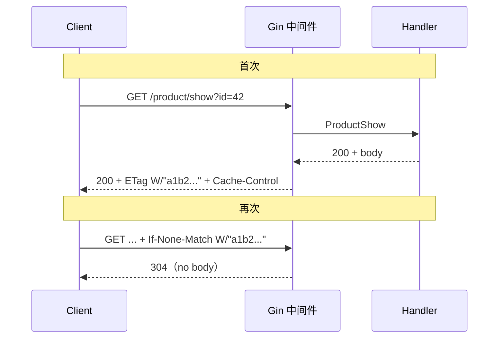
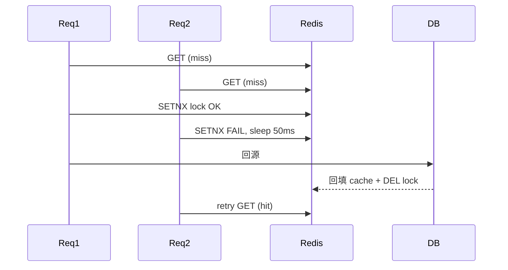
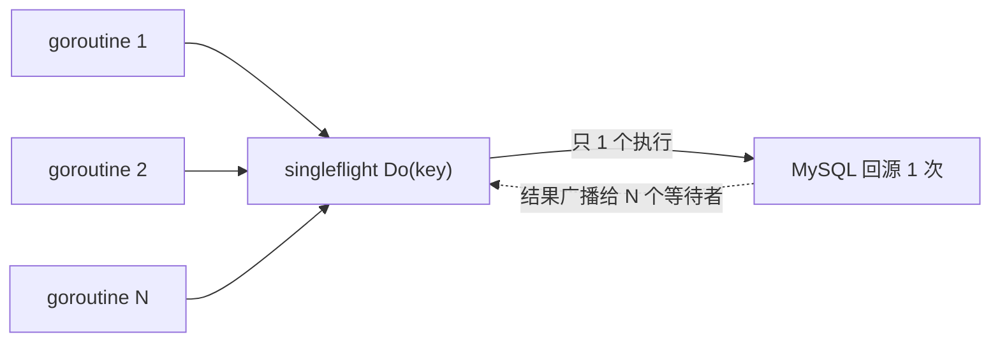

# 商品展示的业务依据

目录

- [一、商品展示在业务全景中的位置](#一商品展示在业务全景中的位置)
- [二、首屏 1 秒决定订单](#二首屏-1-秒决定订单)
- [三、读路径：Cache Aside 是怎么挡住 DB 的](#三读路径cache-aside-是怎么挡住-db-的)
- [四、写路径：双删的业务必要性](#四写路径双删的业务必要性)
- [五、HTTP cache：把流量挡在源站之外](#五http-cache把流量挡在源站之外)
- [六、四态故障：击穿 / 穿透 / 雪崩 / 惊群](#六四态故障击穿--穿透--雪崩--惊群)
- [七、深分页 COUNT(*) 的工程取舍](#七深分页-count-的工程取舍)
- [八、业务码、客诉与监控口径](#八业务码客诉与监控口径)
- [附录：面试 Q&A](#附录面试-qa)

---

## 一、商品展示在业务全景中的位置

### 用户旅程视图：详情页是漏斗的腰



详情页一次抖动 = 漏斗腰部塌陷 = 下游所有环节 GMV 同比降。gomall 把详情 / 列表 / 类目 / 轮播这 4 条最宽的接口都挂了 HTTP cache + Redis cache。

而同样的优化用在"加购"以下就没意义了：那里量已经降到 15%，瓶颈是库存与事务一致性，而不是缓存命中率。**优化要花在漏斗最宽处**。

### 业务侧 SLO：详情页背的指标

SLO 是**业务和技术之间的契约**：超了赔运营预算，没超就接受延迟。

| 指标 | 业务等级 | 目标 | 实测 |
|---|---|---|---|
| 详情页 p99 延迟 | P1 核心读 | < 200ms | 3ms (p95) |
| 列表/类目 p99 延迟 | P3 信息类 | < 1s | 优化前 2.5s（全表 COUNT）→ 总数已上 60s 缓存 |
| 可用率 | P1 | 99.9% | N/A |
| Redis 命中率 | 内部 KPI | ≥ 99% | N/A |
| 端到端 DB 流量占比 | 内部 KPI | ≤ 0.5% | 公式推 0.32% |
| 商家上架 → 可见 SLA | 业务对齐 | 60s | = HTTP max-age |
| 商家改价 → 可见 SLA | 业务对齐 | 1s | 双删 500ms + TTL |

商品列表优化前 24.5 RPS / p95 2.5s，在 P3 信息类口径下**未触发事故**（当时 QPS 远低于阈值），延迟来自 `COUNT(*)` 全表计数。第 0 刀已落地：**总数上 60s Redis 缓存 + singleflight**（`cache.ProductCountCached`），每类目每分钟至多回源一次 COUNT，其余请求回源只剩分页 SELECT（浅页毫秒级）；60s 与"上架→可见 SLA 60s"同一业务口径，总数滞后本来就在契约内（叠加列表 30s HTTP 缓存，最坏 ~90s，业务仍可接受）。深分页 OFFSET 的游标分页模板（订单列表已落地）仍可平移，是下一步。

## 二、首屏 1 秒决定订单

这一节回答四个问题：详情页首屏黄金 1 秒缓存命中 vs 回源差多少；为什么业务**必须接受**最终一致而非强一致；HTTP cache 哪几个接口能挂、TTL 怎么定；`product/list` 优化前的 24.5 RPS / p95 2.5s 从业务侧怎么解读、第 0 刀怎么砍。

### 首屏延迟与转化率：业务侧的硬性约束

| 首屏延迟 | 跳出率上升 | 业内常见处理 |
|---|---|---|
| ≤ 1s | 基线 | 不动 |
| 1–3s | +30% | 进入优化排期 |
| 3–5s | +90% | 列入 P0 故障复盘 |
| ≥ 5s | 用户基本走完 | 直接告警呼叫 |

这是 Akamai 和 Google 在 2017/2018 公开的转化率曲线，是后端做缓存预算的业务依据。gomall 的 `product/show` 压测 p95 = 3.01ms，留出 300 倍余量给业务侧的图片加载、首屏渲染。

### 命中缓存 vs 回源 DB 的业务收益

| 路径 | 单次耗时 | 956K 行表能承担 QPS | 业务侧含义 |
|---|---|---|---|
| 浏览器 304 | ~30ms (RTT) | 不打到源站 | 流量被 CDN/浏览器卸掉 |
| Redis 命中 | ~1ms | 数万级 | 单机 Redis 上限 |
| PK 回源 DB | 3.01ms (p95) | 6 万级 | 与 ping 同量级 |
| 全表扫 | 2.5s (p95) | 24.5 | 直接告警 |

> **"回源"不可怕，"扫表"才可怕。** `/product/show` 走主键 + 缓存兜底，业务侧从来不是瓶颈；`/product/list` 优化前的延迟全部来自 `COUNT(*)` 全表计数，正是[第七节](#七深分页-count-的工程取舍)要量化拆解的对象（第 0 刀 60s 计数缓存已把它摊薄）。

---

## 三、读路径：Cache Aside 是怎么挡住 DB 的

### 业务场景：商家上架 1 万 SKU 后 DB 顶不住的剧本

商家「数码玩家」周末批量上架 1 万个手机壳 SKU，运营把头部 200 个挂上首页推荐位。

- **周一 10:00**：推荐位开始引流，每个 SKU 详情页 `product:detail:{id}` 第一次访问 = cache miss = 回源 DB。
- **若没有 SETNX 单飞**：200 个热 SKU × 50 个并发用户 = 一万次并发 SELECT 同时打 DB；MySQL 连接池打满，整站详情页 503。
- **客服 10:05 开始接投诉**："首页推荐点不开""详情页一直转圈"；客服只能挂"服务暂忙"话术，但根因其实是缓存击穿。
- **有 SETNX 单飞**：同一商品最多 1 个请求打 DB，其余 sleep 50ms 后命中回填值；DB 看到的额外负载 = 200 QPS（每热 SKU 1 次），可忽略。

> **Cache Aside 的真正价值不是"快"，是"把商家行为爆点和 DB 解耦"。**

### Cache Aside 读路径



读的逻辑是：先读缓存；缺则回源，再写回缓存。gomall 在此之上多一道 `SETNX` 回源锁——缓存击穿时**只放一个请求**打 DB，其它请求等 50ms 再读一次。业务结果：商品详情压测 62K RPS，与 `/ping` 基线几乎重合。

### 读路径关键代码

```go
// internal/product/service.go
if cacheErr := cache.GetProductDetail(ctx, req.ID, cached); cacheErr == nil {
    return cached, nil                              // L1: 命中, ~1ms
} else if cacheErr == cache.ErrProductNotFound {
    return nil, gorm.ErrRecordNotFound              // L1': 命中空值标记, 不回源
}
locked, _ := cache.TryProductLock(ctx, req.ID)      // L2: SETNX 抢回源权
if !locked {
    time.Sleep(50 * time.Millisecond)               // L2': 让锁持有者回填
    if cacheErr := cache.GetProductDetail(ctx, req.ID, cached); cacheErr == nil {
        return cached, nil
    }
} else {
    defer cache.UnlockProduct(ctx, req.ID)
}
loaded, err := cache.LoadProductOnce(req.ID, func() (interface{}, error) {
    return s.loadProductFromDB(ctx, req.ID)         // L3: singleflight 合并回源
})
if err != nil {
    if errors.Is(err, gorm.ErrRecordNotFound) {
        _ = cache.SetProductNotFound(ctx, req.ID)   // L3': 不存在 -> 写空值标记
    }
    return nil, err
}
_ = cache.SetProductDetail(ctx, req.ID, loaded.(*ProductResp))  // L4: 回填带抖动
```

五步的业务含义：

- **L1 命中**：99% 的请求走这里。Redis ~1ms，对业务侧等价于"没有数据库"。
- **L1' 空值**：命中 `\x00null` 空值标记，确认商品不存在，直接按 not found 返回，挡住穿透。
- **L2 SETNX**：缓存失效/被双删的瞬间，跨进程互斥只放一个请求回源，业务侧叫**缓存击穿**。
- **L3 单飞**：`LoadProductOnce` 用进程内 `singleflight` 再合并同实例的并发回源，叠加在 Redis 锁之上防**惊群**。
- **L3' / L4**：not-found 写短 TTL 空值标记；命中则回填，TTL 带随机抖动防**雪崩**。

---

## 四、写路径：双删的业务必要性

### 业务取舍：用户多久能看到改价

商家在后台把"小米 14 Pro"从 ¥5499 改成 ¥4999，限时秒杀 1 小时。三种方案：

| 方案 | 用户可见延迟 | 业务后果 |
|---|---|---|
| 强一致（2PC / 同步写 cache） | < 50ms | 商家点"保存"卡 200ms；DB / Redis 任一抖动 = 改价失败 |
| **最终一致（双删）** | ≤ 500ms | gomall 当前。商家无感，用户最多看到 0.5s 旧价 |
| TTL 自然过期（无双删） | ≤ 10min | 不可接受：秒杀已开始 5 分钟，用户还看到老价 |

- **为什么不接受 10 分钟旧价**：限时秒杀按分钟计价值；用户看到老价 = 漏发优惠 = 客诉 + 平台担责。
- **为什么 500ms 可接受**：和产品/运营当面对齐——"改价后 1 秒内可能仍显示老价，刷新即可"，写进客服话术。
- **为什么不做强一致**：商家批量改 1000 个 SKU，每个卡 200ms = 后台转 3 分钟，完全不能用。

### 为什么不能"写库 + 写缓存"

直觉做法是商家改价 → `UPDATE product` → `SET cache`。但两个并发请求会这样出错：

1. T1 改价 100 → 99；
2. T2 改价 100 → 88；
3. T2 先到 DB（写 88），T1 后到 DB（覆盖为 99）；
4. T1 后写 cache（99），T2 先写 cache（88）；
5. 结果 DB = 99、Cache = 88 —— **永久不一致**。

客诉版本就是："为什么列表写 88，详情写 99？"

> **业务侧不能依赖"写缓存"，只能依赖"删缓存"。**

### 延迟双删：第二刀挡哪个窗口



问题就出在"读者在写者删缓存之后、更新 DB 之前回源，拿到旧值又回填"。第二刀（延迟删）就是专门清掉这个窗口里被写回的脏值。

### 写路径关键代码：删-写-延迟删

```go
// internal/product/service.go
product := &Product{ /* 价格/标题等字段 */ }
_ = cache.DelProductDetail(ctx, req.ID)                 // 第一刀: 写库前先删
err = NewProductDao(ctx).UpdateProduct(req.ID, product)
if err != nil {
    log.LogrusObj.Error(err)
    return
}
cache.DoubleDeleteAsync(req.ID, 0)                      // 第二刀: 500ms 后再删
emitProductChanged(ctx, req.ID, "update")               // outbox -> RMQ -> ES
```

**业务侧约定**：商家改价后最长 500ms + Redis TTL 才能保证不出旧值；详情页 TTL=10min 时，窗口实际由双删的 500ms 兜住。

### 业务侧为什么接受"500ms 旧值"

- 强一致方案（2PC / 同步写）单次写要 50–200ms，且任何下游慢都会让"改价"按钮卡住。
- 客服话术："改价后 1 秒内可能仍显示老价格，刷新即可。"——这是和产品/运营事先谈好的口径，不是 bug。
- 反过来，如果业务允许 1s 误差，第二刀的 500ms 已经是过设计；改成 200ms 也行。
- 真正不能容忍旧价的场景是**下单页**：`/orders/create` 必须从 DB 现读价格，不走 cache。

> **Cache Aside 是业务 SLA "最终一致 + ≤ 1s 窗口"的工程实现，不是教科书最优解。**

---

## 五、HTTP cache：把流量挡在源站之外

### 为什么轮播图 24h 可以、价格 5 分钟都不行

核心问题：每个接口 TTL 是**业务约定**决定的，不是技术决定的。

| 接口 | 业务变更频率 | 用户容忍延迟 | gomall TTL |
|---|---|---|---|
| 轮播图 `/carousels` | 运营每天 1–2 次 | "下次刷首页可见即可" ~10min | 300s |
| 类目 `/category/list` | 几乎不变 | 几小时 | 300s |
| 列表 `/product/list` | 上架/下架几分钟一次 | "翻页内一致即可" | 30s |
| 详情 `/product/show` | 商家随时改价 | "刷新就能看到新价" | 60s |
| 下单页价格 `/orders/create` | 改价即生效 | **零** | **不挂** |

同样是商品域，下单页**绝对不能挂 cache**：用户付款瞬间必须用 DB 现读价格，否则发生"页面显示 ¥99 但实际扣 ¥199" = 大型客诉 + 资损。轮播图 24h 也可以，但 gomall 取 5 分钟是**留出运营紧急下架的窗口**（违规图片、错图等）。

### 四层缓存漏斗



业务侧的数字：上一档 cache 卸下的流量，比下一档便宜一个数量级。浏览器 304 没有源站成本，CDN 一次回源覆盖一千个用户，Redis 一次回填覆盖 10min 内所有同商品请求。

### 每层命中率怎么算

| 层 | 命中率定义 | 度量口径 |
|---|---|---|
| 浏览器 | `304 / (200+304)`（按 referer 维度） | 前端埋点 `performance.getEntriesByType` |
| CDN | `(edge_hit + 304) / total_req` | CDN 厂商日志 `cache_status=HIT` |
| Redis | `1 - cache_miss / total_req` | `INFO stats` 中 `keyspace_hits / (hits+misses)` |
| DB | 反向口径：`1 - 上三层总命中率` | 由 prometheus `db_qps / req_qps` 反推 |

业务侧不会单独看 Redis 命中率，会看**端到端漏斗**：浏览器 60%、CDN 在剩下 40% 里再截 20%（绝对值 8%）、Redis 在剩下 32% 里再截 99%（绝对值 31.7%），DB 最终承担 **0.32%** 的原始流量。10k QPS 进来，DB 实际只看到 32 QPS。

### 命中率链式公式与业务含义

> **设各层命中率为 h₁, h₂, h₃，则 DB 流量 = Q · (1−h₁)(1−h₂)(1−h₃)。**

- **乘性效应**：任一层命中率掉 10%，DB 流量翻倍不止。Redis 99% → 90% 时 DB 流量从 0.32% 涨到 3.2%，单机 MySQL 直接吃不消。
- **业务对齐**：浏览器层 60% 不是技术指标，是**产品约定 max-age=60s** 换来的。产品坚持"改价 1s 内必须可见"时这层掉到 0。
- **容量规划反推**：先定 DB 能扛多少 QPS，倒推上游每层最低命中率，再倒推 TTL。

### CDN 选型与命中率掉档的运维剧本

| 方案 | 节点 / 成本 | 命中率 KPI | 适用 |
|---|---|---|---|
| 阿里云 CDN | 国内 2800+ / 0.2 元/GB | 95%+ | 国内电商主流 |
| Cloudflare | 全球 300+ / 0.05 USD/GB | 92%+ | 出海 / 多区域 |
| 自建 ATS | 0 边际，前期 1M+ | 看运维 | 月流量 > 10 PB |
| 回源直发 | 0 + 源站带宽费 | N/A | 试点 / 内网（gomall 当前） |

**掉档剧本**：浏览器突降 = 前端发版改了 URL query，回滚或加 `Vary` 白名单；CDN 突降 = 回源带 cookie，`/product/show` 必须无 session；Redis 突降 = `evicted_keys` 在涨，扩容或调 `allkeys-lfu`；DB QPS 突涨但 Redis 没变 = 新接口漏挂 cache，grep `HTTPCache` 白名单。

### ETag 304 流程



### ETag 中间件关键代码

```go
// middleware/httpcache.go
etag := weakETag(buf.body.Bytes())              // SHA-256 前 16 字节 -> W/"..."

if c.Request.Header.Get("If-None-Match") == etag {
    h := original.Header()
    h.Set("ETag", etag)
    h.Set("Cache-Control", cacheControl)
    h.Del("Content-Length")
    h.Del("Content-Type")
    original.WriteHeader(http.StatusNotModified) // 304: 不写 body
    return
}
h := original.Header()
h.Set("ETag", etag)
h.Set("Cache-Control", cacheControl)
h.Set("Content-Length", strconv.Itoa(buf.body.Len()))
original.WriteHeader(http.StatusOK)
_, _ = original.Write(buf.body.Bytes())          // 200: 正常回写
```

逐点讲解 + 为什么 POST 不挂：

- **弱 ETag（`W/"..."`）**：只承诺"语义等价"、不承诺字节级等价。压缩/分块都不影响命中，业务上更适合 JSON。
- **先 `c.Next()` 再比对**：handler 算完才能拿 body，中间件用 `cacheBuffer` 包 `ResponseWriter`，代价是多一份内存。
- **只对 status=200 生效**：4xx / 5xx 直接透传，限流码 70001 不会被错误地长期缓存。
- **304 后删 `Content-Length / Content-Type`**：标准要求，否则上游 nginx / CDN 把空 body 算成 0 字节但仍发头，浏览器会拒收。
- **POST/PUT 不挂**：写接口挂 cache 等于"重复触发同一动作"，与幂等冲突；`POST /orders/create` 命中 cache 会让用户以为下单成功但实际没打到后端，对账少一笔。

### TTL 怎么定：业务节奏决定

| 接口 | max-age | 业务理由 | 风险 |
|---|---|---|---|
| `/product/show` | **60s** | 单品价格/库存可能改 | 改价 1min 内显示老价 |
| `/product/list` | 30s | 列表翻页频繁，改卖家少 | 上架 30s 内不可见 |
| `/category/list` | **300s** | 类目几乎不变 | 几乎无 |
| `/carousels` | 300s | 运营每天换一次轮播图 | 几乎无 |

数字不是抄的，是和**产品同学**对齐过的"用户能容忍多久看到旧值"。60s 是为了和 ProductDetailTTL（10min）解耦：即使 Redis 还是旧值，HTTP 层 60s 后会强制重新协商一次。

---

## 六、四态故障：击穿 / 穿透 / 雪崩 / 惊群

缓存四态故障是详情页能不能上 99.9% 可用率的天花板。四个事故对客户都是"平时秒开的页面突然 5 秒打不开"，对 SRE 却是四种不同的处置 SOP，区分清楚是基本功。

### 四态故障的真实事故剧本

- **击穿事故**：双 11 零点主推品 `product:detail:42` 因运维误操作 `DEL`，瞬间 5000 个并发用户全打 DB，连接池打满，整站详情页 503 持续 90s。损失：当 1 分钟 GMV ~200 万。
- **穿透事故**：黑产脚本 100 QPS 扫 `?id=99999999..`，DB 每次 `record not found` 不回填 cache，DB CPU 100%，影响下单页 `SELECT FOR UPDATE` 拿不到连接，订单 RT 涨到 5s。
- **雪崩事故**：商家批量上架 1000 SKU 后整 10 分钟集中过期，T+10min 那一秒 1000 个并发回源，DB QPS 瞬时尖峰 1000，触发主从延迟告警。
- **惊群事故**：即便 SETNX 挡住了跨进程并发，单个实例里仍有上千 goroutine 同时 miss、同时抢锁、抢不到全 sleep 50ms 再抢；DB 连接被同一商品的重复回源占满。

### 四种缓存故障的区别与防护

| 名称 | 触发条件 | 后果 | gomall 防护 |
|---|---|---|---|
| **击穿** | 单个热 key 过期，瞬间 N 个请求回源 | 单点 DB 被打爆 | SETNX 互斥锁 |
| **穿透** | 查**不存在**的 key，cache 永远 miss | 每次都打 DB，CPU 100% | 短 TTL 空值标记 |
| **雪崩** | 大量 key 同一时刻过期 | 整片回源，连接池打满 | TTL 随机抖动 |
| **惊群** | 同实例大量 goroutine 同时回源 | DB 连接被重复回源占满 | `singleflight` 合并 |

四态共同点：cache miss 引起 DB 流量**阶跃**上涨。区别在 **key 的范围**（单 key / 不存在的 key / 多 key）与**并发的层次**（跨进程 / 同进程）。四种防护现在都**已落地在代码里**，不再是路线图。

### 击穿：SETNX 单飞回源



### 穿透：短 TTL 空值标记挡住"不存在"的 id

攻击场景：脚本扫 `/product/show?id=99999999`，DB 返回 `record not found`。若不回填，下一次请求继续打 DB——穿透。

gomall 的修法（已落地）：回源 not-found 时写一个**空值标记** `product:detail:{id} = "\x00null"`，TTL 仅 `ProductNullTTL = 60s`。后续同 id 请求命中标记直接按 not found 短路，不再打 DB。

- **占位内容选 `\x00null`**：以 `\x00` 开头，和正常详情 JSON 的首字符 `{` 天然区分，读缓存时一比即知是空值还是真实对象。
- **TTL 取 60s 而非 10min**：既挡住高频穿透，又保证商品后续**真上架**时最多 60s 自愈——空值标记不能长命。
- **为什么不用布隆过滤器**：BF 要维护全量合法 id、新建商品增量 `BF.ADD`、有 0.01% 误判，运维成本高。空值标记零额外组件、零误判，对当前 QPS 量级是更划算的工程取舍。

```go
// repository/cache/product.go
productNullValue = "\x00null"   // 占位: 首字符与正常 JSON 的 '{' 区分

// 读缓存: 命中空值标记 -> ErrProductNotFound, 调用方据此短路
func GetProductDetail(ctx context.Context, id uint, dst interface{}) error {
    raw, err := RedisClient.Get(ctx, ProductDetailKey(id)).Result()
    if err == redis.Nil {
        return ErrProductCacheMiss
    }
    if err != nil {
        return err
    }
    if raw == productNullValue {
        return ErrProductNotFound
    }
    return json.Unmarshal([]byte(raw), dst)
}

// 不存在的商品: 写短 TTL 空值标记, 挡住后续穿透
func SetProductNotFound(ctx context.Context, id uint) error {
    return RedisClient.Set(ctx, ProductDetailKey(id),
        productNullValue, ProductNullTTL).Err() // ProductNullTTL = 60s
}
```

### 雪崩：TTL 随机抖动打散过期时刻

触发场景：商家批量上架 1000 个 SKU，全部用默认 `ProductDetailTTL = 10min`。10 分钟后**同一秒**集中过期，回源瞬时打 1000 次 DB。

修法（已落地）：写缓存时不用固定 TTL，而是在 10min 上叠加 `[0, ProductTTLJitter)` 的随机偏移（`ProductTTLJitter = 90s`），把同批写入的过期时刻打散到 90s 窗口里。兜底：DB 拒连时整链路可降级返回上一版 cache（哪怕过期），客服话术接受"价格延迟 1 分钟"。

```go
// repository/cache/product.go
func withProductTTLJitter(base time.Duration) time.Duration {
    if ProductTTLJitter <= 0 {
        return base
    }
    return base + time.Duration(rand.Int63n(int64(ProductTTLJitter)))
}
// SetProductDetail 写缓存, TTL = 10min + rand[0,90s)
RedisClient.Set(ctx, ProductDetailKey(id), b, withProductTTLJitter(ProductDetailTTL))
```

### 惊群：singleflight 合并同实例并发回源



- SETNX 是**跨进程**互斥；singleflight 是**同进程**合并。两者叠加：100 个实例 × 1000 goroutine 抢同一商品，最终只有 1 次回源打到 DB。
- `LoadProductOnce(id, load)` 以 `product:detail:{id}` 为 key，`load` 只被其中一个 goroutine 实际执行，其余等待并**共享同一结果**（含 error），不会各自重复打库。

```go
// repository/cache/product.go
// 用进程内 singleflight 合并同 id 的并发回源调用。
// load 只会被其中一个 goroutine 实际执行, 其余等待并共享同一结果。
func LoadProductOnce(id uint, load func() (interface{}, error)) (interface{}, error) {
    v, err, _ := productLoadGroup.Do(ProductDetailKey(id), func() (interface{}, error) {
        return load()
    })
    return v, err
}
```

`Do` 的第三个返回值 `shared` 表示该结果是否被多个调用方共享；这里业务侧不关心是谁真正回源的，只关心**结果一致**，故丢弃。

### 第二刀间隔的取舍

| 第二刀间隔 | 覆盖率 | 副作用 |
|---|---|---|
| 100ms | 覆盖 ~80% 回填窗口 | 改价后体感最快，但漏窗仍有 |
| **500ms** | 覆盖 ~99% 回填窗口 | gomall 当前值，平衡点 |
| 1s | 覆盖 ~99.9% 回填窗口 | 改价后用户最长等 1s + TTL |
| 3s | 几乎全覆盖 | 用户体感差，且改价高峰时 goroutine 堆积 |

数字怎么来：取决于**读路径回填耗时**的 P99。gomall 单次回填 = DB 查询（3ms）+ JSON marshal（1ms）+ Redis SET（1ms）≈ 5ms。考虑 GC / 抖动 / 网络重传，P99 不超过 100ms；500ms 留 5 倍余量。

### 热 key：探测 + 三种拆分策略

**现象**：单分片 CPU 100%、出带宽打满，其他分片闲；典型是秒杀 / 双 11 主推品 `product:detail:{id}`。

**探测三法**：(1) `redis-cli --hotkeys` LFU 采样、暂停 4s，离线用；(2) `slowlog + MONITOR` 抽样 1% 按 key 聚合；(3) Gin 层 `sync.Map` 埋点 dump Prometheus、超 1000 QPS 告警。gomall 当前用方法 3。

**拆分策略（按读写比选）**：

- **本地 process cache**：Go 进程内 `LRU(100,5s)` 绕过 Redis；一致窗口 5s，适合**读写 > 1000:1** 的商品详情。
- **Key 分片**：`product:detail:42:shard0..N` 读随机写全更，N=10 单分片 QPS 降 10 倍，代价是写放大。
- **读写分离**：热 key 走 `ro-replica`，一致窗口 = 主从同步 ~10ms；秒杀库存读写 1:1 必须分片。

---

## 七、深分页 COUNT(*) 的工程取舍

### 业务侧视角：list 延迟从哪来、怎么平移到游标分页

- **C 端用户**：列表页是**发现商品**的主入口，比详情更上游；list 快慢直接影响用户进不进得了详情。
- **商家**：上架新 SKU 后 30s 内可见（HTTP TTL），深分页到第 5 页的可达性影响商家流量分配的公平性。
- **运营**：类目页"全部 1,245 件"的 total 是**产品需求**——但用户从来不在乎是 1245 还是约 1200，精确 total 往往是过度需求。
- **SRE**：`product/list` 优化前 24.5 RPS / p95 2.5s 是 **1M 行表上 `COUNT(*)` 全表计数的固有代价**，不是 bug——但"每翻一页数一遍"是可以摊薄的。

业务取舍排序：

0. **总数上 60s 缓存 + singleflight（已落地）**：不改前端、不改 API 语义，把 COUNT 从每请求摊到每类目每分钟 ≤1 次；TTL 与"上架→可见 SLA 60s"同口径，滞后本来就在契约内。
1. 干掉 total，前端改无限滚动（最优，但要拉前端 PM 一起对齐）；
2. 显示"约 1,000 件"用近似计数（中等，前端文案改一处）；
3. 物化视图 + outbox 异步刷（最重，QPS > 1k 才划算）。

为什么先做第 0 刀：它是唯一**不需要跨团队对齐**的选项——前端无感、语义不变、30 行代码——先把 p95 从秒级摁回毫秒级，再谈要不要动产品形态。

### 对照数字：24.5 RPS / p95 2.5s 的来源

| 接口 | 实测 RPS | p95 |
|---|---:|---:|
| `/ping` 基线 | 64,254 | 3.51ms |
| `/product/show` | 62,226 | 3.01ms |
| `/product/list`（含 COUNT，优化前） | **24.5** | **2.50s** |

同样是商品域的 GET 接口，吞吐差 **2,500 倍**，p95 差 **800 倍**。区别只有一个：`ShowProduct` 走主键，`ListProducts` 多了一个 `SELECT COUNT(*)`。计数缓存上线后，这个 COUNT 每类目每 60s 至多执行一次，miss 之外的请求回源只剩分页 SELECT——浅页与 `show` 同量级（新口径未重新压测，表中保留优化前数字作对照）。

### 扫表是怎么炸的

`SELECT COUNT(*) FROM product WHERE category_id=?` 在 956K 行 / 364MB 的 product 表上，每次请求约 2 秒——`50 VU × 2s → 24.5 RPS`。

- `Count(&total)` 在没有 `category_id` 索引时退化为全表扫。
- 即使有索引，InnoDB 的 `COUNT(*)` 不能像 MyISAM 那样常量返回，仍要走索引页。
- 业务侧问的从来不是"商品一共多少件"，而是"我这一页有多少件"——total 大多是**产品需求过度**。

```go
// internal/product/repo.go
// CountProductByCondition 根据情况获取商品的数量
func (d *ProductDao) CountProductByCondition(condition map[string]interface{}) (total int64, err error) {
    err = d.DB.Model(&Product{}).
        Where(condition).Count(&total).Error // 1M 行表 + 无 category_id 索引 -> 全表扫
    return
}
```

### 三种修法对业务的代价

| 方案 | 代价 | 业务可见变化 |
|---|---|---|
| 缓存 COUNT 60s（**已落地**） | total 滞后 ≤60s | 无——与上架 SLA 同口径 |
| 建 `category_id` 索引 | 写入慢 5–10% | 几乎无 |
| 近似计数（`TABLE STATUS`） | total 有 5% 误差 | 显示"约 1,000 件" |
| 物化视图（`category_count`） | 异步刷新延迟 | 数字偶有 5min 滞后 |
| 干掉 total，前端无限滚动 | 产品改交互 | 翻页器消失 |

后端常常想直接选"建索引"，但和产品/运营对齐后会发现**无限滚动**才是真正合理的选择：用户分页到第 50 页的概率 < 0.1%，业务上没人在乎 total。

### 物化视图 / 无限滚动：选哪个

| 方案 | 一致性 | 复杂度 | 查询耗时 |
|---|---|---|---|
| `(category, on_sale)` 复合索引 | 强 | 加索引一行 | 50–200ms |
| 物化视图 `product_count_by_cat` | 5min 最终一致 | 中（需 outbox） | < 1ms |
| 近似计数 `TABLE_ROWS` | 弱（10% 误差） | 极低 | < 1ms |
| 无限滚动（cursor） | 不需要 total | 中（前端改） | < 1ms |

物化视图临界点：**QPS > 1k && 类目稳定**。gomall 优化前实测 24.5 RPS，远没到——第 0 刀计数缓存 + 建索引就够。无限滚动是最优解：`order/list` 已用游标 + 缓存把 QPS 从 8.3 拉到 **58,406**（约 7000 倍），商品列表可复用同样模板：cursor = `(sort_key, id)` 二元组。

### 容量规划：1k / 10k / 100k QPS 链路资源估算

| 入口 QPS | 1,000 | 10,000 | 100,000 |
|---|---:|---:|---:|
| 浏览器卸载（60%） | 400 到源 | 4,000 到源 | 40,000 到源 |
| CDN 卸载（20% 再截） | 320 到源站 | 3,200 到源站 | 32,000 到源站 |
| 源站 Redis（99% 命中） | 3.2 到 DB | 32 到 DB | 320 到 DB |
| DB 实际负载 | < 1% 单机 | 10% 单机 | 接近上限 |
| 源站 CPU（按 50K RPS/核） | 0.01 核 | 0.1 核 | 1 核 |

100k QPS 才把 DB 推到 320 QPS，远低于单机 6 万级 PK 上限。**单机够用**，所以 gomall 在百万级 DAU 之前不需要分库分表，只需要把 cache 命中率守住 99%。

---

## 八、业务码、客诉与监控口径

### 客服话术手册：商品展示侧 4 类典型客诉

客服话术不是事后想的，是**写代码时就和客服/运营对齐的合同**——状态码各自对应一句固定话术，让客服不用判断技术细节也能回应。

| 客诉描述 | 责任方 | 客服回复 + 升级路径 |
|---|---|---|
| "价格不对，详情写 99 列表写 88" | 后端缓存层 | "刷新即可。1 分钟内仍不一致请截图反馈。"——开 P3 工单查 outbox / 双删 |
| "商品已经下架了首页还在推" | 运营 + 后端 | "我们立刻同步下架。"——运营 console DEL cache + 强推 outbox |
| "刚下单的商品库存数和实际不一致" | 见 deck 07 | "您的订单已锁库存，不会超卖。"——库存事件中心 |
| "详情页一直转圈打不开" | SRE | "活动太火爆，1 分钟后重试。"——查 70002 熔断 / DB QPS |

### 各角色仪表盘：每人看什么

| 角色 | 关键指标 | 报警阈值 |
|---|---|---|
| C 端 | 详情 p99 / 列表 p99 / 首屏 LCP | p99 > 200ms 5min |
| 商家 | 上架 → 可见耗时 / 改价 → 可见耗时 | > 60s / > 1s |
| 运营 | 轮播 CTR / 类目导流 GMV / 当日上架量 | CTR 同比 −20% |
| 客服 | 70001 / 70002 / 60002 计数 / 工单量 | 工单 > 10/min |
| SRE | Redis 命中率 / DB QPS / 304 占比 / outbox lag | 命中率 < 95% 5min |

同一个 cache 命中率，SRE 看的是"我系统健不健康"，运营看的是"我商家上架速度被压了没"，是**同一份原始数据的不同业务视角**。Prometheus 一套指标支撑多个仪表盘。

### 业务码：60002 的真实含义

| 状态码 | 含义 | 客服话术 |
|---|---|---|
| 60001 | 幂等 token 无效 | "请刷新页面后重试" |
| 60002 | 幂等正在处理 | "您的请求正在处理，1 秒后自动刷新" |
| 70001 | 限流命中 | "活动太火爆，请稍后重试" |
| 70002 | 熔断开启 | "支付服务暂忙，1 分钟后" |

注意 60002 不是 **cache 命中**（HTTP 304 才是），而是**幂等命中**——同一 Idempotency-Key 在第一笔还没结束就再来一次。两者对客服来说都是"无需重复操作"，话术接近；但监控口径不同：304 不写日志、不计错误率；60002 要计入"幂等保护次数"。

### 客诉拆解：为什么显示老价格

- **A · 改价后 ≤ 500ms**：双删第二刀还没到，让用户再刷一次。
- **B · 改价后 1–60s**：浏览器/CDN 强 cache，教硬刷新（`Cmd+Shift+R`）或运营"强制下架重新上架"。
- **C · 改价后 > 10min 仍旧值**：双删失败或 outbox 没投递，开 P2 工单查 `outbox` 表。

**业务侧最终目标**：首屏 1s（浏览器 304 + CDN）/ 命中率 > 99%（Redis + SETNX）/ 改价 1s 内可见（双删 + outbox）/ 翻页不炸（cursor + 无限滚动）。

> **商品展示不是"把数据从 DB 取出来"，是把流量挡在 DB 之外。**

### 商品展示路线图：从 P1 信息类到 P0 流量入口

| 阶段 | 已做 | 路线图 |
|---|---|---|
| M1 当前 | Cache Aside / SETNX / 双删 / HTTPCache / outbox 联动 ES / 四态防护 | — |
| M2 下个迭代 | — | 热 key 探测 + 拆分 / 多级 cache L2 / 命中率分层报警 |
| M3 商家增长 | BossID 字段就位 | 商家自助上架 console + 改价审计日志 |
| M4 大促准备 | 静默降级哲学 | 多级 cache（L1 process + L2 Redis cluster）/ CDN 选型 |
| M5 个性化 | — | 详情底部"猜你喜欢"召回 + AB 框架 |

业务等级演进：M1 详情属于 P1 信息类（99.9% / p99 200ms），M4 之后双 11 主推品时段升级到**准 P0**（与下单同等级），届时要给 cache 加单分片冗余 + 客户端旁路缓存。

---

## 附录：面试 Q&A

### 业务取舍篇

**Q1：为什么轮播图 24h cache 可以，价格 5 分钟都不行？**
A：业务变更频率不同。运营改轮播是手动行为、用户对"今天看到昨天的图"零容忍度；价格是商家随时改的、用户对老价高度敏感（漏发优惠 / 资损客诉）。TTL 跟着**业务约定**走，不是技术决定。

**Q2：商家改价 1s 内可见这条 SLA 是谁定的？**
A：和产品/运营当面对齐过的合同。同步写 50–200ms 体验差且任何下游慢就卡按钮；500ms 双删 + TTL 留 5 倍余量。客服话术写明"1 秒内可能旧价，刷新即可"——出问题不算事故。

**Q3：商家改价后用户客诉"显示老价格"，怎么定位 + 客服怎么说？**
A：按时间窗口拆。≤ 1s 是双删窗口（正常，让用户刷新）；1–60s 是 HTTP cache（教硬刷新或运营强制下架重新上架）；> 10min 是双删失败 / outbox 没投（开 P2 工单查 `outbox` 表）。

**Q4：商家上架 1 万 SKU 后 DB 顶不住的事故剧本怎么避免？**
A：核心是**缓存击穿防护**。SETNX 单飞保证同商品最多 1 个请求打 DB，剩余 sleep 50ms 后命中回填。没有 SETNX = 一万次并发 SELECT 同时打 DB = 整站详情页 503。

### 角色与边界篇

**Q5：商品展示这一节解决的是哪个角色的什么痛点？**
A：C 端是转化漏斗最宽的一跳（详情页 RT +100ms = 跳出率 +2%）；商家是**流量分配**（上架到可见 SLA = 60s）；运营是首页 GMV 杠杆（轮播加载慢 1s = 首页 GMV −2%）；客服是话术口径；SRE 是 99% 命中率守住 = DB 单机够用。

**Q6：详情页这一节不解决什么？**
A：不做 SKU 多规格、不做视频 / 直播、没 AB 框架、没个性化推荐、商品搜索召回在 deck 03、评价 / 售后在 deck 09 路线图阶段。摊清边界比堆 feature 值钱。

**Q7：商家秒级改价、用户必须秒级看到，怎么办？**
A：改**业务约定**，不改技术。要么 max-age=0 取消强缓存，要么走下单页直读 DB 兜底。"既要强缓存又要强一致"在分布式里没有解——这是要去找产品谈的，不是工程师能拍板的。

**Q8：缓存击穿、穿透、雪崩、惊群怎么区分？gomall 各用什么挡？**
A：击穿=单 key 过期瞬时并发回源（SETNX 跨进程互斥）；穿透=查不存在的 key 一直 miss（短 TTL 空值标记 `\x00null`）；雪崩=多 key 同时过期（TTL 叠加 90s 随机抖动）；惊群=同实例大量 goroutine 同时回源（`singleflight` 合并）。四种防护都已落地，非路线图。

### SLO 与监控篇

**Q9：商品详情背的 SLO 是什么？什么时候算事故？**
A：P1 信息类 99.9% / p99 < 200ms，实测 p95 3ms 有 60 倍余量。事故触发：p99 > 200ms 持续 5min，或可用率跌破 99.9%。商品列表优化前 24.5 RPS / p95 2.5s **不算事故**（P3 上限 1s 但 QPS 远低于阈值），延迟来自全表 `COUNT(*)`——现已用 60s 计数缓存 + singleflight 把 COUNT 摊到每类目每分钟 ≤1 次，回源只剩分页 SELECT；深分页再演进就平移订单列表的游标分页模板。

**Q10：DB 实际承担多少 QPS 怎么算？哪层掉了会怎样？**
A：链式公式 `Q · (1−h₁)(1−h₂)(1−h₃)`。浏览器 60% / CDN 20% / Redis 99%，10k QPS 进 DB 看到 32 QPS。**Redis 雪崩时**浏览器/CDN 没异常，总命中率仍 80%+ 看着像没事，但 DB QPS 翻 10 倍。必须分层报警（`redis_hit < 95% for 5m`）。

**Q11：`COUNT(*)` 四种修法业务上怎么选？谁能拍板？**
A：QPS < 1k 加索引（后端独立决定）；要"约 1000 件"文案用近似计数（要拉产品对文案）；类目稳定且 QPS > 1k 上物化视图（架构师拍板）；无限滚动 = 最优解但要前端 PM + 产品三方对齐。**业务取舍优先级 > 技术选型**。

**Q12：百万级 DAU 时需要分库分表吗？**
A：不需要。100k QPS 入口、99% 命中率，DB 实际看 320 QPS，远低于单机 6 万级 PK 上限。先把 cache 命中率守住，再考虑分片。**别为不存在的瓶颈做不存在的优化**。
