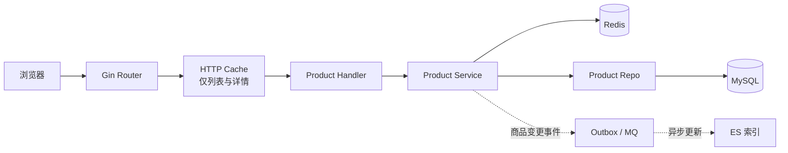
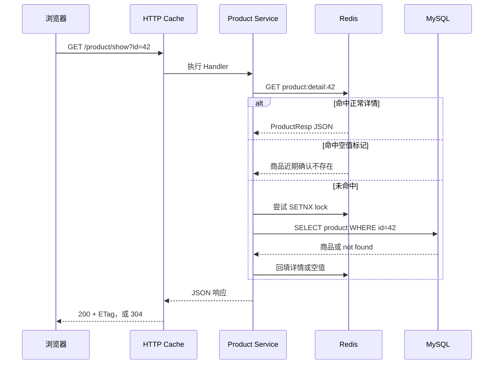
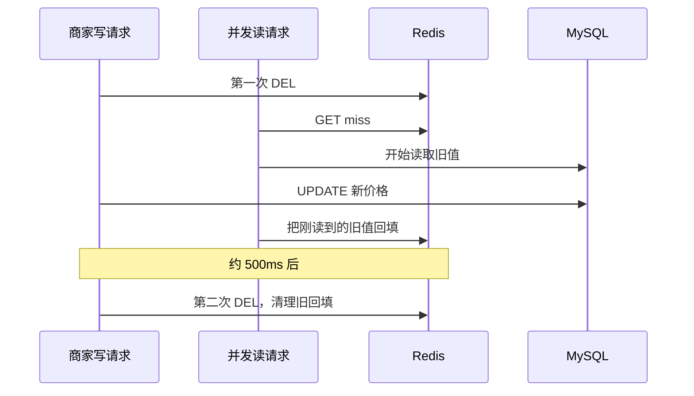

# 商品展示：一件商品怎样正确、快速地出现在用户面前

商品展示看起来很简单：查数据库，返回 JSON，前端画卡片。

但用户看到一件商品，背后至少经过列表、详情、相册、HTTP 缓存和 Redis。商家刚改完价格，旧缓存可能还在；热门商品缓存失效，许多请求可能同时回源。更隐蔽的问题是：页面明明有商品，前端却根本没有接通后端。

这一讲只追踪同一件商品的三段旅程：它怎样出现在列表，怎样打开详情，以及商家改价后旧数据怎样逐步消失。

## 本讲目标与时间预算

学完后，学生应能回答四个问题：

1. `route → handler → service → repo` 各自负责什么？
2. 商品列表和详情分别会访问哪些数据源？
3. HTTP cache、Redis、SETNX、singleflight 和延迟双删各解决什么问题？
4. 当前实现有哪些业务正确性缺口？

| 时间 | 内容 | 课堂证据 |
|---:|---|---|
| 0–6 分钟 | 页面有商品，链路就通了吗？ | 浏览器 Network 演示 |
| 6–12 分钟 | 五条读接口与运行架构 | 路由表、架构图 |
| 12–22 分钟 | 商品列表：分层、分页和 N+1 | 一次请求的代码路径 |
| 22–38 分钟 | 商品详情：两层缓存 | 冷/热缓存演示、时序图 |
| 38–48 分钟 | 商家改价：权限与延迟双删 | 并发读写时序图 |
| 48–55 分钟 | HTTP cache：强缓存、304、错误缓存 | 中间件执行顺序 |
| 55–60 分钟 | 代码评审与收束 | 三个缺口、出口题 |

> 讲师控制：正文按 55 分钟准备，最后 5 分钟用于出口题和学生提问。不要在课堂上展开 CDN、游标分页、图片补偿事务或完整压测，它们都放在课后延伸。

### 录制前准备

- 启动 MySQL、Redis 和 Go 服务。
- 准备一个存在的商品 ID，下面用 `42` 代替。
- Redis 使用项目配置的 DB 4。
- 屏幕同时保留浏览器 Network、应用日志和终端。

---

## 一、页面有商品，后端就成功了吗？（0–6 分钟）

先打开仓库里的 React 店面。页面有商品、有搜索，也能加入购物袋。此时问学生：

> 这些商品是后端刚刚返回的吗？你准备找什么证据？

不要先看页面，打开 Network。前端请求的是：

```ts
fetch('/api/v1/products', { signal: ctrl.signal })
```

后端真实路由却是：

```text
GET /api/v1/product/list
```

HTTP 404 不会让 `fetch` 自动抛异常。当前代码把非 2xx 响应转成 `null`，没有拿到数组时继续保留本地 `PRODUCTS`：

```ts
.then((r) => (r.ok ? r.json() : null))
.then((body) => {
    const raw = body?.data?.item ?? body?.data ?? []
    if (!Array.isArray(raw) || !raw.length) return
    // 只有拿到真实数组，才替换页面 seed 数据
})
```

因此页面看起来正常，正确的商品列表 handler 却一次都没有执行。

### 演示 1：判断前后端是否真的接通（3 分钟）

1. 打开 `/app/`，在 Network 中筛选 `products`。
2. 观察错误路径和状态码。
3. 手工访问 `/api/v1/product/list`，比较响应结构。

演示只需要得到一个结论：**界面有数据，不等于请求链路有数据。** 以后排查接口问题，页面是现象，Network、日志和数据库访问才是证据。

---

## 二、一个商品页面，其实由五条读链组成（6–12 分钟）

先用一张表建立地图，不逐个展开分类与轮播代码。

| 页面信息 | API | HTTP cache | Redis 数据缓存 |
|---|---|---:|---|
| 商品列表 | `GET /api/v1/product/list` | 30s | 只缓存 `total` |
| 商品详情 | `GET /api/v1/product/show?id=42` | 60s | 详情 10min + 抖动 |
| 商品相册 | `GET /api/v1/product/imgs/list?id=42` | 无 | 无 |
| 分类列表 | `GET /api/v1/category/list` | 300s | 无 |
| 首页轮播 | `GET /api/v1/carousels` | 300s | 无 |

这张表要纠正两个误解：商品首页不是一个接口；挂了 HTTP cache，也不代表 Redis 中一定保存了数据。

下面只画本讲追踪的商品列表与详情主路径。相册没有挂 HTTP cache，分类和轮播也有各自的 Handler，不经过 Product Handler。



沿图解释每层的职责：

- Handler 适配 HTTP：绑定参数、返回响应。
- Service 编排业务：先查缓存还是数据库，怎样组装 DTO。
- Repo 隔离持久化：把条件和分页翻译成 SQL。
- MySQL 是商品业务记录；Redis 和 ES 是为了读取速度建立的副本。

这里顺便划清交易边界：商品页可以短暂显示旧库存，但创建订单时必须重新校验价格、卖家和库存，不能相信页面缓存。

---

## 三、商品列表：一页数据为什么不只查一次（12–22 分钟）

从真实请求开始：

```bash
curl 'http://localhost:5002/api/v1/product/list?page_num=1&page_size=12&category_id=2'
```

### 3.1 请求怎样穿过三层

Handler 绑定 query，并补默认分页值：

```go
req, ok := response.Bind[ProductListReq](ctx)
if !ok { return }
if req.PageSize == 0 {
    req.PageSize = consts.BaseProductPageSize
}
resp, err := GetProductSrv().ProductList(ctx.Request.Context(), req)
```

Service 组织页面需要的数据：

```go
if req.CategoryID != 0 {
    condition["category_id"] = req.CategoryID
}
products, err := productDao.ListProductByCondition(condition, req.BasePage)
total, err := cache.ProductCountCached(ctx, req.CategoryID, func() (int64, error) {
    return productDao.CountProductByCondition(condition)
})
```

Repo 最终生成两类 SQL：

```sql
SELECT * FROM product WHERE category_id = ? LIMIT 12 OFFSET 0;
SELECT COUNT(*) FROM product WHERE category_id = ?;
```

第一页数据用于画卡片，`total` 用于计算总页数。当前实现只把 COUNT 结果缓存 60 秒，列表行仍然查询 MySQL。

### 3.2 先检查业务正确性，再谈性能

当前列表查询有两个更优先的问题：

- 没有稳定的 `ORDER BY`，翻页时商品可能重复或漏掉。
- 没有 `on_sale = true`，匿名用户可能看见下架商品。

详情接口也只按 ID 查询。因此团队必须先定义“下架”的业务语义：只是退出列表，还是匿名用户完全不能访问？规则确定后，列表和详情应保持一致。

### 3.3 Redis 也会出现 N+1

每组装一个商品 DTO，代码都会调用一次 `View()`。一页 15 件商品，就会产生 15 次串行 Redis GET。修复前先问产品：卡片真的需要浏览量吗？需要就批量读取，不需要就从列表移除。本讲不展开实现。

> 过渡问题：列表可以每次查一页，但热门详情被几千人同时打开时，还能直接查 MySQL 吗？

---

## 四、商品详情：同一个请求有两层缓存（22–38 分钟）

详情路由挂了 60 秒 HTTP cache，Service 内部又保存 Redis 对象缓存：

```go
public.GET(
    "product/show",
    middleware.HTTPCache(60*time.Second),
    ShowProductHandler(),
)
```

### 4.1 先走完整时序



正常详情缓存 10 分钟，并增加 `[0, 90s)` 的随机抖动。不存在的商品用特殊值 `\x00null` 缓存 60 秒，避免攻击者反复用随机 ID 穿透到数据库。

随机抖动把不同 key 的过期时间错开，减少大量缓存同时失效；它不是数据库容量保护，也不能代替限流。

### 4.2 SETNX 和 singleflight 为什么同时存在

缓存 miss 后，代码先尝试 Redis 锁：

```go
locked, _ := cache.TryProductLock(ctx, req.ID)
if !locked {
    time.Sleep(50 * time.Millisecond)
    if err := cache.GetProductDetail(ctx, req.ID, cached); err == nil {
        return cached, nil
    }
} else {
    defer cache.UnlockProduct(ctx, req.ID)
}
```

- SETNX 让不同应用实例争用同一个 Redis lock。
- singleflight 合并当前 Go 进程内相同商品的回源工作。

两者都只是收敛请求。没拿到锁的请求等待 50ms 后若仍未命中，会继续查数据库；singleflight 也不会跨进程。因此不要把当前实现讲成“全系统严格只查一次”。

### 演示 2：比较冷缓存与热缓存（5 分钟）

```bash
redis-cli -n 4 DEL product:detail:42 product:lock:42
curl -i 'http://localhost:5002/api/v1/product/show?id=42'
redis-cli -n 4 PTTL product:detail:42
curl -i 'http://localhost:5002/api/v1/product/show?id=42'
```

观察三件事：第一次是否出现 MySQL 查询，第二次是否从 Redis 返回，刚写入时 PTTL 是否接近 600000–690000ms（命令执行会消耗少量时间）。不要只比两次 curl 的耗时，本机网络抖动可能掩盖差异。

### 4.3 缓存中的库存只是展示值

详情 DTO 里包含 `Num` 和 `View`，但支付扣库存、库存回滚目前不会删除详情缓存，`AddView()` 也没有调用方。

所以页面上的库存和浏览量可能过时。缓存解决读取速度，不负责交易正确性；真正下单时仍要走库存预占或数据库条件更新。

---

## 五、商家改价：权限与延迟双删（38–48 分钟）

商家接口先经过角色检查，但“是商家”不等于“拥有这件商品”。Repo 还要把 `boss_id` 放进更新条件：

```go
res := d.DB.Model(&Product{}).
    Where("id=? AND boss_id=?", productID, userID).
    Updates(map[string]interface{}{
        "price": product.Price,
        "num": product.Num,
        "on_sale": product.OnSale,
    })
```

这是两道不同的边界：RBAC 防买家调用商家接口，`boss_id` 防商家修改别人的商品。这里使用 map 更新也很重要，因为 `num=0` 和 `on_sale=false` 都是合法值。

### 5.1 为什么更新后不直接 SET 新缓存

当前代码采用延迟双删：

```go
_ = cache.DelProductDetail(ctx, req.ID)
affected, err := dao.UpdateProduct(req.ID, user.ID, product)
if err != nil { return nil, err }
if affected == 0 { return nil, errors.New("商品不存在或无权修改") }

cache.DoubleDeleteAsync(req.ID, 0) // 默认 500ms 后再次删除
emitProductChanged(ctx, req.ID, "update")
```

第二次删除处理下面这个并发窗口：



延迟双删不是强一致保证。Redis 删除可能失败，浏览器还可能在 `max-age` 内复用旧响应，商品变更事件也可能发送失败。它做的是缩短旧值停留时间。

创建商品还有另一类风险：封面上传、商品写入、Outbox 和相册写入没有组成一个原子事务。课堂只点明“可能留下半成品”；怎样用状态机、事务和文件补偿恢复，放到课后设计题。

---

## 六、HTTP cache：强缓存与 304 不是一回事（48–55 分钟）

`HTTPCache` 会增加两个响应头：

```http
Cache-Control: public, max-age=60
ETag: W/"..."
```

在 60 秒新鲜期内，浏览器可以直接复用本地响应，请求不进入 Gin。缓存过期后，浏览器可能携带 `If-None-Match` 发起条件请求。

但当前中间件先执行完整 handler，再计算 ETag：

```go
c.Writer = buf
c.Next() // Redis/DB 查询和 JSON 序列化已经完成

etag := weakETag(buf.body.Bytes())
if c.GetHeader("If-None-Match") == etag {
    original.WriteHeader(http.StatusNotModified)
    return
}
```

因此当前 304 节省的是响应 body，不一定节省 Redis 或 MySQL 查询。它和浏览器新鲜期内完全不发请求，是两条不同路径。

### 一个模块正确，组合后也可能出错

中间件只缓存 HTTP 200，看上去合理；但统一错误出口也返回 HTTP 200：

```go
func Fail(ctx *gin.Context, err error) {
    ctx.JSON(http.StatusOK, ErrorResponse(ctx, err))
}
```

于是参数错误、商品不存在或瞬时数据库故障，都可能被标记为 `public` 并缓存。可选修法包括：错误使用真实 4xx/5xx；或让中间件识别业务响应，只缓存成功结果。

关键不是立刻选哪一种，而是看见契约冲突：HTTP cache 认为 200 表示成功，业务响应层认为 200 只表示“成功返回了一个 JSON”。

---

## 七、五分钟代码评审与收束（55–60 分钟）

让学生先说“用户会看到什么”，再说技术名词。

| 用户现象 | 代码根因 | 最先处理什么 |
|---|---|---|
| 页面有商品，但后端没有请求 | 前端路径错误后保留 seed 数据 | 修正 API 契约，开发环境暴露错误 |
| 下架商品仍能浏览 | list/show 没有统一可见性条件 | 先定义下架语义，再统一查询规则 |
| 商品不存在的响应被缓存 | 业务失败仍使用 HTTP 200 | 统一 HTTP 语义或显式禁止缓存 |

### 出口题

运营把商品 42 推到首页。三个应用实例同时遇到详情缓存过期：

1. 哪个机制合并单个进程内的请求？
2. 哪个机制尝试协调不同实例？
3. 为什么当前实现仍不能保证 MySQL 只查询一次？

参考答案：singleflight、Redis SETNX；没拿到锁的请求只等待 50ms，仍 miss 时会继续回源，而且 singleflight 不跨进程。

### 本讲只带走两条线

第一条是读路径：先确认页面真的接通，再沿 Handler、Service、Repo 找到 Redis 和 MySQL。每层缓存都要说清楚命中、失效与失败后的去向。

第二条是一致性边界：展示数据允许短暂过时，交易数据必须重新校验；延迟双删只能收敛旧缓存，不能替系统承诺强一致。

用一句话概括：**商品展示不是把一行数据库记录吐给前端，而是让多个数据源拼出的页面，在缓存、并发和失败下仍然说得通。**

## 课后延伸（不计入 60 分钟）

1. 为公开列表补稳定排序，并在明确下架语义后统一 list/show 的可见性规则。
2. 修改 HTTP cache，使业务失败响应不可被共享缓存保存，并为成功、not found 和服务错误写测试。
3. 设计商品创建的恢复流程：对象存储成功而数据库失败时怎样补偿，Outbox 写失败时怎样重试。

延伸阅读时可以继续研究 COUNT 缓存、游标分页、相册限制、分类排序和 CDN；这些内容不在本次录制中展开。
