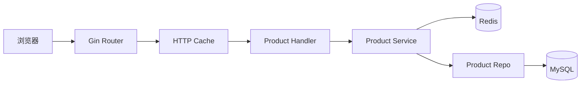
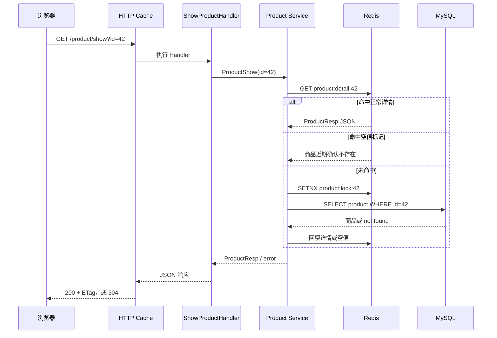
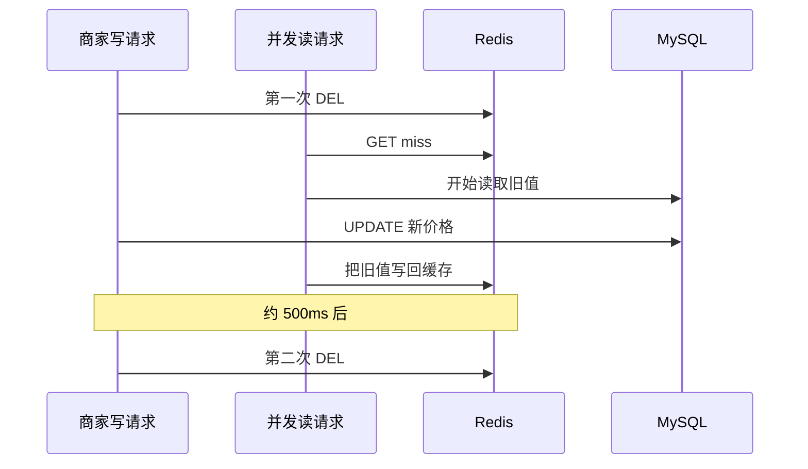

# 商品展示：页面上的一件商品从哪里来

目录

- [一、页面有商品，后端却可能没有返回商品](#一页面有商品后端却可能没有返回商品)
- [二、列表接口不只是查一页数据](#二列表接口不只是查一页数据)
- [三、热门商品的详情怎样读](#三热门商品的详情怎样读)
- [四、商家改价以后，旧价格还会留在哪里](#四商家改价以后旧价格还会留在哪里)
- [五、浏览器缓存与当前实现的边界](#五浏览器缓存与当前实现的边界)

## 录制安排

这一章拆成两个视频。上集从页面上的假数据出发，一直读到热门商品的详情缓存；下集从商家改价开始，继续看旧价格为什么不会立刻消失。

| 视频 | 时间 | 内容 |
|---|---:|---|
| 上集 | 0–7 分钟 | 从前端的假数据看接口是否真的接通 |
| 上集 | 7–14 分钟 | 商品页用了哪些接口，各层代码放在哪里 |
| 上集 | 14–26 分钟 | 列表、分页、总数缓存和当前查询缺口 |
| 上集 | 26–43 分钟 | 详情缓存、空值缓存和并发回源 |
| 下集 | 0–15 分钟 | 商家改价与商品归属校验 |
| 下集 | 15–30 分钟 | 延迟双删留下的并发窗口 |
| 下集 | 30–43 分钟 | HTTP 强缓存、ETag 和错误响应缓存 |

CDN、游标分页、图片补偿事务和完整压测不放进视频，留到课后继续做。

---

## 一、页面有商品，后端却可能没有返回商品

先运行仓库里的 React 店面。首页能看到商品卡片，搜索和购物袋也能用。单看页面，很容易以为商品服务已经接好了。

打开浏览器 Network，会看到前端请求的是：

```ts
fetch('/api/v1/products', { signal: ctrl.signal })
```

后端注册的列表路由是：

```text
GET /api/v1/product/list
```

两条路径并不相同。请求 `/api/v1/products` 会得到 404，但当前页面不会把这个错误显示出来。`fetch` 只有在网络层失败时才会进入 `catch`；HTTP 404 仍然会正常返回一个 `Response`。页面代码发现 `r.ok` 为假后返回 `null`，随后继续保留初始化时传入的 `PRODUCTS`：

```ts
const [items, setItems] = useState<Product[]>(PRODUCTS)

fetch('/api/v1/products', { signal: ctrl.signal })
  .then((r) => (r.ok ? r.json() : null))
  .then((body) => {
    const raw = body?.data?.item ?? body?.data?.list ?? body?.data ?? []
    if (!Array.isArray(raw) || !raw.length) return
    // 拿到真实数组后才会 setItems(mapped)
  })
  .catch(() => { /* 接不到后端时保留 seed 数据 */ })
```

所以这时看到的是前端自带的八件 seed 商品，`ListProductsHandler` 根本没有执行。这里不用展开 React，打开 Network 看请求路径、状态码和响应体，再手工访问 `/api/v1/product/list`，对比后端真正返回的结构。

这也是排查商品页的起点。页面只能说明“组件画出了东西”，不能证明请求经过了 Handler、Redis 或 MySQL。

## 二、列表接口不只是查一页数据

商品首页不是由一个接口拼出来的。当前公开读接口和缓存时间如下：

| 页面数据 | API | HTTP cache | Redis 数据缓存 |
|---|---|---:|---|
| 商品列表 | `GET /api/v1/product/list` | 30 秒 | 只缓存 `total` |
| 商品详情 | `GET /api/v1/product/show?id=42` | 60 秒 | 详情 10 分钟，加随机抖动 |
| 商品相册 | `GET /api/v1/product/imgs/list?id=42` | 无 | 无 |
| 分类列表 | `GET /api/v1/category/list` | 300 秒 | 无 |
| 首页轮播 | `GET /api/v1/carousels` | 300 秒 | 无 |

Redis 中没有保存整页商品列表，只有详情对象、列表总数和浏览量等数据。



这里的分层和用户模块一样。Handler 接 HTTP 参数并写响应，Service 决定先读哪里以及怎样组装 `ProductResp`，Repo 把查询条件和分页翻译成 SQL。MySQL 保存商品业务记录，Redis 保存可以短暂过期的读取副本。

### 一次列表请求经过哪些代码

用下面的请求看第一页、每页 12 件、分类 ID 为 2 的商品：

```bash
curl 'http://localhost:5002/api/v1/product/list?page_num=1&page_size=12&category_id=2'
```

Handler 绑定 query。没有传 `page_size` 时，它补上 `consts.BaseProductPageSize`，然后把请求交给 `ProductList`：

```go
req, ok := response.Bind[ProductListReq](ctx)
if !ok {
    return
}
if req.PageSize == 0 {
    req.PageSize = consts.BaseProductPageSize
}
resp, err := GetProductSrv().ProductList(ctx.Request.Context(), req)
```

Service 先准备查询条件。`category_id=0` 表示不按分类过滤，否则把它放进 `condition`：

```go
condition := make(map[string]interface{})
if req.CategoryID != 0 {
    condition["category_id"] = req.CategoryID
}

products, err := productDao.ListProductByCondition(condition, req.BasePage)
total, err := cache.ProductCountCached(ctx, req.CategoryID, func() (int64, error) {
    return productDao.CountProductByCondition(condition)
})
```

Repo 会发出一条分页查询和一条计数查询，作用不同：前者返回当前页的卡片，后者告诉前端一共有多少条记录。

```sql
SELECT * FROM product WHERE category_id = ? LIMIT 12 OFFSET 0;
SELECT COUNT(*) FROM product WHERE category_id = ?;
```

`total` 与页码无关，没有必要在每次翻页时重新统计。`ProductCountCached` 把结果放进 Redis 60 秒：全量计数使用 `product:count:all`，分类计数使用 `product:count:cat:<category_id>`。同一进程内的并发 COUNT 还会由 singleflight 合并。Redis 读取或写入失败时，请求继续查 MySQL，列表不会因为计数缓存故障直接不可用。

商品行本身仍然每次从 MySQL 读取。不要把这条链讲成“列表已经进了 Redis”。

### 先看用户会不会拿到错误数据

当前 `ListProductByCondition` 没有稳定的 `ORDER BY`。数据变化时，OFFSET 分页可能让一件商品在相邻两页重复出现，也可能漏掉商品。公开列表也没有加入 `on_sale = true`，匿名用户有机会看到已经下架的商品。

详情查询同样只按 ID 查，没有判断 `on_sale`。团队要先决定下架后的访问规则：只是从列表隐藏，还是公开详情也不能打开。规则定下来后，列表和详情要一起改，否则同一件商品在两个入口会有两种答案。

还有一个不太显眼的成本。Service 在组装每个 `ProductResp` 时都会调用一次 `p.View()`，而 `View()` 会读一次 Redis。一页有 15 件商品，就有 15 次串行 GET。卡片如果不展示浏览量，最省事的处理是从列表响应里去掉它；如果产品确实需要，就应该批量读取。

### 停一下（约 30 秒）

假设数据库里刚下架一件商品。为什么只给列表加 `on_sale = true` 还不够？

<details>
<summary>参考答案</summary>

用户仍然可以拿商品 ID 直接访问详情接口。下架语义必须覆盖所有公开读取入口，不能只修首页列表。

</details>

## 三、热门商品的详情怎样读

列表页之后，继续打开商品 42。详情路由外面有 60 秒 HTTP cache，Service 里面还有一层 Redis 对象缓存：

```go
public.GET(
    "product/show",
    middleware.HTTPCache(60*time.Second),
    ShowProductHandler(),
)
```

两层缓存的服务对象不同。浏览器强缓存命中时，请求不会进入 Gin；请求进入后，Redis 才决定要不要查询 MySQL。



正常详情的 key 是 `product:detail:<id>`，基础 TTL 为 10 分钟。写入时再增加 `[0, 90s)` 的随机时间，让同一批缓存不要挤在一个时刻过期。商品不存在时，代码把 `\x00null` 写到同一个 key，TTL 只有 60 秒。随机 ID 被反复访问时，这个空值能挡住大部分数据库穿透；短 TTL 又给后来上架同 ID 数据留下了恢复时间。

空值使用 `SET NX` 写入。原因是“查询发现不存在”和“另一请求刚写入真实详情”可能并发发生，无条件写空值会盖掉真实数据。

### 缓存失效时，谁去查数据库

详情 miss 后，`TryProductLock` 尝试创建 `product:lock:<id>`，锁的 TTL 是 3 秒。抢到锁的请求回源，没抢到的请求等 50ms，再读一次详情缓存：

```go
locked, _ := cache.TryProductLock(ctx, req.ID)
if !locked {
    time.Sleep(50 * time.Millisecond)
    if err := cache.GetProductDetail(ctx, req.ID, cached); err == nil {
        return cached, nil
    }
} else {
    defer cache.UnlockProduct(ctx, req.ID)
}

loaded, err := cache.LoadProductOnce(req.ID, func() (interface{}, error) {
    return s.loadProductFromDB(ctx, req.ID)
})
```

Redis 的 SETNX 用来协调多个应用实例；`LoadProductOnce` 里的 singleflight 只能合并当前 Go 进程内相同 ID 的回源。没拿到 Redis 锁的请求只重试一次，50ms 后仍然 miss 就会继续查数据库。因此当前实现能减少并发回源，但不能保证整个集群只查一次 MySQL。

录制时可以清掉商品 42 的详情和锁，再连续请求两次：

```bash
redis-cli -n 4 DEL product:detail:42 product:lock:42
curl -i 'http://localhost:5002/api/v1/product/show?id=42'
redis-cli -n 4 PTTL product:detail:42
curl -i 'http://localhost:5002/api/v1/product/show?id=42'
```

第一次请求应当出现数据库查询，随后 Redis 中的 PTTL 接近 600000–690000ms；执行命令本身会消耗一点时间。第二次请求从哪里返回，最好结合 SQL 日志和 Redis key 判断，不要只比较两次 `curl` 的耗时。

详情缓存里还有 `Num` 和 `View`。它们只是页面展示值：支付扣库存和库存回滚目前不会删除详情缓存，`AddView()` 也没有调用方。在详情链路中，`View()` 只在 `loadProductFromDB` 组装 DTO 时读取 Redis。用户看到的库存和浏览量都可能滞后，下单时必须重新校验价格、卖家和库存。

---

## 四、商家改价以后，旧价格还会留在哪里

下集从一次改价开始。假设商家把商品 42 从 299 元改成 269 元。写接口先经过 merchant 角色检查，但角色只说明“他是一名商家”，不能说明“商品 42 属于他”。Repo 在更新条件里同时检查 `id` 和 `boss_id`：

```go
res := d.DB.Model(&Product{}).
    Where("id=? AND boss_id=?", productID, userID).
    Updates(map[string]interface{}{
        "name":           product.Name,
        "category_id":    product.CategoryID,
        "title":          product.Title,
        "info":           product.Info,
        "price":          product.Price,
        "discount_price": product.DiscountPrice,
        "num":            product.Num,
        "on_sale":        product.OnSale,
    })
```

`RequireRole` 挡住普通买家，`boss_id` 条件挡住商家修改别人的商品。更新使用 map 还有一个实际原因：GORM 用 struct 做 `Updates` 时会跳过零值，`num=0` 和 `on_sale=false` 却都是合法业务状态。

当前写路径采用延迟双删：

```go
_ = cache.DelProductDetail(ctx, req.ID)
affected, err := dao.UpdateProduct(req.ID, user.ID, product)
if err != nil {
    return nil, err
}
if affected == 0 {
    return nil, errors.New("商品不存在或无权修改")
}

cache.DoubleDeleteAsync(req.ID, 0) // 默认 500ms 后再删一次
emitProductChanged(ctx, req.ID, "update")
```

为什么删一次不够？考虑一个比写请求稍早开始的读请求：



第二次删除用来清理并发读回填的旧值。它有 2 秒独立超时，并限制最多 1024 个延迟删除 goroutine 在飞；超过上限会放弃本次第二次删除，避免 Redis 故障时 goroutine 不断堆积。

这套做法仍然允许短时间读到旧价格。第一次或第二次 Redis 删除可能失败，浏览器也可能在 `max-age` 内直接复用旧响应。更新完成后，Service 还会写一条 `product.changed` Outbox 事件，交给 publisher 和搜索 indexer 异步更新 ES；Outbox 插入失败只记日志，不会让商品更新回滚。

### 停一下（约 30 秒）

数据库已经是 269 元，两次 Redis 删除也都成功了，用户为什么还可能看见 299 元？

<details>
<summary>参考答案</summary>

浏览器可能仍在 `max-age` 新鲜期内，直接复用本地保存的旧响应。这次访问不会进入 Gin，自然也不会读取已经更新的数据库和 Redis。

</details>

## 五、浏览器缓存与当前实现的边界

`HTTPCache` 给 HTTP 200 响应写入：

```http
Cache-Control: public, max-age=60
ETag: W/"..."
```

`max-age=60` 还没过时，浏览器可以直接使用本地响应，后端看不到这次访问。过期后，浏览器可能带 `If-None-Match` 请求服务器；ETag 相同则收到 304，不再下载响应体。

当前中间件要先执行完整 Handler，才能根据响应体计算 ETag：

```go
c.Writer = buf
c.Next() // Redis/DB 查询和 JSON 序列化已经完成

etag := weakETag(buf.body.Bytes())
if c.GetHeader("If-None-Match") == etag {
    original.WriteHeader(http.StatusNotModified)
    return
}
```

因此 304 可以省响应 body，却不一定省 Redis 或 MySQL 查询。它和 `max-age` 新鲜期内完全不发请求是两条不同路径。

还有一个会直接影响用户的契约冲突。`HTTPCache` 只处理 HTTP 200，本来是想避开错误响应；项目的统一错误出口却同样返回 HTTP 200：

```go
func Fail(ctx *gin.Context, err error) {
    ctx.JSON(http.StatusOK, ErrorResponse(ctx, err))
}
```

参数错误、商品不存在和临时数据库故障都有可能带上 `Cache-Control: public`，随后被浏览器或共享缓存复用。修复时可以让业务错误返回真实 4xx/5xx，也可以让中间件读取业务码，只缓存成功结果；无论选哪一种，HTTP 状态和缓存判定必须使用同一套成功语义。

修复顺序按用户影响来排：先修正前端路径，让 seed 数据不再遮住接口错误；接着统一 `on_sale` 和稳定排序，再处理 N+1、缓存命中率和 304 的开销。页面上的价格和库存只用于展示，交易服务仍要以当前数据库状态完成校验。

## 课后延伸

- 修正前端商品列表路径，并让开发环境明确显示接口失败，不再静默保留 seed 数据。
- 给公开列表补稳定排序；定义下架语义后，为 list/show 增加一致的可见性测试。
- 修改 `HTTPCache`，确保业务失败响应不会进入共享缓存，并分别测试成功、not found 和服务错误。
- 设计商品创建失败后的恢复流程。封面上传、商品记录、Outbox 和相册记录目前没有组成一个原子事务，需要考虑文件清理、相册补偿和 Outbox 重试。
