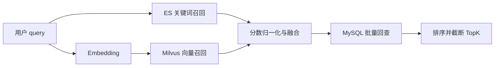

# 商品搜索（下）：Hybrid、Milvus 与搜索评估

> 上一讲解决了关键词检索与 ES 索引同步。本讲接住它没法回答的问题：用户描述的是场景而不是商品词时，怎样用向量召回补候选；依赖故障时怎样退化；改权重以后又凭什么说结果更好。

## 本讲目标

讲完后，学生应当能够：

- 解释关键词召回与向量召回各自擅长什么；
- 沿 `SemanticSearch` 说清 embedding、Milvus、ES、归一化、融合与 DB 回查；
- 准确描述当前 Milvus 接入的边界，而不是把占位实现当成生产能力；
- 为普通搜索与 Hybrid 设计可识别、可监控的降级协议和小型评估集。

## 时间表（约 46 分钟，最多 56 分钟）

| 时间 | 内容 | 检查问题 |
|---|---|---|
| 0–6 分钟 | 关键词召回的盲区 | 同义表达没有共同词时怎么办？ |
| 6–22 分钟 | Hybrid 完整调用链 | 两路分数为什么不能直接相加？ |
| 22–31 分钟 | Milvus 与当前实现边界 | 代码里有接口，是否等于生产链路已接通？ |
| 31–39 分钟 | 故障降级与一致性 | 哪些失败退成单路，哪些直接报错？ |
| 39–46 分钟 | 查询集评估与课堂练习 | 权重从 0.5 改为 0.7，怎样证明变好？ |
| 46–56 分钟 | 提问与机动 | 不推导向量索引数学 |

讲解边界：不推导 HNSW，不展开 embedding 模型训练、个性化排序和集群容量规划。

---

## 一、为什么需要第二路召回（0–6 分钟）

关键词搜索擅长品牌、型号和明确词项，例如“iPhone 15 256G”。但“适合雨天通勤的鞋”可能与商品标题没有共同词；向量表示可以把相近含义放到附近，从而补回关键词漏掉的候选。

向量召回也会犯错：精确型号可能被语义近似项冲淡，距离分数很难直接向用户解释，还增加 embedding 与 Milvus 两个依赖。因此当前设计没有用向量替换关键词，而是让两路各自召回，再融合。



## 二、沿 `SemanticSearch` 读一遍 Hybrid（6–22 分钟）

### 2.1 两路各多取一些候选

请求的 `topK` 默认 10，最大 50。向量和关键词分支都取 `topK * 3`，给融合留余量；如果每路只取最终数量，另一条路径没有机会把单路排名靠后的共同候选推上来。

```go
vec, err := deps.embed(ctx, req.Query)
if err != nil {
    return nil, err
}

vecHits, err := GetSearcher().Search(
    ctx, vec, topK*3, req.CategoryID,
)
if err != nil {
    return nil, err
}

keywordHits, _, err := deps.keyword(
    ctx, req.Query, 0, topK*3, req.CategoryID,
)
if err != nil {
    keywordHits = nil
}
```

顺序揭示了当前降级边界：embedding 或向量检索失败会直接返回错误；ES 关键词分支失败时，才会保留纯向量候选继续执行。

### 2.2 分数先归一化，再按权重合并

ES `_score` 与 Milvus 距离不在同一尺度，直接相加没有意义。代码对两路分别做 min-max 归一化，再按 0.5 / 0.5 计算：

```go
semNorm := minMaxNormalize(vecScores(vecHits))
kwNorm := minMaxNormalize(esScores(keywordHits))

for id, h := range fused {
    h.Score = 0.5*h.SemanticScore + 0.5*h.KeywordScore
    ids = append(ids, id)
}
```

同一路所有分数相等时，当前 `minMaxNormalize` 会把它们都记为 1，而不是 0。课堂不推公式，只讨论后果：这个候选集内部没有区分度，但仍然被视为有效命中。

这里有一个确定的排序缺口：milvus-sdk-go 的 `SearchResult.Scores` 实际保存 distance，而 `SearchProductVector` 使用 L2，距离越小越接近。当前代码直接 min-max 后按大分降序，语义方向会反转。接入生产 searcher 前，应先把距离转成“越大越相关”的分数，例如 `1 - normalizedDistance`，再参与融合。

0.5 / 0.5 是调优入口，不是客观真理。权重、每路候选数量与类目过滤都需要查询集验证。

### 2.3 最终结果回到 MySQL

融合得到 ID 后，代码用 `ListByIDs` 批量读取商品，再按融合分数排序；分数相同则商品 ID 较小者在前，最后截断 `topK`。

回查能过滤数据库中已经不存在的 ID，并拿到当前商品字段。但 `ListByIDs` 当前没有显式的 `on_sale=true` 条件，不能把“回 DB”自动等同于“所有商品规则都完整”。评审搜索时仍要逐条检查上下架、类目和库存展示口径。

## 三、Milvus 代码存在，不等于链路已经接通（22–31 分钟）

`repository/milvus/product_vector.go` 定义了 `product_vector` collection：主键为商品 ID，向量维度 768，类目用于过滤；索引采用 HNSW。`SearchProductVector` 支持 `topK` 与可选 `category_id`。

生产接入仍有明显边界：

- `service/search` 默认注册 `nopMilvusSearcher`，仓库没有生产 `SetSearcher` 调用，也没有把 `SearchProductVector` 适配进来；
- 未配置 embedding 服务时，代码会用 SHA-256 生成 768 维占位向量，它适合联通代码路径，不代表真实语义；
- 当前 `product.changed` 消费者只更新 ES，没有生产级 Milvus 向量写入链路。

因此，即使配置 `MILVUS_ADDR`，当前应用也不会自动获得向量候选；除非测试或外部代码手动注入 searcher，Hybrid 实际只有 ES 关键词候选。课上可以演示接口抽象和融合单测，但不能声称商品修改后向量索引会自动更新。

要补齐生产链，至少需要：商品文本生成 embedding、向量 Upsert/Delete、失败重试与死信、历史回填、模型或维度变更时的重建策略。这里点出责任即可，不继续扩课。

## 四、降级要让用户和监控都看得懂（31–39 分钟）

| 场景 | 当前行为 | 结果风险 | 应观察的信号 |
|---|---|---|---|
| 普通搜索 ES 失败 | 回 DB `LIKE` | 口径与延迟变化 | ES 错误率、DB 搜索 QPS |
| Hybrid 的 ES 分支失败 | 继续纯向量 | 精确型号排序变差 | 关键词候选占比 |
| embedding 失败 | Hybrid 返回错误 | 语义入口不可用 | 超时、状态码、错误类型 |
| Milvus searcher 返回错误 | Hybrid 返回错误 | 语义入口不可用 | 向量查询错误率 |
| 默认 nop searcher | 返回空向量候选，继续 ES | 看似 Hybrid，实际纯关键词 | 两路候选数量 |
| 索引消费者积压 | ES 副本落后 | 新商品暂时搜不到 | 最老事件年龄、队列深度 |

空结果与系统故障含义不同。把 embedding 超时吞掉再返回空数组，会让用户以为平台没有商品，也让错误率看起来很漂亮。更合理的协议应明确：退到 ES、退到普通 DB，还是返回可识别的业务错误；同时在响应或内部指标中记录实际使用了哪些召回源。

一致性边界也要保留：搜索副本可以短暂落后，交易侧仍须从 MySQL 反查价格、归属、上下架与库存。

## 五、先做二十条查询，再谈调权重（39–46 分钟）

课堂准备一个小查询集即可，不追求统计结论。查询应混合：

- 精确型号，例如“iPhone 15 256G”；
- 品牌加品类，例如“山大马克杯”；
- 场景描述，例如“适合雨天通勤的鞋”；
- 类目过滤冲突、错别字与零结果查询。

每条查询人工标出前五名中哪些相关，再分别运行关键词、向量和 Hybrid。记录候选来源、最终名次和失败原因。常用的离线指标可以放到课后，本讲只问两个直观问题：该出现的商品有没有进入前五？明显无关的商品是否被排在前面？

### 课堂练习

给出一组结果：关键词找到 A、B、C，向量找到 B、D、E。请学生先不算复杂公式，只解释为什么 B 可能因两路都命中而上升，以及把语义权重从 0.5 调到 0.7 会牺牲哪类查询。

最后回到课程主线：搜索可以降级和短暂落后，因为下单会权威反查；但搜索质量下降仍会损失成交，所以降级必须能被量化，而不是只保证接口返回 200。

## 课后小练习

为语义接口写一页降级协议：分别规定 embedding、Milvus、ES 失败时的响应、后备路径、超时预算和监控字段。然后用同一组查询验证正常与降级结果，不要只测是否报错。
