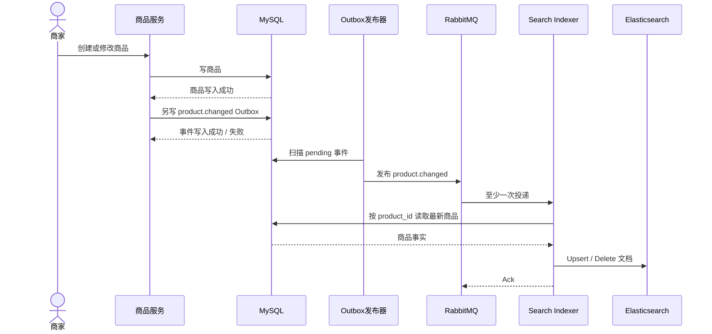

# 商品搜索（上）：关键词检索与索引同步

> 用户不会照着数据库字段说话。本讲先把普通搜索讲透：业务意图如何进入 DB 或 Elasticsearch，以及商品变更为什么不会瞬间出现在索引里。Hybrid 与 Milvus 放到下一讲。

## 本讲目标

讲完后，学生应当能够：

- 区分召回、排序、业务过滤和交易事实；
- 说明普通搜索何时走 ES、何时退回 DB `LIKE`；
- 读懂当前 `multi_match` 查询，并指出普通搜索的过滤缺口；
- 画出商品变更经 Outbox、RabbitMQ 进入 ES 的链路。

## 时间表（约 43 分钟，最多 55 分钟）

| 时间 | 内容 | 检查问题 |
|---|---|---|
| 0–7 分钟 | 搜索在购物漏斗中的位置 | 返回 200 为什么仍可能“搜索失败”？ |
| 7–18 分钟 | DB 退路与数据边界 | `LIKE` 能兜底什么，不能替代什么？ |
| 18–29 分钟 | ES 查询与排序口径 | 字段权重和结构化过滤应放在哪里？ |
| 29–39 分钟 | 商品变更到索引 | 上架后为什么不会立刻可搜？ |
| 39–43 分钟 | 对比演示与承接问题 | 关键词匹配不到同义表达时怎么办？ |
| 43–55 分钟 | 提问与机动 | 不展开向量融合 |

讲解边界：本讲不推导 HNSW，不讲个性化排序，也不把尚未接通的 Milvus 写链路描述成生产现状。

---

## 一、搜索不是给数据库加一个 WHERE（0–7 分钟）

用户搜索“适合露营的轻便咖啡壶”，表达的是使用场景；商品表却只有名称、标题、详情、类目等字段。接口返回空数组并不算技术报错，但可能把一个有明确购买意图的人送走。


四个环节不要混：召回决定“有没有候选”；排序决定“谁在前”；过滤执行必须满足的业务条件；展示字段只为减少页面拼装。MySQL 始终保存商品事实，ES 保存可重建、可能暂时落后的检索副本。

## 二、DB `LIKE` 是退路，不是完整搜索产品（7–18 分钟）

当前普通搜索 `ProductSearch` 的选择很直接：ES 客户端存在就先查 ES；ES 查询失败或客户端未初始化，再调用 `ProductDao.SearchProduct`。

```go
func ProductSearch(ctx context.Context, req *product.ProductSearchReq) (
    *types.DataListResp, error,
) {
    if es.EsClient != nil {
        docs, total, err := SearchProducts(ctx, req)
        if err == nil {
            return buildESResponse(docs, total), nil
        }
        log.LogrusObj.Errorf("ES search failed, fall back to DB: %v", err)
    }

    rows, total, err := product.NewProductDao(ctx).
        SearchProduct(req.Info, req.BasePage)
    if err != nil {
        return nil, err
    }
    return buildDBResponse(rows, total), nil
}
```

为方便课堂阅读，上面压缩了响应转换；真实代码在 `service/search/product_query.go`。

DB 退路使用：

```sql
WHERE name LIKE '%keyword%' OR info LIKE '%keyword%'
```

它容易部署，小数据量时也够用；但它没有字段权重、中文分词等完整检索能力，模糊匹配还会给交易库增加扫描压力。更麻烦的是两条路径口径不完全一致：

- ES 关键词取 `info / title / name` 中第一个非空字段；
- DB 回退只传 `req.Info`，匹配 `name` 和 `info`；
- 普通 ES 查询与 DB 回退当前都没有使用 DTO 中的 `category_id`。

因此降级测试不能只检查状态码。还要用同一请求比较关键词取值、过滤条件、结果数量和延迟。

### 搜索副本不能参与计价

ES 文档带有名称、标题、价格、库存展示等字段，可以直接组装搜索结果；下单时仍要回到 MySQL 读取价格、卖家和商品状态。索引延迟或客户端篡改都不能改变交易金额。

## 三、当前 ES 查询到底做了什么（18–29 分钟）

普通 `SearchProducts` 构造 `multi_match`：

```go
q := map[string]any{
    "from": from,
    "size": size,
    "query": map[string]any{
        "multi_match": map[string]any{
            "query":  keyword,
            "fields": []string{"name^3", "title^2", "info"},
        },
    },
}
```

`name^3` 让名称命中比详情命中更靠前，`title^2` 次之。权重是业务假设，不是永远正确的常数。可以用两条查询检查它：

- 搜“苹果手机”，名称明确命中的手机应压过详情里偶然出现“苹果”的配件；
- 搜“手机”并限定类目，类目外商品即使文本分高也不应出现。

第二条恰好暴露当前普通搜索的缺口：查询没有类目 `filter`。Hybrid 的关键词分支另用 `SearchProductsWithScore`，才会把 `category_id` 放进 bool/filter；不要把两条接口讲成相同实现。

如果以后加入广告、销量或新品信号，应单独记录并说明排序原因，别把所有分数塞进一个无法解释的权重。

## 四、商品变更怎样进入 ES（29–39 分钟）

商品写入 MySQL 后，`product.changed` 事件负责刷新检索副本。当前 `StartProductIndexer` 绑定队列 `search.product.indexer`，prefetch 为 32；消费者收到事件后，删除操作调用 `es.DeleteProduct`，其他操作重新查 MySQL，再按商品 ID Upsert。



这里要认清当前实现的一道裂缝：`ProductCreate / Update / Delete` 先完成商品写入，再由 `emitProductChanged` 另行插入 Outbox；两次写入不在同一个事务里，而且插入事件失败只记日志。商品可能已更新，但索引事件没有落盘。Outbox 发布器能可靠重试“已经写进去的事件”，救不回根本没有写入的事件。

这条链路还有三个教学点：

1. 异步索引允许“商品写成功”和“可以搜到”之间存在时间窗。
2. 至少一次投递要求消费者幂等；ES 文档 ID 使用商品 ID，重复 Upsert 会覆盖同一文档，删除 404 视为成功。
3. 解析失败的坏消息不会重新入队，处理失败则重新入队；生产环境还需要死信与重试上限，避免永久错误热循环。

### 增量事件补不了历史数据

admin 回填按 ID 分批读取商品并逐条 Upsert。当前游标只在单条写入成功后推进；持续失败的记录会直接让任务返回错误。生产回填通常要把“扫描进度”和“失败 ID 重试”分开记录。

观察异步新鲜度时，至少看 Outbox 最老 pending 年龄、队列积压与 indexer 失败。只看 HTTP 搜索错误率，发现不了“接口正常但索引一直旧”。

## 五、演示与下一讲入口（39–43 分钟）

准备名称、标题和详情分别命中同一关键词的几件商品，先请求普通搜索，观察字段权重；随后让 ES 客户端不可用，再用同一请求观察 DB 回退的结果与延迟。环境没准备好就展示查询 JSON 和现有测试，不在录制中安装 ES。

离开本讲前，让学生回答：

1. 为什么搜索结果中的价格不能直接用于下单？
2. “适合雨天通勤的鞋”与商品文案没有共同词时，`multi_match` 为什么可能召回不到？

第二个问题由[商品搜索（下）：Hybrid、Milvus 与搜索评估](./03-product-search-hybrid.md)继续回答。

## 课后小练习

为普通 ES 路径与 DB 回退写一组契约用例：同一输入下分别记录关键词、类目过滤、分页和结果集合。先暴露差异，不急着把两种引擎硬改成完全相同。
