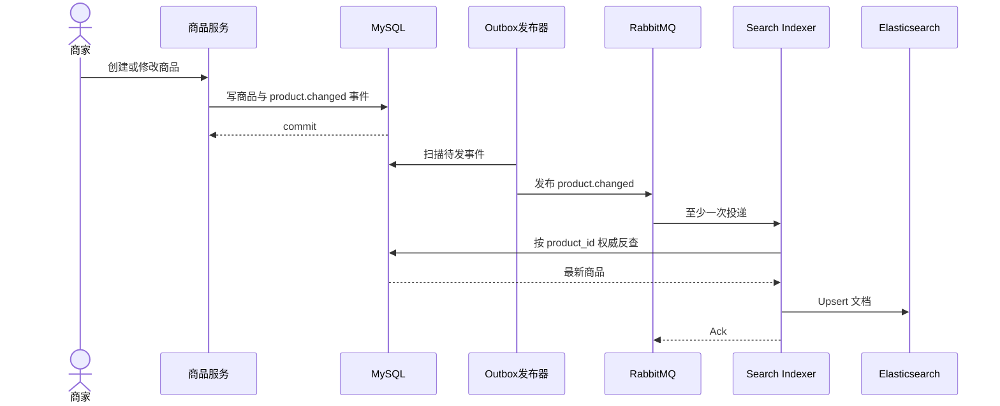
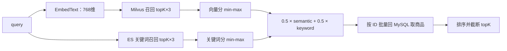

# 商品搜索：从“搜得到”到“排得对”

> 用户不会照着数据库字段说话。搜索系统要把自然表达变成候选商品，同时允许索引短暂落后、检索组件局部故障，并且不能篡改商品事实。

## 本讲安排（60 分钟）

| 时间 | 内容 | 学生要带走的问题 |
|---|---|---|
| 0–7 分钟 | 搜索在购物漏斗里的位置 | “搜不到”为什么没有报错却仍会损失成交？ |
| 7–17 分钟 | DB LIKE 与 ES 分工 | 为什么交易库不适合承担全文检索？ |
| 17–29 分钟 | ES 查询、字段权重与过滤 | 相关性和业务规则怎样分开？ |
| 29–39 分钟 | 商品变更到索引的异步链路 | 上架后为何不会立刻可搜？ |
| 39–50 分钟 | Hybrid 召回与融合 | 关键词和语义为什么要并存？ |
| 50–56 分钟 | 降级与一致性边界 | 哪些失败会退化，哪些仍会报错？ |
| 56–60 分钟 | 演示与回顾 | 比较关键词搜索与降级路径 |

HNSW 数学推导、个性化排序、以图搜图和容量分片放在课后延伸。本讲只保留能解释当前代码的主线。

---

## 一、搜索不是“给数据库加一个 WHERE”（0–7 分钟）

商品列表适合用户随便逛，搜索则承接明确意图。用户输入“适合露营的轻便咖啡壶”，系统若只做字段相等判断，接口依然返回 200，却把一个有购买意向的人送进空结果页。这个损失通常不会出现在错误日志里。

搜索至少要同时回答两件事：

- **召回**：哪些商品可能相关？漏掉合适商品，后面的排序救不回来。
- **排序**：候选中谁应该在前？相关性、是否上架、类目等规则不能混成一团。


MySQL 仍是商品事实来源。ES、Milvus 保存的是为检索准备的副本；副本可以重建，也可能暂时落后。

## 二、DB LIKE 与 ES 怎么分工（7–17 分钟）

### 2.1 LIKE 是降级路径，不是完整搜索产品

DB `LIKE` 容易落地，也适合数据量很小或 ES 故障时兜底。但它缺少分词、字段权重和成熟的倒排索引能力；模糊匹配扩大后还会给交易库带来扫描压力。

当前普通商品搜索 `ProductSearch` 的策略很直接：ES 客户端存在就先查 ES；ES 查询报错或客户端未初始化，再调用 `ProductDao.SearchProduct`。因此普通搜索有 DB 退路，但退化后相关性、吞吐和字段覆盖可能不同。

```go
func ProductSearch(ctx context.Context, req *product.ProductSearchReq) (
    *types.DataListResp, error,
) {
    if es.EsClient != nil {
        docs, total, err := SearchProducts(ctx, req)
        if err == nil {
            return buildESResponse(docs, total), nil
        }
        log.LogrusObj.Errorf("ES search failed, fall back to DB: %v", err)
    }

    rows, total, err := product.NewProductDao(ctx).
        SearchProduct(req.Info, req.BasePage)
    if err != nil {
        return nil, err
    }
    return buildDBResponse(rows, total), nil
}
```

上面为便于课堂阅读压缩了响应转换，真实实现位于 `service/search/product_query.go`。代码还有一个值得审查的差异：ES 路径取 `info / title / name` 中第一个非空字段作为关键词，DB 回退只传 `req.Info`。两条路径可能对同一请求给出不同结果；降级不能只测“有没有 500”，还要测业务语义。

### 2.2 搜索副本不负责定价

ES 文档会保存名称、标题、价格、库存展示等字段，便于直接组装搜索结果。但下单不能相信搜索响应中的价格或卖家 ID；订单服务必须回到 MySQL 权威反查。否则索引延迟或客户端篡改可能造成错价。

## 三、ES：字段权重与过滤要分开（17–29 分钟）

### 3.1 一条当前查询

`repository/es/product_index.go` 用 `multi_match` 查询，并给名称和标题不同权重：

```go
must := []map[string]any{
    {
        "multi_match": map[string]any{
            "query":  keyword,
            "fields": []string{"name^3", "title^2", "info"},
        },
    },
}

filter := []map[string]any{}
if categoryID != nil {
    filter = append(filter,
        map[string]any{"term": map[string]any{
            "category_id": *categoryID,
        }},
    )
}
```

`name^3` 表示名称命中比详情描述命中更值得靠前，`title^2` 次之。权重不是算法常数，而是可验证的业务判断；调整时应看真实查询集上的点击、加购或人工相关性标注。

类目用 `filter`，因为它是必须满足的结构化条件，不该参与文本相关性分数。类似地，下架状态、价格范围也应作为过滤或明确的业务排序规则。不能靠给关键词分数“减一点”来隐藏下架商品。

### 3.2 排序前先问清口径

讲相关性时用两个查询对比：

- 搜“苹果手机”，名称命中应该压过一段详情里偶然提到“苹果”的配件。
- 搜“手机”并限定某类目，类目外商品即使文本分高也不应进入候选。

如果产品希望置顶广告、销量或新品参与排序，要把这些信号单独记录并可解释。当前关键词代码主要展示文本分与类目过滤，不要在课堂上把尚未落地的个性化规则说成现状。

## 四、商品变更怎样进入 ES（29–39 分钟）

商品写入 MySQL 后，检索副本需要跟着更新。当前消费者 `StartProductIndexer` 绑定 `product.changed`，队列名为 `search.product.indexer`，prefetch 为 32。收到事件后，删除操作调用 `es.DeleteProduct`；其他操作重新从 MySQL 读取商品，再 `UpsertProduct`。



异步索引意味着“写成功”和“可搜索”之间存在窗口。接口、告警和客服话术都应该承认这一点，并观察 Outbox 堆积、队列积压和索引失败，而不是承诺写完瞬间可搜。

消费者错误处理也体现幂等：ES 文档 ID 使用商品 ID，重复 Upsert 覆盖同一文档；删除 404 视为成功。解析失败的坏消息 `Nack` 后不重回队列，处理失败则重新入队。生产环境还应配死信队列和重试次数上限，避免永久错误不断热循环。

### 历史数据怎么补

增量事件只处理变更，不能凭空补齐启用 ES 以前的商品。admin 路由提供搜索回填入口，`BackfillFromDB` 以 ID 游标分批读取，默认批次 200，逐条 Upsert。单条失败会记录并继续；因此接口返回“处理数量”不等于全量完全成功，失败明细需要日志或任务表支撑。

## 五、Hybrid：关键词和语义各补一块短板（39–50 分钟）

关键词搜索擅长型号、品牌和明确词项；向量召回更适合“适合雨天通勤的鞋”这类表达差异大的意图。只用向量也有问题：型号和精确词可能被语义近似冲淡，而且向量服务带来额外依赖。

当前 `SemanticSearch` 的处理顺序如下：



```go
semNorm := minMaxNormalize(vecScores(vecHits))
kwNorm := minMaxNormalize(esScores(keywordHits))

for id, hit := range fused {
    hit.Score = 0.5*hit.SemanticScore +
        0.5*hit.KeywordScore
    ids = append(ids, id)
}

products, err := deps.loader(ctx, ids)
```

两个来源先各自归一化到 `[0,1]`，再以 0.5 / 0.5 融合。若一组分数全部相同，代码把这一组都置为 1。这个做法简单，课堂重点不在公式，而在它暴露出的业务旋钮：权重、候选数量和类目过滤都需要通过查询集验证。

最后回 MySQL 批量加载商品有两个作用：拿到权威数据，并过滤已经不存在的 ID。但当前实现没有在这一步额外展示所有上架规则，评审时仍应检查 `on_sale` 等业务条件是否完整。

### 5.1 当前向量链路的真实边界

- 未配置 `EMBEDDING_API_URL` 时，`EmbedText` 根据 SHA-256 生成固定的 768 维占位向量。它让接口和测试可运行，却没有真实语义质量。
- 默认 Milvus searcher 是返回空结果的 nop 实现；只有组合根注入真实实现后才有向量候选。
- 当前 `product.changed` indexer 只更新 ES，没有在同一消费者里写 Milvus。向量数据的生产写入链路仍需补齐。
- ES 关键词分支失败时，Hybrid 会退为纯向量；embedding 或 Milvus 查询失败则直接返回错误，当前没有自动退回普通 DB 搜索。

这些限制比一张“ES + Milvus”架构图更重要。学生要会区分代码中存在的组件、运行时真正连接的组件，以及尚未完成的运维闭环。

## 六、降级与一致性边界（50–56 分钟）

| 场景 | 当前行为 | 用户可能看到什么 | 应监控什么 |
|---|---|---|---|
| 普通搜索的 ES 未初始化或查询失败 | 回退 DB 搜索 | 结果口径或延迟变化 | ES 错误率、DB 搜索 QPS |
| Hybrid 的 ES 关键词失败 | 保留纯向量候选 | 精确型号排序可能变差 | 关键词分支失败率 |
| embedding 服务失败 | Hybrid 返回错误 | 语义搜索不可用 | 超时、状态码、空向量 |
| Milvus 未注入 | 默认返回空向量候选 | 结果可能只来自 ES | 启动配置与候选来源占比 |
| indexer 积压 | MySQL 已更新、ES 仍旧 | 新商品暂时搜不到或旧商品仍出现 | Outbox 年龄、队列深度 |

降级不是“任何故障都返回空数组”。空结果和系统故障含义不同：把故障伪装成零结果，会让用户以为平台没有商品，也让监控失去告警信号。

## 七、课堂演示与回顾（56–60 分钟）

只做一个四分钟演示：

1. 准备名称、标题和详情分别命中同一关键词的三件商品。
2. 请求普通搜索，观察 `name^3 / title^2 / info` 对顺序的影响。
3. 暂停 ES 或把客户端置空，再发同一请求，记录 DB 回退的结果与延迟。
4. 对照 `ProductSearch` 代码指出日志、回退入口和两条路径的参数差异。

若 ES 环境未启动，直接用已有单元测试或构造的查询 JSON 走读，不在录制中安装依赖。

最后问学生两句：为什么搜索结果里的价格不能直接用于下单？为什么普通搜索能退到 DB，Hybrid 却不一定能？

## 课后延伸

- 统一 ES 与 DB 回退的关键词取值和过滤语义，并补契约测试。
- 把 `product.changed` 扩展为 ES 与 Milvus 都可重试的索引任务，写清失败隔离与回填策略。
- 建一个二十条左右的查询集，比较关键词、向量和 Hybrid 的前五名；先用人工判断解释权重，再考虑点击数据。
- 为语义接口设计明确的降级协议：embedding 或 Milvus 故障时，是退到 ES、普通 DB 搜索，还是返回可识别的业务错误码。
