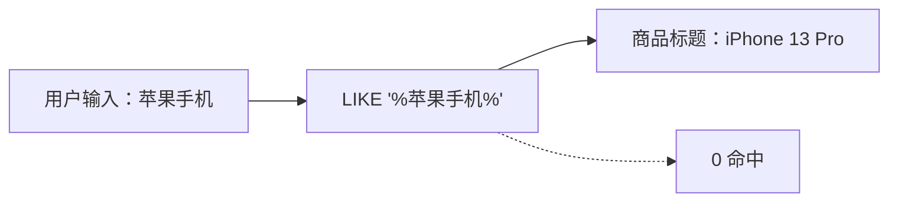
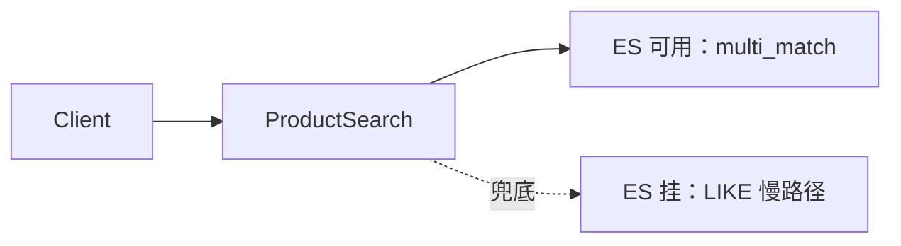
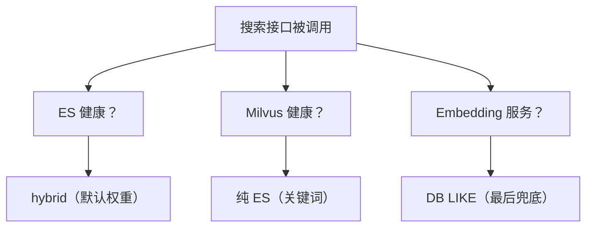
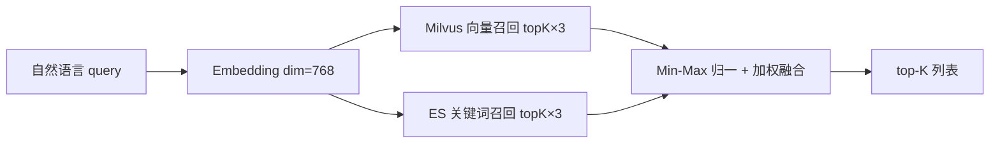
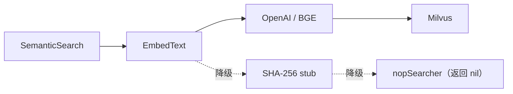
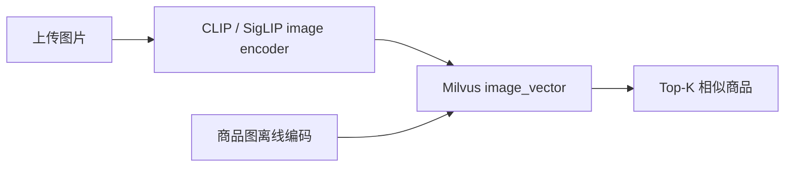

# 商品搜索：从业务漏斗倒推技术选型

> gomall · deck 03 · LIKE / ES / ES + Milvus 三档能力，撑住 gomall 最宽的一跳入口
>
> 这份讲义不讲"怎么搭一套 Elasticsearch 集群"，讲的是**搜索每一档能力对应哪个角色的钱**——搜不到漏走多少 GMV、商家上架多久能搜到、ES 挂了为什么不能 5xx、运营手里到底有几个能调的旋钮。技术选型是被业务漏斗倒逼出来的，不是图组件新潮。

## 目录

- [一、业务定位：搜索是漏斗最宽一跳](#一业务定位搜索是漏斗最宽一跳)
- [二、ES 升级：从词重合到相关性](#二es-升级从词重合到相关性)
- [三、5min 上架可搜 SLA：商家最关心的事](#三5min-上架可搜-sla商家最关心的事)
- [四、ES 挂了不能 5xx：降级与运营 SOP](#四es-挂了不能-5xx降级与运营-sop)
- [五、Hybrid 检索：商家不会写 SEO 的锅自己背](#五hybrid-检索商家不会写-seo-的锅自己背)
- [六、客服话术：三个真实客诉怎么答](#六客服话术三个真实客诉怎么答)
- [七、业务边界、容量与个性化路线图](#七业务边界容量与个性化路线图)
- [八、业务侧总结：四角色 KPI 全打通](#八业务侧总结四角色-kpi-全打通)
- [附录 A：面试 Q&A](#附录-a面试-qa)
- [附录 B：代码位置总览与配套材料](#附录-b代码位置总览与配套材料)

---

## 一、业务定位：搜索是漏斗最宽一跳

### 为什么搜索值得单独立项

用户进站后的**第一动作**不是浏览类目、不是看首页 Banner，而是直接点搜索框——大约 60% 的流量走这一跳，比其他任何入口都靠前。这意味着搜索不是一个普通"功能页"，它是**业务入口**。

入口出问题，体感是秒级流失的：**搜不到 = 没卖**（用户以为你没货）、**搜偏 = 货架乱**（想要的排在三页后）、**搜慢 = 应用卡**（列表转圈半秒直接退出）。三种坏体验，用户都不会给第二次机会。

而它同时绑着四五个角色的 KPI：商家上架后第一件关心的事就是"我的货搜得到吗"；运营手里的召回 / 排序 / 加权三个旋钮，任一动 1% CTR，对应当日 GMV 涨跌都是六位数；SRE 关心"ES 挂了主站会不会一起挂"。

> **搜索系统的对外契约同时绑定 4 个角色 KPI，不是普通功能页，而是业务入口。**

### 五角色对"搜索"四件事的关心

同一套搜索代码，五个角色关心的事完全不同。把它翻译成每个角色的诉求，才知道后面每一节在为谁工作：

| 角色 | 关心的事 | 在 gomall 的对应能力 |
|---|---|---|
| C 端用户 | 搜得到 / 搜得准 / 搜得快 | ES + Milvus hybrid / p95 < 200ms |
| 商家 | 我的货 5min 内搜得到吗 | outbox + indexer 5min SLA |
| 运营 | 今日特卖能不能强插第一屏 | function_score / 字段加权 / boost |
| 客服 | 用户说搜不到，给个交代 | 业务码 + 兜底 LIKE + 重建命令 |
| SRE | ES 挂了主站会不会一起挂 | 静默降级 + 三档降级树 |

这五件事并不矛盾：用户要"准"、商家要"快"、运营要"调"、客服要"答"、SRE 要"稳"。后面每一节都会标注**本节在解谁的痛**。

### 用户漏斗：每一跳的业务意义


每一跳都在流失，而搜索质量决定了后面所有跳的基数：

- **首页 → 搜索框（100% → 60%）**：用户主动表达意图，这是**高价值流量**，绝不能在入口糟蹋。
- **搜索框 → 列表（60% → 45%）**：一旦列表 0 命中 / 空页，这一跳直接断——用户不会翻第二次。
- **列表 → 详情（45% → 18%）**：排序差、缩略图差，用户翻三页就退出。
- **详情 → 下单（18% → 3%）**：搜索质量决定"用户看到的是不是他想要的"。

召回率是最上游的那个乘数，它掉一点，下游所有跳都按比例缩水。

### 搜不到 = GMV 静默漏走（定量算账）

假设日 UV 100 万、客单 200 元，当前漏斗系数 = 60% × 75% × 40% × 17% ≈ 3.06%。召回率变化直接乘穿整条漏斗：

| 召回率变化 | 漏斗系数 | 日 GMV 影响 |
|---|---:|---:|
| 基线 100% | 3.06% | 612 万 |
| 召回 -1pp → 99% | 3.03% | -6 万 / 日 |
| 召回 -5pp → 95% | 2.91% | **-30 万 / 日** |
| 召回 -10pp → 90% | 2.76% | **-60 万 / 日** |

召回率每损 1pp，杠杆效应明显。而 ES 不上中文分词、Milvus 不接长尾语义，召回率会直接掉进 60%–80% 区间——这不是几个点的事，是几十万一天。

> **hybrid 检索值得花成本，不是炫技，是止损。** 这笔账没有告警会自动跳出来，它是"静默"漏走的，这才是它最危险的地方。

### 业务对搜索的四条硬约定

前面的账算下来，业务对搜索提了四条硬约定，每一条背后都站着一个角色：

- **召回**（C 端）：用户搜得到的词，能跑出至少一条相关结果。
- **时延**（C 端）：p95 < 200ms，列表页才不会"卡半秒空白"。
- **新鲜度**（商家）：商家上架 → 站内可搜，SLA ≤ 5min。
- **兜底**（SRE / 客服）：ES 挂掉，搜索接口**不能 5xx**，必须有降级路径。

> **这四条决定了搜索系统不能只是 `SELECT * WHERE name LIKE '%kw%'`。**

### 用户搜"苹果手机"，DB 搜不到 iPhone 13

先看 LIKE 的第一个死穴——语义。用户脑里是中文，商家上架习惯写英文型号：



`LIKE` 只会做子串匹配，它不知道"苹果 == Apple == iPhone"。子串对不上就是 0 命中——这不是用户拼错了，是搜索系统欠用户一个"分词 + 同义"的能力。业务后果是每天数万次"明明有货却 0 结果"的搜索，全部计入前面说的**静默流失**。

### LIKE 的第二个问题：跑不动

第二个死穴是性能。`LIKE '%kw%'` 前缀是通配符，B+ 树索引用不上，必须扫全表：

| 指标 | 数值 |
|---|---|
| product 表行数 | 956K 行 |
| product 表磁盘大小 | 364 MB |
| `LIKE '%X%'` 能走索引？ | 否（前缀通配） |
| `/product/list` 全表 count 实测 | **24.5 RPS / p95 2.50s** |

96 万行、364 MB 数据，单查就吃满一颗 CPU。对照同一个库里 `/product/show` 走主键命中的 **62,226 RPS / p95 3ms**——差了 **2500 倍**。这证明慢的是**查询类型**（LIKE / count 全表扫），不是数据库本身。业务感知就是列表页转圈 2.5s，用户直接退出，转化率掉 15%–30%。

### LIKE 缺的三件事，全是业务能力

把 LIKE 缺的东西列出来看，会发现它缺的**全是业务旋钮**，不是技术细节：

| 能力 | LIKE 有？ | 业务后果 |
|---|---|---|
| 分词 | 无 | "苹果手机" 搜不到 "iPhone" |
| 字段加权 | 无 | 标题命中 vs 详情命中 等权排 |
| 高亮 | 无 | 列表里看不到为什么命中 |

分词决定召回，字段加权决定排序，高亮决定点击率。三件事任一缺失，"搜索"就退化成"碰运气包含"。**这才是 gomall 换 ES 的业务动机。**

---

## 二、ES 升级：从词重合到相关性

**本节解决谁的痛**：C 端要"准"，运营要"能调"。ES 把"碰运气包含"升级成"可解释的相关性"，并且第一次把调权旋钮交到运营手里。

### ES 替 LIKE 做什么（业务视角）


三件事一次到位：

- **分词**：召回不再"碰运气"——"苹果手机"里的"手机"二字命中 iPhone 13 的标题。
- **倒排索引**：单 query 毫秒级返回，p95 落进 200ms 业务 SLA。
- **打分 + 字段加权**：运营第一次拿到"调权"旋钮，改首屏不用发版上线。

### 字段加权背后的业务判断

一个商品有 name / title / info 三段文本，它们对"用户到底想要什么"的信号强度不同：

| 字段 | 业务含义 | 加权 |
|---|---|---|
| `name` | 商品主名（用户预期匹配） | ×3 |
| `title` | 商品标题（含型号 / 规格） | ×2 |
| `info` | 商品详情（长文，噪声多） | ×1 |

道理很直白：用户搜 "iPhone"，"标题就叫 iPhone 13"应当排在"info 里顺带提了一句 iPhone"前面。这个加权由**运营调，不是开发拍**——大促时可以临时把 `title` 上调到 ×4。反过来，如果不加权，标签店家把热词一股脑塞进 info 就能霸占第一屏，用户会骂"全是广告"。

### 代码段 1：ES 关键词检索（含 _score 输出）

```go
// repository/es/product_index.go
must := []map[string]any{{
    "multi_match": map[string]any{
        "query":  keyword,
        "fields": []string{"name^3", "title^2", "info"},
    },
}}
filter := []map[string]any{}
if categoryID != nil {
    filter = append(filter, map[string]any{
        "term": map[string]any{"category_id": *categoryID},
    })
}
q := map[string]any{
    "from": from, "size": size,
    "query": map[string]any{"bool": map[string]any{
        "must": must, "filter": filter,
    }},
}
```

### 代码段 1 逐行讲解（业务对照）

- **`multi_match` + `fields`**：同时查 name / title / info，靠 `^N` 给字段加权——这就是"今日特卖 title 加权"的代码落点。运营能改的就是这几个数字。
- **`filter` 走 `term`**：类目过滤**不参与打分**，只做 yes/no 过滤。业务上对应"用户在 3C 类目里搜，绝不让美妆混进来"。
- **`bool.must + filter` 是 ES 标准组合**：must 决定**相关性**，filter 决定**可见性**。两者分离，分页和打分互不干扰。
- **运营能改 / 不能改的边界**：`fields` 数组里的 `^N` 是运营旋钮，`filter` 数组是开发硬约束。这条边界必须写进运营手册，否则运营会以为什么都能调。

### must / should / filter / must_not 四件套（业务怎么用）

业务上的"必须 / 优先 / 限定 / 排除"四件事，正好对应 ES bool query 的四个子句：

| 子句 | 业务用途 | gomall 现状 |
|---|---|---|
| `must` | 关键词召回 / 相关性主链路 | 已用 |
| `should` | 同义词加分 / 品牌偏好 | 路线图 |
| `filter` | 类目 / 上架 / 库存 > 0 / 价格区间 | 类目已用 |
| `must_not` | 下架 / 违禁 / 自家店 / 黑名单店 | 路线图（商家入驻后） |

有两个工程细节值得记：把所有"硬条件"塞进 `filter`（而不是 must）是最常见的性能优化，因为 filter 不打分、可缓存，能让 QPS 翻倍；`must_not` 配上"自家店"是商家自助上架后的**合规要求**（防自买自卖刷单）。

### BM25 + function_score：把相关性与业务分挂在一起

ES 7.x 默认打分算法是 **BM25**：词频 `tf` 走饱和函数，词频再高也不无脑加分；长度归一让短 name 不被长 info 压制。运营如果报"排序偏向长描述",先查 `k1/b` 参数是不是被人动过。

关键的架构决策是**把业务分挂在相关性外面**：`function_score` 让最终分 = 相关性 × 销量 / 评分 / 时效，它挂在 BM25 外层，**不污染相关性调试**。这样召回、粗排、精排三段可以各自背 KPI——召回看漏召率、粗排看 NDCG@10、精排看 CTR / CVR。gomall 当前做到粗排为止。

> **运营调过的 boost 必须打到 dashboard，否则后人查"为什么排序变了"无从下手。**

---

## 三、5min 上架可搜 SLA：商家最关心的事

**本节解决谁的痛**：商家。商家点完"上架"立刻会去搜自己的货，搜不到就慌。

### 商家上架后第一句话：我的货搜得到吗

商家点"上架"按钮后马上会去 App 搜自己的商品，**搜不到就慌**。5min 是商家的容忍上限——这个数字对应他拍照、调价、改文案的反馈节奏；超过 5min，商家就会反复点上架键、给客服发消息。

那能不能"同步写 ES"让它立刻可搜？**不行**。ES 一抖动就会直接 fail 掉上架动作，商家会彻底失去信心。所以业务承诺换了个说法：**DB 写成功 = 上架成功；ES 索引慢一点没关系，5min 内追上**。上架成功与可搜，是被故意解耦的两件事。

### 5min SLA 的时间预算拆解

把这 5min 拆成流水线，每一环的时间预算和商家体验：

| 环节 | 时间预算 | 商家体验 |
|---|---:|---|
| 1) 商家点上架 → DB commit | 5–20 ms | 立返"上架成功" |
| 2) DB outbox 行 → Publisher 扫到 | ≤ 1 s | 无感 |
| 3) Publisher → RMQ 投递 | 10–500 ms | 无感 |
| 4) Indexer 消费 → ES `UpsertProduct` | 20–50 ms | 无感 |
| 5) ES `refresh_interval` 可见窗口 | ≤ 1 s | 搜索可见 |
| **合计 (p95)** | **~2 s** | 顺畅 |
| **合计 (p99, RMQ 堆积)** | **~30 s** | 仍达标 |
| **业务 SLA 红线** | **300 s** | 必须告警 |

正常情况下 2 秒就搜到了，5 分钟的红线留了 150 倍的余量给 RMQ 堆积等异常。

### 每步如果挂掉，商家看到什么 / 客服怎么答

客服话术必须分级，且每一级对应工程上一个明确的**故障定位点**：

| 挂的环节 | 商家体感 | 客服应答模板 |
|---|---|---|
| DB commit | 上架按钮转圈 / 报错 | "系统繁忙，请稍后重试" |
| outbox 不扫 | 上架成功但永远搜不到 | "后台同步中，5min 内可搜" |
| RMQ 不通 | 同上 | 同上 + 排查 RMQ 监控 |
| Indexer 慢 | 上架后 1–10min 才搜得到 | "已收到，5min 内同步完成" |
| ES 全挂 | 搜得到，但走 DB LIKE 慢路径 | "搜索系统抢修中，结果仍可用" |

关键在最后：**任何一步挂，上架本身都不挂**。这正是 outbox 解耦的业务价值——把"钱货相关的上架"和"锦上添花的可搜"物理分开。

### outbox → MQ → indexer 的链路


- 上架事务里只写 product + outbox，二者**同库同事务**，天然原子。
- Publisher 后台扫 outbox → 投递到 `product.changed` 路由。
- Indexer 消费后写 ES，Qos=32 控制并发，避免 ES 被写穿。

### 代码段 2：indexer 主循环

```go
// service/search/indexer.go
func StartProductIndexer(ctx context.Context) error {
    rabbitmq.BindDomainQueue(indexerQueue, "product.changed")
    ch, _ := rabbitmq.GlobalRabbitMQ.Channel()
    ch.Qos(32, 0, false)  // 在途上限 32 条
    msgs, _ := ch.Consume(indexerQueue, "", false, false, false, false, nil)
    go func() {
        for d := range msgs {
            var ev events.ProductChanged
            if json.Unmarshal(d.Body, &ev) != nil {
                d.Nack(false, false); continue  // 脏消息进死信
            }
            if handleProductChanged(ctx, ev) != nil {
                d.Nack(false, true);  continue  // 重投自愈
            }
            d.Ack(false)
        }
    }()
    return nil
}
```

### 代码段 2 逐行讲解（业务对照）

- **`BindDomainQueue`**：把 `product.changed` 路由绑到 `search.product.indexer` 队列。上架 / 改价 / 下架**共用一条路由**，业务上语义一致。
- **`Qos(32, 0, false)`**：这是给 ES 写入设的**流量阀**。大商家批量上架 1 万个 SKU 时不会冲垮 ES。
- **脏消息 → `Nack(false, false)`**：进死信队列，**不阻塞健康消息**。运营每天扫一次死信队列。
- **业务处理失败 → `Nack(false, true)`**：重投，对应"ES 短抖动 1s 自愈"。
- **成功才 `Ack`**：索引是**幂等**的（同 docID 覆盖），重复消费无害——这正是 at-least-once 语义能成立的前提。

### 代码段 3：product mapping（建索引时的 schema）

```json
"settings": { "number_of_shards": 1, "number_of_replicas": 0 },
"mappings": { "properties": {
  "name":        { "type": "text",    "analyzer": "standard" },
  "title":       { "type": "text",    "analyzer": "standard" },
  "info":        { "type": "text",    "analyzer": "standard" },
  "category_id": { "type": "long"    },
  "price":       { "type": "keyword" },
  "on_sale":     { "type": "boolean" },
  "created_at":  { "type": "date", "format": "epoch_second" }
}}
```

### 代码段 3 逐行讲解（业务对应）

- **shards=1 / replicas=0**：gomall 单节点部署。生产换多节点要把 replicas 拉到 1。
- **name/title/info 是 `text`**：参与分词 + 倒排——商家上架**写的文案直接决定能不能被搜到**。
- **price 是 `keyword`**：不分词，整串做 filter / exact match。价格不会被"分词"成"99" + "元"。
- **category_id / boss_id 是 `long`**：按类目 / 按店铺筛，硬过滤。
- **on_sale 是 `boolean`**：**下架商品要从结果里隐藏**——这个字段的索引同步状态，决定了"搜到下架商品"这类客诉是否出现，是 indexer 维护的重点（见[客诉案例 3](#六客服话术三个真实客诉怎么答)）。
- **analyzer=standard**：未装 IK 分词器时的 fallback，保证集群裸装也能跑通。

---

## 四、ES 挂了不能 5xx：降级与运营 SOP

**本节解决谁的痛**：SRE 和客服。核心一句话——ES 是优化项，不是依赖项。

### 业务约定：搜索接口不许 5xx，启动也不许阻塞



5xx 等于 **app 崩页**，比"结果不准"的业务损失大得多——LIKE 慢也能用，白屏就彻底没了。工程上有两个保障动作：`ProductSearch` 在 `es.EsClient == nil` 时自动走 DB LIKE 兜底；`tryInitES` 用 `defer recover()` 把启动 panic 压平成 warn，让 ES 故障不阻塞整个服务启动。

> **ES 是优化项，不是依赖项。**

### ES 全挂的运营 SOP（5 步）

ES 真挂了，不是工程一个人的事，是一套跨工程 / 运营 / 客服的 SOP：

1. **自动降级**：`es.EsClient == nil` → `ProductSearch` 走 `dao.SearchProduct`，对外仍然返回 200。
2. **监控告警**：`search_es_fallback_total` counter 跳变 → 触发 P1 告警。
3. **用户体感公告**：超过 30min 仍未恢复 → App 顶部 banner"搜索结果可能不全，工程师正在抢修"。
4. **客服话术统一**：内部 IM 推送应答模板，避免每个客服自行发挥。
5. **恢复后回填**：ES 起来后调 `admin/search/backfill` 把降级期间的上架 / 改价回灌索引。

> **降级期间用户体验确实差**（搜索很慢 + 中文同义搜不到），但**接口仍可用**，比"白屏 500"业务上好 10 倍。

### 三档降级决策树

不是只有"ES 挂 / 不挂"两态，而是 ES + Milvus + Embedding 三级依赖，逐级降级：



ES + Milvus 都健康 → hybrid；Milvus 挂 → 退回纯关键词；ES 也挂 → DB LIKE 兜底。对应客服话术分三档：A 档"正常"、B 档"结果可能略有偏差"、C 档"搜索结果可能不全"。用户永远拿得到结果，只是精度分级下降。

---

## 五、Hybrid 检索：商家不会写 SEO 的锅自己背

**本节解决谁的痛**：C 端长尾自然语言搜不到，以及商家不会写 SEO 标题。hybrid 用向量把这两个缺口一起补上。

### 纯 ES vs 纯向量：业务漏斗对照

| 策略 | 优点 | 业务漏斗损失 |
|---|---|---|
| 纯 LIKE | 0 依赖 | 召回 40–50%，损 GMV 50%+ |
| 纯 ES | 快 / 加权 / 字段灵活 | 中文同义召回 60–75%，长尾差 |
| 纯向量 | 语义召回好 | 短 query 不准、品牌型号搜偏 |
| **Hybrid** | 各取所长 | 召回 90%+，覆盖短 + 长 query |

业务上"搜不到"是**召回率问题**，"搜偏"是**排序问题**。纯关键字、纯向量各解决半个，hybrid 把两个一起解。gomall 默认 50:50，给短 query（品牌型号）和长 query（自然语言）都留余量。

### ES 关键词搞不定的三类 query

ES 衡量的是**词重合度**，不是**语义接近度**。这三类 query 恰好是词重合失效的地方：

| query 类型 | 例子 | ES 行为 |
|---|---|---|
| 自然语言 | 送女朋友的礼物 | 拆成"送 / 女朋友 / 礼物" → 命中乱 |
| 跨表达同义 | 苹果手机最新款 | 名义命中 iPhone 15 会漏 |
| 口语描述 | 适合健身的运动鞋 | 长尾词命中率趋近 0 |

麻烦在于，用户被短视频 / LLM 养成了自然语言搜的习惯，长尾流量比例在上升。长尾召回率掉到 60% 以下，整段 GMV 静默漏走，而且**没有告警**。

### Hybrid 的"商家友好"价值

hybrid 不只对用户好，它把商家从写 SEO 标题里解放了出来：

- **以前**：商家必须写"iPhone 13 苹果手机 5G 全网通 国行"这种堆词标题才能被搜到。
- **现在**：商家只写"iPhone 13 Pro 256G"，hybrid 用向量召回也能匹配"苹果手机最新款"。
- **商家体验**：少了约 30% 的文案运营成本，能专心做商品本身。
- **用户体验**：自然语言搜得到，不再需要"换个关键词再试"的耐心。

> **把"商家不会写 SEO"这个能力缺口，由搜索系统自己用 embedding 补上——这是 AI 检索对业务的核心贡献。**

### hybrid 三层：关键词 + 向量 + 业务调权



一句话概括分工：**向量管召回，关键词管精度，融合权重管业务偏好。** 两路各取 topK×3 是给融合留余量。

### 融合权重：业务调权的入口

融合权重是 hybrid 里运营唯一要调的旋钮，它决定"语义 : 关键词"的话语权：

| 权重 (sem : kw) | 行为 | 适合的 query |
|---|---|---|
| 80 : 20 | 偏语义 | "送女朋友的礼物" 自然语言 |
| 50 : 50 | 中庸 | gomall 默认 |
| 20 : 80 | 偏关键词 | "iPhone 13 256G" 品牌型号 |
| 0 : 100 | 退化为 ES | ES 全场景兜底 |

50/50 是无偏起点，留 A/B 空间。大促"今日特卖"要强插第一屏时**不改算法，在融合分外面加一个业务分**：

```
Score = wSem*sem + wKw*kw + promote(id)
```

这样不污染长期相关性，运营随时能把 `promote(id)` 下线。

### 代码段 4：min-max 归一 + 加权融合

```go
// service/search/semantic.go
semNorm := minMaxNormalize(vecScores(vecHits))
kwNorm  := minMaxNormalize(esScores(keywordHits))

fused := make(map[uint]*product.ProductSemanticHit)
for i, h := range vecHits {
    id := uint(h.ID)
    if id == 0 {
        continue
    }
    hit := getOrInit(fused, id)   // 首次出现则建空 hit
    hit.SemanticScore = semNorm[i]
}
for i, h := range keywordHits {
    hit := getOrInit(fused, h.Doc.ID)
    hit.KeywordScore = kwNorm[i]
}
for id, h := range fused {
    h.Score = weightSemantic*h.SemanticScore +
              weightKeyword *h.KeywordScore
}
```

### 代码段 4 逐行讲解（业务对照）

- **两路各自 min-max 归一到 [0,1]**：避免 BM25 的 0–100 量纲压死向量的 0–1 量纲——业务上对应"两边权重**真正平等**才能调"。
- **`getOrInit` 按 `product_id` 取并集**：**仅一路出现的 ID 也计入**（另一路补 0）。业务上对应"向量召回到、ES 没召回到的长尾商品也有机会出现"。（注意 `fused` 是空 map，必须经 `getOrInit` 拿到指针再写字段，直接 `fused[id].X = ...` 会 nil panic——这是代码里用 helper 而不是裸下标的原因。）
- **加权融合**：`weightSemantic / weightKeyword` 是常量 0.5 / 0.5，A/B 时换 hash 分桶决定——这是运营调权的工程出口。
- **为什么用 min-max 而不是全局标准化**：min-max 在小 batch（30–100 条）下稳定，单 query 内部即可计算，无需全局统计量——工程上易复制、易回滚。

### Embedding 与 Milvus 都做了可降级



语义链路的每一环都能独立降级：`EMBEDDING_API_URL` 未配置 → SHA-256 stub 兜底（上线节奏可以 OpenAI → BGE 省 token，dim=768 是硬约束）；Milvus 走 `MilvusSearcher` 接口，未注入时 nop 返回 nil，hybrid 自动退化为纯 ES。**Milvus 挂只丢语义，关键词召回不受影响**。

### HNSW 的三个核心参数（业务旋钮）

Milvus 向量索引用 HNSW，有三个参数值得 SRE 记住：

| 参数 | 含义 | gomall 当前值 |
|---|---|---|
| `M` | 节点最大邻居数 | 16 |
| `efConstruction` | 建图时候选池大小 | 200 |
| `efSearch` | 查询时候选池大小 | 64 |

- `M` 大 → 图更密集、召回更准，但内存涨，常见取 16–48。
- `efConstruction` 大 → 建图更慢但更优，回填速度敏感的场景可调低。
- `efSearch` 大 → 召回更准但延迟更高，它是**查询时**唯一可调的旋钮——SRE 故障时的**减压阀**。

### 代码段 5：HNSW 索引建立 + 查询参数

```go
// repository/milvus —— 建索引：M=16, efConstruction=200
idx, _ := entity.NewIndexHNSW(entity.L2, hnswM, hnswEfConstruction)
existing, _ := MilvusClient.DescribeIndex(ctx, ProductVectorCollection,
    productVectorVectorField)
if len(existing) == 0 {
    MilvusClient.CreateIndex(ctx, ProductVectorCollection,
        productVectorVectorField, idx, false)
}
MilvusClient.LoadCollection(ctx, ProductVectorCollection, false)

// 查询：efSearch=64
sp, _ := entity.NewIndexHNSWSearchParam(hnswEfSearch)
results, _ := MilvusClient.Search(ctx, ProductVectorCollection,
    []string{}, expr, []string{"id"},
    []entity.Vector{entity.FloatVector(queryVec)},
    "vector", entity.L2, topK, sp)
```

### 代码段 5 逐行讲解（业务对照）

- **`NewIndexHNSW(L2, M, efConstruction)`**：决定索引结构；L2 是欧氏距离，与 BGE / text-embedding-3 默认归一化向量兼容。
- **先 `DescribeIndex` 判断有没有索引，没有才建**：`EnsureProductVectorCollection` 幂等，重启不会重建——SRE 安心运维。
- **`LoadCollection`**：让 collection 进入内存。HNSW 索引是 in-memory 的，没 load 就不能查。
- **`NewIndexHNSWSearchParam(efSearch)`**：**查询时**调旋钮，不用重建索引就能调"召回精度 / 延迟"的权衡。
- **业务对应**：efSearch 是 SRE 故障时的**减压阀**——告警来了先把它调小（64 → 32），召回准确性损 1%–3%，换 P95 减半。

---

## 六、客服话术：三个真实客诉怎么答

前面几节的工程设计，最终都要落到客服能对用户说的一句话上。这里是三个真实客诉的排查 + 话术。

### 客诉案例 1：用户搜不到

**用户原话**："我搜'蓝牙耳机'一个都没有，你们是不是没货？"

排查分两条路，先花 30s 进 admin 后台搜同词，看它走的是 ES 还是 LIKE：

- **若 ES 全挂**：此时无业务码（HTTP 200），靠监控 `search_es_fallback_total` 判定。话术："您看到的是降级结果，搜索系统正在抢修，30 分钟内恢复，您可以按类目浏览。"
- **若 ES 正常但 0 命中**：检查类目过滤是否锁死、"蓝牙"是否被分词器分错。话术："您可以试试'无线耳机'或具体品牌名，系统会推荐更相关的商品。"

### 客诉案例 2：商家"我上架了为什么搜不到"

**商家原话**："我刚上架的 SKU 12345，搜不到，是不是上架失败？"

花 1min 沿着 outbox 链路查一遍，这条链的每个 status 对应一个明确结论：

- 查 `product` 表 SKU 12345 存在 → 上架**未失败**。
- 查 `outbox` 表对应 product_id 的 `product.changed` 行 status：
  - `pending` 且在 5min 内 → 正在同步，等就好。
  - `pending` 超过 5min → Publisher 卡住 / RMQ 不通。
  - `sent` 但 ES 无 → Indexer 报错或 ES 拒收。

话术："上架已成功，搜索索引同步中，预计 5 分钟内可搜。如超时请回复我们。" 兜底操作：调 `admin/search/backfill` 直接灌一次 ES。

### 客诉案例 3：用户搜到下架商品

**用户原话**："我搜到一个商品点进去显示已下架，是不是骗人？"

**根因**：商家下架 → DB `on_sale=false`，但 **outbox 事件未投递 / Indexer 漏消费** → ES 里 `on_sale=true` 仍在召回。

排查 1min：把 DB `on_sale` 与 ES doc 字段对比，不一致即定位。此处也无业务码（HTTP 200，命中后端再过滤）。话术："该商品已下架，搜索结果尚在更新，5 分钟内会消失。给您带来困扰，赠送 5 元无门槛券。" 兜底操作：手动 `DeleteProduct(ID)` 删除 ES 文档，事后补 backfill。

**长期方案**：搜索结果在返回 client 前**再过一遍 DB** 校验 on_sale——牺牲 5ms 延迟换 0 客诉。

---

## 七、业务边界、容量与个性化路线图

### 业务边界：本搜索不做什么（诚实清单）

把"不做的事"列清楚不是甩锅，是**划清当前能力边界**——后续每接一条都要走 PRD + A/B：

- **无同义词字典**：分词靠 standard analyzer，未装 IK 与同义词包——"苹果手机"靠向量召回兜，不靠词典。
- **无搜索历史**：用户搜过什么不存，无"最近搜索"。
- **无 trending 词**：首页搜索框无热词推荐，无"大家都在搜"。
- **无搜索建议（suggest）**：输入框不联想，无前缀补全。
- **无商家 SEO 自助调权重**：商家不能自己买"高权重位置"，所有商品按 BM25 + name^3 公平排。
- **无个性化排序**：用户画像 / 历史点击 / 协同信号的挂载点已留，但**特征工程链路未接**。
- **无以图搜图**：CLIP / SigLIP 尚在路线图阶段。

### 个性化排序路线图：三类特征 + 挂载点

个性化排序是留了挂载点、还没接链路的一块，将来三类特征各有来源：

| 特征类 | 例子 | 来源 |
|---|---|---|
| 用户画像 | 性别 / 年龄段 / 价格带偏好 | user profile 表 |
| 历史点击 | 7 天内点过的类目 / 品牌 | 点击日志 + 实时流 |
| 协同信号 | 同类用户买过什么 | 离线 i2i / u2i 矩阵 |

历史点击走"近因衰减" `exp(-(now-ts)/τ)`，τ 取 3–7 天。挂载点仍然是融合分外面：`h.Score += wPersonal * personalScore(uid, h.Product)`。Redis miss 时走默认 0（保中性），永远比"用户画像污染基线"安全。

### 容量规划：1M / 10M / 100M SKU

| 量级 | ES 节点 | Milvus 内存 | 索引重建时长 |
|---|---|---|---|
| 1M | 1 node (4C8G) | 4 GB (HNSW) | 30 min |
| 10M | 3 nodes (8C16G) | 32 GB (HNSW) | 4 h |
| 100M | 5+ nodes (16C32G) | 256 GB / 切 IVF_PQ | 24 h+ |

gomall 当前 **956K** SKU，落在 1M 档，单节点足够。10M 是分水岭：ES 必须分片 + 副本，HNSW 内存接近 32 GB 拐点。100M 要切 IVF_PQ 量化索引（用召回率换内存），同时考虑冷热分层。

### 以图搜图路线图 (CLIP / SigLIP)



CLIP / SigLIP 把图片和文本映射到同一向量空间，可做"图找图"+"文找图"。落地时另建 `image_vector` collection（dim=512/768），与文本 collection 解耦。商品图离线批量编码，写入走相同 outbox 路由，**复用现有 indexer 模式**。

---

## 八、业务侧总结：四角色 KPI 全打通

### 一张表把这套搜索系统讲完

| 能力 | 实现 | 代码位置 |
|---|---|---|
| 关键词召回 | ES `multi_match` | repository/es/product_index.go |
| 增量索引 | outbox → MQ → indexer | service/search/indexer.go |
| DB 兜底 | ES 客户端为 nil → LIKE | service/search/product_query.go:15 |
| 全量回填 | admin 触发的 Backfill | service/search/backfill.go |
| 语义召回 | Milvus + embedding | service/search/semantic.go |
| 模型切换 | env: `EMBEDDING_API_URL` | service/search/embedding.go |
| 启动静默 | defer recover | cmd/main.go:69–78 |

### 四方视角 + 压测数据复核

把四个角色的诉求逐个对回工程结论：

- **C 端**：hybrid 召回 90%+，自然语言搜得到，p95 < 200ms。
- **商家**：上架 5min 内可搜，outbox 解耦 = 上架本身永远不挂。
- **运营**：`name^3` 字段加权 / 融合权重 / function_score 三档旋钮齐备。
- **客服 / SRE**：ES / Milvus / Embedding 三档降级，主流程永不 5xx。

压测数据给这套判断兜了底：同库主键查询能跑 **62,226 RPS / p95 3ms**（product/show），证明慢的是**查询类型**（LIKE / count），不是数据库本身；对照 `/product/list` 全表 count 实测 **24.5 RPS / p95 2.50s**，印证"搜索搬到 ES"是必选项。

> **副本系统判据：副本旧一点点不要命，副本错乱才要命。** outbox 把"上架成功"和"可搜"解耦，是 5min SLA 的工程根据。

---

## 附录 A：面试 Q&A

**Q1：为什么不让上架 API 直接写 ES，而要 outbox？**
A：DB 与 ES 不同事务，同步写要么失败回滚（伤体验），要么不一致（伤召回）。outbox 把"DB 写成功"和"ES 写成功"两件事拆开，分别保证。

**Q2：ES 挂掉，搜索接口为什么不直接 5xx？**
A：搜索是入口，5xx 等于 app 崩页。LIKE 慢一点也比白屏强——业务承诺"搜索框永远可用"。

**Q3：hybrid 50/50 这个权重你怎么调？**
A：这是业务值，不是技术值。先 50/50 跑一轮，A/B 观察 CTR / 转化。短 query 偏关键词，长 query 偏语义。

**Q4：商家说"上架后 10 分钟还搜不到"，怎么定位？**
A：四步走——查 product 表确认入库 → 查 outbox 行 status → 查 RMQ 队列深度 → 查 ES doc。每步对应一个客服话术（见客诉案例 2）。

**Q5：min-max 归一在什么场景会失效？**
A：所有分数等值时 span=0。代码里此时返回常量 1，意味着"两路一样可信"，让另一路决定排序。

**Q6：HNSW 的 efSearch 你怎么调？**
A：efSearch 是查询时旋钮，不用重建索引。延迟告警时调小（64 → 32），召回率损 1%–3%，P95 减半。

**Q7：Milvus 挂了怎么办？为什么不直接 5xx？**
A：nopMilvusSearcher 返回空，hybrid 退化为纯 ES。关键词召回不受影响，只丢自然语言长尾。

**Q8：搜索结果命中下架商品（客诉案例 3）根因有几种？**
A：三种——DB 改 `on_sale` 但 outbox 漏写、outbox 写了但 indexer 没消费、indexer 调 DeleteProduct 但 ES 拒收。长期方案：返回前再过一次 DB 校验。

**Q9：5 分钟新鲜度 SLA 在哪一步可能掉？**
A：堆积一般出现在 RMQ 与 indexer 之间，Qos=32 + ES refresh_interval=1s 下 p95 < 30s。监控 `search.product.indexer` 的 queue_depth。

**Q10：100M SKU 时这个架构还能用吗？**
A：ES 切多分片 + 副本；HNSW 内存撑不住改 IVF_PQ 量化；冷热分层把老 SKU 放冷索引。

**Q11：为什么不接同义词字典 / 搜索历史 / trending？**
A：业务边界。当前流量没到拐点，同义词靠 hybrid 向量召回兜，搜索历史涉及用户隐私要单独立项，trending 词由运营手动维护轮播。

**Q12：mapping 改了字段类型怎么办？**
A：ES mapping 字段类型不能原地改，必须 `reindex` 或新建索引 + alias 切换。回填走 admin/search/backfill。

---

## 附录 B：代码位置总览与配套材料

| 主题 | 代码位置 |
|---|---|
| 搜索 / 语义入口 | service/search/service.go、semantic.go |
| ES 检索 + mapping | repository/es/product_index.go |
| outbox 事件 | 上架事务内写 outbox 行 |
| indexer 消费 | service/search/indexer.go |
| ES 兜底分支 | service/search/product_query.go:15 |
| 全量回填 | service/search/backfill.go |
| hybrid 融合 + embedding | service/search/semantic.go、embedding.go |
| Milvus HNSW | repository/milvus |
| Milvus 接口抽象 | service/search/milvus_stub.go |
| 启动静默 | cmd/main.go:69–78 |
| 业务码表 | pkg/e/code.go |

**配套材料**：deck 04 outbox / saga；deck 10 流量治理与降级；deck 11 一致性；stressTest/REPORT.md；docs/blog/10-milvus-vector-search.md；docs/blog/11-semantic-search.md。
