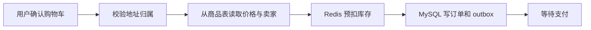
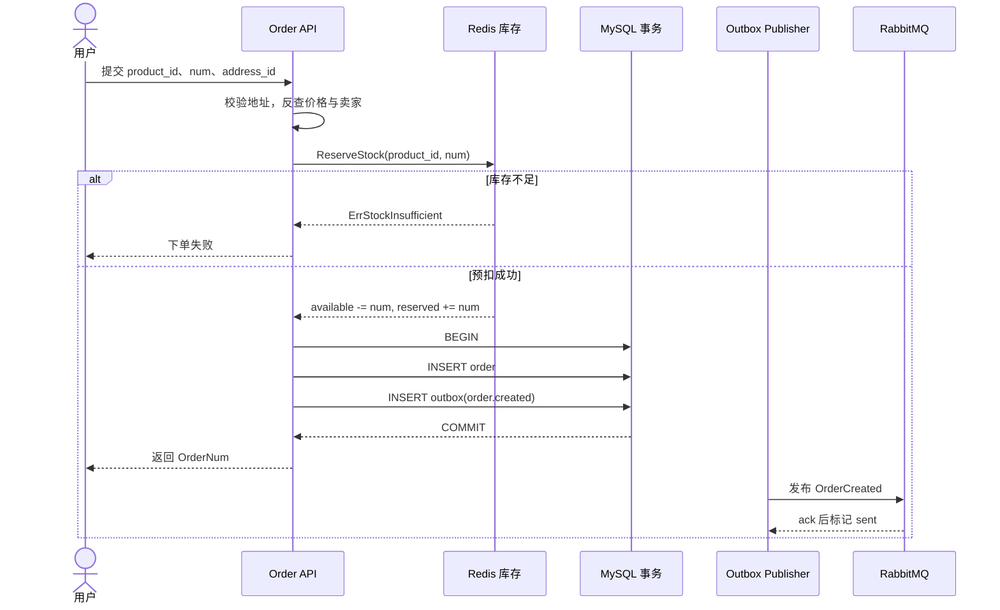

# 购物车到订单：一次点击背后的库存承诺

> 这一讲只跟一位用户走完一次下单：加购、选地址、预扣库存、写订单、记录事件。重点不是把接口背下来，而是解释系统怎样保证“不超卖、不丢单、不重复下单”。

## 本讲安排（60 分钟）

| 时间 | 内容 | 学生要带走的问题 |
|---|---|---|
| 0–6 分钟 | 一次普通下单出了什么难题 | 为什么不能直接 `INSERT order` |
| 6–14 分钟 | 购物车、地址与服务端定价 | 哪些客户端字段不能信 |
| 14–22 分钟 | 订单号与状态 | 订单号为什么不能只用自增主键 |
| 22–38 分钟 | 库存预扣、DB 事务与 outbox | Redis 和 MySQL 怎么协作 |
| 38–48 分钟 | 幂等与失败补偿 | 用户连点五次会发生什么 |
| 48–55 分钟 | 同步与异步下单 | 什么时候值得引入 ticket |
| 55–60 分钟 | 演示、回顾和提问 | 用不变量检查整条链 |

录制时按表推进。正文约 55 分钟，演示与提问留 5 分钟。

## 一、先看业务：用户只点了一次“提交订单”

假设小林购买两件商品。他看到的是一个按钮，系统却必须回答这些问题：

- 收货地址真的是小林的吗？
- 页面显示的价格有没有被改成 1 分钱？
- 两件库存能否先替他保留，又能在超时后还回去？
- 订单落库后，超时取消、风控等下游能否收到消息？
- 网络超时导致小林再点一次时，会不会多出第二笔订单？

这一讲用三个不变量约束答案：

1. 金额和卖家只认服务端商品表，客户端没有定价权。
2. 订单与 `OrderCreated` 事件同生共死。
3. 库存预占失败就不建单，建单失败必须尝试释放预占。

### 请求进入系统的位置

同步下单走 `POST /api/v1/orders/create`，路由挂了认证和幂等中间件。异步下单走 enqueue 接口，先返回 ticket，再由前端查询 ticket 状态。两条路最终都要得到一条权威订单。



## 二、下单前：购物车、地址与定价

购物车只是“购买意向”，不能作为结算凭证。用户可能在购物车停了三天，期间商品价格、库存和上下架状态都变了。因此下单时要重新读取权威数据。

### 购物车查询要分清三种结果

`GetCartById` 的返回不是简单的“有或没有”：

| 查询结果 | 处理 |
|---|---|
| 命中 | 在 `MaxNum` 内增加数量 |
| `gorm.ErrRecordNotFound` | 新建购物车行 |
| 连接失败、超时、死锁 | 返回系统错误，不能假装购物车为空 |

```go
cart, err = d.GetCartById(pId, uId, bId)
if errors.Is(err, gorm.ErrRecordNotFound) {
    cart = &Cart{UserID: uId, ProductID: pId,
        BossID: bId, Num: 1, MaxNum: 10}
    err = d.DB.Create(&cart).Error
    return cart, e.SUCCESS, err
}
if err != nil {
    return nil, e.ERROR, err
}
```

这段代码的教学点不是 `errors.Is` 的语法，而是错误语义：查不到可以创建，查失败必须停下来。

### 地址 ID 也是不可信输入

客户端传来的 `address_id` 可能属于另一个用户。`OrderCreate` 在任何库存动作之前调用 `EnsureOwned(req.AddressID, u.Id)`；校验失败要尽早返回，否则既泄露他人地址，又制造无效预占。

当前订单保存 `AddressID`。生产系统通常还会保存收货快照，否则用户修改地址簿后，历史订单的收货信息可能跟着变化。这是本项目值得继续补的一处边界，不要把“应该如此”讲成“代码已经如此”。

### 金额与收款方只从商品表读取

```go
unitCents, categoryID, bossID, err := resolveProductPricing(
    ctx, req.ProductID,
)
if err != nil {
    return nil, err
}
subtotalCents := unitCents * int64(req.Num)
```

`req.Money` 和 `req.BossID` 都不能进入计费链路。信任前者，买家可以一分钱下单；信任后者，买家甚至能指定货款打给谁。

## 三、订单号和订单状态

数据库主键解决表内关联，`OrderNum` 才是暴露给用户、客服和消息系统的业务编号。gomall 用雪花算法本地生成它：时间戳、机器号和同毫秒序号拼成一个趋势递增的 `int64`。

```go
func InitSnowflake(machineID int64) {
    snowflake.Epoch = time.Date(
        2024, 1, 1, 0, 0, 0, 0, time.UTC,
    ).UnixNano() / 1_000_000
    node, err = snowflake.NewNode(machineID)
    if err != nil {
        panic(err)
    }
}
```

这里真正要盯的是部署配置：多实例若使用同一个 `machineID`，同毫秒内可能生成重复编号。启动时失败比运行中偶发撞号更安全。

新订单的初始状态是 `OrderWaitPay`。下单不会直接改成已支付，也不会真正消耗商品库存；它先为用户保留一段付款窗口。

## 四、主链：预扣库存、写订单、写事件

### 为什么库存要分桶

把库存想成三只桶：

- `available`：仍可出售；
- `reserved`：已下单但未付款；
- `sold`：付款后确认售出。

下单把数量从 `available` 移到 `reserved`；支付成功再减少 `reserved` 并扣数据库商品库存；取消或超时则把预占还给 `available`。这样既给用户付款时间，又不会把同一件商品卖给两个人。

### 标准交互时序



### `OrderCreate` 的事务边界

```go
if err = cache.ReserveStock(ctx, req.ProductID, int64(req.Num)); err != nil {
    return nil, err
}

err = dao.NewDBClient(ctx).Transaction(func(tx *gorm.DB) error {
    if err := NewOrderDaoByDB(tx).CreateOrder(order); err != nil {
        return err
    }
    // 满减预算在这里扣；预算耗尽时降级为无折扣
    return outbox.NewOutboxDaoByDB(tx).Insert(
        "order", "OrderCreated", "order.created", order.ID,
        events.OrderCreated{OrderID: order.ID, OrderNum: order.OrderNum,
            UserID: u.Id, ProductID: req.ProductID, Num: int(req.Num)},
    )
})
if err != nil {
    _ = cache.ReleaseReservation(ctx, req.ProductID, int64(req.Num))
    return nil, err
}
```

Redis 不能参加这次 MySQL 本地事务，所以 reserve 放在事务外。DB 失败后，代码用 `ReleaseReservation` 做补偿；如果补偿也失败，只能依赖库存对账发现差额。这是最终一致，不是跨存储强事务。

订单与 outbox 必须在同一个 MySQL 事务里。否则会出现两种坏结果：订单存在但没有事件，下游永远不知道；或者事件已经发出，订单却没创建成功。

事务提交后，代码还会把订单加入 Redis 的超时集合，并尝试发布延迟取消消息。两步都不在建单事务内，发布失败只记日志，因此超时扫描与对账仍然有必要。

## 五、用户连点五次：幂等和补偿

幂等键来自请求头 `Idempotency-Key`，并与用户 ID 组合，避免不同用户互相命中。Lua 状态机的课堂版可以记成四种结果：

| 状态 | 中间件行为 |
|---|---|
| token 不存在或过期 | 拒绝请求 |
| 首次获得执行权 | 放行到 `OrderCreate` |
| 正在处理 | 返回“处理中”，不再执行 |
| 已完成 | 回放上一次 JSON，并加 `X-Idempotent-Replay: true` |

```go
switch state {
case 0:
    c.Abort() // token 不存在或已过期
case 2:
    c.Header("X-Idempotent-Replay", "true")
    c.Data(http.StatusOK, "application/json; charset=utf-8", []byte(cached))
    c.Abort()
case 3:
    c.Abort() // 同一个请求仍在执行
}
```

注意边界：幂等中间件缓存响应，不等于数据库自动幂等。若业务已落库而提交幂等结果连续失败，中间件会释放锁，让客户端重试；资金和订单表仍应有唯一约束或状态守卫兜底。

失败补偿按责任归类：

| 失败位置 | 当前动作 | 仍需什么兜底 |
|---|---|---|
| 预扣库存失败 | 不建订单 | 无 |
| DB 事务失败 | 尝试释放预占 | 库存对账 |
| outbox 发布失败 | publisher 重试 | 死信与告警 |
| 延迟取消发布失败 | 只记日志 | Redis 超时集合扫描 |

## 六、同步与异步下单怎么选

同步接口适合普通流量：用户等待数据库事务结束，马上拿到订单号。大促峰值时，可以先走 `OrderEnqueue`：

1. 校验地址并预扣库存；
2. 写一个 TTL 为 1 小时的 `pending` ticket；
3. 发布 `AsyncOrderTask`；
4. 立即返回 ticket，消费者建单后把状态改成 `ok` 或 `failed`。

任务消息不携带金额和卖家，消费者仍从商品表反查，安全边界没有因为异步化而降低。

```go
type AsyncOrderTask struct {
    Ticket    string `json:"ticket"`
    UserID    uint   `json:"user_id"`
    ProductID uint   `json:"product_id"`
    Num       uint   `json:"num"`
    AddressID uint   `json:"address_id"`
}
```

异步不是免费的：ticket 写成功而 MQ 发布失败时要释放库存，并把 ticket 标成 `failed`；消费端还要处理重复消息。没有削峰需要时，同步链更容易排障。

## 七、课堂演示与回顾（5 分钟）

只做一个演示：同一个 `Idempotency-Key` 连续提交两次下单请求。

观察三件事：第二次响应是否带 `X-Idempotent-Replay`，订单表是否只多一行，库存预占是否只变化一次。若环境不完整，就用断点跟踪 `Idempotency()`、`OrderCreate()` 和 `ReserveStock()`，不要临时讲完整压测。

## 八、收束：用不变量做代码评审

学生离开这一讲前，应能回答：

- 为什么 `address_id`、金额和卖家都要在服务端核验？
- 为什么 Redis reserve 在 MySQL 事务外，而 outbox 在事务内？
- 如果 DB 回滚后 Redis release 失败，系统靠什么发现？
- 幂等回放解决了哪一种重复，数据库还需要守什么底线？

一句话记忆：**先核验权威数据，再预留稀缺资源；订单与事件原子落库，跨存储失败靠补偿和对账收口。**

## 课后延伸

- 画出异步消费者重复消费同一个 ticket 时的状态机，并给出幂等点。
- 设计库存巡检：输入 `available`、`reserved` 和数据库已售数量，输出需要告警的差额。
- 阅读 `internal/order/cancel.go`，说明超时取消怎样与支付竞争。
- 思考订单地址快照该包含哪些字段，以及修改地址簿为何不能影响历史订单。

代码入口：`internal/order/service.go`、`internal/order/async.go`、`repository/cache/inventory.go`、`middleware/idempotency.go`。
