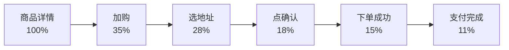
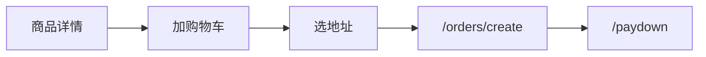
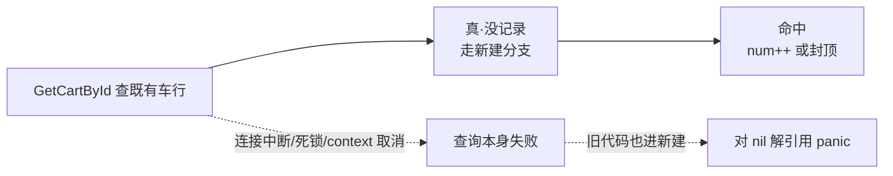
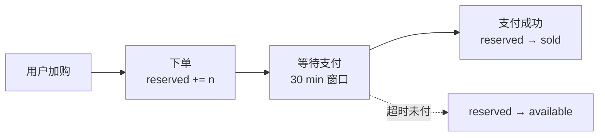
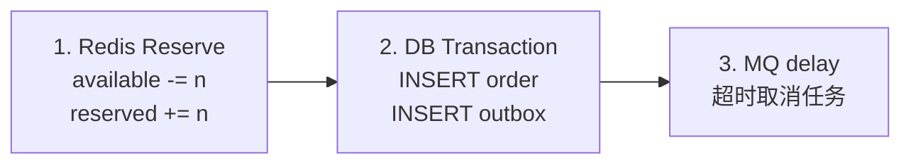
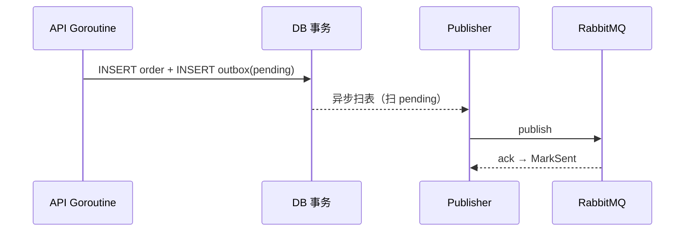
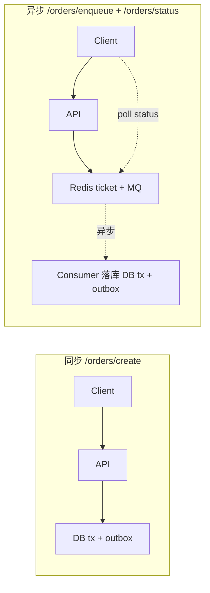
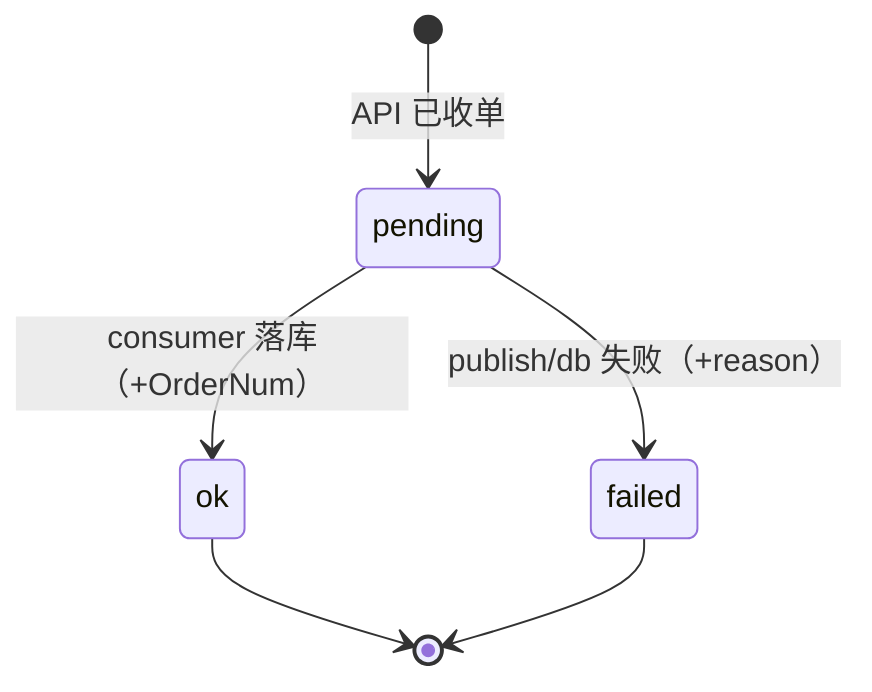
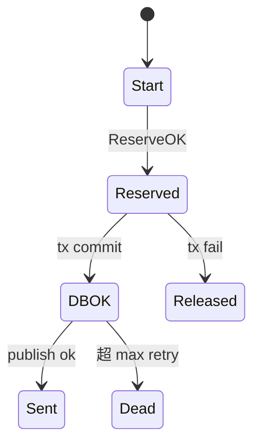

# 购物车 → 下单核心

> gomall · 加购 / 地址 / 雪花订单号 / 库存预扣 / DB+outbox 事务
>
> 下单是"钱即将出手"的瞬间——P0 中的 P0。这份讲义讲清楚：为什么 reserve 放在事务外、outbox 必须在事务内、雪花订单号本地生成，以及一句总纲——**下单是金融事件，要拆成可证不变量、对每个角色都有交代的链路**。

## 目录

- [一、业务定位：下单是"钱即将出手"的瞬间](#一业务定位下单是钱即将出手的瞬间)
- [二、加购 / 地址：业务比想象的复杂](#二加购--地址业务比想象的复杂)
- [三、雪花订单号：业务价值不在算法](#三雪花订单号业务价值不在算法)
- [四、库存预扣 vs 真扣：业务取舍](#四库存预扣-vs-真扣业务取舍)
- [五、下单是金融事件：三步必须原子](#五下单是金融事件三步必须原子)
- [六、幂等：755K 次请求 = 1 笔订单](#六幂等755k-次请求--1-笔订单)
- [七、同步下单 vs 异步下单](#七同步下单-vs-异步下单)
- [八、深挖：epoch / 回拨 / 黑产 / 漏单](#八深挖epoch--回拨--黑产--漏单)
- [附录：面试 Q&A](#附录面试-qa)

---

## 一、业务定位：下单是"钱即将出手"的瞬间

### 为什么"下单"是 P0 中的 P0

- **C 端用户**：钱包已经掏出来了——转圈 3 秒就放弃，错一步 = 直接流失。
- **商家**：订单是"我能不能发货"的唯一源头；订单丢 = 货发不出去 = 差评。
- **运营 / 平台**：下单瞬间 = GMV 计入瞬间，大促曲线的每一格都是订单。
- **客服**：超卖 / 订单丢失 / 库存数对不上 = 三大投诉来源，全部回到下单链路。
- **SRE / 法务**：P0 接口 **99.95%** SLO（年宕 < 4h22min），下单是这一行的命脉。

> **下单链路的每个判断——reserve 放哪、outbox 同事务、雪花本地生成——都是为了把这 5 个角色的诉求同时兜住。**

### 下单漏斗：每一步都在流失



| 流失点 | 业务原因 | gomall 兜底 |
|---|---|---|
| 加购→选地址 | 没地址 / 海外不支持 | 默认地址 + 地址簿 |
| 选地址→确认 | 价格变 / 优惠失效 | 后端重算 money（不信前端） |
| 确认→下单 | 库存被别人抢空 | Redis 双桶 + 50001 文案 |
| 下单→支付 | 转圈 > 3s | p99 < 500ms / 异步排队 |

### 下单不是一次点击，是一条业务链



用户视角一气呵成，后端是 **4 张表 + 2 个中间件 + 1 条 MQ**。这份 deck 盯 **加购 / 地址 / 下单** 三步；支付走 deck 05、Web3 走 deck 06。三个停留点对应客服三大投诉：购物车数量错 / 地址写错 / 订单号查不到。

### 业务边界：下单不做什么

诚实声明：MVP 阶段聚焦"普通用户买普通商品"的主干，避免业务范围漂移把核心链路稀释。

- **没有礼品订单**：礼品卡 / 代付链路 = 空（需要独立支付方 + 收货人解耦）。
- **没有团购拼单**：拼团状态机另外一条——gomall 现版只支持单买家（拼团见 deck 14）。
- **没有预售定金**：定金 + 尾款两阶段支付，gomall 只做单次结算（预售见 deck 15）。
- **没有发票管理**：增值税专票 / 普票 / 电子发票全部缺，B 端客户无法走。
- **没有海外清关**：地址表只留 `name/phone/address`，没有 `region_code / hs_code`。

---

## 二、加购 / 地址：业务比想象的复杂

### gomall 购物车的最小数据模型

| 字段 | 业务含义 | 出错后客服怎么说 |
|---|---|---|
| user_id | 谁的购物车 | "请用注册手机号重新登录" |
| boss_id | 哪个商家 | "该商家关店中，已为您保留商品" |
| product_id | 哪个 SKU | "商品已下架，建议换购同款" |
| num | 件数 | "已超过单次购买上限 N 件" |

- `ErrorProductMoreCart=20008`：重复加购同款 → 明确业务码，客服一查就知。
- 这是为什么 `CartCreate` 先 `GetProductById` 再 `CreateCart`——校验商品仍在售。
- 购物车不是技术装饰，是**凑单 / 比价 / 留存**的中转 = 商家拉复购的关键页。

### 加购健壮性：DB 抖动不该被当成"购物车为空"

加购是全站最高频的写入口之一，背后第一步永远是 `GetCartById`——查"这个用户这个商家这件商品有没有已在车里"。这里藏着一个经典陷阱：



- 旧逻辑只看 `err != nil` 就当"没找到" → 真实 DB 错误时 `cart` 仍是 nil。
- 紧接着读 `cart.Num` → **nil 解引用 panic** → 高频入口直接 500 雪崩。
- 关键认知：`err==nil`（命中）与 `errors.Is(err, ErrRecordNotFound)`（确为空）是**两种不同语义**，二者之外还有"查询本身失败"的第三态，绝不能并入前两者。

### 修法：errors.Is 精确判定，真实错误短路返回

```go
// internal/cart/repo.go
func (d *CartDao) CreateCart(pId, uId, bId uint) (
    cart *Cart, status int, err error) {
    cart, err = d.GetCartById(pId, uId, bId)
    // 仅"确为空"才新建：用 errors.Is 兼容被包装的 not-found
    if errors.Is(err, gorm.ErrRecordNotFound) {
        cart = &Cart{UserID: uId, ProductID: pId,
            BossID: bId, Num: 1, MaxNum: 10, Check: false}
        err = d.DB.Create(&cart).Error
        if err != nil {
            return
        }
        return cart, e.SUCCESS, err
    }
    // 第三态：非 not-found 的真实 DB 错误，cart 仍为 nil，
    // 必须在读取字段前短路返回，杜绝 nil 解引用 panic
    if err != nil {
        return nil, e.ERROR, err
    }
    if cart.Num < cart.MaxNum { // 命中：在封顶内加一件
        cart.Num++
        err = d.DB.Save(&cart).Error
        // ...
    }
    return cart, e.ErrorProductMoreCart, err
}
```

三态分流为什么缺一不可：

- **`errors.Is(ErrRecordNotFound)`**：只认"语义上的空"。直接 `==` 比较会漏掉被 gorm / 中间层 `fmt.Errorf("%w")` 包装过的同种错误，`errors.Is` 顺着 wrap 链找，才是正解。
- **`if err != nil` 短路**：连接中断、死锁、`context` 取消都落这一支。此刻 `cart` 未被 `First` 填充仍为 nil，返回 `e.ERROR` 让上层"系统繁忙，请重试"，而不是骗用户"购物车是空的"。
- **命中分支**：走到这里 `err==nil` 且 `cart` 非空，才敢安全读 `cart.Num` 做封顶判断。

> **"查不到"和"查出错"是两件事——把它们分开，是高频写入口在依赖抖动下不被一颗 nil 指针带崩的底线。**

### 地址簿：档案 vs 快照

- **多地址**：家 / 公司 / 父母家，下单时由用户选——选错 = 货到错地址投诉。
- **默认地址**：新用户首次填的，结算页默认选中——减少 3 秒决策时间 = 转化提升。
- **海外地址**：邮编可缺、行政区划不是省/市/区三级——gomall 未支持（业务边界）。
- **脏数据**：电话 11 位 vs 区号 + 座机——校验放服务端权威，前端只做提示。

业务设计原则：`Address` 地址簿保留 `name / phone / address` 三字段做**可编辑的收货档案**；而收货语义在**下单瞬间冻结成快照**——历史订单认的是下单那一刻的地址值，用户后续改地址簿不回灌历史订单。这正是"地址簿是档案、订单是快照"两层分工要守住的边界。

---

## 三、雪花订单号：业务价值不在算法

### 为什么订单不用 DB 自增 ID

| 方案 | 业务问题 | 性能问题 |
|---|---|---|
| DB AUTO_INCREMENT | 暴露当日单量、可枚举 | 单点瓶颈 / 跨库不连续 |
| UUID v4 | 完全随机、无序 | 索引页频繁分裂 |
| **雪花算法** | 时间戳前缀，趋势递增 | 本地生成、零网络 |

业务三连问：

- 竞争对手凌晨爬一遍订单号 `id+1` → 算出我们当日单量 → 友商情报泄露。
- 订单号要塞进**短信 / 客服系统 / 退款单**，太长用户读不出来（雪花 19 位刚好）。
- 索引页要顺序写，UUID 把 B+ 树搅得到处分裂 = 写放大 + 内存抖动。

### 雪花订单号的业务价值

不只是"分布式 ID 算法"，每一段位都对应一个角色的诉求：

| 位段 | 技术含义 | 业务价值 |
|---|---|---|
| 41 bit 时间戳 | ms since 2024-01-01 | **客服**：订单号前 6 位 = 大致下单日期 |
| 10 bit 机器位 | 1024 个进程 ID | **SRE**：定位哪台机器写的、追日志 |
| 12 bit 序列号 | 单 ms 内 4096 个 | **运营**：按时间段聚合 GMV 直接拿 |
| 整体趋势递增 | B+ 树顺序插入 | **DBA**：按订单号范围分库分表 |

客服日常话术："您报一下订单号" → 看前几位毫秒戳 → 反算下单时刻 → 立刻匹配那一刻的库存 / 限流 / 网络日志 → 30s 内定位问题。对账场景：商家按"昨天的订单号区间"拉一遍 → 不用 `SELECT ... WHERE created_at`，直接 `order_num BETWEEN`，索引走得飞快。

### 雪花 64-bit 结构

```
| 1 bit |    41 bit    | 10 bit  | 12 bit  |
|  sign |  timestamp   | machine | sequence|
        | ms since epoch |       |         |
```

- **41 bit 时间戳**：从 2024-01-01 起，可用约 69 年（到 2094 年）。
- **10 bit 机器位**：最多 1024 个进程，gomall 单实例够用。
- **12 bit 序列号**：单进程单毫秒最多 4096 个 ID = 单机峰值 4M/s ID 上限。

### InitSnowflake：epoch 与机器位

```go
// pkg/utils/snowflake/snowflake.go
func InitSnowflake(machineID int64) {
    snowflake.Epoch = time.Date(
        2024, 1, 1, 0, 0, 0, 0, time.UTC,
    ).UnixNano() / 1000000
    var err error
    node, err = snowflake.NewNode(machineID)
    if err != nil {
        panic(err)
    }
}

func GenSnowflakeID() int64 {
    return node.Generate().Int64()
}
```

为什么这 12 行很要紧：

- **`Epoch=2024-01-01`**：把基准从 1970 平移到 2024，41 bit 时间空间从"剩 16 年"变"剩 69 年"。
- **`machineID`**：部署时由配置注入，多副本必须各不相同；冲突 = 双发出现**重复订单号** = 财务对账炸。
- **`NewNode 失败 panic`**：启动期就挂掉，比运行期偶发生成失败更安全——订单号是金融语义，不能"先跑起来再说"。
- **`Generate().Int64()`**：一次返回 int64，方便存 `order.order_num bigint unsigned`。

> **雪花是本地无锁的——OrderCreate 调用它零网络成本，这是实测 50,319 RPS / p95 2.33ms 的硬前提。**

---

## 四、库存预扣 vs 真扣：业务取舍

### 30 分钟未付窗口：商家 vs 用户的拉扯



| 对商家不利 | 对用户有利 |
|---|---|
| 30 min 内库存被锁、不能转卖 | 下单时看到"还有 5 件"就一定还有 |
| 峰值压货 = 现金流压力 | 不会"下完单告诉你没货了" |
| 恶意占库（薅羊毛挂单） | 信任感建立 |

> **业务取舍：用 30 min "短期锁仓"换"下单不超卖"的承诺——客户体验 > 商家短期周转。**

### 为什么不"下单即真扣"

- **方案 A：下单立即扣 sold**——用户取消 / 未支付 = 库存白损失，得回滚 sold 表 = 状态机更复杂。
- **方案 B：支付时才扣（不预扣）**——用户 A 拍下 → 用户 B 同时拍下 → 两人都付钱 → 超卖。
- **方案 C：gomall 选 = reserve 预扣 + commit 真扣两阶段**：
  - 下单：`available -= n; reserved += n`——锁住但未消耗；
  - 支付：`reserved -= n`——真正售出；
  - 取消 / 超时：`reserved -= n; available += n`——完整退回。

**业务不变量**：`available + reserved + sold ≡ 初始水位`，任何一刻巡检脚本读三个桶相加 = 商品总库存 → 不平就告警。

---

## 五、下单是金融事件：三步必须原子

### OrderCreate 拆成三段



- **第 1 步**：Redis Lua 原子 reserve，失败 = `ErrStockInsufficient` 直接拒，不进 DB。
- **第 2 步**：同一 `gorm.Transaction` 写订单 + 写 outbox，二选一不行。
- **第 3 步**：投递延迟队列，超时未付款自动取消 → reserved 退回 available。

### OrderCreate 主体三步

```go
// internal/order/service.go
order := &Order{
    UserID:    u.Id,
    ProductID: req.ProductID,
    Num:       int(req.Num),
    OrderNum:  uint64(snowflake.GenSnowflakeID()),
    // 满减落点 PromoRuleID / PromoDiscountCents / FinalCents 略
}

// 1) Redis 预扣库存（事务外）
if err = cache.ReserveStock(ctx, req.ProductID, int64(req.Num)); err != nil {
    return nil, err
}

// 2) 同事务写订单 + 应用满减 + 写 outbox
err = dao.NewDBClient(ctx).Transaction(func(tx *gorm.DB) error {
    if e := NewOrderDaoByDB(tx).CreateOrder(order); e != nil {
        return e
    }
    // s.promo.ApplyDiscountInTx(...) 预算耗尽降级为无折扣，略
    return outbox.NewOutboxDaoByDB(tx).Insert(
        "order", "OrderCreated", "order.created", order.ID,
        events.OrderCreated{OrderID: order.ID, OrderNum: order.OrderNum,
            UserID: u.Id, ProductID: req.ProductID, Num: int(req.Num)})
})
if err != nil {
    // 3) 事务失败：把刚扣的预占库存放回
    _ = cache.ReleaseReservation(ctx, req.ProductID, int64(req.Num))
}
```

### 为什么 reserve 在 tx 外

- **Redis 不能加入 MySQL 事务**：跨存储两阶段提交业内基本不做，复杂度收益不划算。
- **reserve 失败必须早退**：库存不足 = 业务上 100% 不可能成功，不该让 DB 也写一条又回滚。
- **tx 失败要补偿 release**：reserve 成功但 DB 失败 → 必须把扣的库存放回 available，否则**虚假占用**让其他用户也下不了单。
- **补偿不是事务的一部分**：即便 `ReleaseReservation` 也失败，DB 已 rollback，库存差额由对账兜底（`GetStockSnapshot` 巡检）。

### 为什么 outbox 必须在 tx 内

写订单 + 发 MQ 如果**拆成两步**：

- 写订单成功、发 MQ 前进程挂了 → **下游永远收不到 OrderCreated** → 不发货 → 客诉。
- 反过来，先发 MQ 再写 DB，DB 失败 → **幻影订单事件** → 发了不存在的货 → 商家亏。

**outbox 表充当桥梁**：写订单和写 outbox 用同一 `INSERT` 事务，要么都成功要么都没有。**异步 publisher** 扫 `status=pending` 的 outbox 行，发 MQ，发完更新成 `sent`。这是 deck 11（Outbox 与一致性）在下单链路的落地。

### outbox 事件投递时序



**业务侧好处**：API 返回时只承担一次 DB 写代价，用户感知延迟 < 5ms；MQ 发布失败由 publisher 重试，**不阻塞下单链路** = 不会因为 RMQ 抖一下整个下单挂掉。

---

## 六、幂等：755K 次请求 = 1 笔订单

### 重复下单：用户狂点的真实场景

- **网络抖一下**：用户点"提交" → 转圈 → 没反应 → 再点 → 连点 5 下。
- **双 11 客户端重试风暴**：APP 看到请求超时自动重试 3 次，1 次点击 = 4 次请求。
- **支付页双开**：用户在两个 tab 同时下单同一商品。
- **脚本党**：写脚本批量重试薅活动——同一 token 打满请求。

没有幂等会发生什么：用户被**重复扣款** → 客服爆单 → 退款 → 信任崩塌；库存被多次扣减 → 真实库存 = 5 但 reserved = 25 → 后来者全被拒；商家看到 5 笔重复订单 → 不知道发不发货。

### 业务码：客服一看就懂

| 状态码 | 含义 | 客服话术 |
|---|---|---|
| 50001 * | 库存不足/上传异常 | "该商品已抢空，建议选购同款" |
| 60002 | 幂等处理中 | "您的订单正在处理，请勿重复提交" |
| 20001 | 商家鉴权失败 | "该店铺暂未营业" |
| 70001 | 限流 | "当前访问拥挤，请稍后重试" |
| 70002 | 熔断 | "下游服务异常，已为您保留请求" |
| 20008 | 购物车重复加购 | "购物车已有该商品，已为您加件" |

*注：50001 是 `ErrorOss`（对象存储）；库存不足在代码里是 `cache.ErrStockInsufficient` 错误，业务码统一映射在 `pkg/e/code.go`。**客户端硬约束**：HTTP 全是 200，必须按 `status` 字段分支，不能只看 HTTP code。

### Idempotency 中间件：状态机三态

```go
// middleware/idempotency.go
switch state {
case 0: // token 不存在
    c.JSON(http.StatusOK, gin.H{
        "status": e.ErrIdempotencyTokenInvalid, // 60001
    })
    c.Abort()
    return
case 2: // 已完成，回放上次响应体
    c.Header("X-Idempotent-Replay", "true")
    c.Data(http.StatusOK, "application/json; charset=utf-8",
        []byte(cached))
    c.Abort()
    return
case 3: // 处理中，让客户端等
    c.JSON(http.StatusOK, gin.H{
        "status": e.ErrIdempotencyInProgress, // 60002
    })
    c.Abort()
    return
}
// state == 1 抢到锁，c.Next() 真正执行业务
```

三态对应三种客户体验：

- **`state=0`**：token 过期 / 没传 → 让客户端**重新生成 key 再来**——防止陈年 token 重放攻击。
- **`state=2`**：已经成功过了 → **回放上次的 JSON**——用户看到的还是那笔订单号、同样的 money，体验上"我就下了一次"。
- **`state=3`**：还在处理中 → 返回 60002，前端**灰掉按钮** + 500ms 后重试——阻断"看似没反应就狂点"。
- **`state=1`**：抢到锁，真正下单 → `responseRecorder` 拷贝响应体 → 写回 done 态 → 下次重放就走 case 2。

### 压测锚点：755K 次 = 1 笔订单

| 场景 | 实测 | 备注 |
|---|---:|---|
| 幂等下单 `/orders/create` RPS | **50,319** | 50 VU × 15s |
| 幂等下单 p95 | 2.33 ms | |
| 幂等下单 max | 73 ms | |
| 累计请求数 | 755,033 | 同一 Idempotency-Key |
| 实际写入 DB 的订单数 | **1** | 唯一一行 |

**业务意义**：同一 `Idempotency-Key` 重放 **75 万次**，DB 只多 1 行。"重复下单防护"成本接近 0——60002 直接读 Redis done 态。order 表 6M 行 / 653 MB 不影响延迟——不查表就不付代价。

---

## 七、同步下单 vs 异步下单

### 两条下单路并存的业务理由

| 路径 | 业务场景 | 用户体验 |
|---|---|---|
| `/orders/create` | 普通商品 / 流量平稳 | 一次请求拿到订单号 |
| `/orders/enqueue` | 秒杀 / 大促瞬时洪峰 | 拿 ticket，轮询 status |

- **同步**：用户等响应的同时 DB 在写；DB 抖动 → 全部超时 → 转圈 → 流失。
- **异步**：MQ 顶住瞬时压力，consumer 平滑落库；代价 = 用户多一次轮询。
- **业务承诺**：P0 接口（下单 / 支付）**不挂限流**，靠异步削峰扛峰值。

### 同步 vs 异步：链路对比



### OrderEnqueue 核心

```go
// internal/order/async.go
func (s *OrderSrv) OrderEnqueue(ctx context.Context,
    req *OrderCreateReq) (resp interface{}, err error) {

    if err = cache.ReserveStock(ctx,
        req.ProductID, int64(req.Num)); err != nil {
        return nil, err // 库存不足直接拒
    }

    ticket := fmt.Sprintf("%d", snowflake.GenSnowflakeID())

    // 把 pending 状态写进 Redis，TTL 1h
    _ = defaultTicketStore.Put(ctx, ticket,
        OrderTicketStatus{Status: OrderTicketStatusPending},
        OrderTicketTTL)

    body, _ := json.Marshal(AsyncOrderTask{Ticket: ticket /* ... */})
    return OrderEnqueueResp{Ticket: ticket,
        Status: OrderTicketStatusPending},
        defaultAsyncProducer.Publish(ctx, body)
}
```

ticket 与 TTL 的业务取舍：

- **ticket 用雪花生成**：和订单号同源，全局唯一、客户端无法伪造（防黑产构造假 ticket 查别人订单）。
- **TTL = 1h**：覆盖最长支付窗口 + 客服查单 + 一次客户端崩溃——业务上"1 小时内一定有结论"。
- **ticket ≠ 订单号**：consumer 落库后回写 `OrderTicketStatus.OrderNum`，前端读 status 时一并拿到。
- **失败也写 ticket**：投递失败回写 `status=failed, reason=publish failed`，**前端不用纠结超时还是真失败**——一定能给用户一个明确答复。

### ticket 状态机



- **pending**：API 已收单，consumer 未落库——前端转圈但带文案"高峰排队中"。
- **ok**：DB 行已写，可走支付——前端跳转支付页。
- **failed**：MQ 发布失败 / consumer 自检不通过——前端弹"系统繁忙，请稍后重试"。

### 对账：reserve / commit / release 不变量

- 库存 Redis 双桶：`available + reserved + sold ≡ 初始水位`。
- DB 订单 + outbox 同事务：两条记录要么都在要么都没有。
- ticket + DB 行：`OrderTicketStatus.Status=ok` ⟺ `orders.order_num` 存在。

任何一个不变量被破坏，巡检脚本应当告警：Redis 双桶不平 → 库存对账脚本（客服报"我有 5 件但显示售罄"时第一时间查）；订单与 outbox 数量不一致 → SQL JOIN 抽查（商家报"看不到这单"时查）；ticket=ok 但订单不存在 → consumer 写回路径异常（用户报"拍下了但订单页空"时查）。

---

## 八、深挖：epoch / 回拨 / 黑产 / 漏单

### 为什么 epoch 选 2024-01-01 而不是 1970

- 标准 unix 时间戳 `1970-01-01` 到 2024 已经过去约 54 年 ≈ 1.7×10¹² ms。
- 41 bit 时间戳上限 ≈ 2.2×10¹² ms ≈ 69.7 年。
- 如果 epoch 用 1970：**剩余可用约 16 年**，2040 年雪花溢出 = 系统大故障。
- 如果 epoch 用 2024：**剩余可用约 69 年**，到 2094 年都不用动 = 业务寿命覆盖。

```
1970 ───── 2024 ═══════════════════ 2094
           └─ 2024-epoch 可用 69 年 ─┘
```

### 时钟回拨：业内三种处理方式

- **阻塞等待**：检测到 `now < lastTimestamp` 时，sleep 到追上为止（gomall 用的库默认行为）。
- **扩展位补偿**：保留几个 bit 做"回拨计数器"，发生回拨时 +1，时间戳继续走（Twitter 原版）。
- **停机告警**：差距 > 阈值（如 5s）直接拒绝 ID 生成，让 SRE 介入（金融级）。

gomall 走第一种——`NewNode 失败 panic` 保证启动健康，运行期由库阻塞。配合 NTP `slew` 模式（chronyd 默认）让时钟**平滑追赶**而不是跳变。监控锚点：`GenSnowflakeID p99`——突然变大就是回拨告警的前哨。

### Redis / DB / outbox 三处失败的责任分摊

| 失败点 | 表现 | 客服怎么解释 |
|---|---|---|
| Redis reserve 失败 | 库存不足拒单 | "该商品已售罄" |
| DB INSERT order 失败 | gorm 报错 | "系统繁忙，请重试" + 自动 release |
| DB INSERT outbox 失败 | 整 tx rollback | 同上 |
| publisher 发 MQ 失败 | outbox 留 pending | 用户看到订单，发货稍延后 |
| publisher 重试超限 | outbox 标 dead | 客服联系商家手动补发货 |

**业务关键**：每一种失败都有**明确的归属者和兜底话术**，没有"既不属于 A 也不属于 B"的灰区——客服永远能给用户一个明确答复。

### 失败回滚状态机



- **Released**：库存退回，订单不存在——客户端可重试。
- **Dead**：订单存在但下游没收到——用户能看到订单详情，发货 / 通知断 = 人工接管。

### 下单链路上的常见黑产手法

- **批量注册 + 单笔下单**：每个新号薅一次"新人券"，凑齐 100 单合并出货。
- **改 IP + 同设备**：脚本 + 代理池绕过单 IP 限流，但浏览器指纹一致。
- **地址聚合**：100 笔订单收件地址都是同一城中村 / 货代仓库。
- **支付聚合**：100 笔订单背后只有 2–3 张银行卡 / 同一个支付宝。
- **时间聚合**：凌晨 3:00–5:00 集中下单，避开运营值班。

下单服务能给的钩子：把 `ip / device_id / address_id / pay_account` 作为事件字段写到 outbox，异步推风控系统打分。下单链路本身**不做拦截判断**，否则尾延迟会被风控规则拖垮 = 违反 p99 < 500ms 业务承诺。

---

## 业务承诺与回顾

### 下单链路的 SLO 业务承诺

| 指标 | 业务承诺 | 实测对照 |
|---|---|---|
| `/orders/create` p99 | < 500 ms | p95 2.33 ms ✓ |
| 可用率 | 99.95%（年宕 < 4h22min） | 单机本地实测 0% 错 |
| 峰值吞吐 | 至少 50K RPS | 50,319 RPS ✓ |
| 基线对比（/ping） | —— | 64,254 RPS / p95 3.51ms |
| 全链路 (/orders/list) | —— | 58,406 RPS / p95 5ms |
| 重复请求 = 1 笔订单 | 强幂等 | 755K 次 = 1 笔 ✓ |

> **留 5–10× 余量给 GC / 网络抖动；P0 接口不挂限流，靠异步削峰扛峰值。**

### 把这条链拼回业务侧的一句话

- **购物车** = 凑单 / 比价 / 留存的中转，不是技术装饰。
- **地址** = 收货语义的快照，下单瞬间必须冻结。
- **雪花订单号** = 业务（防枚举 / 客服查单 / 商家对账）+ 性能（顺序写）的合谋。
- **库存预扣** = 用 30 min 短期锁仓换"下单不超卖"的承诺——用户体验 > 商家短期周转。
- **OrderCreate 三步**：reserve 在事务外、outbox 在事务内、补偿在事务后。
- **幂等** = 755K 次请求 = 1 笔订单，重复防护成本约 0。
- **同步 / 异步两条路**：分别面对"平稳流量"和"瞬时洪峰"。

> **下单是金融事件——gomall 用"Redis 预扣 + DB 事务 + outbox 桥梁 + 幂等中间件"把它拆成可证不变量、对每个角色都有交代的链路。**

---

## 附录：面试 Q&A

**Q1：为什么 reserve 不放进 DB 事务？**
A：跨 Redis + MySQL 两阶段提交收益不抵复杂度。失败由 ReleaseReservation 补偿，对账兜底；业务上接受"极短时间窗"内库存差，因为有巡检脚本告警。

**Q2：outbox 表写满了怎么办？**
A：publisher 周期归档 sent；dead 进单独表人工处理。归档脚本按月按 status 分区清；运维 SOP 写在告警手册里。

**Q3：雪花时钟回拨在 gomall 怎么处理？**
A：库内部阻塞等待，NTP 用 slew 模式。监控 GenSnowflakeID p99 作为预警——突然变大就是回拨前哨。

**Q4：库存不足和幂等命中客户端怎么区分对待？**
A：库存不足 = `ErrStockInsufficient`（"已售罄"，终止重试）；幂等命中 = 60002（"处理中"，500ms 后重试）；done 态走 case 2 直接回放，前端用户感知"我就下了一次"。

**Q5：755K 次请求 = 1 笔订单的业务价值？**
A：用户网络抖 / 双 11 客户端重试风暴 / 脚本党 → 不会重复扣款、不会重复占库存、商家不会看到 5 笔幽灵订单。

**Q6：/orders/enqueue 比 /orders/create 多了什么风险？**
A：多一个 ticket 状态需要轮询；consumer 不可用时 ticket 一直 pending 需要 TTL 兜底；用户体验劣化（多一跳）。所以 1k QPS 别用异步，10k 必须，100k 配排队页。

**Q7：30 分钟未支付窗口对商家不公平怎么办？**
A：业务取舍——用户体验优先级 > 商家短期周转；窗口可配置（高单价商品调短到 15min，低单价拉长到 60min），通过 `repository/cache/inventory.go` 释放路径统一回收。

**Q8：雪花 epoch 选 2024 之后想再改怎么办？**
A：不能动。同表里两种 epoch 解出的 ID 会撞，必须新表新字段或保持 epoch 永久不变。这是为什么 epoch 一开始就要选远（69 年覆盖业务寿命）。

**Q9：100k QPS 营销活动，同步还是异步？**
A：异步 + 排队页 + 静默降级。同步路径留给 1k 量级的"普通下单"。P0 不挂限流——削峰是把压力分散到时间轴上，不是拒绝用户。

**Q10：批量注册薅券下单怎么拦？**
A：下单链路不拦（会拖垮 p99），把 ip/device/address/pay 写进 outbox 给风控异步判分；发货前二次决策 = 让风控决定要不要冻结订单。
