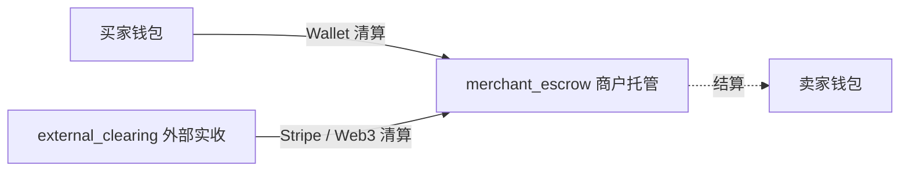
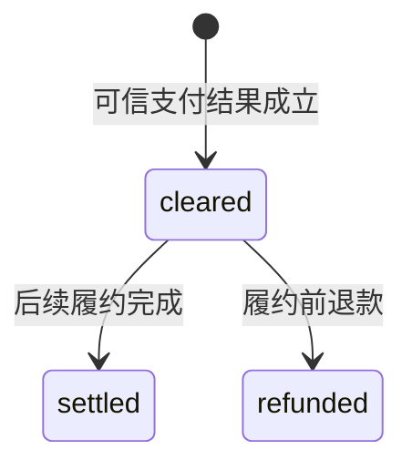
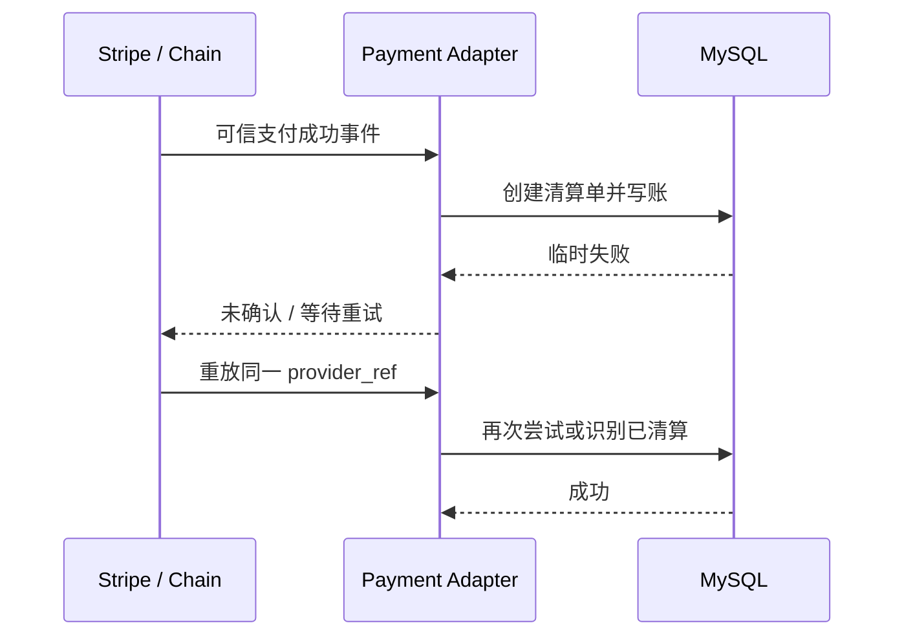

# 04 支付清算：平台收到的钱去了哪里

> gomall · `payment_clearing` / `merchant_escrow` / `external_clearing` / 支付异常单
>

这一讲先记住一个结论：**支付成功，只能说明平台确认收到了钱；这笔钱此时应该进入托管，不能直接变成卖家余额。**

回忆一下，在淘宝/amazon 买完东西，卖家能立刻收到钱吗？但是我们已经付款了，钱去哪里了？

清算要回答四个问题：钱从哪里来、实际收到多少、现在放在哪里、这次支付能不能被重复处理。它不负责判断卖家是否已经完成履约，也不负责给卖家放款。

---

## 一、支付成功为什么不能直接给卖家钱

### 1.1 一笔 100 元订单带来的问题

买家花 100 元下单，支付渠道已经返回成功，但卖家还没有发货。

如果系统此时直接给卖家余额加 100 元，接下来可能发生几件事：

- 卖家发货，买家收货，交易正常完成；
- 卖家没有发货（已经收到款并可提现），买家申请退款（已经扣款）；

第一种情况没有问题，后两种情况会让平台陷入被动：买家的钱必须退，但卖家的钱可能已经不在平台里。平台要么垫付，要么允许负余额，要么拒绝一笔本应通过的退款。

问题不在支付接口，而在于系统把两个事实混成了一个：

| 事实 | 代表什么 | 能否给卖家放款 |
|---|---|---:|
| 支付成功 | 平台确认已经收到买家的钱 | 不能 |
| 履约完成 | 商品已经交付，卖家取得资金 | 可以 |

因此，支付成功和卖家入账之间必须隔着托管阶段。

### 1.2 不同角色在意什么

| 角色 | 最关心的问题 |
|---|---|
| 买家 | 没收到货时，钱能不能退回来 |
| 卖家 | 平台有没有准确记录这笔待结算收入 |
| 财务 | 外部实收、托管余额和用户余额能不能对上，对账能不能对上 |
| 客服 | 重复支付是否真的多收了钱 |
| 研发 | 回调重放时会不会重复写账，有没有幂等性 |

审计：关注流水是否合法，是否可以被检阅

**清算的业务边界是收钱和记账，不是分账和放款。**

---

## 二、清算阶段需要哪些账户

### 2.1 三种资金来源，只有一个托管终点

gomall 用下面几个账户描述支付阶段的资金移动。

| 账户 | 代码中的表示 | 含义 |
|---|---|---|
| 买家钱包 | `user_wallet` | 余额支付时的资金来源 |
| 外部渠道清算账户 | `external_clearing` | Stripe / Web3 已实收资金的账务入口 |
| 商户托管账户 | `merchant_escrow` | 已支付、尚未完成履约的钱 |
| 卖家钱包 | `user_wallet` | 最终收款账户，清算阶段不变 |



余额支付和外部支付的起点不同，但都进入 `merchant_escrow`。后续结算与退款只需要判断资金是否还在托管，不必为每个支付渠道再写一套归属逻辑。

### 2.2 用分录看一笔 100 元订单

代码统一用分存储金额，100 元记为 `10000 cents`。所有的互联网大厂，对于余额的记录，没有任何一个厂会允许用FLOAT/DOUBLE

余额支付完成清算：

```text
买家钱包             debit   10000
merchant_escrow     credit  10000
```

Stripe 或 Web3 完成清算：

```text
external_clearing   debit   10000
merchant_escrow     credit  10000
```

merchant_escrow作为一个中间件的过度，可以想一下为啥要有这么个过度？

无论哪种支付方式，卖家钱包在这一步都不变化。

这里同时保存余额和流水：余额回答“现在有多少钱”，流水回答“为什么会有这些钱”。只改余额而不写流水，出了差错就无法对账；只写流水而不改余额，业务接口又读不到可用资金。

---

## 三、一张清算单要保存什么

### 3.1 `PaymentClearing` 是资金事实，不是支付响应缓存

```go
type PaymentClearing struct {
    OrderID     uint      `gorm:"not null;uniqueIndex"`
    BuyerID     uint      `gorm:"not null;index"`
    SellerID    uint      `gorm:"not null;index"`
    Channel     string    `gorm:"size:16;not null;index"`
    ProviderRef string    `gorm:"size:128;index"`
    GrossCents  int64     `gorm:"not null"`
    FeeCents    int64     `gorm:"not null;default:0"`
    NetCents    int64     `gorm:"not null"`
    Currency    string    `gorm:"size:8;not null"`
    Status      string    `gorm:"size:16;not null;index"`
    ClearedAt   time.Time `gorm:"not null"`
    SettledAt   *time.Time
    RefundedAt  *time.Time
}
```

这些字段可以分成四组：

| 字段 | 回答的问题 |
|---|---|
| `OrderID`、`BuyerID`、`SellerID` | 这是谁的哪一笔交易 |
| `Channel`、`ProviderRef` | 钱从哪里来(wallet/web 3/stripe)，外部凭证是什么 (常见的有Outer payment id) |
| `GrossCents`、`FeeCents`、`NetCents`、`Currency` | 实收、手续费、净额和币种分别是什么 |
| `Status`、三个时间字段 | 钱走到了哪个阶段，什么时候发生 |

`OrderID` 唯一，保证一张普通订单只有一条正常清算记录。外部渠道的 `ProviderRef` 用来识别同一笔回调是否重放。

如何保证`OrderID` 的唯一性？单机实例/多实例如何保证？单实例：redis锁，clear:UUID。mysql 的乐观锁/悲观锁 select for update

多实例：redis锁-》分布式redis锁:雪花ID

### 3.2 清算只创建 `cleared`



本讲只负责把状态推进到 `cleared`。这里没有 `pending`，因为“正在等待支付”仍属于支付模块；资金事实没有成立前，不应该提前创建一张已经清算的记录。

`cleared` 的准确含义是：

- 平台已经确认实收；
- 金额、币种、渠道和外部凭证已经固化；
- 钱已经记入托管账户；
- 卖家尚不能支配这笔钱。

### 3.3 什么时候才会进入 `cleared`

不是用户点击了“支付”，也不是系统创建了支付页面(下支付单-》甚至支付都没有完成-》一直处于等待支付状态-》QUESTION: 1. 设置一个每十五分钟的定时任务去扫描db去关单 cron)，就可以把清算单写成 `cleared`。判断标准只有一个：**系统已经拿到足以证明钱确实到账的证据，并且本地清算事务提交成功。**

三种渠道拿到证据的时间不同：

| 渠道 | 什么时候可以写入 `cleared` |
|---|---|
| Wallet | **数据库已经锁住买家钱包，确认余额足够**，并在同一个事务里完成扣款、写流水和创建清算单 |
| Stripe | 通过签名校验的 webhook **明确表示付款成功**，订单、金额和币种核对一致，再由本地事务创建清算单 |
| Web3 | 监听器等到要求的区块确认数，核对链上事件中的订单、付款人、Token 和金额，再由本地事务创建清算单 |

这里还要区分“外部已经收款”和“本地已经清算”。Stripe 可能已经扣款，链上交易也可能已经确认，但写 MySQL 时发生了临时故障。这时外部资金事实已经成立，本地记录却还不能算完成。系统应该让 webhook 或消息继续重试，直到下面几件事在一个本地事务里一起提交：

1. 创建 `payment_clearing`；
2. 把钱记入 `merchant_escrow`；
3. 推进订单状态；
4. 保存后续需要投递的事件。

只要这个事务没有提交，数据库里就不应该出现半张 `cleared` 清算单(数据库保证的ACID)。事务提交完成的时刻，才是这笔订单在 gomall 中真正完成清算的时刻。

---

## 四、三种支付渠道怎样进入同一本账

### 4.1 渠道差异只留在清算入口

区别的核心在于：**买家的钱是不是由你的系统记账和保管**。

| 渠道 | 实收依据 | debit 账户 | 是否需要买家扣款后余额 |
|---|---|---|---:|
| Wallet | 本地事务成功扣减买家余额 | 买家钱包 | 是 |
| Stripe | 已验证的 Stripe 回调 | `external_clearing` | 否 |
| Web3 | 已验证的链上事件 | `external_clearing` | 否 |

三条链路最终都调用 `RecordClearedTx`：

```go
func RecordClearedTx(
    tx *gorm.DB,
    o *order.Order,
    channel, providerRef, currency string,
    walletBalanceAfter *int64,
) error {
    if tx == nil || o == nil || o.ID == 0 ||
        o.UserID == 0 || o.BossID == 0 || o.Num <= 0 {
        return ErrInvalidClearingInput
    }
    if !validChannel(channel) || strings.TrimSpace(currency) == "" {
        return ErrInvalidClearingInput
    }
    if (channel == ChannelWallet) != (walletBalanceAfter != nil) {
        return ErrInvalidClearingInput
    }

    gross := orderPayableCents(o)//计算实际付款金额,调用营销模块
    record := &PaymentClearing{//支付清算记录
        OrderID:     o.ID,
        BuyerID:     o.UserID,
        SellerID:    o.BossID,
        Channel:     channel,
        ProviderRef: strings.TrimSpace(providerRef),
        GrossCents:  gross,
        FeeCents:    0,
        NetCents:    gross,
        Currency:    strings.ToUpper(strings.TrimSpace(currency)),
        Status:      StatusCleared,
        ClearedAt:   time.Now(),
    }
    if err := tx.Create(record).Error; err != nil {
        return err
    }

    ledger := money.NewLedgerDaoByDB(tx)//当前账本
    if walletBalanceAfter != nil {//使用wallet
        if err := ledger.AppendTransaction(
            o.UserID, o.ID, money.DirectionDebit,
            gross, *walletBalanceAfter, money.BizTypeOrderClear,
        ); err != nil {
            return err
        }
    } else if err := ledger.AppendSystemTransaction(//使用外部系统,借方：记录资金来自 Stripe、Web3 等外部支付渠道
        money.AccountCodeExternalClearing, o.ID,
        money.DirectionDebit, gross, money.BizTypeOrderClear,
    ); err != nil {
        return err
    }
// 贷方：记录同等金额进入商家待结算账户
    return ledger.AppendSystemTransaction(
        money.AccountCodeMerchantEscrow, o.ID,
        money.DirectionCredit, gross, money.BizTypeOrderClear,
    )
}
```

为什么在刚才的这段代码里，没有看到transcation 呢？执行失败怎么办呢？不是说好了ACID 吗？

Answer: 写的流水表啊，更改金额还没动啊，一般来说写流水表的这段代码需要和更改实际金额在同一个函数中放到同一个transcation 里面，会和更改余额同时执行成功or 失败


### 4.2 余额支付为什么能放进一个事务

余额支付的资金和业务数据都在本地数据库中，因此下面的动作可以原子完成：

1. 锁定并扣减买家余额；
2. 推进订单状态并扣减库存；
3. 创建 `payment_clearing`；
4. 写买家 debit 和托管 credit；
5. 写待投递的领域事件。

任何一步失败，整个事务回滚。系统不能出现“余额扣了但没有清算单”，也不能出现“清算单存在但订单仍未支付”。

### 4.3 外部支付为什么只能做到最终一致

Stripe 和链上转账不在本地数据库事务里。可能出现这样的顺序：



外部已经收钱，而本地提交失败时，不能回滚 Stripe 或区块链。系统依靠可信事件重试，并用持久化的清算单识别同一 `provider_ref`。

---

## 五、回调重放和真实重复收款怎样区分

### 5.1 两个“重复”不是一回事

假设订单已经记录 Stripe 支付 `pi_123`：

- Stripe 再次发送 `pi_123`：同一事件重放，应当幂等成功；
- 系统又收到 Web3 交易 `0xabc`：可能真的又收了一笔钱，不能静默吞掉。

`RecordExternalDuplicateTx` 会比较渠道与 `provider_ref`：

```go
if err == nil && record.Channel == channel &&
    record.ProviderRef == providerRef {
    return true, nil
}

if err := RecordExternalAnomalyTx(
    tx, o, channel, providerRef,
    providerAmount, currency,
    AnomalyReasonDuplicatePayment,
); err != nil {
    return false, err
}
```

相同引用表示同一事件重放；不同引用表示外部可能真的多收了一次，系统会写入 `payment_anomaly`，进入待审核和退款流程。

**幂等负责防止同一事实执行两次，异常单负责保留第二个资金事实。**

### 5.2 为什么不能只靠 Redis 防重

Redis 中的临时支付状态可能过期、被删除或在故障中丢失（到了TTL,系统断电）。外部已经收款后，清算单才是持久化证据。rds才是source of truth，rds和redis出了矛盾，一定要信rds

`IsProviderCleared` 会直接查询：

```text
order_id + channel + provider_ref
```

即使 Web3 的 pending 状态已经删除，同一条链上交易再次到达，系统仍能从数据库判断它已经处理过。

---

## 六、怎样测试清算没有提前放款

### 6.1 核心测试看的是资金结果

`TestClearingDefersSellerCreditAndSettlementIsIdempotent` 在清算完成后先检查卖家余额：

```go
buyerAfter := int64(700)
if err := db.Transaction(func(tx *gorm.DB) error {
    return RecordClearedTx(
        tx, o, ChannelWallet, "", "usd", &buyerAfter,
    )
}); err != nil {
    t.Fatalf("record clearing: %v", err)
}

if got := userBalance(t, db, 22); got != 500 {
    t.Fatalf(
        "seller must not receive funds at clearing time: got %d want 500",
        got,
    )
}

assertLedgerEntry(
    t, db, o.ID, money.BizTypeOrderClear,
    money.DirectionCredit, money.AccountCodeMerchantEscrow, 300,
)
```

这里不是只检查函数返回 `nil`，而是检查三个业务不变量：

- 卖家余额没有变化；
- 托管账户收到正确金额；
- 资金来源账户有对应 debit 流水。


---

## 七、代码从哪里读

推荐按一笔钱的路径阅读：

```text
支付成功入口
    -> RecordClearedTx
    -> PaymentClearing
    -> AccountTransaction
    -> RecordExternalDuplicateTx
    -> service_test.go
```

---

## 八、recap

### Q1：清算是什么？

清算确认平台从哪个渠道收到多少钱，并把资金记入待结算的托管账户。它固化订单、买卖双方、金额、币种和外部凭证，但不代表卖家已经可以支配这笔钱。

### Q2：为什么外部支付要经过 `external_clearing`？

因为 Stripe 或 Web3 没有扣买家的站内余额。单独的外部清算账户能准确表达资金来源，也让站内余额流水和外部渠道实收可以分别对账。

### Q3：为什么支付回调不能直接写卖家余额？

支付成功只证明平台收款，不证明卖家完成履约。提前入账会让履约前退款依赖卖家余额，卖家提现后平台可能需要垫付。

### Q4：同一个回调重复到达怎样处理？

用渠道和 `provider_ref` 查询持久化清算单。相同引用按幂等重放处理；不同引用说明可能真的重复收款，写异常单等待核查和退款。

### Q5：为什么清算单要保存 Gross、Fee 和 Net？

三者分别表示买家实付、平台费用和卖家应收。当前手续费为零时它们看起来重复，但拆分字段能让后续结算、退款和财务对账使用同一份资金事实。

---

## 九、课后练习

### 练习 1：写出两种清算分录

一笔 80 元订单分别使用 Wallet 和 Stripe 支付。写出两种情况下的 debit / credit 账户，并说明为什么卖家余额都不能变化。

### 练习 2：补渠道约束测试

增加一个不存在的渠道 `cash`，调用 `RecordClearedTx`，验证它不会创建清算单，也不会写任何流水。

### 练习 3：处理金额不一致

Stripe 回调金额是 100 元，订单应付是 80 元。设计一条异常记录，说明哪些字段必须保留，以及为什么不能把 80 元正常清算、剩余 20 元直接忽略。

这一讲最终要守住四句话：

- 清算确认平台已经收到钱，不确认卖家已经赚到钱；
- Wallet 与外部渠道的资金来源不同，但都先进入托管；
- 清算单是持久化资金事实，不能只依赖临时支付状态；
- 同一回调要幂等，真实重复收款必须留下异常记录。
