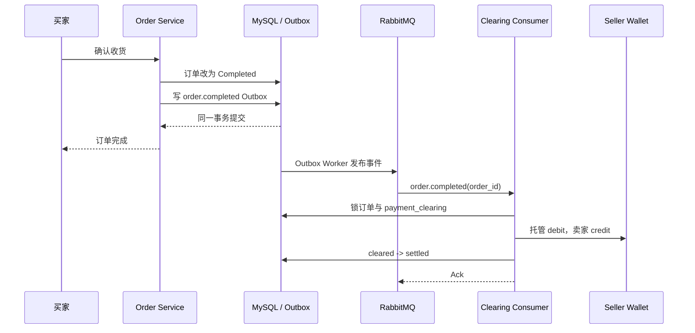
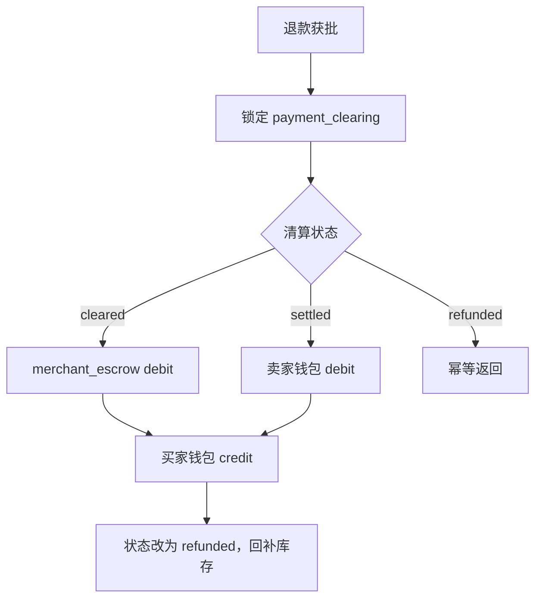
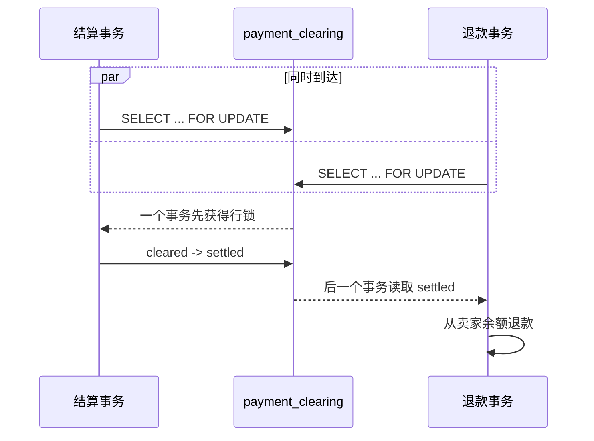

# 05 支付结算：订单完成后怎么把钱给卖家

> gomall · `order.completed` / `clearing.settle` / 卖家钱包 / 退款竞争
>
>

如果没有清结算，买家付完款之后直接把钱转给卖家的银行卡，会有什么问题？

卖家如果没有履约，没有发货，就收到了这笔钱并且提款，此时买家申请退款，此时会如果卖家余额不足退款的话，需要由平台补上这个钱。这会导致平台的资损-》事故-》背锅


这一讲先记住一个结论：**订单完成后，系统才能把资金从商户托管账户转入卖家钱包；结算和退款无论谁先发生，都必须锁住同一条清算记录来决定资金去向。**

清算解决“平台已经收到钱”，结算解决“这笔钱现在属于谁”。这一讲从 `payment_clearing.status = cleared` 开始，沿着 `order.completed` 消息一直走到卖家入账或买家退款。

本讲默认学生已经知道：可信支付结果成立时，支付清算会创建 `payment_clearing(status=cleared)`，并把资金记入 `merchant_escrow`。用户点击确认收货，或者超过收货 SLA 后由系统自动确认，改变的是订单状态：订单进入 `Completed`，随后才触发结算，把清算状态从 `cleared` 推进到 `settled`。如果这部分还不清楚，先看前一讲《支付清算：平台收到的钱去了哪里》。

---

## 一、什么时候才能给卖家放款

### 1.1 支付成功不是放款条件

一笔 100 元订单支付成功后，清算状态是 `cleared`，资金在 `merchant_escrow`。这时买家可能还没有收到商品，卖家也可能尚未发货。

只有订单进入 `Completed`，平台才有依据把这 100 元转给卖家。

| 订单状态 | 清算状态 | 资金位置 | 能否给卖家放款 |
|---|---|---|---:|
| 待发货 / 待收货 | `cleared` | 商户托管 | 否 |
| 已完成 | `cleared` | 商户托管 | 可以执行结算 |
| 已完成 | `settled` | 卖家钱包 | 已完成，不再处理 |
| 退款中 | `cleared` 或 `settled` | 托管或卖家钱包 | 否，先由退款流程决定资金去向 |
| 已退款 | `refunded` | 已退回买家 | 否 |

结算动作本身很短：

```text
merchant_escrow   debit   10000
卖家钱包           credit  10000
```

真正困难的不是加一次余额，而是回答这些问题：

- 完成事件发送了两次，会不会放款两次；（幂等性，如何处理）
- merchant escrow 扣款成功，卖家钱包加款失败怎么处理？ACID特性-》这个事务里面能有什么，不能有什么：不能有操控外部写的接口/MQ/外部RPC，最好只操纵表
- 完成事件晚到，订单已经退款怎么办；
- 结算和退款同时执行，谁有权拿走托管资金；（冲突如何处理）
- 卖家余额改了，但消息确认失败怎么办；
- 数据库临时不可用，消息应该重试还是丢弃。

### 1.2 结算模块的职责边界

| 模块 | 负责的事实 |
|---|---|
| Order | 订单是否已经履约完成 |
| Outbox / RabbitMQ | 完成事实是否可靠送达 |
| Clearing | 资金当前是 `cleared`、`settled` 还是 `refunded` |
| Money Ledger | 资金从托管转到卖家的流水，是流水表，为了应对监管 |
| Refund | 退款获批后，按资金位置执行逆向操作 |

订单模块不直接修改卖家钱包。它只发布“订单已经完成”这个事实（走消息队列，外部模块订阅TOPIC 然后用生产者消费者的模式进行消费TOPIC），清算模块据此决定能否结算。

---

## 二、从订单完成到卖家入账

### 2.1 为什么通过事件触发

如果确认收货接口同步调用资金模块，订单请求会同时依赖订单表、清算表、资金流水和卖家钱包。任何一处暂时失败，前端都会面对“订单到底完成了没有”的尴尬状态。

如果同时在一个文件里改的话，需要频繁的REBASE ，不方便敏捷开发，不方便发版，不方便上线。

gomall 把链路拆成两段：

1. 订单事务把状态改为 `Completed`，同时写入 Outbox（算是大厂的一套标准了，基本都会这么干）；思考为什么写Outbox（一张表同时记录这个订单的状态改变和流水表的改变和我们需要调用外部的MQ 接口），不写outbox会出现什么问题，思考为什么要有事务
2. Outbox 发布 `order.completed`，独立消费者执行结算。



这里允许一个短暂窗口：订单已经显示完成，清算单仍是 `cleared`。这属于可观察、可重试的最终一致，不等于资金丢失。

### 2.2 消费者如何处理消息

`clearing.settle` 队列订阅两种事件：

| 事件 | 什么时候结算 |
|---|---|
| `order.completed` | 正常履约完成后尝试结算 |
| `order.refund_rejected` | 只有订单恢复为 `Completed` 时才结算 |

```go
func DispatchSettleEvent(
    ctx context.Context,
    routingKey string,
    payload []byte,
) error {
    switch routingKey {
    case "order.completed":
        return HandleOrderCompletedEvent(ctx, payload)
    case "order.refund_rejected":
        return HandleRefundRejectedEvent(ctx, payload)
    default:
      //打Log
        return fmt.Errorf(
            "%w: unexpected routing key %q",
            errSettlePoisonMessage,
            routingKey,
        )
    }
}
```

退款被驳回并不一定代表已经履约完成。如果订单只是恢复到待发货或待收货，消费者不会提前放款；只有恢复为 `Completed` 才执行结算。

### 2.3 Ack、重排和 DLQ

消费者的处理规则是：

- 事务成功：Ack；
- 数据库临时失败：Nack 并重新入队；
- JSON 无法解析、缺少 `order_id`：毒消息进入 DLQ；
- 超过投递上限：进入 DLQ，等待人工排查。

消息可能至少投递一次（所有的消息队列都需要保证AT LEAST 1 ），所以结算函数必须自己保证幂等（一般来说所有的写操作都需要保证幂等，常见的方法是用redis来保证，也可以用mysql 的select for update来保证）。不能把“RabbitMQ 通常只发一次”当成资金安全条件。

---

## 三、结算事务怎样保证一笔钱只放一次

### 3.1 先锁订单，再锁清算单

`SettleCompletedOrder` 在一个数据库事务中完成全部检查和写账：

```go
func settleCompletedOrder(db *gorm.DB, orderID uint) error {
    return db.Transaction(func(tx *gorm.DB) error {
        var o order.Order
        // SELECT ... FOR UPDATE：锁住当前订单行。
        if err := tx.Clauses(
            clause.Locking{Strength: "UPDATE"},
        ).First(&o, orderID).Error; err != nil {
            return err
        }

       //PaymentClearing 对应的清算表
      //什么是乐观锁，什么是悲观锁？悲观锁是在你访问潜在的有冲突的行之前，先加锁，再访问，乐观锁是先访问，如果有冲突，再解决。
        var record PaymentClearing
        if err := tx.Clauses(
            clause.Locking{Strength: "UPDATE"},
        ).Where("order_id = ?", orderID).
            First(&record).Error; err != nil {
            if errors.Is(err, gorm.ErrRecordNotFound) {
                return nil
            }
            return err
        }

        switch record.Status {//异常检查
        case StatusSettled, StatusRefunded:
            return nil
        case StatusCleared:
        default:
            return ErrInvalidClearingState
        }

        if o.Type == consts.OrderRefunding ||
            o.Type == consts.OrderRefunded {
            return nil
        }
        if o.Type != consts.OrderCompleted {
            return ErrOrderNotCompleted
        }

        // 更新卖家余额，写两条结算流水，推进清算状态。
        return nil
    })
}
```

这段代码的检查顺序不能随便换：

1. 锁订单行，固定本事务看到的履约状态；
2. 锁清算行，阻止退款同时决定资金去向；
3. 终态 `settled/refunded` 直接幂等返回；
4. 退款中或已退款时，不处理迟到的完成事件；
5. 只有订单确实为 `Completed` 才继续。

没有清算记录时直接返回，是为了兼容迁移前已经在支付阶段给卖家入账的旧订单。否则旧订单收到完成事件后可能再次放款。

### 3.2 余额、流水和状态必须一起提交

通过检查后，结算事务执行四个写操作：

```go
seller, err := user.NewUserDaoByDB(tx).
    GetUserByIdForUpdate(record.SellerID)
if err != nil {
    return err
}

before, err := seller.DecryptMoney()
if err != nil {
    return err
}
after := before + record.NetCents

// 1. 更新卖家真实余额。after 只是内存里的计算结果，流水也不会自动改余额。
seller.Money = strconv.FormatInt(after, 10)
cipher, err := seller.EncryptMoney()
if err != nil {
    return err
}
seller.Money = cipher
if err := tx.Model(&user.User{}).
    Where("id = ?", seller.ID).
    Update("money", cipher).Error; err != nil {
    return err
}

ledger := money.NewLedgerDaoByDB(tx)

// 2. 托管账户 debit
if err := ledger.AppendSystemTransaction(
    money.AccountCodeMerchantEscrow,
    orderID,
    money.DirectionDebit,
    record.NetCents,
    money.BizTypeOrderSettle,
); err != nil {
    return err
}

// 3. 卖家钱包 credit
if err := ledger.AppendTransaction(
    record.SellerID,
    orderID,
    money.DirectionCredit,
    record.NetCents,
    after,
    money.BizTypeOrderSettle,
); err != nil {
    return err
}
```

这里必须区分余额和流水：

- `users.money` 保存卖家此刻可以使用多少钱，付款、退款和余额查询都会直接读取它；
- `account_transaction` 保存余额为什么发生变化，用于对账、审计和排查重复入账；
- `after` 只是当前 Go 函数里的变量，如果没有执行 `UPDATE users SET money = ...`，事务结束后卖家余额不会发生任何变化；
- 写入卖家钱包的 `credit` 流水也不会触发余额更新，它只是记录这次变化和将来应对监管的的证据。

卖家余额经过加密后落在 `users.money`。`merchant_escrow` 是系统托管账户，没有对应的用户余额行，因此托管余额通过 `account_code = merchant_escrow` 的流水汇总得到。两种账户模型不同，不能因为托管账户只写流水，就省略卖家钱包的余额更新。

最后再把状态从 `cleared` 改成 `settled`：

```go
result := tx.Model(&PaymentClearing{}).
    Where("id = ? AND status = ?", record.ID, StatusCleared).
    Updates(map[string]interface{}{
        "status": StatusSettled,
        "settled_at": time.Now(),
    })
//会不会有并发的问题？ 实际没有并发的问题
if result.Error != nil {
    return result.Error
}
if result.RowsAffected != 1 {
    return ErrInvalidClearingState
}
```

卖家余额、托管 debit、卖家 credit 和清算状态处在同一个事务中。任何一步失败，前面的写入全部回滚。

条件更新 `WHERE status = cleared` 是最后一道防线：即使代码前面已经读过状态，也要确认提交时仍然从唯一合法的起点推进。

---

## 四、退款应该从哪里扣钱

### 4.1 判断依据不是订单状态，而是资金状态

退款获批后，系统先锁 `payment_clearing`，再判断资金现在在哪里。

| 清算状态 | 钱当前在哪里 | 退款来源 | 卖家余额是否变化 |
|---|---|---|---:|
| `cleared` | `merchant_escrow` | 托管账户 | 否 |
| `settled` | 卖家钱包 | 卖家余额 | 是 |
| `refunded` | 已退给买家 | 不再处理 | 否 |



代码中的关键判断是：

```go
fromEscrow := clearingFound &&
    clearingRecord.Status == clearing.StatusCleared//思考：为什么要这么判断？如果不判断clearingFound会有什么问题？-》空指针问题-》panic  一般来说，如果你去访问指针或者  .这种形式的话，都要判断是否为空


if fromEscrow {
    err = ledgerDao.AppendSystemTransaction(
        money.AccountCodeMerchantEscrow,
        o.ID,
        money.DirectionDebit,
        amount,
        money.BizTypeEscrowRefund,
    )
} else {
    seller, err := userDao.GetUserByIdForUpdate(o.BossID)
    // 扣卖家余额，写 seller debit 流水。
}
```

履约前退款时，钱还没有属于卖家，所以不应碰卖家余额。履约后退款时，托管资金已经转出，只能从卖家余额扣回。

### 4.2 结算和退款同时执行怎么办

最危险的并发是：完成事件正准备给卖家放款，客服同时批准退款。//又资损了，怎么办？



也可能退款先拿到锁：它会从托管账户退款并把状态改成 `refunded`，迟到的完成事件读到终态后直接返回，不再给卖家放款。

如果没有同一条清算记录上的行锁，两个事务可能都读到 `cleared`：退款从托管账户退钱，结算又把同一笔钱给卖家，平台凭空损失一笔。

### 4.3 为什么退款金额以清算单为准

订单展示金额可能受到促销规则、字段修正或数据迁移影响。清算单记录的才是支付发生时的资金事实。

当前退款逻辑会检查：

- 订单计算出的实付金额等于 `GrossCents`；
- `FeeCents == 0`；
- `GrossCents == NetCents`。

未来引入平台手续费后，不能简单从卖家扣 `GrossCents`。需要分别定义平台是否退手续费、卖家退多少、部分退款怎样分摊。当前遇到含手续费的清算单会拒绝自动处理，交给人工对账，避免少退或多扣。

---

## 五、重复、乱序和故障怎样处理

### 5.1 幂等由多层约束组成

| 层次 | 约束 | 防住的问题 |
|---|---|---|
| 清算单 | `order_id` 唯一 | 一张订单不能有两条正常清算单 |
| 行锁 | 订单与清算记录 `FOR UPDATE` | 结算和退款不能同时决定归属 |
| 状态机 | `cleared -> settled/refunded` | 终态事件重复到达直接返回 |
| 流水 | 订单、方向、业务类型唯一 | 同一笔业务不能重复记账 |
| 条件更新 | `WHERE status = cleared` | 防止状态被别的事务抢先推进 |
| 消息处理 | 成功 Ack、失败重排、毒消息进 DLQ | 暂时故障可恢复，坏消息不堵队列 |

幂等不是在函数开头写一个 `if processed`。绝对不能这么干，必出问题，PR 必被打回来。资金链路需要数据库约束、事务锁、状态守卫和消息语义一起工作。

### 5.2 三种消息顺序

| 到达顺序 | 系统结果 |
|---|---|
| `completed`，再重复 `completed` | 第一次结算，后续幂等返回 |
| `refunded`，再迟到 `completed` | 已退款，完成事件不放款 |
| `completed`，再 `refunded` | 先给卖家结算，退款再从卖家扣回 |

系统不要求消息严格有序（消息队列的消息也不是有序的），而是要求每种顺序都收敛到合法资金结果。

### 5.3 数据库提交成功，但 Ack 失败怎么办

RabbitMQ 会再次投递同一条消息。第二次消费锁住清算单后读到 `settled`，直接返回成功并 Ack。卖家余额和流水不会再次增加。

这正是“至少一次投递 + 业务幂等”的常见组合：允许消息重复，不允许资金结果重复。


---

## 六、代码从哪里读

| 想看的内容 | 文件 | 入口 |
|---|---|---|
| 清算状态 | `internal/clearing/model.go` | `PaymentClearing` |
| 订单完成后放款 | `internal/clearing/service.go` | `SettleCompletedOrder` |
| 结算消息消费 | `internal/clearing/consumer.go` | `StartSettleConsumer` |
| 退款资金来源 | `internal/refund/service.go` | `SettleRefund` |
| 资金流水约束 | `internal/money/` | `AccountTransaction`、Ledger DAO |
| 结算行为测试 | `internal/clearing/service_test.go` | `TestClearing...` |
| 退款行为测试 | `internal/refund/service_test.go` | `SettleRefund` 相关测试 |
| 完整工程设计 | `docs/architecture/PAYMENT_CLEARING_SETTLEMENT.md` | 状态、表结构与故障处理 |

推荐沿事件路径阅读：

```text
订单完成事务
    -> Outbox
    -> order.completed
    -> DispatchSettleEvent
    -> SettleCompletedOrder
    -> AccountTransaction
    -> SettleRefund
    -> service_test.go
```

---

## 八、面试时怎么回答

### Q1：结算是什么？

结算是在履约条件满足后，把清算阶段暂存在 `merchant_escrow` 的净额转入卖家钱包。它会同时更新卖家余额、写一借一贷流水，并把清算状态从 `cleared` 改为 `settled`。

### Q2：为什么订单完成和结算使用最终一致？

订单和资金属于不同业务边界。订单事务通过 Outbox 保证完成事件不丢，结算消费者独立重试。这样确认收货接口不用同步等待资金模块，同时清算状态和账本仍能定位未完成的结算。

### Q3：RabbitMQ 重复投递会不会重复放款？

不会。清算记录有行锁和状态守卫，流水有唯一约束，最终状态更新只允许 `cleared -> settled`。第二次消费读到 `settled` 后直接成功返回。

### Q4：结算与退款并发时怎样防止资金走两次？

两个事务都锁同一条 `payment_clearing`。先提交者把状态推进到 `settled` 或 `refunded`，后一个事务只能根据新状态从卖家退款或停止处理，不能继续按旧状态操作托管资金。

### Q5：为什么退款不直接按订单金额计算？

订单字段可能变化，清算单保存的是支付发生时的金额、币种和手续费事实。退款必须与这份资金事实核对，避免促销或数据变更造成多退、少退。

### Q6：数据库成功但消息 Ack 失败怎么办？

消息会再次投递。业务幂等会识别清算单已经是 `settled`，第二次不再更新余额和流水，然后正常 Ack。

---

## 九、课后练习

### 练习 1：补重复事件测试

对同一订单连续调用三次 `SettleCompletedOrder`，验证卖家余额只增加一次，并且结算流水始终只有一条 debit 和一条 credit。

### 练习 2：补并发竞争测试

同时启动两个 goroutine：一个执行结算，一个执行退款。结束后检查：

- 清算单只有一个合法终态；
- 买家、卖家余额和托管流水能对上；
- 不存在既从托管退款、又给卖家入账的结果。

### 练习 3：设计手续费结算

订单实付 100 元，平台手续费 3 元，卖家净收 97 元。写出清算后的托管金额，以及结算时托管账户、平台收入账户、卖家钱包之间的三条分录。再说明全额退款时手续费是否退还。

这一讲最终要守住四句话：

- 订单完成是放款条件，支付成功不是；
- 结算把托管资金转给卖家，余额、流水和状态必须同一事务提交；
- 退款从哪里扣，取决于清算状态；
- 行锁、状态机、唯一流水和消息重试共同保证一笔钱只放一次。
