# 支付：钱即将出手的那一秒

> gomall /paydown 业务侧 deck · 五角色视角看一次扣款
>
> 这份讲义不讲"怎么调一个支付网关 SDK"，讲的是**钱即将离开账户那一秒背后的每一个业务取舍**——扣谁的钱、扣多少、扣错了赔多少、客服要说什么话、SLO 会不会被第三方拖垮。每一行代码后面都挂着一条算得出钱的客诉路径。

## 目录

- [一、业务定位：支付是 P0 中的 P0](#一业务定位支付是-p0-中的-p0)
- [二、合规与信任：为什么金额要加密](#二合规与信任为什么金额要加密)
- [三、支付密码：业务侧二次验证的取舍](#三支付密码业务侧二次验证的取舍)
- [四、PayDown 主体：一次扣款里的五件业务事](#四paydown-主体一次扣款里的五件业务事)
- [五、资金台账：复式记账补上"不可对账"硬伤](#五资金台账复式记账补上不可对账硬伤)
- [六、第三方支付：业务边界与熔断的运营 SOP](#六第三方支付业务边界与熔断的运营-sop)
- [七、幂等：重复扣款是客服 top1 客诉](#七幂等重复扣款是客服-top1-客诉)
- [八、失败兜底、SLO 与压测数字](#八失败兜底slo-与压测数字)
- [附录 A：面试 Q&A](#附录-a面试-qa)
- [附录 B：代码位置一览](#附录-b代码位置一览)

---

## 一、业务定位：支付是 P0 中的 P0

### 为什么单独拿一份 deck 讲支付

整条电商链路有 20 多个环节，支付是**唯一让用户真正紧张的一秒**——钱即将离开账户。其它环节失败都能重来，唯独这一秒失败要付真金白银：

- 浏览失败 = 再刷一次，用户无感；
- 下单失败 = 重填地址，最多骂一句；
- **支付失败 = 客诉、退款、平台兜底**——每一次都要人来收拾。

正因如此，gomall 把 `/paydown` 放进 SLO 的 P0 档：**99.95% 可用 / p99 < 500ms / 不挂限流**。翻译成运营语言：每年最多宕 4 小时 22 分；哪怕流量排队也得放进来，绝不能对一个想付钱的用户返回 70001。

> **支付不是"一个接口"，而是"商业信任的具体落点"。每一行代码背后都有一条客诉路径。**

### 五角色眼中的同一秒

同样是"扣款那一秒"，五个利益相关者焦虑的东西完全不同。把技术动作翻译成每个角色的业务痛，才知道为什么这一秒值得讲一整份 deck：

| 角色 | 那一秒最焦虑的事 |
|---|---|
| C 端用户 | "我的钱扣了吗 / 订单成了吗 / 重复扣了怎么办" |
| 商家 | "什么时候到账 / 平台抽多少 / 退款会不会扣回去" |
| 运营 | "GMV 落账瞬间能不能扛峰 / 这分钟卡了多少订单" |
| 客服 | "扣款没出货 / 支付后掉单 / 重复扣款"三大客诉 |
| SRE | "p99 还在 500ms 以内吗 / 第三方挂了会不会全站陪葬" |

本 deck 后续每一帧都会标注**它在回答哪个角色的哪个问题**。业务码 `60002 / 70002 / 30001` 会反复出现在客服话术里——它们就是这五种焦虑的答案。

### 业务后果数字化

为什么支付值得堆这么多中间件？把后果换算成钱就清楚了：

- 支付掉单率每升 **1 pp**：按 GMV 1000 万/日估算 = 单日 **10 万元**直接流失，二次复购率再掉 0.5 pp；
- 客诉一通电话客服平均 **8 分钟**：日 1000 单掉单 → 客服需 **2.2 个人日**兜底；
- 第三方支付 30s 超时不熔断：用户白屏放弃下单率 **~38%**（行业经验）；
- 熔断打开期间只损失 5% 用户，而不熔断会雪崩全站损失 100%——**两个数量级**的差距。

> **所有看起来"过度设计"的中间件，背后都是一条算得出钱的客诉路径。**

### /paydown 在 gomall 业务全景中的位置

支付不是孤岛，它上承下单、下启发货，还要向退款留一条回路：

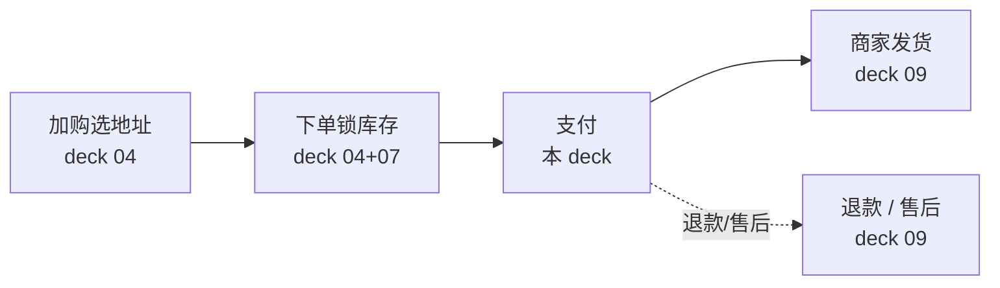

- **上游**：下单已经把库存预占进 Redis `reserved` 桶——支付时不必再抢库存，只需在扣款成功后落实这次预占。
- **下游**：支付成功 → 写 outbox 事件 `order.paid` → 通知发货 / 优惠券核销 / 索引更新。
- **失败兜底**：30 分钟未付 → Cron + RMQ 双保险关单（deck 09），把预占的库存还回去。

### 业务边界：本支付不做什么

一份诚实的支付 deck，先要说清楚自己**不做**什么。gomall 的 `/paydown` 明确划掉了六件事：

- **不真接支付宝 / 微信 / 银联**：README 已写明——"法币支付走 outbox 事件，下游对接由 wallet 服务消费（路线图）"；
- **不做实名 KYC**：合规上这是银行 + 持牌支付公司的事；
- **不做风控引擎**：异常交易识别 / 黑名单 / 行为模型留给独立风控团队；
- **不做反洗钱（AML）**：上链 / 大额拆分识别走独立合规系统；
- **不做商家分账**：平台抽成 / 服务费 / 代收代付是路线图；
- **不做发票管理**：增值税专票 / 普票留给财税系统。

> **诚实划边界 = 给商家和合规一个交代。MVP 阶段聚焦"扣款 + 入账 + 状态机推进"三件事做到位。**

### 业务边界图：本 deck 在哪里、不在哪里

上排（绿）是本 deck 必须做对的四件事，下排（红）是留给路线图的四件事：

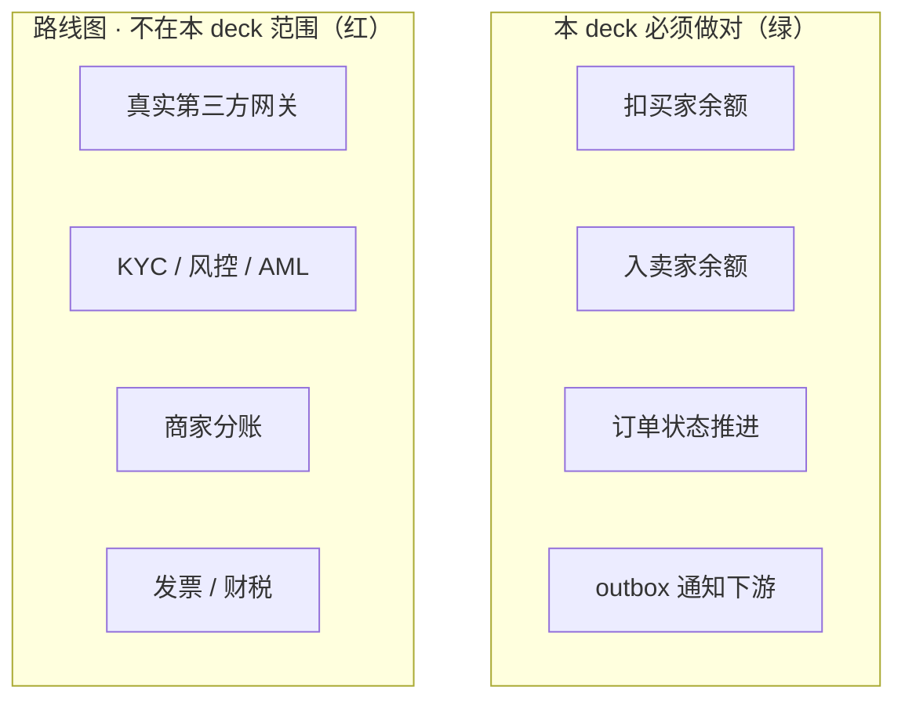

虽然真实第三方在红区，但 **paydown 接口已经为真接第三方留好了位置**：熔断器已挂、outbox 已通，接入时只换实现、不改架构（详见第六节）。

---

## 二、合规与信任：为什么金额要加密

### 客服 / 法务的视角：明文金额会出什么事

"金额要不要加密"不是一道技术题，是四个角色各自的红线：

- **客服**：用户来电"我的余额怎么少了 50 块"。如果 DBA 能直查 `users.money`，举证就停在"我说没动、你也没法证明"——加密之后，任何一次明文访问必须走函数、留痕迹，客服才有据可查。
- **法务**：等保 2.0 / GB/T 22239 / PCI-DSS 都要求"敏感金额字段不得明文落盘"，年审过不了 = 不能上线大促。
- **运营**：拖库新闻一旦上热搜（明文金额泄漏），日均订单跌 **30–50%**（行业事件经验）。
- **内控**：明文金额一旦被 `log.Debug(user)` 序列化 → 上传 ELK → 全公司有 ELK 账号的人都能看。

> **加密金额不是"加密功能"，是把金额从数据库视野里抹掉。运维 / DBA / 实习生看到的永远是乱码。**

### AES 金额加密的合规业务价值（不只是技术）

加密带来的收益是可以量化到审计周期和结算流程上的：

- **合规审计**：年审看三件事——敏感字段是否加密、密钥是否分离、能否审计明文访问路径。三条都满足，过审周期从 6 周缩到 2 周。
- **商家结算单脱敏**：商家后台看到的是**明文金额**（业务必须），但客服 / 平台要审计时，DB 直查永远只能拿到密文——一次明文访问必须走 `DecryptMoney` 函数 → 可被审计日志覆盖。
- **财务对账**：财务看的是脱敏后的聚合报表（GMV / 商户日入），由结算服务定时拉取后**一次性解密入数仓**，DB 永远不存明文。
- **业务取舍代价**：`SUM(money)` 在 DB 里**无法直接聚合**（密文异序）——财务报表必须走结算服务批跑，不能裸 SQL。

### gomall 的金额加密链路

金额加密的核心是**双密钥分离**：服务端一把、用户一把，谁都不能单独解密：

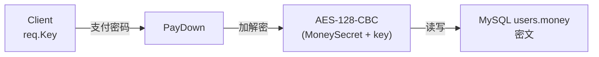

- 双密钥：服务端 `MoneySecret` + 用户支付密码 `key`。
- 任一方泄漏**都不足以**独立解密 → 密钥分离。DBA 拿走 dump 缺用户密码，用户密码被钓鱼缺服务端密钥。
- 改密码 = 解密旧密文 + 用新 key 重新加密。

### 加解密的代码长这样

```go
// EncryptMoney 加密金额。底层库加密失败 panic，统一折叠为 error
func (u *User) EncryptMoney(key string) (money string, err error) {
    defer func() { if r := recover(); r != nil {
        money, err = "", errors.New("余额加密失败") } }()
    aesObj, err := secret.NewAesEncrypt(
        conf.Config.EncryptSecret.MoneySecret, // 服务端持有
        key,                                   // 用户支付密码
        "", secret.AesEncrypt128, secret.AesModeTypeCBC)
    if err != nil { return }
    money = aesObj.SecretEncrypt(u.Money)
    return
}

// DecryptMoney 解密金额，返回值单位为分
func (u *User) DecryptMoney(key string) (money int64, err error) {
    defer func() { if r := recover(); r != nil {
        money, err = 0, ErrMoneyKeyIncorrect } }() // 错密钥去填充越界
    aesObj, err := secret.NewAesEncrypt(
        conf.Config.EncryptSecret.MoneySecret, key, "",
        secret.AesEncrypt128, secret.AesModeTypeCBC)
    if err != nil { return }
    plain := aesObj.SecretDecrypt(u.Money)
    money, err = strconv.ParseInt(plain, 10, 64)
    if err != nil { return 0, ErrMoneyKeyIncorrect } // 乱码不当余额
    return money, nil
}
```

### 逐行讲解：加解密对业务承诺的兑现点

这段代码不长，但每一个决定都在兑现一条对某个角色的承诺：

- **服务端密钥 + 用户密码独立**：DBA 拿走 dump 也无能为力（缺密码）；用户密码被钓鱼也只能搞一个账号（缺服务端密钥）。两道防线分别交代给法务和反钓鱼。
- **用 CBC 而非 ECB**：同一笔金额每次密文都不同，防"对照表猜金额"——对应风控的诉求。
- **`Money string` 而非数值列**（model.go:27）：密文长度可变，只能用字符串存。代价是 SQL 直接 `SUM` / `ORDER BY money` 全部行不通，必须走结算服务——这是明码标价的业务取舍。
- **`strconv.ParseInt` 单位是分**：全链路避免浮点，对应"100 元订单分账误差 0.01 元"这类客诉。
- **错误传播**：密码错 → CBC 去填充 panic 或解出乱码 → `recover` / `ParseInt` 统一折叠为 `ErrMoneyKeyIncorrect` → TX 回滚。早期实现里这条路径会把整个请求 panic 掉，现在它是一个明确的"支付密码错误"业务错误。

### 业务取舍：金额加密对 SQL 聚合的代价

加密不是白拿的，它换走了 DB 侧的大数据聚合能力：

| 查询场景 | 明文方案 | 密文方案 |
|---|---|---|
| "商家日入" | `SUM(money) GROUP BY boss_id` 秒级 | 结算服务批跑 + 缓存 |
| "用户余额排行" | `ORDER BY money` 秒级 | 不支持，业务侧改埋点 |
| "对账" | SQL 比对 | 解密后入数仓 |

- 代价是**放弃 DB 侧大数据聚合能力**；
- 收益是**合规通过 + 拖库零金额泄漏**；
- 业务侧的选择：交易类金额**必须密文**（安全比合规聚合更重要），统计类指标走数仓 / 缓存（精度可后补）。

---

## 三、支付密码：业务侧二次验证的取舍

### 为什么不直接用"实名 + 短信验证码"

扣款前的二次验证，最"正规"的做法是实名 KYC + 短信验证码，但对一个电商 MVP 来说这条路太重：

- **实名 KYC 的合规成本**：要接公安一二三要素接口（人均 0.5–2 元/次）、运营商短信通道（0.05 元/条），还要备案"信息处理者"身份 → **合规审批 6+ 月**。
- **业务收益对照**：电商扣款金额一般 < 1000 元/笔，这点风险敞口配不上全链 KYC 的成本。
- **客诉路径**：短信验证码到达率只有 **96–98%** → 每天 **2–4%** 用户因为收不到验证码而放弃支付，这是纯粹的转化流失。
- **业务侧的选择**：用**业务侧 6 位支付密码**——不存盘、入口校验、作为 AES 入参，覆盖 95% 场景；KYC + 短信留给"大额提现 / Web3 / 银行卡绑定"路线图。

### 支付密码 vs 登录密码：业务上为什么分两套

两把密码作用完全不同，泄漏后果也不同，所以必须分家：

| 维度 | 登录密码 | 支付密码 |
|---|---|---|
| 作用 | 拿 JWT | 解密金额 |
| 长度 | ≥ 6 | 固定 6 位 |
| 泄漏后果 | 看订单地址 | 直接扣款 |
| 存储 | bcrypt 哈希 | **不存** |
| 重置 | 邮箱 + 短信 | 客服核身 + 余额冻结 |
| 客服话术 | "已发重置链接" | "请验证身份后由客服重置，48h 内余额冻结" |

- 支付密码**不存盘**：用户每次手输 → 整库 dump 也解不开余额（它是 AES 的一半密钥，不落地就永远拿不到）。
- 入口校验 `len(req.Key) == 6`，太短直接拒（防 SQL 注入测试 / 弱口令撞库）。
- 客服只能"冻结余额 48h + 用户本人重置后解冻"，**不可代输支付密码**——这是防内鬼的硬约束。

### 支付密码弱口令的客诉路径

6 位密码只有 100 万种组合，理论上能被穷举。看清这条客诉链，才明白为什么它"看着危险、实际能用"：


- **弱口令风险敞口**：6 位 = 100 万组合，单接口 5 RPS 一天就能穷举完。
- **为何还能用**：因为接口前面挂了 **CircuitBreaker + RateLimit + Idempotency** 三层，单 IP 单用户实际穷举速率 < 0.5 RPS → 跑完平均要 **23 天**，余额早被风控冻结。防线不在密码本身的熵，而在接口前的三道门。
- **路线图**：后续对接**风控引擎**（异地 IP / 行为模型），把穷举在更前面拦掉。

---

## 四、PayDown 主体：一次扣款里的五件业务事

### 业务侧的四个硬约束

PayDown 的设计不是工程师拍脑袋，而是**合规 + 客诉 + 监控**三方倒推出来的四条硬约束：

| 约束 | 业务诉求 | 设计回应 |
|---|---|---|
| 金额不能明文落盘 | 合规 / 防内鬼 / 防误日志 | AES-128-CBC + 双密钥 |
| 密码错不能扣款 | 防穷举 / 防钓鱼 | 长度校验 + 解密失败 abort |
| 第三方支付会挂 | 不让 5% 拖垮 100% | CircuitBreaker 5/10s/3 |
| 客户端会重试 | "重复扣款"是 top1 客诉 | Idempotency-Key + Lua |

记住这张**业务码地图**，它贯穿后面所有帧：`30001` token 错 / `60002` 处理中 / `70001` 限流 / `70002` 熔断。

### PayDown 在一次事务里做的几件事

一次扣款不是"改一个余额数字"，而是五件事同生共死地落在一个事务里：

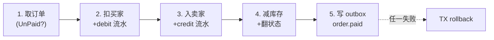

全部落在同一个 `tx`，**要么全成功、要么全不动**。扣买家 / 入卖家各自带一条不可变流水（debit / credit，见第五节），余额变动与流水同生共死；outbox 也在 TX 内写——用事务消息防丢（deck 11 主题）。

> **业务承诺**：客户端拿到 `200 status=200` 即代表"钱扣了 / 商家入账了 / 两条流水落账 / 库存减了 / 下游必定收到事件"全部已经落定。

### PayDown 结算的标准时序：六方一次扣款

把这一次扣款展开成六方协作，就能看清"同事务"到底罩住了谁：

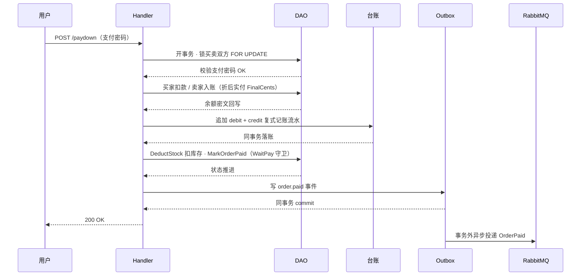

扣款、入账、台账流水、库存、改单、发件箱**六件事落在同一个事务**里，要么全成功要么全回滚。用户拿到 `200 OK` 即代表六者皆已落定；`order.paid` 事件由 Outbox 发布器**事务外异步**投递给 RabbitMQ，下游发货 / 核销 / 索引各自消费。

### PayDown 扣款这一段的真实代码

```go
// 实付口径：命中满减以折后实付 FinalCents 为准，否则单价 * 件数
payable := order.Money * int64(num)
if order.PromoRuleID != 0 {            // 用命中标识判据，不用 FinalCents>0
    payable = order.FinalCents         // 立减到 0 也是合法实付
}

buyer, err := userDao.GetUserByIdForUpdate(uId)  // 行锁，杜绝并发双扣
if err != nil { return err }
if !buyer.CheckMoneyPassword(req.Key) {          // 密码与余额解密分离
    return user.ErrMoneyKeyIncorrect
}
userMoney, err := buyer.DecryptMoney()
if err != nil { return err }
if userMoney-payable < 0 { return errors.New("金额不足") } // TX 内回滚

buyerBalanceAfter := userMoney - payable
buyer.Money = strconv.FormatInt(buyerBalanceAfter, 10)
buyer.Money, err = buyer.EncryptMoney()          // 重新加密落库
if err != nil { return err }
err = userDao.UpdateUserById(uId, buyer)
```

### 逐行讲解：扣款这一步的业务含义

- **`OrderWaitPay` 校验在 TX 内**：不能 TX 外读一次再进事务——否则就是典型的 TOCTOU，两个并发支付都看到"待付款" → 双扣。这是"重复扣款"客诉的根因之一。
- **实付口径**：命中满减时 `payable` 取折后实付 `FinalCents`，否则单价 × 件数兜底。判据用 `PromoRuleID != 0` 而**不是** `FinalCents > 0`——满减立减到 0 / 100% 折扣时 `FinalCents == 0` 是合法实付，用"大于零"误判为未命中会回退全价、多扣买家。
- **`GetUserByIdForUpdate`**：行锁读买家，把"读余额 → 判断 → 改写"串行化，并发两笔支付不会都拿到旧余额。
- **`CheckMoneyPassword`**：支付密码校验与余额 AES 解密**分离**，密码错 → `ErrMoneyKeyIncorrect` → TX 回滚；穷举防护交给前置的限流 + 熔断 + 幂等三层，不靠这一处。
- **金额不足也 `return err`**：让 TX 走 rollback，`order.Type` 不推进，客户端可用原 OrderId 充值后重试——客服话术是"充值后原订单可直接付款，30 分钟内有效"。

### outbox 写在事务尾 —— 业务承诺的兑现点

```go
// outbox 事件：order.paid，投递交给 publisher 异步
return outbox.NewOutboxDaoByDB(tx).Insert(
    "order", "OrderPaid", "order.paid", order.ID,
    events.OrderPaid{
        OrderID: order.ID, OrderNum: order.OrderNum,
        UserID: uId, ProductID: productID, Num: num,
    },
)
```

`outbox.Insert` 用的是**同一个 tx**——这就是事务消息：扣款与"已发事件"同生共死，**绝不会"钱扣了但下游没收到"**。Redis 预占的释放走 TX 外，失败仅记日志、由对账兜底。**业务下游**吃这个事件的有五家：发货通知 / 优惠券核销 / ES 索引更新 / 商家看板更新 / 财务对账增量。

### 客服 SOP：用户报"扣款没出货"怎么查

客服不看代码，只沿着这条固定路径逐环节查：


| 情况 | 表征 | 客服动作 |
|---|---|---|
| TX 失败回滚 | order=UnPaid + 余额未减 | 让用户重试，无影响 |
| 扣了但 outbox 未发 | order=Paid + outbox 无行 | **不可能**，TX 原子 |
| outbox 已发未消费 | outbox pending > 5min | 提工单升级 SRE |
| 消费失败 | outbox dead | 人工补发 |

其中"扣了但 outbox 未发"这一行永远是**不可能**——因为扣款和写 outbox 在同一个事务里。这一列的价值就是让客服一眼排除掉不可能的分支，把精力集中在真正会发生的两三种情况上。

---

## 五、资金台账：复式记账补上"不可对账"硬伤

### 业务困局：余额是一个密文列，扣款不留痕

早先钱包余额就是 `users.money` 上一个 AES 密文列：扣买家 = 改这个列，入卖家 = 改那个列，**改完什么都不留**。这种"覆盖式余额"会让四个角色同时抓瞎：

- **财务**："这个月平台少了 3000 块，是哪几笔、谁扣的、扣给了谁？"——没流水，查不出来，只能认账。
- **客服**：用户报"我余额莫名少了 50"，DB 只能看到当前一个密文数，**看不到这 50 是哪一单扣的**，无从举证。
- **审计 / 风控**：资损发生后想回放"这笔钱怎么走的"，没有任何事件序列可重放。
- **对账**：账户余额与订单流水对不上时，没有第三本账做交叉验证——一旦某次扣款代码有 bug 多扣 / 漏入，永远发现不了。

> **"余额是一个会被覆盖的数字"是支付系统的硬伤。真正的钱包系统，余额必须是流水累加出来的结果，而不是一个可以随手改的列。**

### 解法：复式记账（debit / credit）流水台账

解法直接借用会计几百年的经验——**复式记账**：

- 任何一笔资金转移都**成对记两条**：一方借记（debit，余额减少），一方贷记（credit，余额增加），两条金额相等、方向相反。
- 一次支付 100 元 → 买家记一条 debit 100、卖家记一条 credit 100。于是**全表 `SUM(debit)` 应恒等于 `SUM(credit)`**——这就是对账的数学保证（资金守恒），一旦不等就是有 bug。
- 新增 `account_transaction` 表，每条流水**不可变**（append-only，只插不改不删）：`user_id / direction / amount_cents / ref_order_id / balance_after_cents / biz_type / created_at`。
- 关键：`amount_cents` 与 `balance_after_cents` 都是**明文 int64 分，不加密**——流水台账就是给对账 / 审计用的，必须能 `SUM` / `GROUP BY`。
- 与 `users.money` 的取舍刚好相反：**余额密文**（防拖库泄漏），**流水明文**（要对账）。两本账各司其职。

### 表结构：account_transaction

```go
const (                              // 复式记账两个方向
    DirectionDebit  = "debit"        // 借记：账户余额减少
    DirectionCredit = "credit"       // 贷记：账户余额增加
)
const BizTypeOrderPay = "order_pay"  // 流水来源，对账时区分

type AccountTransaction struct {
    dbmodel.Model
    UserID    uint   `gorm:"index:idx_acct_tx_user"`
    Direction string `gorm:"size:8;uniqueIndex:uniq_acct_tx_order_dir,priority:2"`
    AmountCents       int64  // 明文分，绝不加密
    RefOrderID        uint   `gorm:"uniqueIndex:uniq_acct_tx_order_dir,priority:1"`
    BalanceAfterCents int64  // 本次变更后余额，可回放
    BizType           string `gorm:"size:32"`
}
func (AccountTransaction) TableName() string { return "account_transaction" }
```

两处设计值得单独讲：`(ref_order_id, direction)` 联合**唯一索引**是幂等的兜底——同一订单同一方向只可能插一条，重复入账撞唯一冲突直接报错回滚；`balance_after_cents` 记下每次变更后的余额快照 → 哪怕密文余额列被改坏，也能用流水**逐条回放重建**出正确余额。

### 一次支付的双写：余额列 + 流水台账（同事务）

一次支付要落四个写：两个余额列 + 两条流水，全部在同一个事务里：

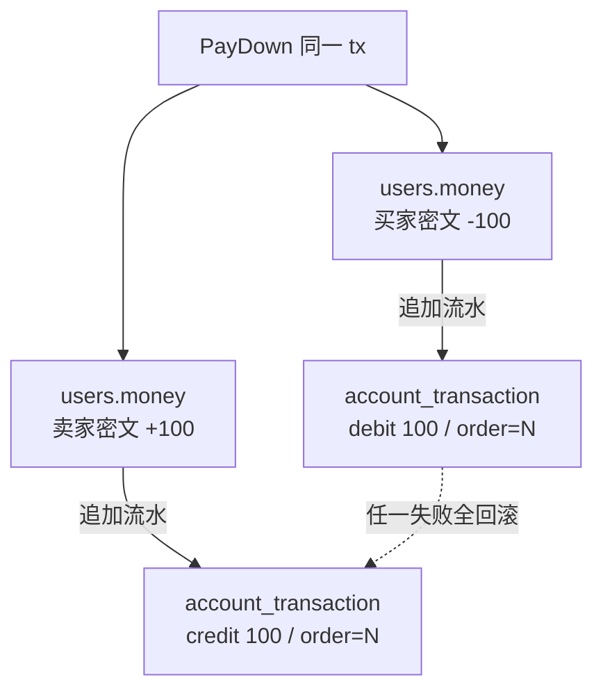

四个写落在**同一个事务**：要么 100 元从买家流到卖家、且两条流水都在，要么什么都没发生。**绝不会出现"余额改了但没流水"或"流水有了但余额没动"**——这正是早先单写余额列做不到的对账闭环。

### PayDown 同事务追加 debit / credit 两条流水

```go
// 买家扣款流水：与余额变动同事务追加
ledgerDao := money.NewLedgerDaoByDB(tx)          // 接管调用方的 tx
if err = ledgerDao.AppendTransaction(uId, order.ID,
    money.DirectionDebit, payable, buyerBalanceAfter,
    money.BizTypeOrderPay); err != nil { return err }
// ... 卖家余额读改写：bossBalanceAfter = bossMoney + payable ...
// 卖家入账流水：方向与买家相反，同一 order.ID
if err = ledgerDao.AppendTransaction(bossID, order.ID,
    money.DirectionCredit, payable, bossBalanceAfter,
    money.BizTypeOrderPay); err != nil { return err }
```

```go
// NewLedgerDaoByDB 接管调用方 tx，流水写入与余额变动同一原子提交
func NewLedgerDaoByDB(db *gorm.DB) *LedgerDao { return &LedgerDao{db} }
func (d *LedgerDao) AppendTransaction(userID, refOrderID uint,
    direction string, amountCents, balanceAfterCents int64,
    bizType string) error {
    return d.DB.Create(&AccountTransaction{
        UserID:            userID,
        Direction:         direction,
        AmountCents:       amountCents,
        RefOrderID:        refOrderID,
        BalanceAfterCents: balanceAfterCents,
        BizType:           bizType,
    }).Error
}
```

### 逐行讲解：流水追加的业务含义

- **`NewLedgerDaoByDB(tx)`**：**接管** PayDown 传进来的同一个 `tx`，而不是新开连接。这是"流水与余额同生共死"的命门——余额改了流水必在，流水写失败余额改动一起回滚。
- **买家 debit**：`payable`（折后实付）作为金额，`buyerBalanceAfter` 是**扣款后**的余额快照，方向 `debit`。
- **卖家 credit**：同一个 `order.ID`，金额相同，方向**相反**，`bossBalanceAfter` 是**入账后**余额。一借一贷成对出现 → 资金守恒。
- **两条都用 `payable`**：流水金额与实际余额变动**同口径**（都是折后实付），绝不会出现"流水记全价、余额扣折后价"的对账裂缝。
- **失败即回滚**：`AppendTransaction` 返回 error 直接 `return` → 整个 PayDown 事务回滚，余额、库存、订单状态、outbox 全部不落地。

### (ref_order_id, direction) 唯一索引：同单只入账一次

- 前置的 Idempotency 中间件已经在网关层拦掉了大部分重复请求（第七节），但**流水台账自己也要兜底**——纵深防御，不把幂等的责任全押在一层上。
- `(ref_order_id, direction)` 联合唯一索引：同一订单的 `debit` 最多一条、`credit` 最多一条。第二次试图为同一单追加同方向流水 → **唯一键冲突报错** → 调用方回滚整个事务。
- 业务含义：哪怕 Idempotency 失效、哪怕两个 goroutine 同时进了事务，**重复入账在 DB 层被物理挡死**，绝不会给卖家入两次账、给买家扣两次款。
- 与订单状态守卫 `MarkOrderPaidWithCheck`（`WHERE type=待付款`）形成**双重幂等**：一层在订单状态，一层在资金流水，同一笔支付任何一层都只放过一次。

> **幂等不是单点开关，是从网关（Idempotency）到业务（订单状态守卫）再到资金（流水唯一索引）的多层兜底。任意一层失守，下一层还能挡住重复扣款。**

### 资金台账全景：所有动钱路径都进复式记账台账

支付只是"动钱"的一种。gomall 把退款、预售、红包、拼团**所有会动余额的路径**都汇入同一本复式记账台账：

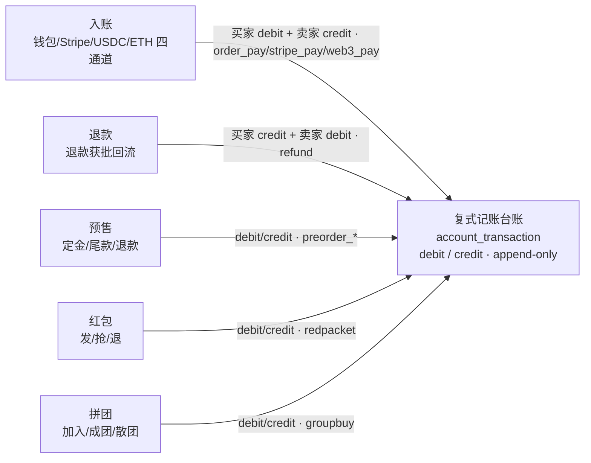

> **每次余额变动同事务追加不可变流水，对手方记平台清算账户，`SUM(debit)=SUM(credit)` 可对账。**

---

## 六、第三方支付：业务边界与熔断的运营 SOP

### 当前 gomall 的"第三方支付"是什么

- gomall 当前**未接真实支付宝 / 微信**（README 已写明业务边界），"扣买家、入卖家"在本地 DB 完成。
- 但 `/paydown` 已经挂了 `CircuitBreaker`——这是**给未来留位置**：
  - 接入真实网关后，链路会变成"DB tx + 同步 RPC 第三方"；
  - 第三方是慢依赖：p99 数百 ms + 会"集体抽风"（支付宝春节大促有 5–15 分钟级抽风历史）；
  - 不熔断 → goroutine 堆积 → 进程 OOM → 全站崩。
- 熔断的作用一句话：**宁可 5% 用户立即看到"稍后重试"，也不让 100% 用户白屏 30s。**

### 业务路线图：如何接入真实第三方而不重写代码

熔断器现在"空转"，是因为架构已经为真实网关留好了三步演进路径：

- **现状**：`PayDown` 内部直接操作本地 `users.money` 表。
- **路线图 step 1**：抽出 `PaymentGateway` interface，本地 DB 实现作为默认；接真实第三方时新增 `AlipayGateway` / `WechatGateway`。
- **路线图 step 2**：`PayDown` 的 TX 内只写"支付意图"行 + outbox；同步 RPC 走 `Gateway.Pay` 在熔断器内调；返回 ticket 给客户端。
- **路线图 step 3**：第三方回调 → 验签 → 翻订单状态 → outbox `order.paid`——与本 deck 的主链路无缝衔接。
- **已就位**：熔断器、幂等、outbox、业务码 `70002` 都已经在生产路径上跑过了——**接入真实网关不改架构，只换 Gateway 实现**。

### CircuitBreaker 的三态与用户体验

熔断器就是一个三态机，每个状态对应一句具体的客服话术：

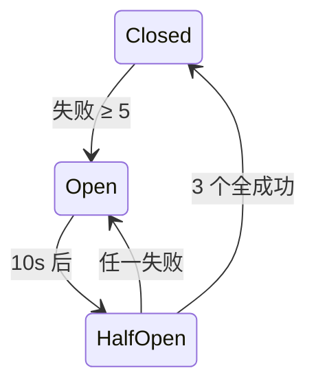

| 状态 | 用户体感 | 客服话术 |
|---|---|---|
| Closed | 正常下单 | "请正常付款" |
| Open | 立刻 70002 | "支付通道维护中，30 秒后请重试" |
| HalfOpen | 部分通过 | "正在恢复，您可能需要重试 1–2 次" |

### allow() —— 决定能否放行

```go
func (cb *circuitBreaker) allow() error {
    switch circuitState(cb.state.Load()) {
    case stateClosed:
        return nil                            // 热路径零开销
    case stateOpen:
        if time.Now().UnixNano()-cb.openedAt.Load() < int64(cb.opt.OpenTimeout) {
            return errCircuitOpen             // 未到自愈窗口
        }
        cb.mu.Lock(); defer cb.mu.Unlock()
        if circuitState(cb.state.Load()) == stateOpen { // double-check
            cb.state.Store(int32(stateHalfOpen))         // Open -> HalfOpen
            cb.halfOpenReq.Store(0)
        }
        if cb.halfOpenReq.Add(1) > cb.opt.HalfOpenMaxReq {
            return errCircuitOpen             // 探测配额满
        }
        return nil
    }
    return nil
}
```

### 逐行讲解：allow() 的业务含义

- **Closed 零开销**：只一次原子 `Load` → `return nil`，不抢锁不计数。前提是 paydown 不能因为加了熔断器就比 `/ping` 慢一个数量级。
- **Open 早返回**：99% 的 Open 期请求 **< 1 微秒返回**，不占 DB / 不占 Redis / 不占下游——给被压崩的第三方真正的喘息时间。
- **加锁切 HalfOpen**：只有自愈窗口的第一个请求加锁切状态，double-check 防两个 goroutine 同时切。
- **HalfOpen 探测配额 3**：半开期最多放 3 个试水请求——业务上就是"拿 3 个真实用户来证明下游恢复了"。
- **`report()` 配套**：3 个全成功 → 回 Closed；任一失败 → 立即重新 Open。运营视角就是"恢复了就立刻全放，再挂就立刻再断"。

### 失败的定义 + 阈值 5 / 10s / 3 的业务取舍

```go
failed := len(c.Errors) > 0 || c.Writer.Status() >= http.StatusInternalServerError
cb.report(failed)
```

- **只看 5xx 不看 4xx**：4xx 是密码错 / 余额不足等业务正常路径 → 不算熔断信号。`200 + 业务码 70001/70002` 也不算失败——业务码是**已知的拒绝**，不是**下游真挂**。
- **阈值 5**：1–2 次抖动是正常抖动，连续 5 次 = 真挂。阈值更小 = 熔太敏感，少量用户网络抖也熔；更大 = 熔太迟，雪崩已成。
- **OpenTimeout 10s**：第三方支付重启通常 5–30s，10s 是行业中位数。
- **HalfOpenMaxReq 3**：试 3 个够判定。再多 = 浪费用户体验；再少 = 抽样偏差大。

### 熔断打开期间的运营 SOP（最重要）

熔断打开不只是代码翻了个状态，它是一连串**运营动作**的发令枪：

| 时刻 | 谁做什么 |
|---|---|
| T+0s | 监控告警：paydown 5xx 连续 ≥ 5 → `state=Open` |
| T+5s | 自动钉钉：@支付 oncall + @客服主管 |
| T+10s | 客服群发话术："支付通道维护中，30s 后重试，造成不便已发放 5 元无门槛券" |
| T+10s | 运营评估：是否切备用通道（路线图） / 是否触发"补偿券回赠" |
| T+10–40s | HalfOpen 探测期，每 10s 一次状态推送 |
| T+40s | 若 Closed：全量恢复 + 发推文道歉；若仍 Open：升级 P1 故障会议 |

> **熔断不仅是技术开关，更是运营决策的触发器：是否切通道 / 是否发补偿 / 是否对外公告，都挂在 `state=Open` 这一个事件上。**

### 补偿券回赠：把"5% 损失"转成"10% 复购"

熔断打开的那 10 秒，与其让用户"无声地崩了"，不如把这次故障转成一次品牌接触点：

- 熔断打开 10 秒钟，估计影响 **200–500** 个真实下单用户。
- 自动监控触发 → 给受影响用户发"5 元无门槛券，48h 有效"。
- 行业数据：补偿券回赠 → **40%+** 用户当周回访下单。
- 算账：发 200 张 5 元券 = 平台成本 1000 元；挽回 80 单 = GMV 8000 元 + 长期 LTV 数倍。
- 这是**把故障转成品牌资产**的标准动作，比"无声崩了"价值高 1–2 个量级。

> **支付熔断 = 业务事件，不是技术事件。运营 / 客服 / 财务都在听这个信号。**

---

## 七、幂等：重复扣款是客服 top1 客诉

### "重复扣款"客诉的真实路径

- 客诉占比：电商支付类客诉中"重复扣款"长期排**第 1–2 位**。
- 单笔重复扣款的处理成本：客服 **12 分钟**（核身 + 查证 + 上工单）+ 财务退款 **T+1** + 用户负面口碑。
- 单笔金额 100 元 → 平台成本 **30–50 元**（人工 + 退款手续费 + 口碑损失）。
- 防"重复扣款"的 ROI 极高 → 任何一笔被幂等拦下来都是赚的。

> **重试是客户端的权利，幂等是服务端的义务。两者共同维护"恰好一次"。**

### 为什么熔断器之后还要挂幂等

熔断器和幂等看着都在"接口前面"，但它们保护的是完全正交的两件事：


- 熔断器关心**保护下游**（5xx 多了断开）。
- 幂等关心**保护用户钱包**（同一笔单只扣一次）。
- 两个目标正交，必须**同时**挂——熔断挡不住重复扣款，幂等也救不了雪崩。
- 返回 `200 + status=70002`，HTTP 状态仍是 200 → app 端老网关不会按 5xx 逻辑去重试或报错。

### 客户端的重试时序（关键业务约定）

重试本身没错，错的是"重试时换了一个 Idempotency-Key"。这条时序是写进 SDK 对接文档第一页的契约：

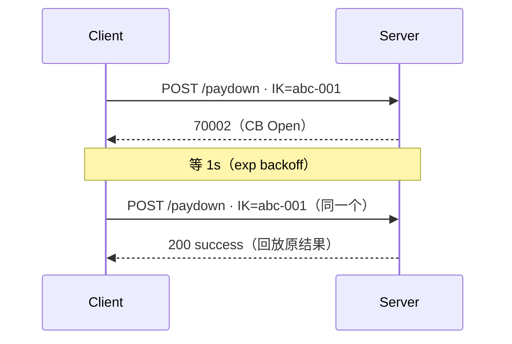

**重试必须带原 Idempotency-Key**——万一原请求其实成功了（CB 误判 / 网络分区），第二次会被 Idempotency 拦下、返回**原结果**，绝不二次扣款。这是**客户端 SDK 必须遵守的契约**。

### Idempotency 中间件的 responseRecorder

```go
// responseRecorder 拷贝写入的响应体，便于幂等命中时回放
type responseRecorder struct {
    gin.ResponseWriter
    body *bytes.Buffer
}
func (r *responseRecorder) Write(b []byte) (int, error) {
    r.body.Write(b)                        // 旁路缓存
    return r.ResponseWriter.Write(b)       // 同时真写出去
}

// 主流程末尾:
recorder := &responseRecorder{ResponseWriter: c.Writer, body: bytes.NewBuffer(nil)}
c.Writer = recorder
c.Next()
if len(c.Errors) > 0 || recorder.Status() >= http.StatusBadRequest {
    cache.ReleaseIdempotencyLock(c.Request.Context(), key)   // 失败: 回 init
    return
}
cache.CommitIdempotencyResult(c.Request.Context(), key, recorder.body.String())
```

### 逐行讲解：responseRecorder 解决了哪个客诉

- **嵌入 `gin.ResponseWriter`**：包一层而非替换，`Header` / `Status` / `Hijack` 透明转发，链路下游无感。
- **双写**：先写 `bytes.Buffer` 再调原 `Writer.Write`——顺序很重要，反过来的话客户端断连时缓存会写不完整。
- **失败回滚到 init**：4xx 或 `c.Errors` → 同 IK 还能再试（业务失败 ≠ 永久失败）——对应"我密码输错了、重输一次不行吗"这类合理诉求。
- **成功提交到 done**：把完整 JSON 写进 Redis done 态 → 后续同 IK 由 Lua 直接回放，**业务代码不再执行**——这是"重复扣款"客诉归零的关键。

### Lua 脚本里的四态机 + 业务码 + 客服话术

幂等的真正状态机在 Lua 脚本里，`init → processing → done` 三态外加一条回滚边：

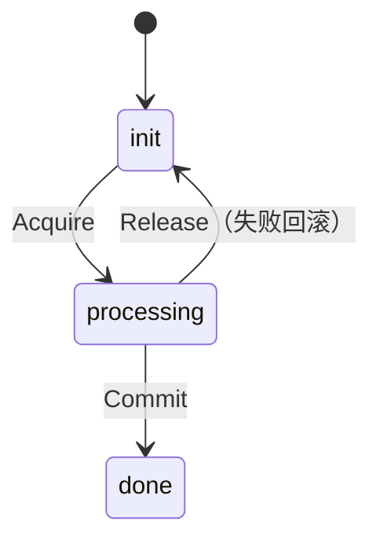

| 状态码 | 含义 | 客户端动作 | 客服话术 |
|---|---|---|---|
| 30001 | token 错误 | 重登录 | "请重新登录" |
| 60001 | IK 不存在/过期 | 重新申领 | "刷新页面再试" |
| 60002 | 幂等命中处理中 | 等 1s 再试 | "正在处理，请稍候" |
| 70001 | 限流 | 退避重试 | "请求过频，稍后再试" |
| 70002 | 熔断 Open | 指数退避 + 带原 IK | "支付通道维护中" |

`Acquire` 把状态从 init 推进到 processing（拿到这次处理权）；成功后 `Commit` 落到 done（结果可回放）；中途失败则 `Release` 打回 init（允许原 IK 重试）。同一个 IK 在 processing 态并发进来的请求，直接拿到 `60002`——"正在处理，请稍候"。

### 客服话术帧：用户报"扣了钱订单还显示未支付"

这是支付类客诉里最典型的一句话。客服照下表两两对照 DB 状态即可定位：

| 表征 | 排查路径 |
|---|---|
| DB 余额已减 + order=UnPaid | **不可能**，TX 原子。让用户清缓存刷新 |
| DB 余额未减 + order=UnPaid | 真的没扣，让用户重试 |
| DB 余额已减 + order=PendingShipping + 前端显示 UnPaid | 前端缓存问题，让用户下拉刷新；底层正常 |
| 返回 60002 | 让用户等 1 秒；上一次请求仍在处理 |
| 返回 70002 | 通道维护中，30s 后重试；自动发 5 元补偿券 |
| 返回 30001 | token 过期，让用户重新登录后原 OrderId 仍可付 |

> **客服不查代码，只查业务码 + DB 状态两件事就能判断 90% 的支付客诉。这是业务码表存在的根本意义。**

---

## 八、失败兜底、SLO 与压测数字

### 支付失败链路 —— Saga 回滚

支付失败不需要复杂的补偿逻辑，因为 TX 回滚后"库存从未真扣"，剩下的只是超时关单：

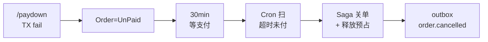

- 支付失败 = TX 回滚 = `order.Type` 仍 UnPaid，库存**从未真扣**。
- 30min 未续支付 → Cron + RMQ 双保险（deck 09）→ `CancelUnpaidOrder`。
- Saga 不回写 `product.Num`（从未扣过），仅释放 Redis `reserved`；满减预算的退还由 promo 侧消费 `order.cancelled` 事件异步完成。

### CancelUnpaidOrder 的幂等设计

```go
err = baseDao.DB.Transaction(func(tx *gorm.DB) error {
    ok, err := NewOrderDaoByDB(tx).CloseOrderWithCheck(orderNum)
    if err != nil { return err }
    if !ok { return nil }                  // 已被别处关过, no-op
    closed = true
    return outbox.NewOutboxDaoByDB(tx).Insert(
        "order", "OrderCancelled", "order.cancelled", order.ID,
        events.OrderCancelled{
            OrderID: order.ID, OrderNum: orderNum,
            UserID: order.UserID, ProductID: order.ProductID,
            Num: order.Num, Reason: "timeout",
            PromoRuleID:        order.PromoRuleID,        // 满减自包含
            PromoDiscountCents: order.PromoDiscountCents, // 预算异步退还
        },
    )
})
```

`CloseOrderWithCheck` 用 `WHERE type=待付款` 条件 update，第二次调用自然 `affected=0` → 函数变 no-op。这是**用 DB 行做幂等键**。Redis 释放走 TX 外，失败仅记日志、由对账兜底；满减预算的退还**不在关单事务里同步做**——事件载荷自带 `promo_rule_id / promo_discount_cents`，promo 侧消费 `order.cancelled` 异步退还（幂等台账，OrderID 唯一索引）。业务承诺：**用户 / 客服 / Cron / RMQ 四个调用方都能反复点关单，库存绝不漏放。**

### 满减实付口径：为什么不能用折前价计费 / 退款

- 一个满减订单：商品 `Money*Num = 100` 元，命中"满 80 减 20"，用户**实际只付 80**（`FinalCents = 80`）。
- **扣款若用折前价 100**：买家被多扣 20 元——满减优惠被吞掉，直接客诉 + 平台信任受损（"明明满减了还按原价扣"）。
- **退款若用折前价 100**：用户只付了 80，却退回 100——平台**超额退款 20 元资损**。更糟的是满减预算已随 `order.refunded` 事件由 promo 侧退还，钱包再按原价退 = **双重退还**。
- 统一解法：payment 扣款与 refund 退款**都取折后实付 `FinalCents`**，只有 `FinalCents` 未写入（老订单 / 老客户端没读这字段）时才回退 `Money*Num` 兜底。

> **满减订单的"应收 / 应退"金额只有一个口径：用户实付 `FinalCents`。计费用折前价多扣买家，退款用折前价超退资损——两头都是钱，必须统一。**

### 退款侧的实付口径（与支付侧对齐）

```go
// 退款额取实付口径，与 payment 侧保持一致：命中满减以折后实付 FinalCents 为准，
// 仅当 FinalCents 未写入（<=0）时回退到折前价 Money*Num。
// 用折前价会把满减优惠重复退还（promo 已随事件退预算，钱包再按原价退即双重退还）
amount := order.FinalCents
if amount <= 0 {
    amount = order.Money * int64(order.Num)
}
```

退款侧的回退判据是 `FinalCents <= 0`（未写入才回退），与支付侧用 `PromoRuleID != 0`（命中即取折后价）略有差异：退款拿到的是已落库订单，`FinalCents` 一定已写定，`<= 0` 只为兼容历史脏数据。`amount` 随 `order.refunded` 事件下发，下游 wallet 服务据此退款；满减预算退还由 promo 侧消费同一事件**异步**完成（事件自带 `promo_rule_id / promo_discount_cents`），两者各退各的、不重不漏。

### 支付链路 SLO 承诺

这些不是口号，每一条都有实测数字对照和兜底机制：

| 指标 | 承诺值 | 实测对照 | 兜底机制 |
|---|---|---|---|
| 可用率 | 99.95% | 全链 idempotency 50K RPS 0% err | CB + outbox + Saga |
| p99 延迟 | < 500 ms | p95 2.33 ms（idempotent replay） | responseRecorder cache |
| 重复扣款率 | 0 | 755K req → 1 DB row | Lua done 态回放 |
| 扣款不出货 | 0 | outbox 与 TX 原子 | deck 11 outbox 主题 |
| P0 不挂限流 | ✓ | /paydown 路由仅挂 CB + Idem | 不挂 TokenBucket/SW |

"P0 不挂限流"是**业务承诺**：宁可下游慢、不能上游 429。下单 / 支付靠缓存 + 异步削峰扛峰值（deck 10）。

### 基线对照：两个中间件接入后的吞吐

| 链路 | RPS | p95 |
|---|---:|---:|
| /ping 基线（无中间件） | 64,254 | 3.51 ms |
| /product/show（无 CB / 无 Idem） | 62,226 | 3.01 ms |
| /orders/create（**Idempotency**） | 50,319 | 2.33 ms |
| /skill_product/skill（RateLimit） | 52,082 | 1.24 ms |

- Idempotency 让吞吐从 62K 降到 50K，约 **19% 损耗**，换来的是"755K 请求 → 1 笔订单"的强幂等。
- 业务侧的取舍：**19% 吞吐 vs 0 起重复扣款客诉**，毫无悬念选后者。
- CircuitBreaker Closed 态**零锁开销**（仅 `atomic.Load`），吞吐影响可忽略。

### Idempotency 的极限场景：755K 请求 → 1 笔订单

- 50 VU × 15s 用**同一个 IK** 反复打 `/orders/create`。
- 累计 **755,033 次请求**，DB 实际订单数 **= 1**：
  - `SELECT COUNT(*) FROM \`order\` WHERE user_id=10 AND created_at > NOW() - 2 MIN` → 1
- 第一次走完业务后，后续全部由 Lua 读 `done` 态直接回放 → 50K RPS。
- **业务承诺**：客户端在熔断反复触发期间无脑重试 10K 次，仍只扣一次款——这是写进 SDK 文档的合同。

> **压测数字背后是合同：重复扣款率 = 0。客服 / 财务 / 风控都靠这个承诺生存。**

### 把 paydown 的设计翻译成业务承诺

整份 deck 的技术选择，都能翻译成一条产品 / 运营 / 客服三方都能背的业务承诺：

| 技术选择 | 业务承诺 |
|---|---|
| AES-128-CBC + 双密钥 | DBA 拿 dump 也看不到余额 |
| 6 位支付密码不存盘 | 整库泄漏没密码也解不开 |
| 单次 TX 多件事原子 | 不会出现"扣了钱没改订单" |
| debit/credit 流水同事务 | 余额必有流水，全表借贷恒等，可对账 |
| 实付取 FinalCents | 满减不多扣买家、退款不超退资损 |
| outbox 在 TX 内写 | 不会出现"扣了钱下游没收到" |
| CircuitBreaker 5/10s/3 | 第三方挂了 5% 用户受影响，不是 100% |
| Idempotency 全程伴随 | 重试 10K 次也只扣一次 |
| Saga 30min 关单 | 用户忘付款，库存自动释放 |
| 业务码 60002/70002/30001 | 客服查码即可定位 90% 客诉 |

每一条承诺，都在代码里找得到对应的位置。

### 业务边界回顾：本支付不做什么（再次诚实）

deck 结尾再诚实划一次边界，比"全堆 feature"更能取信商家和合规：

- **不真接支付宝 / 微信 / 银联**——路线图 step 1
- **不做实名 KYC**——持牌支付公司的事
- **不做风控引擎**——路线图 step 2
- **不做反洗钱**——独立合规系统
- **不做商家分账**——路线图 step 3
- **不做发票管理**——财税系统
- **未做清单完整版**：`docs/architecture/feature-matrix.md`

> **诚实划边界给商家 / 合规一个交代，比"全堆 feature"更可信。MVP 阶段把扣款 + 入账 + 状态机推进 + 防重做到工业级。**

---

## 附录 A：面试 Q&A

**Q1：为什么金额不直接 `decimal` 存，非要 AES？**
A：合规审计要求"敏感金额字段不得明文落盘"。AES + 服务端密钥 + 用户密码双因子，DBA 拿 dump 也解不开。代价是 SQL 不能 `SUM`，业务侧用结算服务批跑兜底。

**Q2：为什么不接真实支付宝？**
A：MVP 阶段聚焦交易闭环，第三方对接由 wallet 服务消费 outbox 完成（路线图）。**熔断器 + 幂等 + outbox 已就位**，接入只换 Gateway 实现，不改架构。

**Q3：熔断打开期间用户体验怎么办？**
A：(1) 立即返回 70002 + 客服话术（"通道维护中，30s 后重试"）；(2) 自动发 5 元补偿券回赠；(3) 监控触发 oncall + 客服群通知。运营 SOP 见第六节。

**Q4：为什么支付密码不存数据库？**
A：用户每次手输，整库 dump 也解不开。代价 = 用户每次支付要手输；收益 = 任何拖库事件都不会暴露余额。客服重置走"核身 + 余额冻结 48h"流程。

**Q5：支付密码输错了，用户会看到什么？**
A：`DecryptMoney` 把"错误密钥去填充 panic / 解出乱码"统一折叠为 `ErrMoneyKeyIncorrect`（支付密码错误），TX 回滚不扣款。早期实现这条路径会 panic 带崩整个请求；穷举防护交给限流 + 熔断 + 幂等三层，不靠含混报错。

**Q6：为何不用 Redis 分布式锁做幂等，要用 Lua？**
A：分布式锁只解决"不重入"，不解决"结果回放"。Lua 是真状态机（init/processing/done）：第一次走完后，同 IK 请求直接在 Lua 内回放，**不进业务代码**。

**Q7：CircuitBreaker 阈值 5 / 10s / 3 怎么调的？**
A：5 = 防误熔（1–2 次抖动不算）；10s = 第三方重启中位数；3 = HalfOpen 探测样本够。当前硬编码，路线图改成 env 配置 + 按时段动态调整。

**Q8：支付链路怎么保证 P0 不挂限流？**
A：`/paydown` 路由**只挂 CB + Idem**，不挂 TokenBucket / SlidingWindow。上游靠下单 + 缓存削峰，下游靠熔断保护——宁可下游慢、不能上游 429。

---

## 附录 B：代码位置一览

本 deck 涉及的代码分布在这几处，按讲解顺序对照阅读：

- **PayDown 主体**：扣款 / 入账 / 减库存 / 改单 / 写 outbox 的同事务实现；
- **资金台账 / 复式记账**：`account_transaction` 表 + `LedgerDao.AppendTransaction`；
- **实付口径 FinalCents**：支付侧与退款侧的折后实付统一；
- **台账 AutoMigrate 注册**：`account_transaction` 建表迁移；
- **AES 加解密**：`EncryptMoney` / `DecryptMoney`；
- **CircuitBreaker**：`allow()` / `report()` 三态机；
- **Idempotency**：`responseRecorder` + Lua 四态机；
- **paydown 路由 + 中间件栈**：仅挂 CB + Idem，不挂限流；
- **支付失败 Saga**：`CancelUnpaidOrder` / `CloseOrderWithCheck`；
- **业务码表**：`30001 / 60001 / 60002 / 70001 / 70002`；
- **压测数字**：idempotency 50K RPS / 755K → 1；
- **业务边界 / SLO**：`docs/architecture/feature-matrix.md`。

> **配套：deck 01（鉴权 / 双 token） / deck 04（下单 + outbox） / deck 09（关单 + 状态机） / deck 11（一致性主题）。**
