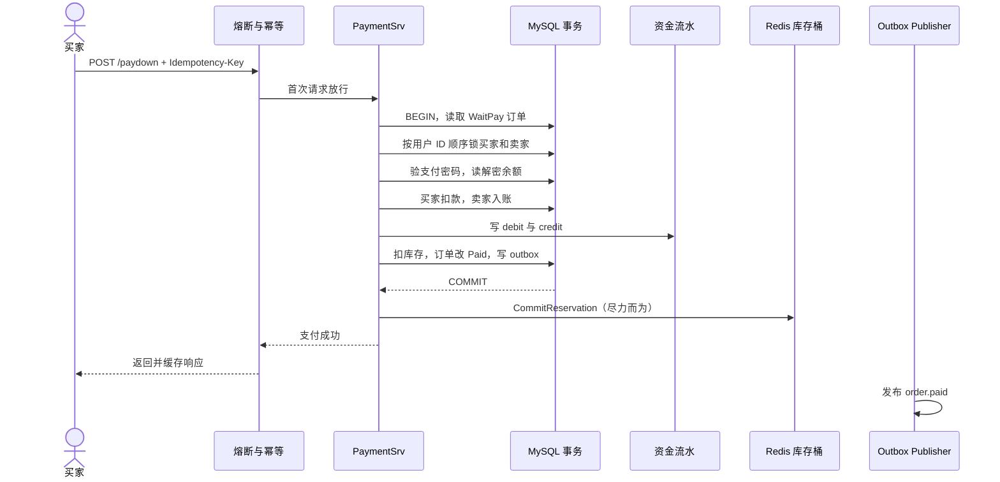

# 支付：一笔余额怎样安全地从买家转给卖家

> 这一讲沿着 `POST /api/v1/paydown` 走完一次余额支付。我们不展开所有支付渠道，只回答四个问题：扣多少钱、如何避免重复扣、余额与流水怎样一起提交、支付成功后订单和库存如何推进。

## 本讲安排（60 分钟）

| 时间 | 内容 | 核心问题 |
|---|---|---|
| 0–7 分钟 | 支付的业务边界 | “接口成功”为什么不等于“钱处理正确” |
| 7–15 分钟 | 路由上的两道门 | 熔断和幂等分别防什么 |
| 15–34 分钟 | `PayDown` 资金事务 | 锁、验密、扣款和入账怎样原子完成 |
| 34–44 分钟 | 复式流水与对账 | 为什么只有余额列无法解释客诉 |
| 44–51 分钟 | 统一结算尾段 | 订单、库存、商品归属和事件怎样一起推进 |
| 51–56 分钟 | Redis 核销与失败边界 | 为什么缓存失败不能回滚已支付订单 |
| 56–60 分钟 | 演示、回顾和提问 | 用一笔重复请求验证底线 |

正文控制在约 56 分钟，最后 4 分钟用于演示和收束。

## 一、业务场景：用户最怕“钱扣了，订单没变”

小林给一笔订单付款。系统要同时改变买家余额、卖家余额、两条资金流水、商品库存、订单状态、商品归属和 outbox 事件。少一步，客服就很难回答“钱到底去哪了”。

先把边界说清：本讲的 `/paydown` 是站内余额转账，不是银行卡网关。Stripe 与 Web3 各有独立入口，但三条渠道最终复用同一段订单结算代码。

一笔成功支付要守住四条约束：

1. 应付金额取订单，不能取支付请求。
2. 买卖双方余额与资金流水在一个 MySQL 事务里提交。
3. 订单只能从 `WaitPay` 推进一次。
4. MySQL 已提交后，Redis 预留核销失败只能告警和补偿，不能把钱“回滚一半”。

## 二、请求先过两道门：熔断和幂等

路由顺序如下：

```go
authed.POST("paydown",
    middleware.CircuitBreaker(middleware.CircuitBreakerOption{
        FailureThreshold: 5,
        OpenTimeout:      10 * time.Second,
        HalfOpenMaxReq:   3,
    }),
    middleware.Idempotency(),
    OrderPaymentHandler(),
)
```

### 幂等防重复副作用

客户端必须携带 `Idempotency-Key`。第一次请求进入业务；相同用户和 token 的并发请求得到“处理中”；完成后再请求，会回放第一次的 JSON。

这能挡住双击和网络重试，但支付服务仍要自己设防，因为中间件缓存或网络都可能失效。代码中有两层业务兜底：

- `order.Type` 必须是 `OrderWaitPay`；
- 资金流水用订单和方向的唯一约束拒绝重复 debit 或 credit。

### 熔断防持续故障拖垮进程

熔断器连续看到 5 次失败后打开 10 秒；随后最多放 3 个半开探测请求，全部成功才关闭。它按 Gin 错误或 HTTP 5xx 判断失败。

这里有个值得讨论的事实：项目许多业务错误仍用 HTTP 200 返回。如果 handler 没把错误写入 `c.Errors`，熔断器可能把业务失败当成成功。这说明“装了熔断器”不等于监测语义天然正确，错误出口必须统一。

两道门的职责不要混：幂等保护一笔请求不重复执行，熔断保护系统在连续故障时少做无效工作。

## 三、标准时序：一次余额支付



如果事务中任一步失败，MySQL 回滚全部余额、流水、订单与库存变更。Redis 核销在提交后执行，属于另一致性层。

## 四、读 `PayDown`：资金事务的前半段

### 1. 订单决定收款信息和金额

`PayDown` 的请求只需要订单 ID 和支付密码。`BossID`、`ProductID`、数量和金额全部从订单读取。

```go
order, err := orderpkg.NewOrderDaoByDB(tx).GetOrderById(
    req.OrderId, u.Id,
)
if err != nil {
    return err
}
if order.Type != consts.OrderWaitPay {
    return errors.New("订单状态非未支付，无法重复支付")
}

bossID := order.BossID
payable := orderPayableCents(order)
```

统一金额函数处理了一个容易漏的边界：命中全额优惠时 `FinalCents` 可以为 0，所以不能用 `FinalCents > 0` 判断有没有促销。

```go
func orderPayableCents(o *order.Order) int64 {
    if o.PromoRuleID != 0 {
        return o.FinalCents
    }
    return o.Money * int64(o.Num)
}
```

### 2. 按固定顺序锁两个人

买家 A 可能向卖家 B 付款，同时 B 又向 A 付款。如果两个事务都“先锁买家，再锁卖家”，它们会各拿一把锁并互相等待。`LockTwoUsersForUpdate` 按用户 ID 升序锁定双方，所有事务遵守同一顺序，锁环就难以形成。

```go
buyer, boss, err := userDao.LockTwoUsersForUpdate(uId, bossID)
if err != nil {
    return err
}
if !buyer.CheckMoneyPassword(req.Key) {
    return user.ErrMoneyKeyIncorrect
}
```

支付密码做二次确认，不是数据库加密密钥。卖家余额必须用服务端规则解密，不能拿买家的支付密码去处理另一个账户。

### 3. 在同一事务内扣款、入账

```go
userMoney, err := buyer.DecryptMoney()
if err != nil {
    return err
}
if userMoney-payable < 0 {
    return errors.New("金额不足")
}

buyerBalanceAfter := userMoney - payable
buyer.Money = strconv.FormatInt(buyerBalanceAfter, 10)
buyer.Money, err = buyer.EncryptMoney()
if err != nil {
    return err
}
if err = userDao.UpdateUserById(uId, buyer); err != nil {
    return err
}
```

卖家侧执行对称的加款。任何一次解密、加密或更新失败都会返回错误，外层事务整体回滚。

余额加密能降低数据库明文泄露风险，却让 SQL 无法直接 `SUM(money)` 做对账；密钥管理、轮换和审计也要额外设计。本项目展示的是站内钱包模型，不等同于持牌支付系统。

## 五、为什么还要写复式流水

只有 `user.money`，你只能看见“现在有多少钱”，无法回答“为什么变成这个数”。资金流水记录每次变化后的证据：用户、订单、方向、金额、变更后余额和业务类型。

```go
ledgerDao := money.NewLedgerDaoByDB(tx)
if err = ledgerDao.AppendTransaction(
    uId, order.ID, money.DirectionDebit,
    payable, buyerBalanceAfter, money.BizTypeOrderPay,
); err != nil {
    return err
}

if err = ledgerDao.AppendTransaction(
    bossID, order.ID, money.DirectionCredit,
    payable, bossBalanceAfter, money.BizTypeOrderPay,
); err != nil {
    return err
}
```

一笔订单应该有一条买家 debit 和一条卖家 credit，金额相等、方向相反。课堂上用这条对账式即可，不展开会计数学：

`订单支付的 debit 总额 = 同订单的 credit 总额 = orderPayableCents(order)`

流水与余额在同一事务里写。若流水唯一约束冲突，整个事务回滚，这比“先扣余额，稍后异步补流水”更容易解释和修复。

注意：流水是可追溯证据，不自动保证所有业务都正确。退款、红包、人工调账等每一种资金入口都必须走同一套台账规则。

## 六、统一结算尾段：资金完成后还要做什么

余额、Stripe 和 Web3 的资金来源不同，但订单结算动作相同。`finishOrderSettlementTx` 把它们收进一处：

```go
func finishOrderSettlementTx(tx *gorm.DB, o *order.Order) error {
    ok, err := product.NewProductDaoWithDB(tx).
        DeductStock(o.ProductID, o.Num)
    if err != nil || !ok {
        return errors.New("存在超卖问题")
    }

    paidOK, err := order.NewOrderDaoByDB(tx).
        MarkOrderPaidWithCheck(o.ID, o.UserID)
    if err != nil || !paidOK {
        return errors.New("订单状态已变更，无法重复支付")
    }

    // 创建归属买家的下架商品副本，随后写 order.paid outbox
    return outbox.NewOutboxDaoByDB(tx).Insert(
        "order", "OrderPaid", "order.paid", o.ID,
        events.OrderPaid{OrderID: o.ID, OrderNum: o.OrderNum,
            UserID: o.UserID, ProductID: o.ProductID, Num: o.Num},
    )
}
```

这里有两道并发保险：条件扣库存防止数据库层超卖，`MarkOrderPaidWithCheck` 只允许 `WaitPay → Paid`。即使幂等中间件漏过了重复请求，第二次也不能再次推进状态。

项目采用二手交易模型，支付后会为买家创建一份 `OnSale=false` 的商品记录。讲解时要点明这是业务选择，不是所有商城都需要的通用步骤。

## 七、事务提交之后：Redis 只做缓存视图核销

```go
err = orderDao.Transaction(func(tx *gorm.DB) error {
    // 余额、流水与 finishOrderSettlementTx
    return finishOrderSettlementTx(tx, order)
})
if err != nil {
    return nil, err
}

commitReservationBestEffort(ctx, paidProductID, paidNum)
```

此时数据库已经真正扣减库存并记录支付，Redis 的 `reserved` 只是快速库存视图。核销失败只记录日志，不能反向撤销数据库支付；否则会把一个已提交的资金事务变成更难处理的跨存储半事务。

正确补救是监控失败日志，并用数据库订单与 Redis 桶做对账。若差额存在，重建缓存或补跑核销。

## 八、课堂演示（3 分钟）

同一个订单、同一个 `Idempotency-Key` 连续调用两次 `/api/v1/paydown`。观察：

- 第二次是否回放响应，或被订单 `WaitPay` 守卫拒绝；
- 买家和卖家余额各只变化一次；
- `account_transactions` 中只有一条 debit 和一条 credit；
- `outbox` 中只有一条对应的 `order.paid`。

环境不便运行时，可以在事务闭包入口和 `MarkOrderPaidWithCheck` 设置断点完成同样的讲解。

## 九、收束（1 分钟）：拿一张检查表离开

评审支付代码时依次问：

- 金额是否来自权威订单，促销和零元单口径是否统一？
- 余额、流水、订单、数据库库存与事件是否落在同一事务？
- 双方账户是否按固定顺序加锁？
- 中间件失效后，订单状态和唯一索引还能否挡住重复支付？
- Redis 或 MQ 失败后，系统是否有日志、重试和对账入口？

一句话记忆：**支付不是改一个余额字段，而是让资金、流水、订单和库存用同一次提交说出同一个结果。**

## 课后延伸

- 阅读 `middleware/circuitbreaker.go`，分析 HTTP 200 业务错误如何影响失败统计。
- 为“事务提交成功、Redis 核销失败”设计一条可重复执行的修复任务。
- 比较余额支付与 Stripe webhook 的鉴权来源，但不要复制统一结算尾段。
- 设计一条退款流水，并说明它与原支付流水如何关联。

代码入口：`internal/payment/service.go`、`internal/payment/settle.go`、`internal/money/ledger_repo.go`、`middleware/idempotency.go`、`middleware/circuitbreaker.go`。
