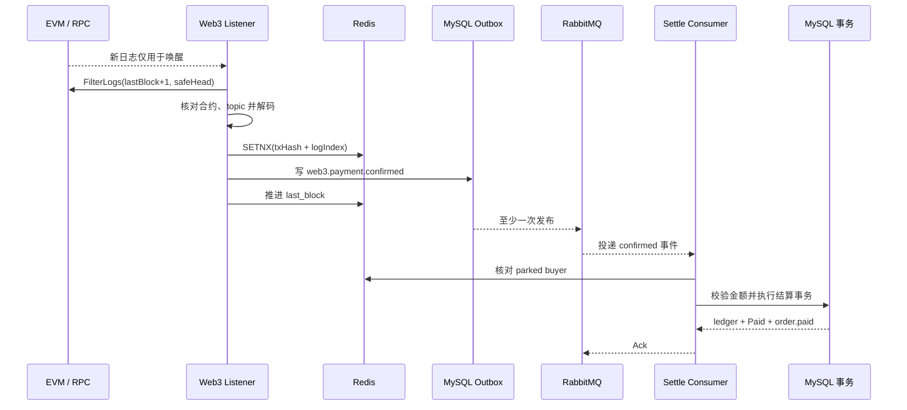

# Web3 支付（下）：把链上事件可靠地结算进订单

> 上一讲已经得到一条候选付款证据：`PaymentConfirmed(orderID, buyer, amount)`。这一讲不再重复签名流程，只追问链下系统怎样接纳它，以及在哪些地方仍可能丢、重、错。

## 本讲目标

讲完后，学生应该能沿代码说明：

- listener 为什么把订阅当作唤醒信号，把确认区间回扫当作事实来源；
- `safeHead`、watermark 和 `txHash + logIndex` 分别解决什么问题；
- 消费者为什么还要核对 buyer、amount 和订单状态；
- 数据库事务怎样完成卖家入账、库存扣减与订单状态推进；
- 可重试错误、毒消息和 DLQ 应该怎样分流；
- 当前实现在哪些故障窗口下仍会漏结算或需要人工对账。

## 一、承接：日志出现了，为什么还不能发货

上一讲的承接题里，区块 1,000 出现付款事件，链头后来到 1,020。若确认深度配置为 12，`safeHead = 1008`，高度 1,000 已进入本轮可处理区间。

但“RPC 返回这条日志”仍不等于“订单已入账”。链下还要经过四道关口：确认范围、事件来源与格式、订单业务校验、数据库事务。RabbitMQ 至少一次投递意味着某些步骤还会重复执行。

这一讲只画结算半程：



注意这不是全系统总图，它从已经发生的合约事件开始。

## 二、listener：订阅负责快，回扫负责不漏

`StartPaymentListener` 读取 RPC、合约地址和确认深度。缺少 RPC 或合约地址时，它会记录“跳过启动”并返回 nil，主进程仍能启动；这对非 Web3 环境方便，但生产配置漏填时也可能静默失去结算能力，必须用启动检查或监控补上。

建立连接后，listener 订阅新日志，却不直接处理订阅消息：

```go
case <-logsCh:
    // 日志本体丢弃，只把通知当作扫描触发器
    if err := l.scanConfirmed(ctx, client); err != nil {
        util.LogrusObj.Warnf("scan(on-log) err=%v", err)
    }
case <-ticker.C:
    if err := l.scanConfirmed(ctx, client); err != nil {
        util.LogrusObj.Warnf("scan(tick) err=%v", err)
    }
```

原因有两个。刚出现的日志通常没达到确认深度；订阅还可能断线。定时回扫让“当时没确认”和“断线时错过”的日志回到同一条处理路径。

### 扫描区间怎样计算

```go
head, err := client.BlockNumber(ctx)
if head < l.confirmDepth {
    return nil
}
safeHead := head - l.confirmDepth

last := l.loadLastBlock(ctx)
from := last + 1
if last == 0 {
    from = safeHead
}
logs, err := client.FilterLogs(ctx, l.query(
    new(big.Int).SetUint64(from),
    new(big.Int).SetUint64(safeHead),
))
```

默认确认深度是 12。若 `last_block=995`、当前链头为 1,020，本轮扫描 `[996, 1008]`。1,009 之后的日志继续等待。

首次启动没有游标时，代码直接从当前 `safeHead` 起步，不会自动回放更早历史。这避免无边界地扫整条链，但首次部署或 Redis 丢失后必须有人给出可信起点，否则旧付款永久留在扫描范围之外。

### watermark 为什么不能越过失败区块

listener 记录第一个处理失败的区块，只把游标推进到它之前。下一轮会重新扫描失败区块；已经处理过的事件则交给去重机制挡住。

这比“循环结束后无条件写 safeHead”安全。后者会把失败事件留在游标后面，后续扫描再也看不到。

## 三、先核对来源，再谈去重

`handleLog` 先检查日志来自配置的 escrow 合约，并核对 `topic[0]` 是 `PaymentConfirmed`。然后从 topic 和 data 中解码 orderID、buyer、amount，附上交易哈希、日志序号和区块高度。

这里承接上一讲的 ABI 契约问题：Solidity 当前把 buyer 声明为 `indexed`，listener 内嵌 ABI 却按非 indexed 解码。若不先修正并用真实日志测试，后面的可靠性设计没有输入可处理。

每条日志的去重 key 是：

```go
dedupeKey := fmt.Sprintf(
    "web3:event:%s:%d", lg.TxHash.Hex(), lg.Index,
)
first, err := l.tryClaim(ctx, dedupeKey)
if err == nil && !first {
    return nil
}
```

同一交易可以发多个事件，所以只有 txHash 不够；`logIndex` 区分同一交易里的日志。SETNX key 保存 72 小时。Redis 不可用时 listener 选择继续写 outbox，依靠后面的订单状态和流水唯一约束收敛重复。

### 当前去重顺序会漏事件

现有顺序是：

1. Redis SETNX 抢到 key；
2. 写 `web3.payment.confirmed` outbox；
3. 某个区块全部处理成功后推进 watermark。

如果第 1 步成功、第 2 步失败，watermark 不推进，下一轮确实会重扫；可 SETNX key 还在，日志被当成重复直接跳过，于是 outbox 永远没有这条事件。

修复方向不是简单缩短 TTL，而是让“处理完成标记”和持久化事件处于同一个可靠状态机。例如先按 `(tx_hash, log_index)` 向数据库幂等插入 inbox/outbox，再推进游标；Redis 只做加速，不做唯一真相。

## 四、消费者：链上字段必须重新经过业务判断

outbox relay 把事件按 `web3.payment.confirmed` 投递到 `web3.settle` 队列。消费者先把 bytes32 十六进制订单号还原成正整数，再检查 buyer 是否为空。

```go
orderID, err := decodeOrderIDFromBytes32(ev.OrderID)
if err != nil {
    return fmt.Errorf("%w: %v", errWeb3PoisonMessage, err)
}
if strings.TrimSpace(ev.Buyer) == "" {
    return fmt.Errorf("%w: missing buyer", errWeb3PoisonMessage)
}
return GetWeb3SettleSrv().SettleConfirmedOrder(
    ctx, orderID, ev.Buyer, ev.Amount,
)
```

一条格式正确的链上事件仍不能直接改订单。

### buyer 要与授权阶段的钱包一致

```go
parked, err := cache.RedisClient.HGet(
    ctx, cache.Web3PendingKey(orderID), "addr",
).Result()
if errors.Is(err, redis.Nil) {
    return ErrWeb3PendingMissing
}
if !strings.EqualFold(parked, onchainBuyer) {
    return ErrWeb3BuyerMismatch
}
```

缺少 pending 占位时，代码拒绝结算。这个选择宁可让真实付款进入人工对账，也不允许绕过钱包绑定。

### amount 要覆盖订单应付

订单金额以分保存。USDC 路径按配置的小数位换算；ETH 路径还依赖 `WEB3_ETH_CENTS_PER_ETH` 喂价。当前默认允许 50 bps，也就是 0.5% 的下浮容差，并允许超付。

```go
want, err := expectedTokenBaseUnits(payableCents)
minWant := new(big.Int).Mul(want, big.NewInt(10000-bps))
minWant.Div(minWant, big.NewInt(10000))
if got.Cmp(minWant) < 0 {
    return ErrWeb3AmountMismatch
}
```

课堂不推公式，只让学生检查单位：订单是分，USDC 是最小单位，ETH 是 wei。字符串保存链上大整数，避免 JSON 数值精度损失。

## 五、哪些错误重试，哪些进 DLQ

消费者把失败分成两类：

| 情况 | 当前动作 | 原因 |
|---|---|---|
| JSON、orderID 非法，buyer 为空 | 送 DLQ | 重投不会让内容自动变对 |
| buyer 不匹配、金额不足、ETH 喂价缺失 | 送 DLQ | 涉及越权、资损或配置，需人工检查 |
| DB 或 Redis 暂时故障 | Nack 并直接回到原队列 | 外部状态恢复后可能成功，但可能热循环 |
| 普通错误反复重投 | 当前达不到投递上限 | 现有计数无法阻止永久回灌 |

```go
err := DispatchWeb3SettleEvent(ctx, d.RoutingKey, d.Body)
if err == nil {
    _ = d.Ack(false)
    return
}
poison := errors.Is(err, errWeb3PoisonMessage)
if poison || rabbitmq.ExceededDeliveryLimit(d) {
    rabbitmq.RouteToDLQ(d, web3SettleQueue, d.RoutingKey, poison)
    return
}
_ = d.Nack(false, true)
```

代码注释说 pending 缺失要人工核查，但 `HandleWeb3PaymentConfirmed` 没有把 `ErrWeb3PendingMissing` 包成毒消息。它会 `Nack(false, true)` 直接回到原队列；这种回灌不会增加 `x-death`，当前投递计数始终达不到默认上限，因此消息不会自动进入 DLQ，反而可能形成热循环。要兑现“超限进 DLQ”，必须增加可靠重试计数或把 pending 缺失明确归为毒消息。

## 六、数据库事务：只让订单结算一次

`SettleConfirmedOrder` 在事务外先核对 buyer，进入事务后重新读取订单。订单不是 `WaitPay` 时直接返回 nil，重复事件不会再次入账。

事务内依次完成：

1. 按订单统一口径计算应付并校验链上金额；
2. 锁定卖家，增加站内余额，写卖家 credit 流水；
3. 给平台外部清算账户写 debit 流水；
4. 进入三种支付方式共用的 `finishOrderSettlementTx`；
5. 条件扣库存、把订单改成 Paid、复制商品归属、写 `order.paid` outbox。

```go
err := orderpkg.NewOrderDao(ctx).Transaction(func(tx *gorm.DB) error {
    order, err := orderpkg.NewOrderDaoByDB(tx).GetOrderByIdOnly(orderID)
    if err != nil { return err }
    if order.Type != consts.OrderWaitPay { return nil }

    if err := verifyOnchainAmount(
        orderPayableCents(order), onchainAmount,
    ); err != nil {
        return err
    }

    // 卖家 credit，外部清算账户 debit
    return finishOrderSettlementTx(tx, order)
})
```

主要幂等关口是订单 `WaitPay` 条件更新，台账还有 `(order_id, direction)` 唯一索引兜底。MQ 重投、listener 重扫和 Redis 去重失效时，数据库仍不应重复入账。

事务提交后，服务再尽力核销 Redis 库存预占并删除 pending。二者失败不会回滚已经完成的支付；监控或对账任务要负责修正缓存视图。

## 七、可靠性边界：系统现在承诺到哪里

| 故障点 | 当前结果 | 恢复入口 |
|---|---|---|
| pending Redis 写失败或 30 分钟过期 | buyer 无法校验，消息持续回灌 | 暂停消费者并按链上交易人工对账 |
| `last_block` Redis 丢失 | 冷启动从当前 safeHead 开始，可能漏历史 | 配置可信起点后补扫 |
| SETNX 成功、outbox 失败 | 72 小时内重扫被去重挡住 | 数据库 inbox/outbox 改造或人工补事件 |
| listener 配置缺失 | 主进程照常启动，但不监听 | 启动告警、健康检查 |
| MQ/DB 暂时故障 | Nack 回灌，当前没有可靠重试上限 | 修复依赖；补重试计数与延迟队列 |
| 合约 ABI 与 listener ABI 不一致 | 日志解码失败，watermark 停在失败区块前 | 统一 ABI 后重扫失败区间 |

这套实现具备确认深度、回扫、消息重试和数据库幂等，但还不能承诺“链上付款必然自动入账”。可靠性最薄的两处都是把 Redis 当成了不可丢的业务事实：pending 绑定与 listener 游标。

## 八、课堂演示

不连接真实链，使用现有测试替身或直接调用 `DispatchWeb3SettleEvent`：

1. 准备一张 WaitPay 订单和匹配的 pending 钱包；
2. 投递 buyer、金额均正确的 confirmed 事件，观察 Paid 与流水；
3. 重投同一事件，确认余额和流水不再变化；
4. 把 buyer 改成另一地址，只展示返回错误和 DLQ 分流预期。

演示重点不是命令数量，而是每次投递前让学生预测：Ack、Nack 还是 DLQ，订单是否变化。

## 九、收束

listener 不相信刚出现的日志，它只处理达到确认深度的扫描区间；消费者也不因为事件来自链上就放弃业务校验。最终让订单只结算一次的，不是某一个去重 key，而是回扫、消息重试、buyer 与金额校验、订单状态守卫和流水唯一约束共同收口。

课后题：把 Redis 去重改成数据库 inbox，要求 outbox 插入与处理标记同一事务完成；再说明首次部署应该怎样设置起始区块，避免扫全链也不漏部署后的事件。

代码入口：`service/web3/listener.go`、`internal/payment/consumer_web3.go`、`internal/payment/service_web3_settle.go`、`internal/payment/settle.go`、`repository/rabbitmq`。
