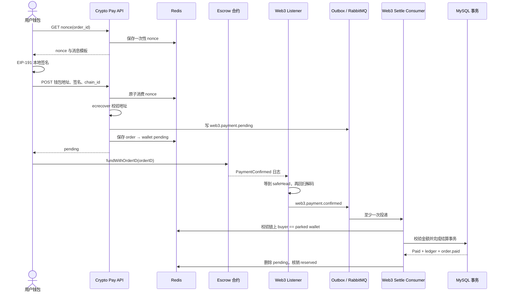

# Web3 支付：从钱包签名到订单入账

> 这一讲只跟一笔 Web3 订单：后端发 nonce，钱包签名，用户在链上付款，listener 等够确认数，消费者校验 buyer 与金额，最后复用订单结算尾段。目标是看懂链下系统怎样接受一条链上事实，而不是介绍整套区块链生态。

## 本讲安排（60 分钟）

| 时间 | 内容 | 核心问题 |
|---|---|---|
| 0–7 分钟 | 为什么另开 Web3 通道 | 它与余额支付的差异在哪里 |
| 7–18 分钟 | nonce、签名与 pending | 后端怎样证明“这是这个钱包的请求” |
| 18–28 分钟 | 托管合约与事件 | 钱上链后，订单 ID 怎样带回来 |
| 28–42 分钟 | listener：确认、回扫与去重 | 链重组、断连、重复日志怎么处理 |
| 42–52 分钟 | 消费者与结算事务 | 怎样防错人付款、少付和重复入账 |
| 52–56 分钟 | 当前实现边界 | 哪些代码可运行，哪些仍是占位或风险 |
| 56–60 分钟 | 演示、回顾和提问 | 用伪造事件验证三道校验 |

正文约 56 分钟，最后 4 分钟用于演示和收束。不要在课堂上展开钱包发展史、代币经济学或完整合规讨论。

## 一、业务旅程：链上付款不是同步接口

余额支付在一个数据库事务里完成；Web3 支付必须等区块打包和确认。API 返回 `pending` 时，钱还没有被 gomall 当作到账，商家也不能据此发货。

这条通道适合已经持有链上资产、愿意自己支付 gas 的用户。它不替代 `/paydown`，只是另一种资金来源。项目也不托管私钥、不换币、不做跨链桥。

整条链可以拆成两段：

- **授权段**：订单用户取 nonce，在钱包本地签名，后端验签并记录 pending；
- **结算段**：用户调用合约，listener 读取已确认事件，消费者推进订单。

最容易讲错的一点：签名不等于付款。签名只证明某个钱包同意为指定订单在指定链上操作，真正到账证据来自合约事件。

## 二、授权段：nonce 为什么要一次性消费

Web3 路由提供两个入口：

```go
authed.GET("paydown/crypto/nonce", CryptoPaydownNonceHandler())
authed.POST("paydown/crypto",
    middleware.Idempotency(),
    CryptoPaydownHandler(),
)
```

### 取 nonce：先验订单归属和状态

`IssueNonce` 只给当前登录用户自己的未支付订单颁 nonce。随机数写 Redis，并带有限时 TTL。

```go
order, err := orderDao.GetOrderById(req.OrderId, u.Id)
if err != nil || order == nil {
    return nil, errors.New("订单不存在")
}
if order.Type != consts.OrderWaitPay {
    return nil, errors.New("订单状态非未支付")
}

nonce, err := randomNonce()
if err != nil {
    return nil, err
}
if err := cache.PutWeb3Nonce(ctx, u.Id, req.OrderId, nonce); err != nil {
    return nil, err
}
```

签名明文把订单、nonce 和 chain ID 一起绑定：

```text
gomall:paydown:order={orderID}:nonce={nonce}:chain={chainID}
```

`chainID` 防止同一签名跨链重放，nonce 防止在同一条链重复使用。当前 nonce 接口返回的预览里 `chain=0`，前端要用真实 chain ID 重新拼消息；生产协议最好由后端直接返回最终待签字符串，减少两端模板漂移。

### 验签并 park

```go
if err := cache.ConsumeWeb3Nonce(
    ctx, u.Id, req.OrderID, req.Nonce,
); err != nil {
    return nil, err
}

msg := []byte(BuildSignMessage(req.OrderID, req.Nonce, req.ChainID))
sigBytes, err := decodeSignature(req.Signature)
if err != nil {
    return nil, err
}
ok, err := web3sig.VerifyPersonalSign(
    req.WalletAddr, msg, sigBytes,
)
if err != nil || !ok {
    return nil, errors.New("签名校验失败")
}
```

nonce 用原子 `GET+DEL` 消费，同一份授权不能重放。验签通过后，服务在 MySQL 事务中写 `web3.payment.pending` outbox，再把规范化钱包地址放进 Redis pending 占位，TTL 为 30 分钟。

```go
err = orderDao.Transaction(func(tx *gorm.DB) error {
    return outbox.NewOutboxDaoByDB(tx).Insert(
        "order", "Web3PaymentPending", "web3.payment.pending", order.ID,
        events.Web3PaymentPending{OrderID: order.ID, UserID: u.Id,
            Amount: orderPayableCents(order), WalletAddr: walletAddr,
            ChainID: req.ChainID, Nonce: req.Nonce},
    )
})
if err != nil {
    return nil, err
}
_ = cache.SetWeb3Pending(ctx, order.ID, walletAddr)
```

这里的边界很重要：pending Redis 写失败只记日志，接口仍返回成功；而后续结算强制要求这个占位存在。若占位写失败或 30 分钟后过期，链上钱已付也会被拒绝自动结算，需要人工对账。设计上应补可靠重建或把绑定关系落到持久存储。

## 三、链上段：合约只提供付款事实

合约事件约定为：

```text
PaymentConfirmed(bytes32 orderID, address buyer, uint256 amount)
```

`orderID` 放进 indexed topic，buyer 和 amount 放在 data。listener 用事件签名的 Keccak 哈希筛选日志，再解码这三个结算字段。

项目的 `pkg/web3/escrow/escrow.go` 目前是 binding 占位实现。它嵌入 ABI、声明 `FundWithOrderID` 等接口形状，但没有真正发送交易；文件注释明确要求上线前运行 `abigen` 生成绑定。课堂上可以讲协议契约，不能演示成“后端已经能用这个类型调用主网合约”。

合约状态包括 `Created`、`Funded`、`Released`、`Refunded` 和 `Disputed`。本讲只跟到 `Funded/PaymentConfirmed`；收货放款、退款和仲裁留作课后。

## 四、标准交互时序：签名、上链、确认、入账



三道闸依次是：一次性 nonce 防重放，确认深度降低 reorg 风险，结算消费者校验 buyer 与金额。少任何一道，链上有一条“看起来像付款”的日志都可能错误推进订单。

## 五、listener：订阅只负责叫醒，回扫才负责入账

### 为什么不直接消费刚订阅到的日志

新日志尚未达到确认深度，可能被链重组移除。listener 收到订阅消息后只把它当作唤醒信号，随后调用 `scanConfirmed`：

```go
safeHead := head - l.confirmDepth
last := l.loadLastBlock(ctx)
from := last + 1
if last == 0 {
    from = safeHead
}
logs, err := client.FilterLogs(ctx, l.query(
    new(big.Int).SetUint64(from),
    new(big.Int).SetUint64(safeHead),
))
```

默认确认深度是 12，环境变量 `WEB3_CONFIRM_DEPTH` 可覆盖为正整数。游标只推进到成功处理区块之前；某区块处理失败，下一轮会重新扫它。

订阅断开后，`run` 按 1 秒到 1 分钟指数退避重连。连接恢复会立即回扫一次，定时器也会周期触发回扫，因此不依赖“每条实时推送都收到”。

但冷启动有明确边界：没有 `last_block` 时从当前 `safeHead` 起步，不会扫描全部历史。如果 Redis 游标丢失，旧的 pending 事件不会自动找回，必须从持久化游标或指定区块补扫。

### 日志去重

每条事件用 `txHash + logIndex` 组成 Redis key，`SETNX` 成功才写 outbox，TTL 是 72 小时。

```go
dedupeKey := fmt.Sprintf("web3:event:%s:%d", lg.TxHash.Hex(), lg.Index)
if first, err := l.tryClaim(ctx, dedupeKey); err == nil && !first {
    return nil
}
return l.outbox(ctx).Insert(
    "web3_payment", "PaymentConfirmed",
    "web3.payment.confirmed", 0, ev,
)
```

Redis 不可用时，代码选择继续写 outbox，让下游订单状态和流水唯一约束收口。这是“宁可重复，不要漏单”的取舍。

当前实现还有一处风险：先 `SETNX`，再写 outbox。若占位成功而 outbox 插入失败，下一轮回扫会把事件判为重复并跳过。修复方向是 outbox 失败时删除占位，或用持久化事件唯一键把去重与写入放到同一个数据库事务。这一点应在课堂上诚实指出。

## 六、消费者：事件还不能直接变成 Paid

消费者先把 bytes32 订单 ID 解析成 gomall 的 `uint`，再执行两项业务校验。

### buyer 必须等于签名阶段的钱包

```go
parked, err := cache.RedisClient.HGet(
    ctx, cache.Web3PendingKey(orderID), "addr",
).Result()
if errors.Is(err, redis.Nil) {
    return ErrWeb3PendingMissing
}
if !strings.EqualFold(parked, onchainBuyer) {
    return ErrWeb3BuyerMismatch
}
```

没有 pending 绑定就拒绝结算，而不是“看到金额够了就算成功”。否则攻击者可以构造一笔匹配金额的事件去推进别人的订单。

### 链上金额必须覆盖订单应付

`verifyOnchainAmount` 按配置的 USDC 精度或 ETH 喂价，把订单分值转换为代币最小单位，并允许配置少量容差。少付、喂价缺失或 buyer 不匹配都作为毒消息进入 DLQ；数据库暂时故障则 Nack 重排。

### 结算仍复用数据库事务

```go
err := orderDao.Transaction(func(tx *gorm.DB) error {
    order, err := orderDaoByTx.GetOrderByIdOnly(orderID)
    if err != nil {
        return err
    }
    if order.Type != consts.OrderWaitPay {
        return nil // 已结算，重复事件安全退出
    }
    payable := orderPayableCents(order)
    if err := verifyOnchainAmount(payable, onchainAmount); err != nil {
        return err
    }

    // 卖家 credit，外部清算账户 debit
    // 然后复用扣库存、Paid 状态守卫与 order.paid outbox
    return finishOrderSettlementTx(tx, order)
})
```

Web3 没有从站内买家余额扣款，所以台账对手方是外部清算账户：卖家 credit，清算账户 debit。事务提交后再尽力核销 Redis 库存预占并删除 pending。

## 七、当前实现的可信边界

| 能确认的行为 | 仍需补齐或监控的边界 |
|---|---|
| EIP-191 验签与 nonce 一次性消费已有代码 | nonce 预览由前端替换 chain ID，协议可能漂移 |
| listener 按确认深度回扫并保存游标 | 游标只在 Redis，冷启动不回扫全部历史 |
| buyer、金额、订单状态都有结算校验 | pending 只存 30 分钟 Redis，丢失后拒绝自动结算 |
| 消费者有 DLQ 与有限重投 | listener 的 SETNX 与 outbox 写入不是原子动作 |
| ABI 和接口形状已存在 | `escrow.go` binding 仍是占位，不能直接发真实交易 |

这张表比夸大“链上永不丢单”更有教学价值。区块链保存了事件证据，但链下 listener、游标、去重和数据库仍然会失败。

## 八、课堂演示（3 分钟）

不用连真实链。调用 `DispatchWeb3SettleEvent` 或对应测试替身，依次投递：

1. buyer 与 pending 地址一致、金额足够的事件；
2. 同订单重复事件；
3. buyer 不匹配的事件。

观察正常事件把订单推进一次，重复事件安全退出，地址不匹配进入毒消息路径。课堂只演示前两个也可以，把第三个作为提问。

## 九、收束（1 分钟）

学生应能说清：

- 钱包签名为什么不是付款证明？
- listener 为什么等确认深度，并通过回扫而非实时日志入账？
- 为什么结算前必须同时核对 order、buyer 和 amount？
- Redis 去重、outbox、订单状态守卫各挡住哪一层重复？
- 链上证据还在，为什么链下系统仍可能漏处理？

一句话记忆：**链上事件提供付款证据，链下系统负责谨慎接纳；先验身份与金额，再用可重试事件把订单推进一次。**

## 课后延伸

- 修正 listener“SETNX 成功、outbox 失败”可能漏事件的问题，并补失败重试测试。
- 把 `last_block` 改成可审计的持久化游标，设计首次部署的回扫起点。
- 为 pending 钱包绑定增加持久化记录，说明它与 Redis 缓存的读写顺序。
- 阅读 `Escrow.sol` 的 release、refund、dispute 状态迁移，画出履约后半程。

代码入口：`internal/payment/service_crypto.go`、`service/web3/listener.go`、`internal/payment/consumer_web3.go`、`internal/payment/service_web3_settle.go`、`pkg/web3/escrow/escrow.go`。
