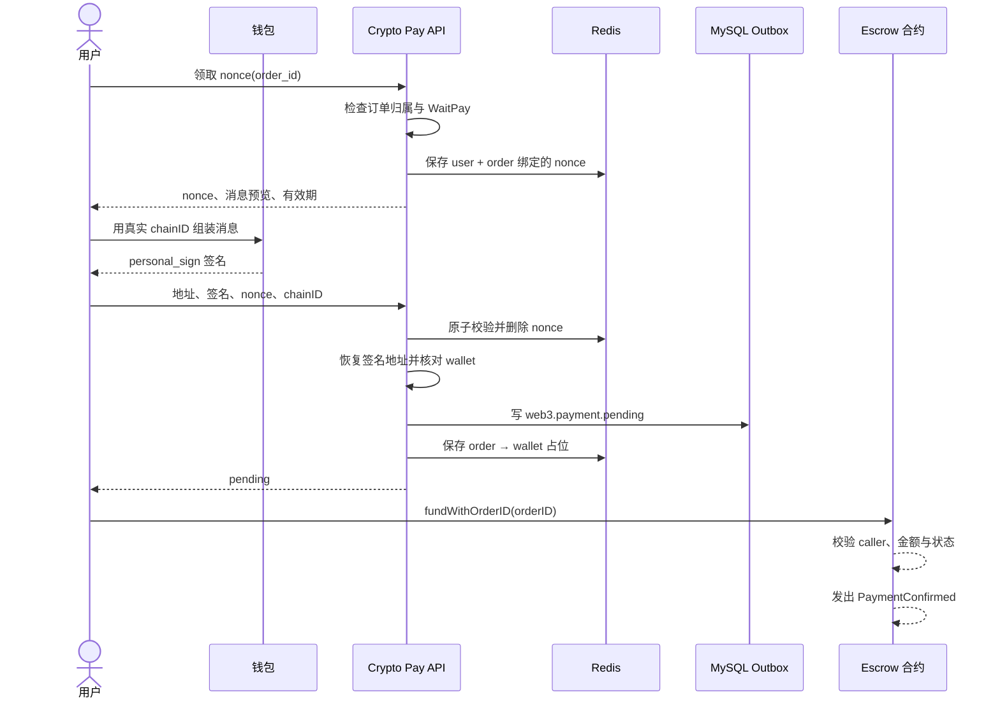

# Web3 支付（上）：怎样产生可核验的链上付款意图

> 这一讲停在合约发出 `PaymentConfirmed`。我们不急着让订单变成 Paid，先回答一件更基础的事：后端如何确认“这个登录用户控制这个钱包，而且这次授权只对应这张订单和这条链”。

## 本讲目标

讲完后，学生应该能解释：

- 钱包签名、链上交易和订单入账为什么是三件事；
- nonce 怎样挡住重放，`orderID` 与 `chainID` 又分别绑定什么；
- 为什么签名校验通过后接口只返回 `pending`；
- 合约事件里哪些字段能成为链下核验材料；
- 当前合约、ABI 与 Go binding 还差哪些上线工作。

## 一、先把三个“成功”分开

余额支付可以在一个数据库事务里完成扣款与订单更新。Web3 支付跨过钱包、RPC、区块链和链下数据库，API 无法在一次请求里等完这些系统。

| 页面上发生的事 | 它能证明什么 | 还不能证明什么 |
|---|---|---|
| 钱包签名成功 | 用户控制某个私钥，并同意一段消息 | 钱已经转出 |
| 交易被打包 | 合约执行过这笔交易 | 链下订单已经入账 |
| 后端完成结算 | gomall 接纳了链上事实 | 合约后续已经放款给卖家 |

所以 `/crypto/paydown` 的成功响应是 `pending`。它只表示后端接受了付款意图，不能拿来发货。

先让学生判断：用户截图显示“Signature successful”，客服能否把订单手动改成 Paid？答案是否定的，截图甚至不是链上证据。

## 二、授权段的业务约束

这段流程有两个 HTTP 入口：先领取 nonce，再提交地址、签名、nonce 与 chain ID。两次请求都必须基于当前登录用户检查订单归属和 `WaitPay` 状态。



图到事件为止。下一讲从“谁来可靠地看到这条事件”开始。

## 三、nonce：一次性挑战，而不是订单密码

`IssueNonce` 先查订单，再生成 16 字节随机数。Redis key 同时绑定 `userID` 和 `orderID`，有效期是 5 分钟；同一订单再次领取会覆盖旧值。

```go
order, err := orderpkg.NewOrderDao(ctx).GetOrderById(req.OrderId, u.Id)
if err != nil || order == nil || order.ID == 0 {
    return nil, errors.New("订单不存在")
}
if order.Type != consts.OrderWaitPay {
    return nil, errors.New("订单状态非未支付")
}

nonce, err := randomNonce()
if err := cache.PutWeb3Nonce(ctx, u.Id, req.OrderId, nonce); err != nil {
    return nil, err
}
```

待签明文是：

```text
gomall:paydown:order={orderID}:nonce={nonce}:chain={chainID}
```

四个字段各自有职责：

| 字段 | 防住的问题 |
|---|---|
| 固定业务前缀 | 签名不容易被其他功能误用 |
| `orderID` | 不能把 A 订单的授权挪给 B 订单 |
| `nonce` | 同一订单的旧授权不能重复提交 |
| `chainID` | 同一签名不能原样搬到另一条链 |

消费 nonce 用 Lua 完成“读取、比较、删除”，而不是先 GET 再 DEL：

```lua
local cur = redis.call('GET', KEYS[1])
if cur == false then return -1 end
if cur ~= ARGV[1] then return -2 end
redis.call('DEL', KEYS[1])
return 1
```

两个并发请求即使带着同一份正确签名，也只有一个能拿到返回值 `1`。

### 一个协议摩擦点

nonce 接口返回的消息预览使用 `chain=0`，前端要替换成钱包的真实 chain ID 后再签；后端验签则按请求中的真实值重新构造消息。这能工作，但两端稍有模板差异就会验签失败。更稳妥的接口是：前端先提交 chain ID，后端直接返回最终待签字符串。

## 四、验签：证明“控制钱包”，不证明“付过钱”

`VerifyAndPark` 再次检查订单归属和状态，然后先消费 nonce，再恢复签名地址：

```go
if err := cache.ConsumeWeb3Nonce(
    ctx, u.Id, req.OrderID, req.Nonce,
); err != nil {
    return nil, err
}

msg := []byte(BuildSignMessage(req.OrderID, req.Nonce, req.ChainID))
sigBytes, err := decodeSignature(req.Signature)
if err != nil {
    return nil, err
}
ok, err := web3sig.VerifyPersonalSign(req.WalletAddr, msg, sigBytes)
if err != nil || !ok {
    return nil, errors.New("签名校验失败")
}
```

这里采用 EIP-191 `personal_sign`。钱包在本地签名，私钥不交给 gomall；后端根据签名恢复地址，再与请求中的 `WalletAddr` 比较。

为什么先消费 nonce？失败签名也会烧掉 nonce，用户需要重新领取。这样做偏保守，攻击者拿到请求内容后不能反复试签；代价是网络抖动或格式错误会增加一次交互。

## 五、为什么要 park

验签成功后，服务写出 `web3.payment.pending` 事件，并把规范化钱包地址保存到 Redis：

```go
err = orderpkg.NewOrderDao(ctx).Transaction(func(tx *gorm.DB) error {
    return outbox.NewOutboxDaoByDB(tx).Insert(
        "order", "Web3PaymentPending", "web3.payment.pending", order.ID,
        events.Web3PaymentPending{
            OrderID: order.ID, UserID: u.Id,
            Amount: orderPayableCents(order),
            WalletAddr: walletAddr, ChainID: req.ChainID,
            Nonce: req.Nonce,
        },
    )
})
if err := cache.SetWeb3Pending(ctx, order.ID, walletAddr); err != nil {
    log.LogrusObj.Errorf("set web3 pending placeholder fail: %v", err)
}
```

这个 pending 占位把“签过名的钱包”留给结算阶段，TTL 是 30 分钟。链上事件里的 buyer 只有与它一致，订单才允许入账。

但顺序存在缺口：outbox 写成功后，Redis 写失败只记日志，接口照样返回 pending；占位过期也会失去 buyer 绑定。第二讲会看到，消费者遇到缺失占位时拒绝自动结算。因此链上可能已经付钱，订单却要进入人工对账。

## 六、合约怎样带回订单号

`fundWithOrderID` 要求调用者就是构造合约时写入的 buyer，金额必须精确等于 `amount`，状态也必须是 `Created`。通过后，合约进入 `Funded` 并发事件：

```solidity
function fundWithOrderID(bytes32 _orderID)
    external payable onlyBuyer inState(State.Created)
{
    if (msg.value != amount) revert WrongAmount(amount, msg.value);
    orderID = _orderID;
    state = State.Funded;
    emit Funded(msg.value);
    emit PaymentConfirmed(_orderID, msg.sender, msg.value);
}
```

`PaymentConfirmed` 提供三项链下核验材料：

```solidity
event PaymentConfirmed(
    bytes32 indexed orderID,
    address indexed buyer,
    uint256 amount
);
```

- `orderID` 把链上付款指向 gomall 订单；
- `buyer` 要与 park 阶段的钱包地址相等；
- `amount` 要覆盖订单应付金额。

交易哈希、日志序号和区块高度来自 EVM 日志元数据，listener 会在第二讲用它们去重和判断确认范围。

### 事件证明的边界

当前事件没有 token 地址和 recipient 字段。链下能校验 buyer 与 amount，却无法只靠事件确认“使用了预期代币并付给预期收款方”。而且当前 `Escrow.sol` 收的是原生币 `msg.value`，讲 USDC 时不能把它说成已经接通的合约路径。

代码里还有一处必须当场指出的契约漂移：Solidity 把 `buyer` 声明为 `indexed`，`service/web3/listener.go` 内嵌 ABI 却把 buyer 写成非 indexed。真实日志会把 buyer 放进 topic，当前解码器试图从 data 取 buyer，可能直接解码失败。上线前必须让合约 ABI、listener ABI 和测试样本来自同一个构建产物。

## 七、哪些已经实现，哪些只是接口形状

`pkg/web3/escrow/escrow.go` 嵌入 ABI，并声明 `FundWithOrderID`、事件过滤等接口，但它明确是 binding 占位实现。仓库当前可以讲协议，也能测试签名和链下逻辑；不能把这个文件演示成已经会向真实 EVM 网络发送交易。正式接链需要用 `abigen` 生成绑定，并补部署地址、RPC、gas 与链 ID 配置。

## 八、承接题

假设区块高度 1,000 出现了 `PaymentConfirmed`，listener 当场看见它。随后节点断线，恢复时链头已经到 1,020；同一日志又被 RPC 返回了一次。

请学生先写下答案：

1. 高度 1,000 的日志什么时候才允许推动订单？
2. 断线期间的日志怎样补回来？
3. 同一日志出现两次，哪一层负责让它只入账一次？
4. buyer 正确但金额少了，应该重试还是进入人工处理？

下一讲沿着这四个问题，从 listener 一直走到数据库结算与 DLQ。

## 本讲收束

签名解决“谁授权”，合约交易产生“付了什么”的候选证据；两者都没有直接修改 gomall 订单。真正可核验的付款意图由订单、一次性 nonce、chain ID、钱包地址和合约事件字段共同组成。

代码入口：`internal/payment/handler_crypto.go`、`internal/payment/service_crypto.go`、`repository/cache/web3.go`、`pkg/web3/contracts/Escrow.sol`、`pkg/web3/escrow/escrow.go`。
