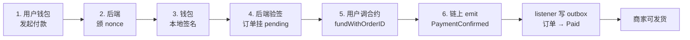
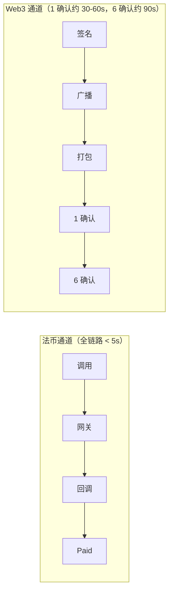
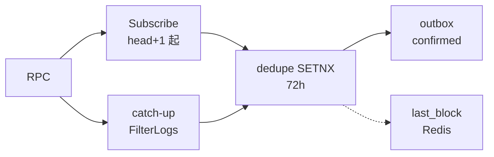
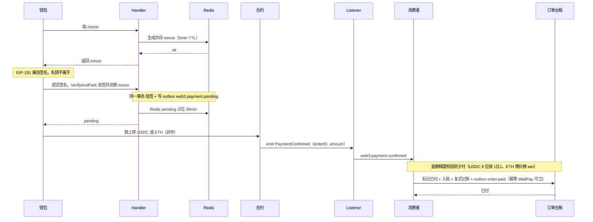
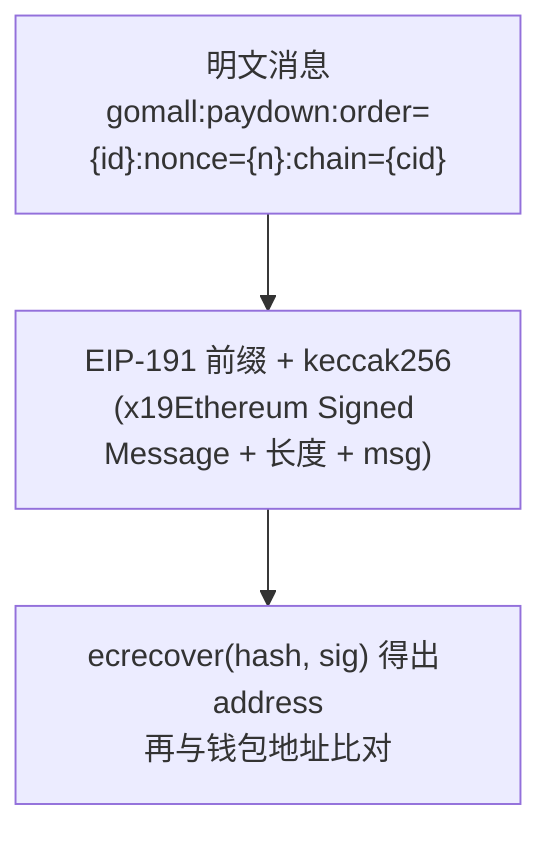
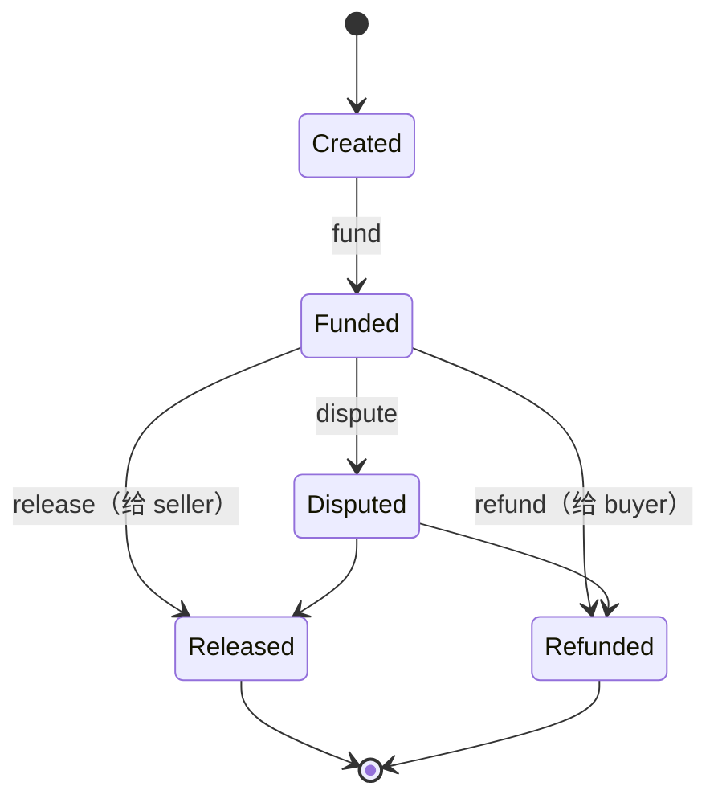

# Web3 支付：业务通道、托管增信、对账兜底

> gomall 把"第三方支付吃不下的订单"接回来：跨境 / 加密原生 / 大额托管
>
> 这份讲义不讲"怎么写一条链、怎么发一个币"，讲的是**每一条 Web3 支付决策背后的业务取舍**——为谁开这条通道、钱走到哪一步才算安全、链断了业务怎么兜底，以及每个决策错了会赔多少钱、客服要说什么话、SLO 会怎么抖。

## 目录

- [一、业务定位：Web3 不是新潮，是"补一块法币吃不下的市场"](#一业务定位web3-不是新潮是补一块法币吃不下的市场)
- [二、业务码 + 客服话术：Web3 通道对外暴露的 4 类问题](#二业务码--客服话术web3-通道对外暴露的-4-类问题)
- [三、对账事故 SOP：链上事件丢 / 重 / 撤销三大场景](#三对账事故-sop链上事件丢--重--撤销三大场景)
- [四、钱包签名：用户私钥从不离手](#四钱包签名用户私钥从不离手)
- [五、Escrow 合约：业务承诺的最低契约](#五escrow-合约业务承诺的最低契约)
- [六、业务边界与合规：gomall 在 Web3 通道里"不做什么"](#六业务边界与合规gomall-在-web3-通道里不做什么)
- [七、各角色视角 + 路线图](#七各角色视角--路线图)
- [附录 A：面试 Q&A](#附录-a面试-qa)
- [附录 B：代码位置一览](#附录-b代码位置一览)

---

## 一、业务定位：Web3 不是新潮，是"补一块法币吃不下的市场"

### 先讲清楚 gomall 为什么开 Web3 通道

开 Web3 通道，**不是为了潮，不是为了讲技术**，是为了三类第三方支付根本吃不下的订单：

- **加密原生用户**：钱包里只有 ETH / USDT，没绑卡也没法绑卡（行业数据：DeFi 月活 5–7M 钱包）。传统通道要求"有卡"，直接把这群人挡在门外。
- **跨境订单**：买家在东南亚 / 拉美 / 非洲，走传统跨境 Visa / SWIFT 要收 1–3% 手续费 + T+1 到账，一旦有争议就走银行流程，30–90 天起步。
- **大额托管交易**：单笔 \$1,000+ 的跨境订单，买卖双方互不信任、传统持牌机构又不愿担保，需要用"中介信任"换成"代码不变式"。

关键定位要先说透：Web3 通道与法币 `/paydown` 是**并存**关系，不是替换。开一条新通道等于**拓客**，不是减客——法币能吃下的订单继续走法币，Web3 只去接那些法币接不了的。

### 5 角色视角：Web3 通道对每个角色意味着什么

同一套 Web3 通道，五个利益相关者关心的东西和"出错后果"完全不同。把技术词翻译成每个角色的业务痛，才知道为什么值得单开一份 deck：

| 角色 | 在 Web3 通道里关心什么 | 主要痛点 |
|---|---|---|
| C 端用户 | 钱安全吗 / 链上钱付了为什么还没到 | "pending 半小时是不是丢了" |
| 商家 | 我什么时候确认到账 / 谁出 gas | T+0 vs 法币 T+1，但 gas 自付有疑虑 |
| 运营 | 开通道能多接多少订单 | 拓客转化率 / 客单价 |
| 客服 | 用户骂"网络回滚我钱呢"咋办 | 需要 reorg / pending 的话术 |
| SRE | 链是不可靠通道，掉块怎么办 | listener catch-up / 退避 / 多源 |

所以**业务承诺要分角色给**：用户要的是"钱在哪我能查"，商家要的是"什么时候 release"，客服要的是"按业务码读话术不掉链子"，SRE 要的是"链断 30 分钟主流程不挂"。后面每一节，其实都是在给这五个角色里的某一个还债。

### 业务价值定量：开一条 Web3 通道相当于开三个用户群

把"三类订单"换算成"三个新用户群"，运营视角的账就清楚了：

| 新用户群 | 行业体量参考 | gomall 接入收益 |
|---|---|---|
| DeFi 原生 | 月活 5–7M 钱包 | 钱包内资产可直接付款，零卡组织摩擦 |
| 跨境（拉美 / 东南亚 / 非洲） | 跨境电商 GMV 年增 13% | 1–3% 手续费 → gas 固定，T+1 → 1–2 分钟 |
| 大额 B2B 托管 | 单笔 \$1k–\$50k | 中介信任 → 合约不变式，争议有链上证据 |

数字不用记牢，记住一句：**Web3 不是替代第三方支付，是补齐法币吃不下的订单形态**。法币通道仍跑 `/paydown`（deck 05），Web3 通道跑 `/paydown/crypto`，两条线并行不打架。

> **业务边界要对外坦白**：MVP 阶段默认不接 RPC（`WEB3_RPC_URL` 不设 listener 就不启动），但合约 + Go binding 已经就绪。"代码在路径上跑过、只是没连真链"，和"根本没做"是两回事，对外要说清楚。

### 跨境用户旅程：东南亚买家在 gomall 下单的真实链路

把定位讲成一个具体的人：**印尼买家 Andi**，钱包里有 USDT，想买一台 \$280 的中国卖家相机。两条通道摆在他面前，差距是肉眼可见的：

- **法币通道（对他基本不可行）**：当地银行卡跨境刷卡费 2.5% + 汇率损耗 1%；到账 T+1；一旦纠纷，30–90 天扯皮。
- **Web3 通道**：钱包签名 → `fundWithOrderID` 把 USDT 锁进 escrow → 1–2 分钟链上确认 → 商家发货 → Andi 收到货点 `release` → 卖家拿到 USDT。全程分钟级。
- **时间窗对比**：法币通道 1 周资金锁定 + 1% 手续费；Web3 通道 1–2 分钟到账 + gas \$0.05–\$0.30（走 L2）。
- **争议处理**：传统 chargeback 走 Visa 流程 30–60 天，结果靠平台 / 银行拍板；Web3 escrow 走 `dispute` 状态 → arbiter 在链上裁决，证据是不可篡改的链上事件。

业务收益要落回平台账本：**平台多接了一类跨境订单**（DeFi 钱包用户 + 跨境无卡用户），手续费收入从"买家结算端"转到了"链上 gas 由用户自付"，平台净抽成空间反而提升——原来要分给卡组织和汇兑的那部分，现在留在了平台和用户之间。

### 运营视角：开 Web3 通道的转化数据怎么追

开了通道不等于有生意，运营要能回答两个业务问题，否则这条通道只是在烧 RPC 成本：

**Q1：开 Web3 通道带来多少新用户？**

- 埋点：注册流里"绑定钱包"按钮的点击率 / 完成率；
- 看板：每日新增钱包绑定用户 / Web3 支付 GMV / Web3 通道 ARPU；
- 决策：如果 Web3 通道 GMV < 平台总 GMV 的 1%，就要拿到桌面上讨论——是否关闭通道、省下 RPC 成本。

**Q2：Web3 通道的转化漏斗在哪卡？**

- 漏斗：进入支付页 → 选 Web3 → 钱包签名成功 → 链上 fund → 6 块确认；
- gomall 当前实现：每一步都写 outbox 事件（pending / signed / confirmed），运营 BI 可以直接拉链跑数，不用另建埋点；
- 典型卡点：钱包签名 → 链上 fund 之间的"用户钱包余额不够 gas"，这一步掉人最多，需要 UI 提前提示"先充点 gas"。

这里有个复用红利值得点破：因为每一步都落 outbox 事件，运营要的漏斗数据和财务要的对账数据、SRE 要的排障线索，**读的是同一份事件流**，不需要为运营单独埋一套点。

### Escrow 业务价值：信任锚从"银行"换成"可审计代码"

Escrow（链上托管合约）不是技术炫技，它回答的是一个非常朴素的业务问题：**买卖双方互不信任的大额订单，钱先放谁那儿？**

- **传统答案**：找第三方（持牌支付机构 / 平台）做担保。代价 = 1–3% 手续费 + 平台跑路风险 + 监管套利空间。你得先"相信这个中介不会作恶"。
- **Web3 答案**：把"担保人"换成一段第三方审计过的代码。资金锁在合约里，合约只接受三种动作——买家确认收货 → 给商家；买家退货 → 退给买家；出现争议 → 仲裁人裁决。除此之外谁都动不了这笔钱。
- **业务承诺等价**：合约的"不变式"（buyer / seller / amount 部署后不可改、Created→Funded 只能发生一次、终态不可逆）**就等于**平台对外承诺的最低契约。承诺不再写在用户协议里，而是编译进了字节码。

一句话总结：**平台不再说"相信我"，而是说"相信你能读懂的代码"**。

### 端到端 6 步业务流：钱 → 合约 → 订单

把整条链路拆成 6 步，钱、合约、订单三者的关系就一目了然：



这张图的**业务保障**是两条铁律：

- **钱没进合约前，订单永远 pending**——用户不会遇到"先付款后丢单"，因为在钱真正锁进 escrow 之前，订单状态压根没往前推。
- **钱进合约后，listener 兜底推进**——即便后端在那一刻挂了，链上证据永远在，listener 恢复后照样能把订单推到 Paid。

这正是 Web3 比传统支付强的核心一点：**业务状态有"链"做单点证据源**，不依赖平台自己那份可能丢、可能被改的 DB。

### 商家收款体验：什么时候算"到账"

商家最关心的不是技术细节，是一句大白话——**"我什么时候可以发货？"** 答案不是非黑即白的"到账/没到账"，而是随确认数递进的一条风控曲线：

| 确认数 | 时间窗口 | 商家可以做什么 |
|---|---|---|
| 0 块（mempool） | < 30s | 不可发货，钱还没上链 |
| 1 块 | 30–60s | 可显示"已上链"，小额订单（< \$100）可发货 |
| 6 块 | ≈ 90s | 中额订单（\$100–\$1k）可发货，抗常规 reorg |
| 32 块（1 epoch） | 6.4 分钟 | 大额订单（> \$1k）finalize 后才可 release |

**业务规则**：金额越大，要等的确认数 N 越大——这是**商家自己的风控阈值**（gomall 默认值写在配置文件里，商家后台可调，属路线图阶段）。这里还藏着一条 gas 的成本分配原则：商家提现到自己钱包的 gas 由**商家自付**，用户付款的 gas 由**用户自付**，平台一律不补贴——补贴 gas 等于给刷单党开了个提款口。

**用户取消订单流程**也要顺带讲清：钱已进 escrow 但商家还没发货时，买家点取消 → arbiter 触发 `refund` → 链上退回买家钱包 → listener 写 `web3.payment.refunded` → 订单状态置为 Refunded。整条退路同样有链上证据兜底。

### 用户体验：链是异步的，UX 必须 ticket 化

法币通道和 Web3 通道的时间线，物理上就不是一个量级：



Web3 链上"秒级到账"是**反物理的**——广播、打包、确认，每一步都要等区块。所以业务侧的 UX 不能照搬法币的"点一下就成功"，必须走 **ticket 模式**：钱包签名完成 → 后端立即返回 `W3-PENDING` + 一个 ticket → 前端拿 ticket 轮询订单状态 → 1 确认才显示"已上链"，6 确认才允许商家发货。

> **客服话术必须对齐**：`W3-PENDING` **不是失败**，是"等待区块确认（约 30–60s）"。要让用户明白这是**正常状态**，不是**异常状态**。这一点 gomall 与 deck 05 法币的"立即到账"承诺**刻意不一致**——因为底层物理就不一致，硬把它包装成"秒到"只会在 pending 期间引爆客诉。

---

## 二、业务码 + 客服话术：Web3 通道对外暴露的 4 类问题

### Web3 业务码 + 客服话术（核心 4 条）

Web3 通道对外只暴露 4 个核心业务码，每个都配一句能直接念给用户的话术：

| 业务码 | 含义 | 客服话术 |
|---|---|---|
| W3-NONCE-EXPIRED | nonce 5min 过期或已用 | "请重新发起支付" |
| W3-SIG-INVALID | 签名地址不匹配 | "请用绑定钱包重试" |
| W3-PENDING | 链上未确认 | "等待区块确认（约 30–60s）" |
| W3-REORG | 链上 reorg 撤销 | "网络回滚，已自动退款" |

**客服话术原则**：不暴露技术细节，但要**足够区分**。最容易踩的坑是 `W3-PENDING` 与 `W3-NONCE-EXPIRED` 表面像（都是"等"），但处理路径完全不同：前者继续等链确认就行，后者必须**重发 nonce 重签**——如果客服把这两句说反了，用户会在一个死掉的 nonce 上干等。

**与 gomall 已有业务码体例一致**（参 `pkg/e/code.go`）：30001/30002 是鉴权类、50001 OSS、60002 幂等、70001 限流、70002 熔断。Web3 这套 `W3-*` 特意做成**字符串码**（不是数字），因为它们要给前端钱包弹窗和客服话术直接读，不是给 SDK 解析——可读性优先于紧凑性。

### 客服话术三场景：用户最常问的三类问题

把最常见的三类工单还原成"用户怎么问 + 客服怎么答 + SRE 后台怎么查"，客服和 SRE 就能对上暗号：

**场景 1：用户问"链上交易 pending 半小时了"**

- 客服话术：先确认链 ID（mainnet 还是 L2）。mainnet 拥堵高峰 pending 1–2 小时是正常的；L2 超过 5 分钟才算异常。
- SRE 后台动作：查 `web3:nonce` 是否已消费（已消费 = 签名通过）+ 查 listener 日志该 txhash 是否收到。若 nonce 已消费但 txhash 收不到 → 说明用户钱包侧的 tx 还没广播，或者被 drop 了。

**场景 2：用户问"我钱付了为什么订单还没确认"**

- 客服话术：付款分两段——钱包签名（瞬时）+ 链上转账（30–60s）。让用户到钱包里查 tx 状态。
- SRE 后台：grep outbox 里的 `web3.payment.pending` 找到该订单；若有 pending 但没 confirmed → 用户钱包侧的 tx 失败了或还没确认。

**场景 3：用户问"我能退回原通道吗（法币卡）"**

- 客服话术：Web3 通道付的款**只能退回原钱包地址**（这是链上不变式，改不了）；想换回法币要走链下兑换流程，gomall 不提供这项服务。

---

## 三、对账事故 SOP：链上事件丢 / 重 / 撤销三大场景

### 链是不可靠通道：3 类事故 + SRE 处置 SOP

Web3 通道要接受一个前提：**链是不可靠通道**。事件会丢、会重、会被撤销。把这三类事故和处置手段列成 SOP，SRE 半夜被叫起来才不慌：

| 事故 | 业务后果 | SRE 处置 |
|---|---|---|
| listener 重启 | 漏掉停机期间事件 | 进程启动自动 `catchUp(last+1, head)` 回放，无需人工 |
| RPC 节点断 | 短期收不到事件 | 退避重连 1s→60s 封顶，超时仍未恢复值班介入 |
| 链上 reorg | 已上链的 tx 被撤销 | listener 收到 `log.Removed` 跳过；订单未推进过 = 无事；已推进 → arbiter 介入 refund |
| 重复事件 | 同一笔订单推进两次 | `web3:event:{txhash}:{logIdx}` SETNX 72h 兜底，重复直接 short-circuit |

**业务承诺（SLO）**要能量化，才叫承诺：链 RPC 中断 30 分钟内主流程不挂、listener 重启 5 分钟内 catch-up 完成、单条事件从链上 emit 到 outbox 写入 P99 < 5 分钟（包含 6 确认等待）。

> **诚实说明**：链本身的可用性**不在** gomall 的 99.95% SLO 范围内（参 README）。当 RPC 全断时，Web3 通道降级为"用户可签名、订单挂 pending，等链恢复"，而法币通道仍可正常下单。把"链的可用性"和"平台的可用性"划开，是这条通道能对外承诺 SLO 的前提。

### listener 三项基本功：业务承诺背后的实现

上面那些"不掉单"的承诺，靠 listener 的三项基本功兜底：



- **重连**：RPC 短暂断 = 业务延迟感知，不掉单；指数退避 1s→60s 封顶，连上就 reset。
- **catch-up**：进程重启或 RPC 切换时，拿 `last_block` 批量 `FilterLogs` 回放停机期的事件——这是 gomall 对外"不掉单"承诺的底牌。
- **幂等**：每条事件按 `web3:event:{txhash}:{logIdx}` SETNX 72h 去重；reorg / 重连 / 重启带来的重复，全靠它兜底，业务侧完全无感。

### 容错矩阵：异常 vs 业务影响 vs 兜底

把 listener 面对的每种异常、它的行为、以及最终的业务影响列成一张矩阵，就能看出这套设计的"没有一格是掉单"：

| 异常 | listener 行为 | 业务影响 |
|---|---|---|
| RPC 断连 | backoff 1s → 60s 指数重连 | 短暂延迟，不掉单 |
| 进程重启 | loadLastBlock 后 catchUp(last+1, head) | < 5min 内追完，不掉单 |
| log.Removed | reorg 撤销，跳过 | SETNX 兜底，订单不二次推进 |
| 重复事件 | SETNX 72h key 已存在 return | 不重复推进订单 |
| RPC 慢 | Subscribe buffer=64 不阻塞主流程 | log 缓冲，不丢 |
| RPC 全断 | listener 静默，订单挂 pending | 法币通道仍可用 |

**业务承诺的复用**是这里最值得学的一招：listener 写入的 `web3.payment.confirmed` 与法币的 `order.paid` 走**同一条 outbox 总线**（deck 04 / deck 11 同款）。于是财务对账拿到的是**统一格式**的事件，按 `order_id` 维度 join 即可，不需要为 Web3 单独建一条对账链路。

### 标准时序图：链上确认结算全链路（签名 → 链上 → 入账）

把签名、链上、入账三段串起来，看清"三道闸口"分别卡在哪：



> **三道闸口**：**签名防重放**（nonce 一次性消费 + EIP-191 验签）→ **链上确认兜底**（钱进合约才 emit，listener 收到事件才推进，后端宕机也不丢单）→ **金额按代币精度校验防少付**（USDC 按 6 位小数 1 比 1 比对、ETH 按喂价折算 wei，少 1 个单位就拒绝入账）。三道闸口分别防的是重放攻击、后端宕机、金额舞弊。

### 真实事故还原：reorg 把已发货订单的钱"撤回"了

光讲机制不够，来还原一次真会赔钱的事故。**场景**：商家在 1 块确认时就发货了（小额订单的默认风控阈值），10 分钟后链 reorg 把那条 tx 撤销了。

- **listener 视角**：收到 `log.Removed=true` 的同一条 PaymentConfirmed，跳过，不再写 outbox。
- **订单视角**：状态已经因为之前那次 confirm 推进到了 Paid，货也已经发了；reorg 后 listener 不会再推一次（SETNX 72h 兜底），但**已经发生的状态推进不会自动回滚**——货已经在路上了，回滚不了。
- **SRE 处置 SOP**：
  - Step 1：值班按 alert 找到该订单 ID + txhash；
  - Step 2：链上确认这条 tx 真的没回归（等 6 块再确认一次，别被临时 reorg 骗了）；
  - Step 3：arbiter 调 `refund` 把 escrow 里的钱（如果还在）退给买家；
  - Step 4：商家走链下追款；这单算作平台损失。

**对外承诺**要说明白：风控阈值（确认数）由商家自己设；gomall 默认小额 1 块 / 中额 6 块 / 大额 32 块，商家可调。**商家承担"提前发货"的风险，平台不兜底**。这正是为什么大额订单要等 6+ 确认才发货——上面这单的损失，就是"用 1 块确认赌小额"的代价。这也是 Web3 通道与法币通道的核心差异之一。

### 真实事故还原：listener 漏事件怎么人工补

第二个事故，讲的是"兜底的兜底"。**场景**：RPC 节点配置错误，连续 30 分钟没收到事件，期间链上有 12 笔 PaymentConfirmed。

- **发现**：监控 alert 触发——"listener 60s 内未消费任何 head"。
- **标准处置**：listener 重启 → `loadLastBlock` 拿到 30 分钟前的块号 → `catchUp(last+1, head)` 用 `FilterLogs` 批量回放 → 12 笔全部补齐。整个过程无需人工干预。
- **异常处置（极端情况）**：如果连 `last_block` 这个 Redis key 都丢了 → 需要人工指定回放起点。SRE 后台脚本的思路是：从订单库找最近 30min 的 Web3 pending 订单里最早的 `created_at` → 找对应区块号 → 手动调 listener admin 接口（路线图阶段）重置 `last_block` → 重启服务。

这种"补"是**业务承诺的兜底层**：哪怕缓存全丢、进程多次崩溃，只要链上事件还在，所有 PaymentConfirmed 都能复原。**这是 Web3 强于传统支付的地方**——链是**单点真源**（single source of truth），传统支付一旦 webhook 丢了，就只能求着对方重发，主动权不在自己手里。

---

## 四、钱包签名：用户私钥从不离手

### 业务约束：为什么后端永远不能拿到私钥

这一节的每个技术选择，都服务于一条**业务侧最低承诺**：用户私钥 = 用户钱包的全部，gomall 任何环节都不接触。

- **法律意义**：私钥一旦被泄漏 = 平台无法对外解释（对监管、对用户、对媒体都解释不了），合规风险无上限。
- **业务意义**：用户对 Web3 平台的信任**完全建立在"不托管私钥"上**——一旦托管，你就退回成了传统支付，Web3 的全部价值当场消失。
- **技术答案**：后端只发"消息模板"，签名发生在钱包客户端内部（MetaMask / WalletConnect / 硬件钱包），后端拿到签名后用 `ecrecover` 反推出地址来校验。全程私钥不出钱包。

> **对应客服话术**："您的私钥永远在您自己的钱包里，gomall 不存、不传、不知道。" 这一句必须能**直接念给用户**，是 Web3 通道的对外底线。

**业务边界声明**也在这里一并划清：gomall **不做钱包托管**（没有平台钱包）、**不做币种兑换**（不接 DEX）、**不做跨链桥**（避开 \$25B+ 桥被盗的行业风险）、**不做 NFT 票据**、**不发自己的 stablecoin**。做得少，暴露面才小。

### 签名消息模板：把"我在给 gomall 付款"钉在用户眼前

签名不是签一串乱码，而是签一段**用户能读懂的明文**，再经 EIP-191 哈希、最后靠 `ecrecover` 反推地址核验：



这段消息模板的每一个字段都有业务考量：

- **前缀 `gomall:paydown:`**：钱包弹窗会把这段明文显示给用户看，它是**反钓鱼的最后一道防线**——用户看到前缀不是 gomall，就应当拒签。
- **chainID 入消息**：防一条签名在 mainnet / L2 之间互通，造成跨链重放（同一签名在不同链上被重复扣两次）。
- **orderID + nonce**：绑定订单 + 防同链重放。每订单一次签名，签了就消失。
- **v 值归一**：钱包返回的是 27/28，而 go-ethereum 还原 pubkey 要 0/1，必须先归一，否则验签必挂。

### VerifyPersonalSign：EIP-191 + ecrecover 12 行

验签的核心就 12 行，业务上"这次付款是不是用户本人签的"全压在这段代码上：

```go
func VerifyPersonalSign(addr string, msg []byte, sig []byte) (bool, error) {
    if len(sig) != personalSigLen { return false, fmt.Errorf("...") }
    if !common.IsHexAddress(addr) { return false, errors.New("...") }
    rsv := make([]byte, personalSigLen)
    copy(rsv, sig)
    switch rsv[64] {
    case 27, 28: rsv[64] -= 27
    case 0, 1:   // already normalized
    default:     return false, fmt.Errorf("非法 v 值: %d", rsv[64])
    }
    hash := personalSignHash(msg)             // EIP-191 prefix + keccak256
    pubKey, err := crypto.SigToPub(hash, rsv) // ecrecover
    if err != nil { return false, err }
    recovered := crypto.PubkeyToAddress(*pubKey)
    expected  := common.HexToAddress(addr)
    return bytes.Equal(recovered.Bytes(), expected.Bytes()), nil
}
```

逐行看它在防什么：

- 长度严格校验 65（r+s+v），非法长度直接挡在门外；
- 地址 hex 校验，阻拦明显非法的输入；
- 拷贝一份 `rsv`，避免污染调用方传进来的 slice；
- v 值归一，兼容"钱包语义"和"go-ethereum 语义"两套编码；
- `personalSignHash` 内部加 `"\x19Ethereum Signed Message:"` 前缀再 keccak256，这就是 EIP-191；
- `SigToPub` 即 ecrecover，从签名反推出公钥；
- 最后做 byte-level 地址比对（大小写无关）。

**业务保证**：这 12 行只要通过，就证明"用户用绑定钱包对**这个 orderID** 签过名"。任何一环失败，一律返回 `W3-SIG-INVALID`。

### IssueNonce + VerifyAndPark：业务主流程拼图

nonce 颁发和验签落库，是整条主流程的两块拼图。Redis key `web3:nonce:{userID}:{orderID}` 用双维度做 TTL 5min；二次签发自动覆盖；消费走 Lua `GET+DEL` 保证原子；Pending 占位 30min 让前端轮询有个锚点：

```go
// IssueNonce: 校验订单归属 + 状态 + 颁发
order, _ := orderpkg.NewOrderDao(ctx).GetOrderById(req.OrderId, u.Id)
if order.Type != consts.OrderWaitPay { return errors.New("订单状态非未支付") }
nonce, _ := randomNonce()
cache.PutWeb3Nonce(ctx, u.Id, req.OrderId, nonce)  // SET + 5min TTL

// VerifyAndPark: 消费 nonce -> 验签 -> 事务内写 outbox
if err := cache.ConsumeWeb3Nonce(ctx, u.Id, req.OrderID, req.Nonce); err != nil {
    return err  // -1 missing / -2 mismatch -> W3-NONCE-EXPIRED
}
msg := []byte(BuildSignMessage(req.OrderID, req.Nonce, req.ChainID))
ok, _ := web3sig.VerifyPersonalSign(req.WalletAddr, msg, sigBytes)
if !ok { return errors.New("签名与钱包地址不匹配") } // W3-SIG-INVALID

err = orderpkg.NewOrderDao(ctx).Transaction(func(tx *gorm.DB) error {
    return outbox.NewOutboxDaoByDB(tx).Insert(
        "order", "Web3PaymentPending", "web3.payment.pending", order.ID,
        events.Web3PaymentPending{
            OrderID:    order.ID,
            OrderNum:   order.OrderNum,
            UserID:     u.Id,
            ProductID:  order.ProductID,
            Num:        order.Num,
            Amount:     totalAmount,
            WalletAddr: walletAddr,
            ChainID:    req.ChainID,
            Nonce:      req.Nonce,
        })
})
cache.SetWeb3Pending(ctx, order.ID, walletAddr) // 占位 30min
```

**业务保证**串起来看：消费 nonce 成功 = 这次签名是头一回（防重放）；验签通过 = 钱包是用户本人；**事务里写 outbox** = 业务校验与事件落地"同生共死"（要么都成功、要么都回滚），下游永远不会收到一条没有对应业务状态的孤儿事件。

---

## 五、Escrow 合约：业务承诺的最低契约

### Escrow 状态机：5 状态 / 3 角色 / 业务对应

Escrow 合约本质是一台状态机，5 个状态、3 个角色（buyer / seller / arbiter），每一步转移都对应一个真实业务动作：



> **业务不变式（对外承诺）**：
> - `Created → Funded` 只能发生一次 → 用户付款不会被重复扣；
> - 终态不可逆 → 商家收到钱（Released）之后，平台也无法撤回；
> - buyer / seller / arbiter / amount 部署后不可改 → 合约部署即承诺，参数焊死。

这三条不变式不是代码注释，而是平台对用户的**最低契约**——它们由字节码保证，比任何用户协议都硬。

### 合约状态 ↔ 订单状态：业务对账映射

链上合约状态和链下订单状态要一一对齐，对账才不会错位：

| 合约状态 | 订单状态 | 触发动作 |
|---|---|---|
| Created | 已下单未支付 | 合约部署完成 |
| Funded | 已支付待发货 | 买家 `fundWithOrderID` |
| （链下） | 商家发货 / 物流 | 链下流程，不影响合约 |
| Released | 已完成 | 买家 / 仲裁人 `release` |
| Refunded | 已退款 | 卖家 / 仲裁人 `refund` |
| Disputed | 售后争议 | 买家或卖家 `dispute` |

**业务约定**要划清链上链下的分工：链上只记"钱在谁那里"，订单详情 / 物流 / 评价 / 售后都留在链下。对账由 listener 写入 outbox 总线完成，并与法币通道复用同一套 `order.paid` / `order.refunded` 事件型号——链上链下不是两套账，是同一套账的两个数据源。

### 金额口径事故：满减订单走链上付款被多扣

来看一次真金白银的口径事故。**业务场景**：买家命中"满 100 减 20"活动，下单页显示实付 \$80，订单库里 `FinalCents=8000`、`PromoRuleID` 已写入。买家选了 Web3 通道付款。

- **出事的地方**：Web3 路径计费写死了 `order.Money × order.Num`——这是**折前总价** \$100，完全没看 `FinalCents`。于是 outbox 事件 `web3.payment.pending` 的 `Amount` 落成了 10000 分。
- **业务后果**：满减优惠**静默蒸发**，链上据这个金额向买家钱包要 \$100。买家明明看到 \$80，实际被要 \$100，多扣 \$20——而且这是用户自付 gas 的链上转账，扣错了退起来比法币还麻烦。
- **为什么只有 Web3 中招**：法币 `/paydown` 路径**早就**按 `FinalCents` 折后实付扣款了，Web3 是后开的通道，漏接了这段口径，成了**漏网的那一条**。

**工程教训**：一笔订单两条支付路径（法币 / 链上），**金额口径必须强制对齐**。任何一条新通道复用订单数据时，都得多问一句——"折后实付这件事，它处理了吗？"

### 修法：两条路径统一取 FinalCents 折后实付

修法就是把 Web3 路径和法币路径的口径**一字不差地对齐**——命中满减（`PromoRuleID` 非 0）就取折后实付，否则才回落"单价 × 件数"：

```go
// 实付口径与余额支付路径保持一致：命中满减时以折后实付为准。
totalAmount := order.Money * int64(order.Num)   // 折前：单价 * 件数
if order.PromoRuleID != 0 {                      // 命中满减
    totalAmount = order.FinalCents               // 取折后实付
}
// ... 同一事务内写 outbox ...
events.Web3PaymentPending{
    OrderID: order.ID, Num: order.Num,
    Amount:  totalAmount,        // 链上据此扣款的金额
    WalletAddr: walletAddr, ChainID: req.ChainID,
}
```

逐行讲清楚，尤其是那个容易埋第二个坑的判据：

- `order.Money × order.Num`：无活动订单的默认口径，单价乘件数；
- **判据用 `PromoRuleID` 而不是 `FinalCents > 0`**：满减立减到 0、或 100% 折扣时，`FinalCents == 0` 是**合法实付**；如果用 `> 0` 来判，会把它误判成"未命中满减"、回退全价，等于埋下第二个坑；
- `Amount: totalAmount`：链上 listener 和商家对账读的都是这个值，口径一错就是全链路错。

### Escrow.sol 关键路径：fundWithOrderID

入金是 Escrow 最关键的一跳，链上的强校验全压在这个函数里：

```solidity
function fundWithOrderID(bytes32 _orderID)
    external payable onlyBuyer inState(State.Created)
{
    if (msg.value != amount) revert WrongAmount(amount, msg.value);
    orderID = _orderID;
    state = State.Funded;
    emit Funded(msg.value);
    emit PaymentConfirmed(_orderID, msg.sender, msg.value);
}
```

**业务对应**逐条看：

- `onlyBuyer + inState(Created)`：只有买家本人在"未支付"态能 fund——防误付、防重付；
- `msg.value != amount`：链上强校验金额，少 1 wei 也 revert——业务侧对客户端**零信任**，钱不对分文不收；
- `orderID = _orderID`：把链下订单号写进 storage，listener 拿它去 join 业务库；
- `emit PaymentConfirmed`：`indexed orderID` 让 listener 只订一个 topic 就能精确过滤到这笔，对账不用全量扫。

---

## 六、业务边界与合规：gomall 在 Web3 通道里"不做什么"

### 业务边界（显式声明）：Web3 通道里 gomall 不做的事

做 Web3 最危险的是"什么都想做"。gomall 反过来，把**不做什么**诚实列出来，作为对外承诺：

- **不真上链**：合约源码 + Go binding 完整，MVP 阶段默认 `WEB3_RPC_URL` 不设、listener 不启动；订单仍可签名挂 pending（路线图阶段再切真链）。
- **不托管钱包**：用户私钥永远在用户自己的钱包，平台没有"代用户签名"的能力。
- **不做币种兑换**：用户拿 ETH 付款、商家收 ETH；想换 USDC，用户自己换。
- **不做跨链桥**：每条链独立部署 escrow，不接 CCIP / LayerZero / Wormhole（行业过去 3 年桥被盗 \$25B+，风险太大）。
- **不发 NFT 票据**：订单凭证仍是链下 DB 行，不上链做 NFT。
- **不发自有 stablecoin**：用市场上已有的（USDC / USDT / DAI）。
- **不做 KYC / AML 自家方案**：制裁名单过滤放到路线图阶段接 Chainalysis / TRM Labs API。

这份"不做清单"不是能力不足，是**主动收窄暴露面**——每砍掉一项，就少一类被攻击、被监管、被追责的风险。

### 合规边界：链上身份 vs 实名监管

Web3 合规是 gomall MVP 阶段**刻意延后**的话题，但路线图必须提前想清楚，否则一旦上量就是雷：

- **钱包地址 ≠ 实名**：链上地址默认匿名，而监管要求（FATF Travel Rule）\$3,000+ 的交易必须 KYC。
- **阶梯式 KYC 路线图**：\$100 以下免；\$100–\$3,000 邮箱 + 电话；\$3,000+ 强制身份证 + 人脸。金额越大，实名要求越硬。
- **OFAC / 制裁名单**：Tornado Cash 等地址必须拒绝；落地方式 = 接 Chainalysis / TRM Labs API，在验签后、写 outbox 前做一次过滤。
- **多签仲裁是合规可审计的关键**：单签 arbiter 无法对监管解释"为什么这笔 release"；2-of-3 多签 + 合规岗签名，才能在链上留下可审计证据。

> **业务声明**：gomall MVP 阶段限定单笔 \$100 以内、单 EOA arbiter；超过 \$100 或托管总额超 \$10k 就强制切 Gnosis Safe 2-of-3 多签——而且**不需要重新部署 Escrow**，只在新订单的 constructor 里换 arbiter 地址即可。

### 业务承诺（SLO）：Web3 通道的对外承诺

把 Web3 通道每个环节的 SLO 目标和当前实测摆出来，承诺才立得住：

| 环节 | SLO 目标 | 当前实测 |
|---|---|---|
| nonce 颁发 | p99 < 100ms | Redis SET + 5min TTL |
| 验签 + outbox 写入 | p99 < 200ms | DB 事务 + Redis SETNX |
| 链上事件 → outbox 写入 | 5min 内 | catch-up + dedupe |
| listener 重启 catch-up | 5min 内 | FilterLogs 批量回放 |
| RPC 全断时主流程可用 | 100% | 法币通道独立，Web3 静默降级 |

**压测对照**（参 `stressTest/REPORT.md`）：法币 `/paydown` 走幂等中间件，跑出 **50K RPS / p95 2.33ms**（50VU × 15s 同 Idempotency-Key 累计 755,033 次请求 → DB 只落 1 笔订单）。Web3 `/paydown/crypto` 复用同一套幂等 + 事务 + outbox 体系，业务路径开销 < 5ms（不含链上等待）。

**业务保证的根基**是一句话：**链是不可靠通道，但 outbox 总线可靠**。listener 一旦把事件写进 outbox，后续的对账 / 通知 / 状态推进就全部走与法币通道相同的 `web3.payment.confirmed` → `order.paid` 链路（deck 11 同款）。可靠性被收敛到 outbox 这一个点上，链的不可靠就被隔离在了业务主流程之外。

---

## 七、各角色视角 + 路线图

### 各角色视角：业务侧关心的全图

回到开篇的角色视角，这次把每个角色"关心什么、看哪里"落到具体位置——这就是这份 deck 的收束：

| 角色 | 关心 | 看哪里 |
|---|---|---|
| 用户 | 钱安全吗 | 合约不变式 + 不托管承诺 + 退款流程 |
| 商家 | 何时到账 | 链上确认数 + release 时机 + gas 自付 |
| 客服 | 链上失败咋办 | W3-* 业务码对应处理 SOP |
| 运营 | 开通道转化率多少 | 新用户群（DeFi / 跨境 / 大额）数据 |
| SRE | 链断了主流程挂吗 | 静默降级 + listener 重连 + outbox 兜底 |
| 法务 | 合规边界 | 路线图阶段：KYC + 多签 + 司法管辖 |
| 财务 | 链上链下对账 | outbox 统一总线 + channel 标识 |

`outbox` 总线让财务对账拿到**统一格式**事件：channel = fiat / web3-eth / web3-usdc，按 `order_id` join 就行。**业务边界**上，链 / 币 / gas 三者可自由组合，MVP 推荐 **L2 + ETH 原生币 + 用户自付 gas**，正式运营后再逐步上稳定币 + gas 补贴 + 多链路由。

### Arbiter 多签升级路线图

arbiter（仲裁人）的形态随金额上限升级，这是一条由业务驱动、而非技术驱动的路线：

| 阶段 | arbiter 形态 | 适用金额上限 |
|---|---|---|
| MVP | 平台 EOA | 等值 \$100 以内 |
| 2 | 2-of-3 多签 | 等值 \$10,000 以内（Gnosis Safe） |
| 3 | DAO 治理 | 超大额 / 跨组织 |

**业务驱动**要讲清楚每一级升级的触发点：

- MVP 阶段单 EOA 私钥放在运营手里，一旦丢私钥 / 私钥被盗 = 所有 Disputed 订单卡死 + 平台跑路风险。金额小，风险可控。
- 单笔 \$10,000+ 时，用户不会接受"平台单签拍板"，监管也不接受，必须上多签。
- 升级的关键红利：**切换不需要重新部署 Escrow**，只在新订单的 constructor 里传 Safe 地址即可（旧订单的 arbiter 是 immutable，保持不变）。
- Safe 是合约钱包，对外暴露 `execTransaction`，N-of-M 签名后转发 calldata；从 Escrow 的视角看，`msg.sender` 就是 Safe 地址，合约完全无感。

### 从技术决策回看业务依据

最后把整份 deck 的技术选择和业务依据一一对上，检验"每个技术决策都有业务理由"：

| 技术选择 | 业务依据 |
|---|---|
| EIP-191 personal_sign | 钱包弹窗让用户看到明文，钓鱼可识别 |
| nonce 走 Redis Lua 原子 | 一次性消费，防同链重放 |
| chainID 入签名消息 | 防 mainnet / L2 跨链重放 |
| 合约 emit PaymentConfirmed | listener 订一个 event 就能精确对账 |
| listener 写 outbox 而非直推订单 | 与法币通道复用一套对账 |
| SETNX 72h 事件级幂等 | reorg / 重连 / 重启业务侧无感 |
| arbiter 走多签路线 | 单签平台跑路风险对外无法解释 |
| `WEB3_RPC_URL` 未设静默降级 | 链不通时主流程仍可用 |

> **要点**：Web3 的业务价值不在"潮"，在于**把"第三方信任"从"中介机构"换成"可审计代码"**——这对加密原生 / 跨境 / 大额三类订单都是真痛点。

---

## 附录 A：面试 Q&A

**Q1：链 reorg 把已 release 的资金撤销了怎么办？**
A：风控阈值（确认数）由商家自己设；mainnet 大额走 32 块 = 1 epoch finalize，L2 大额等回 L1 finalize。listener 监听 `lg.Removed` 跳过 reorg log，订单状态不会被错误推进；若商家已基于浅确认提前发货，arbiter 介入 + 商家走链下追款，平台不兜底。

**Q2：用户钱包私钥丢了订单怎么处理？**
A：链上没有"重置密码"。资金在 Funded 态可由仲裁人核实身份后 refund 到新地址；已 Released 给商家则只能走链下补偿。这就是为什么 MVP 阶段限单笔 \$100 以内——把单笔损失上限封住。

**Q3：法币和 Web3 两套通道怎么共存？**
A：路由层并行挂载 `/paydown`（法币）和 `/paydown/crypto`（Web3），事件层都写入同一条 outbox 总线（事件加 channel 字段：fiat / web3-eth / web3-usdc），对账任务按 `order_id` join 法币入账 + 链上 confirmed event。下游消费者完全不感知通道差异。

**Q4：MVP 阶段为什么默认不真连链？**
A：(1) RPC 节点 + gas 是真金白银，跑通业务流程不需要烧；(2) 真上链需要第三方合约审计 + 切多签 + 接 KYC，是路线图里独立 PR；(3) 静默降级保证合约 + binding + listener 全部代码在路径上跑过单测，env 一开就能上链。

**Q5：客服遇到"用户付款半小时还没到"咋办？**
A：分四步问——(1) 是哪条链（mainnet 拥堵 1–2 小时正常，L2 超 5 分钟才算异常）；(2) 钱包侧 tx 是否真的广播了（用户给 txhash）；(3) SRE 后台 grep outbox 是否有 `web3.payment.pending`（= 后端验签通过）；(4) listener 日志该 txhash 是否被消费。三段都能查 = 90% 事故可定位。

**Q6：为什么 nonce 必须后端发，前端自己生成不行？**
A：前端生成的 nonce 后端没法保证唯一性、也没法做时效控制；攻击者拿到一次有效签名后可无限重放。只有后端 Redis + Lua 原子 GET+DEL 才能保证"一次性"。

**Q7：listener 进程重启会不会丢事件？业务侧怎么对外解释？**
A：不会。`loadLastBlock` 从 Redis 拿最后处理块号，`catchUp(last+1, head)` 批量回放停机期事件，再叠加 SETNX 72h 幂等，重启不会重做也不会丢。对外承诺："Web3 通道掉单率为 0，最坏情况是延迟 5 分钟到账"。

**Q8：Web3 通道为什么需要 gomall 的幂等中间件 + outbox？**
A：钱包用户在确认 tx 时常因 gas 不够而重试 → 后端 `/paydown/crypto` 收到两次同 Idempotency-Key 请求 → 幂等中间件让第二次直接 replay 第一次结果。事务 + outbox 保证"验签通过"与"事件落地"同生共死，下游不会收到孤儿事件。

**Q9：单签 arbiter 多久应该切多签？**
A：单笔 \$100 以内可继续单 EOA；超过 \$100 或托管总额超 \$10k 强烈建议切 2-of-3 Gnosis Safe；切换不需重新部署 Escrow（旧订单 arbiter immutable 保持不变），新订单 constructor 里传 Safe 地址即可。监管视角也只接受多签——单签平台无法对外解释"为什么这笔 release"。

**Q10：合规（OFAC）名单上的钱包地址来 paydown 怎么拦？**
A：在 `VerifyAndPark` 第 2 段（验签后、写 outbox 前）插一个 Chainalysis / TRM Labs 黑名单查询，命中返回 `W3-COMPLIANCE-REJECTED` + 客服话术；不修改合约，纯链下卡口，合规可独立审计。路线图阶段，MVP 不接（业务边界声明）。

**Q11：RPC 节点全断 30 分钟，业务怎么办？**
A：listener 进入退避重连（1s → 60s 封顶），期间链上事件不消费；新增订单仍可签名挂 pending（验签不依赖 RPC）；法币通道完全不受影响。30 分钟后 RPC 恢复，`catchUp(last+1, head)` 自动补齐所有漏掉的事件，业务侧最终一致性 SLO 守住 5 分钟（漏的 30 分钟事件在重连后 5 分钟内全部 outbox 化）。

**Q12：Web3 通道对 gomall 业务最大的价值是什么？一句话总结。**
A：补齐法币吃不下的三类订单——加密原生用户（钱包里无卡）、跨境（避 1–3% 手续费 + T+1）、大额托管（信任锚从银行换成可审计代码）。不是替代法币，是拓客。通道开了就有，不开就少这三类用户。

---

## 附录 B：代码位置一览

> 现状：合约 + binding 在 `feat/web3-escrow` PR；**MVP 默认未上链**（`WEB3_RPC_URL` 不设），上线前需第三方审计 + 切多签 + 接 KYC。

### 合约与签名

- Escrow 合约 + 状态机
- immutable 参数 / custom error
- fundWithOrderID 入金
- release / refund / dispute
- 钱包验签 EIP-191
- Nonce 颁发 + 验签业务
- 签名消息模板 / chainID 防重放
- Web3 Redis 协议（nonce / pending）
- Lua 原子 GET+DEL

### listener 与接入

- 链上 listener 主循环
- catch-up 补块
- reorg 跳过
- 事件级幂等 SETNX 72h
- last_block 持久化
- 退避重连
- 静默降级（env 未设跳过）
- Outbox 总线写入
- API 路由接入位
- crypto handler
- 合约部署 / 多签建议
