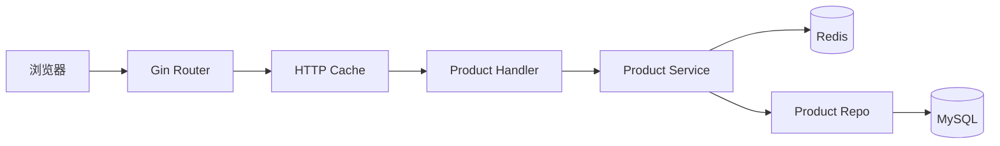
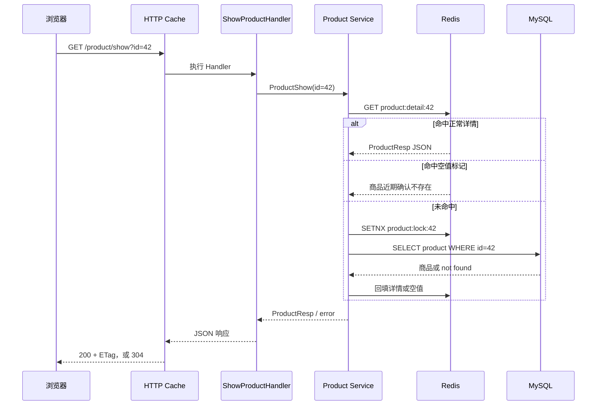
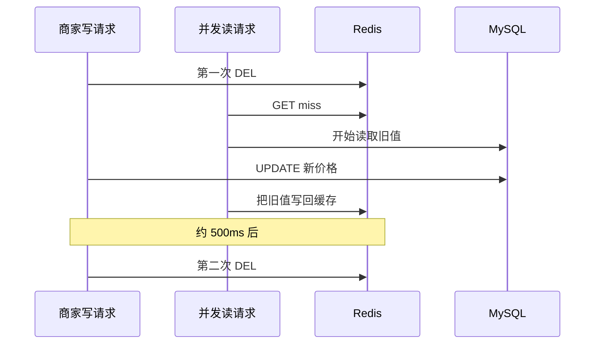

# 06 商品展示：页面上的一件商品从哪里来

目录

- [一、页面有商品，后端却可能没有返回商品](#一页面有商品后端却可能没有返回商品)
- [二、列表接口不只是查一页数据](#二列表接口不只是查一页数据)
- [三、热门商品的详情怎样读](#三热门商品的详情怎样读)
- [四、商家改价以后，旧价格还会留在哪里](#四商家改价以后旧价格还会留在哪里)
- [五、浏览器缓存与当前实现的边界](#五浏览器缓存与当前实现的边界)

仓库里已经有一套 React 店面，构建产物由 Go 服务挂在 `/app/`。商品卡片、详情弹窗、搜索浮层和购物袋都已经实现。这一讲沿着商品展示链路，判断页面数据来自 seed、HTTP 接口、Redis 还是 MySQL，并解释展示信息怎样影响用户浏览和后续交易。

商品展示看起来只是“把数据库中的商品画到页面上”，实际承担的是交易入口。用户要先看见商品、相信价格和库存，才会进入购物车和下单。这里一旦出错，结果不只是页面不好看：

- 上架商品没有展示，商家损失曝光和成交；
- 下架商品仍能打开，用户可能为不可售商品下单；
- 改价后页面长时间显示旧价，结算价与用户预期不一致；
- 库存显示为有货、下单却失败，会持续消耗用户信任；
- 为了提速而缓存错误响应，故障可能在后端恢复后继续影响用户。

所以这一讲始终围绕三个业务问题展开：用户能不能看到应该看到的商品，页面信息能不能及时跟上商家的操作，以及展示数据与交易事实不一致时由谁兜底。

先在仓库根目录打开两个终端。第一个终端启动 MySQL 和 Redis：

```bash
docker compose up -d mysql redis
docker compose ps mysql redis
```

第二个终端启动后端：

```bash
SNOWFLAKE_ALLOW_DEFAULT=true go run ./cmd
```

看到 `server listening on :5003` 后，打开：

```text
http://127.0.0.1:5003/app/
```

如果刚修改过 `web/src`，先重新构建前端，再启动 Go：

```bash
cd web
npm ci
npm run build
cd ..
SNOWFLAKE_ALLOW_DEFAULT=true go run ./cmd
```

另外保留一个终端，先定义地址，后面的命令可以逐条执行：

```bash
BASE_URL='http://127.0.0.1:5003/api/v1'
```

先访问当前前端使用的真实列表接口。再请求一个错误路径，对比 404 时页面与接口的差别：

```bash
curl -sS "$BASE_URL/product/list?page_num=1&page_size=12" | jq
curl -i "$BASE_URL/products"
```

不要把商品 ID 写死成 42。直接从列表响应中取第一件商品：

```bash
PRODUCT_ID=$(
  curl -sS "$BASE_URL/product/list?page_num=1&page_size=12" |
  jq -r '.data.item[0].id'
)
echo "$PRODUCT_ID"
curl -i "$BASE_URL/product/show?id=$PRODUCT_ID"
```

如果 `PRODUCT_ID` 输出 `null`，说明当前数据库没有商品数据。此时页面仍然能展示八张卡片，恰好可以证明它展示的是前端 seed，而不是数据库查询结果。

查看浏览器缓存头和 304：

```bash
curl -sS -D - -o /dev/null \
  "$BASE_URL/product/show?id=$PRODUCT_ID"

ETAG=$(
  curl -sS -D - -o /dev/null \
  "$BASE_URL/product/show?id=$PRODUCT_ID" |
  awk -F': ' 'tolower($1)=="etag" {gsub("\\r", "", $2); print $2}'
)
curl -i -H "If-None-Match: $ETAG" \
  "$BASE_URL/product/show?id=$PRODUCT_ID"
```

查看 Redis 详情缓存。配置使用 4 号库；通过容器执行命令不要求本机安装 `redis-cli`：

```bash
docker exec redis redis-cli -n 4 GET "product:detail:$PRODUCT_ID"
docker exec redis redis-cli -n 4 PTTL "product:detail:$PRODUCT_ID"
docker exec redis redis-cli -n 4 TTL "product:detail:$PRODUCT_ID"
```

清掉详情缓存后连续请求两次，用来观察第一次回源和第二次缓存命中：

```bash
docker exec redis redis-cli -n 4 DEL \
  "product:detail:$PRODUCT_ID" \
  "product:lock:$PRODUCT_ID"

curl -sS "$BASE_URL/product/show?id=$PRODUCT_ID" | jq
docker exec redis redis-cli -n 4 PTTL "product:detail:$PRODUCT_ID"
curl -sS "$BASE_URL/product/show?id=$PRODUCT_ID" | jq
```

不用时可以停止依赖：

```bash
docker compose stop mysql redis
```

---

## 一、页面有商品，后端却可能没有返回商品

先从一个上线事故开始：运营验收时首页有八件商品，大家认为发布成功；上线后才发现这些卡片是打包在前端里的 seed 数据，真实商家刚上架的商品一件也没有出现。页面“看起来正常”，反而掩盖了交易入口已经断开。

运行仓库里的 React 店面，首页能看到商品卡片，搜索和购物袋也能用。单看页面，很容易以为商品服务已经接好了。

打开浏览器 Network，会看到前端请求的是：

```ts
api('GET', '/api/v1/product/list', { page_size: 12, page_num: 1 })
```

它与后端注册的列表路由一致：

```text
GET /api/v1/product/list
```

列表已经接通，但页面仍有一个容易掩盖故障的兜底：初始状态使用前端 seed；只有接口成功返回非空数组，才会换成后端商品。接口报错或返回空列表时，页面继续保留 seed：

```ts
const [items, setItems] = useState<Product[]>(PRODUCTS)

listProducts()
  .then((mapped) => {
    if (mapped.length) setItems(mapped)
  })
  .catch(() => { /* 接不到后端时保留 seed 数据 */ })
```

因此，看到商品卡片仍然不能单独证明后端数据正常。录制时在 Network 中确认 `/api/v1/product/list` 返回 200，并把响应中的商品名与页面卡片对上；然后停止后端或制造一次失败请求，观察页面为什么仍保留 seed。

这也是排查商品页的起点。业务验收不能只问“页面有没有商品”，还要问“刚上架的商品多久能出现”“下架后多久消失”“接口失败时用户看到什么”。页面只能说明组件画出了东西，不能证明真实商品已经经过 Handler、Redis 和 MySQL 返回。

## 二、列表接口不只是查一页数据

用户进入首页时，不会只看到一张商品表。他还需要分类、轮播图、商品卡片和总页数；其中任何一个接口变慢，都可能推迟首屏出现的时间。商品首页因此不是由一个接口拼出来的。当前公开读接口和缓存时间如下：

| 页面数据 | API | HTTP cache | Redis 数据缓存 |
|---|---|---:|---|
| 商品列表 | `GET /api/v1/product/list` | 30 秒 | 只缓存 `total` |
| 商品详情 | `GET /api/v1/product/show?id=42` | 60 秒 | 详情 10 分钟，加随机抖动 |
| 商品相册 | `GET /api/v1/product/imgs/list?id=42` | 无 | 无 |
| 分类列表 | `GET /api/v1/category/list` | 300 秒 | 无 |
| 首页轮播 | `GET /api/v1/carousels` | 300 秒 | 无 |

Redis 中没有保存整页商品列表，只有详情对象、列表总数和浏览量等数据。



这里的分层和用户模块一样。Handler 接 HTTP 参数并写响应，Service 决定先读哪里以及怎样组装 `ProductResp`，Repo 把查询条件和分页翻译成 SQL。MySQL 保存商品业务记录，Redis 保存可以短暂过期的读取副本。

### 一次列表请求经过哪些代码

用下面的请求看第一页、每页 12 件、分类 ID 为 2 的商品：

```bash
curl 'http://localhost:5003/api/v1/product/list?page_num=1&page_size=12&category_id=2'
```

Handler 绑定 query。没有传 `page_size` 时，它补上 `consts.BaseProductPageSize`，然后把请求交给 `ProductList`：

```go
req, ok := response.Bind[ProductListReq](ctx)
if !ok {
    return
}
if req.PageSize == 0 {
    req.PageSize = consts.BaseProductPageSize
}
resp, err := GetProductSrv().ProductList(ctx.Request.Context(), req)
```

Service 先准备查询条件。`category_id=0` 表示不按分类过滤，否则把它放进 `condition`：

```go
condition := make(map[string]interface{})
if req.CategoryID != 0 {
    condition["category_id"] = req.CategoryID
}

products, err := productDao.ListProductByCondition(condition, req.BasePage)
total, err := cache.ProductCountCached(ctx, req.CategoryID, func() (int64, error) {
    return productDao.CountProductByCondition(condition)
})
```

Repo 会发出一条分页查询和一条计数查询，作用不同：前者返回当前页的卡片，后者告诉前端一共有多少条记录。

```sql
SELECT * FROM product WHERE category_id = ? LIMIT 12 OFFSET 0;
SELECT COUNT(*) FROM product WHERE category_id = ?;
```

`total` 与页码无关，没有必要在每次翻页时重新统计。对用户来说，它只是“还有多少页”；对数据库来说，在近百万商品上反复 `COUNT(*)` 却可能成为整个列表接口最慢的一步。`ProductCountCached` 把结果放进 Redis 60 秒：全量计数使用 `product:count:all`，分类计数使用 `product:count:cat:<category_id>`。同一进程内的并发 COUNT 还会由 singleflight 合并。Redis 读取或写入失败时，请求继续查 MySQL，列表不会因为计数缓存故障直接不可用。

这里接受的是“总数最多晚 60 秒变化”，换来翻页接口不必每次扫描全表。这个取舍成立，是因为总数不是价格、库存或付款金额；它可以短暂不精确，却不能拖垮用户浏览商品的主链路。

商品行本身仍然每次从 MySQL 读取。不要把这条链讲成“列表已经进了 Redis”。

### 先看用户会不会拿到错误数据

当前 `ListProductByCondition` 没有稳定的 `ORDER BY`。当商家不断上架新商品时，OFFSET 分页可能让用户在第二页再次看到第一页面的商品，也可能永远错过某件商品。公开列表也没有加入 `on_sale = true`，匿名用户有机会看到已经下架的商品。

详情查询同样只按 ID 查，没有判断 `on_sale`。团队要先决定下架后的访问规则：只是从列表隐藏，还是公开详情也不能打开。规则定下来后，列表和详情要一起改，否则同一件商品在两个入口会有两种答案。

还有一个不太显眼的成本。Service 在组装每个 `ProductResp` 时都会调用一次 `p.View()`，而 `View()` 会读一次 Redis。一页有 15 件商品，就有 15 次串行 GET。卡片如果不展示浏览量，最省事的处理是从列表响应里去掉它；如果产品确实需要，就应该批量读取。

### 想一想

假设数据库里刚下架一件商品。为什么只给列表加 `on_sale = true` 还不够？

<details>
<summary>参考答案</summary>

用户仍然可以拿商品 ID 直接访问详情接口。下架语义必须覆盖所有公开读取入口，不能只修首页列表。

</details>

## 三、热门商品的详情怎样读

假设一件商品突然被首页推荐或主播点名，同一个商品 ID 会在几秒内收到大量详情请求。业务希望热度带来成交，而不是把 MySQL 打满后让所有商品一起打不开。列表页之后，继续打开一件真实商品。详情路由外面有 60 秒 HTTP cache，Service 里面还有一层 Redis 对象缓存：

```go
public.GET(
    "product/show",
    middleware.HTTPCache(60*time.Second),
    ShowProductHandler(),
)
```

两层缓存的服务对象不同。浏览器强缓存命中时，请求不会进入 Gin；请求进入后，Redis 才决定要不要查询 MySQL。



正常详情的 key 是 `product:detail:<id>`，基础 TTL 为 10 分钟。写入时再增加 `[0, 90s)` 的随机时间，让同一批缓存不要挤在一个时刻过期。商品不存在时，代码把 `\x00null` 写到同一个 key，TTL 只有 60 秒。随机 ID 被反复访问时，这个空值能挡住大部分数据库穿透；短 TTL 又给后来上架同 ID 数据留下了恢复时间。

空值使用 `SET NX` 写入。原因是“查询发现不存在”和“另一请求刚写入真实详情”可能并发发生，无条件写空值会盖掉真实数据。

### 缓存失效时，谁去查数据库

详情 miss 后，`TryProductLock` 尝试创建 `product:lock:<id>`，锁的 TTL 是 3 秒。抢到锁的请求回源，没抢到的请求等 50ms，再读一次详情缓存：

```go
locked, _ := cache.TryProductLock(ctx, req.ID)
if !locked {
    time.Sleep(50 * time.Millisecond)
    if err := cache.GetProductDetail(ctx, req.ID, cached); err == nil {
        return cached, nil
    }
} else {
    defer cache.UnlockProduct(ctx, req.ID)
}

loaded, err := cache.LoadProductOnce(req.ID, func() (interface{}, error) {
    return s.loadProductFromDB(ctx, req.ID)
})
```

Redis 的 SETNX 用来协调多个应用实例；`LoadProductOnce` 里的 singleflight 只能合并当前 Go 进程内相同 ID 的回源。没拿到 Redis 锁的请求只重试一次，50ms 后仍然 miss 就会继续查数据库。因此当前实现能减少并发回源，但不能保证整个集群只查一次 MySQL。

可以先清掉商品 42 的详情和锁，再连续请求两次：

```bash
redis-cli -n 4 DEL product:detail:42 product:lock:42
curl -i 'http://localhost:5003/api/v1/product/show?id=42'
redis-cli -n 4 PTTL product:detail:42
curl -i 'http://localhost:5003/api/v1/product/show?id=42'
```

第一次请求应当出现数据库查询，随后 Redis 中的 PTTL 接近 600000–690000ms；执行命令本身会消耗一点时间。第二次请求从哪里返回，最好结合 SQL 日志和 Redis key 判断，不要只比较两次 `curl` 的耗时。

详情缓存里还有 `Num` 和 `View`。它们只是帮助用户作出购买决定的展示值：支付扣库存和库存回滚目前不会删除详情缓存，`AddView()` 也没有调用方。在详情链路中，`View()` 只在 `loadProductFromDB` 组装 DTO 时读取 Redis。用户看到的库存和浏览量都可能滞后。

这条边界必须说清楚：商品页可以告诉用户“现在看起来还有货”，但不能凭这份缓存承诺一定能买到；创建订单时仍要重新读取权威价格、卖家和库存。否则攻击者还可以绕过页面，直接拿旧价格或伪造价格请求下单，把一个展示问题放大成资损。

---

## 四、商家改价以后，旧价格还会留在哪里

从一次促销改价开始。假设商家在直播开始前把一件商品从 299 元改成 269 元。商家后台已经提示修改成功，但消费者仍看到 299 元，会认为活动没有生效；如果页面显示 269 元而订单按 299 元结算，问题就从缓存延迟升级成价格纠纷。

写接口先经过 merchant 角色检查，但角色只说明“他是一名商家”，不能说明这件商品属于他。Repo 在更新条件里同时检查 `id` 和 `boss_id`：

```go
res := d.DB.Model(&Product{}).
    Where("id=? AND boss_id=?", productID, userID).
    Updates(map[string]interface{}{
        "name":           product.Name,
        "category_id":    product.CategoryID,
        "title":          product.Title,
        "info":           product.Info,
        "price":          product.Price,
        "discount_price": product.DiscountPrice,
        "num":            product.Num,
        "on_sale":        product.OnSale,
    })
```

`RequireRole` 挡住普通买家，`boss_id` 条件挡住商家修改别人的商品。更新使用 map 还有一个实际原因：GORM 用 struct 做 `Updates` 时会跳过零值，`num=0` 和 `on_sale=false` 却都是合法业务状态。

当前写路径采用延迟双删：

```go
_ = cache.DelProductDetail(ctx, req.ID)
err := updateProductAndEvent(db, req.ID, user.ID, product)
if err != nil {
    return nil, err
}

cache.DoubleDeleteAsync(req.ID, 0) // 默认 500ms 后再删一次
```

`updateProductAndEvent` 在同一个数据库事务中完成归属校验、商品更新和 Outbox 插入。Outbox 写入失败时商品更新会回滚；不存在或越权时也不会产生虚假的 `product.changed` 事件。缓存操作留在事务外，避免 Redis 延长数据库事务。

为什么删一次不够？考虑一个比写请求稍早开始的读请求：



第二次删除用来清理并发读回填的旧值。它有 2 秒独立超时，并限制最多 1024 个延迟删除 goroutine 在飞；超过上限会放弃本次第二次删除，避免 Redis 故障时 goroutine 不断堆积。

这套做法仍然允许短时间读到旧价格。第一次或第二次 Redis 删除可能失败，浏览器也可能在 `max-age` 内直接复用旧响应。业务上需要明确承诺的是“改价后多久全站可见”，而不是笼统地说缓存最终会一致。

更新事务提交后，publisher 会把同事务写入的 `product.changed` 事件交给搜索 indexer，异步更新 ES。商品事实与事件不会出现一边成功、一边失败；但消息等待、消费和 ES refresh 仍会造成短暂延迟，因此搜索渠道依然需要同步时延 SLA、积压告警和数据对账。

### 想一想

数据库已经是 269 元，两次 Redis 删除也都成功了，用户为什么还可能看见 299 元？

<details>
<summary>参考答案</summary>

浏览器可能仍在 `max-age` 新鲜期内，直接复用本地保存的旧响应。这次访问不会进入 Gin，自然也不会读取已经更新的数据库和 Redis。

</details>

## 五、浏览器缓存与当前实现的边界

浏览器缓存的业务价值，是减少重复下载并让商品详情打开得更快；它的代价，是后端已经改价或下架时，用户仍可能在一段时间内看见旧页面。缓存时间不是越长越好，而是在访问速度、后端成本和信息时效之间作出的承诺。

`HTTPCache` 给 HTTP 200 响应写入：

```http
Cache-Control: public, max-age=60
ETag: W/"..."
```

`max-age=60` 还没过时，浏览器可以直接使用本地响应，后端看不到这次访问。过期后，浏览器可能带 `If-None-Match` 请求服务器；ETag 相同则收到 304，不再下载响应体。

当前中间件要先执行完整 Handler，才能根据响应体计算 ETag：

```go
c.Writer = buf
c.Next() // Redis/DB 查询和 JSON 序列化已经完成

etag := weakETag(buf.body.Bytes())
if c.GetHeader("If-None-Match") == etag {
    original.WriteHeader(http.StatusNotModified)
    return
}
```

因此 304 可以省响应 body，却不一定省 Redis 或 MySQL 查询。它和 `max-age` 新鲜期内完全不发请求是两条不同路径。

还有一个会直接影响用户的契约冲突。`HTTPCache` 只处理 HTTP 200，本来是想避开错误响应；项目的统一错误出口却同样返回 HTTP 200：

```go
func Fail(ctx *gin.Context, err error) {
    ctx.JSON(http.StatusOK, ErrorResponse(ctx, err))
}
```

参数错误、商品不存在和临时数据库故障都有可能带上 `Cache-Control: public`，随后被浏览器或共享缓存复用。修复时可以让业务错误返回真实 4xx/5xx，也可以让中间件读取业务码，只缓存成功结果；无论选哪一种，HTTP 状态和缓存判定必须使用同一套成功语义。

优化顺序按用户影响来排：先让接口失败和空列表在开发环境中可见，避免 seed 遮住数据问题；接着统一下架规则和稳定排序，避免用户看到不可售商品或翻页漏商品；然后再处理 N+1、缓存命中率和 304 的开销。页面上的价格和库存只用于展示，交易服务仍要以当前数据库状态完成校验。

这一讲最后要留下的不是某个 Redis key，而是一条业务边界：展示系统负责让用户快速看到尽可能新的信息，交易系统负责在真正扣库存、计价和付款前重新确认事实。前者可以接受有上限的延迟，后者不能相信浏览器和缓存带来的旧值。

## 课后延伸

- 为开发环境增加明确的接口失败和空列表提示，避免 seed 数据掩盖故障。
- 给公开列表补稳定排序；定义下架语义后，为 list/show 增加一致的可见性测试。
- 修改 `HTTPCache`，确保业务失败响应不会进入共享缓存，并分别测试成功、not found 和服务错误。
- 为商品创建事务增加故障测试：图片记录或 Outbox 插入失败时，商品、相册记录和事件必须一起回滚。文件上传属于数据库外部副作用，还要设计孤儿文件清理或补偿任务。
