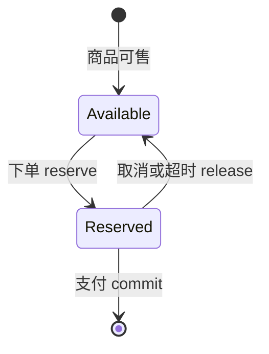
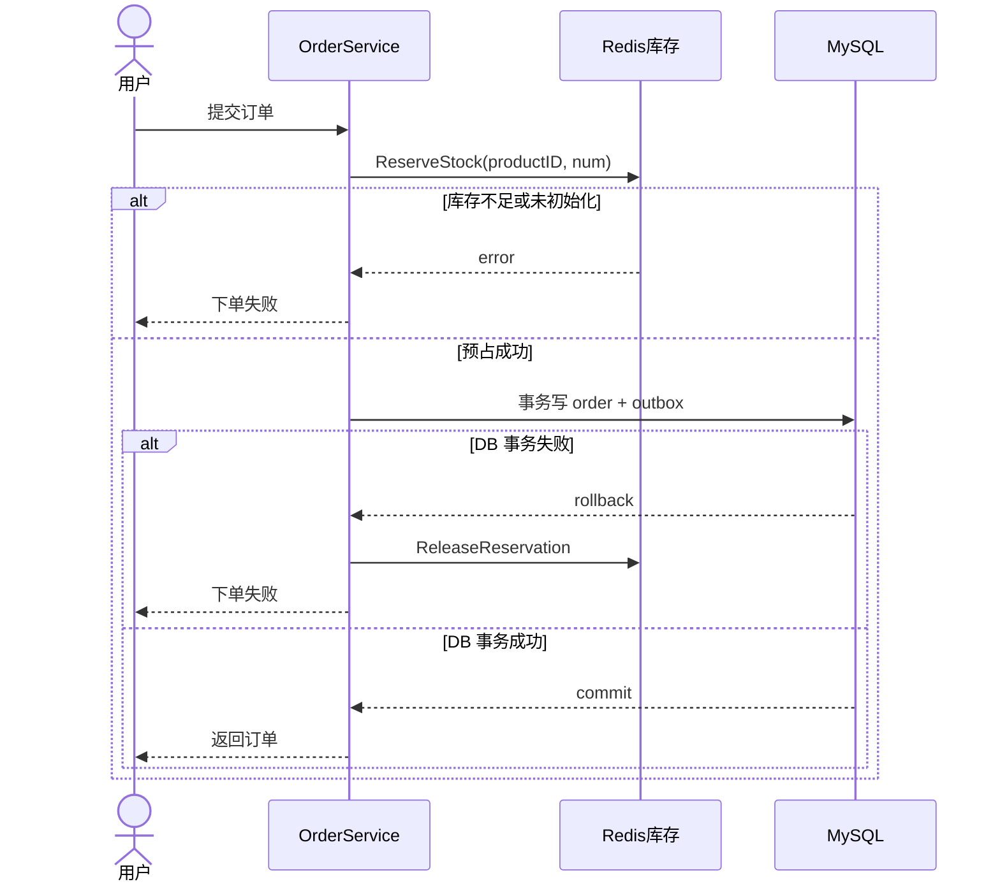

# 库存与防超发：把“还有货”变成可信承诺

> 这一讲只回答一件事：用户下单到付款之间，平台怎样既不超卖，也不把库存永久锁死。

## 课堂节奏（60 分钟以内）

| 时间 | 内容 | 讲完后学生能回答 |
|---:|---|---|
| 0–6 分钟 | 业务冲突 | 为什么下单不能立刻算售出 |
| 6–14 分钟 | `available / reserved` 两桶模型 | 页面库存和预占库存分别是什么 |
| 14–27 分钟 | Redis Lua 原子预占 | 并发请求为何不会把库存扣成负数 |
| 27–38 分钟 | 下单事务与 Saga 补偿 | Redis 成功、MySQL 失败怎么办 |
| 38–48 分钟 | 支付、取消与超时关单 | `commit` 和 `release` 为什么不同 |
| 48–55 分钟 | 启动重建与一致性边界 | Redis 丢数据后怎样恢复 |
| 55–60 分钟 | 演示与收束 | 用两个桶复述完整链路 |

演示只做一个，约 5 分钟。压测、客服 SOP 和扩展库存模型放到课后。

---

## 一、先看业务矛盾：下单不等于卖出

假设商品只剩 1 件。小王提交订单后去切换支付方式，小李在这几分钟内也点了购买。平台必须同时守住两句话：

- 小王已经拿到订单，这件货不能再答应给小李；
- 小王还没付款，这件货也不能永久算作售出。

只用一个 `stock` 数字很难表达“占着但还没卖”的状态。等付款时再扣会超卖；下单时直接从数据库永久扣除，未付款订单又会制造缺货。

gomall 把运行时库存分成两个 Redis 桶：

```text
stock:available:{productID}  还能接多少新订单
stock:reserved:{productID}   已下单、尚未支付的数量
```

MySQL 的 `product.num` 是持久化水位，Redis 是下单时的快速账本。



讲到这里先问学生：商品页应该展示哪个数？答案是 `available`。`reserved` 是客服和系统排障要看的数，不是还能卖的数。

---

## 二、预占：一段 Lua 守住“不超卖”

预占必须把“检查够不够”和“两个桶一起变化”做成一个原子动作。若先 `GET` 再由 Go 发两条写命令，两个请求可能同时读到最后 1 件，然后都成功。

当前实现位于 `repository/cache/inventory.go`：

```lua
local avail = redis.call('GET', KEYS[1])
if avail == false then
    return -2
end
local need = tonumber(ARGV[1])
if tonumber(avail) < need then
    return -1
end
redis.call('DECRBY', KEYS[1], need)
redis.call('INCRBY', KEYS[2], need)
return 1
```

返回值把三种业务结果分开：

| 返回值 | Go 层结果 | 对用户的含义 |
|---:|---|---|
| `1` | 成功 | 库存已经为这笔订单留好 |
| `-1` | `ErrStockInsufficient` | 当前可售数量不足 |
| `-2` | `ErrStockNotInit` | 库存账本尚未初始化，应告警而非当成售罄 |

Lua 在 Redis 内一次执行完判断和修改，其他请求不能插进中间。100 件库存面对 500 个并发请求，前 100 个把 `available` 依次扣到 0，后面的请求只能拿到库存不足。

注意，这里证明的是 Redis 账本不会扣穿，并不等于整条下单链天然一致。下一段才是最容易出事故的地方。

---

## 三、下单链路：跨 Redis 与 MySQL 的补偿

一次下单跨了两个资源：Redis 预占库存，MySQL 写订单和 outbox。它们没有共同事务，因此代码采取 Saga：先做，后续失败再执行反向动作。



业务代码的骨架如下，细节以 `internal/order/service.go` 为准：

```go
if err := cache.ReserveStock(ctx, req.ProductID, int64(req.Num)); err != nil {
    return nil, err
}

err := dao.NewDBClient(ctx).Transaction(func(tx *gorm.DB) error {
    if err := NewOrderDaoByDB(tx).CreateOrder(order); err != nil {
        return err
    }
    return outbox.NewOutboxDaoByDB(tx).Insert(/* OrderCreated */)
})
if err != nil {
    if releaseErr := cache.ReleaseReservation(
        ctx, req.ProductID, int64(req.Num),
    ); releaseErr != nil {
        util.LogrusObj.Errorf("release reservation failed: %v", releaseErr)
    }
    return nil, err
}
```

这里有一个必须讲清的边界：补偿失败只会记录日志，当前请求无法保证 Redis 已恢复。生产系统还需要告警、重试任务和库存对账；否则多次“DB 失败且补偿失败”会让 `reserved` 越积越多，形成库存泄漏。

---

## 四、订单的三个结局

### 1. 支付成功：只减少 reserved

钱已到账，这份库存不再回到可售池：

```lua
local r = redis.call('GET', KEYS[1])
if r == false or tonumber(r) < tonumber(ARGV[1]) then
    return -1
end
redis.call('DECRBY', KEYS[1], ARGV[1])
return 1
```

`CommitReservation` 只做 `reserved -= n`，`available` 不变。数据库支付结算完成后再调用它；数据库仍是业务事实，Redis 清理失败需要后续对账。

### 2. 主动取消：reserved 退回 available

```lua
redis.call('DECRBY', KEYS[1], ARGV[1])
redis.call('INCRBY', KEYS[2], ARGV[1])
```

`ReleaseReservation` 同时移动两个桶。脚本先检查 `reserved >= n`，避免同一订单重复释放时把库存凭空加出来。

### 3. 超时未付：幂等关单后再释放

gomall 有两条关单路径：RabbitMQ 延迟消息使用 30 分钟 TTL，Cron 则调用 `GetTimeoutOrders(15, 100)` 扫描超过 15 分钟仍待付款的订单。两个时间口径目前并不一致，实际效果是 Cron 可能先关单；讲课时要把它当作当前实现边界，而不是包装成标准设计。

两条路径最终汇到幂等关单逻辑。只有条件更新真的把订单从“待付款”改成“已关闭”，代码才释放库存；迟到的第二次关单得到 no-op，不会再释放一遍。

```go
ok, err := NewOrderDaoByDB(tx).CloseOrderWithCheck(orderNum)
if err != nil { return err }
if !ok { return nil }
closed = true
// 同一事务写 OrderCancelled outbox

if closed {
    _ = cache.ReleaseReservation(ctx, order.ProductID, int64(order.Num))
}
```

课堂追问：为什么不能先释放 Redis，再改订单状态？因为两个关单请求可能都先释放成功，随后只有一个更新订单成功，库存就被多加了一次。

---

## 五、Redis 重启后：重建不是简单覆盖

服务启动时，库存同步器从 MySQL 读取商品水位，再初始化 Redis。这里必须区分两种场景：

- Redis 确实丢失了对应 key，可以从数据库建立账本；
- 滚动发布时，旧实例仍在处理订单，Redis 已有实时 `available / reserved`，新实例不能用初始水位覆盖它。

因此讲解 `SeedFromDB` 时要盯住两个设计点：游标分页避免一次把商品全读进内存；初始化前检查 key 是否存在，已有库存跳过。`InitStock` 本身是覆盖写，所以“先判断再初始化”的调用纪律很重要，而且检查与写入之间仍有竞态窗口。

这也暴露了模型边界：`product.num` 注释称为初始水位，不是随每次 Redis 预占实时变化的总账。若 Redis 在有未完成订单时彻底丢失，仅凭它无法还原准确的 `reserved`。生产恢复需要结合待付款订单重算，而不是只复制商品表。

---

## 六、课堂演示（5 分钟）

目标：让学生亲眼看到一次 reserve 和一次 release，不做长时间压测。

```bash
# 将 42 换成测试商品 ID；Redis DB 号以本地配置为准
redis-cli GET stock:available:42
redis-cli GET stock:reserved:42

# 调用一次下单接口后再次查看两个 key
redis-cli GET stock:available:42
redis-cli GET stock:reserved:42
```

预期现象：下单成功后 `available` 减少、`reserved` 增加；取消订单后两个变化反向恢复。若重复取消，数值不应再变化。

演示失败时按顺序排查：商品库存 key 是否初始化、请求是否通过鉴权、订单是否仍处于待付款状态。不要在录制中临时跑 500 并发，压测结果不稳定会吞掉整节课。

---

## 七、60 秒收束

库存设计可以压缩成四句话：

1. `available` 回答“还能卖多少”，`reserved` 回答“已经答应但尚未收钱多少”。
2. Lua 把判断与两桶迁移做成原子动作，防止并发扣穿。
3. 下单跨 Redis 和 MySQL，事务失败必须执行 `release`；补偿仍可能失败，所以还要对账。
4. 支付走 `commit`，取消和超时走 `release`，关单状态更新负责挡住重复释放。

## 课后延伸（不计入 60 分钟）

- 阅读 `repository/cache/inventory.go`，给三个 Lua 脚本补齐并发测试。
- 对照 `internal/order/cancel.go`，解释 `closed` 标志如何保护库存。
- 设计“Redis 全量丢失但仍有待付款订单”时的重建算法。
- 把 RabbitMQ 30 分钟与 Cron 15 分钟改成同一配置源，并写出迁移方案。

## 代码索引

| 主题 | 文件 |
|---|---|
| 两桶 Lua 与快照 | `repository/cache/inventory.go` |
| 下单预占及失败补偿 | `internal/order/service.go` |
| 幂等关单 | `internal/order/cancel.go` |
| 超时订单查询 | `internal/order/repo.go` |
| 启动重建与对账 | `service/inventory/syncer.go` |
