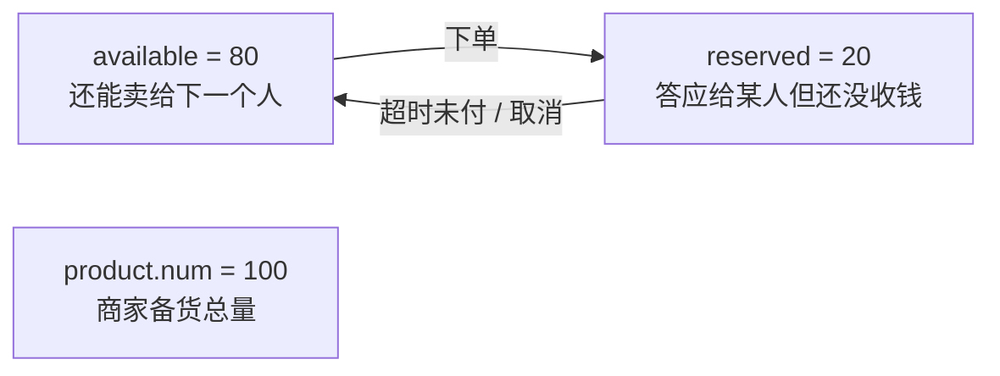
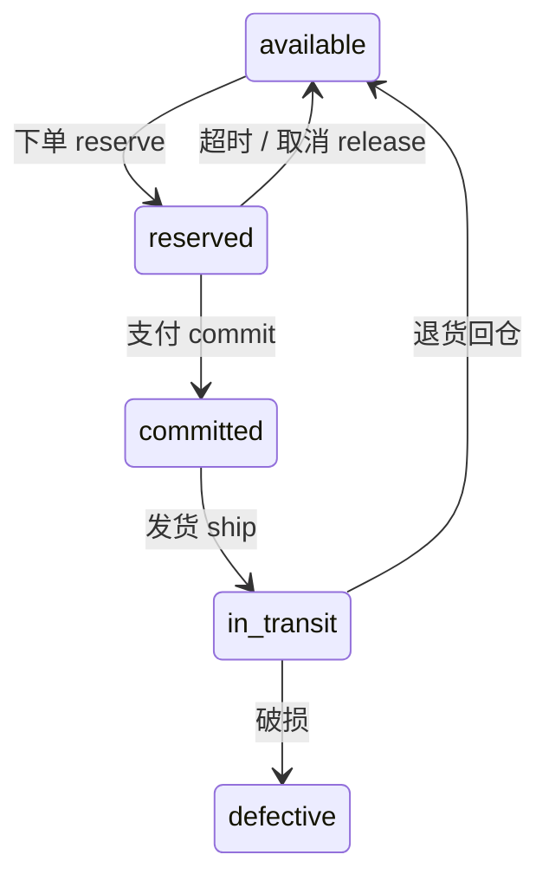
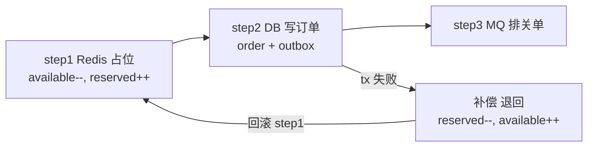
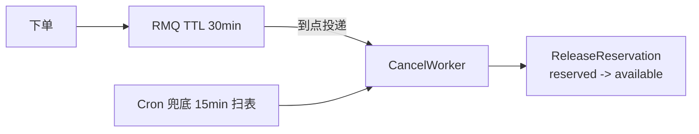
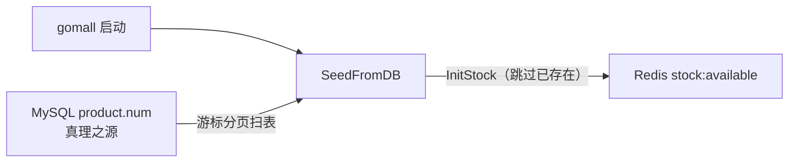

# 库存与防超发

> gomall · 业务承诺 / 客诉自愈 / 两桶语义 / Saga 退回 / 启动重建
>
> 这份讲义不讲"怎么写一段扣库存的 Redis Lua"，讲的是**库存这个数字背后的五条业务承诺**——它对五个角色各意味着什么、一次超卖要赔多少钱、客服面对"加购还有货、下单说缺货"该说什么话，以及为什么所有工程选择都往"宁可误锁不可超卖"这一侧倒。

## 目录

- [一、库存对五个角色意味着什么](#一库存对五个角色意味着什么)
- [二、超卖：一笔订单的真实业务代价](#二超卖一笔订单的真实业务代价)
- [三、两桶库存的业务语义](#三两桶库存的业务语义)
- [四、下单 reserve：业务承诺的工程化](#四下单-reserve业务承诺的工程化)
- [五、Saga 退回：避免"凭空缺货"事故](#五saga-退回避免凭空缺货事故)
- [六、关单释放：15 / 30 / 60 分钟的业务权衡](#六关单释放15--30--60-分钟的业务权衡)
- [七、启动重建：服务重启时的业务窗口](#七启动重建服务重启时的业务窗口)
- [八、客服 SOP：三类高频工单的自查路径](#八客服-sop三类高频工单的自查路径)
- [九、业务承诺 SLO 与超卖应急](#九业务承诺-slo-与超卖应急)
- [十、业务边界与路线图](#十业务边界与路线图)
- [附录 A：面试 Q&A](#附录-a面试-qa)
- [附录 B：代码位置一览](#附录-b代码位置一览)

---

## 一、库存对五个角色意味着什么

### 同一个"库存数字"，五个角色五种关心点

"库存"看起来只是商品详情页上的一个整数，但它其实是**五条不同业务承诺的交叉点**。同一个数字，五个利益相关者盯着它问的是完全不同的问题：

| 角色 | 关心的事 | 库存系统该回答的问题 |
|---|---|---|
| **C 端用户** | 加购了还能不能买 | 提交订单时不能"突然没货" |
| **商家** | 我卖了多少 / 还剩多少 | 哪个 SKU 跌破阈值要补货 |
| **运营 / 平台** | 缺货 SKU 看板 / 补货决策 | 哪些热品长期 reserved 高 |
| **客服** | 超卖怎么补偿 / 误锁怎么解释 | 给出可执行话术 + 工单根因定位 |
| **SRE** | Redis 跟 DB 一致吗 | 启动重建 / 巡检对账 / 告警分级 |

本 deck 就顺着这五个角色，把每件事一件件摊开——你会看到同一段 Lua、同一条 Saga，为五个角色各自解决一个痛点。

### 下单到付款，中间那 15 分钟的业务窗

先理解一个最容易被工程忽略、却是整套设计出发点的业务事实：**用户点"提交订单"到点"立即支付"，中间有一段缓冲时间**。gomall 给这段时间的业务定义是——

- 这段时间里，商品**不能再被别人买走**（否则用户去付款时发现没货了，体验崩）；
- 但它也**还没真正卖出**（用户可能最终不付款）。

这个"占着但没消耗"的中间态，正是库存建模的难点。如果只用一个 `stock=N` 表达，你只有两个坏选择：

- **误锁**——用户一提交就当卖出扣掉，结果他没付款，这份库存就白白丢了；
- **超卖**——提交时不扣，等付款才扣，结果这 15 分钟里另一个人也提交了同一件。

gomall 的答案是把库存切成两个桶：`available`（可售）与 `reserved`（预占）。下一节起，所有设计都是围绕这两个桶展开的。

### 本 deck 七条业务问题

带着这七个问题往下看，每一节都在回答其中一条：

1. 1 个超卖订单的业务后果到底有多严重？工时、补偿、商誉怎么计？
2. 为什么把库存切成 available + reserved 两桶？业务意义是什么？
3. Redis 重启 / 副本扩容时，库存数字怎么从 DB 重建？期间能下单吗？
4. 下单成功但 DB 落库失败，预占的库存会不会泄漏成"凭空缺货"？
5. 关单（超时 / 用户主动）触发的库存退回，业务上几分钟是合适的？
6. 客服收到"加购后还有 5 件，下单时说缺货"工单，怎么自查 + 怎么回？
7. 库存对外业务承诺（SLO）是什么？哪些场景超过 SLO 就要赔？

---

## 二、超卖：一笔订单的真实业务代价

### 1 笔超卖订单 = 一连串的钱、工时、品牌损失

工程师容易把超卖当成"少扣了一次库存"的技术 bug。但从业务侧看，一笔超卖订单一旦发生，是一连串成本同时引爆：

| 环节 | 业务后果 | 估算成本 |
|---|---|---|
| 客服工单 | 用户怒打电话 / 在线投诉，平均 1 单 25 min | 客服工时 |
| 用户补偿 | 退款 + 道歉券（10 / 30 / 50 元档） | 10--50 元 |
| 商家发不出货 | 商家 SLA 违约罚款 / 自掏腰包补货 | 商品成本 + 罚金 |
| 平台代偿 | 同档替代品差价 / 自营仓兜底 | 差价 + 物流 |
| 品牌口碑 | 社交平台截图传播，新用户转化下滑 | 长期 GMV 损失 |
| **单笔 100 元商品超卖** | 直接现金 **≈ 60--150 元** + 不可量化口碑 | 远超商品本身利润 |

这张表就是库存系统工程目标的全部理由：**宁可误锁不可超卖**。两者的性质根本不对称——误锁只是一个体验事件（用户转身去别家买），超卖却是法律 / 合同 / 财务 / 品牌四件事一起爆。

### 零超卖怎么证明：500 个用户同时抢 100 件

业务承诺不能只写在 PPT 上，得能被测出来。gomall 用一个并发压测把"零超卖"钉成 CI 红线：

| 业务指标 | 实测 |
|---|---|
| 活动准备库存 | 100 件 |
| 同时下单用户数 | 500 |
| **成功下单数** | **恰好 100** |
| 拒单数（业务码：库存不足） | 400 |
| 活动结束 available 桶 | 0 |
| 活动结束 reserved 桶 | 100（等待支付） |

关键在"**恰好 100**"这个断言：少 1 个是少卖（商家的货没卖完）、多 1 个是超卖（发不出货），两个方向 CI 都判红。这条断言代表的不是一个技术指标，而是**对商家"我备货 100 件就只卖 100 件"这句承诺的工程化兑现**。

### 尾延迟为什么是业务问题：Redis Lua vs DB 行锁

同样是防超卖，用 Redis Lua 原子扣减，还是用 DB 的 `SELECT ... FOR UPDATE` 行锁？看平均值几乎分不出来，但业务真正在意的是**最差那个用户**：

| | Redis Lua | DB `SELECT FOR UPDATE` |
|---|---:|---:|
| 平均延迟 | 1.24 ms | 1.29 ms |
| p95 延迟 | 3.52 ms | 3.65 ms |
| **最差用户体验** | **136 ms** | **453 ms** |
| 吞吐 (RPS) | 51,362 | 50,142 |

平均 / p95 看不出差距，但最差那个用户从 136ms 涨到 453ms——这是 **3.3 倍的体验差**。业务后果很直接：大促 100k 并发时，DB 锁路径会让**尾部几百个用户**看到 1--2 秒转圈，转化率就在这里掉点；Redis Lua 路径把"最差体验"压在 150ms 以内。所以这不是一次技术选型的偏好，而是尾延迟直接换算成掉单。

---

## 三、两桶库存的业务语义

### available / reserved 翻译成业务话

两个桶不是技术名词，它们各自对应一句**能对客服讲清楚**的业务话：



- **available = 80**：还能卖给下一个人；
- **reserved = 20**：答应给某人但还没收钱；
- **product.num = 100**：商家备货总量（DB 里的初始水位）。

这套模型的客服价值在于：当用户问"为什么我加购后看见还有 5 件，下单却说没货"，客服可以**直接翻译成人话**回答——"其他 5 件被别的客户下单未付款占着，30 分钟内若对方不付款会自动放回来"。两桶模型让"缺货"从一个技术黑箱变成一句可解释的承诺。

### 物理库存 vs 可售库存：商家 / 客服 / 财务的语言对齐

再往下拆，一件商品的"库存"其实分散在好几个状态里，每个状态的读者不同、语义不同：

| 桶 | 谁在看 | 业务含义 |
|---|---|---|
| **available** | C 端 / 商详页 | "还能下单的数字"——唯一可对外曝光 |
| **reserved** | 客服 / 商家后台 | "已下单未支付"——客服查"为什么缺货" |
| committed | 财务 / 商家 | "已支付未发货"——进 GMV / 应发货量 |
| in_transit | 物流 (WMS) | 在途，归 WMS 仓储系统 |
| defective | 仓储 (WMS) | 残次，不入可售 |

> **业务对齐三原则**：
> 1. C 端**只看 available**——商详页绝不显示 reserved（会让用户"焦虑性下单"）。
> 2. 商家后台看 available + reserved——知道"承诺出去了多少"才好备货。
> 3. 财务对账盯恒等式：`available + reserved + committed = product.num`。

### 三态生命周期：业务侧四件事

把这些状态连起来，就是一份库存的完整生命周期。本仓库真正负责的是前三态之间的流转，发货之后的部分交给 WMS：



四个关键动作，对应四件业务事实：

- **下单 reserve**：占住一份库存，承诺给该用户。
- **支付 commit**：钱到账，库存真正消耗，不再可退回 available。
- **超时 / 取消 release**：承诺取消，库存退回再卖给下一个人。
- **发货 ship / 退货 / 破损**：归 WMS 仓储系统，本仓库**不做**（路线图）。

---

## 四、下单 reserve：业务承诺的工程化

### 8 行 Lua = "宁可误锁不可超卖"的工程化

"宁可误锁不可超卖"这句业务红线，落到代码就是这 8 行 Lua——关键是**先判断、再扣减**：

```lua
local avail = redis.call('GET', KEYS[1])    -- 1. 读 available
if avail == false then
    return -2                                -- 2. 库存未初始化 -> ErrStockNotInit
end
local need = tonumber(ARGV[1])
if tonumber(avail) < need then
    return -1                                -- 3. 不足 -> ErrStockInsufficient
end
redis.call('DECRBY', KEYS[1], need)          -- 4. available -= n
redis.call('INCRBY', KEYS[2], need)          -- 5. reserved  += n
return 1                                     -- 6. 占位成功
```

业务侧关键在第 2 / 第 3 步：它们**站在扣减之前**，宁可拒单也绝不允许扣穿——这就是"宁可误锁"的工程化。Redis 单线程 + Lua 原子执行，保证 500 个并发请求排队进入这段脚本，第 101 个进来时 `avail` 已经是 0，直接拒。

> **业务码口径**：库存不足在代码里是 `cache.ErrStockInsufficient` 错误对象，由上层 handler 统一映射成业务码后下发。注意 `50001` 是 `ErrorOss`（对象存储错误），与库存无关，两者语义独立。业务码维度的细分（如把库存类错误单列到 `90001` 段，与满减引擎占用的 `80001--80003` 区隔）属于业务码体系的演进项。

### 下单链路 + 失败自愈：业务侧三步走

下单不是一次 Redis 扣减就完事，它是一条链路：`用户点提交 → Redis 占库存 → DB 写订单 + outbox → MQ 排关单延迟`。链路的关键纪律是——**任何一步失败，已占的库存必须退回**，否则商家会"凭空缺货"。

```go
// 1) Redis 预扣: available -> reserved，失败直接拒单
if err = cache.ReserveStock(ctx, req.ProductID, int64(req.Num)); err != nil {
    return nil, err                       // ErrStockInsufficient
}
// 2) 同事务写订单 + 应用满减 + 写 outbox（ApplyDiscountInTx 段略）
err = dao.NewDBClient(ctx).Transaction(func(tx *gorm.DB) error {
    if e := NewOrderDaoByDB(tx).CreateOrder(order); e != nil { return e }
    return outbox.NewOutboxDaoByDB(tx).Insert(/* OrderCreated */)
})
if err != nil {
    // 3) 事务失败：必须释放刚扣的预占（Saga 补偿）
    if relErr := cache.ReleaseReservation(ctx,
            req.ProductID, int64(req.Num)); relErr != nil {
        util.LogrusObj.Errorf("release on tx failure: %v", relErr)
    }
    return
}
```

为什么是"**先 Redis 后 DB**"而不是反过来？两个业务理由：DB 慢的时候 Redis 直接拒单，不把过载请求继续压给 DB；而 DB 是真理之源，如果让热写流量直接打进 DB，会让"全平台"一起慢。Redis 站在前面当闸门，把过载拦在 DB 之外。

> 这里 `order.UserID` / `order.BossID` 都取自 JWT 解出的可信身份，不信请求体里的 `user_id` / `boss_id`——与第一份鉴权 deck 讲的"信 JWT，不信报文"是同一条纪律。

---

## 五、Saga 退回：避免"凭空缺货"事故

### 业务事故：DB 落库失败而预占未退 = 库存泄漏

上一节那第 3 步"失败就退回"，看着像防御性代码，其实防的是一个真实的 P1 事故。下单是一个跨 Redis + DB 的两阶段动作，如果 Redis 占了、DB 写失败、却不补偿退回，会发生什么：



**如果不补偿**：available 数字永远比真实可售小，每一次这样的失败都锁死一份库存，长期堆积到**所有 Redis 库存被锁死**——商家明明备了 100 件，前台却只显示"还剩 0"。这是真实会发生的 P1 事故。

客服侧的定位路径：用户来投诉时，先查 outbox 是否有同 orderNum 的 `OrderCreated` 事件，再看 Redis snapshot 的 reserved 是否异常偏高，据此判断是否发生了"占了没退"的泄漏。

### commit / release 成对设计的业务理由

reserve 是把库存从 available 挪进 reserved。它的两个"逆操作"——支付成功的 commit、取消超时的 release——必须成对设计，动的桶不一样：

```lua
-- commitScript：支付成功，reserved 真正消耗（钱到账，不退）
local r = redis.call('GET', KEYS[1])           -- KEYS[1]=reserved
if r == false or tonumber(r) < tonumber(ARGV[1]) then
    return -1
end
redis.call('DECRBY', KEYS[1], ARGV[1])         -- reserved -= n
return 1
-- releaseScript：取消 / 超时，reserved 退回 available
local r = redis.call('GET', KEYS[1])           -- KEYS[1]=reserved
if r == false or tonumber(r) < tonumber(ARGV[1]) then
    return -1
end
redis.call('DECRBY', KEYS[1], ARGV[1])         -- reserved -= n
redis.call('INCRBY', KEYS[2], ARGV[1])         -- available += n
return 1
```

差别是有业务含义的：**commit 只动 reserved**（钱付了、承诺兑现，这份库存不再属于"可退回"池）；**release 两桶都动**（承诺取消，库存重新可卖）。两段脚本开头都先 check `r ≥ n`，是为了避免 reserved 跌成负数——reserved 跌负等于"同一笔订单退了两次"，等于库存凭空多出来，又会绕回超卖。

---

## 六、关单释放：15 / 30 / 60 分钟的业务权衡

### 关单超时定多少分钟：商家利用率 vs 用户犹豫时间

reserved 不能永远占着，用户不付款就得关单退回。关单超时定几分钟，是一道**用户犹豫时间 vs 商家库存利用率**的权衡：

| 档位 | 用户体验 | 商家库存利用率 |
|---|---|---|
| **15 分钟** | 大促时用户来不及付款 / 充值，关单率偏高 | 库存周转最快，热品多卖一轮 |
| **30 分钟**（业界中位） | 给用户去切支付方式 / 看评论的时间 | 周转中等 |
| **60 分钟** | 用户犹豫期长，关单率低 | 热品被锁太久，错过下一波流量 |

gomall 当前实现是**双保险双口径**，两条路各司其职：

- **RMQ TTL 延迟队列** `OrderCancelDelay = 30 * time.Minute`：主路径，到点精准投递关单。
- **Cron 兜底扫表** `GetTimeoutOrders(15, 100)`：DB 驱动的兜底，扫 WaitPay 超过 15min 的订单。

两路都汇到同一个幂等入口 `CancelUnpaidOrder`：先到者关单，后到者命中 `WHERE type=待付款` 条件 update 自然 no-op，**库存不会被退两次**。Cron 口径（15min）取得比主路径（30min）更短，是**有意让兜底先于主路径触发**——即便建单后的延迟消息因进程崩溃丢失，DB 扫表仍能在 15min 内补偿关单、退还预占，避免库存被永久占死。

### 关单释放的幂等保证：客服可以放心"再点一次"

关单这个动作会被**四个调用口**触发：客服在工单系统点"立即关单"（可能前端超时连点两次）、RMQ 重投同 orderNum、Cron 兜底扫到、用户自己主动取消。它们随时可能撞在一起，所以必须保证**多次执行结果一致，库存绝不退第二次**：

```go
err = baseDao.DB.Transaction(func(tx *gorm.DB) error {
    ok, err := NewOrderDaoByDB(tx).CloseOrderWithCheck(orderNum)
    if err != nil { return err }
    if !ok { return nil }                  // 1. 已关 -> 短路 no-op
    closed = true
    return outbox.NewOutboxDaoByDB(tx).Insert(/* OrderCancelled 载荷含 promo 字段 */)
})
if err != nil { return err }
if !closed { return nil }                  // 2. 没真关 -> 不退库存

if relErr := cache.ReleaseReservation(ctx,
    order.ProductID, int64(order.Num)); relErr != nil {
    util.LogrusObj.Errorf("release on cancel failed: %v", relErr)
}
```

`closed` 标志位是幂等的关键：`CloseOrderWithCheck` 只对 WaitPay（待付款）状态生效，二次调用返回 `ok=false`，整段逻辑 no-op，库存**不会退第二次**。四个调用口统一从这一个入口走——所以客服可以放心"再点一次"，不会把商家的库存退穿。

### 关单延迟链路：MQ 主动 + Cron 兜底

把两条关单路径画成一张图，就能看清"双保险"的分工：



为什么非要两条：

- **只有 RMQ**：进程重启 / 消息丢 = 漏关 = 商家"凭空缺货"。
- **只有 Cron**：扫表有间隔，最差用户付完款几分钟后才看到 available 回补。
- **双保险**：MQ 主路径秒级精准，Cron 兜底分钟级托底，两路汇到同一个幂等 `CancelUnpaidOrder` 入口，谁先到都对。

---

## 七、启动重建：服务重启时的业务窗口

### 业务场景：Redis 重启，库存数字从哪儿来？

Redis 是内存账本，重启会丢。那重启后 available 该等于几？答案是从 DB 复制回来：



- **真理之源**是 MySQL 的 `product.num`（商家后台维护，binlog 持久化）。
- Redis 是**运行时账本**，重启会丢，必须能从 DB 复制回来。
- **已经在跑的实例不能被覆盖**——多副本滚动重启时，新实例绝不能抹掉旧实例正在用的 reserved。

### SeedFromDB 主循环：游标分页 + EXISTS 跳过

重建的两个业务保护，都体现在这段主循环里：

```go
func SeedFromDB(ctx context.Context, batchSize int) error {
    if batchSize <= 0 { batchSize = 500 }            // 默认页 500
    d := dao.NewDBClient(ctx); var lastID uint
    for {
        var rows []*product.Product
        q := d.Model(&product.Product{}).Order("id ASC").Limit(batchSize)
        if lastID > 0 { q = q.Where("id > ?", lastID) }  // 游标分页
        if err := q.Find(&rows).Error; err != nil { return err }
        if len(rows) == 0 { break }
        for _, p := range rows {
            lastID = p.ID
            exists, _ := cache.RedisClient.Exists(ctx,
                cache.StockAvailableKey(p.ID)).Result()
            if exists == 1 { continue }              // 跳过运行期数据
            cache.InitStock(ctx, p.ID, int64(p.Num)) // 覆盖写 0
        }
    }
    return nil
}
```

两个业务保护：（1）**游标分页**（`id > lastID`）避免重启时把 DB CPU 一次性打满；（2）**EXISTS 跳过**保护"运行期已经在卖的实例"——如果这个 key 已经存在，说明有实例正在用它做买卖，新副本起来时直接跳过，防止抹平别人的 reserved。

### 重建窗口里能不能下单？客服怎么解释？

重建不是瞬间完成的，1M SKU 全量重建约 100s。这段窗口里下单会怎样、客服怎么说：

| 窗口阶段 | C 端体感 | 客服话术 |
|---|---|---|
| 0--100s（重建中） | 部分商品返"库存未初始化" | "系统刚刚重启，1 分钟内会恢复" |
| 重建完成 | 全量 available 已回灌 | 正常下单 |
| 重建失败（DB 慢） | 持续返"库存未初始化" | "高峰期个别商品暂时不可下单，建议稍后" |

**业务取舍**：重建窗口内下单返 `ErrStockNotInit`，触发前端降级 banner——**宁可少卖 1 分钟也不允许超卖**。这条选择又回到那条不对称红线。

**SRE 预案**：大促前一天手动跑 SeedFromDB 灌全量；活动前 5min 锁住商家改库存入口，避免"商家改 product.num"与"重建写 Redis"双写竞态。

---

## 八、客服 SOP：三类高频工单的自查路径

### 工单 A："我加购后还有 5 件，下单时说缺货"

**业务真相**：商详页缓存了 5min 前的快照，实际 available 已经被别人下单变成 0。

客服自查 3 步：

1. 查商品 ID → `GetStockSnapshot` 看 available / reserved；
2. 若 reserved 很高（如 80%）→ 大量预占未付款，30 分钟内会自愈；
3. 若 available = 0、reserved = 0 → 真的卖完了，建议同档替代。

对应话术：

- **reserved 偏高**：_"该商品 80% 库存被其他用户下单未付款占着，半小时内若对方不付款会回补，建议您 30 分钟后再试。"_
- **真没了**：_"该商品已全部售出，为您推荐同款……"_

**自愈机制**：MQ TTL + Cron 双保险确保 30 分钟内一定释放，客服不需要人工介入。

### 工单 B："我下单成功了为什么显示缺货"

**业务真相**：该用户的订单成功进了 reserved，但商详页 available = 0。用户在订单列表看到"已下单"、在商详页看到"已售罄"，体感矛盾。

客服自查：

1. 查 orderNum → 订单状态 = WaitPay；
2. 查 `GetStockSnapshot`，reserved 包含该用户的 num；
3. **确认是正常占位**，不是事故。

话术：_"您的订单已成功提交（在 reserved 状态），库存已经为您锁定。商详页显示售罄表示其他用户暂时不能再下单。请 30 分钟内完成支付。"_

**业务设计意图**：商详页**只看 available** 是有意的——不能给"焦虑性下单"开口子。

### 工单 C："我退款了为什么库存没还回去"

**业务真相**：用户在支付后退款，资金侧的退款状态机已经完整落地（`internal/refund/service.go`，含 `order.refunded` outbox 事件按实付口径退款）。而库存侧的"从 committed 回到 available"是**有意与退货物流解耦**的一段——物理货是否回仓、是否残次，要等仓储确认，不能在退款那一刻就盲目把库存放回可售池。

- **现行处理**：库存回填由商家 / SRE 在确认货品状态后操作 `InitStock` 覆盖 available（这条路径恪守"误锁可接受、超卖不可"的红线）。
- **话术**：_"您的退款已生效，库存回填会在 24 小时内由商家确认完成（避免在途货退回错位）。"_
- **扩展方向**：`order.refunded` outbox 事件已就位 → 由消费侧触发 `ReleaseFromCommitted` Lua（commit 的逆操作）做自动回流；退货寄回 / 残次品分流与 WMS 对接；售后工单 → 评价 → 二次售后的全链路见 deck 09。

### 业务码 / 错误的客服对照表（含诚实标注）

| 状态码 / 错误 | 现行实现 | 客服话术 |
|---|---|---|
| **ErrStockInsufficient**（库存不足） | Go 错误对象，handler 统一映射下发 | "本商品已售罄" |
| **ErrStockNotInit**（库存未初始化） | 重建窗口内出现 | "系统恢复中请稍候" |
| 60002 ErrIdempotencyInProgress | 同 key 重复下单 | "您已下单成功" |
| 70001 ErrRateLimitExceeded | 限流命中 | "活动太火爆请稍后" |
| 70002 ErrCircuitOpen | 支付熔断 Open | "支付服务暂忙 1 分钟后" |

> **口径说明**：`50001` 在本仓库是 `ErrorOss`（对象存储错误），与库存语义独立；库存不足由 `cache.ErrStockInsufficient` 错误对象经 handler 统一映射下发。业务码维度的进一步细分（如把库存类错误单列到 `90001` / `90002` 段，与满减引擎占用的 `80001--80003` 区隔），可让客服 / 监控 / 链路追踪更精准地分类。

---

## 九、业务承诺 SLO 与超卖应急

### 库存子系统的业务 SLO

把前面所有承诺汇总成一张可度量的 SLO 表，每一行都对应前面讲过的一个机制：

| 业务承诺 | 指标 | 目标 |
|---|---|---|
| **零超卖** | 单测 NoOversell 必须绿 | 100%（CI 红线） |
| 下单库存判断 p99 | ReserveStock 端到端 | < 10 ms |
| 最差体验 | Redis Lua max | < 200 ms（实测 136 ms） |
| Saga 退回窗口 | DB 失败到 release 完成 | < 1s |
| 启动重建 SLA | 1M SKU 全量重建 | < 120s |
| 关单释放及时性 | 30min TTL + 15min Cron 兜底 | MQ p99 < 31min |
| 对账偏差告警 | available + reserved + committed = product.num | 偏差 > 1% 告警 |

"零超卖"在工程上就是 `TestInventory_NoOversellUnderConcurrency` 写死 `success == exactly 100`——少卖 / 超卖 CI 都判红，业务红线工程化。

### 发生超卖了：4 小时应急 SOP

万一还是超卖了（比如库存被绕过 Redis 直改 DB），要有一套按分钟推进的止血流程：

| 时间窗 | 动作 | 责任方 |
|---|---|---|
| T+0 min | 监控告警：可发货量 < 已支付订单量 | SRE on-call |
| T+5 min | 锁定问题 SKU：停下单入口（动态开关） | SRE 改路由 |
| T+15 min | 跑对账脚本：超卖量 + 影响订单数 | DBA + 库存 owner |
| T+30 min | 客服话术下发：哪些订单发货 / 赔付 | 客服中心 |
| T+1h | 给被超卖用户发**补偿券 + 致歉短信** | 营销 + 客服 |
| T+4h | 复盘 + 修复脚本上线 | 库存 owner |

> **关键指标**：T+5 min 内能锁单是底线。商详页"下单入口"必须是动态开关，不能等发版（动态开关本身也是路线图）。
>
> **补偿档位**：< 24h = 退款 + 10 元券；24--72h = 退款 + 30 元券 + 致歉短信；> 72h = 退款 + 50 元券 + 同档替代 + 1v1 客服。

### 对账恒等式 + 巡检阈值

日常怎么提前发现偏差？靠一条恒等式和分级告警：

**恒等式**：`available + reserved + committed = product.num`。前两项来自 `GetStockSnapshot`，committed = DB `SUM(num)`（type 取已付各态，自 OrderWaitShip 起）。

| 偏差 | 处理 |
|---|---|
| < 0.1% | 日志记录，不告警 |
| 0.1%--1% | 钉钉提醒，T+1 复查 |
| 1%--5% | 钉钉 P3，立即排查 |
| **> 5%** | **电话 P1**，启动超卖应急 SOP |
| 大促前 > 0.1% | 拦截活动开始 |

**校验时机**：10min 抽样 100 个热门 SKU + 凌晨 3:00 全量对账。

**修复**：SRE 用 `InitStock(pid, 真实可售)` 人工覆盖；优先选"误锁"侧而非"超卖"侧——误锁可挽回，超卖只能补偿。

---

## 十、业务边界与路线图

### 本库存系统不做什么（诚实清单）

教学项目要诚实标注边界。当前库存模块**明确不做**以下这些，每一条都写清了为什么和将来怎么扩：

- **不做多仓库**：当前 Redis key 是 `stock:available:{pid}`，没有 warehouse 维度；多仓分布 + 智能选仓 + 跨仓凑单是路线图。
- **不做 SKU 多规格**：当前以 product_id 代 SKU，颜色 / 尺寸 / 套餐没有独立扣减；扩展需新增 sku_id + 订单表迁移。
- **不做期货 / 排队购**：普通商品库存必须实物到仓才上架（预售定金 / 尾款两段式已另行落地，见 deck 15）。
- **不做跨仓调拨 / 在途回流**：发货后的在途、退货寄回、残次品分流统一归 WMS 仓储系统。
- **不做商家自助补货 API**：商家想加 100 件库存只能找运营手动改 `product.num` + 跑 `InitStock`。
- **不做冻结库存**：质押 / 财务冻结 / 法务冻结这些 B 端需求都没建模。
- **不做防黄牛单用户上限**：库存预扣按件扣减、不绑单用户限购；需要时可直接复用优惠券 `claimScript` 里成熟的 `owned < perUser` 范式（`repository/cache/coupon.go:30--44`）。

### 业务路线图：库存能力扩展

按业务价值排优先级，路线图长这样：

| 能力 | 业务价值 | 优先级 |
|---|---|---|
| 独立库存业务码 90001/90002 | 客服 / 监控 / 链路精准分类 | P0 |
| 库存预警事件 | SKU < 10 件推送商家 | P1 |
| 商家自助补货 API | 商家后台直接加库存 | P1 |
| 运营缺货 SKU 看板 | 补货决策可视化 | P1 |
| 售后库存回流 | 退款 → committed 退回 available | P1 |
| SKU 多规格扩展 | 颜色 / 尺寸 / 套餐独立扣减 | P2 |
| 多仓库 + 智能选仓 | 就近发货 + 凑单优化 | P2 |
| 单用户限购 Lua | 防黄牛批量下单 | P2 |
| 秒杀独立 Redis | 大促隔离主集群 | P2 |
| 冷热库存分离 | 普通商品 / 秒杀物理隔离 | P3 |

**P0** 是把库存错误从 Go 错误对象升级到独立业务码——不写业务逻辑也能在 5min 内做完。**P1 三件**（库存预警 / 自助补货 / 缺货看板）是"商家入驻"业务的核心，直接影响 GMV。

### 业务承诺：超卖 vs 误锁，两条不同的红线

整份 deck 收束到一张对比表，它是所有设计选择的源头：

| 事故 | 用户体感 | 业务代价 |
|---|---|---|
| **超卖** | 下单成功，无法发货 | 真金白银赔 + 商誉 |
| **误锁** | 显示"已售罄" | 转化率轻微下降 |

- 超卖 = 法律 / 合同事件，**零容忍**（NoOversell 单测是这条红线的工程化）。
- 误锁 = 体验事件，**可以容忍**（高峰过后 / 关单超时后自愈）。
- 这条不对称是**所有设计选择的源头**：选 Redis 单线程、选先 reserve 后 commit、选 EXISTS 跳过、选先 Redis 后 DB——全部都在向"宁可误锁不可超卖"这一侧倾斜。

---

## 附录 A：面试 Q&A

**Q1：1 笔超卖订单的真实业务代价多大？**
A：100 元商品超卖 ≈ 60--150 元直接现金（客服工时 25min + 补偿 10--50 元 + 商家差价 / 罚金 + 平台代偿）+ 不可量化的品牌口碑。这是为什么"零超卖"是 CI 红线。

**Q2：用户工单"加购后还有 5 件下单却说缺货"，客服怎么自查？**
A：3 步——（1）`GetStockSnapshot` 看 available / reserved；（2）reserved 高 = 别人占着未付款，30min 自愈；（3）都为 0 = 真卖完，推同款。

**Q3：用户工单"下单成功为什么显示缺货"，是不是事故？**
A：不是。该用户已进 reserved，商详只看 available，是**有意的产品设计**（避免焦虑性下单）。话术：库存已为您锁定，30 分钟内付款。

**Q4：发生超卖了应急多久？**
A：4 小时 SOP。底线：T+5min 锁定问题 SKU（动态关下单入口），T+30min 发客服话术，T+1h 发补偿券。最关键是"下单入口动态可关"，不能等发版。

**Q5：50001 是不是缺货码？**
A：**不是**。50001 在本仓库是 `ErrorOss`（对象存储错误），与库存语义独立。库存不足由 `cache.ErrStockInsufficient` 错误对象经 handler 统一映射下发；业务码维度可进一步细分到 90001 段（与满减引擎占用的 80001--80003 区隔）。代码：`pkg/e/code.go` + `repository/cache/inventory.go:25`。

**Q6：当前关单超时是 15 还是 30 分钟？**
A：**双保险双口径**。RMQ TTL 30min 是主路径精准关单，Cron 兜底 15min 是 DB 驱动的兜底扫表；Cron 口径更短是**有意让兜底先触发**，两路汇到同一个幂等 `CancelUnpaidOrder`，后到者 no-op、库存不会退两次。代码：`repository/rabbitmq/order_delay.go:22` + `internal/order/task.go:24`。

**Q7：用户退款后库存怎么回？**
A：资金侧退款状态机已完整落地；库存回流**有意与退货物流解耦**，由商家 / SRE 确认货品状态后用 `InitStock` 覆盖（恪守"误锁可接受、超卖不可"）。`order.refunded` outbox 事件已就位，消费侧 `ReleaseFromCommitted` Lua 自动回流是后续扩展项。

**Q8：商家想加库存怎么操作？**
A：当前没有商家自助 API，得找运营手动改 `product.num` + 跑 `InitStock`。商家自助补货 + 缺货 SKU 看板 + 库存预警事件三件是"商家入驻"P1 路线图。

**Q9：怎么证明 500 并发不会超卖？**
A：`NoOversellUnderConcurrency` 单测写死 `success == exactly 100`，少卖 / 超卖 CI 都红。本质是 Redis 单线程 + Lua 原子。代码：`inventory_test.go:52--82`。

---

## 附录 B：代码位置一览

**核心实现**

- reserve / commit / release Lua（`repository/cache/inventory.go`）
- InitStock + GetStockSnapshot
- SeedFromDB + 启动注入
- OrderCreate reserve + Saga 补偿（`internal/order/service.go`）
- CancelUnpaidOrder release（幂等）

**关单口径（双保险双口径）**

- RMQ TTL 30 分钟（主路径）
- Cron 兜底 15 分钟（DB 驱动兜底）

**业务码（口径说明）**

- 50001 = ErrorOss，与库存语义独立
- 库存错误统一映射，可细分 90001 段

**测试 & 压测**

- NoOversell 500 抢 100 = 恰好 100
- Lua vs DB 尾延迟 136ms vs 453ms

> 配套业务 deck：`09-order-lifecycle` / `11-consistency` / `12-merchant-ops`。
