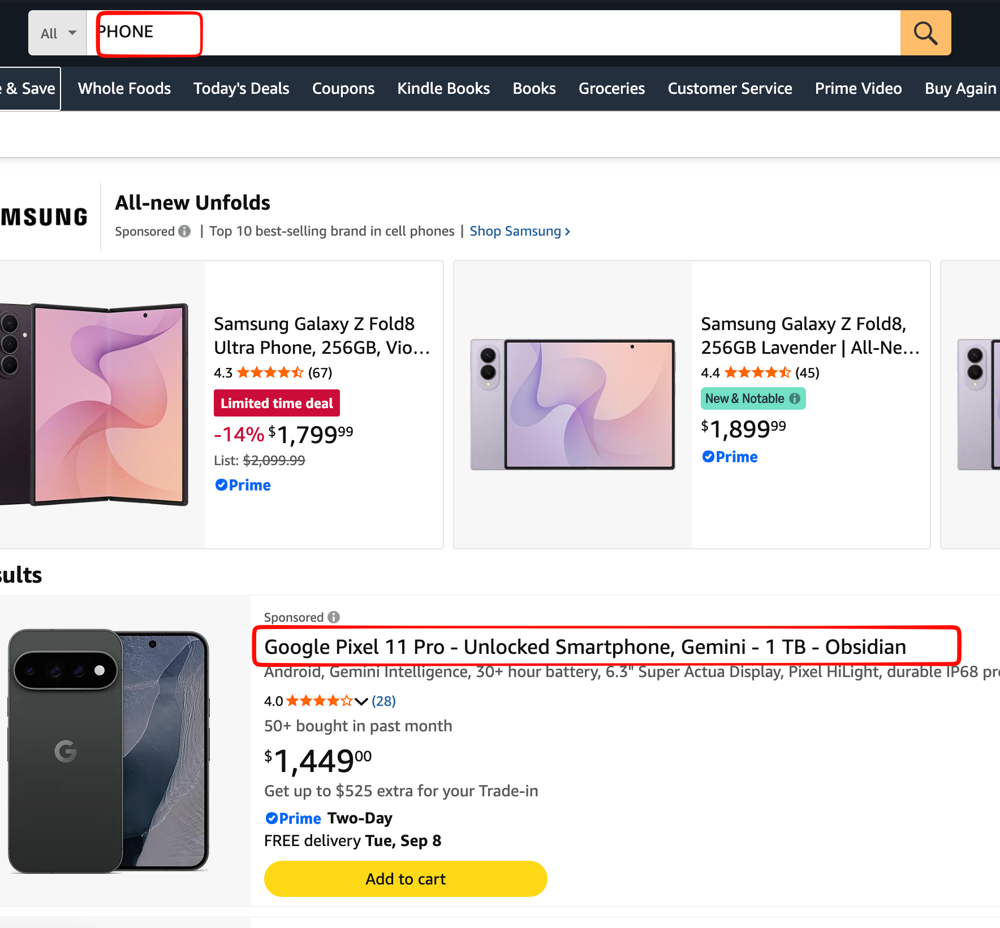

# 08 商品搜索（下）：用户搜不到商品怎么办？从关键词搜索到 Hybrid Search

上一章我们已经把商品搜索接到了 Elasticsearch。

对于下面这种搜索，它工作得很好：

```text
iPhone 15 256G
```

商品标题本身就包含 `iPhone`、`15`、`256G`，Elasticsearch 可以通过倒排索引快速找到对应商品。

但电商搜索里还有另一类很常见的 Query：

```text
适合雨天通勤的鞋
送女朋友的生日礼物
适合宿舍用的小冰箱
```

用户说的是自己的**需求**，而商品标题写的却可能是：

```text
GORE-TEX 防水城市徒步鞋
DW 女士石英腕表
Hisense 45L 单门冰箱
```

这时候问题就出现了：

**商品明明符合用户需求，却可能因为没有出现相同关键词而搜不出来。**

这不是排序问题。

因为商品如果连候选集都没进去，后面的排序算法再好也没有用。

所以这一章要解决的业务问题是：

> **如何在保留关键词搜索准确性的同时，把“字面不同、语义相关”的商品也召回？**

Gomall 当前给出的方案是 Hybrid Search：

```text
                    用户 Query
                        │
              ┌─────────┴─────────┐
              ▼                   ▼
       Elasticsearch           Embedding
        关键词召回                 │
              │                   ▼
              │                 Milvus
              │                向量召回
              └─────────┬─────────┘
                        ▼
                     融合排序
                        │
                        ▼
                      TopK
                        │
                        ▼
                      商品列表
```

也就是说，我们不是用向量搜索替换 Elasticsearch，而是让两种搜索各自解决自己擅长的问题：

| Query              | 更依赖哪一路  | 原因                               |
| ------------------ | ------------- | ---------------------------------- |
| `iPhone 15 256G`   | Elasticsearch | 型号、容量等关键词非常明确         |
| `Nike Air Max 270` | Elasticsearch | 品牌和型号需要精确匹配             |
| `适合雨天通勤的鞋` | 向量搜索      | 用户表达的是使用场景               |
| `送程序员的礼物`   | 向量搜索      | 商品标题通常不会直接写“程序员礼物” |

接下来不先讲向量数据库原理，而是直接沿着 Gomall 的代码往下走：

```text
POST /api/v1/product/semantic-search

        ↓

SemanticSearchProductsHandler

        ↓

SemanticSearch

        ↓

┌──────────────────┬────────────────────┐
│ Elasticsearch    │ Milvus             │
│ keyword recall   │ semantic recall    │
└──────────────────┴────────────────────┘

        ↓

score normalization

        ↓

fusion

        ↓

MySQL 回查

        ↓

TopK
```

读代码的时候重点回答四个实际问题：

1. 一次搜索请求到底经过哪些服务？
2. Elasticsearch 和 Milvus 找出来的商品怎么合并？
3. 某一路挂了以后，用户还能不能搜？
4. 这套 Hybrid Search 现在真的已经在线工作了吗？



## 专业术语

先记住几个后文反复出现的词：

| 术语 | 本章中的含义 |
|---|---|
| 召回 | 从全部商品中先找出一批候选，还不是最终排序 |
| embedding | 一段文本对应的浮点数数组；本项目固定为 768 维 |
| score | 通常越大越相关，例如 ES `_score` |
| distance | 两个向量的距离；L2 distance 越小越接近 |
| TopK | 最终保留相关度最高的 K 条结果 |

假设你做的是一个**电商搜索系统**，用户搜索：

> ```
> "黑色男士跑步鞋"
> ```

系统里有 **1000 万件商品**。

你不可能对 1000 万件商品全部做非常复杂的计算再排序，所以通常会经过：

**用户 Query → 召回 → 算相关度 → 排序 → TopK → 返回结果**

### 1. 召回 Recall

**召回 = 从海量商品中，快速找出“可能相关”的一小批候选。**

比如有：

```text
1000 万商品
      ↓
用户搜索："黑色男士跑步鞋"
      ↓
召回
      ↓
找出 1000 个可能相关商品
```

这 1000 个只是**候选集**，并不意味着最终都会展示。

比如可以通过关键词召回：

```text
"男士跑步鞋"
"黑色跑鞋"
"运动鞋"
```

也可以通过向量召回，找到语义相似的商品。

所以：

> **召回解决的是“先从几千万商品里快速捞哪些出来”。**

------

### 关键词召回：倒排索引 + BM25

这是搜索系统里最经典的一种。

用户搜索：

```
"黑色 男士 跑步鞋"
```

系统先分词：

```
黑色
男士
跑步鞋
```

Elasticsearch 会有类似**倒排索引**：

```
黑色   → 商品 1, 5, 9, 17...
男士   → 商品 1, 2, 9, 20...
跑步鞋 → 商品 1, 7, 9, 31...
```

这样不用扫描 1000 万商品，而是直接通过索引找到候选。

然后 BM25 可以计算：

```
商品1  score = 15.2
商品9  score = 13.7
商品7  score = 8.4
...
```

取前几百/几千个作为候选。

所以如果你项目里出现：

```
Elasticsearch
_score
BM25
match
```

大概率就是在做这种召回。


### 2. Embedding

Embedding 可以简单理解成：

> **把文字转换成一串数字，让计算机可以计算“语义有多像”。**

例如：

```text
"黑色男士跑步鞋"

↓ Embedding 模型

[0.12, -0.83, 0.27, 0.91, ..., 0.34]
```

如果你这里使用的是 **768 维 embedding**，那就是：

```text
[
  x1,
  x2,
  x3,
  ...
  x768
]
```

一共 768 个浮点数。

商品标题也可以转换：

```text
Query:
"黑色男士跑步鞋"
       ↓
[0.12, -0.83, ..., 0.34]


商品 A:
"Nike 男款黑色运动跑鞋"
       ↓
[0.11, -0.79, ..., 0.31]
```

如果两个向量很接近，我们就认为：

> 两段文本的**语义可能比较接近**。

Embedding 最重要的意义就是把：

```text
文本相似度问题
```

变成：

```text
数学上的向量相似度问题
```

------

### 3. Score

`score` 可以理解成：

> **相关度得分，通常越大越好。**

比如 Elasticsearch 搜索：

```text
用户：
"黑色男士跑步鞋"

商品 A  _score = 12.7
商品 B  _score = 9.3
商品 C  _score = 2.1
```

一般就认为：

```text
A > B > C
```

A 和用户搜索内容最相关。

所以记忆：

> **Score：越大通常越好。**

不过 `score` 具体怎么算，要看系统。它可能来自 BM25、余弦相似度、模型预测分数，甚至多个信号的组合。

------

### 4. Distance

Distance 是：

> **两个向量之间有多远。**

例如两个 embedding：

```text
Query embedding
        ↓
        ●
       / \
      /   \
   商品A   商品B
    ●          ●
```

如果：

```text
distance(Query, A) = 0.2

distance(Query, B) = 4.8
```

说明 A 距离 Query 更近，所以 A 通常更相关。

例如常见的 **L2 Distance（欧氏距离）**：

$d(x,y)=\sqrt{\sum_{i=1}^{768}(x_i-y_i)^2}$

不用特别纠结公式，本质就是我们平时二维空间里的：

> **两点之间的直线距离**

只不过现在不是二维，而是 **768 维**。

所以：

```text
score       → 通常越大越好

L2 distance → 越小越好
```

这个区别非常重要。

------

### 5. TopK

TopK 就特别简单了：

> **最后只取最相关的 K 个。**

比如召回了 1000 个商品，然后计算相关度：

```text
商品 A    score = 98
商品 B    score = 95
商品 C    score = 91
商品 D    score = 87
商品 E    score = 82
...
```

如果：

```text
K = 3
```

那么 TopK 就是：

```text
A
B
C
```

也就是：

> **TopK = 排好以后取前 K 名。**

如果用的是 distance：

```text
A    distance = 0.12
B    distance = 0.18
C    distance = 0.25
D    distance = 0.91
```

因为 distance 越小越相关，所以 `Top 3` 就是 A、B、C。

------

### 把 5 个概念串起来

假设用户搜索：

```text
"适合程序员办公的机械键盘"
```

系统可能这样工作：

```text
              用户 Query
                  │
                  ▼
       "适合程序员办公的机械键盘"
                  │
             Embedding
                  │
                  ▼
       [0.21, -0.33, ...]  768维
                  │
                  ▼
               召回
        从1000万商品里快速
          找出1000个候选
                  │
                  ▼
        计算 score / distance
                  │
                  ▼
               排序
                  │
                  ▼
             TopK = 20
                  │
                  ▼
          返回最相关20个商品
```

所以最简单的记忆方式就是：

| 概念          | 你可以直接记成                      |
| ------------- | ----------------------------------- |
| **召回**      | 先从海量数据里**捞一批候选**        |
| **Embedding** | 把文字**变成数字向量**              |
| **Score**     | 相关度分数，通常**越大越好**        |
| **Distance**  | 向量之间的距离，L2 通常**越小越好** |
| **TopK**      | 最后只要**前 K 名**                 |

其中最容易混的是 **召回和 TopK**：**召回是“先捞候选”，TopK 是“从结果里最后取前 K 个”**。


阅读时可以同时打开这些文件：

```text
service/search/routes.go
service/search/handler.go
service/search/semantic.go
service/search/embedding.go
service/search/milvus_stub.go
repository/milvus/product_vector.go
internal/product/dto.go
```


## 1. 搜索接口入口

Hybrid Search 对外提供 `POST /api/v1/product/semantic-search` 接口：

```go
public.POST("product/semantic-search", SemanticSearchProductsHandler())
```

请求主要包含三个参数：

```go
type ProductSemanticSearchReq struct {
    Query      string `json:"query" binding:"required"`
    TopK       int    `json:"top_k"`
    CategoryID *uint  `json:"category_id,omitempty"`
}
```

- `query`：用户搜索内容
- `top_k`：最终返回多少个商品
- `category_id`：可选，限定商品类目

例如用户在前端搜索“适合雨天通勤的鞋”，可以这样调用后端：

```javascript
const response = await fetch("/api/v1/product/semantic-search", {
    method: "POST",
    headers: {
        "Content-Type": "application/json"
    },
    body: JSON.stringify({
        query: "适合雨天通勤的鞋",
        top_k: 10,
        category_id: 12
    })
});

const data = await response.json();
```

请求到达后端后，会先进入 `SemanticSearchProductsHandler()` 解析参数，再调用 `SemanticSearch()`：

```text
前端搜索框
    ↓
POST /api/v1/product/semantic-search
    ↓
SemanticSearchProductsHandler()
    ↓
SemanticSearch()
    ↓
关键词召回 + 向量召回
```

因此这一层主要负责**把前端的搜索请求送进后端搜索服务**，真正的召回和排序逻辑在 `SemanticSearch()` 中完成。

## 2. 为什么要保留两路召回

电商搜索里，用户的搜索方式并不统一。

例如用户搜索：

```text
iPhone 15 256G
```

商品标题本身就包含这些关键词，这种查询交给 Elasticsearch 很合适。

但如果用户搜索：

```text
适合雨天通勤的鞋
```

商品标题可能实际写的是：

```text
GORE-TEX 防水城市徒步鞋
```


两边没有完全相同的关键词，Elasticsearch 可能漏掉这个商品；向量搜索则可以通过 embedding 找到语义相近的商品。

因此 Gomall 设计了两路召回：

```text
                    用户 Query
                        │
            ┌───────────┴───────────┐
            ▼                       ▼
     Elasticsearch                Milvus
       关键词召回                  向量召回
            │                       │
            ▼                       ▼
       一批候选商品              一批候选商品
            └───────────┬───────────┘
                        ▼
                    合并候选
                        │
                    计算最终分数
                        │
                    MySQL 回查
                        │
                     TopK
```

两路各有分工：

- **Elasticsearch**：适合品牌、型号、商品名称等精确关键词。
- **Milvus**：适合“雨天通勤”“送女朋友的礼物”这类语义搜索。
- **MySQL**：不负责搜索相似商品，而是在最后根据商品 ID 查询当前商品数据。


### 想一想

假设服务器已经配置 `MILVUS_ADDR`，并按正常启动流程完成初始化。根据上面的实际路径判断：一次语义搜索会访问真实 Milvus 吗？

<details>
<summary>参考答案</summary>

会。启动时 `InitMilvusCollection` 会创建并加载与当前 embedding 契约对应的 collection，再通过 `SetProductVectorStore` 同时接通查询和写入实现。如果 Milvus 没有配置或初始化失败，系统才保留空实现，让关键词搜索继续可用。

</details>

## 3. SemanticSearch：Hybrid Search 的核心流程

`SemanticSearch()` 负责完成整个 Hybrid Search：

```text
用户 Query
    │
    ├──→ Embedding → Milvus → 向量召回
    │
    └──→ Elasticsearch → 关键词召回
                         │
                  两路结果归一化
                         │
                  按商品 ID 合并
                         │
                    计算融合分数
                         │
                    MySQL 回查
                         │
                      TopK
```

### 3.1 参数校验

首先检查 Query，并限制最终返回数量：

```go
if req == nil {
    return nil, errors.New("query 不能为空")
}
query := strings.TrimSpace(req.Query)
if query == "" {
    return nil, errors.New("query 不能为空")
}

topK := req.TopK
if topK <= 0 {
    topK = 10
}
if topK > 50 {
    topK = 50
}
```

默认返回 10 个商品，最多返回 50 个，避免一次请求拉取过多数据。

### 3.2 生成 Query Embedding

向量搜索之前，需要先把用户 Query 转成 768 维向量：

```go
var vecHits []Hit
vec, vectorErr := deps.embed(ctx, query)
if vectorErr == nil {
    vecHits, vectorErr = deps.vector.Search(
        ctx, vec, topK*3, req.CategoryID,
    )
}
```

例如：

```text
"适合雨天通勤的鞋"
        ↓
Embedding
        ↓
[0.12, -0.31, 0.78, ..., 0.21]
```

Milvus 会使用这个向量寻找语义上相近的商品。

### 3.3 两路召回

接下来分别进行向量召回和关键词召回：

```go
// Elasticsearch 关键词召回
keywordHits, _, keywordErr := deps.keyword(
    ctx, query, 0, topK*3, req.CategoryID,
)

if vectorErr != nil && keywordErr != nil {
    return nil, errors.Join(vectorErr, keywordErr)
}
```

假设最终需要：

```text
TopK = 10
```

两路会各召回 30 个候选，而不是只找 10 个。

这是因为某个商品可能在 ES 中排第 14、Milvus 中排第 12，但两路都认为它相关。融合以后，它可能进入最终 Top10。

### 3.4 分数归一化

Elasticsearch 和 Milvus 使用的分数体系不同，不能直接相加。

因此先把两路结果分别归一化到 `[0,1]`：

```go
semNorm := minMaxNormalizeDistance(vecScores(vecHits))
kwNorm := minMaxNormalize(esScores(keywordHits))
```

可以简单理解为：

```text
ES 分数       ─┐
               ├→ 统一到 0～1
Milvus 分数   ─┘
```

这样两路结果才方便进行融合。Milvus 使用 L2 distance，数值越小越相近，因此向量分支会先反转方向；例如距离 `0.2` 的相关度必须高于距离 `0.8` 的相关度。

### 3.5 合并两路结果

系统按照商品 ID 合并候选：

```go
for i, h := range vecHits {
    id := uint(h.ID)
    hit := getOrInit(fused, id)
    hit.SemanticScore = semNorm[i]
}

for i, h := range keywordHits {
    id := h.Doc.ID
    hit := getOrInit(fused, id)
    hit.KeywordScore = kwNorm[i]
}
```

然后计算最终融合分数：

```go
h.Score =
    0.5*h.SemanticScore +
    0.5*h.KeywordScore
```

例如：

```json
fused = {
    101: {
        SemanticScore: 0.8,
        KeywordScore:  0.7
    },

    102: {
        SemanticScore: 0.6,
        KeywordScore:  0
    },

    103: {
        SemanticScore: 0,
        KeywordScore:  0.9
    }
}
```

因此商品 B 最终排在商品 A 前面。

这里的 `0.5 / 0.5` 就是两路召回的权重。实际业务中可以根据搜索效果调整，例如更重视语义搜索时提高 `SemanticScore` 的权重。

### 3.6 MySQL 回查并返回 TopK

这里最关键的是理解：**为什么搜完 ES / Milvus 之后，还要再查一次 MySQL？**

前面 ES 和 Milvus 得到的主要是：

```text
商品 101 → score 0.85
商品 203 → score 0.72
商品 305 → score 0.61
```

也就是：

> **“哪些商品相关 + 它们有多相关”**

但前端最终需要展示的是：

```json
{
  "id": 101,
  "name": "Nike 防水跑鞋",
  "price": 129.99,
  "description": "...",
  "image": "...",
  "score": 0.85
}
```

所以需要：

```go
products := ListByIDs(ids)
```

根据刚才搜出来的商品 ID，去 MySQL **批量把完整商品信息查回来**。你原文也是把 MySQL 定位为最后补齐当前商品数据，而不是负责相似商品检索。

然后：

```go
sort.SliceStable(out, func(i, j int) bool {
    return out[i].Score > out[j].Score
})
```

就是按照融合后的 `Score`：

```text
商品101  0.85
商品203  0.72
商品305  0.61
```

**从高到低排序。**

最后：

```go
if len(out) > topK {
    out = out[:topK]
}
```

假设：

```text
topK = 10
```

即使前面还有 50 个候选，最终也只返回**最相关的前 10 个商品**。

所以整个过程可以记成：

```text
ES / Milvus → 找商品
      ↓
融合分数 → 判断谁更相关
      ↓
MySQL → 拿完整商品信息
      ↓
排序 → 取 TopK
      ↓
返回前端
```


### 自测题

1. **为什么 Hybrid Search 要同时使用 Elasticsearch 和 Milvus？两者分别擅长什么？**
2. **如果 `topK = 10`，为什么 ES 和 Milvus 要各召回 `30` 条，而不是只召回 10 条？**
3. **为什么 ES 和 Milvus 的分数需要先归一化，再进行融合？**
4. **如果一个商品的 `SemanticScore = 0.8`，`KeywordScore = 0.4`，两边权重都是 `0.5`，最终融合分数是多少？**
5. **为什么 ES 和 Milvus 搜索结束后，还要根据商品 ID 回查 MySQL？MySQL 在这里负责什么？**
