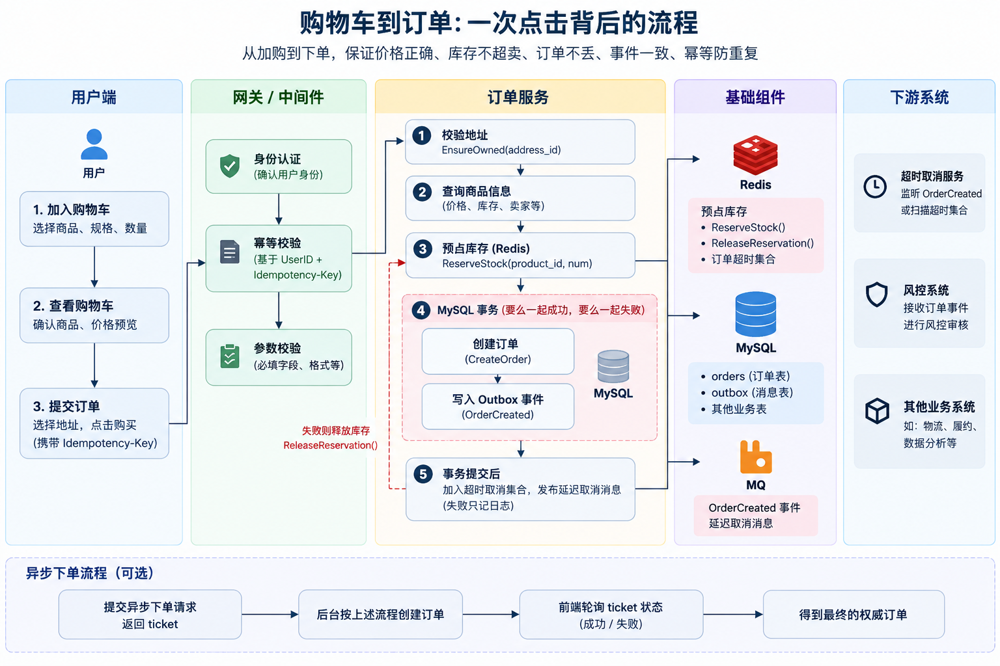
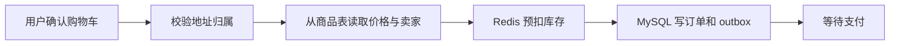
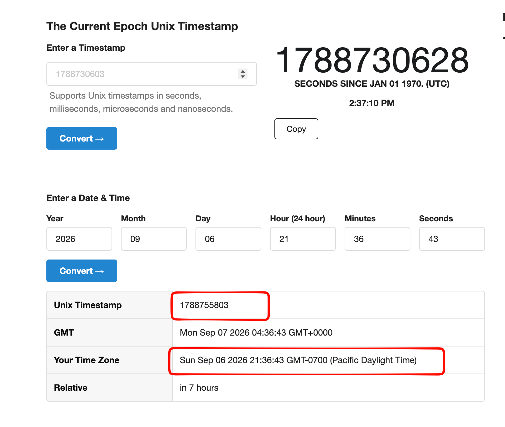
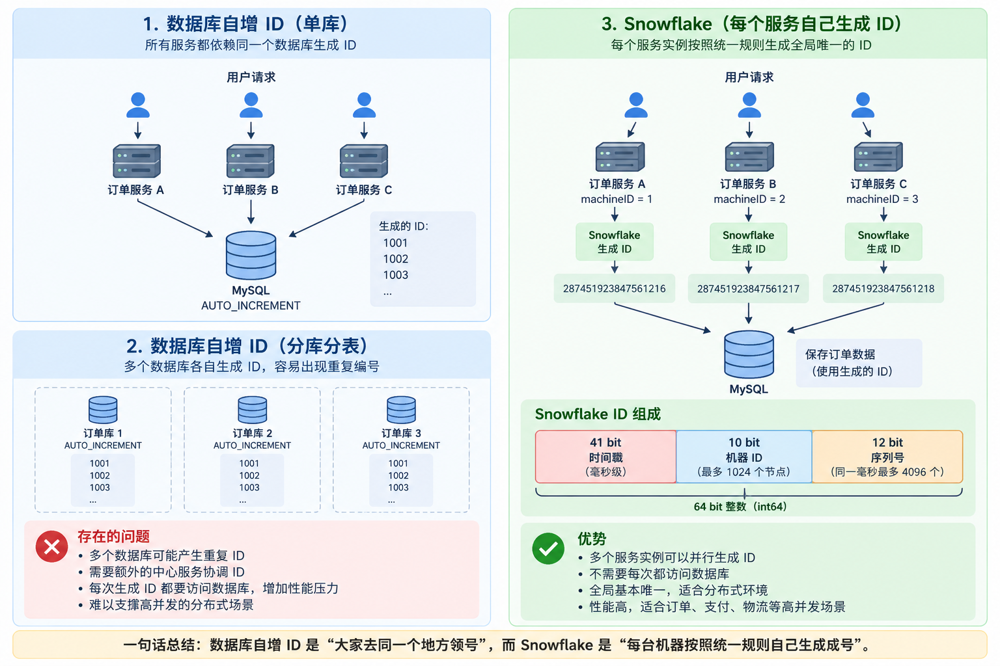
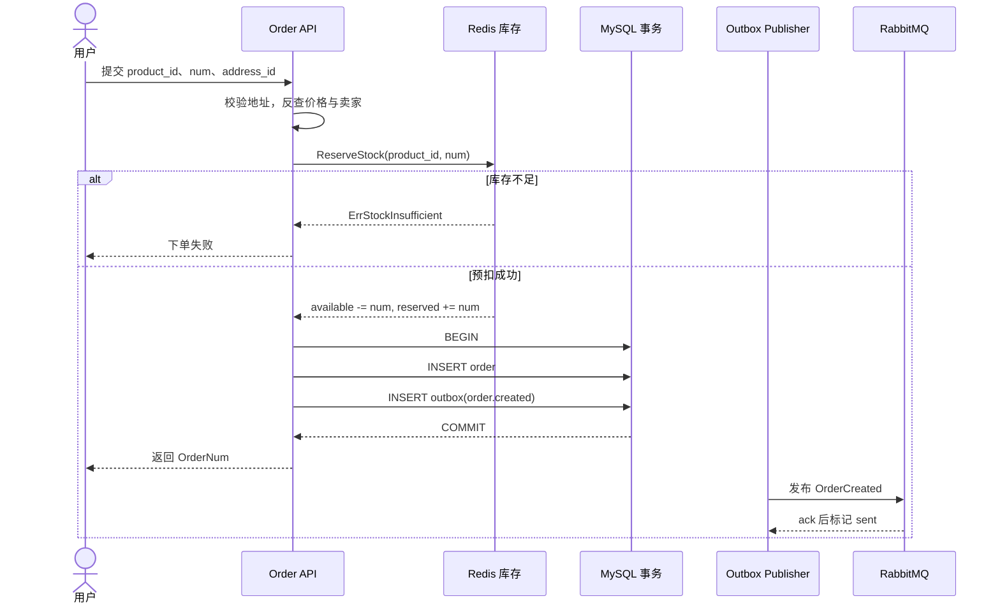

# 09 购物车到订单：一次点击背后的库存承诺



这一讲跟随一位用户走完一次下单：加购、选择地址、预扣库存、写入订单、记录事件。重点是理解系统如何保证不超卖、不丢单、不重复下单。

## 一、购物车的职责与边界

### 购物车负责什么

购物车主要负责：

- **持久化用户的选购行为**
  用户把商品加入购物车后，系统要记住：谁、买什么、买几件、选了哪个规格/SKU、是否勾选。
  即使浏览器关闭、App 退出，下次登录还能看到。
- **支持加购、减购、删除、修改数量**
  这些操作要保证并发安全（同一用户多端操作）、数量上限控制（MaxNum）、以及异常时的正确语义（数据库挂了不能假装购物车是空的）。
- **跨会话、跨设备同步**
  未登录时用 Cookie / 本地存储 + 临时 ID；登录后把游客购物车合并到用户购物车，避免丢数据。
- **提供结算前的预览信息**
  展示商品标题、图片、当前价格、小计、可用优惠券、运费预估等，让用户有个“大概要付多少钱”的感觉。


### 购物车不负责什么

购物车记录的是可变的购买意向，不能作为最终结算凭证。

| 事项            | 为什么不由购物车负责                        |
| --------------- | ------------------------------------------- |
| 最终成交价格    | 价格可能随时变动，必须以商品表/定价服务为准 |
| 真实库存扣减    | 购物车只做软校验，真正预占在下单时发生      |
| 卖家/收款方确认 | 必须重新从商品表读取，防止客户端伪造        |
| 订单生成与支付  | 订单是不可变的交易记录，购物车是可变的意向  |
| 优惠最终落地    | 满减、券、积分等必须在下单瞬间重新计算      |

因此，下单时系统必须：

1. 重新读取商品最新价格、状态、卖家信息；
2. 重新校验地址归属；
3. 真正预扣库存；
4. 写入订单 + 事件。

购物车只提供“用户想买什么、买几件”这一购买意图。

## 二、一次下单必须守住的业务规则

假设小林一次购买两件商品。对用户来说只是点一下“购买”，但后端需要同时保证价格、库存、订单和消息都不会出错。

这一讲主要关注三个必须始终成立的规则。

### 1. 商品价格只能由服务端决定

客户端只负责告诉后端：

```text
买哪个商品
买几件
```

真正的价格、卖家等信息必须重新从服务端商品表读取。

例如商品真实价格是 999 元，即使有人抓包把前端请求里的价格改成 0.01 元（非常常见），后端也不能按 1 分钱创建订单。

```text
product_id
    ↓
查询服务端商品数据
    ↓
得到真实价格和卖家
    ↓
按真实数据创建订单
```

这样可以避免客户端篡改价格。

### 2. 订单和 OrderCreated 事件必须保持一致

订单创建成功后，通常还要通知其他系统：

```text
订单创建成功
    ↓
OrderCreated
    ├─ 超时取消
    ├─ 风控
    └─ 其他下游服务
```

系统不能出现这种情况：

```text
订单已经写入 MySQL ✅
OrderCreated 消息却没有发出去 ❌
```

否则订单虽然存在，但超时取消、风控等下游完全不知道。

因此需要保证：

> **订单创建成功时，对应的 OrderCreated 事件也必须可靠产生。**

### 3. 先预占库存，失败时及时释放

假设小林要买 2 件商品，系统会先尝试预占 2 件库存：

```text
库存 5
  ↓
预占 2
  ↓
剩余可用库存 3
  ↓
创建订单
```

如果库存不足，预占失败，就不能继续创建订单。

```text
需要 2 件
库存只有 1 件
    ↓
预占失败
    ↓
不创建订单
```

反过来，如果库存已经预占成功，但后面的建单失败：

```text
预占库存 ✅
    ↓
创建订单 ❌
```

系统就要尝试释放刚才预占的库存，否则会出现“没有订单，库存却被占住”的问题。

所以整个原则可以概括成：

> **客户端没有定价权；订单和事件必须保持一致；库存先预占，建单失败要释放。**

后面的下单代码都围绕这三个规则展开。

### 4. 请求如何进入系统

同步下单走 `POST /api/v1/orders/create`，路由挂了认证和幂等中间件。异步下单走 enqueue 接口，先返回 ticket，再由前端查询 ticket 状态。两条路最终都要得到一条权威订单。



## 三、下单前：购物车、地址与定价

### 1. 购物车查询：没找到和查询失败是两回事

用户把商品加入购物车时，系统会先查询这个商品是否已经存在：

```go
cart, err = d.GetCartById(pId, uId, bId)
```

查询可能有三种结果：

| 查询结果   | 系统怎么处理                   |
| ---------- | ------------------------------ |
| 已经存在   | 在原来的购物车数量上增加       |
| 没有找到   | 第一次添加，创建新的购物车记录 |
| 数据库异常 | 返回系统错误                   |

其中最重要的是区分后两种情况。

如果返回 `gorm.ErrRecordNotFound`：

```go
if errors.Is(err, gorm.ErrRecordNotFound) {
    cart = &Cart{
        UserID:    uId,
        ProductID: pId,
        BossID:    bId,
        Num:       1,
        MaxNum:    10,
    }

    err = d.DB.Create(&cart).Error
    return cart, e.SUCCESS, err
}
```

说明数据库查询是正常的，只是这个商品以前没有加入购物车，所以创建一条新记录：

```text
没找到商品
    ↓
说明是第一次添加
    ↓
创建：商品 × 1
```

但如果是数据库连接失败、超时等其他错误：

```go
if err != nil {
    return nil, e.ERROR, err
}
```

就应该直接返回系统错误，而不能把它当成“购物车里没有商品”。

“数据库里没有这条数据”和“数据库没有查询成功”是两回事：前者可以继续创建，后者必须报错。

### 2. 地址 ID 也是不可信输入

客户端传来的 `address_id` 可能属于另一个用户。`OrderCreate` 在任何库存动作之前调用 `EnsureOwned(req.AddressID, u.Id)`；校验失败要尽早返回，否则既泄露他人地址，又制造无效预占。

### 3. 金额与收款方只从商品表读取

```go
unitCents, categoryID, bossID, err := resolveProductPricing(
    ctx, req.ProductID,
)
if err != nil {
    return nil, err
}
subtotalCents := unitCents * int64(req.Num)
```

创建订单时，客户端的有效输入只有 `product_id`、`num` 和 `address_id`；`OrderCreateReq` 不定义 `money` 或 `boss_id`。金额、商品分类和卖家都根据 `product_id` 从商品表读取，因此客户端无法用一分钱下单，也无法指定货款收款方。

## 四、订单号和订单状态

### 1. 为什么订单需要单独的 `OrderNum`

数据库里的订单通常已经有一个自增主键：

```text
id = 12345
```

但这个 ID 主要用于数据库内部关联，不适合直接作为对外的订单编号。

例如用户看到的订单可能是：

```text
OrderNum = 287451923847561216
```

客服查询订单、支付系统记录订单、MQ 发送订单消息时，都可以使用这个 `OrderNum`。

因此可以简单区分为：

```text
数据库 ID
    → 数据库内部使用

OrderNum
    → 业务系统之间使用
```

gomall 使用 Snowflake（雪花算法）生成 `OrderNum`。

---

### 2. 雪花算法解决什么问题

假设订单服务只有一台机器，可以简单使用：

```text
1
2
3
4
5
...
```

但生产环境通常会部署多个订单服务：

```text
        用户下单
           │
     ┌─────┼─────┐
     ▼     ▼     ▼
   机器1  机器2  机器3
```

如果三台机器都自己从 `1` 开始生成订单号，就很容易重复。

雪花算法要解决的问题就是：

Snowflake 不依赖数据库自增 ID，让多台服务器都可以自行快速生成基本不会重复的全局 ID。

---

### 3. 一个雪花 ID 是怎么组成的

经典 Snowflake 会把一个 `int64` 拆成几个部分：

```text
| 时间戳 | 机器 ID | 序列号 |
```

可以把它理解成：

```text
我在什么时间
    +
我是第几台机器
    +
这一毫秒里我是第几个请求
```

最终组合成一个大的整数：

```text
287451923847561216
```

#### 时间戳

时间戳表示：

> **这个订单大概是什么时候生成的。**

例如：

```text
2026-09-06 14:30:20.123
```

时间不断向前，所以生成出来的 ID 整体呈趋势递增。



实际使用的是 Unix 毫秒级时间戳。

这也是为什么雪花 ID 通常比完全随机的 UUID 更适合作为很多业务系统的编号。

#### Machine ID

假设订单服务部署了三台：

```text
机器 A → machineID = 1
机器 B → machineID = 2
机器 C → machineID = 3
```

即使 A 和 B 在完全相同的毫秒收到订单：

```text
时间戳相同
```

它们的 machine ID 不同：

```text
A：时间 + 1 + ...
B：时间 + 2 + ...
```

所以最终生成的 ID 仍然不同。

#### 序列号

还有一种情况：

同一台机器在同一毫秒也可能收到多个订单。

例如：

```text
14:30:20.123

订单 A
订单 B
订单 C
```

时间一样，machine ID 也一样。

这时候就使用序列号：

```text
订单 A → 时间 + machine 1 + sequence 0
订单 B → 时间 + machine 1 + sequence 1
订单 C → 时间 + machine 1 + sequence 2
```

这样同一台机器在同一毫秒生成多个 ID，也不会重复。

Snowflake 的区分规则如下：

```text
不同时间
→ 靠时间戳区分

同一时间、不同机器
→ 靠 machineID 区分

同一时间、同一机器
→ 靠 sequence 区分
```

---

### 4. gomall 如何初始化 Snowflake

项目中：

```go
func InitSnowflake(machineID int64) {
    snowflake.Epoch = time.Date(
        2024, 1, 1, 0, 0, 0, 0, time.UTC,
    ).UnixNano() / 1_000_000

    node, err = snowflake.NewNode(machineID)
    if err != nil {
        panic(err)
    }
}
```

这里主要完成两项配置。

第一，设置起始时间：

```go
snowflake.Epoch = 2024-01-01
```

Snowflake 不需要保存完整 Unix 时间，而是记录：

```text
当前时间 - 2024/01/01
```

这样可以更充分地利用 ID 中有限的 bit。

第二，给当前订单服务设置：

```go
machineID
```

例如：

```text
order-service-1 → machineID = 1
order-service-2 → machineID = 2
order-service-3 → machineID = 3
```

---

### 5. 为什么 `machineID` 不能重复

假设：

```text
机器 A → machineID = 1
机器 B → machineID = 1
```

两台机器在同一毫秒又恰好生成相同的 sequence：

```text
时间戳    一样
machineID 一样
sequence   一样
```

那么：

```text
Snowflake ID
=
时间戳 + machineID + sequence
```

所有组成部分都一样，就可能生成相同的订单号。

因此，生产环境必须保证不同 Snowflake 节点使用不同的 `machineID`。

数据库最好再给 `OrderNum` 加唯一索引：

```sql
UNIQUE INDEX uk_order_num (order_num)
```

这样即使因为配置错误真的生成重复订单号，数据库还能作为最后一道防线拒绝写入。

---

### 6. 为什么不用数据库自增 ID



数据库自增 ID：

```text
1
2
3
4
5
```

单库情况下很简单。

但订单量增加后可能出现：

```text
订单服务
   ↓
多个实例
   ↓
多个数据库 / 分库分表（之后有机会讲一下分库分表吧）
```

这时候让所有服务都依赖一个数据库生成全局 ID，会增加协调成本。

Snowflake 的优势在于：

```text
订单服务 A ─→ 自己生成 ID
订单服务 B ─→ 自己生成 ID
订单服务 C ─→ 自己生成 ID
```

不需要每生成一个订单号都先请求数据库。

因此它很适合订单、支付、物流等需要**高并发全局业务 ID**的场景。

---

### 7. Snowflake 的组成小结

> 时间戳 + 机器 ID + 同毫秒序列号 = 全局业务 ID

三个部分分别解决三个问题：

| 部分       | 解决的问题                         |
| ---------- | ---------------------------------- |
| 时间戳     | 不同时间生成的 ID 不一样           |
| Machine ID | 不同服务器生成的 ID 不一样         |
| Sequence   | 同一服务器同一毫秒的多个请求不一样 |

因此多台订单服务器可以并行生成订单号，不需要每次都去数据库申请 ID。

### 8. 新订单为什么是 `OrderWaitPay`

订单号生成后，新订单的初始状态是：

```text
OrderWaitPay
```

也就是：

```text
创建订单
   ↓
OrderWaitPay
   ↓
等待用户付款
   ├── 付款成功 → 已支付
   └── 超时未付款 → 取消订单
```

所以“创建订单”和“支付成功”是两个不同阶段。

用户下单时，系统只创建订单并暂时为用户保留库存，之后才进入支付流程。

## 五、主链：预扣库存、写订单、写事件

### 1. 为什么库存要分桶

把库存想成三只桶：

- `available`：仍可出售；
- `reserved`：已下单但未付款；
- `sold`：付款后确认售出。

下单把数量从 `available` 移到 `reserved`；支付成功再减少 `reserved` 并扣数据库商品库存；取消或超时则把预占还给 `available`。这样既给用户付款时间，又不会把同一件商品卖给两个人。

### 2. 标准交互时序



### 3. `OrderCreate` 的事务边界

创建订单时，系统需要同时处理三件事：

```text
预占库存
    ↓
创建订单
    ↓
写入 OrderCreated 事件
```

代码大致如下：

```go
if err = cache.ReserveStock(
    ctx,
    req.ProductID,
    int64(req.Num),
); err != nil {
    return nil, err
}

err = dao.NewDBClient(ctx).Transaction(func(tx *gorm.DB) error {
    // 创建订单
    if err := NewOrderDaoByDB(tx).CreateOrder(order); err != nil {
        return err
    }

    // 写入 Outbox
    return outbox.NewOutboxDaoByDB(tx).Insert(
        "order",
        "OrderCreated",
        "order.created",
        order.ID,
        events.OrderCreated{
            OrderID:   order.ID,
            OrderNum:  order.OrderNum,
            UserID:    u.Id,
            ProductID: req.ProductID,
            Num:       int(req.Num),
        },
    )
})

if err != nil {
    // MySQL 事务失败后，释放 Redis 中的预占库存
    _ = cache.ReleaseReservation(
        ctx,
        req.ProductID,
        int64(req.Num),
    )
    return nil, err
}
```

整个流程可以理解成：

```text
Redis 预占库存
      │
      ▼
┌──── MySQL 事务 ────┐
│                    │
│   创建订单          │
│       ↓            │
│   写 Outbox 事件    │
│                    │
└────────────────────┘
      │
      ▼
事务提交成功
```

#### 为什么先预占库存

创建订单前先调用：

```go
cache.ReserveStock(...)
```

目的是先确认商品还有库存。

例如用户购买 2 件：

```text
库存 5
  ↓
预占 2
  ↓
剩余可用库存 3
  ↓
开始创建订单
```

如果库存预占失败，就直接结束：

```text
库存不足
   ↓
不创建订单
```

这样可以避免先创建订单，最后才发现没有库存。

#### 为什么 Redis 不放进 MySQL 事务

库存预占在 Redis 中，而订单存在 MySQL 中。

MySQL 的本地事务只能控制 MySQL：

```text
BEGIN
创建订单
写 Outbox
COMMIT / ROLLBACK
```

它没办法直接把 Redis 的操作一起回滚。

所以 Redis 预占库存只能放在 MySQL 事务之外：

```text
Redis Reserve
      ↓
MySQL Transaction
```

如果后面的 MySQL 事务失败：

```go
if err != nil {
    _ = cache.ReleaseReservation(...)
}
```

系统就再调用一次 Redis，把刚才占掉的库存释放回来。

例如：

```text
库存 5
  ↓
预占 2
  ↓
可用库存变成 3
  ↓
创建订单失败
  ↓
释放刚才的 2
  ↓
库存恢复为 5
```

这种方式称为补偿。

它不是 Redis 和 MySQL 一起提交、一起回滚的强事务，而是：

> 一个步骤失败后，通过另一个反向操作尽量恢复状态。

因此属于最终一致性的处理方式。

#### 为什么订单和 Outbox 必须在同一个事务里

这两个操作：

```go
CreateOrder(order)
```

和：

```go
Insert("OrderCreated", ...)
```

都放在同一个 MySQL Transaction 中。

因为系统必须避免这种情况：

```text
订单创建成功 ✅
OrderCreated 事件没写进去 ❌
```

如果发生这种情况，下游可能完全不知道这个订单存在：

```text
订单
 ↓
超时取消
风控
其他消费者
```

都收不到通知。

所以代码使用：

```text
┌──── 同一个 MySQL Transaction ────┐
│                                  │
│ 创建订单                          │
│ 写入 Outbox                       │
│                                  │
└──────────────────────────────────┘
```

结果只有两种：

```text
两个都成功 → COMMIT

任意一个失败 → ROLLBACK
```

因此可以保证：

> 只要订单创建成功，对应的 `OrderCreated` 事件记录就一定存在。

之后再由 Outbox Publisher 把事件可靠地发送到 MQ。

事务提交后，代码还会把订单加入 Redis 超时集合，并尝试发布延迟取消消息。这两步不在建单事务内，发布失败时只记录日志，因此仍然需要超时扫描与对账作为保障。

失败场景及对应兜底如下：

| 失败位置 | 当前动作 | 后续兜底 |
| --- | --- | --- |
| 预扣库存失败 | 不创建订单 | 无 |
| DB 事务失败 | 尝试释放预占 | 库存对账 |
| Outbox 发布失败 | Publisher 重试 | 死信与告警 |
| 延迟取消发布失败 | 记录日志 | Redis 超时集合扫描 |

---

## 六、用户连续点击购买：幂等

还有一个很常见的问题：

用户点击“提交订单”，页面一直转圈，于是连续点击五次：

```text
第一次点击
第二次点击
第三次点击
第四次点击
第五次点击
```

如果后端每次都执行一次 `OrderCreate()`，可能产生：

```text
订单 A
订单 B
订单 C
订单 D
订单 E
```

甚至库存也被扣五次。

因此下单接口需要做幂等控制：

> 同一个业务请求执行多次，最终效果和执行一次一样。

客户端会携带：

```text
Idempotency-Key
```

后端再和 UserID 组合：

```text
UserID + Idempotency-Key
```

比如小林的：

```text
UserID = 10086

Idempotency-Key =
550e8400-e29b-41d4-a716-446655440000
```

后端可以组合成 Redis Key：

```text
order:idempotency:10086:550e8400-e29b-41d4-a716-446655440000
```

也就是：

```text
order:idempotency:{UserID}:{Idempotency-Key}
```

假设另一个用户也碰巧用了相同的 `Idempotency-Key`：

```text
小林：
order:idempotency:10086:550e8400-...

小王：
order:idempotency:20001:550e8400-...
```

最终 Redis Key 不同，因此两个用户不会互相影响。

请求进入后，可以出现几种状态：

| 状态               | 系统行为                         |
| ------------------ | -------------------------------- |
| 第一次请求         | 获得执行权，继续创建订单         |
| 同一个请求正在执行 | 返回“处理中”，不再创建第二笔订单 |
| 请求已经完成       | 直接返回上一次结果               |
| token 不存在或过期 | 拒绝请求                         |

可以理解成：

```text
第一次请求
    ↓
执行 OrderCreate
    ↓
创建订单 10001
    ↓
缓存响应结果
```

用户再次提交相同请求：

```text
相同 Idempotency-Key
       ↓
发现已经执行完成
       ↓
不再创建订单
       ↓
直接返回订单 10001
```

所以即使用户连续点很多次：

```text
点击 1 ─┐
点击 2 ─┤
点击 3 ─┼──→ 最终只有一笔订单
点击 4 ─┤
点击 5 ─┘
```

不过幂等中间件不是最后一道安全保障。

如果订单已经成功写入数据库，但幂等状态没有成功保存，客户端再次重试时仍可能重新进入业务逻辑。

因此订单表本身最好还需要唯一约束或业务状态校验作为兜底。

---

## 七、同步与异步下单

同步接口适合普通流量：用户等待数据库事务结束后，立即获得订单号。大促峰值时，可以使用 `OrderEnqueue`：

1. 校验地址并预扣库存；
2. 写入一个 TTL 为 1 小时的 `pending` ticket；
3. 发布 `AsyncOrderTask`；
4. 立即返回 ticket，消费者建单后把状态改为 `ok` 或 `failed`。

任务消息不携带金额和卖家。消费者仍然根据商品 ID 从商品表反查权威数据，异步化不会降低安全边界。

```go
type AsyncOrderTask struct {
    Ticket    string `json:"ticket"`
    UserID    uint   `json:"user_id"`
    ProductID uint   `json:"product_id"`
    Num       uint   `json:"num"`
    AddressID uint   `json:"address_id"`
}
```

异步链路还需要处理额外的失败场景：ticket 写入成功但 MQ 发布失败时，要释放库存并将 ticket 标记为 `failed`；消费端还要处理重复消息。没有削峰需求时，同步链路更容易排查问题。

## 八、课堂演示与回顾

课堂演示只验证一件事：使用同一个 `Idempotency-Key` 连续提交两次下单请求。

观察以下结果：

1. 第二次响应是否带有 `X-Idempotent-Replay`；
2. 订单表是否只新增一行；
3. 库存预占是否只变化一次。

如果环境不完整，可以通过断点跟踪 `Idempotency()`、`OrderCreate()` 和 `ReserveStock()`，不必临时进行完整压测。

完成这一讲后，应当能够回答：

- 为什么 `address_id` 必须在服务端核验，金额和卖家为什么不应出现在 `OrderCreateReq` 中？
- 为什么 Redis reserve 位于 MySQL 事务外，而 Outbox 位于事务内？
- 如果 DB 回滚后 Redis release 失败，系统如何发现差额？
- 幂等回放解决了哪一种重复，数据库还需要守住什么底线？

代码入口：`internal/order/service.go`、`internal/order/async.go`、`repository/cache/inventory.go`、`middleware/idempotency.go`。

## 九、课后习题

1. Snowflake ID 主要由哪三个部分组成？`machineID` 的作用是什么？
2. 为什么创建订单之前要先预占库存？如果库存预占失败，系统应该怎么处理？
3. 为什么 `CreateOrder` 和 `OrderCreated Outbox` 要放在同一个 MySQL 事务中？
4. 如果 Redis 库存预占成功，但后面的 MySQL 事务失败，系统应该怎么处理？
5. `Idempotency-Key` 是用来解决什么问题的？为什么同一次请求重试时要使用相同的 Key？
6. 画出异步消费者重复消费同一个 ticket 时的状态机，并标出幂等点。
7. 设计库存巡检：输入 `available`、`reserved` 和数据库已售数量，输出需要告警的差额。
8. 阅读 `internal/order/cancel.go`，说明超时取消如何与支付竞争。
9. 思考订单地址快照应该包含哪些字段，以及修改地址簿为何不能影响历史订单。

这一讲的核心是：先核验权威数据，再预留稀缺资源；订单与事件原子落库，跨存储失败通过补偿和对账收口。
