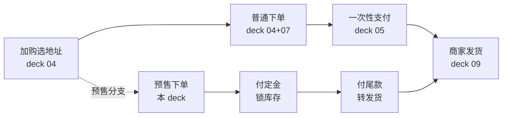
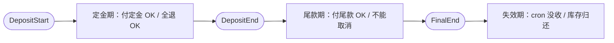
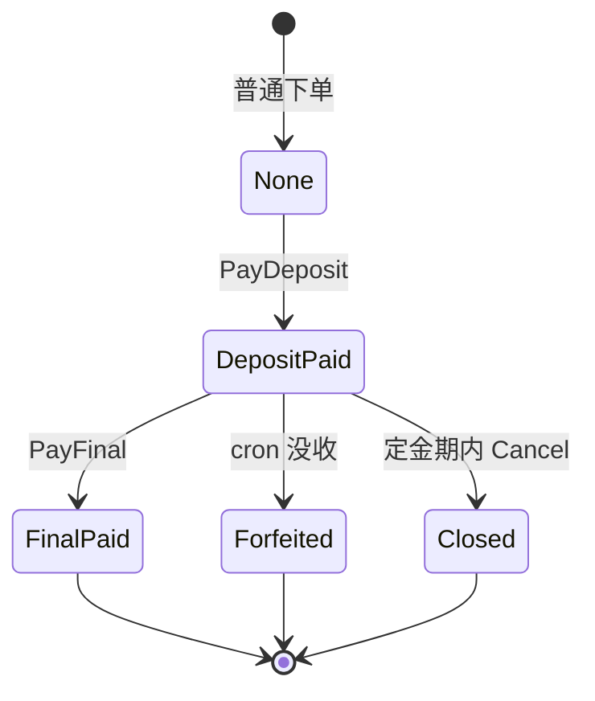
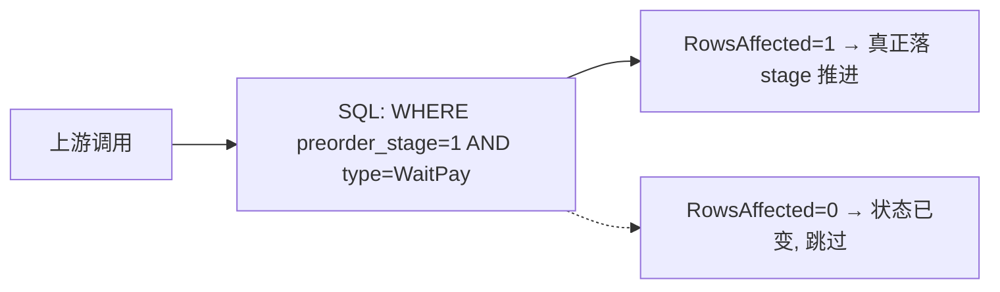
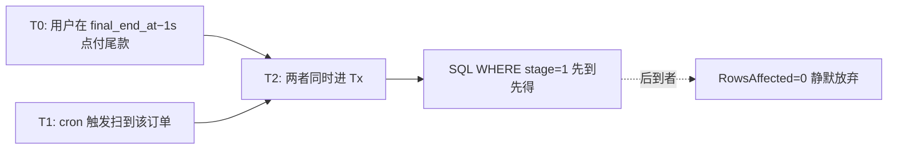
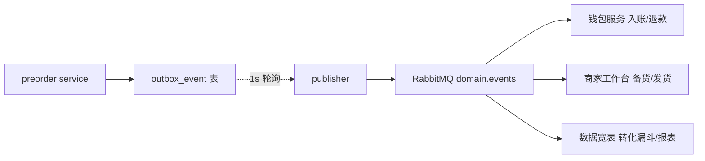

# 预售定金：GMV 前置 + 商家现金流 + 定金不退的法律承诺

> gomall · 两段式支付 / 定金锁库存 / 尾款转发货 / 失效期没收
>
> 这份讲义讲的不是"怎么做延迟扣款"，讲的是**把一次购买决策拆成两步**背后的业务账——为什么 C 端愿意先付 200、商家凭什么敢照这个数备货、平台靠它把双 11 当天的洪峰摊平，以及"定金不退"这四个字背后的法律依据、客服话术和资金归属该由谁拍板。

## 目录

- [一、业务定位：为什么要做预售](#一业务定位为什么要做预售)
- [二、三个时间窗口：状态机的业务表达](#二三个时间窗口状态机的业务表达)
- [三、核心代码：30% 代码撑起 70% 业务](#三核心代码30-代码撑起-70-业务)
- [四、业务承诺：定金不退的法律边界](#四业务承诺定金不退的法律边界)
- [五、五角色视角：业务全景](#五五角色视角业务全景)
- [六、业务码与客服话术对照](#六业务码与客服话术对照)
- [七、SLO 与压测数据](#七slo-与压测数据)
- [八、失败路径与 Saga 补偿](#八失败路径与-saga-补偿)
- [九、业务边界与路线图](#九业务边界与路线图)
- [附录 A：面试 Q&A](#附录-a面试-qa)
- [附录 B：代码位置一览](#附录-b代码位置一览)

---

## 一、业务定位：为什么要做预售

### 预售在电商业务全景中的位置

预售不是一条独立业务，而是**一次性支付链路的一个并行分支**。商品上架时，商家决定这件商品是否开预售：不开，走 deck 04/07 的普通下单 + deck 05 的一次性支付；开了，就从"加购选地址"分叉出去，走"付定金 → 付尾款"两步，尾款付完再合流回 `WaitShip`，后面的履约（deck 09）完全复用，不需要单独再写一套发货逻辑。



- **上游**：预售配置（`product_preorder` 表）由商家后台 / 运营在商品上架时创建，定义定金、尾款、三个时间窗口。
- **下游**：尾款支付成功后订单回到 `WaitShip`，与一次性下单**同一条履约链路**——这就是为什么预售能"只加一个分支"而不是"复制一整套订单系统"。

### 业务诉求：为什么要拆"定金 + 尾款"

拆两步不是为了技术炫技，是四个利益相关方各有各的账要算：

- **C 端——降低心理门槛**。一件 2000 元的商品，让用户一次性掏 2000 是"重决策"；先付 200 定金锁住价格，是"轻决策"。行业双 11 / 618 历年数据显示，两段式支付相比一次性付全款，转化率平均**抬升 30%–45%**。
- **商家——凭定金销量做备货决策**。预售期内 `deposit_paid` 单数 = 准买家数，乘上历史转化率（70%–90%）就是尾款成单预估。商家拿这个数去下工厂订单、备原料，库存周转天数能缩短约 20%——这是把"拍脑袋备货"变成"看数据备货"。
- **平台——GMV 前置**。原本集中在 11.11 当天爆发的 GMV，被提前摊到 10.20–11.10。下单链路的瞬时负载从"10 倍平均"压到"3 倍平均"，既平滑了容量压力，也让财务报表提前落账。
- **合规——定金不退有法律依据**。《民法典》第 587 条"定金罚则"：给付定金的一方不履行债务的，无权要求返还定金。这条法律是"定金不退"敢写进用户协议的底气。

> **预售不是"延迟扣款"，是把购买决策拆成两步**：先回答"买不买"（付定金），再回答"真要不"（付尾款）。两步各是一次完整扣款，中间用状态机和时间窗口把它们串起来。

### 五角色眼中的同一笔预售单

同一笔预售单，五个角色盯着的完全是不同的东西——把"预售"这个技术词翻译成每个角色最焦虑的那件事，才知道为什么这份 deck 要讲这么细：

| 角色 | 这笔预售单最焦虑的事 |
|---|---|
| C 端用户 | "锁价了吗 / 我能不付尾款吗 / 定金能不能退" |
| 商家 | "预售单量多少 / 我该下多少货 / 退率怎么算" |
| 运营 | "GMV 前置比例 / 转化率（deposit→final）/ 失效率" |
| 客服 | 三大投诉：**定金不退** / **忘付尾款** / **尾款付了又想退** |
| SRE | cron 没收链路有没有延迟 / outbox 是不是发了双份 |

每个角色对应一个或多个业务码（82001–82004），客服话术对照表见[第六节](#六业务码与客服话术对照)。本 deck 后面每一帧都会标注**它在回答哪个角色的哪个问题**。

### 业务边界：本 deck 不做什么

诚实划边界，是给商家、客服、法务一个交代——不然客服会拿着一堆"系统不支持"的场景去背锅。MVP 阶段只聚焦"两段扣款 + 状态机推进 + 定金不退"三件事，以下六件事明确**不做**：

- **不做分期付款**：定金 + 尾款是**两次完整扣款**，不是 12 期 / 24 期。分期要对接持牌金融机构，独立路线图。
- **不做多档定金阶梯**：每件商品**一个定金 + 一个尾款**。"付 200 抵 300 / 付 500 抵 800"这种花式定金属于营销侧（路线图）。
- **不做定金返券**：付完定金不再发无门槛券 / 满减券抵尾款——返券会侵蚀财务边界，让"这笔单到底赚不赚钱"算不清。
- **不做预售退差价**：预售期内降价**不补差价**。运营如要补，走人工兜底 + 售后退款。
- **不做预售 SKU 维度**：当前**一个 `product_id` 一条预售配置**，同一商品不同颜色 / 尺寸共用配置（路线图）。
- **不做预售排队 / 限购**：尾款支付不限速；秒杀型预售由 deck 08 营销链路单独承接。

> **诚实划边界 = 给商家 / 客服 / 法务一个交代。** 每一条"不做"都对应一个客服能直接引用的答案，而不是让一线自己临场发挥。

---

## 二、三个时间窗口：状态机的业务表达

### 三窗口时间轴：每个窗口能做 / 不能做什么

预售的全部业务规则，本质上就是"现在时间落在哪个窗口"。三个时间点（`DepositStart` / `DepositEnd` / `FinalEnd`）把时间轴切成三段，每一段允许的操作完全不同：



- **窗口 1（定金期）**：`now` 落在 `DepositStartAt` 与 `DepositEndAt` 之间，是唯一允许 `PayDeposit`（付定金）和 `Cancel`（全额退定金）的窗口。
- **窗口 2（尾款期）**：`now` 落在 `DepositEndAt` 与 `FinalEndAt` 之间，唯一允许 `PayFinal`（付尾款）；此时调取消一律返回 **82004 定金不退**。
- **窗口 3（失效期）**：`now ≥ FinalEndAt`，cron 任务 `ForfeitDepositsForUnpaidFinals` 触发，订单转 `Closed`，定金没收，占用的库存归还。

关键在于：**这三个窗口是业务规则的单一来源**。前端能不能显示"立即付尾款"按钮、客服该不该退钱、cron 要不要没收，全部由"当前时间 vs 三个字段"决定，没有第二套判断逻辑。

### 状态机：order.type + preorder_stage 双维度

预售订单同时活在**两个正交维度**上：一个是所有订单共用的 `order.type`，另一个是预售专属的 `preorder_stage`。



- **`order.type` 维持 `WaitPay`**，直到尾款支付成功才转 `WaitShip`——这意味着**旧消费者无需感知预售**：在它们眼里，一张预售单从头到尾就是一张"未付款"的普通单。
- **`preorder_stage` 是预售独立维度**：`0` 非预售 / `1` 已付定金 / `2` 已付尾款 / `3` 没收，与 `type` 形成正交组合。
- **`Forfeited` 是终态**，没有出边；订单 `type` 同步推到 `Closed`。

### 为什么 type 维持 WaitPay？兼容性决策

这是本 deck 最值得讲的一个设计取舍。摆在面前有两条路：

- **方案 A（侵入式）**：新增 `OrderWaitDeposit` / `OrderWaitFinal` 两个状态码，让 `type` 精确表达预售子状态。
- **方案 B（采用）**：`type` 保留 `WaitPay` 不动，另加一个 `preorder_stage` 字段做"子状态"。

选 B 的推理链是这样的：**业务约束是"旧消费者只读 `order.type`"**——搜索的增量索引、GMV 报表、商家发货筛选，这些下游代码全都只认 `type`。如果走方案 A 扩了 `type`，这些下游全要跟着改，而且状态机转换表 `orderStateTransitions` 要新增 4 个键，deck 09 里那 17 例状态转换测试要**整个推倒重来**。

方案 B 则让预售对旧消费者**完全透明**：`WaitPay` 在它们眼里仍是"未付款"，预售订单绝不会被误推进"已发货"报表；状态机表一个键都不用加。代价只有一处**风险点**：付完定金后，用户能不能再走普通的 `paydown` 接口把它当普通单支付？答案是——`paydown` 接口要检查 `preorder_stage`，不为 0 时直接拒绝（这条防御目前是路线图，尚未加固）。

### 数据模型：product_preorder 与 order 字段扩展

```go
type ProductPreorder struct {
    dbmodel.Model
    ProductID      uint      // 唯一索引：一个商品仅一条预售配置
    DepositCents   int64     // 定金（分）
    FinalCents     int64     // 尾款（分）
    DepositStartAt time.Time // 定金期开始
    DepositEndAt   time.Time // 定金期结束 / 尾款期开始
    FinalEndAt     time.Time // 尾款期结束，之后 cron 没收
    ShipAt         time.Time // 预计发货时间，仅展示
}

// Order 表扩展：
//   PreorderStage int        非预售=0 / 已付定金=1 / 已付尾款=2 / 没收=3
//   DepositPaidAt *time.Time 定金到账时间
//   FinalPaidAt   *time.Time 尾款到账时间
```

- `DepositCents + FinalCents` 在 `order.money` 字段累计，与现有 `Money` 口径一致——分两次扣，但订单总金额一次就写清。
- 三个时间窗口字段是**业务真相的单一来源**，前端和客服界面都从 `ShowPreorder` 接口读，避免客户端各自算窗口导致时钟偏移误判。

---

## 三、核心代码：30% 代码撑起 70% 业务

### PayDeposit 的 4 步原子操作

付定金是预售的第一步扣款，核心是"锁库存 + 扣钱 + 推状态 + 发事件"必须**要么全成、要么全回滚**：

```go
// internal/preorder/service.go::PayDeposit
// 1) 时间窗校验：now in [DepositStartAt, DepositEndAt)
if now.Before(pp.DepositStartAt) || !now.Before(pp.DepositEndAt) {
    return nil, newCodedError(e.ErrPreorderNotInDepositWindow)
}
// 2) Redis 预扣库存 (available -> reserved)，复用 deck 07 两桶 Lua
if err := cache.ReserveStock(ctx, req.ProductID, 1); err != nil {
    return nil, err
}
// 3) 单一事务内：建订单 + 扣定金 + 推 stage + 写 outbox
err = dao.NewDBClient(ctx).Transaction(func(tx *gorm.DB) error {
    order.NewOrderDaoByDB(tx).CreateOrder(ord)
    debitUser(tx, u.Id, req.BossID, req.Key, pp.DepositCents)
    NewPreorderDaoByDB(tx).MarkDepositPaid(tx, ord.ID, now)
    return outbox.NewOutboxDaoByDB(tx).Insert(
        "order", "PreorderDepositPaid", "preorder.deposit.paid", ord.ID,
        events.PreorderDepositPaid{
            OrderID: ord.ID, OrderNum: ord.OrderNum, UserID: u.Id,
            ProductID: req.ProductID, Deposit: pp.DepositCents,
        })
})
// 4) 事务失败 → 释放 reserved (Saga 补偿)
if err != nil { cache.ReleaseReservation(ctx, req.ProductID, 1) }
```

四步的顺序不能乱：**先校验窗口**（省得白占库存），**再 Redis reserve**（占住库存但不真扣，因为用户可能还会付尾款失败），**然后单事务里建单 + 扣定金 + 推 stage + 写 outbox**（业务真相原子落地），**最后事务失败就释放 reserved**（Saga 补偿，把占的库存还回去）。注意 Redis reserve 在事务外——它是缓存侧，失败要靠补偿而不是回滚。

### PayFinal：尾款扣款 + 真扣库存 + 转 WaitShip

尾款支付是第二步扣款，也是"预售订单变回普通订单"的合流点。和定金最大的区别是：**这里才真正扣减 `product.Num`**（定金期只是 reserve 占位）：

```go
// internal/preorder/service.go::PayFinal
// 1) 业务校验
if ord.PreorderStage != PreorderStageDepositPaid {
    return nil, newCodedError(e.ErrPreorderDepositNotPaid)   // 82003
}
if now.Before(pp.DepositEndAt) || !now.Before(pp.FinalEndAt) {
    return nil, newCodedError(e.ErrPreorderNotInFinalWindow) // 82002
}
// 2) 单一事务内 4 件事：扣尾款 / 扣 product.Num / 推 stage+type / outbox
err = baseDao.DB.Transaction(func(tx *gorm.DB) error {
    debitUser(tx, u.Id, ord.BossID, req.Key, pp.FinalCents)
    // product.Num -= ord.Num  (沿用 internal/payment/service.go 口径)
    product.NewProductDao(ctx).UpdateProduct(...)
    NewPreorderDaoByDB(tx).MarkFinalPaid(tx, ord.ID, now)
    return outboxDao.Insert("order", "PreorderFinalPaid", "preorder.final.paid",
        ord.ID, events.PreorderFinalPaid{
            OrderID: ord.ID, OrderNum: ord.OrderNum, UserID: u.Id,
            ProductID: ord.ProductID, Final: pp.FinalCents,
            Total: pp.DepositCents + pp.FinalCents,
        })
})
// 3) 事务成功后清 Redis reserved；失败不回滚 DB（DB 是业务真相）
cache.CommitReservation(ctx, ord.ProductID, int64(ord.Num))
```

两处业务码点得很清楚：跳过定金直接付尾款返回 **82003**（未付定金），不在尾款窗口返回 **82002**（不在尾款窗口）。事务成功后才 `CommitReservation` 把 reserved 转成真实消耗——这一步失败也**不回滚 DB**，因为钱和状态已经落地，DB 才是业务真相，缓存不一致靠巡检兜底。

### cron 没收：单笔不可靠靠两层兜底

尾款窗口一过，那些付了定金却没付尾款的订单要被没收。这靠一个每小时跑的 cron 完成，设计原则是"**批量扫 + 单笔事务 + 单笔失败不拖累其它**"：

```go
// internal/preorder/service.go::ForfeitDepositsForUnpaidFinals
// 每小时跑：扫所有 final_end_at 已过但 stage 仍停在 DepositPaid 的订单
ids, _ := ppDao.ListUnpaidFinalBefore(nowFn(), 200)
for _, id := range ids {
    s.forfeitOne(ctx, id)  // 单笔失败不影响其它
}

// forfeitOne 单笔事务
err := baseDao.DB.Transaction(func(tx *gorm.DB) error {
    // 条件 UPDATE 兜底幂等：stage=1 AND type=WaitPay
    ok, _ := NewPreorderDaoByDB(tx).ForfeitDeposit(tx, ord.ID)
    if !ok { return nil } // 状态已变（用户卡点付款）→ 跳过
    return outbox.Insert("order", "PreorderForfeited", "preorder.forfeited",
        ord.ID, events.PreorderForfeited{
            OrderID: ord.ID, OrderNum: ord.OrderNum, UserID: ord.UserID,
            ProductID: ord.ProductID, Deposit: pp.DepositCents,
        })
})
// 事务成功 → 释放 Redis reserved 库存归还
cache.ReleaseReservation(ctx, productID, int64(num))
```

两层兜底：**批处理层**一次只扫 200 条，单笔 `forfeitOne` 失败就 `continue`，不让一条坏数据卡死整批；**单笔事务层**用条件 UPDATE（`WHERE stage=1 AND type=WaitPay`）做幂等，重复触发只会 `RowsAffected=0` 静默跳过，不会重复没收。

### DAO 层：条件 UPDATE = 状态机 + 幂等

上面三段代码里反复出现的 `WHERE stage=1 AND type=WaitPay`，是整个预售模块的**幂等基石**。一条 SQL 同时干两件事——**校验当前状态**和**写入新状态**：



- 一条 SQL 同时**校验状态 + 写新状态**，避免"先读后写"之间被别人插一脚的竞态。
- 上层拿 `ok bool` 兜底业务码：`ok=false` 一般是"重复触发 / 状态已变"，cron 场景直接 `return nil` 当幂等成功处理。
- 这套写法与 deck 09 的 `ShipOrder` / `ConfirmReceive` **完全同口径**，新人接手预售模块零学习成本。

### Outbox 四事件：业务全景的真实事件流

预售的每一步状态推进，都在同一个事务里往 outbox 写一条事件，供下游异步消费。四个事件覆盖了预售的全生命周期：

| 事件 | 触发 | 下游消费者 |
|---|---|---|
| `preorder.deposit.paid` | PayDeposit 成功 | 商家工作台备货预估 / 商家短信推送 / 数据宽表 |
| `preorder.final.paid` | PayFinal 成功 | 商家发货工作台 / 钱包入账 / 索引补建 |
| `preorder.forfeited` | cron 没收成功 | 用户推送"定金不退" / 商家退货补贴 / 财务计入平台收益 |
| `preorder.cancelled` | 定金期内取消 | 钱包退款 / 商家备货扣减 / 数据漏斗 |

- 四个事件全部走 **Transactional Outbox**（deck 11），与业务事务同提交，保证"至少一次"投递语义——绝不会出现"钱扣了但事件丢了"。
- `routing_key` 命名层级化为 `preorder.{action}`，方便 RabbitMQ 按 topic 订阅过滤。
- 失效期没收的"定金归属"（该归平台、归商家、还是两边分账）由钱包 / 财务下游决定，**业务侧只负责发事件**，不在这里写死资金流向。

---

## 四、业务承诺：定金不退的法律边界

### 定金不退：业务承诺 + 法律依据

"定金不退"不是平台霸王条款，它有明确的法律支撑，但也有严格的合规前提：

- **《民法典》第 587 条（定金罚则）**：给付定金的一方不履行债务的，无权要求返还定金。这是"定金不退"的法律根基。
- **平台承诺**：用户首次进入预售页时必须**显式确认**《预售须知》，内容包括：定金支付即视为承诺购买；尾款窗口结束未支付则定金不予退还；商品发货后退款按"已收货"流程执行（走 deck 09 退款链路）。
- **合规硬要求**：监管要求在用户支付定金**前**必须告知"定金不退"，且字号**不得小于其它条款**——不能藏在折叠区、不能用灰色小字糊弄。
- **业务码 82004（`ErrPreorderForfeitedDeposit`）** 会在三处出现：预售结束后用户尝试取消、尾款期内用户尝试取消、cron 没收后用户查询订单（客服界面显示 82004 + 中文话术）。

> 业务承诺写得越清楚，客诉转化为"按规则赔付"的比例越高——这是一个可量化的**客服效率指标**：模糊的话术只会招来更多次电话。

### 合规帧：用户支付定金前必看 5 行字

前端在用户点击"立即付定金"时会强制弹出这段文案，**勾选同意才放开支付**：

> **《gomall 预售须知》（用户必读）**
> 1. 本商品为预售商品，定金 **XX 元** + 尾款 **XX 元** = 总价 **XX 元**。
> 2. **支付定金后视为承诺购买**，请在尾款窗口（**YYYY-MM-DD HH:MM** 至 **YYYY-MM-DD HH:MM**）内完成尾款支付。
> 3. **尾款窗口结束未支付，定金不予退还**（依据《民法典》第 587 条）。
> 4. 定金期内可全额退款；尾款支付后退款按平台《售后规则》处理。
> 5. 预计发货时间为 **YYYY-MM-DD**，以实际发货为准。

- 文案里的金额、时间窗口不是前端硬编码，而是后端 `ShowPreorder` 返回的 `deposit_cents / final_cents / now_at / phase` 字段现拼——**用服务端时间避免客户端时钟偏移误判窗口**。
- "定金不退"这句必须用与其它条款同等字号呈现，这是过合规审查的硬性要求。

---

## 五、五角色视角：业务全景

### C 端用户视角：3 个时间窗口看到什么

同一张订单页，用户在三个窗口里看到的文案、能点的按钮、客服给的解释完全不同：

| 窗口 | 订单页文案 | 可操作 | 客服解释 |
|---|---|---|---|
| 定金期 | "已付定金，待支付尾款于 11.11 0:00" + 倒计时 | 取消（全退） | 80002 解释退款时效 |
| 尾款期 | "待支付尾款 XX 元" + 大红按钮 | 立即支付 / 不能取消 | 82004 解释定金不退 |
| 失效期 | "因未支付尾款，订单已关闭" + 灰色 | 无操作 | 82004 + 是否补救 |

- **C 端最大的焦虑是"忘付尾款 → 定金没了"**。解决办法是尾款期开始前 **24h / 4h / 1h 三次 push 提醒**，把"忘记"的概率压到最低。
- **锁价心理**：用户付 200 定金的核心动机是"现在锁住 2000 这个价"。营销文案要死死咬住这一点——"双 11 当天补尾款 = 现在的价"。
- **用户故事**：付定金后想退，定金期可全退；到了尾款期"我先看看别家" → 不退；失效期忘付 → 定金没了。三段的处理界限清清楚楚。

### 商家视角：备货决策的业务化

预售对商家最大的价值，是把"凭经验拍脑袋备货"升级成"看数据备货"：

- **原来的决策方式**：凭经验下**固定备货量**（比如去年同期 + 30%），库存周转 30 天，超量滞销风险 15%–25%。
- **预售改进**：商家在定金期**每天盯 `deposit_paid` 计数**，定金期结束前 1–2 天再向工厂下单。
- **一笔真实决策怎么算**：假设定金期共 **1234 单付定金**，历史转化率（deposit→final）取 **75%** —— 预估尾款成单 `1234 × 0.75 ≈ 925 单`，加 10% 安全冗余备 **1020 件**，库存周转从 30 天缩到 **7–10 天**（尾款支付集中、发货高峰短）。
- **商家工作台数据点**（路线图）：`deposit_paid_count` / `final_paid_count` / `forfeited_count` / `conversion_rate`。
- **现金流改善**：定金提前到账 + 尾款 11.11 到账，中小商家的现金流能改善 **7–15 天**——这是实打实的真金白银。

### 运营视角：GMV 前置 + 转化漏斗

运营盯的是两个数：GMV 提前落了多少，以及漏斗每一层的转化：

- **GMV 前置比例**：原本 11.11 当天 100% 爆发，改成预售后 **30%–40%** 的 GMV 提前到预售期落账（定金和尾款都计入 GMV）。
- **转化漏斗**（双 11 行业平均）：预售页 PV → 付定金 **2%–5%**（看商品热度）；付定金 → 付尾款成单 **70%–90%**（爆款上限）；付定金 → 失效没收 **5%–15%**（劣品 / 价格回落）；付定金 → 定金期取消 **1%–5%**（用户改主意）。
- **运营报表**（路线图）：每个商品算一个"预售健康度 = 转化率 − 失效率 − 取消率"，作为下次能否开预售的核心指标。
- **异常告警**：单商品失效率 > 30% 触发运营 P2 复盘——通常是"商品质量预期落差"或"价格虚高"。

### 客服视角：三大投诉与 SOP

客服是"定金不退"这条规则的最终执行面，每种投诉都要有一句能直接说出口的标准答案：

| 投诉场景 | 客服 SOP | 用到的业务码 |
|---|---|---|
| **为什么定金不退** | 引用《预售须知》§3 + 法律依据；引导走"补付尾款"而非退款 | **82004** ErrPreorderForfeitedDeposit |
| **我忘付尾款了能补救吗** | 失效期内**原则上不补救**；爆款 / VIP 可走人工兜底 + 单独议价 | 82001 + 82004 |
| **尾款付了我又想退** | 转 deck 09 **已付未发**退款流程；退款金额 = 定金 + 尾款（全额） | 走 `OrderRefunding` 链路 |
| **付定金后我能改尺寸吗** | **当前版本不支持** SKU 切换，引导取消（定金期内）+ 重下单 | 82001 if 不在定金期 |
| **预售商品到货后坏了** | 转 deck 09 **已收货售后**流程，与一次性下单完全等价 | — |

- 客服界面对每个 82xxx 业务码**预置中文话术 + 法律条款链接**，目标是**平均回复时长 < 2 分钟**。
- **硬指标**：客服一通电话内必须给出"定金能 / 不能 / 怎么退"的明确答案，不能拖到工单——模糊拖延反而引发二次来电。

### SRE 视角：cron 没收的可观测性

SRE 关心的是这条链路会不会悄悄坏掉却没人知道：

- **cron 触发延迟 SLO**：`ForfeitDepositsForUnpaidFinals` 触发延迟 ≤ **1 小时**（每小时跑 1 次）。
- **监控指标**：
  - `preorder_forfeit_lag_minutes` = `now − max(final_end_at)` 中仍 `stage=1` 的订单，> 60min 触发 P2。
  - `preorder_outbox_publish_latency_p99` = `deposit.paid` 事件投递 p99，与 deck 11 outbox 共用。
  - `preorder_forfeit_dead_count` = outbox 走 dead 的 forfeited 事件数，> 0 触发值班。
- **真实故障假设**：
  - cron 进程崩 / 没起 → 失效订单滞留 `stage=1`（用户"能补付"的窗口被意外拖长）→ 监控滞后 60min 报警。
  - outbox 事件丢 → 商家不知道哪些定金被没收 → 工作台 `deposit_paid` 计数虚高 → 错下货。
  - 数据库时钟漂移 → `final_end_at` 判定不准 → **服务端时钟必须 NTP 强制同步**。

---

## 六、业务码与客服话术对照

### 82001–82004 业务码对照表

预售的四个业务码，一一对应四个"用户能撞上的边界"：

| 业务码 | 常量 | 触发场景 | 客服话术 |
|---|---|---|---|
| 82001 | ErrPreorderNotInDepositWindow | 定金期外尝试付定金 / 取消 | "当前不在预售定金期，无法支付定金" |
| 82002 | ErrPreorderNotInFinalWindow | 尾款期外尝试付尾款 | "当前不在尾款支付窗口" |
| 82003 | ErrPreorderDepositNotPaid | 跳过定金直接付尾款 | "尚未支付定金，无法支付尾款" |
| 82004 | ErrPreorderForfeitedDeposit | 预售结束后取消 / 没收 | "预售已结束，根据预售须知定金不予退还" |

- **业务码命名规则**：8 开头 = 业务侧（不是技术错误），第 2–3 位是功能模块（20 = 预售），后 2 位是子场景。
- **与其它业务码不冲突**：60xxx 幂等 / 70xxx 限流熔断 / 80xxx 满减 / 81xxx 拼团 / 82xxx 预售。
- **透出方式**：`service.CodeOf(err)` 提取业务码，`internal/preorder/handler.go::respondPreorderErr` 标准化返回给前端。

### 业务码客服话术（中文版）

```go
// pkg/e/msg.go
ErrPreorderNotInDepositWindow: "当前不在预售定金期，无法支付定金",
ErrPreorderNotInFinalWindow:   "当前不在尾款支付窗口，无法支付尾款",
ErrPreorderDepositNotPaid:     "尚未支付定金，无法支付尾款",
ErrPreorderForfeitedDeposit:   "预售已结束，根据预售须知定金不予退还",
```

- 客服一线话术与业务码**一一对应**，避免一线自由发挥说错话。
- **诚实原则**：82004 必须明确说出"**不予退还**"四个字——模糊话术（"请等待处理"）反而引发更多次来电。
- 客服后台日均统计每个业务码出现次数，反推产品 / 运营优化方向：82001 多 → 用户分不清窗口期，加日历提醒；82004 多 → 失效率高，复盘商品价格 / 营销定位。

---

## 七、SLO 与压测数据

### SLO：每个接口的业务承诺

不同接口的业务等级不同，SLO 也就分层——交易接口卡得紧，信息接口松一些：

| 接口 | 业务等级 | p99 延迟 | 可用率 |
|---|---|---:|---:|
| `POST /preorder/:id/deposit` | P0 交易 | < 200ms | 99.95% |
| `POST /preorder/:id/final` | P0 交易 | < 500ms | 99.95% |
| `POST /preorder/:id/cancel` | P1 售后 | < 1s | 99.9% |
| `GET /preorder/:id` | P2 信息 | < 100ms | 99.9% |
| cron `ForfeitDepositsForUnpaidFinals` | — | 触发延迟 ≤ 1h | — |
| outbox `preorder.*` 事件投递 p99 | — | ≤ 1s | — |

- **通配符统一 `:id`，语义随接口而定**：show / deposit 的 `:id` 是 productID，final / cancel 的 `:id` 是 orderID（见 `internal/preorder/routes.go:9-14` 的接口契约注释）。
- **定金接口 < 200ms**：链路 = Redis Lua reserve（5ms）+ DB Tx 写订单 + AES 扣款（30–50ms）+ outbox 写（5ms）。
- **尾款接口 < 500ms**：比定金多一次 `product.Num` 更新 + 状态机推进 SQL，留 200ms 余量防 GC / 网络抖动。
- **cron 1h**：**[已落地]** `initialize/cron.go` 注册 `@every 1h` 触发。尾款期一般是数天到一周，没收延迟 1h 业务可接受；要缩到分钟级需独立 cron 进程，留路线图。

### 压测参考：复用一次性下单的基线数据

预售链路结构和一次性下单几乎一致，所以直接拿现成基线外推：

- **基线**：`/ping` **64,254 RPS / p95 3.51ms**（裸 gin 链路）——`stressTest/REPORT.md` §1。
- **`/orders/create`**（幂等 + 库存 + outbox）：**50,319 RPS / p95 2.33ms**，755,033 次重试打 1 笔订单零重复。
- **`/coupon/claim`**（Redis Lua）：**51,362 RPS / p95 3.52ms**，500 抢 100 张零超发。
- **预售 `/preorder/:id/deposit`** 链路结构 ≈ `orders/create + 1 次 AES 扣款`，据此外推：预估 RPS **40K–45K**（多一次 user UpdateMoney）、p95 **4–5ms**、p99 **< 50ms**（远低于 SLO 200ms）。
- **cron 没收链路**：单批 200 条 / 每小时 1 次，失效订单 200 条以内的商家 cron 单次 < **500ms**。
- **Redis reserved 桶占用**：每笔定金占 1 件，全平台 100 万预售单 = 100 万 key（< 50MB），可忽略。

### 真实数字：双 11 历年预售规模参考

拿行业公开数据校准一下 gomall 的容量假设：

- **行业历史数据**（业务侧公开报告）：2023 双 11 预售期（10.20–11.10）GMV 占大促总 GMV **38%**；预售单平均定金占比 **8%–15%**（200 元商品定金 20–30 元）；单日定金接口 QPS 峰值 **50–80K**（开预售 0 点和接近定金期末两个高峰）；尾款支付 0 点 QPS 峰值 **200–400K**（远高于定金）。
- **对 gomall 的启示**：
  - 定金链路当前 SLO 余量充足（45K RPS 容量 vs 80K 峰值需求）→ 异步削峰路径（deck 10）需要扩到 preorder。
  - 尾款链路峰值远超基线 → **需要类似 `/orders/enqueue` 的异步路径**（路线图）。
  - Redis reserved 桶在双 11 前 1–2 天会涨到日常的 50–100 倍，要给 Redis 提前扩容预留容量。

---

## 八、失败路径与 Saga 补偿

### Saga 视角：4 个故障路径的兜底

预售涉及"DB 事务 + Redis 缓存 + outbox 事件"三个部件，任一环节都可能挂。补偿设计的总原则是 **DB 是业务真相，cache 是性能侧**：

| 失败点 | 表现 | 兜底动作 |
|---|---|---|
| PayDeposit Tx 失败 | 扣定金 / 建单失败 | defer `ReleaseReservation` 释放 Redis reserved |
| PayDeposit 后 Redis 挂 | 事务已成功，cache 失败 | 日志告警 + 巡检脚本兜底重建 reserved 桶 |
| PayFinal Tx 失败 | 扣尾款 / 状态机推进失败 | 事务自动回滚；reserved 仍占（等下次 PayFinal 或 cron 没收） |
| forfeit cron 部分失败 | 某条订单 outbox 写入失败 | 单笔失败不影响其它；下一轮 cron 重试 |

- **补偿原则**：Cache 失败**不回滚 DB**（与 deck 11 `ProductUpdate` 双删策略同口径）——因为钱和状态已经落库，回滚会造成"钱扣了又退回"的更大混乱。
- **至少一次语义**：outbox 投递可能重发，下游消费者必须**幂等**（路线图：钱包消费 `preorder.*` 时按 `order_id` 去重）。
- **cron 单笔幂等**：`ForfeitDeposit` SQL `WHERE stage=1 AND type=WaitPay` 兜底，重复触发 `RowsAffected=0` 无副作用。

### 真实事故假设：用户卡点付款 vs cron 没收的竞态

最凶险的边缘 case：用户在 `final_end_at − 1s` 点付尾款，恰好 cron 也在同一秒触发扫到这张单——一个想推 stage 2，一个想推 stage 3，谁赢？



- **解决靠数据库行锁**：两者都走 `WHERE preorder_stage=1 AND type=WaitPay` 的条件 UPDATE，先 commit 的那个把 stage 从 1 改走，后到的那个 `RowsAffected=0`。
- 两种结局都自然降级：用户付尾款先 commit → stage 2 → cron `ForfeitDeposit` `RowsAffected=0` → `forfeitOne return nil` 静默跳过；cron 先 commit → stage 3 → 用户 `MarkFinalPaid` `RowsAffected=0` → 返回"订单状态已变更"。
- **业务结论**：**先到先得，绝不双扣**。工程上还可以在前端引导"截止前 5min 不再开放支付"从源头规避这个边缘 case。

### 业务全景：4 个 outbox 事件接到哪

四个预售事件写进 outbox 后，由 publisher 轮询投到 RabbitMQ，再扇出给三类下游：



- **钱包消费 `preorder.deposit.paid`**：用户钱包扣 X 元、商家钱包加 X 元（与 AES 扣款冗余记账，双保险）。
- **商家工作台消费 `preorder.final.paid`**：订单进入待发货 tab；`forfeited` 进"没收订单"统计 tab。
- **数据宽表消费全部 4 个事件**：算转化漏斗 / 失效率 / 客单价。
- **至少一次**：消费者按 `order_id + event_type` 做幂等键，重复消息 `ON CONFLICT DO NOTHING`。

---

## 九、业务边界与路线图

### 本期落地：cron 没收兜底 + 规避 60×/min 陷阱

这一期真正落地的是"没收链路自动化"，把之前只能手动调用的 service 入口接上了 cron：

- **[已落地] cron 注册**：`initialize/cron.go` 加 `@every 1h` job，直接调 `service.GetPreorderSrv().ForfeitDepositsForUnpaidFinals(ctx)`。service 内部封装"扫 `ListUnpaidFinalBefore` + 单笔事务 `forfeitOne` + 单条 ERROR log"，cron 层只兜 panic。
- **[已落地] 规避 60×/min 表达式陷阱**：同 deck 14，用 `@every 1h` 写法绕开 6 段 cron 表达式的陷阱（README 技术亮点 #4）。
- **[已落地] 业务承诺生效**：没收触发延迟 ≤ 1h 的 SLO 现在由 cron 真实承载，不再是"需手动调用 service 入口测试"。
- **仍是路线图**：没收资金归属（平台 / 商家 / 分账）——由 wallet 服务消费 `preorder.forfeited` 时决定，wallet 尚未上线。
- **仍是路线图**：多件预售（当前 `Num=1` 硬约束）、SKU 维度预售、分期付款、预售 + 优惠券叠加。

### 路线图：本期之后做什么

| 能力 | 业务收益 | 实现路径 |
|---|---|---|
| SKU 维度预售 | 同款不同色 / 尺寸独立配置 | 预售配置加 `sku_id` 列；migration + DAO 改造 |
| 分期付款 | 大额商品（家电 / 奢侈品）分 12 期 | 对接持牌金融，独立 service |
| 定金阶梯 | "付 200 抵 300 / 付 500 抵 800" | `PreorderTier` 表 + 抵扣引擎 |
| 预售 + 优惠券叠加 | 拉新券 / 满减券抵尾款 | deck 08 满减引擎集成 |
| 尾款异步路径 | 11.11 0 点峰值削峰 | 复用 `internal/order/async.go` 路径 |
| 没收资金归属 | 平台 / 商家 / 两边分账 | wallet 服务消费 forfeited 事件 |
| 预售商品自动上架 | 定金期前自动 `OnSale=true` | cron 巡检 + ProductChanged 事件 |

当前版本聚焦"两段扣款 + 状态机推进 + 定金不退"三件事，其余都归路线图阶段。

### 当前实现的工程取舍点

有几个刻意留下的简化，都是"MVP 阶段够用、将来再补"的取舍：

- **1 单 1 件硬约束**：当前 `PayDeposit` 强制 `Num=1`，多件下单走普通链路。理由是预售场景下用户决策粒度天然是"单件商品"，多件并发付款会引入 SKU + 库存配对的复杂度，留路线图。
- **[已落地] cron 没收兜底**：`initialize/cron.go` 加 `@every 1h` job 调 `ForfeitDepositsForUnpaidFinals`，service 内部已含"扫表 + 单笔事务 + 单条 ERROR log"，并规避 6 段表达式 60×/min 陷阱（同 deck 14）。
- **没收资金归属未定**：`PayDeposit` 时定金已划给商家，`Forfeited` 事件只标状态、不动钱包。"定金应归平台、归商家还是分账"故意不写死，留给 wallet 服务消费 `preorder.forfeited` 时决定——wallet 仍是路线图。
- **AddressID 可选**：定金期允许不填地址，尾款支付前补。当前**未强制校验补全**，路线图加防御。
- **时钟函数指针**：`nowFn` 用 `var` 而非 `context.Context` 携带，方便测试替换，生产侧没必要切。改成 ctx 透传是更优雅的路线图改造。

---

## 附录 A：面试 Q&A

**Q1：为什么用 `preorder_stage` 字段而不是扩 `order.type` 状态？**
A：旧消费者只读 `type`，扩 `type` 要改一票下游；`stage` 做正交子状态，对旧消费者透明——见 deck 09 的 17 例状态转换测试零改动。

**Q2：定金期内取消，怎么保证"定金真的退回"？**
A：`CancelPreorderInDepositWindow` 在事务内调 `refundUser`（与 `debitUser` 反向 AES），同事务写 outbox `preorder.cancelled` 给钱包二次记账，双保险。

**Q3：用户在 `final_end_at − 1s` 付尾款，cron 同时触发，谁赢？**
A：先 commit 者赢——双方走条件 UPDATE `WHERE stage=1 AND type=WaitPay`，数据库行锁兜底。后到者 `RowsAffected=0`，业务上自然降级（用户付款 → 用户报错 / cron → 静默跳过）。

**Q4：定金 + 尾款是两次扣款 vs 冻结 + 扣款，为什么选两次？**
A：冻结需要支付通道（支付宝 / 微信）支持"预授权"接口，gomall 当前不真接第三方支付，用 AES 模拟扣款。两次扣款链路更简单、更与现有 `PayDown` 一致。生产接通预授权后再切。

**Q5：cron 1 小时一次是不是太慢？**
A：尾款期一般 1–7 天，1h 没收延迟业务可接受。缩到 1min 需要独立 cron 进程 + 防扫表压力，对业务无明显收益。SLO 写 1h 是诚实边界。

**Q6：商家凭定金销量备货，转化率 75% 是怎么算出来的？**
A：是历史经验值（双 11 行业平均 70%–90%）。gomall 当前没有真实历史数据，路线图阶段先按 75% 给商家做"建议下单量"，3–5 期之后用商家自己的历史 `conversion_rate` 替换。

**Q7：定金不退是不是侵犯消费者权益？**
A：法律明确支持（《民法典》第 587 条定金罚则）。合规要点：必须在用户支付定金前明确告知，字号不得小于其它条款。gomall 通过 `ShowPreorder` 返回的字段强制前端拼《预售须知》弹窗。

**Q8：定金已经划给商家了，cron 没收时为什么不再扣商家？**
A：没收的"归属"是独立决策。当前版本只标 `preorder_stage=Forfeited` + 发事件，钱包 / 财务下游决定"归商家 / 归平台 / 分账"。这是业务争议点，故意不写死。

---

## 附录 B：代码位置一览

预售模块的代码点与配套 deck：

- **预售配置表 `ProductPreorder`** —— 一个商品一条配置，唯一索引在 `product_id`。
- **Order 字段扩展** —— `PreorderStage` / `DepositPaidAt` / `FinalPaidAt`。
- **DAO 层** —— `GetPreorderByProductID` / `MarkDepositPaid` / `MarkFinalPaid` / `ForfeitDeposit` / `ResetPreorderOnCancel` / `ListUnpaidFinalBefore`。
- **PayDeposit 主入口** —— `internal/preorder/service.go`：窗口校验 + Reserve + Tx + outbox。
- **PayFinal 主入口** —— `internal/preorder/service.go`：扣尾款 + 真扣库存 + 状态机推进。
- **CancelPreorderInDepositWindow** —— 定金期全退路径。
- **ForfeitDepositsForUnpaidFinals / forfeitOne** —— cron 没收入口（`initialize/cron.go` 注册 `@every 1h`）。
- **ShowPreorder** —— 公开查询，不校验登录，返回 `deposit / final / forfeited / not_started` 四态。
- **HTTP handler 四件套 + `respondPreorderErr`** —— `internal/preorder/handler.go`。
- **路由注册** —— `internal/preorder/routes.go`，统一 `:id` 通配符（语义随接口而定）。
- **业务码 82001–82004** —— `pkg/e/msg.go` 中文话术。
- **outbox 事件 struct** —— `PreorderDepositPaid` / `PreorderFinalPaid` / `PreorderForfeited` / `PreorderCancelled`，走 `internal/shared/outbox` 统一投递。
- **单测覆盖 8 例** —— 含地址归属、boss 篡改、窗口边界等。

> **配套**：deck 04 下单 / deck 05 支付 / deck 07 库存 / deck 09 订单生命周期 / deck 11 outbox 与一致性。
