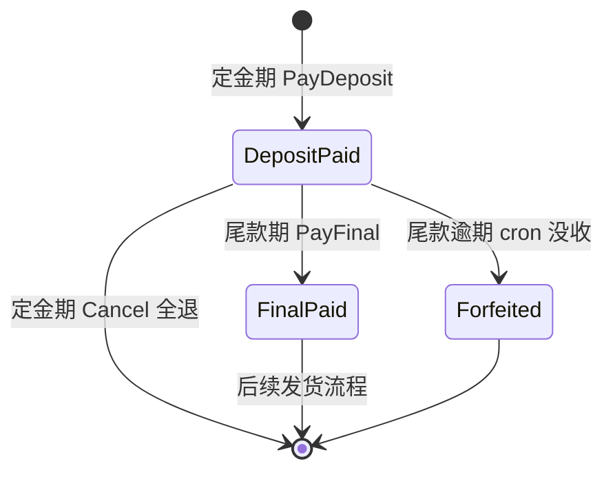
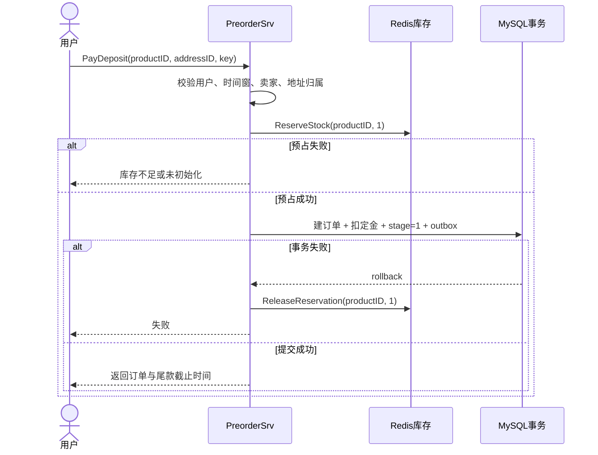

# 预售定金：把时间承诺写进状态机

> 预售不是“订单多一个字段”。平台先收定金、过几天再收尾款，还要处理取消、逾期与库存占用；任何一步认错时间或状态，都可能变成资损与客诉。

## 课堂节奏（60 分钟以内）

| 时间 | 内容 | 课堂产出 |
|---:|---|---|
| 0–7 分钟 | 为什么拆定金和尾款 | 看懂预售的业务约束 |
| 7–17 分钟 | 三个时间窗口与双状态 | 能画出订单生命周期 |
| 17–30 分钟 | 支付定金 | 理解预占库存与跨资源补偿 |
| 30–42 分钟 | 支付尾款 | 理解扣款、扣库存和状态推进 |
| 42–49 分钟 | 取消与逾期没收 | 知道条件更新怎样挡竞态 |
| 49–55 分钟 | Outbox 与故障边界 | 分清事务内事实和事务后清理 |
| 55–60 分钟 | 演示、复盘 | 用一个订单走完状态机 |

只演示一条正常链路。法律条文、运营漏斗、压测和客服话术放到课后阅读。

---

## 一、为什么一笔订单要付两次钱

预售把交易拆成两次承诺：定金确认购买意愿，商家据此备货；尾款付清后，订单才进入待发货。用户获得稀缺商品的名额，但也接受错过尾款窗口可能损失定金的规则。

代码必须回答四个问题：

- 现在是否允许付定金或尾款；
- 同一订单当前走到了哪一步；
- 定金期占住的库存何时真正扣除，何时释放；
- 重复请求或定时任务撞在一起时，谁能推进状态。

这些问题分别落到时间窗、`preorder_stage`、两桶库存和条件更新。

---

## 二、时间窗与双状态

`internal/preorder/model.go` 定义了三个半开区间：

```text
[DepositStartAt, DepositEndAt)  允许付定金
[DepositEndAt, FinalEndAt)      允许付尾款
[FinalEndAt, +∞)                未付尾款订单可被没收定金
ShipAt                          只用于展示预计发货时间
```

半开区间避免边界时刻同时属于两个阶段。在 `DepositEndAt` 那一刻，付定金已经关闭，付尾款刚刚开放。

订单用了两个维度：

| `order.type` | `preorder_stage` | 业务状态 |
|---|---:|---|
| `WaitPay` | `0` | 普通待付款或尚未进入预售阶段 |
| `WaitPay` | `1` | 定金已付，等待尾款 |
| `WaitShip` | `2` | 尾款已付，等待发货 |
| `Closed` | `3` | 逾期未付尾款，定金没收 |

为什么定金付完后 `type` 仍是 `WaitPay`？现有订单消费者只认通用订单类型，保持 `WaitPay` 可以兼容旧逻辑；预售子阶段再用 `preorder_stage` 表达。



---

## 三、付定金：先占库存，再做数据库事务

`PayDeposit` 的真实顺序是：

1. 从登录上下文取用户，校验支付密码长度和定金时间窗；
2. 从商品表解析卖家，并确认收货地址属于当前用户；
3. Redis 执行 `ReserveStock(productID, 1)`；
4. MySQL 同一事务创建订单、扣定金、推进阶段并写 outbox。

客户端传来的 `boss_id` 不可信，收款人必须由商品归属决定；`address_id` 也要核对所有权。这不是输入校验小节，而是防止用户把钱转给任意账户或使用别人的地址。



事务主体保留成一段代码看：

```go
err = dao.NewDBClient(ctx).Transaction(func(tx *gorm.DB) error {
    if err := order.NewOrderDaoByDB(tx).CreateOrder(ord); err != nil {
        return err
    }
    if err := debitUser(tx, u.Id, bossID, req.Key,
        pp.DepositCents, ord.ID, money.BizTypePreorderDeposit); err != nil {
        return err
    }
    ok, err := NewPreorderDaoByDB(tx).MarkDepositPaid(tx, ord.ID, now)
    if err != nil || !ok { return errors.New("预售阶段推进失败") }
    return outbox.NewOutboxDaoByDB(tx).Insert(/* PreorderDepositPaid */)
})
if err != nil {
    _ = cache.ReleaseReservation(ctx, req.ProductID, 1)
    return nil, err
}
```

数据库事务失败后要释放 Redis 预占，这是 Saga 补偿。当前实现若释放失败只记日志，因此仍需后台重试或库存对账才能闭环。

---

## 四、付尾款：数据库事实先提交，Redis 后清理

`PayFinal` 先按“订单 id + 当前用户”读取订单，拒绝不存在、已没收或未付定金的订单；随后校验当前时间位于尾款窗口。

数据库事务内完成四件事：扣尾款、条件扣减商品库存、把 `preorder_stage` 从 1 推到 2 并把订单改为 `WaitShip`、写 `PreorderFinalPaid` outbox。

```go
err = baseDao.DB.Transaction(func(tx *gorm.DB) error {
    if err := debitUser(tx, u.Id, ord.BossID, req.Key,
        pp.FinalCents, ord.ID, money.BizTypePreorderFinal); err != nil {
        return err
    }
    ok, err := product.NewProductDaoWithDB(tx).
        DeductStock(ord.ProductID, ord.Num)
    if err != nil || !ok { return errors.New("存在超卖问题") }

    ok, err = NewPreorderDaoByDB(tx).MarkFinalPaid(tx, ord.ID, now)
    if err != nil || !ok { return errors.New("尾款状态推进失败") }
    return outbox.NewOutboxDaoByDB(tx).Insert(/* PreorderFinalPaid */)
})
```

事务成功后，代码再调用 `CommitReservation`，把 Redis 的 `reserved` 减掉。若这个清理失败，代码记录错误但不回滚数据库；钱、订单状态和商品库存都已在一个事务中落定，不能为了缓存清理失败把已成功交易倒回去。

这里要提醒学生：`CommitReservation` 失败会留下 Redis 脏账，必须靠对账处理。所谓“数据库是真相”不代表缓存可以不修。

---

## 五、取消和逾期：同一状态只能被一个动作拿走

### 定金期内取消

只有 `preorder_stage == DepositPaid` 且当前仍在定金窗口，用户才能取消。事务内退回定金、把订单关掉并写 `PreorderCancelled` outbox；提交后再 `ReleaseReservation`。

### 尾款逾期没收

`ForfeitDepositsForUnpaidFinals` 扫描已经超过 `FinalEndAt`、阶段仍停在 `DepositPaid` 的订单。条件更新把阶段推进为 `Forfeited`，订单改为 `Closed`，随后释放预占库存。定时任务会重复扫描，因此条件更新既是状态机，也是幂等门闩。

竞态问题发生在尾款截止附近：用户请求付尾款，cron 同时尝试没收。双方都必须用“期望旧状态”为条件更新，数据库最终只允许一个动作成功；不能先在应用层读到 stage=1，就假定自己必然拥有推进权。

课堂追问：若尾款扣款先发生、状态条件更新却失败，钱会怎样？它们位于同一 MySQL 事务，返回错误会整体回滚。

---

## 六、Outbox 解决了什么，没解决什么

预售会写四类事件：定金支付、尾款支付、取消、逾期没收。它们与对应的订单和资金变化同事务写入 outbox，后台再投递给消息系统。

这样能避免“数据库已经扣钱，进程却在发消息前崩溃”。但 Outbox 不负责 Redis：库存预占发生在事务前，`commit / release` 发生在事务后，所以这两段仍是最终一致，需要补偿和对账。

把边界记成一张表：

| 动作 | 是否在 MySQL 事务内 | 失败处理 |
|---|---|---|
| 订单、资金、阶段、outbox | 是 | 一起回滚 |
| 定金前 Redis reserve | 否 | DB 失败后 release |
| 尾款后 Redis commit | 否 | 记日志，后续对账 |
| 取消/没收后 Redis release | 否 | 记日志，后续对账 |

---

## 七、课堂演示（5 分钟）

准备一个处于定金窗口的预售商品，完成“付定金 → 查询订单 → 付尾款”即可。录制时在每一步只观察三项：

```text
order.type
order.preorder_stage
stock:reserved:{productID}
```

预期变化：

```text
付定金前             尚无订单 / reserved=0
付定金               WaitPay / 1 / reserved=1
付尾款               WaitShip / 2 / reserved=0
```

若不方便修改系统时间，把预售配置的三个时间点设为几分钟内可跨越的窗口。不要手改订单状态，否则会绕过本节想展示的条件更新。

---

## 八、60 秒收束

- 时间窗决定“现在允许做什么”，`preorder_stage` 决定“这笔订单已经做过什么”。
- 定金期只预占 Redis 库存；尾款成功后，MySQL 真扣商品库存，再清理 `reserved`。
- 订单、资金、阶段和 outbox 放在同一事务；Redis 在事务外，用补偿与对账兜底。
- 取消和逾期没收争抢同一个旧状态，条件更新保证只有一方成功。

## 课后延伸（不计入 60 分钟）

- 阅读 `internal/preorder/service.go` 的取消与没收实现，列出每个失败点的业务结果。
- 为 `DepositEndAt`、`FinalEndAt` 两个边界补测试，证明半开区间没有重叠。
- 设计 Redis `commit / release` 失败后的对账任务。
- 结合当地法律与平台协议审查“定金不退”文案；代码注释不是法律意见。

## 代码索引

| 主题 | 文件 |
|---|---|
| 预售配置与阶段常量 | `internal/preorder/model.go` |
| 定金、尾款、取消、没收 | `internal/preorder/service.go` |
| 条件更新 | `internal/preorder/repo.go` |
| HTTP 入口 | `internal/preorder/handler.go`、`internal/preorder/routes.go` |
| 两桶库存 | `repository/cache/inventory.go` |
