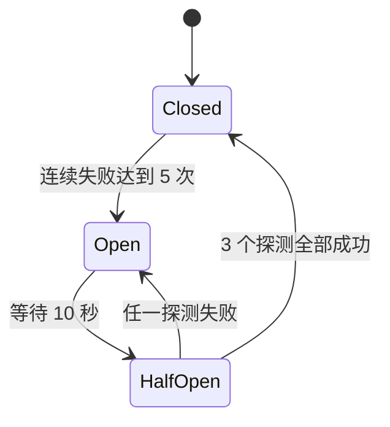
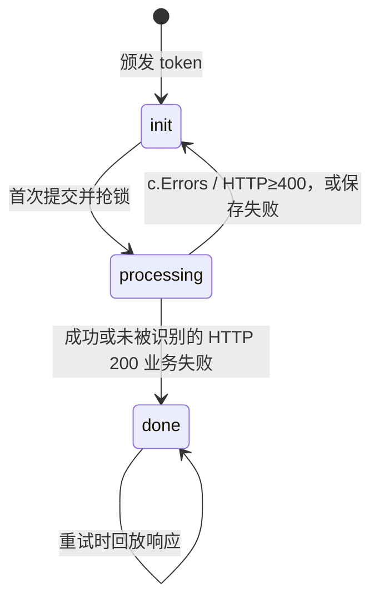
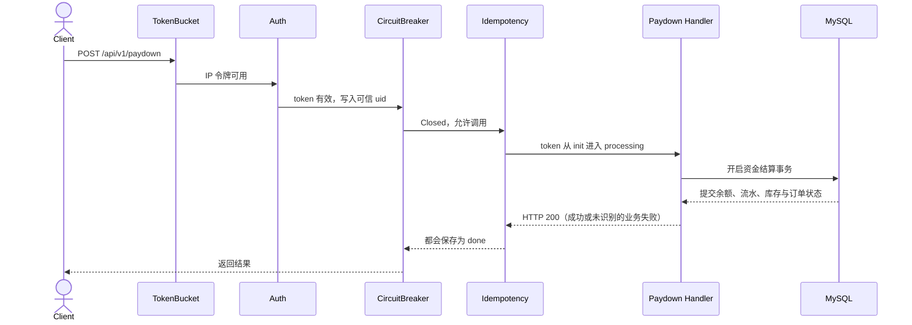

# 接入层护栏（下）：交易请求怎样扛住洪峰、故障和重试

> 用户只点了一次“支付”，客户端却可能因超时重试；支付服务也可能已经故障，而流量还在继续进入。交易入口要分清三件事：控制业务频率、停止向故障点施压、阻止同一副作用重复发生。

## 本讲目标

讲完后，学生应该能：

- 区分 SlidingWindow、CircuitBreaker 与 Idempotency 的故障对象；
- 读懂三态熔断和幂等状态机的关键分支；
- 画出 `/api/v1/paydown` 的真实中间件顺序，并解释顺序的影响；
- 通过一次重复支付演示验证响应回放，同时识别 HTTP 200 业务失败造成的误判。

## 课堂节奏（约 49 分钟）

| 时间 | 内容 | 课堂问题 |
|---:|---|---|
| 0–5 分钟 | 一次支付为何会变成两次请求 | 网络重试会制造什么副作用 |
| 5–13 分钟 | Redis SlidingWindow | 如何跨实例限制业务频率 |
| 13–23 分钟 | CircuitBreaker | 下游已坏时为何要暂停调用 |
| 23–35 分钟 | Idempotency | 同一张票怎样只执行一次 |
| 35–43 分钟 | 真实 paydown 链路 | 四层护栏按什么顺序运行 |
| 43–48 分钟 | 重复支付演示 | 第二次请求为何直接回放 |
| 48–49 分钟 | 收束 | 能否为故障选择正确工具 |

正常讲解约 45–49 分钟，留出的时间可讨论 HTTP 状态码改造。上讲的洋葱、Auth 和 TokenBucket 只在真实链路中引用，不再重复讲实现。

---

## 一、支付按钮只点一次，请求也可能来两次

一种常见现场：服务端已经扣款并提交事务，但响应在网络中丢了。客户端看到超时，只能重试。如果服务端把第二次请求当成新支付，用户会被重复扣款。

另一种故障发生在流量侧。红包开抢的一秒内，单个用户可能快速点击；某个支付依赖已经连续失败，应用却仍把新请求送过去。它们看似都是“请求太多”，处理办法并不相同：

| 问题 | 保护对象 | gomall 中的办法 |
|---|---|---|
| 某用户或 IP 操作过频 | 具体业务规则 | Redis SlidingWindow |
| 下游连续故障 | 连接、goroutine 与故障服务 | CircuitBreaker |
| 同一交易被重试 | 不可重复的副作用 | Idempotency + 数据库唯一约束 |

先辨认故障对象，再选中间件。

---

## 二、SlidingWindow：跨实例执行同一条业务限额

TokenBucket 在每个应用进程内按 IP 粗筛流量；滑动窗口把状态放进 Redis，用于“登录每个 IP 每分钟最多 10 次”“红包每个用户每秒最多 3 次”这类业务规则。

```go
public.POST("user/login",
    middleware.SlidingWindow(middleware.SlidingWindowOption{
        Scope: "login", Window: time.Minute, Limit: 10, ByUser: false,
    }),
    UserLoginHandler())

authed.POST("redpacket/claim",
    middleware.SlidingWindow(middleware.SlidingWindowOption{
        Scope: "redpacket", Window: time.Second, Limit: 3, ByUser: true,
    }),
    middleware.Idempotency(),
    ClaimRedPacketHandler())
```

Redis key 由 `Scope + 用户或 IP` 组成。Lua 脚本在一次原子操作中删除窗口外成员、计算当前数量，再决定是否写入本次时间点；所有应用实例因此共享同一个计数。

```text
删除 now-window 以前的记录
        ↓
统计 ZSet 当前成员数
        ↓
未超限：写入 now + 随机后缀，并设置 TTL
已超限：拒绝，不写入
```

随机后缀很要紧，同一毫秒的两个请求不能用同一个 ZSet member 相互覆盖。

Redis 出错时，当前实现记录日志后继续 `c.Next()`，也就是 fail-open。这样 Redis 故障不会让登录和交易全部停摆，但业务限频暂时消失；告警若没跟上，攻击流量会直接进入后端。对某些高风险接口也可以选择 fail-closed，这属于可用性和风险承受的业务决策。

---

## 三、CircuitBreaker：下游已经坏了，先别继续压

熔断器不限制正常请求数量。它观察失败：Closed 状态下连续失败达到阈值后进入 Open，Open 期间快速拒绝；等待一段时间，再放少量 HalfOpen 探测。



`/paydown` 明确传入的参数是失败阈值 5、打开 10 秒、半开最多 3 个请求。中间件在调用下游前执行 `allow()`，回来后报告结果：

```go
gen, err := cb.allow()
if err != nil {
    response.Fail(c, e.New(e.ErrCircuitOpen))
    c.Abort()
    return
}

c.Next()
failed := len(c.Errors) > 0 || c.Writer.Status() >= http.StatusInternalServerError
cb.report(failed, gen)
```

半开探测还携带 `generation` 代际号。上一轮请求若很晚才返回，它的报告不应污染新一轮状态；代际不一致时，熔断器直接忽略这份迟到结果。

### 熔断器目前看不见多数业务失败

`response.Fail` 把错误写成 HTTP 200，payment handler 也没有调用 `c.Error(err)`。熔断器只观察 `c.Errors` 和 HTTP 5xx，因此“余额不足”“订单状态错误”等业务失败都被当成成功报告。

而且当前余额支付完全在本地数据库事务中完成，并未调用真实外部支付网关。这里的 CircuitBreaker 更像教学预留；若将来接入外部资金服务，应让下游故障以 5xx 或 `c.Error` 进入熔断统计，同时把“余额不足”这类可预期拒绝排除，否则用户输错密码也可能把线路熔断。

---

## 四、Idempotency：同一张票只允许一次副作用

客户端先申请一个 5 分钟有效的随机 token，提交交易时将它放进 `Idempotency-Key`。Redis key 同时包含用户 id，所以不同用户即便碰巧拿到相同 token，也不会共用状态。

幂等 Lua 状态机给出四种结果：

| 状态 | 中间件动作 |
|---|---|
| token 不存在或过期 | 拒绝 |
| `init` 且成功抢到锁 | 标记 `processing`，进入 handler |
| `processing` | 返回“请求正在处理中” |
| `done` | 回放第一次响应，并设置 `X-Idempotent-Replay: true` |



中间件录下响应体。handler 返回后，它决定保存结果还是释放锁：

```go
c.Next()
if len(c.Errors) > 0 || recorder.Status() >= http.StatusBadRequest {
    releaseIdempotencyLock(key)
    return
}
commitIdempotencyResult(key, recorder.body.String())
```

提交 Redis 结果最多重试 3 次；仍失败就回退到 `init`，避免 token 长时间卡在 `processing`。但业务副作用可能已经提交，此时再次放行仍有重复风险，所以余额支付还用数据库流水唯一约束 `(ref_order_id, direction, biz_type)` 兜底扣款和入账。Redis 幂等改善重试体验，数据库约束守住最终副作用，两层不能互换。

### 同一个 HTTP 200 缺口再次出现

幂等中间件把“没有 `c.Errors` 且 HTTP 状态小于 400”视为成功。`response.Fail` 返回 HTTP 200，又不写 `c.Errors`，因此支付密码错误等失败响应也会被保存为 `done`；下一次使用同一 token，只会回放失败，不能重新提交。

修复时应让中间件基于可靠的成功信号提交结果。可以统一 HTTP 状态码，也可以由 handler 显式设置业务成功标记；只解析 JSON 会让中间件与响应格式紧耦合。

---

## 五、真实 `/api/v1/paydown` 链路

组合根和支付路由共同排出当前顺序：

```text
Client
  → Logger（gin.Default）
  → Recovery（gin.Default）
  → TokenBucket（全局，按 IP）
  → CORS
  → Jaeger
  → Session
  → AuthMiddleware（authed 路由组）
  → CircuitBreaker（单路由）
  → Idempotency（单路由）
  → OrderPaymentHandler
```

后面的时序图省略 Logger、Recovery、CORS、Jaeger 和 Session，只展开会改变交易放行结果的业务护栏。



顺序会改变系统行为：熔断位于幂等外层，所以命中 `done` 的回放也会经过熔断器；Open 状态则会在幂等回放之前拒绝请求。若希望已完成交易在下游故障期间仍能回放，可以讨论交换二者，但必须重新分析哪些响应应计入熔断统计。

handler 内部不是简单的“减余额”：

1. 从可信 context 取得买家 id，按 `order_id + buyer_id` 查询订单；
2. 检查待支付状态，按用户 id 顺序锁住买卖双方，避免反向支付形成锁环；
3. 校验支付密码和余额，在同一事务更新双方余额并追加借贷流水；
4. 扣库存、标记订单已付、转移商品归属并写 outbox，提交后再尽力同步 Redis 预留量。

幂等中间件守住入口，事务和唯一流水守住数据库，二者共同处理“响应丢了但扣款已成功”的难题。

---

## 六、课堂演示：同一个 token 支付两次

录制前准备一个属于当前用户的待付款订单，并确认测试支付密钥长度与内容正确。先取得幂等 token：

```bash
curl -i 'http://localhost:5002/api/v1/idempotency/token' \
  -H 'access_token: ...' \
  -H 'refresh_token: ...'
```

响应中的字段是 `data.idempotency_key`，TTL 为 300 秒。复制它发起支付：

```bash
curl -i -X POST 'http://localhost:5002/api/v1/paydown' \
  -H 'access_token: ...' \
  -H 'refresh_token: ...' \
  -H 'Idempotency-Key: 复制上一步返回值' \
  -H 'Content-Type: application/json' \
  -d '{"order_id":42,"key":"测试支付密钥"}'
```

原样执行第二次 paydown。第二次应出现：

```text
X-Idempotent-Replay: true
```

并回放第一次 JSON，handler 不再扣款。演示完成后查看订单状态与两条资金流水，说明真正的最后防线仍在数据库事务和唯一索引。

若时间允许，再用错误支付密钥和一个新 token 重复两次。第二次也会出现 replay，这不是正确的“失败幂等”，而是 HTTP 200 业务失败被错误提交为 `done` 的现场证据。

---

## 七、一分钟收束

- SlidingWindow 管具体主体在时间窗口内的操作频率，并借 Redis 跨实例共享状态。
- CircuitBreaker 在故障连续发生时暂停调用，不负责防重复交易。
- Idempotency 负责请求重试，数据库事务和唯一约束负责副作用的最后一致性。
- 当前统一 HTTP 200 让三类判断都失真：熔断看不见业务失败，幂等会缓存失败，公开 GET 还可能缓存错误响应。HTTP 语义必须成为接口设计的一部分。

## 课后延伸（不计入课堂时间）

- 修改支付错误出口，让“下游故障”和“用户输入错误”分别进入不同 HTTP 状态，再验证熔断统计。
- 画出“数据库已提交、Redis done 保存失败、客户端重试”的链路，指出唯一流水如何兜底。
- 比较 `SlidingWindow` 的 fail-open 与 fail-closed，分别列出适合的业务场景。
- 调换 `/paydown` 中 CircuitBreaker 与 Idempotency 的顺序，写出 Open 状态下已完成请求能否回放。

## 代码索引

| 主题 | 文件 |
|---|---|
| 滑动窗口与 Lua | `middleware/ratelimit.go`、`repository/cache/ratelimit.go` |
| 熔断器 | `middleware/circuitbreaker.go` |
| 幂等状态机 | `middleware/idempotency.go`、`repository/cache/idempotency.go` |
| token 颁发 | `internal/idempotency/handler.go`、`internal/idempotency/routes.go` |
| 支付挂载顺序 | `routes/router.go`、`internal/payment/routes.go` |
| handler 与支付事务 | `internal/payment/handler.go`、`internal/payment/service.go` |
| 统一响应 | `internal/shared/response/handler.go` |
