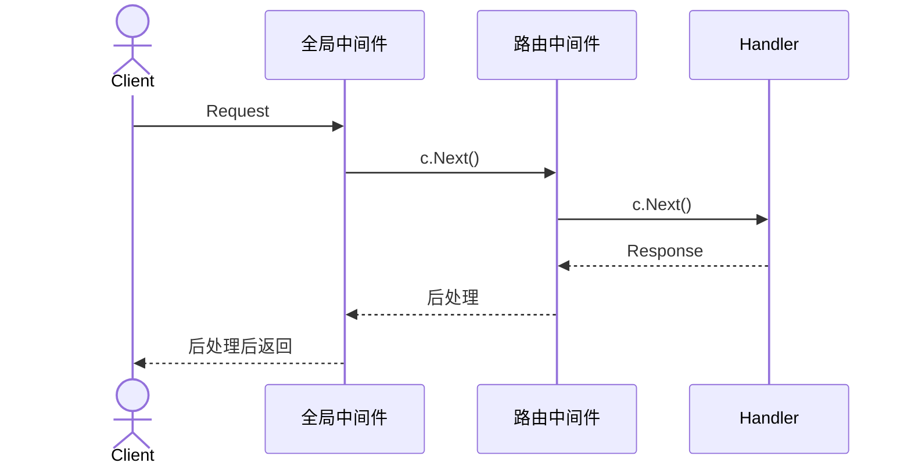
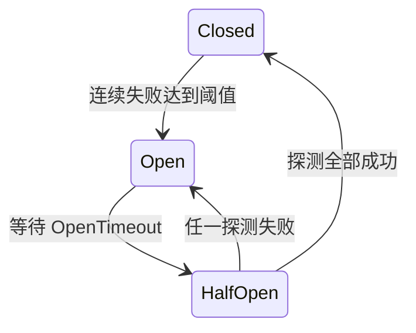
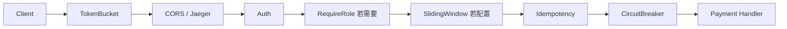

# 接入层护栏：一次请求怎样穿过中间件

> 中间件的价值不是“少写几行重复代码”，而是把鉴权、限流、幂等和缓存放在统一入口，让每个业务 handler 在同一套规则下运行。

## 课堂节奏（60 分钟以内）

| 时间 | 内容 | 学生要带走的判断 |
|---:|---|---|
| 0–8 分钟 | 横切关注点与洋葱模型 | `c.Next()` 前后分别做什么 |
| 8–15 分钟 | 全局、分组、路由级挂载 | 中间件为何不能全挂全局 |
| 15–25 分钟 | 流量入口：TokenBucket 与 CORS | 哪些请求应尽早挡掉 |
| 25–36 分钟 | 身份入口：Auth 与 RequireRole | 认证、撤销、授权怎样分层 |
| 36–48 分钟 | 交易入口：滑窗、熔断、幂等 | 三种保护解决不同故障 |
| 48–55 分钟 | 只读入口：HTTPCache 与追踪 | 缓存和观测为何不改变业务事实 |
| 55–60 分钟 | 演示、链路复盘 | 能为一个新接口选择中间件 |

课堂只做一个链路演示。各算法的完整实现、参数压测与改造题放到课后。

---

## 一、先理解洋葱：代码顺序不是返回顺序

假设没有中间件，每个 handler 都要手写跨域头、读取 token、检查角色、记录耗时。规则一改，就要寻找所有副本；漏掉一个后台接口，权限墙便开了洞。

Gin 中间件把这类横切逻辑包在 handler 外面：

```go
func Audit() gin.HandlerFunc {
    return func(c *gin.Context) {
        start := time.Now()       // 请求阶段
        c.Next()                  // 进入下一层
        cost := time.Since(start) // 响应阶段
        log.Println(c.FullPath(), c.Writer.Status(), cost)
    }
}
```

若注册顺序是 `A → B → Handler`，实际执行是 `A前 → B前 → Handler → B后 → A后`。鉴权和限流通常在 `c.Next()` 前拒绝请求；耗时统计、响应录制和 ETag 需要等下游写完响应，所以在它后面工作。



`c.Abort()` 只阻止尚未执行的后续 handler，当前函数仍会继续；因此拒绝后通常紧跟 `return`。

---

## 二、挂载位置就是业务范围

中间件有成本，也有语义。给商品查询强制登录会破坏公开浏览；给下单响应加 HTTP 缓存更可能返回别人的交易结果。

| 层级 | 适合的规则 | gomall 中的例子 |
|---|---|---|
| 全局 | 每个请求都需要 | TokenBucket、CORS、Jaeger |
| 路由组 | 一类身份共享 | `authed` 的 Auth，merchant/admin 的 RequireRole |
| 单路由 | 只属于某个业务动作 | 登录/秒杀滑窗、支付熔断、下单与支付幂等、商品读取缓存 |

为新接口选中间件时先问业务问题：谁能调用，会不会重试，是否调用脆弱下游，响应能否公开缓存。不要从“项目里有哪些中间件”倒推全部挂上。

---

## 三、流量入口：先挡无效流量

### TokenBucket：允许短突发，限制持续洪峰

路由全局使用按 IP 的令牌桶：

```go
r.Use(middleware.TokenBucket(rate.Limit(100), 200))
```

桶按每秒 100 枚补充，最多存 200 枚。正常用户短时间连点可以消耗积攒的令牌；持续洪峰最终只能以 100 请求/秒进入后端。拿不到令牌时，中间件写错误响应、`Abort` 并返回，业务 handler 不会运行。

实现为每个 IP 保存一个 limiter。IP 基数没有上限，所以代码还需定时删除长时间未访问的条目；否则保护服务的 map 反而会吃光内存。

这是一套单实例状态。多个应用实例各有自己的桶，全站上限会随实例数增加。需要全局精确配额时，应使用共享存储或网关限流。

### CORS：只给允许的浏览器来源发通行证

CORS 不是后端身份认证，它告诉浏览器哪些网页来源可以读取响应。gomall 从配置白名单匹配 `Origin`，命中才回显：

```go
if origin != "" && isAllowedOrigin(origin) {
    c.Header("Access-Control-Allow-Origin", origin)
    c.Header("Vary", "Origin")
    c.Header("Access-Control-Allow-Credentials", "true")
}
```

允许凭证时不能使用 `Access-Control-Allow-Origin: *`。`Vary: Origin` 告诉代理缓存：不同来源的响应头可能不同。浏览器的 `OPTIONS` 预检由中间件直接回答，不必进入业务。

非浏览器客户端不会受同源策略约束，所以 CORS 不能代替 Auth、签名或 CSRF 防护。

---

## 四、身份入口：认证与授权分开

### AuthMiddleware：身份只能来自 token

鉴权中间件读取 access/refresh token，解析 claims，再把可信用户 id 放进请求 context。后续业务从 `ctl.GetUserInfo(ctx)` 读取身份，不信 body 中的 `user_id`。

JWT 签发后本来无法主动撤销。gomall 在 claims 中保存 `TokenVersion`，每次请求与用户当前版本比较；改密码或强制下线时提升版本号，旧 token 随即失效。

版本查询带短 TTL 的进程内缓存。查询函数未注入或查询失败时选择 fail-closed：宁可拒绝，也不能悄悄跳过撤销检查。多实例缓存与短暂竞态是当前边界，升级可选 Redis 或失效广播。

### RequireRole：登录不等于有后台权限

路由组逐层收紧：

```text
public
  └── authed       AuthMiddleware
        ├── merchant  RequireRole(merchant, admin)
        └── admin     RequireRole(admin)
```

角色查询同样从 context 中的可信 user id 出发。`RequireRole` 接受允许角色集合，角色不在集合就拒绝。

中间件包没有直接 import 用户领域包，而是声明 `SetRoleLookup`、`SetTokenVersionLookup` 让组合根注入查询函数。原因很实际：领域路由依赖中间件，如果中间件反向 import 领域包，Go 会形成循环依赖。

课堂对比：Auth 回答“你是谁”，RequireRole 回答“你能否做这件事”。不要把角色字段塞回请求体再让业务自己相信。

---

## 五、交易入口：限流、熔断与幂等各管一件事

### SlidingWindow：按业务维度做分布式限流

登录要按 IP 限制密码尝试，秒杀和红包要按用户限制操作频率。滑动窗口把请求时间写进 Redis ZSet，用 Lua 原子完成删除过期记录、计数和写入，因此多个应用实例共享同一个窗口。

```go
middleware.SlidingWindow(middleware.SlidingWindowOption{
    Scope:  "seckill",
    Window: time.Second,
    Limit:  3,
    ByUser: true,
})
```

它与全局 TokenBucket 不重复：前者保护具体业务规则并跨实例，后者用很低的本地成本削掉全站洪峰。

当前实现遇到 Redis 错误会记录日志后放行，也就是 fail-open。这样不会因限流依赖故障让登录和交易全部停摆，但失去了业务限流；监控必须立刻发现这次降级。

### CircuitBreaker：下游已经坏了，就暂停继续施压

支付调用外部网关。若下游持续 5xx，继续把每个请求压过去会占满连接和 goroutine。熔断器有三态：



默认参数是连续失败 5 次、打开 10 秒、半开最多 3 个探测请求。中间件在 `c.Next()` 后把 `c.Errors` 或 HTTP 5xx 视为失败；业务若始终用 HTTP 200 包装失败，必须通过 `c.Errors` 报告，否则熔断器看不见。

实现还带 `generation` 代际号，忽略上一轮探测迟到的回报，防止旧失败污染已经恢复的新一轮状态。

### Idempotency：同一张票只能产生一次副作用

客户端先取得幂等 token，提交交易时放进 `Idempotency-Key`。中间件将用户 id 与 token 组成 Redis key，状态机返回四种结果：

| 状态 | 行为 |
|---|---|
| token 不存在或过期 | 拒绝 |
| `init` 并成功抢锁 | 执行业务 |
| `processing` | 告知请求处理中 |
| `done` | 回放上次响应并设置 `X-Idempotent-Replay: true` |

```go
state, cached, err := cache.AcquireIdempotencyLock(ctx, key)
// done: 回放 cached；processing: 拒绝；拿到锁: c.Next()
c.Next()
if len(c.Errors) > 0 || recorder.Status() >= http.StatusBadRequest {
    releaseIdempotencyLock(key)
    return
}
commitIdempotencyResult(key, recorder.body.String())
```

响应成功后，中间件最多重试 3 次提交结果；仍失败便把状态退回 `init`，避免 token 永久卡在 `processing`。这里还有一个设计边界：如果业务副作用已成功，但幂等结果始终未保存，允许同 token 重试仍可能再次触发业务，因此真正的资金操作还应有数据库唯一约束或业务流水号兜底。

---

## 六、只读入口与观测

### HTTPCache：304 省响应体，不省业务计算

只读公开接口可挂 `HTTPCache(maxAge)`。它先用 buffer 录下下游响应，计算 SHA-256 前 16 字节生成弱 ETag；客户端下次带相同 `If-None-Match` 时返回 304，不再发送 body。

```go
c.Writer = buf
c.Next()                    // handler 已经执行
etag := weakETag(buf.body.Bytes())
if c.GetHeader("If-None-Match") == etag {
    original.WriteHeader(http.StatusNotModified)
    return
}
```

因为 ETag 在 `c.Next()` 后计算，304 只节省网络传输，数据库和业务计算已经发生。中间件仅处理 GET/HEAD 且 HTTP 状态为 200 的响应；项目不少业务错误也使用 HTTP 200，它们可能被当成可缓存响应，这是接口状态码约定与缓存策略共同造成的边界。

### Jaeger：观测失败不该阻断交易

Jaeger 中间件从 `uber-trace-id` 接续上游 span，把 span 放进 context，结束时记录耗时。客户端给出畸形 trace header 时，代码降级创建本地 span，而不是让请求失败。追踪属于观测能力，缺一条链路比多一次交易 500 更可接受。

---

## 七、把一条支付请求串起来



顺序不是固定模板，但依赖必须成立：按用户限流前要先拿到可信用户；幂等需要用户身份；熔断包住真正调用下游的 handler；HTTP 缓存只挂公开只读接口，不进入支付链。

## 八、课堂演示（5 分钟）

选择一个带幂等保护的测试接口，用同一个用户和同一个 `Idempotency-Key` 连续请求两次：

```bash
curl -i -X POST http://localhost:3000/api/v1/your-route \
  -H 'access_token: ...' \
  -H 'Idempotency-Key: demo-001' \
  -H 'Content-Type: application/json' \
  -d '{...}'
```

第一次应正常执行业务；第二次应带 `X-Idempotent-Replay: true` 并回放结果。随后换一个 key，确认业务再次执行。接口路径和请求体必须根据本地路由准备，不要在录制现场猜。

---

## 九、60 秒收束

- `c.Next()` 把请求送进下一层，返回后才能观察或改写响应。
- 全局、分组、路由级是业务范围，不是代码摆放偏好。
- Auth 建立身份，RequireRole 做授权；失败方向偏向拒绝。
- TokenBucket、滑窗、熔断、幂等分别处理洪峰、业务频率、下游故障和重复副作用，不能互相替代。
- HTTPCache 当前只省响应体；Jaeger 出错则降级，不应拖垮业务。

## 课后延伸（不计入 60 分钟）

- 阅读 `middleware/ratelimit.go`，解释清理 goroutine 怎样限制 map 规模。
- 为熔断器画出迟到回报场景，说明 `generation` 为什么存在。
- 给幂等交易增加数据库唯一业务号，验证 Redis 提交失败时仍不会重复扣款。
- 比较商品接口首次 200 与随后 304 的服务端耗时，证明当前 ETag 不省回源计算。

## 代码索引

| 主题 | 文件 |
|---|---|
| 全局限流、CORS、追踪 | `middleware/ratelimit.go`、`middleware/cors.go`、`middleware/track.go` |
| 鉴权与角色 | `middleware/jwt.go`、`middleware/rbac.go` |
| 滑动窗口 | `middleware/ratelimit.go`、`repository/cache/ratelimit.go` |
| 熔断 | `middleware/circuitbreaker.go` |
| 幂等 | `middleware/idempotency.go`、`repository/cache/idempotency.go` |
| HTTP 缓存 | `middleware/httpcache.go` |
| 组合与挂载 | `routes/router.go`、各领域 `routes.go` |
