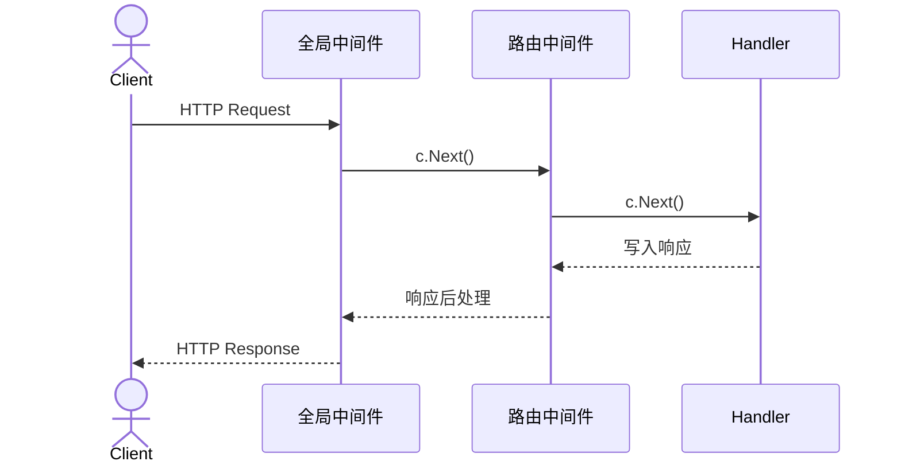

# 接入层护栏（上）：请求怎样安全进入业务

> 这一讲只回答一个问题：请求到达 handler 以前，系统怎样限制流量、确认身份、检查权限，并避免把不该缓存的内容交给浏览器。

## 本讲目标

讲完后，学生应该能：

- 用洋葱模型解释 `c.Next()`、`c.Abort()` 和响应后处理；
- 根据业务范围选择全局、路由组或单路由挂载；
- 说清 TokenBucket、Auth、RBAC 和 HTTP cache 各挡什么；
- 为一个新接口排出基本中间件顺序，并指出项目的 HTTP 200 业务失败缺口。

## 课堂节奏（约 46 分钟）

| 时间 | 内容 | 课堂问题 |
|---:|---|---|
| 0–5 分钟 | 为什么 handler 前面需要护栏 | 哪些规则不该散落在业务代码里 |
| 5–12 分钟 | 洋葱模型 | `c.Next()` 前后有什么区别 |
| 12–19 分钟 | 全局、分组、单路由挂载 | 挂载位置怎样表达业务范围 |
| 19–26 分钟 | TokenBucket | 洪峰为何要尽早拒绝 |
| 26–38 分钟 | Auth 与 RequireRole | 身份和权限为什么要分开 |
| 38–44 分钟 | HTTPCache | 304 究竟省了什么 |
| 44–46 分钟 | 新接口选择题与收束 | 哪些中间件该挂，顺序如何排 |

内容按正常语速约 42–46 分钟；课堂追问可控制在 50 分钟内。滑动窗口、熔断和幂等放到下讲，避免一小时内塞进两套问题线。

---

## 一、先从一次越权请求看问题

假设商家修改商品的 handler 只做参数绑定和数据库更新。请求体里若带 `boss_id`，handler 能否直接相信？不能。攻击者可以换一个 id；即使 token 合法，也不代表他能修改别人的商品。

安全入口至少要逐层回答这些问题：

1. 这个 IP 是否正在持续灌流量？
2. token 对应谁，是否已经被撤销？
3. 这个人是否拥有商家角色？
4. 进入 handler 后，DAO 是否仍按资源归属限制更新？

前三项适合在中间件统一处理，最后一项必须留在业务和数据层。中间件能挡垂直越权，却不能代替 `WHERE boss_id = ?` 这样的水平越权检查。

---

## 二、洋葱模型：进去和回来不是同一个顺序

Gin 中间件不是一串只向前执行的过滤器。每次调用 `c.Next()`，控制权进入下一层；下游返回后，当前中间件才继续执行剩余代码。

```go
func Audit() gin.HandlerFunc {
    return func(c *gin.Context) {
        start := time.Now()       // 请求进入时
        c.Next()                  // 交给下一层
        cost := time.Since(start) // 响应已经写好
        log.Println(c.FullPath(), c.Writer.Status(), cost)
    }
}
```

若注册顺序是 `A → B → Handler`，执行顺序就是：

```text
A 前 → B 前 → Handler → B 后 → A 后
```

鉴权、授权和限流都要在 `c.Next()` 前决定是否放行；耗时统计、响应录制和 ETag 则要等下游返回。



`c.Abort()` 只阻止尚未运行的后续 handler，并不会立刻退出当前 Go 函数。所以拒绝分支通常写成：

```go
c.JSON(http.StatusOK, errorBody)
c.Abort()
return
```

漏掉 `return`，当前中间件仍会继续执行，后续代码可能修改本应结束的响应。

---

## 三、挂载层级就是规则的业务范围

gomall 在组合根中先挂全局规则，再建立逐层收紧的路由组：

```go
r.Use(middleware.TokenBucket(rate.Limit(100), 200))
r.Use(middleware.Cors(), middleware.Jaeger())
r.Use(sessions.Sessions("mysession", store))

v1 := r.Group("api/v1")
authed := v1.Group("/")
authed.Use(middleware.AuthMiddleware())

merchant := authed.Group("/")
merchant.Use(middleware.RequireRole("merchant", "admin"))

admin := authed.Group("/admin")
admin.Use(middleware.RequireRole("admin"))
```

```text
api/v1（匿名可访问）
└── authed（已登录）
    ├── merchant（merchant 或 admin）
    └── admin（仅 admin，路径带 /admin）
```

| 层级 | gomall 中的规则 | 为什么放这里 |
|---|---|---|
| 全局 | TokenBucket、CORS、Jaeger、Session | 每个动态请求都经过；越早拒绝越省资源 |
| 路由组 | Auth、RequireRole | 一批接口共享身份边界 |
| 单路由 | HTTPCache | 只有公开只读响应适合交给浏览器或 CDN 缓存 |

商品浏览不能强制登录，下单结果也不能公开缓存。中间件有运行成本，更有业务语义；不是“有就全挂上”。

---

## 四、TokenBucket：用很低的成本挡住持续洪峰

全局令牌桶按客户端 IP 建 limiter：

```go
r.Use(middleware.TokenBucket(rate.Limit(100), 200))
```

桶每秒补 100 枚令牌，最多存 200 枚。一个正常用户偶尔并发加载资源，可以消耗先前积攒的令牌；若脚本持续灌入，请求最终只能以约 100 次/秒进入后端。拿不到令牌时，中间件直接响应，handler、数据库和下游服务都不会运行。

关键实现只有两个判断：

```go
limiter := get(c.ClientIP())
if !limiter.Allow() {
    c.JSON(http.StatusOK, rateLimitBody)
    c.Abort()
    return
}
c.Next()
```

但这里还有两个边界：

- limiter 存在进程内，多实例各算各的；扩容后全站可通过的流量随实例数增加。
- IP 种类可能不断增长，因此代码每分钟清理超过 10 分钟未访问的条目，防止 map 无界占用内存。

它适合做便宜的入口粗筛，不适合表达“每个用户每分钟只能抢三次红包”这种跨实例业务规则。后者留到下讲的 Redis 滑动窗口。

---

## 五、Auth 与 RBAC：先证明是谁，再判断能做什么

### 5.1 AuthMiddleware 不相信请求体里的身份

Auth 读取 access token 和 refresh token，解析 claims，并把可信用户 id 写进请求 context：

```go
claims, err := util.ParseToken(newAccessToken)
// 省略错误分支与版本检查
c.Request = c.Request.WithContext(
    ctl.NewContext(c.Request.Context(), &ctl.UserInfo{Id: claims.ID}),
)
c.Next()
```

后续 service 使用 `ctl.GetUserInfo(ctx)` 取当前用户，不从 JSON 中接受任意 `user_id`。这是身份来源的边界。

JWT 签发后本来会一直有效到过期。gomall 在 claims 中保存 `TokenVersion`，每次请求将它与数据库中的当前版本比较；改密码或强制下线时提升版本，旧 token 随即不再匹配。

查询失败时实现选择 fail-closed，也就是拒绝请求。版本查询有 60 秒进程内缓存，并在版本提升时主动删除；代码仍注明一个竞态边界：一次跨越“读库、提升版本、删缓存、写回旧值”的请求，可能让旧版本短暂留到 TTL 到期。多实例还需要 Redis 或失效广播。

### 5.2 RequireRole 不重复做登录

登录只回答“你是谁”，角色检查回答“你能否进入这组接口”：

```go
user, err := ctl.GetUserInfo(c.Request.Context())
role, err := lookupRole(c.Request.Context(), user.Id)
if _, ok := allowSet[role]; !ok {
    c.JSON(http.StatusOK, permissionDeniedBody)
    c.Abort()
    return
}
c.Next()
```

角色查询带 30 秒进程内缓存，查询函数未注入或数据库失败时同样拒绝。`middleware` 包通过 `SetRoleLookup` 和 `SetTokenVersionLookup` 接收组合根注入的函数，没有反向 import `internal/user`；否则领域路由依赖 middleware，而 middleware 又依赖领域包，Go 会形成 import 环。

商家修改商品的完整防线因此有两面：路由组的 `RequireRole` 挡住普通用户，DAO 的资源归属条件挡住商家互改。只做任何一面都不够。

---

## 六、HTTPCache：304 省的是响应体，不是回源计算

公开商品接口按数据变化速度设置缓存时间：

```go
public.GET("product/list", middleware.HTTPCache(30*time.Second), handler)
public.GET("product/show", middleware.HTTPCache(60*time.Second), handler)
public.GET("category/list", middleware.HTTPCache(300*time.Second), handler)
public.GET("carousels", middleware.HTTPCache(300*time.Second), handler)
```

中间件先换掉 writer，等待 handler 写完响应，再计算弱 ETag：

```go
c.Writer = buf
c.Next() // handler 和数据库查询已经执行

etag := weakETag(buf.body.Bytes())
if c.GetHeader("If-None-Match") == etag {
    original.WriteHeader(http.StatusNotModified)
    return
}
```

客户端再次携带相同 `If-None-Match` 时会收到 304，不再下载 body；可是 `c.Next()` 已经跑完，所以数据库和序列化开销仍在。若目标是减少回源计算，还需 CDN、反向代理缓存或服务端结果缓存。

### 当前项目必须明说的缺口

`HTTPCache` 只看 HTTP 状态是否为 200。统一错误出口 `response.Fail` 也始终返回 HTTP 200，把业务错误放在 JSON 的 `status` 字段里。因此，一个“HTTP 200 + 业务失败”的 GET 响应也可能收到 ETag 和公开缓存头。

修复方向有两种：让 HTTP 状态表达失败，或让缓存中间件解析统一响应结构并只缓存业务成功。前一种让网关、监控和熔断器也能获得正确语义，代价是要统一改造客户端约定。

---

## 七、两分钟接口评审

给出一个“商家修改商品价格”的新接口，学生现场决定：

```text
TokenBucket → Auth → RequireRole(merchant, admin) → Handler
```

不挂 HTTPCache，因为它是写操作；DAO 仍要按 `product_id + boss_id` 更新，不能把资源归属交给角色中间件。

换成“公开读取分类列表”，链路变成：

```text
TokenBucket → HTTPCache → Handler
```

不用 Auth，也不能因为全站已经有 TokenBucket 就省掉业务自己的权限判断。

## 课后延伸（不计入课堂时间）

- 阅读 `middleware/cors.go` 和 `middleware/track.go`，说明 CORS、追踪与鉴权为何互不替代。
- 用两次带 `If-None-Match` 的请求比较服务端日志，验证当前 304 仍会执行 handler。
- 设计一次 token 版本缓存竞态，解释注释所说的 60 秒上界。
- 为商品更新接口写一张表，分别列出角色检查与资源归属检查的位置。

## 代码索引

| 主题 | 文件 |
|---|---|
| 全局挂载与分组 | `routes/router.go` |
| TokenBucket | `middleware/ratelimit.go` |
| Auth 与 token 版本 | `middleware/jwt.go` |
| RBAC | `middleware/rbac.go` |
| HTTP cache | `middleware/httpcache.go` |
| 公开缓存路由 | `internal/product/routes.go`、`internal/category/routes.go`、`internal/carousel/routes.go` |
